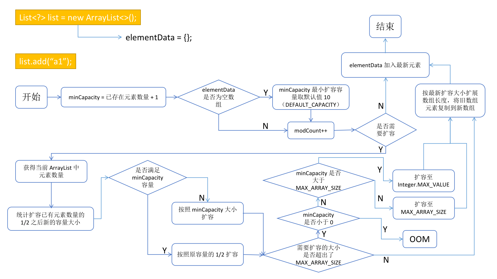

ArrayList 是 List 接口最常用的通用实现。
<!-- more -->
概述：
* 底层由一个 Object 数组维护
* 构造时会设置一个初始的容量，元素增加时会自动扩容
* 必要时：如元素为大对象，可手动缩容
* 线程不安全


# 变量与构造方法

```java
...

/**
 * ArrayList 默认的容量为 10 个 Object 元素
 */
private static final int DEFAULT_CAPACITY = 10;

private static final Object[] DEFAULTCAPACITY_EMPTY_ELEMENTDATA = {};

// 底层数据结构
transient Object[] elementData; // non-private to simplify nested class access

/**
 * 记录集合被修改的次数，每次 add 或者 remove 它的值都会加 1
 *
 * ArrayList 非线程安全，在使用迭代器遍历时，该变量用来检查列表中的元素是否发生结构性变化（列表元素数量发生改变）
 * 主要在多线程环境下需要使用，防止一个线程正在迭代遍历，另一个线程修改了这个列表的结构。
 * 不一致时会抛出异常 ConcurrentModificationException
 */
protected transient int modCount = 0;  // modified count

/**
 * The maximum size of array to allocate.
 * Some VMs reserve some header words in an array.
 * Attempts to allocate larger arrays may result in
 * OutOfMemoryError: Requested array size exceeds VM limit
 *
 * 要分配的数组的最大大小。一些 vm 在数组中保留一些头字。
 * 尝试分配较大的数组可能会导致 OOM：请求的数组大小超过了虚拟机限制
 */
// MAX_ARRAY_SIZE=2147483639=01111111 11111111 11111111 11110111
private static final int MAX_ARRAY_SIZE = Integer.MAX_VALUE - 8;

...
```


```java
/*
 调用 Arrays.copyOf() 方法进行复制
 对于空的源集合：创建一个空的 ArrayList
 */
public ArrayList(Collection<? extends E> c);

/*
 JDK 1.7-: 直接调用 ArrayList(10)
 JDK 1.8: 直接将一个 DEFAULTCAPACITY_EMPTY_ELEMENTDATA 赋给数组，实际上是一个空的 Object 数组
 */
public ArrayList() {
   this.elementData = DEFAULTCAPACITY_EMPTY_ELEMENTDATA; // Object[] DEFAULTCAPACITY_EMPTY_ELEMENTDATA = {};
}

/*
 JDK 1.7-: 直接通过参数的正负创建指定大小的数组，或抛出异常
 JDK 1.8: 
    参数为正：创建指定大小的数组
    参数为零：将一个 EMPTY_ELEMENTDATA 空数组赋值给数组
    参数为负：抛出异常
 */
public ArrayList(int initialCapacity) {
   if (initialCapacity > 0) {
      this.elementData = new Object[initialCapacity];
   } else if (initialCapacity == 0) {
      this.elementData = EMPTY_ELEMENTDATA;
   } else {
      throw new IllegalArgumentException("Illegal Capacity: " +
                    initialCapacity);
   }
}
```


# 添加元素 & 动态扩容

ArrayList 添加元素前会确保容量足够，如不足则会进行扩容
* 初始容量 `DEFAULT_CAPACITY = 10`


## 添加元素

```java
/**
 * 新增元素操作
 */
// eg1：第一次新增元素 e="a1"，list.add("a1");
public boolean add(E e) {
   /* 确定是否需要扩容，如果需要，则进行扩容操作 */
   ensureCapacityInternal(size + 1);  // Increments modCount!!

   // eg1：size=0，elementData[0]="a1"，然后 a 自增为 1
   elementData[size++] = e;
   return true;
}
```


## 动态扩容
```java
/**
 * 扩容代码
 */
// eg1：第一次新增元素：size=0，minCapacity=size+1=1
private void ensureCapacityInternal(int minCapacity) {
   // eg1：第一次新增元素，calculateCapacity 方法返回 DEFAULT_CAPACITY=10
   ensureExplicitCapacity(calculateCapacity(elementData, minCapacity));
}

/**
 * 计算 ArrayList 当前的容量
 *
 * 如果 elementData 数组中没有已存储的元素，则返回默认值 10
 * 否则返回 minCapacity。
 *
 * @param elementData  底层存储 ArrayList 元素的数组
 * @param minCapacity  ArrayList 中的元素个数
 * @return
 */
// eg1：第一次新增元素，elementData={} minCapacity=1
private static int calculateCapacity(Object[] elementData, int minCapacity) {
   if (elementData == DEFAULTCAPACITY_EMPTY_ELEMENTDATA) {
      // eg1：满足 if 判断，DEFAULT_CAPACITY=10
      return Math.max(DEFAULT_CAPACITY, minCapacity);  // 即：数组元素少于 10 的，容量都设定为 10
   }
   return minCapacity;
}

/**
 * 确保明确的 ArrayList 的容量
 *
 * @param minCapacity  ArrayList 所需的最小容量
 */
// eg1：第一次新增元素，minCapacity=10
private void ensureExplicitCapacity(int minCapacity) {
   // eg1: modCount++ 后，modCount=1
   modCount++;

   /* 如果所需的最小容量大于 elementData 数组容量，则进行扩容操作 */
   
   if (minCapacity - elementData.length > 0) { // eg1：10-0=10，满足扩容需求
      // eg1：minCapacity=10
      // 所需最小容量大于 elementData 容量：ArrayList 目前容量不满足最小容量
      grow(minCapacity);  // 扩容
   }
}
```


```java
/**
 * Increases the capacity to ensure that it can hold at least the
 * number of elements specified by the minimum capacity argument.
 *
 * 扩容操作
 *
 * @param minCapacity  所需要的最小扩容量
 */
// eg1：第一次新增元素，minCapacity=10，即：需要将 elementData 的 0 长度扩容为 10 长度。
private void grow(int minCapacity) {

   /* 1. 确定原有数组 elementData 的长度 */
   int oldCapacity = elementData.length;  // eg1：oldCapacity=0

   /**
    * A >> 1 右移，等于 A/2
    * eg: 3 >> 1 = 3/2 = 1
    *     4 >> 1 = 4/2 = 2
    * ------------------------
    * A << 1 左移，等于 A*2
    * eg: 3 << 1 = 3*2 = 6
    *     4 << 1 = 4*2 = 8
    *
    * 000100 >> 1 = 000010
    * 000100 << 1 = 001000
    */
   /* 2. 新增 oldCapacity 的一半整数长度作为 newCapacity 的额外增长长度，即扩容为原来 1.5 倍 */
   int newCapacity = oldCapacity + (oldCapacity >> 1);  // eg1：newCapacity=0+(0>>1)=0

   /* 3. 增加之后，新的长度 newCapacity 依然无法满足所需最小扩容量 minCapacity，则新的扩容长度为 minCapacity */
   if (newCapacity - minCapacity < 0) {
      // eg1：newCapacity=10
      newCapacity = minCapacity;
   }

   /* 4. 新的扩容长度 newCapacity 若超出了最大的数组长度 MAX_ARRAY_SIZE： */
   if (newCapacity - MAX_ARRAY_SIZE > 0) {
      // 对于溢出情况的限制逻辑
      newCapacity = hugeCapacity(minCapacity);
   }

   /* 扩展数组长度为 newCapacity，并且将旧数组中的元素赋值到新的数组中 */
   // eg1：newCapacity=10， 扩容 elementData 的 length=10
   elementData = Arrays.copyOf(elementData, newCapacity);
}
```

### 其中：
扩容关键语句是：
```java
// JDK 1.7+
int oldCapacity = elementData.length;
int newCapacity = oldCapacity + (oldCapacity >> 1);
```
* 容量不足时，新容量为旧的 1.5 倍
* 位运算容量计算效率更高


```java
// JDK 1.6-
int newCapacity = (oldCapacity * 3)/2 + 1;
```
* 新容量为旧的 1.5 倍加 1

扩容方法：通过将整个数组拷贝的方式完成
* 因此对于大对象数组需考虑性能问题，提前规划容量，降低扩容频率。

总结如下：




# 获取元素

```java
public E get(int index) {
   rangeCheck(index);  // 检查下标：如大于 size 则抛出 IndexOutOfBoundsException 异常

   return elementData(index);
}
```


# 删除元素

```java
/**
 * 删除元素
 */
// eg1：elementData 保存了 {"a1","a2","a3","a4"}，删除第一个元素，即：index=0
public E remove(int index) {
   /* 校验传入的参数 index 是否超出了数组下标，如果超出，则抛出IndexOutOfBoundsException 异常 */
   rangeCheck(index);

   /* 集合的修改次数加 1 */
   modCount++;

   // eg1：String oldValue="a1"
   /* 获得index下标对应的旧值 oldValue */
   E oldValue = elementData(index);

   // eg1：numMoved=4-0-1=3
   /* 获得需要移动元素的个数 */
   int numMoved = size - index - 1;
   if (numMoved > 0) {
      /** 
       * 从需要删除的 index 后一位开始到末尾的这部分数据，整体向前移动一个元素位置。
       * 
       * 方法：将 elementData 从 index+1 开始，
       * 移动 numMoved 个元素，覆盖 elementData 从 index 开始的数据
       * 
       * eg1：删除 a1，index = 0, numMoved = 3
       * 则从 index+1 = 1 开始移动 3 个元素
       * 则从 {a1, a2, a3, a4} 移动成 {a2, a3, a4, a4}
       *
       * 所谓的移动，其实是复制
       */
      System.arraycopy(elementData, index + 1, elementData, index, numMoved);
   }
   /* 通知 jvm 将之前的最后一位元素进行垃圾回收 */
   // eg1：回收最后一个 a4
   elementData[--size] = null; // clear to let GC do its work

   /* 返回已被删除的元素 */
   return oldValue;
}

```

关键点：删除某元素后的元素移动

```java
System.arraycopy(elementData, index + 1, elementData, index, numMoved);
```

因此 ArrayList 的删除性能需要考虑进元素**移动**的时间复杂度。
