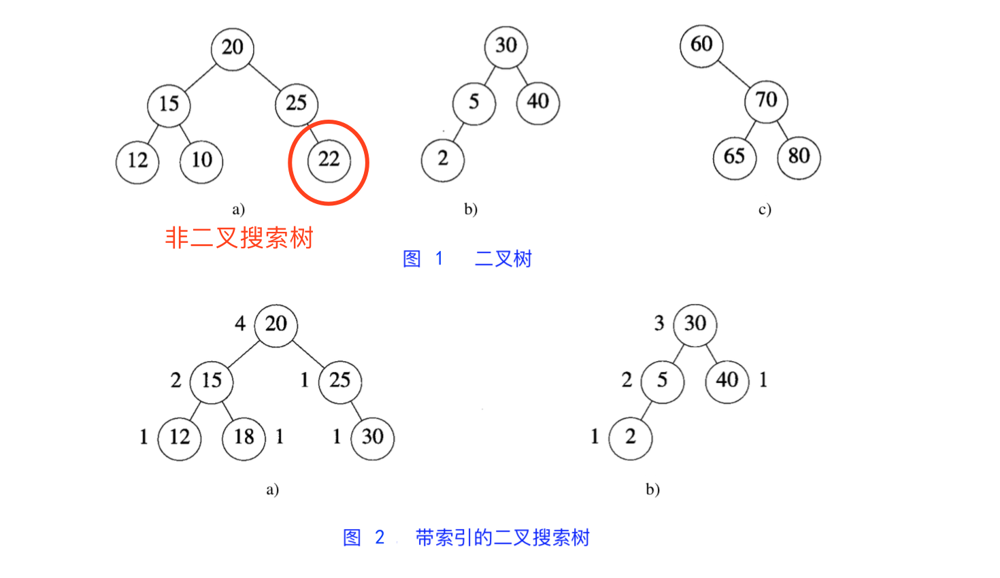
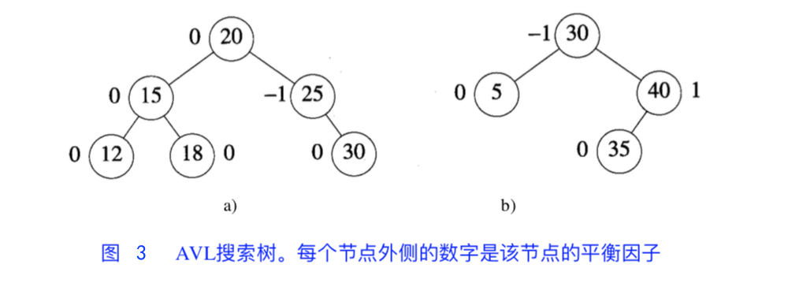
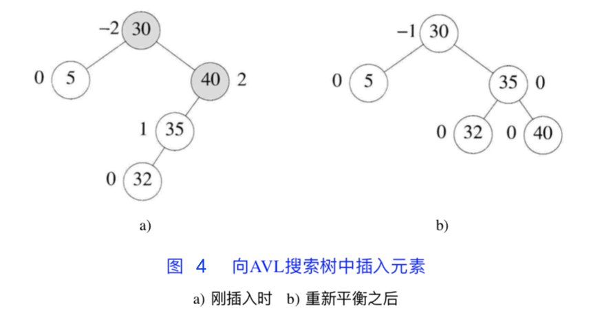
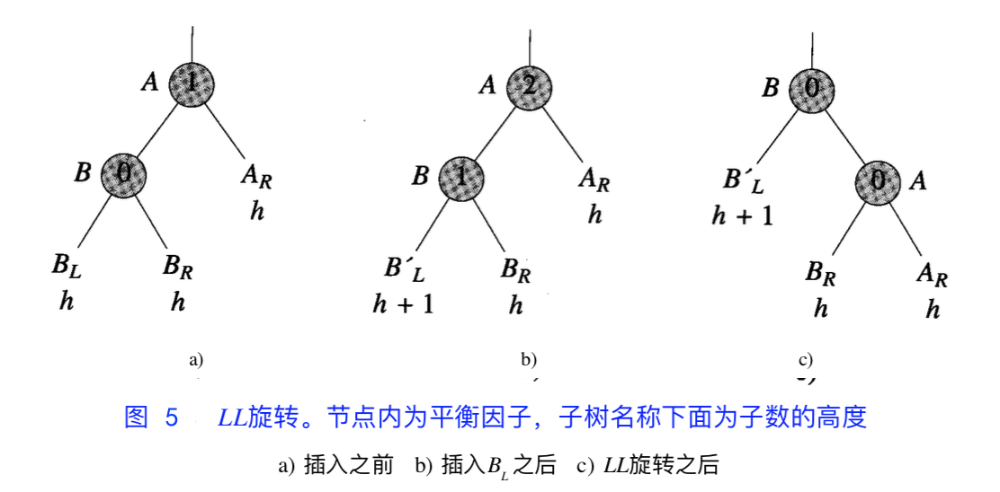
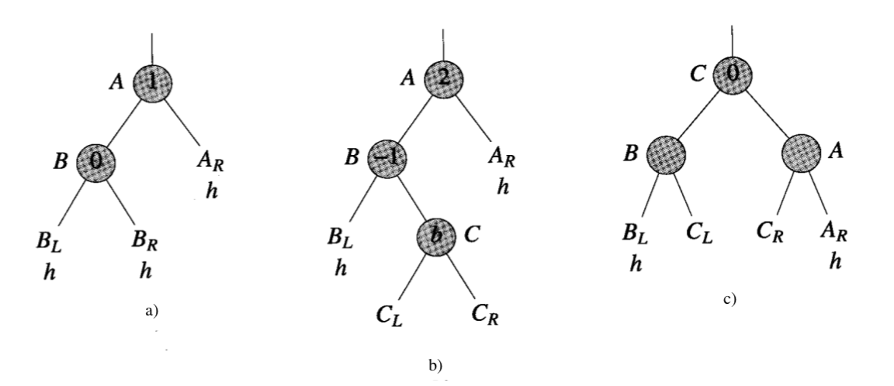
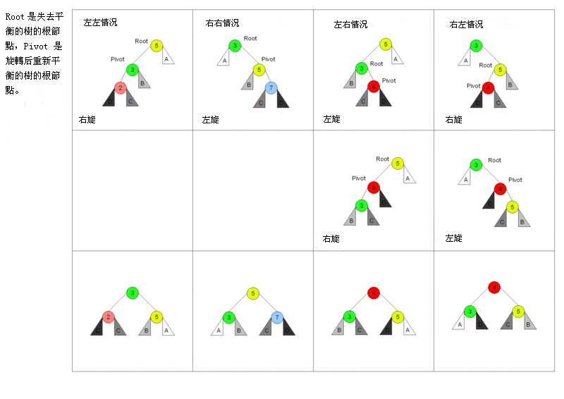
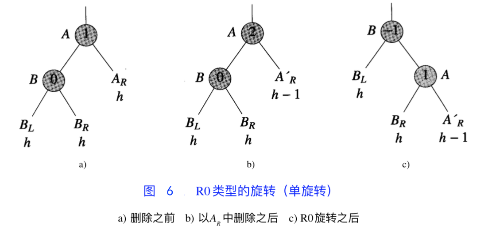
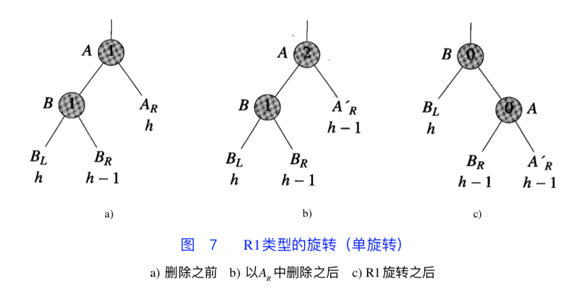
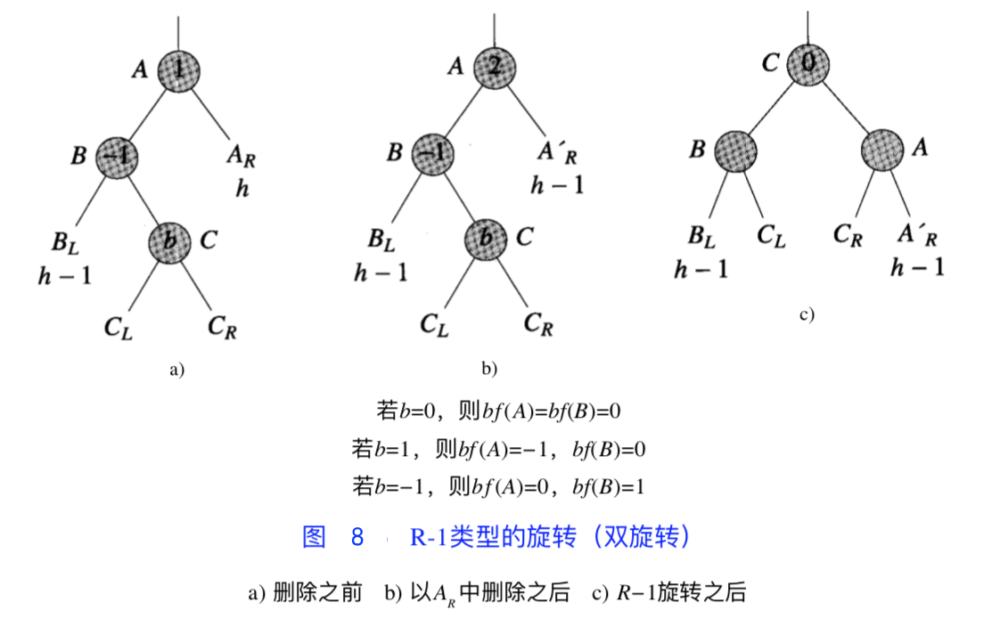

AVL 树是最先被发明的自平衡二叉查找树。

<!-- more -->

# 背景

AVL 树是由 **A**delson-**V**elskii 和 **L**andis 共同提出的一种数据结构，因此得名。

所谓的“平衡”，指的是：
1. 左右子树的高度差小于等于 1；
2. 其每一个子树均为平衡二叉树。

为了保证二叉树的平衡，AVL 树引入了监督和自调节机制：在树的某一部分的不平衡度超过一个阈值时，会触发相应的平衡操作，保证其平衡度在可以接受的范围内。

# 定义

空的二叉树是 AVL 树。

对于非空二叉树，满足以下条件时为 AVL 树：

* 其左子树和右子树都是 AVL 树
* $|h_L - h_R| ≦ 1$，$h_L$ 和 $h_R$ 分别是左子树和右子树的高度
    * 即：在 AVL 树中任何节点的两个子树高度差**不大于 1**
    * 这种以高度为平衡条件的树也叫**高度平衡树**

## 衍生定义

**AVL 搜索树**：既是二叉搜索树，也是 AVL 树的一种数据结构。

**带索引的 AVL 搜索树**：顾名思义。

* 图 1 `a)` `b)` 和 图 2 是 AVL 树，`c)` 不是
* 图 1 `a)` 不是 AVL 搜索树
* 图 2 是带索引的 AVL 搜索树

另外，使用 AVL 树描述字典须具备：

1. n 个元素（节点）的 AVL 树的高度是 $O(logn)$ 
2. 对于每一个 $n (n≧0)$，都存在一棵 AVL 树结构与之对应
    * 否则完成插入后，一棵 AVL 树将不再是 AVL 树：因为对当前元素数量来说不存在对应的 AVL 树
3. 一棵 n 个元素的 AVL 搜索树能在 $O(高度) = O(logn)$ 的时间内完成搜索
4. 往一棵 n 元素的 AVL 搜索树中插入一个新元素，可得到一棵 n+1 元素的 AVL 树，该插入过程可在 $O(logn)$ 完成
5. 从一棵 n 元素的 AVL 搜索树中删除一个元素，可得到一棵 n-1 元素的 AVL 树，该删除过程可在 $O(logn)$ 完成

注：4. 包含了 2. 

由此可得：
* AVL 树的查找、插入和删除操作在平均和最坏情况下都是 $O(logn)$。

# 数据结构描述

我们一般使用链表去描述 AVL 树。

为描述插入和删除操作给树带来的影响，我们为每个节点增加一个平衡因子 `bf` 的描述：

$bf(x) = x_{LH} - x_{RH}$ （x 左子树高度 - x 右子树高度，有时相反）

结合 AVL 树的定义我们可知：
* 平衡因子 1、0、-1 的节点会被认为是平衡的，而 2 或者 -2 被认为是不平衡的，需要重新平衡；
* 因此增加或删除节点，可能需通过一次或者多次树旋转来重新平衡这个树。

# 树的高度

设 $N_h$ 为一棵高度为 h 的 AVL 树最小节点数。

* 最坏情况：根节点两棵子树一棵高度是 h-1，另一棵是 h-2，都是 AVL 树
    * 满足：$N_h = N_{h-1} + N_{h-2} + 1, N_0 = 0, N_1 = 1$ （与斐波那契数列相似）
    * 也可：$N_h = F_{h+2} - 1, h ≧ 0$
    * 由斐波那契定理：$F_h ≈ \frac{Φ^h}{\sqrt5}$，其中  $Φ= \frac{1+\sqrt5}{2}$，可得：$N_h = \frac{Φ^{h+2}}{\sqrt5} - 1$
* 如果树中有 n 个节点，那么树的最大高度是：

    $log_Φ(\sqrt{5}(n+1)) - 2 \approx 1.44*log_2(n+2) = O(logn)$

确定搜索树的高度总为 $O(logn)$ 时，能保证每棵搜索树操作所占用的时间为 $O(logn)$。

# 搜索

可以参照[二叉搜索树](/2022/07/19/binary-search-tree/#搜索节点)的搜索算法，时间为 $O(logn)$。

# [插入](https://github.com/daca-ao/Algos/blob/master/com/raymond/structures/AVLTree.java#L4)

直接使用[二叉搜索树](/2022/07/19/binary-search-tree/#添加节点)的插入算法，得到的可能不是 AVL 树。

存在以下情况：

1. 不平衡树中的平衡因子的值限于 -2，-1，0，1，2；
2. 平衡因子为 2 的节点在插入前的平衡因子为 1；与此类似，平衡因子为 -2 的，插入前为 -1；
3. 从根到新插入节点的路径上，只有途径的节点的平衡因子在插入后会被改变；
4. 设 A 是新插入节点最近的祖先，平衡因子为 -2 或 2，那插入前在从 A 到新插入节点的路径上，所有节点的平衡因子为 0。

如上图所示：往图 3 `b)` 插入节点 32 得到图 4 `a)` 。观察节点 40，其平衡因子 `bf` 在插入前为 1，插入后为 2，即 A 为值为 40 的节点。

如往图 3 `a)` 插入节点 26、28、50 或 72，则 A 为值为 25 的节点；  
如往图 3 `a)` 插入节点 10、14、16 或 19，则不存在这样的 A。

如果存在上述的节点 A，说明 AVL 树处于**不平衡**状态。

不平衡状态分为 **L 型不平衡**（新插入节点在 A 左子树）或 **R 型不平衡**（新插入节点在 A 右子树）两个类别，细分则有：
* LL 型不平衡（新插入节点在 A 左子树的左子树中）
* LR 型不平衡（新插入节点在 A 左子树的右子树中）
* RL 型不平衡（新插入节点在 A 右子树的左子树中）
* RR 型不平衡（新插入节点在 A 右子树的右子树中）

当 A 的 bf 值为 -2 或 2，说明 A 保存新插入节点的子树高度至少为 2，也就是说，A 肯定拥有孙节点。

## 处理插入后失衡：旋转子树

### 调整 LL 型不平衡：[LL 旋转](https://github.com/daca-ao/Algos/blob/master/com/raymond/structures/AVLTree.java#L140)

旋转前：

* A 为根节点，B 为左子树根节点
* 新元素比 B 的值小，最终插入到 B 的左子树
* $bf(A) = 2$, $bf(B) = 1$
* 插入元素后 B 的左子树比右子树高（$h_{BL} - h_{BR} = 1$）。

旋转后：

* B 为根节点，A 变成 B 右子树的根节点
* B'L 仍为 B 的左子树，B'R 为 A 的左子树（B < B'R < A），A 的右子树不变
* 从 B 到新插入节点途中的 B' 的左右节点的平衡因子都将**改变**，其他节点平衡因子与旋转前**一致**。

证明其仍为二叉搜索树：
* BR 子树上所有元素原本就比 A 要小：旋转后 B'R 成为 A 左子树，符合要求。

### 调整 LR 型不平衡：[LR 旋转](https://github.com/daca-ao/Algos/blob/master/com/raymond/structures/AVLTree.java#L169)

针对于树产生了 LR 不平衡，说明 A 的左子树（记为 B）的右子树（记为 C）肯定存在。
* 此时 $bf(A) = 2$, $bf(B) = -1$
* 注：C 的左右子树（$C_L$，$C_R$）有可能为空。

旋转后，$bf(B)$ 和 $bf(A)$ 的值取决于 $bf(C)$ 在插入之后、重新整理之前的平衡因子 $b$：

1. 若 b = 0：即 $h_{CL} = h_{CR}$
    * 因整理前 $bf(B) = -1$，可知 $h_{CL} = h_{CR} = h$
    * 因此整理后 $bf(B) = bf(A) = 0$
2. 若 b = 1：即 $h_{CL} - h_{CR} = 1$
    * 因整理前 $bf(B) = -1$，可知 $h_{CL} = h$，$h_{CR} = h - 1$
    * 整理后 $bf(B) = 0$，$bf(A) = -1$
3. 若 b = -1：即 $h_{CL} - h_{CR} = -1$
    * 因整理前 $bf(B) = -1$，可知 $h_{CL} = h - 1$，$h_{CR} = h$
    * 整理后 $bf(B) = 1$，$bf(A) = 0$

证明其仍为二叉搜索树：
* 旋转前 $C$ 肯定比节点 $B$ 大，比 $A$ 小，因此旋转后形成的根节点和根节点下一层的排列，符合要求
* 旋转前 $C_L$ 根节点肯定比 $B$ 大，$C_R$ 根节点肯定比 $A$ 小，符合要求。

## 小结

通过观察上述的旋转过程，我们可以得出：

* LL 和 RR 只需旋转一次，我们称之为**单旋转**
* LR 和 RL 需要旋转两次，我们称之为**双旋转**
* 可将 LR 看作是 RR 旋转后的 LL 旋转。

## 插入算法思路

1. 沿着从根节点开始的路径对具有相同键值的元素进行搜索，以找到插入新元素的位置。在此过程中寻找最近的，且平衡因子为 -1 或 1 的节点，令其为 A 节点。如找到相同关键值的元素，则插入失败，以下步骤无需执行；
2. 如没有这样的 A 节点：从根节点开始再遍历一次，并修改平衡因子，然后终止；
3. 如 bf(A) = 1 并且新节点插入到 A 的右子树中，或 bf(A) = -1 且插入在左子树进行：A 新的平衡因子为 0。此时修改从 A 到新节点途中的平衡因子，然后终止；
4. 确定 A 的不平衡类型并执行相应的旋转，在从新子树根节点至新插入节点途中，根据旋转需要修改相应的平衡因子。

# [删除](https://github.com/daca-ao/Algos/blob/master/com/raymond/structures/AVLTree.java#L13)

同理：直接使用[二叉搜索树](/2022/07/19/binary-search-tree/#删除节点)的删除算法，得到的可能不是 AVL 树。

设被删除的节点的父节点为 q

* 如删除发生在左子树，则 bf(q) 减 1 或者不变；
* 如删除发生在右子树，则 bf(q) 加 1 或者不变。

删除节点之后，如果：

* q 的新的平衡因子是 0，说明 q 子树的高度已减 1，且需要改变它的父节点（如有）和其他某些祖先节点的平衡因子
* q 的新的平衡因子是 -1 或 1：高度与删除前相同，无需改变其祖先的平衡因子值
* q 的新的平衡因子是 -2 或 2：树在 q 节点不平衡

设从 q 到根节点的路径中平衡因子第一个发生改变的节点为 A，此时 A 的平衡因子是 2 或者 -2。

* 如删除在 A 的左子树：L 型不平衡
* 如删除在 A 的右子树：R 型不平衡
    * 删除前 bf(A) = 1，删除后 bf(A) = 2，即 A 的右子树高度减 1，属于 R 型不平衡

当删除 A 右子树的节点时，我们将 A 的左子树的根节点记为 B。  
如果删除导致 bf(B) = -1，我们将其定义为 **R-1 型不平衡**。

由此会有以下的不平衡状态定义：

* **R-1**：A 的左节点 B 的平衡系数为 -1
* **R0**：A 的左节点 B 的平衡系数为 0
* **R1**：A 的左节点 B 的平衡系数为 1
* **L-1**：A 的右节点 B 的平衡系数为 -1
* **L0**：A 的右节点 B 的平衡系数为 0
* **L1**：A 的右节点 B 的平衡系数为 1

## 处理删除后失衡：旋转子树

删除了右子树的节点，左子树平衡因子被改变，左子树需要变化；  
对于左子树节点的删除，也是同样的道理。我们这里只介绍 R 型不平衡，对于 L 型不平衡，作镜像处理。

R0 旋转：与插入时的单旋转类似

R1 旋转：与插入时的单旋转类似

R-1 旋转：与双旋转类似

旋转后，$bf(B)$ 和 $bf(A)$ 的值取决于 $bf(C)$ 在插入之后、重新整理之前的平衡因子 $b$：

1. 若 b = 0：即 $h_{CL} = h_{CR}$
    * 因整理前 $bf(B) = -1$，可知 $h_{CL} = h_{CR} = h - 1$
    * 因此整理后 $bf(B) = bf(A) = 0$
2. 若 b = 1：即 $h_{CL} - h_{CR} = 1$
    * 因整理前 $bf(B) = -1$，可知 $h_{CL} = h - 1$，$h_{CR} = h - 2$
    * 整理后 $bf(B) = 0$，$bf(A) = -1$
3. 若 b = -1：即 $h_{CL} - h_{CR} = -1$
    * 因整理前 $bf(B) = -1$，可知 $h_{CL} = h - 2$，$h_{CR} = h - 1$
    * 整理后 $bf(B) = 1$，$bf(A) = 0$

## 删除具体思路

把要删除的节点向下旋转成一个叶节点，接着直接移除该叶节点；  
旋转期间最多有 $logn$ 个节点被旋转：整体上的时间复杂度为 $O(logn)$。

---

# References

[AVL树- 维基百科，自由的百科全书](https://zh.wikipedia.org/wiki/AVL%E6%A0%91)