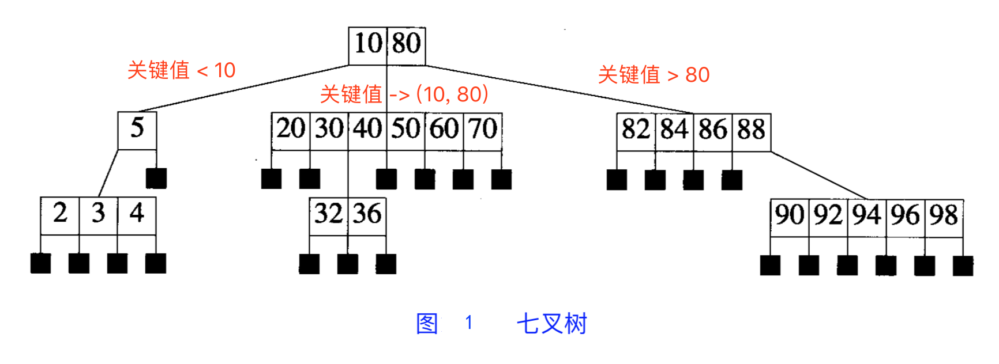
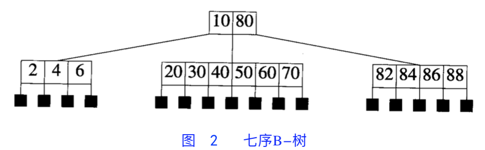
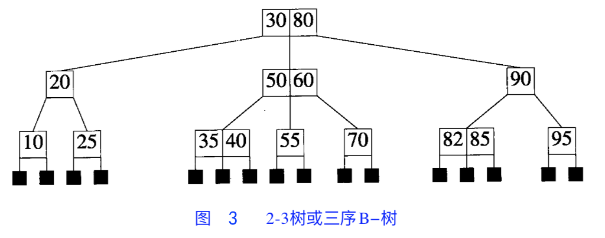

[AVL 树](/2023/05/26/avl)和[红-黑树](/2023/05/27/red-black)在内存中能够保持很好的性能，但不适用于规模大的字典，如外部字典或文件等用途。

<!-- more -->

因此我们采用度数更高的搜索树改善性能。

# 背景：ISAM

**I**ndexed **S**equential **A**ccess **M**ethod，索引顺序访问方法，本质上是公式化描述。

* 将可用的磁盘空间划分成多块（磁盘空间最小单位），每个块包含 m 个元素（m 通常较大）
* 字典元素以升序存储在块中
* 索引存储了每个块中关键值的最大值，即索引的关键值数量与块数相同
    * 因此访问关键值 k 的时候，可以通过二分法，在索引中寻找包含相应元素的块，再在相应的块中寻找。

# 背景：m 叉搜索树

m-way search tree，可以是一棵空树。

如果树非空，则需要满足：

1. 在相应的扩充搜索树中（用外部节点替换零指针），每个内部节点最多有 m 个子女及 1 ~ $m-1$ 个元素（外部节点不含元素和子女）
2. 每个包含 p 个元素的节点，有 p+1 个子女
3. 对于含 p 个元素的任意节点
    1. 设 $k_1$, ..., $k_p$ 为这些元素的关键值，且顺序排列
    2. 设 $c_0$, $c_1$, ..., $c_p$ 是该节点的 p+1 个孩子，则：
    3. 以 $c_0$ 为根的子树中的关键值**小于 $k_1$**
    4. 以 $c_p$ 为根的子树中的关键值**大于 $k_p$**
    5. 以 $c_i$ 为根的子树中的关键值大于 $k_i$，小于 $k_{i+1}$（$1 ≦ i ≦ p$）

如下例图所示：

* 查找、搜索按照正常的方法进行
* 删除需要从非空相邻子树挑选替换元素

## 高度

对于一棵高度为 h 的 m 叉搜索树来说：

* 最少有 $h$ 个元素：每层一个节点，每个节点一个元素
* 最多有 $m^h - 1$ 个元素
    * 从 1 到 h - 1 层每个节点都含有 m 个孩子，且第 h 层的节点没有孩子
    * 共 $\sum_{i=0}^hm^i=(m^h-1)/(m-1)$ 个节点
    * 每个节点最多包含 $m - 1$ 个元素，因此最多一共 $m^h - 1$ 个元素

即：一棵包含 n 个元素的 m 叉树高度在 $log_m(n+1)$ 到 $n$ 之间。

# m 序 B 树

B-Tree of order m，是一棵 m 叉搜索树。

如果树非空，则相应的扩充搜索树应该满足：

1. 根节点至少有两个孩子
2. 除根节点外，所有内部节点至少有 $⌈m/2⌉$ 个孩子
3. 每个节点元素从小到大排列，即**左小右大**
4. **所有外部节点在同一层**，即根节点到每个叶子节点的长度都相同。

## 三序 B 树（2-3 树）

即 m = 3 的 B 树，内部节点可以有两个子节点和 1 个数据元素、或 3 个孩子节点和两个数据元素，叶子节点有 1 到 2 个数据元素。

## 高度

定理：

设 T 是一棵高度为 h 的 m 序 B 树，$d = ⌈m/2⌉$，n 是 T 中的元素个数，则

1. $2d^{h-1} - 1 ≦ n ≦ mh - 1$
2. $log_m(n+1) ≦ h ≦ log_d[(n+1)/2]+1$

证明：

* n 的上限：已证明
* n 的下限：
    * 相应的扩充 B 树的外部节点都在 h+1 层
    * 1, 2, 3, 4, ..., h+1 层的节点最小数目是 $1$, $2$, $2d$, $2d^2$, ..., $2d^h-1$
    * B 树外部节点最小数为 $2d^h-1$
    * 因外部节点比元素个数多 1：得出下限值
* 由 1 可得 2

因此即使元素数量再多，树的高度也可以很小。  
在实际应用中，树的序可以做到很大。

# 搜索

B 树的搜索算法与 m 叉搜索树的相同，磁盘访问次数最多是 h。

# 插入

* 首先检查具有相同关键值元素是否存在
    * 如已经存在：不允许重复值，插入失败
* 否则便可将元素插入到树中

当新元素需要插入到饱和节点（超过了规定的 m 值）中时，饱和节点需要被分开。

将饱和节点记为 P：
* 将带有空指针的新元素 e 插入到 P 中，得到一个有 m 个元素和 m+1 个孩子的溢出节点
* 以序列表示如下：

    $m, c_0, (e_1, c_1), ..., (e_m, c_m)$    （$e_i$ 是元素，$c_i$ 是孩子指针）

我们从 $e_d$ 处分开节点（已知 $d = ⌈m/2⌉$），将左边元素保留在 P 中，右边元素分到新的节点 Q 中：

$$P: d-1, c_0, (e_1, c_1), ..., (e_{d-1}, c_{d-1})$$
$$Q: m-d, c_d, (e_{d+1}, c_{d+1}), ..., (e_m, c_m)$$

与此同时：

* $(e_d, Q)$ 被插入到 P 的父节点中
* 要保证 P 和 Q 的孩子数量至少为 d

当操作引起 s 个节点分裂时：

* 磁盘访问次数 = $h$（读取搜索路径上的节点） $+ 2s$（回写两个分裂出的新节点）$+ 1$（回写新的根节点或插入后没有导致分裂的节点）
* 最多可达 $3h + 1$

# 删除

分两种情况讨论：

当被删除的元素在叶节点时，其孩子均为外部节点的节点：

* 被删除元素在一个包含多于最少数目元素（又是树叶又是根节点：1；不是：⌈m/2⌉-1）的节点：将修改后的节点写回
* 被删除元素在非根且元素数量为最小值的节点：用其最相邻的左或右兄弟的元素替换
    * 将该元素往上移至其父节点，父节点被牵涉到的元素往下移动
* 最相邻的兄弟不含额外的元素：将两个兄弟（自己，不含额外元素的最相邻兄弟）和父节点中介于两兄弟之间的元素合并
* 合并会减少父节点个数：需要检查父节点是否满足要求，并检查父节点相邻的兄弟
    * 要么从中取一个元素，要么与它合并
    * ...
    * 由此类推，最坏情况是一直回溯到根节点：变成空节点被抛弃，高度减 1

当被删除的元素在非叶节点：

* 转化为 1.：既可以用左相邻子树中最大元素，也可以用右相邻子树最小元素替换被删除元素

最坏情况的磁盘被访问次数：3h

1. 找到包含被删除元素需要 h 次读访问
2. 获得第 2 到 h 层的最相邻兄弟需要 h-1 次读访问
3. 在第 3 至 h 层的合并需要 h-2 次写访问
4. 对修改过的根节点和第 2 层的两个节点进行 3 次写访问

# 小结

* B 树：每个节点存储 M/2 到 M 个关键字，非叶子节点存储指向关键字范围的子节点
    * 所有关键字在整棵树出现，且只出现一次，没有冗余
    * 因此非叶子节点可以命中搜索记录
* B+ 树：在 B 树基础上，为叶子节点增加**链表指针**
    * 所有关键字（值）在叶子节点中完整出现
    * 非叶子节点作为叶子节点的索引，与叶子节点**是有冗余的**
    * 搜索结果总是要到叶子节点才命中
* B* 树：在 B+ 树基础上，为非叶子节点也增加链表指针

应用：直方图，关系型数据库存储
