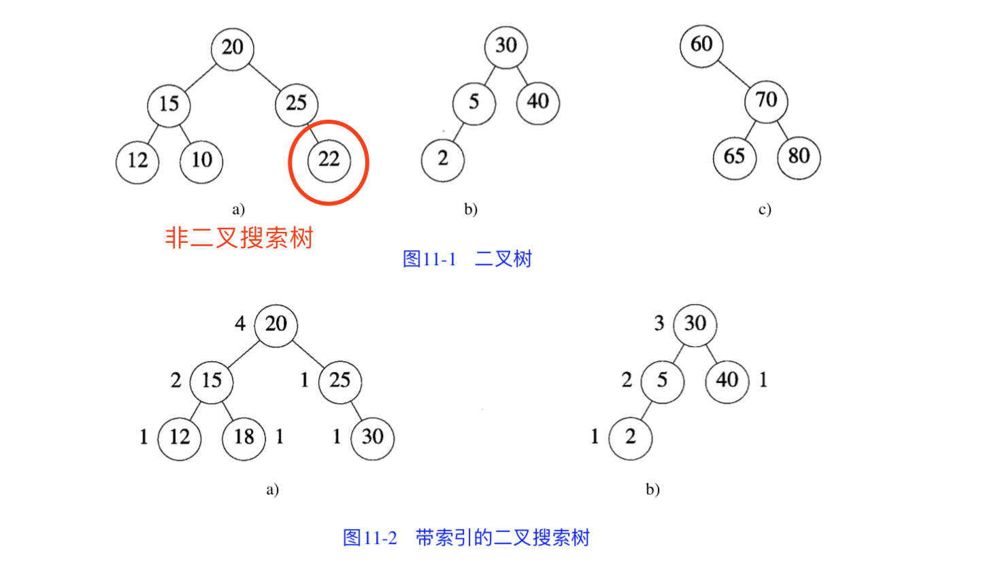
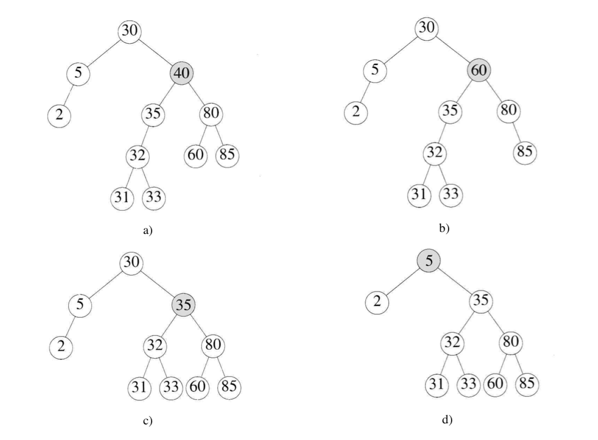

Binary search tree，也叫二叉查找树、有序二叉树。

<!-- more -->

# 搜索树

先来说说搜索树。

提出搜索树的背景，是使用散列描述字典时遇到了瓶颈。

先是按关键字的升序输出字典元素：

1. 使用除数为 D 的链表，需要 Θ(D+n) 时间内取出元素，O(nlogn) 时间内排序，Θ(n) 时间内输出：因此一共需要 O(D+nlogn) 单位的时间；
2. 对散列使用线性开型寻址：需要 O(b+nlogn)，其中取出元素需要 Θ(b)，b 是桶的个数。

随后，是按升序找到第 k 个元素 / 删除第 k 个元素。

1. 以上两个场景，如果使用链表来描述，需要在 O(D+n) 时间内完成
2. 如果使用线性开型寻址，则时间复杂度是 Θ(b)
3. 必须采用线性时间确定 n 元素集合中第 k 个元素

因此搜索树，尤其是二叉搜索树适合描述**字典**，即：使用搜索树描述 n 个元素的字典：
* 搜索、插入或删除所需的平均时间和最坏时间均为 Θ(logn) 
* 按关键字升序输出元素：Θ(n)
* 按元素排名查找和删除操作耗时 O(logn) 
* 所有字典元素能在线性时间内按升序输出
* 无论是平衡还是非平衡的搜索树，顺序访问某个元素平均所需时间为 Θ(1) 

搜索树是**基础性数据结构**（ADT），用于构建更为抽象的数据结构，如集合、multiset、关联数组等。

相比于其他数据结构，二叉搜索树的优势在于查找、插入、删除的时间复杂度较低，最坏时间复杂度为 Θ(n) 。

常见的搜索树有：
* 自平衡二叉树，包括 **[AVL 树]()**、**[红-黑树]()**
* **[B 树]()**：对读写操作进行优化的自平衡 N 叉搜索树，非叶子节点里拥有**多于两个子节点**


# 特征

二叉搜索树满足以下特征：

* 若任意节点左子树非空，则左子树上所有节点的值均 <（小于）其根节点的值
* 若任意节点右子树非空，则右子树上所有节点的值均 >（大于）其根节点的值
* 任意节点的左、右子树也分别为二叉查找树
* 每个节点有一个关键值（key），**没有键值相等**的节点（no duplicate nodes）

注：如将“小于”换成“小于等于”，“大于”换成“大于等于”，则会得到一棵有重复值的二叉搜索树

延伸：带索引的（indexed）二叉搜索树

* 在每个节点中添加一个 LeftSize 域
* 该域值为该节点左子树的元素个数加一
* 该值同时给出了一个元素在子树中的排名
* 调用中序输出 InOrderOutput 将二叉搜索树按照升序输出：Θ(n)
* 搜索：按照索引查找
* 插入：需要更新插入沿途所有节点的 LeftSize 值：O(h)




# 操作与实现

先定义二叉搜索树的节点类 BinaryTreeNode

```java
class BinaryTreeNode {

    private String data = null;

    private BinaryTreeNode leftChild = null;

    private BinaryTreeNode rightChild = null;

    ...  // 构造函数、getters & setters
}
```

跟普通二叉树的节点没区别。

二叉搜索树除了拥有普通二叉树的方法（前中后序遍历、层级遍历、比较、复制等），其基本操作方法会有所区分，比如最基本的几个：

<br/>


## [搜索节点](https://github.com/daca-ao/Algos/blob/master/com/raymond/structures/AbstractBinarySearchTree.java#L4)

指导思想：比根节点大的，往右子树找；比根节点小的，往左子树找；否则，当前节点就是你要的节点。

```java
BinaryTreeNode<T> search(T value) {
    if (root == null) {
        System.err.println("Tree null.");
        return null;
    }
    if (value == null) {
        System.err.println("No operation for null value.");
        return null;
    }

    BinaryTreeNode<T> curr = root;
    while (value != curr.getValue()) {  // 值不相等的时候
        // 比当前节点大的，进入右子树，否则进入左子树
        curr = value.compareTo(curr.getValue()) > 0 ? 
                curr.getRightChild() : curr.getLeftChild();
        if (curr == null) {
            return null;  // 不存在相等的节点
        }
    }
    return curr;  // 否则返回当前节点
}
```

时间复杂度为 O(h)，其中 h 为树的高度。


## [添加节点](https://github.com/daca-ao/Algos/blob/master/com/raymond/structures/BinarySearchTree.java#L7)

指导思想：比根节点大的，往右子树插入；比根节点小的，往左子树插入；不接受已存在的节点值的添加。

```java
public void insertNode(T value) {
    if (value == null) {
        System.err.println("Please do not insert a null value.");
        return;
    }
    if (root == null) {
        root = new BinaryTreeNode<>(value);
        return;
    }
    BinaryTreeNode<T> node = new BinaryTreeNode<>(value);
    BinaryTreeNode<T> curr = root;
    while (true) {
        BinaryTreeNode<T> parent = curr;
        if (value.compareTo(curr.getValue()) > 0) {  // 比根节点大的，往右子树插入
            curr = curr.getRightChild();
            if (curr == null) {
                parent.setRightChild(node);
                return;
            }
        } else if (value.compareTo(curr.getValue()) < 0) {  // 比根节点小的，往左子树插入
            curr = curr.getLeftChild();
            if (curr == null) {
                parent.setLeftChild(node);
                return;
            }
        } else {
            System.err.println("Node " + value + " already there.");
            return;  // 不接受重复节点添加
        }
    }
}
```


## [删除节点](https://github.com/daca-ao/Algos/blob/master/com/raymond/structures/BinarySearchTree.java#L40)

二叉搜索树删除节点 p，分三种情况：

1. p 是树叶：直接删除
2. p 只有一棵非空子树
    * p 没有父节点（即 p 为根节点）：将 p 丢弃，p 的唯一子树的根节点成为新的搜索树根节点
    * p 存在父节点 pp：修改 pp 指针，令其指向 p 的唯一子树
3. p 有两棵非空子树
    * 将 p 替换为其**左子树的最大值**（**前驱**节点），或者**右子树的最小值**（**后驱**节点）
    * 寻找左子树最大元素：沿着子树各节点的右孩子指针移动，直到右孩子指针为 `null`
    * 寻找右子树最小元素：沿着子树各节点的左孩子指针移动，直到左孩子指针为 `null`

注意：如果节点 p 的左子树为空，则 p 的前驱节点为 p 的第一个有右孩子且左子树没有 p 节点的祖先。

举个例子：



如上图，当我们要删除 `a)` 中值为 40 的元素的时候：

* 可以选择其右子树的最小值（60）为新的父节点，如 `b)` 所示
* 也可选择其左子树的最大值（35）为新的父节点，如 `c)` 所示
* 节点选择完毕并删除后，搜索树需要**重新构建**。

再比如：删除 `c)` 中值为 30 的元素，如选择其左子树的最大值（5）为新的父节点，便如 `d)` 所示。

```java
public boolean deleteNode(T value) {
    if (root == null) {
        System.err.println("Tree null. Deletion failed.");
        return false;
    }
    if (value == null) {
        System.out.println("No operation for null value.");
        return false;
    }

    // search out the node
    BinaryTreeNode<T> curr = root;
    BinaryTreeNode<T> parent = root;
    boolean isInLeft = true;
    while (value != curr.getValue()) {
        isInLeft = value.compareTo(curr.getValue()) < 0;  // 要删除的节点是左子树还是右子树
        parent = curr;
        curr = isInLeft ? curr.getLeftChild() : curr.getRightChild();
        if (curr == null) {  // 找不到要删除的元素
            System.err.println("Element not found.");
            return false;
        }
    }
    // 找到了要删除的元素

    // 重建二叉搜索树
    if (curr.getLeftChild() == null && curr.getRightChild() == null) {  // 叶子结点：直接删除
        System.out.println("Deleting leaf " + value + ".");
        if (isInLeft) {
            parent.setLeftChild(null);
        } else {
            parent.setRightChild(null);
        }
        return true;
    }
    // 有且只有一棵非空子树
    if (curr.getLeftChild() == null || curr.getRightChild() == null) {
        boolean isLeftExist = curr.getLeftChild() != null;
        System.out.println("Deleting node " + value + " with " + 
                (isLeftExist ? "left" : "right") + " child.");
        if (isInLeft) {
            parent.setLeftChild(isLeftExist ? curr.getLeftChild() : curr.getRightChild());
        } else {
            parent.setRightChild(isLeftExist ? curr.getLeftChild() : curr.getRightChild());
        }
        return true;
    }
    // 有左右两棵非空子树
    System.out.println("Deleting node " + value + " with children.");
    BinaryTreeNode<T> predecessor = getPredecessorTree(curr);  // 以前驱节点替换
    if (root == curr) {
        root = predecessor;
    } else if (isInLeft) {
        parent.setLeftChild(predecessor);
    } else {
        parent.setRightChild(predecessor);
    }
    predecessor.setRightChild(curr.getRightChild());
    return true;
}

// 获取前驱节点，并以此节点为根节点重建子树
BinaryTreeNode<T> getPredecessorTree(BinaryTreeNode<T> node) {
    if (node == null) {
        return null;
    }
    BinaryTreeNode<T> predParent = node;
    BinaryTreeNode<T> predecessor = node;
    BinaryTreeNode<T> curr = node.getLeftChild();
    while (curr != null) {
        predParent = predecessor;
        predecessor = curr;
        curr = curr.getRightChild();  // 获取到前驱节点
    }
    // 如果前驱节点不是刚好是 node 的左子树，而是在 node 左子树的右子树中：
    if (predecessor != node.getLeftChild()) {
        predParent.setRightChild(predecessor.getLeftChild());
        predecessor.setLeftChild(node.getLeftChild());
    }
    return predecessor;
}
```

时间复杂度为 O(h)，其中 h 为树的高度。
* n 个元素的二叉搜索树高度可以为 n，但其平均时间为 O(logn)。
