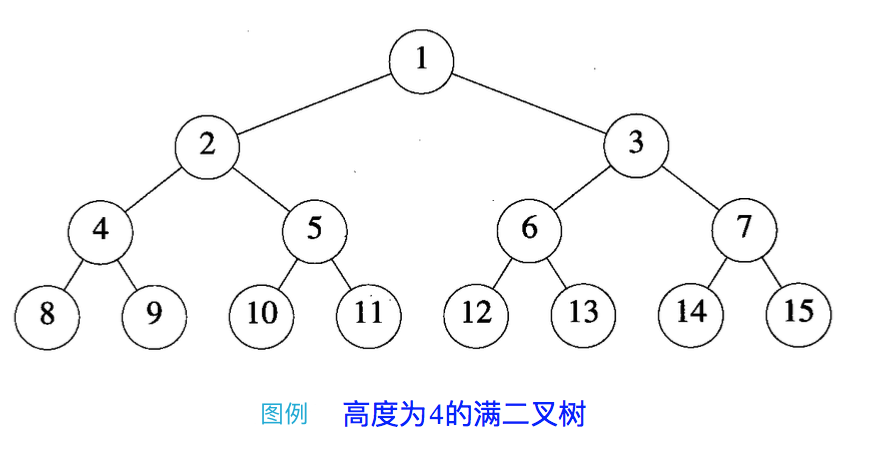

二叉树可能不是计算机世界中最基本的数据结构，但是将它誉为计算机应用中的基石，这个赞誉并不为过。

<!-- more -->

了解二叉树之前，我们先来理一下“树”的概念。


# 什么是树

在计算机科学中，线性数据结构和表数据结构一般不适合描述具有**层次结构**的数据，比如祖先 - 后代、上级 - 下属、整体 - 部分之类的数据。

由此我们引入了一个新类型的非空有限元素的集合：**树**（**tree**）
* 树的最高层元素称为根（root）
* 余下的非空元素组成该树的子树（subtree）
* 根在上，树在下
* 每棵树的末端为树的叶子（leaf node）

一般的树的结构：


树属于**抽象数据类型**（Abstract Data Type, **ADT**）。


# 树的各个概念

父节点：若一个节点含有子节点，则这个节点称为其子节点的父节点。

子节点：一个节点如含有子树，则该子树的根节点称为该节点的子节点。

由此衍生的概念有：
* 节点的祖先：从根到该节点所经过的分支上的所有节点
* 子孙：以某节点为根的子树中任一节点都称为该节点的子孙
* 兄弟节点：具有相同父节点的节点互称为兄弟节点
* 堂兄弟节点：父节点在同一层的节点互为堂兄弟

节点层次（level）：从根开始定义，根为第一层，根的子节点为第二层……以此类推。

树的高度/深度：树中节点的最大层次。

节点的**度**（**degree** of a node）：一个节点含有的子树的棵数
* 树的度：一棵树中节点的度的最大值
* 叶节点/终端节点：度为 0 的节点
* 非终端节点/分支节点：度不为 0 的节点

森林：没有回路的图，也可以看成由 m（m > 0）棵互不相交的树的集合称为森林。


# 树的种类

按照节点次序可以分为：
* 无序树：树中任意节点的子节点之间没有顺序关系，也称为自由树
* 有序树：树中任意节点的子节点之间有顺序关系

有序树中，按照度的数量，可以分为：
* 二叉树
* N 叉树

<br/>

本帖主要介绍二叉树，这也是计算机科学中最常用的树型数据结构。


# 二叉树

与树不同的是，二叉树可以为空。当二叉树非空时，包括：
* 根元素
* 两棵子二叉树，分别叫左子树和右子树

二叉树和树的**根本区别**：
* 二叉树可以为空；而树不能为空
* 二叉树的每个元素恰好有两棵子树（以左、右区分次序，可以为空）；而树中每个元素可以有若干个且无序的子树


## 二叉树特性

1. 包含 n（n > 0）个元素的二叉树，它的边的数量为 n - 1
2. 若二叉树的高度为 h（h ≥ 0），则该二叉树最少有 h 个元素，最多有 2h - 1 个元素
3. 包含 n 个元素的二叉树，其高度最大为 n，最小为 ⌈log2(n + 1)⌉ （上取整数）
4. 任意一棵二叉树中，若有 N0 个叶节点，N2 个度为 2 的节点，则有：N2 = N0 - 1
5. 设完全二叉树中任一元素的序号为 i（1 ≤ i ≤ n），则：
    1. 当 i = 1 时，该元素为二叉树的根。若 i > 1，则该元素父节点的序号为 ⌊i / 2⌋ （下取整数）。
    2. 若 2i > n，该元素无左孩子；否则其左孩子的编号为 2i 。
    3. 若 2i + 1 > n，该元素无右孩子；否则其右孩子的编号为 2i + 1 。
6. 完全二叉树中，度为 1 的节点的数目要不是 1，要不是 0


## 二叉树的不同形态

**完全二叉树**（Complete Binary Tree）

对于一棵深度为 d（d > 1）的二叉树，除了第 d 层（叶子节点那一层）外其他各层节点数目**已满**，且第 d 层所有节点**从左向右**连续紧密排列。

我们称这样的二叉树为完全二叉树。

完全二叉树的特性：
* 左孩子节点位置 = 当前父节点位置 * 2 + 1（从 0 开始）
* 右孩子节点位置 = 当前父节点位置 * 2 + 2


<br/>

由完全二叉树衍生出来的：

**满二叉树**（Perfect Binary Tree）完全二叉树去掉第 d 层所有节点之后，所剩下的部分构成一棵满二叉树。
* 一棵深度为 d - 1 的二叉树含有 2(d - 1) - 1 个元素



**完满二叉树**（Full Binary Tree）：除了叶子节点之外的每一个节点都有两个孩子节点。


## 常用操作

* 确定高度
* 确定元素数目
* 复制单个元素 / 整棵树
* 打印二叉树
* 比较两棵二叉树
* 删除整棵树
* ……

这些常用操作都可通过遍历二叉树来完成。


## 数据结构

通常有两种描述二叉树的结构：

**1**. **公式化描述**：利用二叉树的特性 5

1. 可以将一棵二叉树与其对应的**完全二叉树**作为比较，逻辑上补全缺少的部分元素
2. 将二叉树从上到下，从左到右编号后，再存储到数组中


缺点：如果对应的完全二叉树缺少的元素数量很多，就会非常浪费时间和空间，以右斜（right-skewed）二叉树最甚：


**2**. **链表描述**：这是最常用的方法

* 每个元素使用一个有两个指针域（leftChild, rightChild）和数据域 data 的节点表示
* 边可以用从父节点指向子节点的指针描述，指针存放于父节点指针域中
* 拥有 n 个元素的二叉树，会有 2n - (n - 1) = n + 1 个指针域没有值


<br/>

本文我们用**链表**描述方式来实现二叉树的数据结构。


### 节点类 BinaryTreeNode

```java
class BinaryTreeNode {

    private String data = null;

    private BinaryTreeNode leftChild = null;

    private BinaryTreeNode rightChild = null;

    public BinaryTreeNode() {
    }

    public BinaryTreeNode(String data) {
        this.data = data;
        this.leftChild = null;
        this.rightChild = null;
    }

    public String getData() {
        return data;
    }

    public void setData(String data) {
        this.data = data;
    }

    public BinaryTreeNode getLeftChild() {
        return leftChild;
    }

    public void setLeftChild(BinaryTreeNode leftChild) {
        this.leftChild = leftChild;
    }

    public BinaryTreeNode getRightChild() {
        return rightChild;
    }

    public void setRightChild(BinaryTreeNode rightChild) {
        this.rightChild = rightChild;
    }

    @Override
    public String toString() {
        return "Node data: " + getData();
    }
}
```


### 二叉树类 BinaryTree

```java
import java.util.Deque;
import java.util.LinkedList;
import java.util.Queue;

public class BinaryTree {

    private BinaryTreeNode root;

    public BinaryTree() {
    }

    public BinaryTree(BinaryTreeNode root) {
        this.root = root;
    }

    public BinaryTreeNode getRoot() {
        return root;
    }

    public void setRoot(BinaryTreeNode root) {
        this.root = root;
    }

    public String visit(BinaryTreeNode node) {
        if (node == null || node.getData() == null) {
            return "NULL node";
        }
        return node.toString();
    }

    // 前序遍历
    // 空间复杂度为 Ο(n)，时间复杂度为 Θ(n)
    public void preOrder(BinaryTreeNode node) {
        if (node == null) {
            return;
        }
        visit(node);
        preOrder(node.getLeftChild());
        preOrder(node.getRightChild());
    }

    // 前序遍历非递归实现
    public void preOrderNonRecur(BinaryTreeNode node) {
        if (node == null) {
            return;
        }
        Deque<BinaryTreeNode> stack = new LinkedList<>();
        stack.push(node);
        while (!stack.isEmpty()) {
            node = stack.pop();
            visit(node);
            // 利用栈的 FILO 原理，右子树先入栈，后出栈
            if (node.getRightChild() != null) {
                stack.push(node.getRightChild());
            }
            // 左子树后入栈，先出栈
            if (node.getLeftChild() != null) {
                stack.push(node.getLeftChild());
            }
        }
    }

    // 中序遍历
    // 空间复杂度为 Ο(n)，时间复杂度为 Θ(n)
    public void inOrder(BinaryTreeNode node) {
        if (node == null) {
            return;
        }
        inOrder(node.getLeftChild());
        visit(node);
        inOrder(node.getRightChild());
    }

    // 中序遍历非递归实现
    public void inOrderNonRecur(BinaryTreeNode node) {
        if (node == null) {
            return;
        }
        Deque<BinaryTreeNode> stack = new LinkedList<>();
        while (node != null || !stack.isEmpty()) {
            // 一直将左子树的左节点推进栈
            while (node != null) {
                stack.push(node);
                node = node.getLeftChild();
            }
            // 左节点操作完毕
            if (!stack.isEmpty()) {
                node = stack.pop();
                visit(node);
                node = node.getRightChild();  // 再推右子树
            }
        }
    }

    // 后序遍历
    // 空间复杂度为 Ο(n)，时间复杂度为 Θ(n)
    public void postOrder(BinaryTreeNode node) {
        if (node == null) {
            return;
        }
        postOrder(node.getLeftChild());
        postOrder(node.getRightChild());
        visit(node);
    }

    // 后序遍历非递归实现
    public void postOrderNonRecur(BinaryTreeNode node) {
        if (node == null) {
            return;
        }
        Deque<BinaryTreeNode> stack = new LinkedList<>();
        BinaryTreeNode prev = null;  // 避免重复遍历节点 -> 右子树再添加的死循环
        while (node != null || !stack.isEmpty()) {
            // 先一直遍历到最左端子树左叶子
            while (node != null) {
                stack.push(node);
                node = node.getLeftChild();
            }
            node = stack.peek();
            if (node.getRightChild() == null || node.getRightChild() == prev) {
                node = stack.pop();
                visit(node);
                prev = node;
                node = null;
            } else {
                node = node.getRightChild();
            }
        }
    }

    // 以上的顺序遍历都是 DFS


    // 逐层遍历（BFS）
    // 时间复杂度为 Θ(n)
    public void levelOrder(BinaryTreeNode node) {
        if (node == null) {
            return;
        }
        Queue<BinaryTreeNode> queue = new LinkedList<>();
        queue.add(node);
        while (!queue.isEmpty()) {
            BinaryTreeNode removed = queue.poll();
            visit(removed);
            if (removed.getLeftChild() != null) {
                queue.add(removed.getLeftChild());
            }
            if (removed.getRightChild() != null) {
                queue.add(removed.getRightChild());
            }
        }
    }


    // 上述操作，对于满二叉树所需的空间为 Θ(n)


    // 返回二叉树高度
    // 时间复杂度为 Θ(n)
    public int height(BinaryTreeNode node) {
        return root == null ? 0 :
            1 + Math.max(height(node.getLeftChild()), height(node.getRightChild()));
    }

    public int height() {
        return height(root);
    }

    // 确定二叉树元素数目
    // 此处实现基于前序遍历
    public int count(BinaryTreeNode node) {
        return root == null ? 0 :
            1 + Math.addExtract(count(node.getLeftChild()), count(node.getRightChild()));
    }

    // 比较二叉树
    public boolean compare(BinaryTreeNode p, BinaryTreeNode q) {
        if (p == null && q == null) {
            return true;
        }
        if (p == null || q == null) {
            return false;
        }
        if (!p.getData().equals(q.getData())) {
            return false;
        }
        return compare(p.getLeftChild(), q.getLeftChild())
                && compare(p.getRightChild(), q.getRightChild());
    }

    // 复制二叉树
    // 此处实现基于前序遍历
    public BinaryTreeNode copy(BinaryTreeNode node) {
        if (node == null) {
            return node;
        }
        BinaryTreeNode copied = new BinaryTreeNode(node.getData());
        copied.setLeftChild(copy(node.getLeftChild()));
        copied.setRightChild(copy(node.getRightChild()));
        return copied;
    }

    public void clear(BinaryTreeNode node) {
        if (node == null) {
            return;
        }
        clear(node.getLeftChild());
        clear(node.getRightChild());
        node = null;
    }

    public void clear() {
        clear(root);
    }

    public boolean isEmpty() {
        return root == null;
    }
}
```


## 应用：数学表达树

* 前序遍历：前缀（prefix）表达式
* 中序遍历：中缀（infix）表达式
* 后序遍历：后缀（postfix）表达式

例子：


遍历结果：

| 树  | a)      | b)      | c)             |
| --- | ------- | ------- | -------------- |
| 前序 | +*ab/cd | +++abcd | /+-a+xy*+b*ca |
| 中序 | a*b+c/d | a+b+c+d | -a+x+y/+b*c*a |
| 后序 | ab*cd/+ | ab+c+d+ | a-xy++b+ca**/ |


## 应用：[二叉搜索树（Binary Search Tree）](/2022/07/19/binary-search-tree)
