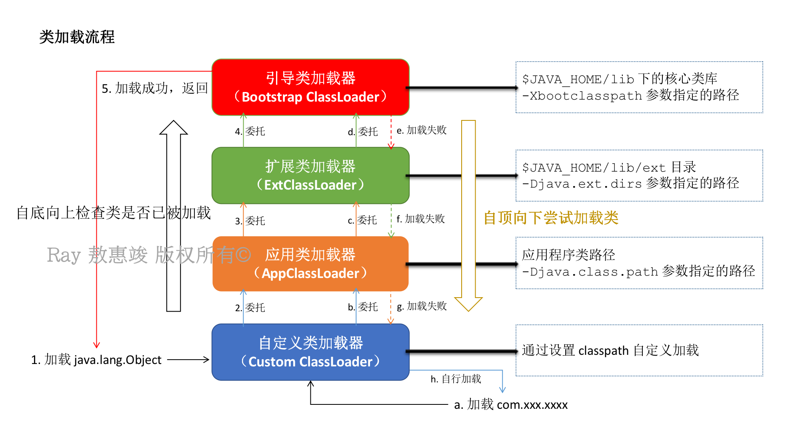
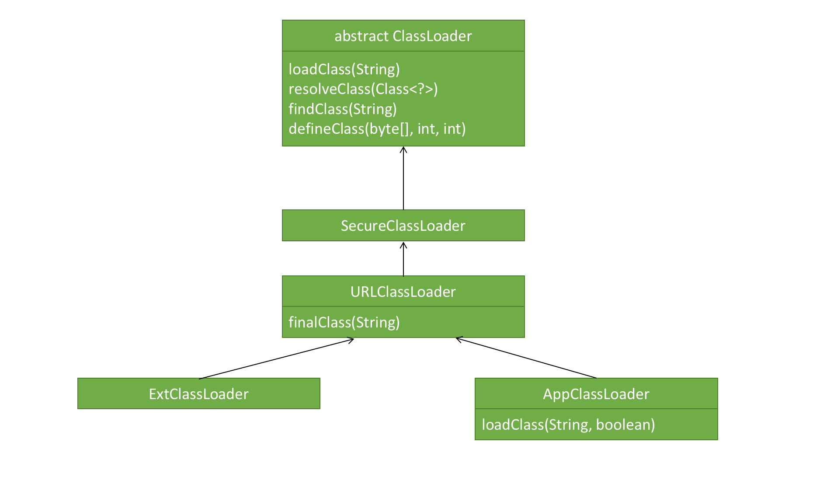
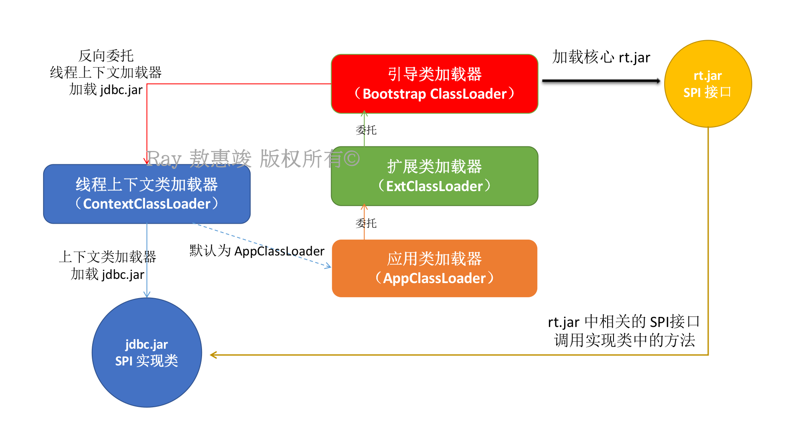
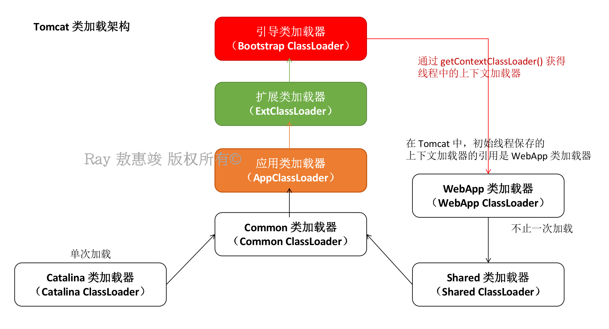

Java 程序的基本单元，就是一个个的类（Class）及类实例（Class Instance）。在使用类之前，必须先将类加载进 JVM 的内存中。

<!-- more -->

类加载器（Class Loader）作用：将类加载到 Java 虚拟机，并且检查类的完整性。

类加载机制：
1. 将描述类的数据从 `.class` 文件（cafe babe 0000 0034 0022 0800 ....）加载到内存；
2. 对数据进行校验、转换解析和初始化；
3. 最终构造成可被虚拟机直接使用的 Java 类型。

好处：
* 类的加载、连接和初始化过程都在程序的运行时完成，令 Java 具备高度的灵活性；
    * 其他语言是在编译时进行链接的
* 避免类被重复加载：即每个 JVM 中，只会有一个拥有同样全路径的 .class 文件；
* 沙箱安全机制：防止核心类库的核心类被篡改。

.class 文件被加载后，对应在 JVM 形成一份描述该类结构的元信息对象；通过该元信息对象可以获知 Class 的结构信息，如构造函数、属性、方法等。  
Java 允许用户借由这个 Class 相关的元信息对象间接调用 Class 对象的功能，这就是我们经常能见到的 Class 类。

JVM 只会加载程序执行时所需要的 .class 文件，**暂时不使用的类则不会被加载**。

<br/>

# 类加载过程
三大类，五步：**加载** -> **验证** -> **准备** -> **解析** -> **初始化**。

**1. 加载 Load**：加载类数据到内存，在堆区建立一个 Class 对象
1. 通过类的全限定名（com.xxx.xxxx.xxxx）获取该类的二进制字节流（.class 文件）
    * 可从磁盘上读取文件，或者根据链接请求网络文件，等
2. 解析流，将该字节流代表的**静态存储结构**转换为方法区的运行时数据结构，将类的信息存放到方法区中
3. 在静态区（内存）创建代表这个类的 `java.lang.Class` 实例，作为方法区该类的各种数据结构的访问入口
    * 没有规定这个对象要在堆中：比较特殊，虽是对象，但是在方法区
    * 注意：这里创建的应该是**实例**，而不是对象。

**2. 链接 Link**：把 Class 的二进制数据合并到 JRE，具体包括**验证**、**准备**和**解析**三步：
1. **验证 Verification**：此时类加载器会验证 .class 文件中类结构、语义、操作等的合法性，确保不会危害虚拟机安全。包括：
    1. 文件格式验证
    2. 元数据验证（语义分析，类与类的继承关系等）
    3. 字节码验证（数据流和控制流分析）
    4. 符号引用验证（对类自身以外的信息进行匹配校验）
2. **准备 Preparation**：为类的静态变量在方法区分配内存
    * final 的静态变量（也就是常量）在这个阶段赋值为其指定值
    * 非 final 的静态变量赋初始化默认值（0 值或 null）
        * 如有 `static int a = 1;` 静态变量 a 在准备阶段被赋值为 0，在初始化阶段被赋值为 1
    * 然后，一般的成员变量是在实例化的时候，随对象一起被分配到堆内存中
3. **解析 Resolution**：将 .class 二进制数据中常量池（即：静态常量池）中的符号引用替换成直接引用
    * **符号引用**：类名、方法名、字段名，具有人类可读性，类似于 OS 中的逻辑地址（`javap -verbose xxx.class` 的输出）；
    * **直接引用**：内存偏移量，指示内存真实地址，类似于 OS 中的物理地址；
    * 符号引用只是编译的结果，其指向的目标不一定加载到了内存中，而直接引用的目标一定已经加载到了内存中

**3. 初始化 Initialization**：赋予静态变量以程序原本指定的值，如上面说的 `static int a = 1;`，并初始化静态代码块
* 到了这个阶段，说明类已经顺利地被加载到了系统中
* 此时真正执行类中定义的 Java 程序代码
* 不是必然发生的


## 初始化的场景
JVM 规范中，严格规定了**有且只有** **`5`** 种情况**必须对类进行初始化**，这些行为称为对一个类进行“主动引用”：

<big>**一**</big>、遇到 `new`, `getstatic`, `putstatic`, `invokestatic` 这 4 条字节码指令时，如果类没有进行过初始化，则需要先触发类的初始化。  
常见代码场景：
* `new` 关键字实例化对象时
* 调用一个类的静态方法时
* 读取一个类的非 final 静态域或给它设值时
    * 不包括已经在编译期就将结果放入常量池的静态域，包括 final 静态域

注：访问类的 final 静态变量，即常量时不会触发该类的初始化
* 因为：常量在被写进类的字节码之前，会被编译器优化为 value 而不是 field；
* 所以编译器并不会对应生成字节码来从实例中载入 field 的值，而是直接把这个 value 插入到字节码中。
```java
class ConstClass {
    static {
        System.out.println("ConstClass init");
    }

    public static final	String HELLOWORLD = "hello world";
}

public class Test {
    public static void main(String[] args) {
        System.out.println(ConstClass.HELLOWORLD);  // 调用类常量：只会输出 "hello world"，不会输出 "ConstClass init"
    }
}
```

<big>**二**</big>、使用 `java.lang.reflect` 包的方法对类进行反射调用时，如果类没有进行过初始化，则需要先触发类的初始化。
* 如：`Class.forName()`

<big>**三**</big>、初始化一个类时，若其父类还没进行过初始化，则先初始化其父类。
* 这种情形会递归加载所有之前未被加载的父类

所以：通过子类来引用父类的静态字段（包括域和静态块），只会触发父类的初始化，不会触发子类的初始化。
```java
class SuperClass {
    static {
        System.out.println("SuperClass init");
    }

    public static final	String HELLOWORLD = "hello world";
}

class SubClass extends SuperClass {
    static {
        System.out.println("SubClass init");
    }
}

public class Test {
    public static void main(String[] args) {
        System.out.println(SubClass.HELLOWORLD);  // 只输出 "SuperClass init"，不会输出 "SubClass init"。
    }
}
```
* 对于静态字段，只有直接定义这个字段的类才会被初始化

<big>**四**</big>、JVM 启动时，用户需要指定一个主类（包含 `main` 方法的类），JVM 先初始化这个类。

<big>**五**</big>、JDK 1.7 动态语言支持：如果一个 `java.lang.invoke.MethodHandle` 实例最后的解析结果 `REF_getStatic`, `REF_putStatic`, `REF_invokeStatic` 的方法 handle，且这个方法 handle 所对应的类没进行过初始化，则需要先触发类的初始化。

<br/>

例：程序从 `HelloWorld.class` 开始运行——
1. 虚拟机从磁盘读取文件或请求 Web 上的文件等方法，加载 HelloWorld 类文件（`.class` 文件）的内容；
2. 如 HelloWorld 类拥有来自另一个类的域，或拥有超类，那么这些类文件也会被加载（类的解析）；
3. 虚拟机执行 HelloWorld 中 `main()` 方法；
4. 如 `main()` 或 `main()` 调用的方法需要用到更多的类：就加载这些类。

<br/>

## 类的唯一性
JVM 并不是一次性将所有文件都加载进来的，而是按需加载，通过不同的类加载器（后面小节会说到）加载不同的类。  
当程序到了某一段逻辑需要额外的类时，再通过类加载机制去加载到 JVM 中；而且会存放一段时间，便于频繁使用。

JVM 判断两个类是否相同：不仅要判定类的全限定名是否相同（同一个 .class 文件），而且要判断是否由同一个类加载器实例加载（`isAssingnableFrom()`）。  
也就是：任何一个类，需要这个类自身和加载它的类加载器来确定它在 JVM 的唯一性。

<br/>

# 类加载器类型
每个 Java 程序至少拥有三类加载器。

**1. 引导（启动，Bootstrap）类加载器**

最顶层的类加载器，随 JVM 启动而启动，是 JVM 不可分割的一部分
* 负责加载 JVM 运行所需要的：JDK 的**核心类库**，包括：
    * `$JAVA_HOME/lib` 路径下的核心类库
    * JVM `-Xbootclasspath` 参数指定路径下的 jar 包
    * 如 `rt.jar`, `resources.jar`, `charsets.jar` 等
* C++ native code 编写，没有父类，也没有对应的 ClassLoader 对象
    * 因此无法被 Java 程序直接引用
* 在构造的时候会同时构造 `ExtClassLoader`

出于安全性考虑，虚拟机是**按照文件名**识别并加载 jar 包的，而且 Bootstrap 类加载器只加载包名以 `java`, `javax`, `sun` 等开头的类。  
如果文件名不被 JVM 识别，即使将再多 jar 包丢到 /lib 目录下面也没用。  
而且，即使是自己重新打了一个 `rt.jar`，也是过不了虚拟机的安全机制，加载不了的。

<br/>

**2. 扩展（Extension）类加载器**

由 Sun 实现的 **`sun.misc.Launcher$ExtClassLoader`** 类，通过 Java 实现。
* 继承自 `URLClassLoader`，是 Launcher 的静态内部类
* 默认从 `$JAVA_HOME/lib/ext` 目录加载“标准的扩展”
* 还包括 java.ext.dirs 系统变量（`-Djava.ext.dirs`）所指定的路径中的所有类库
* 开发者可以直接使用该加载器
* 在构造的时候同时构造 `AppClassLoader`

<br/>

**3. 应用（Application）类加载器**

由 Sun 实现的 **`sun.misc.Launcher$AppClassLoader`** 类，通过 Java 实现，继承自 `URLClassLoader`。  
因为 `AppClassLoader` 又是 `ClassLoader.getSystemClassLoader()` 的返回值，所以又称之为**系统类加载器 System ClassLoader**）
* 用于加载应用程序的类路径 classpath 目录（`java -classpath` / `-Djava.class.path`）下所有 jar 和 .class 文件
* 开发者可以直接使用该加载器（`ClassLoader.getSystemClassLoader()`）
* 如应用没有自定义类加载器，那：它就是程序中**默认**的类加载器。

另：还可从 `/jre/lib/endorsed` 目录加载 —— 将某个标准 Java 类库替换为更新的版本。

<br/>

除了上述三类必备的类加载器之外，用户还可以自定义类加载器：  
**4. Custom Class Loader**
* 用户自定义的类加载器，父类为 `AppClassLoader`

自定义类加载器的原因：像刚刚所说的，JVM 比较认生，只识别指定文件名和路径下的资源文件，因此 Java 提供的默认 ClassLoader 只会加载指定目录下的 jar 和 .class。


## 基类源码浅析

除了 Bootstrap 类加载器，所有的类加载器，包括自定义的类加载器，均需继承 `ClassLoader` 类：

```java
import java.lang.ClassLoader;

abstract class ClassLoader {

    private final ClassLoader parent;

    ClassLoader getParent()    // 返回父类加载器，如为 Bootstrap ClassLoader 则返回 null

    static ClassLoader getSystemClassLoader()  // 获取系统的类加载器，即应用类加载器

    protected Class findClass(String name)  // 类加载器应覆盖此方法，以查找类的字节码

    protected Class<?> loadClass(String name, boolean resolve)  // 加载类

    Class defineClass(String name, byte[] byteCodeData, int offset, int length)
    // 将新的类添加到虚拟机中，其字节码在给定的数据范围（offset, length）中

    ...
}
```

<br/>

# 类加载层次：双亲委派模型
类加载器有一种“父/子关系”，它们是**组合**而非继承关系：
* 子类保存对父类的引用；
* 当某个类加载器收到类加载请求，首先将请求递归地委派给“父类”；
* 父类在自己的加载路径中搜索目标类；当父类找不到，无法完成加载时，加载工作才交还子类，由子类自身完成
* 除了 Bootstrap 引导类加载器外，每个类加载器都有一个父类加载器

以上即为“**双亲委派模型**（**Parents Delegation Model**, since Java 2）”

好处：
* 安全：避免用户自己编写的类动态替换了 Java 的一些核心类，如 `String` 等
* 避免重复加载某个类带来的混乱；加载分层次

举个例子：某自定义 ClassLoader 在亲自搜索需要加载的某个类之前，首先不会自己尝试去加载，而是将加载任务**委托**至父类加载器
* 检查这个类是否已被加载，没有则委派 `AppClassLoader` 加载
* 检查这个类是否已被加载，没有则委派 `ExtClassLoader` 加载
* 检查这个类是否已被加载，没有则委派 Bootstrap ClassLoader 加载
* 从 Bootstrap ClassLoader 开始，在它的搜索范围内找需要的类，试图加载
* 如没加载到：任务转交给 `ExtClassLoader`
* 如没加载到：任务再转交给 `AppClassLoader` 
* 如没加载到：任务再转交给该 ClassLoader 自身，或到网络或指定文件系统 URL 加载该类
* 如没加载到：抛出 `ClassNotFoundException`



再举个例子：

自定义类加载器通过 defineClass() 加载一个 "java.lang." 开头的类并不会成功；虚拟机将会抛出 `java.lang.SecurityException: Prohibited package name: java lang` 异常。  
因为类的加载早就分配好了是由引导类加载器加载 "java.lang." 开头的类。

<br/>

## 实现原理

类图关系：



如图，`ExtClassLoader` 和 `AppClassLoader` 都继承于 `URLClassLoader`。

<br/>

`ClassLoader` 中的四个方法：

**1.** `loadClass()` ：由 `ClassLoader` 实现，逻辑就是**双亲委派模型**的实现：
```java
protected Class<?> loadClass(String name, boolean resolve) throws ClassNotFoundException {

    synchronized (getClassLoadingLock(name)) {
        // 先从缓存查找该 class 对象，找到了就不用再重新加载了
        Class<?> c = findLoadedClass(name);
        if (c == null) {  // 没找到
            long t0 = System.nanoTime();
            try {
                if (parent != null) {  // 委托父类加载器加载
                    c = parent.loadClass(name, false);
                } else {  // 没有父类加载器：委托引导类加载器
                    c = findBootstrapClassOrNull(name); 
                }
            } catch (ClassNotFoundException	e) {
                // ClassNotFoundException thrown if class not found
                // from the non-null parent class loader
            }
            if (c == null) {
                // If still not found, then invoke findClass in order
                // 父类都找不到：调用自己类定义的 findClass() 去找
                c = findClass(name);
                // this	is the defining class loader; record the stats
                sun.misc.PerfCounter.getParentDelegationTime().addTime(t1 - t0);
                sun.misc.PerfCounter.getFindClassTime().addElapsedTimeFrom(t1);
                sun.misc.PerfCounter.getFindClasses().increment();
            }
        }
        if (resolve) {  // 是否需要在加载时进行解析
            resolveClass(c);
        }
        return c;
    }
}
```

**2.** `findClass()`：定义类加载器的类加载逻辑，在 `loadClass()` 被调用。
* 父类加载器加载失败后，就会调用自己的 `findClass()` 方法加载类。
* `ClassLoader` 的该方法为空方法；
* 一般来说，自定义类加载器会复写 `findClass()` 方法，定义自己的加载规则，将取得的字节码转换成流，再调用 `defineClass()` 生成 Class 对象。

````java
// 示例代码：
protected Class<?> findClass(String name) throws ClassNotFoundException {
    // 获取类的字节数组
    byte[] classData = getClassData(name);
    if (classData == null) {
        throw new ClassNotFoundException();
    } else {
        // 调用 defineClass() 生成 class 对象
        return defineClass(name, classData, 0, classData.length);  // 此处还没有对 class 文件进行解析
    }
}
````

**3.** `defineClass()`：通常与 `findClass()` 一起使用。

**4.** `resolveClass()`：创建并解析 Class 对象，符号引用替换成直接引用。

<br/>

`SecureClassLoader`：新增几个与使用相关的代码源验证（代码源位置和证书验证），和权限定义类验证（主要是对 class 源码的访问权限）的方法。

<br/>

`URLClassLoader`：一般和这个类打交道，包括扩展类加载器。
* 为父抽象类提供了实现
* 新增 `URLClassPath` 类协助取得 class 字节码流等功能
* 避免重写 `findClass()` 的时间消耗

<br/>

# 自定义类加载器
应用场景：
1. 常用于代码的加解密：想要让自己的 Java 不那么容易被反编译，可以先将编译后的代码使用某种算法加密；
    * 加密之后的代码就不能用 Java 的 ClassLoader 加载了，需要自定义类加载器在加载类时先解密，再加载；
2. 加载非标准来源的代码：自定义加载来自数据库、云端等地方的类，如开放式云平台；
3. 以上两种情况的综合运用：加密网络传输过来的 Java 类字节码

如何自定义：
* 如不想打破双亲委派模型：重写 `findClass()`
* 如想打破双亲委派模型：重写 `loadClass()`

<br/>

# 破坏双亲委派

这是除了重写 `ClassLoader` 的 `loadClass()` 方法之外，另外一种破坏双亲委派的做法。

**背景 1**：Java 应用存在很多的服务提供者接口（Service Provider Interface, **SPI**），允许第三方提供实现。
* JDBC、JNDI 等都是常见的 SPI

**背景 2**：SPI 的接口和实现是分离的：
* SPI 的接口属于 Java 核心类库，一般保存在 `rt.jar` 中 -> 由引导类加载器加载；
* SPI 的第三方实现代码则是作为 Java 应用所依赖的 jar 包，被存放在了 `classpath` 中

综上，因为 SPI 如果要实现，就需要经常加载具体的第三方实现类并调用其相关的方法：
* 首先，Bootstrap 类加载器加载不了这些类：因为它只能通过加载核心类库导入 SPI 接口类，**无法直接加载**这些实现类；
* 其次，虽然这看起来像是**应用类加载器**将要干的活，但是由于双亲委派模式的存在，Bootstrap 类加载器**无法反向委托**应用类加载器去加载实现类

那怎么办呢？

<br/>

可以利用**线程上下文加载器**（ContextClassLoader, since Java 2）解决问题。
* 可通过 `java.lang.Thread` 中的 `getContextClassLoader()` 和 `setContextClassLoader()` 获取和设置线程的上下文加载器
* 如果没有手动设置，线程就会继承其父线程的上下文加载器；初始线程的上下文加载器，就是**应用类加载器**（`AppClassLoader`）

以 JDBC 实现为例：



以上加载方式显然破坏了双亲委派模型：抛弃了原本的委托链，使程序逆向使用类加载器。

示例：可参考 `DriverManager` (from `rt.jar`)，通过读取配置文件获取需要加载的类的全限定名。

ContextClassLoader 默认存放了 AppClassLoader 的引用。  
无论当前程序在何处（Bootstrap ClassLoader 或者 ExtClassLoader 等），有需要时都可以调用 `Thread.getCurrentThread().getContextClassLoader()` 获得应用类加载器。

<br/>

## 应用：Tomcat 的类加载器结构

应用场景：

**1**. 最基本需求：部署在同一个 Web 容器的两个 Web 程序，它们所使用的 Java 类库可以相互隔离。
* 两个不同的应用程序，它们可能会依赖到**同一个**第三方类库的**不同版本**；
* 所以不能要求一个类库在一个 Web 容器中只有一份，容器应保证每个应用程序的类库可以独立使用。

用双亲委派模型能做到吗？做不到。  
双亲委派模型是根据包名+类名加载类的，不以版本作区分。因此如果不同应用的依赖类库不能相互隔离的话，容器一旦加载了其中一个版本的类库，另一个版本的就不能用了。

<br/>

**2**. 常见需求：部署在同一个 Web 容器上的两个 Web 应用程序，它们所使用的 Java 类库可以共享。
* 其实就是第一个需求的相对：比如有 10 个使用 Spring Framework 的应用程序部署于同一个容器中，如果每个应用隔离一份 Spring，将会造成巨大的资源浪费。
* 类库不能共享，则多组同质化类库加载到 Web 容器内存后，很容易造成虚拟机的方法区过度膨胀。

用双亲委派模型能做到吗？做不到。  
双亲委派模型根据不同的程序运行时，去给程序加载所需的类库，有多少个应用在跑，就无脑加载多少次，不会去管“如果某几个应用用了同样的类库，我就加载一次”的情况。

<br/>

**3**. Web 容器需要尽可能保证自身的安全，不受部署的 Web 应用程序影响
* 特别是某些使用 Java 实现的 Web 容器，其自身的库依赖问题也要重视；
* 基于安全考虑，容器所使用的类库应该与应用程序的类库相互独立。

<br/>

又要隔离，又要共享，还要和容器类库相互独立，Tomcat 的类加载器结构只能**打破双亲委派模型**去做这些事。



每次新启动一个 Web 应用，其类加载器默认的加载顺序是：
1. 先从缓存中加载
2. 如果没有找到，就从 JVM 的 Bootstrap 类加载器加载
3. 如果还没有找到，则 Bootstrap 类加载器**反向委托**回当前的类加载器，去加载所需要的类（按照 `WEB-INF/classes`, `WEB-INF/lib` 的顺序）
4. 如果还没找到，则委托其父类加载器加载，顺序是：`AppClassLoader` -> `Common ClassLoader` -> `Shared ClassLoader`。
