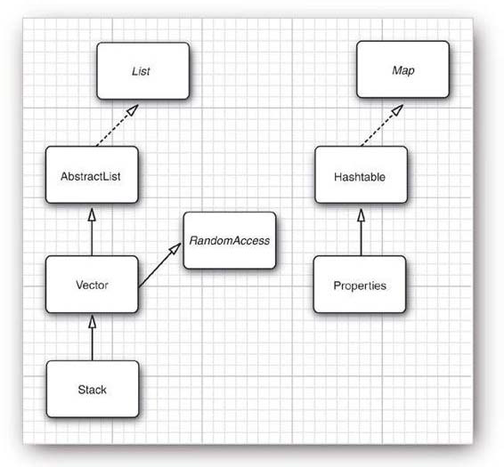

JCF，Java Collections Framework 的简称。[官方文档](https://docs.oracle.com/javase/8/docs/technotes/guides/collections/)解释其为“统一化的表示和操作集合的架构”。

<!-- more -->
一个集合类的实例，如链表、队列、映射表等，都是若干个对象的集合，是数据结构类型的实例化结果。由于复杂的类结构，所有 Java 集合相关的接口以及类被统称为“集合框架”（JCF）。  
其实理解为“**体系**”更为恰当。

优势：
* 降低代码量和复杂度
    * 不需要由开发者再进行基础数据结构的设计
    * 提高代码复用性，降低编码难度，增强可操作性
* 提升代码性能
    * 被 JDK 收录的集合类库是一系列数据结构类型的具体实现
    * 质量和性能较高，降低底层代码的性能风险和维护成本


# 诞生背景

Java 最初版本：只为最常用的数据结构提供很少的一组类：
* `Vector`
* `Stack`
* `Hashtable`
* `BitSet`
* `Enumeration`：提供访问任意容器中各元素的抽象机制


## 改进想法

### 全新框架
* 将传统的类融入到新框架中
* 让类库规模小且易于学习，不希望像 C++ 的 STL 那样复杂
* 能得到 STL 的泛型算法具有的优点

### 使用**泛型**
为集合提供一个可以容纳的对象类型
* 如添加其它类型任何元素：编译错误
* 使代码变得整洁

### 实施：**接口（interface）与实现（implementation）分离**

例如：队列不同的实现方法：
* 若需要实现循环数组队列，可使用 `ArrayDeque` 类
* 若需要链表队列，可使用 `LinkedList` 类：实现了 Queue 接口
    * 循环数组为有界集合，高效；链表没有上限
* `ArrayList` 迭代：从 0 开始添加索引
* `HashSet`：无法预知元素被访问的顺序

即：构建集合时，只有使用具体的类才有意义

如：使用接口类型存放集合的引用
```java
Queue<Customer> expressLane = new CircularArrayQueue<>(100);
expressLane.add(new Customer("Harry"));
```

如要改为另一种实现方式，则：
```java
Queue<Customer> expressLane = new LinkedListQueue<>();
expressLane.add(new Customer("Harry"));
```


# “体系”下的集合框架（Collections Framework）

构成：
* 提供一系列的集合接口：如 `Set`，`List`，`Map` 等
* 针对集合接口的基础支持，如 `Iterator`
* 针对集合接口的抽象类实现：允许更多定制，类名通常以 `Abstract-` 开头
* 针对集合接口的通用实现：实现了接口的基本功能：`ArrayList`，`HashMap`，`LinkedList`，...
* 针对集合接口的包装类（Wrapper）实现，比如让接口只读
* 针对集合接口的高性能且方便的功能性实现，如数组转换成 List
* 为早期的集合类添加集合接口的实现，如 `Vector`，`HashTable` 等
* 针对集合接口的某些特殊实现，如特殊的 List
* 针对集合接口的同步实现：通常以 `Concurrent-` 开头，为线程安全类
* 提供了针对集合的算法，如 `Collections` 类提供的 List 排序算法
* 针对数组的工具类，但严格来说不算 JCF 的一部分

学习框架是为了：
* 想要实现用于多种集合类型的泛型算法
* 想要增加新的集合类型

小结：
* 该框架是一个类的集，奠定了创建高级功能的基础
* 框架使用者创建的子类可以扩展超类的功能，不必重新创建基本机制
* Java 集合类库为集合实现者定义并描述大量接口和抽象类


# 基本接口

接口类图如下：


<big>包括：</big>

## <small>Collection (`java.util.Collection`)</small>

```java
java.util.Set
java.util.SortedSet
java.util.NavigableSet
java.util.Queue
java.util.concurrent.BlockingQueue
java.util.concurrent.TransferQueue
java.util.Deque
java.util.concurrent.BlockingQueue
```

## <small>Map (`java.util.Map`)</small>
```java
java.util.SortedMap
java.util.NavigableMap
java.util.concurrent.ConcurrentMap
java.util.concurrent.ConcurrentNavigableMap
```

<big>和基础功能：</big>

## Iterators
迭代器，与 Enumeration 接口类似，但更加强大

`Iterator`
* 除了实现 Enumeration 接口外，还能删除元素

    ```java
    E next();  // 返回下一个元素

    boolean hasNext()  // 循环调用遍历元素
    // 到达队列末尾时，next() 抛出 NoSuchElementException

    /* 
     next() 和 remove() 的调用具有依赖性
     调用 remove() 之前不调用 next()：抛出 IllegalStateException 异常
     */
    void remove()  // 删除上次调用 next() 时返回的元素    

    default void forEachRemaining()  // 编译器将其翻译为带有迭代器的循环
    ```

    ```java
    for (String element : c) {
        doSomething(element);
    }
    // for each 对于标准类库任何集合都可使用
    ```

应用：以 Map 为例
```java
public static void main(String[] args) {
    Map<Integer, Object> map = new HashMap<>();
    map.put(1, "a");
    map.put(2, "b");
    map.put(3, "c");

    Iterator<Integer> iterator = map.keySet().iterator();
    // 差劲的遍历方法，迭代 key，每次根据 key 再 get
    // Sonar 已不再建议这种迭代方式
    while(iterator.hasNext()) {
        Integer key = iterator.next();
        System.out.println(key + "=" + map.get(key));
    }

    // 一般遍历方法，entrySet 是一个 Set 实现类，返回一个 Iterator 对象
    Iterator<?> iterator2 = map.entrySet().iterator();
    while(iterator2.hasNext()) {
        System.out.println(iterator2.next());
    }

    // 一般遍历方法，在 JDK 1.7- 最常见
    for(Map.Entry<Integer, Object> entry: map.entrySet()) {
        System.out.println(entry.getKey() + "=" + entry.getValue());
    }

    // JDK 1.8 中的遍历方法，利用 lambda 表达式简化了语句
    // forEach 内部实现其实仍是一般方法
    map.forEach((k, v)->{
        System.out.println(k + "=" + v);
    });
    // 进一步简化
    map.forEach((k, v)->System.out.println(k + "=" + v));
}

// 使用迭代器迭代，更加线程安全
```

注：`iterator.next()` 和 `iterator.hasNext()`，与 `Enumeration.nextElement()` 和 `Enumeration.hasMoreElements()` 一样
* 仅因为 iterator 的接口名较短，更多人愿意使用

`Enumeration` 和 `Iterator` 接口的区别：
* Enumeration 更基础，满足基础需要
* Enumeration 速度为 Iterator 两倍，使用更少内存
* Iterator 更加安全：当一个集合被遍历时，会阻止其他线程修改集合
* Iterator 允许调用者从集合中移除元素，Enumeration 做不到

`ListIterator`
* 支持 Iterator 的功能
* 将一个元素添加到迭代器所处位置的前面：`void add(E element)`
* 要想获取和删除给定位置的元素，只需调用 Iterator 接口中的 `next()` 和 `remove()` 方法即可
* 针对 List 的迭代器，支持双向迭代，元素替换，元素插入以及索引获取。

### Iterator `fail-fast` 属性
* 每次尝试获取下一个元素：该属性检查当前集合结构里的任何改动
* 如发现改动：抛出 `ConcurrentModificationException` 
    * 多个线程对同一个集合内容操作就可能抛出此异常
* Collection 中所有 Iterator 实现均按照 fail-fast 设计（除多线程安全集合外）
* 与之相对：`fail-safe`，不抛出 ConcurrentModificationException
    * 遍历时不直接在集合内容上访问
    * 而是先复制原有集合内容，在拷贝的集合上进行遍历

<big>注：</big>

Java 集合类库中的迭代器不同于其他类库的迭代器
* 传统集合类库迭代器使用数组索引建模：不需执行查找操作便可使迭代器移动
* Java 迭代器只能调用 `next()`，执行查找操作时，迭代器随之移动

因此 Java 迭代器应位于两元素之间：调用 `next()` 时跳至下一元素，返回前一元素。


即：可将 `Iterator.next()` 和 `InputStream.read(`) 等效
* 从数据流中读取一个字节，自动“消耗掉”该字节
* 下次调用 `read()` 将会消耗并返回输入的下一个字节
* 同样方式，反复调用 `next()` 可读取集合中所有元素


## Ordering
* `Comparable`
    * 其实现类要求各个元素可以自然排序，从而可以对整个集合排序
    * 元素之间的顺序由 equals() 的返回值得到
* `Comparator`
    * 如类本身不支持排序（没有实现 Comparable 接口）：手动创建一个类的 Comparator，重写排序方法
    * 如实现了 Comparable 接口：仍可利用 Comparator 重定义排序方法

    ```java
    public class Student implements Comparable<Student> {

        @Override
        public int compareTo(Student s) {
            ... // 提供对象的自然排序
        }
    }
    ```

    ```java
    public class MyComparator implements Comparator<Student> {

        @Override
        public int compare(Student s1, Student s2) {
            ...
        }
    }
    ```


## Runtime exceptions
* `UnsupportedOperationException`
    * 集合进行不被支持的操作时抛出
* `ConcurrentModificationException`
    * 迭代进行的时候集合被意外地修改，由迭代器抛出异常
    * 当 List 的视图正在进行操作，而 List 被意外修改了，同样抛出该异常


## Performance
`RandomAccess`
* 为避免执行成本较高的随机访问操作而引入的标记接口
* 该接口无任何方法，但可用来检测一个特定集合是否支持高效的随机访问
* 实现该接口的类需支持快速随机访问（random access）：随意访问 List 的任意索引的元素
* 实现了该接口的集合类：
    * `ArrayList`
    * `Vector`
    * `HashMap`
    * `TreeMap`
    * `HashTable`

<big>另：说说 Collection 的父接口：</big>

## <small>`Iterable`</small>
* 实现了 iterator 方法 `iterator()`，用于生成一个 Iterator 迭代器
* Since JDK 1.8：提供新的 `forEach()`，详情可参照[源码](https://hg.openjdk.java.net/jdk8/jdk8/jdk/file/687fd7c7986d/src/share/classes/java/lang/Iterable.java)。
    * 提供了默认实现，用于使用 lambda 表达式进行遍历

```java
List<String> list = Arrays.asList(new String[]{"Hello", " ", "World!"});

// lambda 表达式遍历
list.forEach(s -> System.out.println(s));

// lambda 表达式遍历简化版
list.forEach(System.out::println);
```


# 通用实现

实现接口的类：

```java
// 抽象类
java.util.AbstractCollection
java.util.AbstractList
java.util.AbstractSequentialList
java.util.AbstractSet
java.util.AbstractQueue

java.util.AbstractMap
```

```java
// 具体类
java.util.LinkedList
java.util.ArrayList
java.util.HashSet
java.util.TreeSet
java.util.PriorityQueue
java.util.ArrayDeque
java.util.concurrent.ConcurrentLinkedDeque

java.util.HashMap
java.util.TreeMap
java.util.EnumMap
java.util.concurrent.ConcurrentHashMap
```


| Interface |  哈希表  | 可变数组    | 平衡树   | 链表         | 哈希表+链表     |
| :-----:   | :-----: | :-----:    | :-----: | :-:         | :--------:    |
| List      | -       | ArrayList  | -       | LinkedList  | -             |
| Deque     | -       | ArrayDeque | -       | LinkedDeque | -             |
| Map       | HashMap | -          | TreeMap | -           | LinkedHashMap |
| Set       | HashSet | -          | TreeSet | -           | LinkedHashSet |

<table>
	<tr>
	    <th></th>
        <th></th>
	    <th>元素有序</th>
	    <th>允许元素重复</th>  
	</tr>
	<tr>
	    <td colspan="2">List</td>
	    <td>是</td>
        <td>是</td>
	</tr>
	<tr>
	    <td rowspan="3">Set</td>
	    <td>AbstractSet</td>
        <td rowspan="2">否</td>
        <td rowspan="3">否</td>
	</tr>
	<tr>
	    <td>HashSet</td>
	</tr>
	<tr>
	    <td>TreeSet</td>
	    <td>是（用二叉树排序）</td>
	</tr>
	<tr>
        <td rowspan="3">Map</td>
	    <td>AbstractMap</td>
        <td rowspan="2">否</td>
        <td rowspan="3">key 值必须唯一，value 可重复</td>
	</tr>
	<tr>
	    <td>HashMap</td>
	</tr>
	<tr>
	    <td>TreeMap</td>
	    <td>是（用二叉树排序）</td>
	</tr>
</table>


```java
// 遗留类：JCF 针对较旧的集合类为其添加了集合接口实现
java.util.Vector
java.util.Stack
java.util.Hashtable
java.util.Properties
```



`Hashtable`：与 HashMap 作用一样
* 实现 Map 接口
* 与 HashMap 有区别

`Enumeration`：枚举类
* 类似于 Iterator 的 hasNext() 和 next()，其也有 `hasMoreElements()` 和 `nextElement()`

属性映射表（property map）
* 键和值都是字符串
* 表可保存到一个文件中，也可从文件中加载
* 使用默认辅助表

实现属性映射表的 Java 平台类称为 `Properties`
* 线程安全

`Vector`
* 实现 `AbstractList` 接口
* 加了同步锁，同步的可变数组（线程安全），同时也包含了其自身的较旧的方法
* 读写方法都只是简单加上 `synchronized`，性能较差

Vector 扩容：
```java
public Vector(int initialCapacity, int capacityIncrement)  // 增量为正整数：按指定增量扩容

public Vector(int initialCapacity)  // 每次扩容将容量扩大一倍

public Vector()  // 等同于 public Vector(10)
```

`Stack`：栈，扩展自 Vector 类

`BitSet`：位集，存放位序列


# JCF 类图汇总


