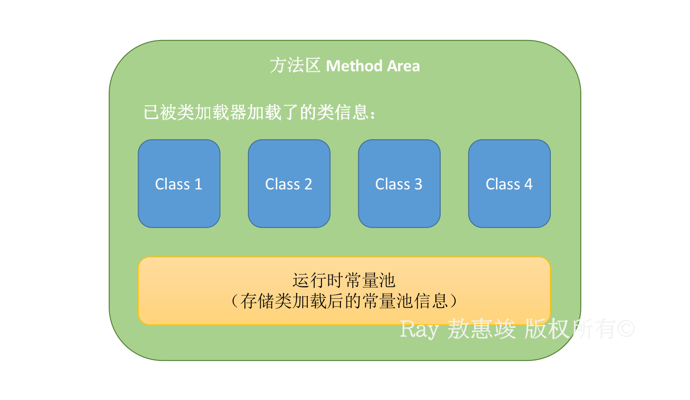
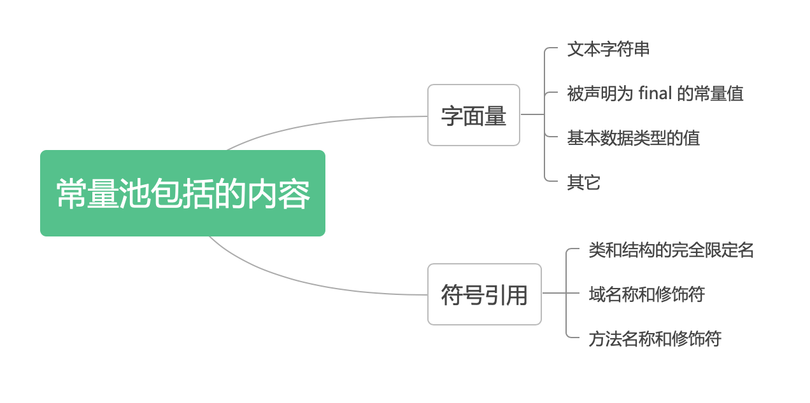

本来想在 [JVM 初探](/2021/07/07/jvm-basics)里面将 JVM 共享数据区里面的常量池讲清楚的，发现篇幅不够，因此另开了一个帖来唠唠。

<!-- more -->
常量池的实现是为了避免频繁的创建和销毁对象而影响系统的性能，实现了对象的共享。

平时会提及的 Java 中的常量池 Constant Pool 包括：

# 字符串常量池
在编译期间就把所有字符串文字放入一个常量池中：
1. 对于 `String s = "hello";` 直接生成放入常量池
2. 对于 `String s = new String("hello");` 常量池生成 "hello" 常量，new 的实例会在运行时在堆中创建

实现：`StringTable` 类，类似于一个 Hash 表
1. Java 6 及之前版本：长度固定为 1009
2. Java 7 及之后版本：长度可以通过参数设定

好处：
* 节省内存空间：在常量池中，所有相同的字符串常量会被合并，最终只占一个空间。
* 节省运行时间：比较字符串时 `==` 比 `equals()` 快；对于两个引用变量，只用 `==` 判断引用是否相等，也就可以判断实际值是否相等。

**小问题**：两个线程共享字符串常量池同一个字符串，其中一个线程改变它会如何？  
答：线程安全，因为 String 是 `final` 类

<br/>

# 静态常量池
* 位于方法区中
* 在编译期为某个类生成某个 .class 文件的时候，会生成一个常量池
    * 即：.class 文件中的常量池
* 用于存放编译期生成的：
    * 各种字符串（数字）字面量（文本字符串、final 常量值等）
    * 符号引用量（类和接口的全限定名，字段名称和描述符，方法名称和描述符）
    * 类、方法的信息
    * 以上占用了 .class 文件绝大部分空间。
* 池里面的数据项和数组项类似，使用索引访问。

<br/>

# 运行时常量池
* 位于方法区中，存储元数据（类的版本、接口、域、方法等）
* 在类加载完成后，将 .class 文件中的常量池（静态常量池）加载到内存中，并保持到对应的区域
* 我们最常提及的常量池，就是这个运行时常量池，在程序运行的时候，常量也会产生，这些新的常量也会加入池中。

静态常量池和运行时常量池的区别主要如下图：



<br/>

如果按照内容类别分，有以下两大类：




其他信息：
1. Java 6 及之前，常量池位于方法区，从 Java 7 之后移到了堆中
2. 类加载期间就把常量加载进了常量池
3. 部分原子类型的包装类也有自己的常量池
    * `Byte`, `Short`, `Integer`, `Long`, `Character`, `Boolean` 类型的常量池范围：除 `Boolean` (`true`/`false`)、`Character` [0 - 127] 外全部为 [-128, 127]
    * `Float` 和 `Double` 类型没有常量池：与精度有关
4. 原始数据类型的包装类和 `String` 作为方法参数时，是值传递。


测试代码：
```java
public class ConstantPoolTest {

    private static final String hel = "hel";
    private static final String lo = "lo";

    public static void main(String[] args) {
        Integer i1 = new Integer(1);
        Integer i2 = new Integer(1);
        // i1 != i2, 位于堆中非常量池的不同内存

        int int3 = 1;
        // i1 == int3, i2 == int3，比较时会自动拆箱

        Integer i3 = -128;
        Integer i4 = -128;
        // i3 == i4, 指向常量池中同一内存(-128~127)：since Java 5 的机制
        // 自动装箱，Integer i3 = Integer.valueOf(-128);
        // valueOf 会返回常量池中的对象或新生成堆中对象，此处返回常量池对象
        // 注：算术计算（加减乘除）时也会自动拆箱

        Integer i5 = 128;
        Integer i6 = 128;
        // i5 != i6, 指向不在常量池中
        // 自动装箱，Integer i5 = Integer.valueOf(128);
        // valueOf 会返回常量池中的对象或新生成堆中对象，此处返回堆中对象

        Boolean b1 = true;
        Boolean b2 = true;
        // b1 == b2, 常量池

        Double d1 = 1.0;
        Double d2 = 1.0;
        // d1 != d2, double/float 未实现常量池

        String s1 = new String("hello");
        String s2 = new String("hello");
        // s1 != s2, 位于堆中非常量池的不同内存

        String s3 = "hello";
        String s4 = "hello";
        // s3 == s4, 调用 String.valueOf()，指向常量池中同一内存

        String hello = "hello", hel = "hel", lo = "lo";
        /**
         * hello == "hello", 指向常量池中同一内存
         * 
         * hello == "hel" + "lo", 编译器自动对操作符右边的常量拼接进行优化：编译阶段就进行拼接
         * 
         * hello != "hel" + lo, 编译器不会优化变量，过程相当于：
         *   - new StringBuilder().append("hel").append(lo).toString();
         *   - 通过 StringBuilder::toString 返回 new String()，所以是指向堆中的变量
         * 
         * hello != hel + lo, 变量拼接不可预料，无法优化
         * hello == Test.hel + Test.lo, 静态常量指向常量池中的常量
         * hello == (hel + lo).intern()，手动载入常量池
         *     true，因执行 intern() 后返回的是 "hello" 在常量池中的对象
         * Test.hel + Test.lo == (hel + lo).intern()，手动载入常量池
         */

        hello.intern();
        // 手动将字符串载入常量池，并将对应的符号常量作特殊处理
        // Java 6 及之前：字符串如已存在于常量池，则直接返回该常量；否则将其加入到常量池
        // Java 7 及以后：字符串如已存在于常量池，则直接返回该常量；否则说明字符串在堆中，将对在堆中的该字符串的引用（引用指向堆中的字符串）添加至常量池
        //   - 以后拿到的是该字符串的引用，实际则存在于堆中

        String str1 = new String("1");
        // 执行前：在常量池创建 "1"
        // 执行时：new 一个 "1" 的对象存放到堆，然后 str1 指向堆中的变量
        str1.intern();  // 查看 "1" 是否在常量池中，存在则直接返回该常量
        String str2 = "1";  // 此时 "1" 已存在于常量池，str2 指向常量池的对象
        System.out.println(str1 == str2);  // false，因指向不同的位置

        String str3 = new String("2") + new String("2");
        // 底层调用 StringBuilder::append 拼接 "2" 和 "2"，再调用 toString() 去 new 一个 String 对象 "22"
        // 因此 "22" 是在堆里创建的
        str3.intern();  // 此时堆中有 "22"，但常量池还没有 "22"
        // Java 6-：在常量池创建 "22"
        // Java 7+：将堆中对 "22" 的引用放入常量池
        String str4 = "22";
        // Java 6- 指向常量池中的 "22"
        // Java 7+ 指向常量池中的引用，即 str3，最终指向堆中的变量
        System.out.println(str3 == str4);
        // Java 6- 为 false（同 str1 与 str2 的比较）
        // Java 7+ 为 true

        String str5 = new String("3");
        String str6 = "3";
        str5.intern();  // "3" 已经存在于常量池中
        System.out.println(str5 == str6);  // false

        String str7 = new String("4") + new String("4");  // 该 "44" 在堆里创建
        String str8 = "44";  // 该 "44" 在常量池中创建
        str7.intern();  // "44" 已经存在于常量池中，此时无论是 Java 6- 还是 Java 7+ 都直接返回常量值 "44"
        System.out.println(str7 == str8);  // false
    }
}
```
