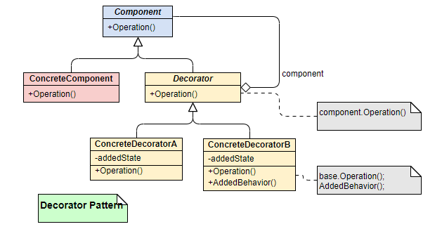

装饰器模式属于对象结构型模式。

<!-- more -->

《设计模式：可复用面向对象软件的基础》中的介绍：

    “动态地给一个对象添加一些额外的职责，就增加功能来说，该模式比生成子类更加灵活”

即：允许向一个已有的对象添加新的功能，同时又不改变其结构。  
其本质仍然是通过子类生成，但是比直接使用子类添加功能更加灵活。

<br/>

# 背景
通过继承的方式去扩充职责会有以下缺点：
* 如果对象之间关系复杂的话：造成系统复杂，不利于维护
* 容易产生“类爆炸”
* 静态功能

通过装饰器模式，能够动态地将责任附加到对象上
* 通过此模式扩展功能：能提供比继承更加有弹性的替代方案


# 结构图


以上，可见装饰器模式包括：

`Component`
* 抽象构件
* 定义一个对象接口，可以给这些对象动态添加职责
* 被装饰类和装饰类均需实现该接口

`ConcreteComponent`
* 具体构件
* 定义一个具体的对象，可以给该对象添加职责

`Decorator`
* 抽象装饰类
* 实现 Component 接口，从外类扩展实现 Component 接口的类的功能
* 对于 Component 类：无需知道 Decorator 存在

`ConcreteDecorator`
* 具体装饰类
* 给 Component 添加额外的职责


# 示例代码
抽象构件
```java
public interface Shape {
    void draw();
}
```

具体构件
```java
public class Circle implements Shape {

    @Override
    public void draw() {
        System.out.println("Shape: Circle");
    }
}
```

抽象装饰类
```java
public abstract class ShapeDecorator implements Shape {

    protected Shape decoratedShape;

    public ShapeDecorator(Shape decoratedShape) {
        this.decoratedShape = decoratedShape;
    }

    public void draw() {
        decoratedShape.draw();
    }
}
```

具体装饰类
```java
public class RedShapeDecorator extends ShapeDecorator {

    public RedShapeDecorator(Shape decoratedShape) {
        super(decoratedShape);
    }

    @Override
    public void draw() {
        decoratedShape.draw();
        setRedBorder(decoratedShape);  // 所添加的额外的职责
    }

    private void setRedBorder(Shape decoratedShape) {
        System.out.println("Border Color: Red");
    }
}
```

即：
1. 通过实现要被装饰类的接口，生成抽象装饰器；
2. 基于接口编程，抽象装饰器的构造方法传入被装饰的类接口的实现类；
3. 实现一个具体装饰类，在需要装饰的方法中添加额外的职责。

<br/>

#  优缺点
优点
* 装饰类和被装饰类可以独立发展，不会相互耦合
* 装饰模式是继承的一个替代模式，装饰模式可以动态扩展一个实现类的功能。

缺点
* 多层装饰比较复杂


# 适用性
1. 扩展一个类的功能
2. 动态增加功能，动态撤销


# 与代理模式的区别
* 代理模式追求流程的完整性与扩展性，追求对完整流程的把控和辅助；
* 装饰器模式讲求功能的修饰性；
* 装饰器模式可以通过层层嵌套来扩展功能，而某些代理并不支持多重嵌套。
