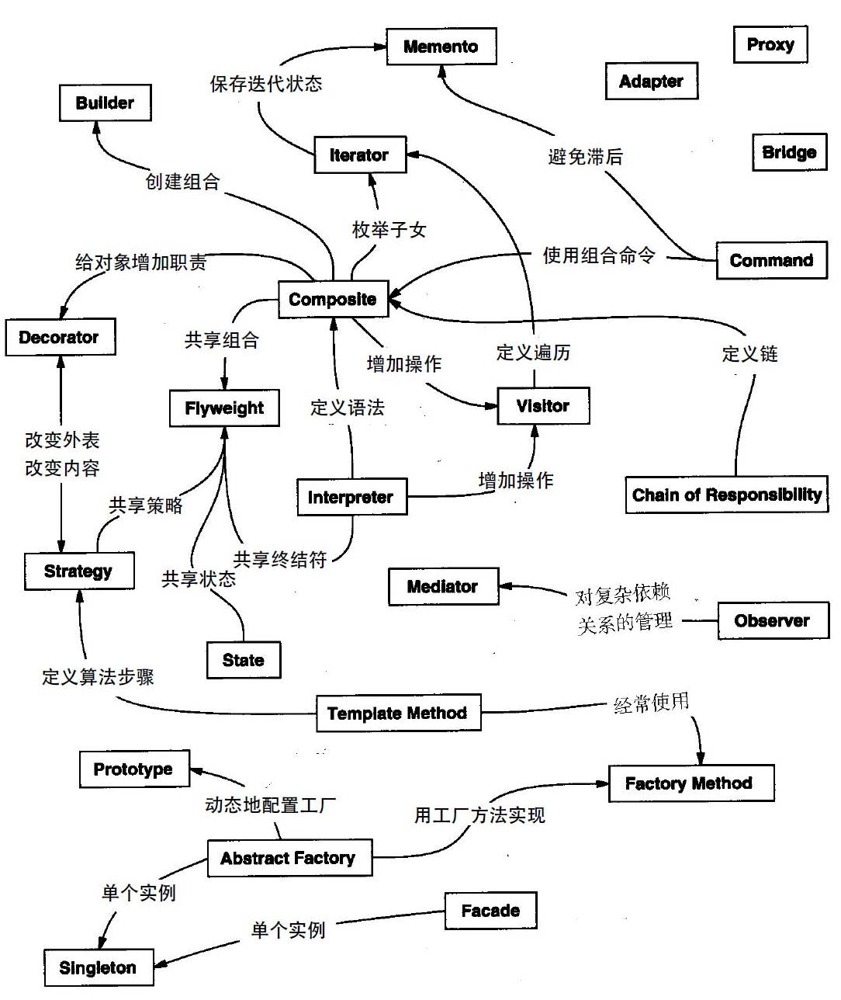

总结前人的程序设计和开发经验并加以概括、丰富，形成共识，这便是各种设计模式诞生的初衷。

<!-- more -->
 

# 背景
* 有经验的面向对象设计者往往能够做出良好的设计；
* 但新手面对众多选择无从下手，总是求助于使用过的非面向对象技术。
    * 并不是解决任何问题都需要从头做起的；
    * 当找到一个好的解决方案时，我们可以一遍又一遍地使用，在节省研发开销的同时，对该解决方案也能更好地维护。
* 总结设计经验的重要价值：
    * 解决一个问题，是在什么地方或者怎样解决的？ -> 总结经验

在进行项目开发之前，我们需明确：
## 程序设计的原则（SOLID + CD）

### **单一职责原则**（Single Responsibility Principle, **SRP**）
* 一个类应该只有一个职责，即只有一个引起它变化的原因
* 每个职责都是变化的一个轴线（如 setter）
* 如一个类有一个以上的职责：职责耦合，导致了脆弱的设计
    * 影响复用性
    * 当一个职责发生变化时，可能影响其他的职责

### **开闭原则**（Open Close Principle, **OCP**）
* 对扩展开放，对修改关闭
    * 程序需要拓展时，不能修改原有的代码，应实现“热插拔”的效果
* 尽量使用接口和抽象类
* 提高扩展性，易于维护和升级

### **里氏代换原则**（Liskov Substitution Principle, **LSP**）
* 背景：任何基类可以出现的地方，子类一定可以出现
* 因此：不要去破坏继承体系
    * 可以扩展，增加自己特有的方法
    * 但不要覆盖父类的非抽象（已实现）方法
    * 当子类覆盖或实现父类的方法时，方法的前置条件（即方法的形参）要比父类方法的输入参数更宽松
    * 当子类的方法实现父类的抽象方法时，方法的后置条件（即方法的返回值）要比父类的更严格
* 否则：代码会很容易有问题
* 继承复用的基石，开闭原则的补充

### **接口隔离原则**（Interface Segregation Principle, **ISP**）
* 使用多个隔离的接口，比使用单个接口要好
* 设计接口的时候要精简，要单一，细化，不要设计一个庞大的接口
* 即：类依赖的接口也要职责分明，从而降低一个类之间的耦合度

### **依赖反转原则**（Dependency Inversion Principle, **DI**）
* 依赖于抽象（接口），不依赖于具体细节
* 面向抽象编程，不要对实现进行编程
* 降低了客户与实现模块之间的耦合

### **合成复用原则**（Composite Reuse Principle）
* 在一个新的对象里通过关联关系（包括组合关系和聚合关系）使用一些已有的对象，使之成为新对象的一部分
* 新对象通过委派调用已有对象的方法，达到复用其已有功能目的
* 多组合，少继承

### **迪米特法则**（Demeter Principle，最少知道原则）
* 一个实体应尽量少地与其它实体之间发生相互作用
    * 即：每一个类要减少与其他对象产生的依赖
* 使得系统功能模块相互独立
* 当一个模块修改时，就会尽量少地影响其它的模块，扩展会相对容易
* 优点：高内聚，低耦合
* 缺点：一旦过度应用，会导致系统 / 工程中存在大量功能小的类，使得系统比较纷乱

<big>总结</big>：**用抽象去构建框架，用实现去扩展细节**。  
一个词：<big>**解耦**</big>（高可用，低耦合）

 

# 什么是设计模式？
在软件工程中：对软件设计普遍存在（**反复出现**）的各种问题所提出的解决方案
* 被反复使用，且为多数人所知晓，并经过分类编目的、代码设计经验的总结；
* “每一个模式描述一个在我们周围不断重复发生的问题，以及该问题的解决方案的核心。这样，你就能一次又一次地使用该方案而不必做重复劳动”。

<big>设计模式的来源：</big>
* 绝大部分以往并无文档记录
* 或是来源于面向对象设计者圈子里面的非正式交流
* 或来源于某些成功的面向对象系统的某部分

设计模式并不直接用来完成代码的编写，而是用来描述：在各种不同情况下如何解决问题的一种**方案**。

<big>设计模式提出的原因：**为了代码复用，增加可维护性**</big>
* 面向对象设计的终极目标——**开闭**（Open Closed），即：模块应该对扩展开放（open to extension），对修改关闭（close to modification）；
* 使开发者可以更加简单方便复用成功的设计和体系结构。

## **设计模式四要素**

每一个设计模式都确定了所包含的类和实例，它们的角色、协作方式以及职责分配，总结为“在特定场景下解决一般设计问题的类，和相互通信的对象的描述”。

### 模式名称（pattern name）
* 助记名，使用一两个词描述模式的目标问题、解决方案和效果
* 注：找到适当的模式名也是设计模式编目工作的难点之一

### 问题（problem）
* 描述应在何时使用模式
* 解释了设计问题，和问题存在的前因后果
    * 包括使用模式必须满足的一系列先决条件
* 描述的可能是特定的设计问题（怎样用对象表示算法）
* 也可能描述的是：导致不灵活设计的类或对象结构

### 解决方案（solution）
* 描述了设计的组成部分，各部分之间的相互关系以及各自的职责和协作方式
* 提供设计问题的抽象描述，怎样用一般意义的元素组合去解决问题
    * 而并不是描述一个特定的、具体的设计或实现

### 效果（consequences）
* 描述模式应用的效果，及使用模式应该权衡的问题
* 包括对系统的灵活性、扩充性或可移植性的影响

## **设计模式分类**
GOF 所著的《设计模式》中，常用的设计模式一共 `23` 种，粒度和抽象层次各有不同。  
按照每个设计模式的目的（模式用来干嘛的），大致可分为三种类型：  

 

### **创建型模式**：与对象的创建有关

1. 系统演化成越来越依赖于**对象组合**，而不是类继承
2. 重心转移：从对一组固定行为的硬编码（hard-coding） -> 定义一个较小的基本行为集
    * 硬编码不够灵活：如想改变设计的一部分，需通过重写或重新实现
    * 行为可被组合成任意数目的更复杂的行为：因此不仅仅是实例化一个类
        * 如：实例化一个房间，不仅仅只是实例化一扇窗，还有窗户、桌子……等

创建型模式抽象了实例化过程，帮助一个系统独立于如何创建、组合和表示其对象。其中：
* **类创建型模式**：使用继承改变被实例化的类
* **对象创建型模式**：将实例化委托给另一个对象

主旋律：
* 将关于该系统使用哪些具体的类的信息封装起来
* 隐藏了这些类的实例如何被创建和放在一起的（隐藏创建细节）
    * 在创建什么、在什么时候被创建、谁创建它、怎样被创建等方面给予了很大的灵活性
* 达到使整个系统独立的目的

应用场景：
* 一个系统需要和它的对象和产品的创建相互独立
* 一组相关的对象被设计为一起使用
* 隐藏一个类库的具体实现，仅暴露它们的接口
* 创建独立复杂对象的不同表示
* 一个类希望它的子类实现它所创建的对象
* 类的实例化在运行时才指定
* 一个类只能有一个实例，而且这个实例能在任何时候访问到
* 实例应该能在不修改的情况下具有可扩展性

**1. 抽象工厂模式**（**Abstract Factory**）

    “提供一个创建一系列相关或相互依赖的对象（产品族）的接口，而无需指定它们具体的类”

**2. 建造者模式**（**Builder**）

    “将一个复杂对象的构建与它的表示分离，使得同样的构建过程可以创建不同的表示”

**3. 工厂方法模式**（**Factory Method**）

    “定义一个用于创建对象的接口，让子类决定将哪一个类实例化”
* 将一个类的初始化下放到子类

**4. 原型模式**（**Prototype**）

    “用原型实例指定创建对象的种类，并且通过复制该原型来创建新的对象”

**5. [单例模式](/2021/06/19/singleton)**（**Singleton**）

    “保证一个类仅有一个实例，并提供一个对该实例的全局访问点”

 

### **结构型模式**：处理类或对象的组合
* 处理类或者对象的组合，涉及到如何组合类和对象以获得更大的结构
* 从程序结构上解决模块之间的耦合问题

**1. [适配器模式](/2021/06/22/adapter)**（**Adapter**）

    “将一个类的接口转换为客户希望的另外一个接口，使得原本由于接口不兼容而不能一起工作的那些类可以一起工作”
* 消除接口不匹配造成的类不兼容问题

**2. 桥接模式**（**Bridge**）

    “将抽象部分与它的实现部分分离，使它们都可以独立地变化”

**3. 组合模式**（**Composite**）

    “将多个对象组合成树状结构以表示“部分－整体”的层次结构，使得用户对单个对象和组合对象的使用具有一致性”
* 让客户可以同等对待单个对象和对象的组合（具有一致性）

**4. [装饰器模式](/2021/06/22/decorator)**（**Decorator**）

    “动态地给一个对象添加一些额外的职责，就增加功能来说，该模式比生成子类更加灵活”
* 是除了类继承之外，另一种扩展功能的方法

**5. 外观模式**（**Facade**）

    “为子系统中的一组接口提供一个一致的界面。其定义的高层接口能让这个子系统更加容易使用”

**6. 享元模式**（**Flyweight**）

    “运用共享技术，有效地支持大量细粒度的对象”

**7. [代理模式](/2021/06/19/proxy)**（**Proxy**）

    “为其他对象提供一个代理，以控制对这个对象的访问”

 

### **行为型模式**：对类或对象怎样交互和怎样分配职责进行描述
描述类或对象怎样**交互**和**分配职责**
* 一个类的行为或其算法可以在运行时更改
* 涉及到算法和对象间的职责分配
* 不仅描述对象或者类的模式，还描述它们之间的通信方式
* 将注意力从控制流转移到**对象关系**上来

**1. 职责链模式**（**Chain of Responsibility**）

    “使多个对象都有机会处理这个请求，从而避免请求的发送者和接收者之间的耦合关系”
    “将这些对象连成一个链，并沿着这条链传递该请求，直到有一个对象处理它为止”

**2. [命令模式](/2021/06/19/command)**（**Command**）

    “将一个请求封装为一个对象，从而可以用不同的请求对客户进行参数化、对请求排队或者记录请求日志，以及支持可取消的操作”

**3. 解释器模式**（**Interpretor**）

    “给定一个语言，定义它的文法的一种表示，并且定义一个解释器，该解释器使用该表示来解释语言中的句子”

**4. 迭代器模式**（**Iterator**）

    “提供一种方法顺序访问一个聚合对象中的各个元素，而又不需暴露该对象的内部表示”

**5. 中介者模式**（**Mediator**）

    “用一个中介对象来封装一系列的对象交互”
    “使各对象不需要显式地相互引用，从而使其耦合松散，且可以独立改变它们之间的交互”
* 当某些对象之间的作用发生改变的时候，不会立即影响其他的一些对象之间的作用，保证这些作用可以彼此独立地变化

**6. 备忘录模式**（**Memento**）

    “在不破坏封装性的前提下，捕获一个对象的内部状态（快照），并在该对象之外（外部化）保存这个状态”
    “这样以后就可以将该对象恢复到保存的状态”

**7. [观察者模式](/2021/06/22/observer)**（**Observer**）

    “定义对象之间的一种一对多的依赖关系，以便当一个对象的状态发生改变时，所有依赖它的对象都得到通知并自动更新”

**8. 状态模式**（**State**）

    “允许一个对象在其内部状态改变的时候改变他的行为”
    “这让对象看起来似乎修改了他所属的类”
* 需要对每一个系统可能获取的状态创立一个状态类的子类，系统状态变化时，系统改变所选的子类

**9. [策略模式](/2021/06/19/strategy)**（**Strategy**）

    “定义一系列算法，将他们一一封装，并使他们可以相互替换”
    “本模式使得算法能独立于使用它的客户而变化”

**10. [模板方法模式](/2021/06/22/template-method)**（**Template Method**）

    “定义一个操作中算法的骨架，而将一些步骤延迟到子类中”
    “能使得子类能在不改变一个算法的结构的情况下，即可重定义该算法的某些特定步骤”

**11. 访问者模式**（**Visitor**）

    “表示一个作用于某对象结构中的各元素的操作。使开发者可以在不改变各元素的类的前提下定义作用于这些元素的新操作”
* 把数据结构和作用于结构上的操作之间的耦合解脱开

按照适用范围（模式用于类还是对象），分为两种类型：
* 适用于**类**：工厂模式、适配器模式（类）、解释器模式、模板方法模式
    * 处理类和子类之间的关系
    * 关系通过继承确立，编译时候就确定下来了
* 适用于**对象**：其他的设计模式
    * 处理对象间的关系，可以变化，更具动态性

如下表：
<table>
	<tr>
	    <th rowspan="2" colspan="2"></th>
	    <th colspan="3">目的</th>  
	</tr>
	<tr>
	    <th>创建型</td>
	    <th>结构型</td>
	    <th>行为型</td>
	</tr>
	<tr>
	    <th rowspan="11">范围</th>
	    <th rowspan="2">类</th>
        <td rowspan="2">Factory Method</td>
        <td rowspan="2">Adapter(Class)</td>
        <td>Interpreter</td>
	</tr>
	<tr>
	    <td>Template Method</td>
	</tr>
	<tr>
	    <th rowspan="9">对象</th>
	    <td>Abstract Factory</td>
        <td>Adapter(Object)</td>
        <td>Chain of Responsibility</td>
	</tr>
	<tr>
	    <td>Builder</td>
        <td>Bridge</td>
        <td>Command</td>
	</tr>
    <tr>
	    <td>Prototype</td>
        <td>Composite</td>
        <td>Iterator</td>
	</tr>
    <tr>
	    <td>Singleton</td>
        <td>Decorator</td>
        <td>Mediator</td>
	</tr>
    <tr>
	    <td></td>
        <td>Facade</td>
        <td>Memento</td>
	</tr>
    <tr>
	    <td></td>
        <td>Flyweight</td>
        <td>Observer</td>
	</tr>
    <tr>
	    <td></td>
        <td>Proxy</td>
        <td>State</td>
	</tr>
    <tr>
	    <td></td>
        <td></td>
        <td>Strategy</td>
	</tr>
    <tr>
	    <td></td>
        <td></td>
        <td>Visitor</td>
	</tr>
</table>

表格注释：  
* 类创建型模式：将对象部分创建工作延迟到**子类**
* 对象创建型模式：将对象部分创建工作延迟到**另一个对象**中
* 类结构型模式：使用**继承**机制组合类
* 对象结构型模式：描述对象的**组合**方式
* 类行为型模式：使用**继承**描述算法和控制流
* 对象行为型模式：描述一组对象怎样**协作**完成单个对象所无法完成的任务

关系如下：
