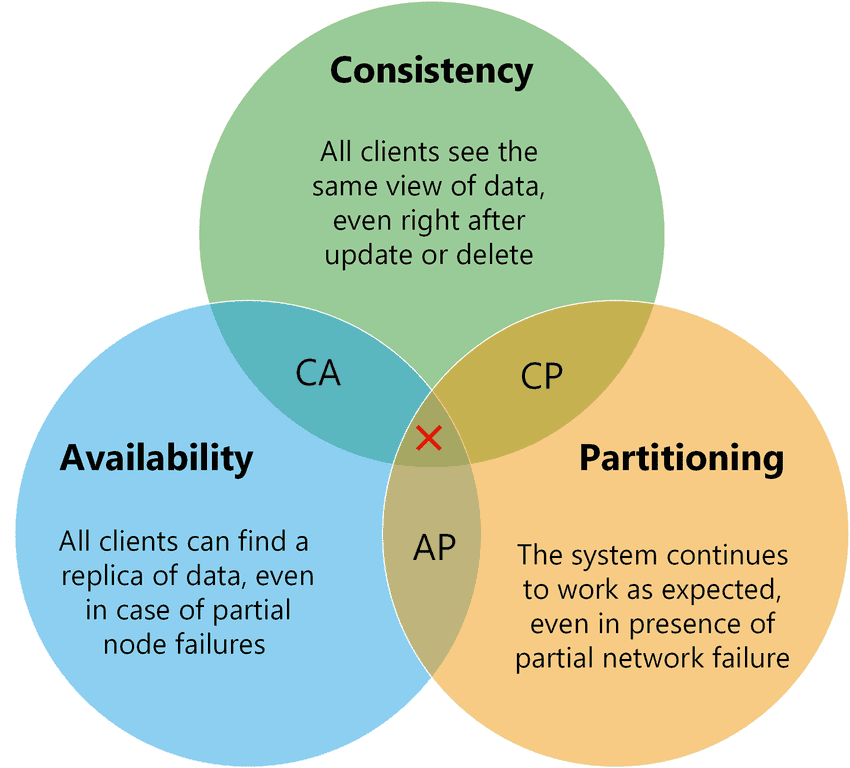

先给结论：能不用分布式事务就不用，但是 ——

<!-- more -->

随着互联网技术和社会业务需求的不断发展，系统日益复杂，分布式架构逐渐流行，因此分布式事务是避不开的话题。

在此先捋一下分布式事务的基础理论。

# CAP

CAP 定理，或者叫 CAP 原则，指的是在一个分布式系统中，对于**一致性（Consistency）**、**可用性（Availability）**、**分区容错性（Partition tolerance）** 这三个基本需求，最多只能**同时满足其中的两个**。

CAP 是基于**瞬态**的描述性理论。

一致性（**C**）：在分布式系统中，不同的节点分别保存着数据副本，每个节点的数据副本之间能够保持一致。

可用性（**A**）：系统提供的服务一直处于可用的状态，每次请求都能获得正确的响应；即使集群中部分节点存在故障，整体服务还能响应客户端请求。

分区容错性（**P**）：对通信时限性存在要求。分布式系统在遇到任何网络分区故障的时候，仍然能够正常对外提供服务。

## 为什么三者不可兼得

首先分布式系统，是避免不了分区的。  
何为分区？分布式系统的不同节点分布在不同子网中，这些相对孤立的子网络我们称之为分区。

分布式系统是避免不了分区的，因此分区容错性（P）一定要满足。  
在此基础上，**当网络故障或者其它原因，导致某个分区出现故障**的时候，某个用户请求修改数据：

* 如果允许其中一个副本更新，则分区故障副本无法被更新，导致数据不一致，即**一致性（C）无法满足**；
* 如果为了保证一致性，将分区故障副本设置为不可用，那么**可用性（A）无法满足**。

举个例子：假设存在两个分区 P1 和 P2，P1 包括服务 S1 和数据 D1，P2 包括服务 S2 和数据 D2。  
此时网络发生了故障，导致 D2 网络不通。

用户访问 S1 修改了 D1 的数据，再次访问时请求落在了 P2：此时 D1 和 D2 的数据是不一致的。

* 如果要保证一致性（C）：D1 和 D2 的数据不一致，就不能返回，导致服务 S2 无法响应，**可用性（A）无法满足**；
* 如果要保证可用性（A）：S2 响应请求，返回了与 D1 不一致的数据，**一致性（C）无法满足**。

## 权衡

三者不可兼得，在 CAP 的框架范围内，我们需要做一些权衡。  
根据排列组合，我们有三种权衡方案（如上图）：

### CA without P

单机系统的性质，节点之间通信网络一定会有问题，即放弃了系统的扩展性。  
因此分布式系统理论上是不可选 CA 的。

应用于早期的单体服务，比如 MySQL 的 InnoDB 等传统关系型数据库，满足 ACID 的刚性事务。

### CP without A

牺牲了可用性（A），相当于每个请求需要在服务之间强一致；由于分区的存在，会导致数据同步时间无限延长，影响用户体验。

分布式数据库采用的是 CP 方案。

### AP without C

保证可用性的话，就不能保证数据一致性。因此每个节点只能用本地数据提供服务。

市面上很多 NoSQL都采用此方案；在业务应用中的高峰值订单、秒杀系统等都暂时放弃数据一致性。

## 实际应用

在微服务的常用组件中：

* ZooKeeper 保证的是 CP：数据强一致性，但是不保证每次请求的可用性；选举过程中过半数机器不可用时，服务不可用
* Eureka 保证的是 AP：每个节点都是平等的，这种设计方式就是为了先保证可用性，因此即使大部分节点挂掉也不会影响服务，只要一个节点可用就行
* Nacos 既支持 CP 也支持 AP（注册临时节点）

# BASE

BASE 理论包含的是 **Basically Available**（基本可用）, **Soft state**（软状态）, **Eventually consistent**（最终一致性）。

一句话概括：先保证系统的基本可用（保证核心功能的能力），各节点的数据允许出现软状态（中间状态），最终达到一致性。

BASE 理论是基于 CAP，综合了大规模分布式系统的实践，而得到的对 C 和 A 做权衡的结果。  
其核心思想是：

    即使无法做到强一致性，但是每个应用可根据自身特点，采用适当方式使系统达到最终统一。

## 基本可用

分布式系统出现故障时，能够保证核心服务可用，**允许损失部分可用性**。

损失掉的部分可用性包括：

* **响应时间上的损失**：响应时间会从毫秒级增加到秒级；
* **功能上的缺失**：部分用户会被引导到降级之后的服务；
* ...

## 软状态

允许系统出现中间状态，这样的中间状态不影响系统的整体可用性。  
即允许系统在不同节点的数据副本之间进行数据同步的过程存在延时。

## 最终一致性

系统中的所有数据副本，在经过一定时间的同步后，最终能够达到一致的状态。

与刚性事务 ACID 不同，基于分布式系统的 BASE 理论属于**柔性事务**。

如何保证最终一致性？

* 读取数据时检测到数据不一致，进行修复
* 写入数据时检测到数据不一致，进行修复
* 异步修复

--- 

# References

[小米信息部技术团队 - 分布式事务，这一篇就够了](https://xiaomi-info.github.io/2020/01/02/distributed-transaction/)

[分布式必备理论基础：CAP和BASE](https://www.cnblogs.com/three-fighter/p/15293310.html)
