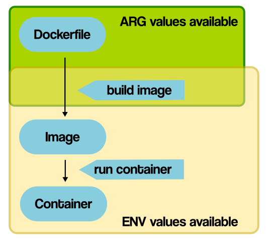
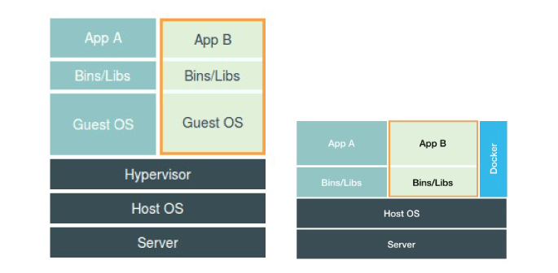

Docker 是利用 Go 开发的一种虚拟容器技术，属于轻量级的虚拟化。

<!-- more -->

Docker 本身不是容器，而是创建容器的工具，是应用容器的引擎。


这句 slogan **"Build, ship and run."** 就很能说明 Docker 的思想：如同它的 logo 一样，Docker 是一条大鲸鱼，承载的一个个的集装箱就是各个不同的容器，容器之间相互**隔离**。  
跟虚拟机一样，Docker 的核心思想也是“隔离”。Docker 通过隔离机制，既可以保障每个集装箱里的东西互不相干，也能将服务器资源压榨到最大程度。

由于 Docker 将包括运行环境在内的应用上下文一起打包，它的出现大大减少了开发过程中因为开发、测试环境和生产环境之间的切换导致的程序不兼容问题，简化与加快了产品发布流程。

Docker 的核心概念包括：
* 镜像 Image
* 容器 Container
* 仓库 Repository

先说说镜像。


# 镜像

镜像 Image 是一种**轻量级**、**可执行**的独立软件包，提供了容器运行时所需的程序、库、资源、配置等文件。
* 包含一切为运行时准备的配置参数、环境变量等
* 不包含任何动态数据，其内容在构建之后也不会被改变
* 基于基础镜像（没有父镜像）可制作各种具体的应用镜像

获得镜像的方式：
* 通过 Dockerfile 制作
* 通过传输拷贝方式获得
* 从远程仓库下载

Image 属于联合文件系统，是一种**分层**、**轻量级**且**高性能**的文件系统，是 Docker image 的基础。
* 支持对文件系统的修改作为一次提交来逐层叠加
* 可将不同目录挂载到同一个虚拟文件系统下

从 Registry 拉取镜像的时候，是一层一层并行下载的。好处是能实现**共享资源**。
* 比如有多个镜像都从相同 base 镜像构建而来
* 宿主机只需在磁盘和内存各保存一份 base，就可以为所有容器服务

镜像加载原理
* 最底层是 **bootfs**(boot file system) 主要包含：
    * bootloader：引导加载 kernel
    * kernel：最终拥有对内存的使用权
* image 最底层是 kernel

镜像加载成功之后，就会在容器里运行相应的程序。


## 远程仓库 Docker Registry

Docker Registry，Docker 注册中心，是 docker 镜像的地址，负责管理 Docker Image。

默认使用官方的 [Docker Hub](https://hub.docker.com/)，其拥有大量的高质量的官方镜像。  
可通过配置 `/etc/docker/daemon.json` 设置 docker 的镜像地址，加快镜像的下载速度：

```json
{
    "registry-mirrors": ["https://xxx.com"]
}
```


## DockerFile

Docker image 的构建文件，格式及关键字如下：

```dockerfile
FROM    # 指明当前新镜像基于哪一个基础镜像
MAINTAINER    # 镜像维护者信息
RUN    # 容器构建时需要运行的命令
EXPOSE    # 当前容器对外暴露的接口
WORKDIR    # 指定在创建容器后终端默认登陆进来的工作目录
ARG    # 用于构建镜像过程中设置环境变量
ENV    # 用于构建镜像过程中，及容器运行时设置环境变量
ADD    # 将宿主机目录下的文件复制至镜像。该命令会自动处理 URL 和解压 tar 包
COPY    # 类似于 ADD，复制文件和路径到镜像中。从构建上下文目录中源路径的文件/目录复制到新的一层的镜像内的目标路径位置
VOLUME    # 容器数据卷
CMD    # 指定一个容器启动时要执行的命令。可有多个 CMD 命令，但只有最后一个生效，且会被 docker run 之后的参数替换
ENTRYPOINT    # 和 CMD 一样，指定容器启动程序和参数
ONBUILD    # 构建一个被继承的 DockerFile 时，运行该命令，父镜像在被子继承后父镜像的 ONBUILD 被触发
```



Dockerfile 的每**一行**对应的就是 image 的**一层**文件系统；从 Dockerfile 上往下，分别往 bootfs 层叠加成最终的 image。


# 容器

容器存放了如应用程序代码、依赖库以及其依赖关系等内容。

容器提供了三种隔离类型：
1. 工作区隔离（流程、网络）
2. 资源隔离（CPU、内存）
3. 文件系统隔离（联合文件系统 UnionFS）

容器状态分三种：运行（**Running**）、暂停（**Pause**）和停止（**Stop**）。

容器使用 Linux 系统中存在的结构（cgroups, namespaces, ...），并在其之上构建一个抽象。  
使用容器不仅可以分发应用**程序的二进制代码**，还可以以实用的方式交付运行应用程序所需的**整个环境**。

容器与虚拟机的区别：

| 特性      | 虚拟机    | 容器  |
| -------  | --------- | ---- |
| 隔离级别   | 操作系统级        | 进程级（内核级） |
| 隔离策略   | Hypervisor(VMM) | CGroups       |
| 系统资源   | 5~15%           | 0~5%          |
| 启动时间   | 分钟级           | 秒级          |
| 镜像存储   | GB - TB         | KB - MB       |
| 集群规模   | 上百             | 上万          |
| 高可用策略 | 备份、容灾、迁移   | 弹性、负载、动态 |

上图：



可知 VM 虚拟出的是完整的操作系统（包括内核），而容器直接运行在宿主机内核上，没有自己的内核和虚拟硬件。  
VM 提供的是不同操作系统之间数据和环境的隔离；而容器提供的是不同应用及其运行环境的隔离。  
所以容器更加小巧轻便，更高效地利用物理机的资源，消耗资源更少，启动速度更快，能实现快速的运维部署、升级、扩/缩容。

在 Docker 中，所有容器通过 **Docker Engine** 支撑服务。


## 容器数据卷 Volume

上面提到，镜像包含的是资源、配置和运行时，并不包括任何动态数据。镜像内应用和环境如果需要完成**数据持久化**，需要通过挂载数据卷的方式。

**匿名挂载**：通过 `-v` 指定容器内部需要挂载的路径

    docker run -d -P --name nginx1 -v /home/raymond/test:/etc/nginx nginx

**具名挂载**：常用的方式，通过 `-v 卷名:宿主机路径:容器内路径` 指定容器某个路径需要具名挂载到宿主机某一个卷上面

    docker run -d -P --name nginx2 -v nginx2:/home/raymond/test:/etc/nginx nginx 

当然也可以通过 Dockerfile 的 VOLUME 关键字挂载数据卷。

如果没有指定宿主机路径，Docker 会自动在 `/var/lib/docker/volume/` 下生成目录作为宿主机路径。

要注意的是，如果有多个容器挂载了同一个宿主机目录，当其中一个容器删除了挂载目录的一个文件后，另外一个容器**还是可以看到该文件**。  
这是因为容器挂载目录的文件是**互相同步复制备份**的，**而不是共享**某个目录，多个容器查看同一个备份。


# 指令

最全的指令可到[官方学习文档](https://docs.docker.com/reference/)查询，这里简单提几个常用的指令。


## 基础指令

```shell
$ docker version  # 查看 Docker client 和 server 版本
$ docker info  # 显示 Docker client 和 server 信息
$ docker COMMAND --help  # 帮助指令
```

```shell
$ docker ps  # 查看运行中的容器
$ docker top CONTAINER_ID  # 查看容器 top 信息
$ docker inspect CONTAINER_ID  # 查看容器元数据信息
$ docker attach CONTAINER_ID  # 进入容器
$ docker stats  # 查看所有容器状态
```

```shell
$ docker cp SRC_PATH CONTAINER_ID:DEST_PATH  # 将主机文件复制到容器
$ docker cp CONTAINER_ID:SRC_PATH DEST_PATH  # 将容器文件复制到主机
```


## 镜像指令

```shell
$ docker images [OPTIONS] [REPOSITORY[:TAG]]  # 列出本地 Docker 中所有可用镜像。
$ docker search REPOSITORY  # 搜索镜像
$ docker pull REPOSITORY  # 从 registry 下载 latest 镜像
$ docker pull REPOSITORY:[TAG]  # 从 registry 下载指定版本（TAG）镜像
$ docker rmi [-f] REPOSITORY[:TAG]  # 删除镜像
$ docker rmi [-f] IMAGE_ID  # 删除镜像
$ docker rmi [-f] IMAGE_ID IMAGE_ID IMAGE_ID... # 删除多个镜像
$ docker rmi [-f] $(docker images -aq)  # 批量删除镜像
```

```shell
$ docker image  # 单个镜像父指令。
```

比如要构建某个镜像：

```shell
$ docker image build [OPTIONS] PATH | URL | -
```

常见 OPTION：
* `--cache-from`：指定构建镜像文件的 cache
* `--no-cache`：构建镜像文件时禁止使用 cache


## 容器指令

```shell
$ docker run [OPTIONS] REPOSITORY [COMMAND] [ARG...]  # 运行容器
$ docker ps [OPTIONS]  # 查询容器列表
$ docker rm [OPTIONS] CONTAINER_ID [CONTAINER_ID]  # 删除容器
$ docker start CONTAINER_ID  # 启动容器
$ docker restart CONTAINER_ID  # 重启容器
$ docker stop CONTAINER_ID  # 停止正在运行的容器，容器进入 exited 状态
$ docker kill CONTAINER_ID  # 强制停止指定容器
$ docker commit [OPTIONS] CONTAINER_ID [REPOSITORY[:TAG]]  # 通过提交容器来创建镜像
```

退出容器：

    exit（容器进入 exited 状态）
    CTRL+P+Q（退出容器交互模式，但容器还是 up 的状态）


## 挂载指令

```shell
$ docker volume ls  # 查看挂载列表
$ docker volume inspect [VOLUME]  # 查看某个 volume 的挂载信息
```
