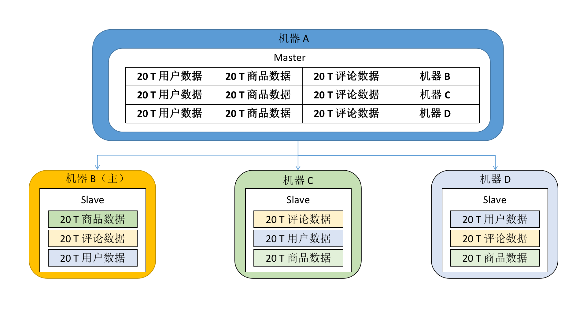
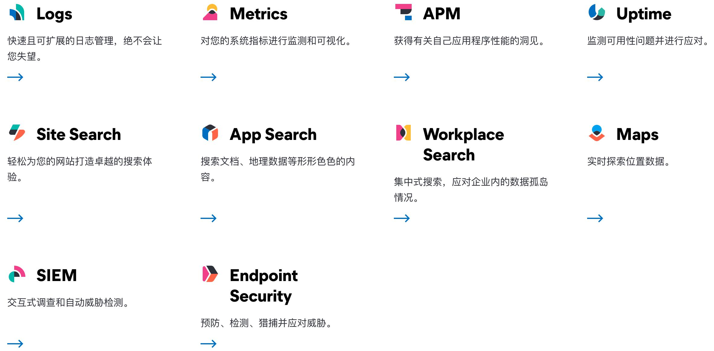

Elasticsearch（ES）是用 Java 开发的，并在 Apache 许可条款下开放源码发布，是一款非常流行的分布式、多用户能力的全文搜索引擎。

<!-- more -->

ES 基于 **Apache Lucene** 库（由 Doug Cutting，Hadoop 之父开发）进行开发，对 Lucene 的接口进行了封装；而且提供了 RESTful web 的接口，开箱即用，非常适合二次开发。

ES 中的 Elastic 本质就是**分布式数据库**
* 分布式必然伴随着**强扩展**
* 允许多台服务器协同工作
* 每台服务器可运行多个 Elastic 实例
* 直击关系型数据库因业务增长需要分页、分表带来潜在的数据迁移的痛点。

因此 ES 应用于云计算中，能够实现实时搜索，稳定、可靠、快速、安装使用方便，比关系型数据库的 like 模糊查找效率更高。其官方客户端在 Java、.NET（C#）、PHP、Python、Groovy、Ruby 和许多其他语言中都是可用的。

根据 DB-Engines 的排名显示，Elasticsearch 已是最受欢迎的企业搜索引擎，并应用于多个大型网页应用中，如 Wikipedia, Stack Overflow, Github 等；  
排行榜其次的是 Apache Solr，也是基于 Lucene。


# Elasticsearch v.s. Solr

两者都是基于 Lucene 这个 Java 库开发的，各自的面向点有差异。

ES 的优点：
* Elasticsearch 是**分布式**搜索引擎，天生带有易扩展、高可用的特性，且不需要其它组件
* Elasticsearch 的分发是实时的，被叫做“Push replication”；且完全支持 Lucene 的**接近实时**的搜索，新增到 ES 中的数据在 1 秒之后就可以被搜索到
* Elasticsearch 采用 Gateway 的概念，使备份更加简单
* 各节点组成的网络结构是对等的，某些节点出现故障的时候，会自动分配其它节点代替其进行工作。

ES 的缺点：
* 非实时性搜索的速度比不上 Solr
* **仅支持 JSON** 文件格式
* 版本更新太频繁，如 6.x 和 7.x 在使用上有不少的区别：好事说明它活跃，坏事说明它版本差别大，会产生一定的学习成本。

Solr 的优点：
* 面世比 ES 早了 4 年，成熟、稳定，有一个更大、更成熟的用户、开发和贡献者社区
* Solr 支持添加多种格式的索引，如 HTML、PDF、Office 文件（`.xls`, `.docx`, `.pptx` 等）以及 JSON、XML、`.csv` 等纯文本格式
* 在不考虑建索引的同时进行搜索，速度更快。

Solr 的缺点：
* 建立索引之后，搜索的效率会下降，实时索引的搜索效率不高。

性能对比：
* 单纯对已有数据进行搜索时，Solr 比 ES 快了大约 1.6 倍
* 建立了实时索引时，Solr 会产生 IO 阻塞，查询性能较差；ES 此时会快大约 4 倍，具有明显优势
* 随着数据量的增加，Solr 的搜索效率会变得很低，跟 ES 的差别甚至会达到 100 倍以上；而 ES 却没有明显变化
* 在实际生产环境的测试中，搜索引擎从 Solr 转到 ES 之后的平均 RT 大概会有 50 倍的提升。


# 基本概念

Node：节点，单个 Elastic 实例

Cluster：集群，一组 Elastic 实例

**Index**：Elastic 数据管理的顶层单位
* 索引是**映射类型**（mappings）的**容器**，是一个非常大的文档（Document）集合，相当于单个数据库
* 索引存储了所有映射类型的字段（field）和其它设置，Elastic 会索引所有字段，处理后写入一个反向索引（inverted index），存储到各个分片上
* 查找数据的时候直接查找该索引
* 与关系型数据库的“索引”不一样

```sh
# 查看当前节点所有 index：
http://localhost:9200/_cat/indices?v

health status index         uuid                   pri rep docs.count docs.deleted store.size pri.store.size
green  open   series_titles l5gnXXJlQUCsWwcrmcy9tg   1   0          0            0       261b           261b
green  open   site_titles   HVUGVU5qROCIy3jHK3bVyA   6   0          0            0      1.5kb          1.5kb
green  open   wfs           nxLo35j9Trqh3CzvotgLyw   5   0          0            0      1.2kb          1.2kb
green  open   seasons       YsgvnPK2Qh2diMn8s00vtQ   1   0          0            0       261b           261b
green  open   master_titles zMi-WlSMQ_Krqlvdnjp5pQ   3   0          0            0       779b           779b
```

<small>注：觉得 Elasticsearch 命令行不够直观的话，可以使用 [elasticsearch-head](https://github.com/mobz/elasticsearch-head) 客户端进行管理，其底层调用的是 ES 的 API。</small>

**Document**：文档
* index 里面的单条记录，使用 JSON 格式
* 一条 document 同时包含字段和对应的值（映射类型，key:value），许多条 document 构成一个 index
* 同一 index 里的 document 最好保持相同的结构（schema）

ES 是**面向文档**的，意味着索引和搜索数据的最小单位就是文档：
* 文档的结构很灵活，不依赖预先定义的模式，避免需要修改 schema 时造成的性能损耗；
* 文档对于字段是非常灵活的，有时候可以忽略字段或者动态添加一个新字段。

**Type**（7.x 被标记过时，后续版本会被移除）
* document 的虚拟逻辑分组，用于过滤 document
* （就像关系型数据库一样，表格是行的容器）
* type 对于字段的定义称之为映射（mapping），如：字段 name 映射为字符串类型

可以按照以下映射理解，但映射两端并不是同一类型的东西，对比并不正确：

| 关系型数据库 | Elasticsearch | 解释 |
| ---------  | ------------- | --- |
| database   | index         | 指向一个或多个物理分配的逻辑命名空间 |
| table      | type          | 用于区分同一个集合的不同细分 |
| row        | document      | ES 是面向文档的，各种文本内容以文档形式存储到 ES 中，以 JSON 作为文档序列号格式 |
| column     | field         | 文档可以有很多字段，可以指定字段的数据格式 |


## Elasticsearch 支持的 field 类型

在创建索引的时候，我们可以不去指定字段 field 的类型（mappings），由 Elasticsearch 自行决定字段类型；  
我们也可以通过 mappings 的方式，指定索引中字段的类型。

<table>
	<tr>
	    <th>一级分类</th>  
	    <th>二级分类</th>  
	    <th>具体类型</th>  
	</tr>
	<tr>
	    <th rowspan="7">核心类型</th>
	    <td><b>字符串类型</b></td>
        <td>string, text, keyword</td>
	</tr>
	<tr>
	    <td>整数类型</td>
        <td>integer, long, short, byte</td>
	</tr>
	<tr>
	    <td>浮点类型</td>
        <td>double, float, half_float, scaled_float</td>
	</tr>
	<tr>
	    <td>逻辑类型</td>
        <td>boolean</td>
	</tr>
    <tr>
	    <td>日期类型</td>
        <td>date</td>
	</tr>
    <tr>
        <td>范围类型</td>
        <td>range</td>
	</tr>
    <tr>
        <td>二进制类型</td>
        <td>binary</td>
	</tr>
    <tr>
	    <th rowspan="3">复合类型</th>
        <td>数组类型</td>
        <td>array</td>
	</tr>
    <tr>
        <td>对象类型</td>
        <td>object</td>
	</tr>
    <tr>
        <td>嵌套类型</td>
        <td>nested</td>
	</tr>
    <tr>
	    <th rowspan="2">地理类型</th>
        <td>地理坐标类型</td>
        <td>geo point</td>
	</tr>
    <tr>
        <td>地理地图</td>
        <td>geo shape</td>
	</tr>
    <tr>
	    <th rowspan="5">特殊类型</th>
        <td>IP 类型</td>
        <td>ip</td>
	</tr>
    <tr>
        <td>范围类型</td>
        <td>completion</td>
	</tr>
    <tr>
        <td>令牌计数类型</td>
        <td>token count</td>
	</tr>
    <tr>
        <td>附件类型</td>
        <td>attachment</td>
	</tr>
    <tr>
        <td>抽取类型</td>
        <td>percolator</td>
	</tr>
</table>

text 和 keyword 有啥区别？

* text 可以分词，可利用分词后结果进行索引，用于全文搜索；
* keyword 不可分词，其用来直接索引，用于关键词搜索。

比如存在字段 foo1 的 type 为 text，分别有“大佬”“大佬的朋友”两个文档：当搜索“大佬”的时候，两个文档都会被搜索出来；  
字段 foo2 的 type 为 keyword，分别有“大佬”“大佬的朋友”两个文档：当搜索“大佬”的时候，只有前一个文档会被搜索出来。

<small>注：string 在老版本的 Elasticsearch 使用较多；从 Elasticsearch 5.x 开始不再支持 string，由 text 和 keyword 类型替代。</small>

删除数据的时候是标记删除，数据从 buffer pool 里面同步到 segment 中，多个 segment 组合更新到磁盘。

在同步到 segment 的时候为了保证倒序索引能够被更新且降低维护成本，会创建一个全新的索引，且将所有的索引全部遍历一遍，将全部修改聚合并写回磁盘。

<br/>

# 正序索引和倒序索引

比如说我们有三个文档：

ID1: 今天我们一起学习 Elasticsearch  
ID2: Elasticsearch 学习起来真有趣  
ID3: 今天下班大家一起打火锅怎么样

按照正序索引，我们将文档 ID 设置为 key，将文档设置为 value，包括关键词 N，出现次数，出现位置等：

ID1: 【今天】【我们】【一起】【学习】【Elasticsearch】  
ID2: 【Elasticsearch】【学习】【起来】【真】【有趣】  
ID3: 【今天】【下班】【大家】【一起】【打】【火锅】【怎么样】

按照倒序索引，我们将文档等设置为 key，文档 N 的 ID 设置为 value：

【今天】: ID1-位置1, ID3-位置1  
【我们】: 1D1-位置2  
【一起】: ID1-位置3, ID3-位置4  
【学习】: ID1-位置4, ID2位置2  
【Elasticsearch】: ID1-位置5, ID2-位置1  
【起来】: ID2-位置3  
【有趣】: ID2-位置5  
......

有啥用？

比方说我们如果想要搜索关键词“一起”，根据正序索引，需要遍历文档 ID，再遍历所有文档去找“一起”出现的位置；  
而使用倒序索引的话，我们通过遍历拆分过后的文档，便能迅速知道该关键词在文档 1 和文档 3 中存在。

如果搜索关键词“我们一起”，涉及到全文搜索，根据倒序索引的话很快就能找到文档 1 包含所有关键词，而文档 3 只包含“一起”，由此我们可以判定对于这个关键词，文档 1 的 **score** 值会比文档 3 要高。

score 越高的文档，在对应的搜索结果中就会排得越靠前。

<br/>

# 分片和副本

分片和副本是大数据中非常重要的概念。

当文档量非常庞大，而服务器物理内存有限的情况下，ES 基于自身**分布式**的特点，会采取“分而治之”的策略：
* 将数据副本分为主分片（primary shard）和副分片（replica shard）；
* 主分片的数据作为权威数据；
* 写数据的时候，先写主分片（真正的业务写入），写入成功后再写副分片（数据同步）；
* 恢复数据的时候，以主分片上的数据为准



如上图，数据被分成了 3 个副本，3 个分片中分别有一个副本。
* Master 存储数据和分片的 mapping，到 Slave 才存储具体的数据
* 请求数据的时候，请求发送至 Master，再根据 mapping 去对应的分片中查询数据
* 万一其中一台 Slave 宕机，其它的 Slave 也会有一样的副本数据，不会导致数据丢失或查询请求失败
* 数据副本会根据一定的策略存储到分片中，**并不是每一个分片都要存储所有的副本**；分布式系统中，只要保证数据副本有多于一份就好
* 写数据的时候，先往机器 B 写，随后同步其它的 Slave 机器

在 ES 创建一个索引的时候，默认是 5 个分片，每个分片一个副本。


## 集群状态

例图：


上图说明有 5 个分片没有分配到副本。

* <font color="green">绿色</font>：最健康的状态，代表所有的主分片和副本分片都可用
* <font color="#FFD700">黄色</font>：所有主分片可用，但部分副本分片不可用，即高可用未能实现
* <font color="red">红色</font>：部分主分片不可用；此时执行查询部分数据仍然可以查到，但是遇到这种情况还是尽快解决

一些检查集群状态的 API：

```sh
# 查看集群状态
GET /_cluster/health

# 查看分片状态
GET _cat/shards?v

# 查看集群中不同节点索引的状态
GET _cat/shards?h=index,shard,prirep,state,unassigned.reason

# 查看unsigned的原因
GET /_cluster/allocation/explain
```

<br/>

# Analyzer：Elastic 的分词器

## Standard Analyzer

ES 的默认分词器，提供了基于语法的标准化（Unicode 文本分割算法），适用于大多数语言。

Standard Analyzer 区分中英文分词。
* 英文按照空格切分，同时大写字母会转为小写；
* 中文按照单个词分词

```json
// 请求
GET _analyze
{
  "analyzer": "standard", 
  "text": "HONDA 本田"
}

// 结果
{
  "tokens" : [
    {
      "token" : "honda",
      "start_offset" : 0,
      "end_offset" : 5,
      "type" : "<ALPHANUM>",  // 字母
      "position" : 0
    },
    {
      "token" : "本",
      "start_offset" : 6,
      "end_offset" : 7,
      "type" : "<IDEOGRAPHIC>",  // 图形文字
      "position" : 1
    },
    {
      "token" : "田",
      "start_offset" : 7,
      "end_offset" : 8,
      "type" : "<IDEOGRAPHIC>",
      "position" : 2
    }
  ]
}
```


## Simple Analyzer

遇到只要不是字母的字符，就将文本解析成 term（最细粒度的词），而且所有的 term 都是小写的。  
先按照空格分词，英文大写转小写，**不是英文不分词**。

```json
// 请求
GET _analyze
{
  "analyzer": "simple", 
  "text": "HONDA 本田"
}

// 结果
{
  "tokens" : [
    {
      "token" : "honda",
      "start_offset" : 0,
      "end_offset" : 5,
      "type" : "word",
      "position" : 0
    },
    {
      "token" : "本田",
      "start_offset" : 6,
      "end_offset" : 8,
      "type" : "word",
      "position" : 1
    }
  ]
}
```


## Whitespace Analyzer

顾名思义，严格按照空格分词；英文不区分大小写，中文不分词。

```json
// 请求
GET _analyze
{
  "analyzer": "whitespace", 
  "text": "car brand brand HONDA 本田 汽车"
}

// 结果
{
  "tokens" : [
    {
      "token" : "car",
      "start_offset" : 0,
      "end_offset" : 3,
      "type" : "word",
      "position" : 0
    },
    {
      "token" : "brand",
      "start_offset" : 4,
      "end_offset" : 9,
      "type" : "word",
      "position" : 1
    },
    {
      "token" : "brand",
      "start_offset" : 10,
      "end_offset" : 15,
      "type" : "word",
      "position" : 2
    },
    {
      "token" : "HONDA",
      "start_offset" : 16,
      "end_offset" : 21,
      "type" : "word",
      "position" : 3
    },
    {
      "token" : "本田",
      "start_offset" : 22,
      "end_offset" : 24,
      "type" : "word",
      "position" : 4
    },
    {
      "token" : "汽车",
      "start_offset" : 25,
      "end_offset" : 27,
      "type" : "word",
      "position" : 5
    }
  ]
}
```


## ik

上面提到的分词器对于中文语境来说，其实并不是完美的，甚至大多数情况不适用。

开源社区中有一个 ik 系列分词器，对于中文相对友好，包括 ik_smart 和 ik_max_word 两种：

* ik_smart：按照最粗粒度划分，每个 term 没有重复的字符
* ik_max_word：最细粒度划分，每个 term 有重复的字符

演示例子：

```json
// 请求
GET _analyze
{
  "analyzer": "ik_smart", 
  "text": "夏洛特烦恼"
}

// 结果
{
  "tokens" : [
    {
      "token" : "夏洛特",
      "start_offset" : 0,
      "end_offset" : 3,
      "type" : "CN_WORD",  // 识别为中文字符
      "position" : 0
    },
    {
      "token" : "烦恼",
      "start_offset" : 3,
      "end_offset" : 5,
      "type" : "CN_WORD",
      "position" : 1
    }
  ]
}
```

```json
// 请求
GET _analyze
{
  "analyzer": "ik_max_word", 
  "text": "夏洛特烦恼"
}

// 结果
{
  "tokens" : [
    {
      "token" : "夏洛特",
      "start_offset" : 0,
      "end_offset" : 3,
      "type" : "CN_WORD",
      "position" : 0
    },
    {
      "token" : "特烦",
      "start_offset" : 2,
      "end_offset" : 4,
      "type" : "CN_WORD",
      "position" : 1
    },
    {
      "token" : "烦恼",
      "start_offset" : 3,
      "end_offset" : 5,
      "type" : "CN_WORD",
      "position" : 2
    }
  ]
}
```

可以在 IKAnalyzer.cfg.xml 配置文件中设定自定义的分词词汇。

<br/>

# 常用指令

ES 的指令主要分为两大部分，一是关于**索引**的操作，另外则是**文档**的操作：

| method     | URL | 描述 |
| ---------  | ---------- | ---- |
| PUT / POST | http://localhost:9200/[INDEX_NAME]/[TYPE_NAME]/[DOC_ID]   | 创建文档（指定 doc_id） |
| POST       | http://localhost:9200/[INDEX_NAME]/[TYPE_NAME]            | 创建文档（随机 doc_id） |
| POST       | http://localhost:9200/[INDEX_NAME]/[TYPE_NAME]/[DOC_ID]/_update | 修改文档 |
| DELETE     | http://localhost:9200/[INDEX_NAME]/[TYPE_NAME]/[DOC_ID]   | 删除文档 |
| GET        | http://localhost:9200/[INDEX_NAME]/[TYPE_NAME]/[DOC_ID]   | 通过 doc_id 查询文档 |
| POST       | http://localhost:9200/[INDEX_NAME]/[TYPE_NAME]/_search    | 根据条件查询数据 |

可以看到，URL 的层级是按照“**索引 index <- 类型 type <- 文档 doc**”递进的。

注意的点：
* 如果不指定 TYPE_NAME，默认使用 `_doc`；
* 如果在创建文档的时候索引 / 类型不存在，接口不会报错，而是会顺势将索引 / 类型创建出来；
* 使用创建文档的方法也能更新文档，但是请求中但凡少一个字段，更新后**少掉的字段值会被置空**；而使用修改文档的方法则不需要担心这一点

举几个使用例子：


## 创建索引

**1**. 创建索引时不指定 field 的类型映射：

```json
// 创建索引
PUT /car_no_mappings

// 结果
{
  "acknowledged" : true,
  "shards_acknowledged" : true,
  "index" : "car_no_mappings"
}

// 索引的 mappings 属性为空
```

插入数据的时候，ES 会根据数据选择具体的类型：

```json
// 创建文档
PUT /car_no_mappings/type1/001
{
  "name" : "civic",
  "engine" : "ivtec",
  "brand" : "honda",
  "iteration" : 5
}

// 结果
{
  "_index" : "car_no_mappings",
  "_type" : "type1",
  "_id" : "001",
  "_version" : 1,
  "result" : "created",
  "_shards" : {
    "total" : 2,
    "successful" : 1,
    "failed" : 0
  },
  "_seq_no" : 0,
  "_primary_term" : 1
}

// 此时索引的 mappings：
{
  ...
  "mappings": {
    "type1": {
      "properties": {
        "engine": {
          "type": "text",  // 类型
          "fields": {
            "keyword": {
              "ignore_above": 256,
              "type": "keyword"  // 默认既有 type 属性，也有 keyword 属性（field type）
            }
          }
        },
        "name": {
          "type": "text",
          "fields": {
            "keyword": {
              "ignore_above": 256,
              "type": "keyword"
            }
          }
        },
        "iteration": {
          "type": "long"
        },
        "brand": {
          "type": "text",
          "fields": {
            "keyword": {
              "ignore_above": 256,
              "type": "keyword"
            }
          }
        }
      }
    }
  },
  ...
}
```

**2**. 创建索引时指定 field 的类型映射：

```json
// 创建索引
PUT /car_mappings
{
  "mappings": {
    "properties": {
      "name": {
        "type": "text"  // 只想要 text，不想要 keyword 了
      },
      "brand": {
        "type": "text"
      },
      "iteration": {
        "type": "long"
      }
    }
  }
}

// 结果
{
  "acknowledged" : true,
  "shards_acknowledged" : true,
  "index" : "car_mappings"
}

// 此时索引的 mappings：
{
  ...
  "mappings": {
    "_doc": {
      "properties": {
        "name": {
          "type": "text"
        },
        "iteration": {
          "type": "long"
        },
        "brand": {
          "type": "text"
        }
      }
    }
  }
  ...
}
```


## 创建文档

**1**. 指定文档 ID

除了上述 PUT 方法之外，还可使用 POST：

```json
// 创建文档
POST /car_no_mappings/type1/002
{
  "name" : "fiesta",
  "engine" : "zy",
  "brand" : "ford",
  "iteration" : 6
}

// 结果
{
  "_index" : "car_no_mappings",
  "_type" : "type1",
  "_id" : "002",
  "_version" : 1,
  "result" : "created",
  "_shards" : {
    "total" : 2,
    "successful" : 1,
    "failed" : 0
  },
  "_seq_no" : 2,
  "_primary_term" : 1
}
```

执行结束后索引数据如下：

| _index | _type | _id | _score | name | engine | brand | iteration |
| --------------- | ----- | --- | ------ | ------ | ------ | ----- | --- |
| car_no_mappings | type1 | 001 | 1      | civic  | ivtec  | honda | 5   |
| car_no_mappings | type1 | 002 | 1      | fiesta | zy     | ford  | 6   |

上面的 _id 就是刚刚创建文档的时候指定的文档 ID。


**2**. 随机文档 ID：

```json
// 创建文档
POST /car_no_mappings/type1
{
  "name" : "golf",
  "engine" : "DLS",
  "brand" : "volkswagen",
  "iteration" : 8
}

// 结果
{
  "_index" : "car_no_mappings",
  "_type" : "type1",
  "_id" : "f8NTDYABmekajPhuv7w_",  // 随机的 id
  "_version" : 1,
  "result" : "created",
  "_shards" : {
    "total" : 2,
    "successful" : 1,
    "failed" : 0
  },
  "_seq_no" : 3,
  "_primary_term" : 1
}
```

执行结束后索引数据如下：

| _index | _type | _id | _score | name | engine | brand | iteration |
| --------------- | ----- | --- | ------ | ------ | ------ | ----- | ---- |
| car_no_mappings | type1 | 001 | 1      | civic  | ivtec  | honda | 5    |
| car_no_mappings | type1 | 002 | 1      | fiesta | zy     | ford  | 6    |
| car_no_mappings | type1 | f8NTDYABmekajPhuv7w_  | 1      | golf  | DLS  | volkswagen  | 8      |


## 修改数据

**1**. 覆盖修改：PUT

```json
// 请求
PUT /car_no_mappings/type1/002
{
  "name" : "fiesta - rt",
  "engine" : "zy",
  "brand" : "ford",
  "iteration" : 4
}

// 结果
{
  "_index" : "car_no_mappings",
  "_type" : "type1",
  "_id" : "002",
  "_version" : 2,
  "result" : "updated",  // 更新成功
  "_shards" : {
    "total" : 2,
    "successful" : 1,
    "failed" : 0
  },
  "_seq_no" : 4,
  "_primary_term" : 1
}
```

执行结束后索引数据如下：

| _index | _type | _id | _score | name | engine | brand | iteration |
| --------------- | ----- | --- | ---- | ------ | ------ | ----- | ---- |
| car_no_mappings | type1 | 001 | 1    | civic  | ivtec  | honda | 5    |
| car_no_mappings | type1 | f8NTDYABmekajPhuv7w_  | 1    | golf  | DLS  | volkswagen  | 8  |
| car_no_mappings | type1 | 002 | 1    | fiesta - rt | zy | ford  | 4   |

只有部分域：

```json
// 请求
PUT /car_no_mappings/type1/002
{
  "name" : "fiesta - RT"
}

// 结果
{
  "_index" : "car_no_mappings",
  "_type" : "type1",
  "_id" : "002",
  "_version" : 3,
  "result" : "updated",
  "_shards" : {
    "total" : 2,
    "successful" : 1,
    "failed" : 0
  },
  "_seq_no" : 5,
  "_primary_term" : 1
}
```

执行结束后索引数据如下：

| _index | _type | _id | _score | name | engine | brand | iteration |
| --------------- | ----- | --- | ---- | ------ | ------ | ----- | --- |
| car_no_mappings | type1 | 001 | 1    | civic  | ivtec  | honda | 5   |
| car_no_mappings | type1 | f8NTDYABmekajPhuv7w_  | 1    | golf  | DLS | volkswagen  | 8   |
| car_no_mappings | type1 | 002 | 1    | fiesta - RT |   |       |     |

可以看到，PUT 方法如果没有提供所有域的话，其它值会被空值覆盖。

**2**. 非覆盖修改：POST

```json
// 请求
POST /car_no_mappings/type1/001/_update
{
  "doc": {
    "name" : "civic - typeR"
  }
}

// 结果
{
  "_index" : "car_no_mappings",
  "_type" : "type1",
  "_id" : "001",
  "_version" : 3,
  "result" : "updated",
  "_shards" : {
    "total" : 2,
    "successful" : 1,
    "failed" : 0
  },
  "_seq_no" : 6,
  "_primary_term" : 1
}
```

执行结束后索引数据如下：

| _index | _type | _id | _score | name | engine | brand | iteration |
| --------------- | ----- | --- | ---- | ------ | ------ | ----- | ------ |
| car_no_mappings | type1 | f8NTDYABmekajPhuv7w_  | 1    | golf  | DLS    | volkswagen  | 8  |
| car_no_mappings | type1 | 002 | 1    | fiesta - RT |   |       |        |
| car_no_mappings | type1 | 001 | 1    | civic - typeR   | ivtec | honda  | 5  |

注意：调用 POST 更新数据时，URL 最后必须要带上 `_update`，消息体要用 `doc` 包着。


## 查询信息

**1**. 查询索引信息

```json
// 请求
GET /car_no_mappings

// 结果
{
  "car_no_mappings" : {
    "aliases" : { },  // 别名
    "mappings" : {
      "properties" : {
        "brand" : {
          "type" : "text",
          "fields" : {
            "keyword" : {
              "type" : "keyword",
              "ignore_above" : 256
            }
          }
        },
        "engine" : {
          "type" : "text",
          "fields" : {
            "keyword" : {
              "type" : "keyword",
              "ignore_above" : 256
            }
          }
        },
        "iteration" : {
          "type" : "long"
        },
        "name" : {
          "type" : "text",
          "fields" : {
            "keyword" : {
              "type" : "keyword",
              "ignore_above" : 256
            }
          }
        }
      }
    },
    "settings" : {
      "index" : {
        "routing" : {
          "allocation" : {
            "include" : {
              "_tier_preference" : "data_content"
            }
          }
        },
        "number_of_shards" : "1",
        "provided_name" : "car_no_mappings",
        "creation_date" : "1649432640257",
        "number_of_replicas" : "1",
        "uuid" : "GligivYtRa-qEh9aUiG8Mg",
        "version" : {
          "created" : "7170099"
        }
      }
    }
  }
}
```

**2**. 查询文档信息

```json
// 请求
GET /car_no_mappings/type1/001

// 结果
{
  "_index" : "car_no_mappings",
  "_type" : "type1",
  "_id" : "001",
  "_version" : 2,
  "_seq_no" : 1,
  "_primary_term" : 1,
  "found" : true,  // 找到了
  "_source" : {
    "name" : "civic",
    "engine" : "ivtec",
    "brand" : "honda",
    "iteration" : 5
  }
}
```

```json
// 请求
GET /car_no_mappings/type1/003

// 结果
{
  // 根据查询三要素 _index _type _id 可以唯一标记一条文档
  "_index" : "car_no_mappings",
  "_type" : "type1",
  "_id" : "003",
  "found" : false
}
```

**3**. 不同分词器下的条件搜索

假设索引 car_no_mappings 存有下面的文档：

| _index | _type | _id | _score | name | engine | brand | iteration |
| --------------- | ----- | --- | ---- | ------ | ------ | -------- | ------ |
| car_no_mappings | type1 | f8NTDYABmekajPhuv7w_  | 1    | golf001  | DLS    | volkswagen  | 8   |
| car_no_mappings | type1 | 002 | 1    | fiesta - RT     | zy       | ford   | 6  |
| car_no_mappings | type1 | 001 | 1    | civic - typeR   | ivtec    | honda  | 5  |

使用默认（standard）的分词器：

```json
// 请求
GET /car_no_mappings/type1/_search?q=name:golf

// 结果
{
  "took" : 2,
  "timed_out" : false,
  "_shards" : {
    "total" : 1,
    "successful" : 1,
    "skipped" : 0,
    "failed" : 0
  },
  "hits" : {
    "total" : {
      "value" : 0,
      "relation" : "eq"  // 匹配方式
    },
    "max_score" : null,
    "hits" : [ ]  // 没找到
  }
}
```

因为 standard 分词器在分析文本的时候将 “golf001” 解析为一整个 ALPHANUM，没有进行内部分词：

```json
{
  "tokens" : [
    {
      "token" : "golf001",
      "start_offset" : 0,
      "end_offset" : 7,
      "type" : "<ALPHANUM>",
      "position" : 0
    }
  ]
}
```

修改 mappings 的 analyzer 为 ik_max_word 后，可以通过 `q=name:golf` 搜索到 golf001。

**4**. 复杂条件搜索

上述的 `_search?q=name:golf` 等价于：

```json
GET /car_no_mappings/type1/_search
{
  "query": {
    "match": {
      "name": "golf"
    }
  }
}
```

在进行复杂条件搜索的时候，建议使用这种带消息体的请求。

<small>注：除了 `match`，ES 还可以用 `term`（上面提到过的，最小粒度单位）来进行查询。搜索到的结果会有不一样。</small>

给三条文档分别打上 tag：
* golf gti: ["street", "a0", "germany"]
* fiesta st: ["street", "a0", "euro"]
* civic - typeR: ["street", "a", "japan"]

1. 指定显示的列：
```json
// 请求
GET /car_no_mappings/type1/_search
{
  "query": {
    "match": {
      "name": "civic"
    }
  },
  "_source": ["name", "brand"]
}

// 结果
{
  "took" : 4,
  "timed_out" : false,
  "_shards" : {
    "total" : 1,
    "successful" : 1,
    "skipped" : 0,
    "failed" : 0
  },
  "hits" : {
    "total" : {
      "value" : 1,
      "relation" : "eq"
    },
    "max_score" : 0.9808291,
    "hits" : [
      {
        "_index" : "car_no_mappings",
        "_type" : "type1",
        "_id" : "001",
        "_score" : 0.9808291,
        "_source" : {
          "name" : "civic - typeR",
          "brand" : "honda"
        }  // 只显示了指定的两列
      }
    ]
  }
}
```

2. 多个内容搜索：
```json
// 请求
GET /car_no_mappings/type1/_search
{
  "query": {
    "match": {
      "tags": "a0 germany"
    }
  }
}

// 结果
{
  "took" : 3,
  "timed_out" : false,
  "_shards" : {
    "total" : 1,
    "successful" : 1,
    "skipped" : 0,
    "failed" : 0
  },
  "hits" : {
    "total" : {
      "value" : 2,
      "relation" : "eq"
    },
    "max_score" : 1.4508327,
    "hits" : [
      {
        "_index" : "car_no_mappings",
        "_type" : "type1",
        "_id" : "f8NTDYABmekajPhuv7w_",
        "_score" : 1.4508327,  // 匹配度高
        "_source" : {
          "name" : "golf gti",
          "engine" : "dls",
          "brand" : "volkswagen",
          "iteration" : "8",
          "tags" : [
            "street",
            "a0",
            "germany"
          ]
        }
      },
      {
        "_index" : "car_no_mappings",
        "_type" : "type1",
        "_id" : "002",
        "_score" : 0.4700036,  // 匹配度没那么高
        "_source" : {
          "tags" : [
            "street",
            "a0",
            "euro"
          ],
          "engine" : "zy",
          "name" : "fiesta st",
          "iteration" : "6",
          "brand" : "ford"
        }
      }
    ]
  }
}
```

3. 对搜索结果进行排序：
```json
// 请求
GET /car_no_mappings/type1/_search
{
  "query": {
    "match": {
      "tags": "a0"
    }
  },
  "sort": {
    "iteration": {
      "order": "asc"  // asc 或 desc
    }
  }
}

// 结果
{
  "took" : 7,
  "timed_out" : false,
  "_shards" : {
    "total" : 1,
    "successful" : 1,
    "skipped" : 0,
    "failed" : 0
  },
  "hits" : {
    "total" : {
      "value" : 2,
      "relation" : "eq"
    },
    "max_score" : null,
    "hits" : [
      {
        "_index" : "car_no_mappings",
        "_type" : "type1",
        "_id" : "002",
        "_score" : null,
        "_source" : {
          "tags" : [
            "street",
            "a0",
            "euro"
          ],
          "engine" : "zy",
          "name" : "fiesta st",
          "iteration" : "6",
          "brand" : "ford"
        },
        "sort" : [  // 排序信息
          6
        ]
      },
      {
        "_index" : "car_no_mappings",
        "_type" : "type1",
        "_id" : "f8NTDYABmekajPhuv7w_",
        "_score" : null,
        "_source" : {
          "name" : "golf gti",
          "engine" : "dls",
          "brand" : "volkswagen",
          "iteration" : "8",
          "tags" : [
            "street",
            "a0",
            "germany"
          ]
        },
        "sort" : [  // 排序信息
          8
        ]
      }
    ]
  }
}
```

4. `query` 的元素除了 `match`，还可以使用 `bool`：
```json
// 示例：
"query": {
    "bool": {
      "must": [{"match":{...}},...]  // 与操作
    }
}

"query": {
    "bool": {
      "should": [{"match":{...}},...]  // 或操作
    }
}

"query": {
    "bool": {
      "must_not": [{"match":{...}},...],  // 非操作
      "filter": {"range":{...}}  // 结果过滤（gte, lte, gt, lt）
    }
}
```

5. 分页显示：
```json
// 请求
GET /car_no_mappings/type1/_search
{
  "query": {
    "match": {
      "tags": "a0"
    }
  },
  "from": 1,  // 从第一个开始操作
  "size": 1  // 每页一个结果
}

// 结果
{
  "took" : 6,
  "timed_out" : false,
  "_shards" : {
    "total" : 1,
    "successful" : 1,
    "skipped" : 0,
    "failed" : 0
  },
  "hits" : {
    "total" : {
      "value" : 2,
      "relation" : "eq"
    },
    "max_score" : 0.4700036,
    "hits" : [
      {
        "_index" : "car_no_mappings",
        "_type" : "type1",
        "_id" : "002",
        "_score" : 0.4700036,
        "_source" : {
          "doc" : {
            "tags" : [
              "street",
              "a0",
              "euro"
            ]
          },
          "tags" : [
            "street",
            "a0",
            "euro"
          ],
          "engine" : "zy",
          "name" : "fiesta st",
          "iteration" : "6",
          "brand" : "ford"
        }
      }
    ]
  }
}
```

**5**. 高亮查询

```json
// 请求
GET /car_no_mappings/type1/_search
{
  "query": {
    "match": {
      "tags": "a0"
    }
  },
  "highlight": {
    "pre_tags": "<blue>",  // 默认是 <em>
    "post_tags": "</blue>",   // 默认是 </em>
    "fields": {
      "tags": {}
    }
  }
}

// 结果
{
  "took" : 140,
  "timed_out" : false,
  "_shards" : {
    "total" : 1,
    "successful" : 1,
    "skipped" : 0,
    "failed" : 0
  },
  "hits" : {
    "total" : {
      "value" : 2,
      "relation" : "eq"
    },
    "max_score" : 0.4700036,
    "hits" : [
      {
        "_index" : "car_no_mappings",
        "_type" : "type1",
        "_id" : "f8NTDYABmekajPhuv7w_",
        "_score" : 0.4700036,
        "_source" : {
          "name" : "golf gti",
          "engine" : "dls",
          "brand" : "volkswagen",
          "iteration" : "8",
          "tags" : [
            "street",
            "a0",
            "germany"
          ]
        },
        "highlight" : {  // 高亮处理
          "tags" : [
            "<blue>a0</blue>"  // 高亮处理都是围绕着关键字来的
          ]
        }
      },
      {
        "_index" : "car_no_mappings",
        "_type" : "type1",
        "_id" : "002",
        "_score" : 0.4700036,
        "_source" : {
          "tags" : [
            "street",
            "a0",
            "euro"
          ],
          "engine" : "zy",
          "name" : "fiesta st",
          "iteration" : "6",
          "brand" : "ford"
        },
        "highlight" : {  // 高亮处理
          "tags" : [
            "<blue>a0</blue>"
          ]
        }
      }
    ]
  }
}
```

<br/>

另外还可以通过 `_cat` 命令获取 ES 的相关信息。


## 删除数据

删除文档：

```json
// 请求
DELETE /car_mappings/_doc/002

// 结果
{
  "_index" : "car_mappings",
  "_type" : "_doc",
  "_id" : "002",
  "_version" : 2,
  "result" : "deleted",
  "_shards" : {
    "total" : 2,
    "successful" : 1,
    "failed" : 0
  },
  "_seq_no" : 5,
  "_primary_term" : 1
}
```

删除索引：

```json
// 请求
DELETE /car

// 结果
{
  "acknowledged" : true
}
```


# 客户端集成

ES 推出了基于很多语言的 [API](https://www.elastic.co/guide/en/elasticsearch/client/index.html)，这里就不赘述了。


# [ELK](https://www.elastic.co/what-is/elk-stack)

ELK 是 **E**lasticsearch、**L**ogstash 和 **K**ibana 三个开源项目的首字母缩写，三者合称 ELK stack，提供“托管型”的 Elasticsearch Service。

我们已经知道 Elasticsearch 是干嘛的了，接下来看看另外两个：

Logstash 是服务器端数据（主要是日志）的处理管道，能够同时从多个来源采集数据，转换数据，随后将数据发送到 Elasticsearch 等进行存储；  
Kibana 提供了对 Elasticsearch 数据进行图形图表的可视化功能。  
（上述文字结合官网介绍而得。）

目前 ELK 加入了 Beats：一系列轻量型单一功能的数据采集器，并改称 **Elastic Stack**。


包括 CCTV、民生银行、奥迪、牛津大学、沃尔玛、浦项制铁、联想、Netflix 等都是 Elastic Stack 的客户。

依托 Elastic Stack 所构建的解决方案完整列表：


