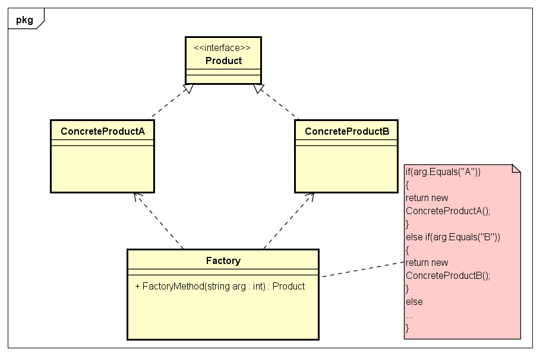
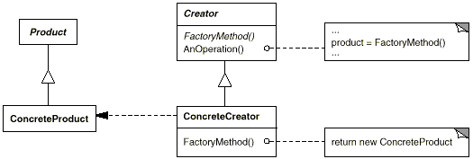
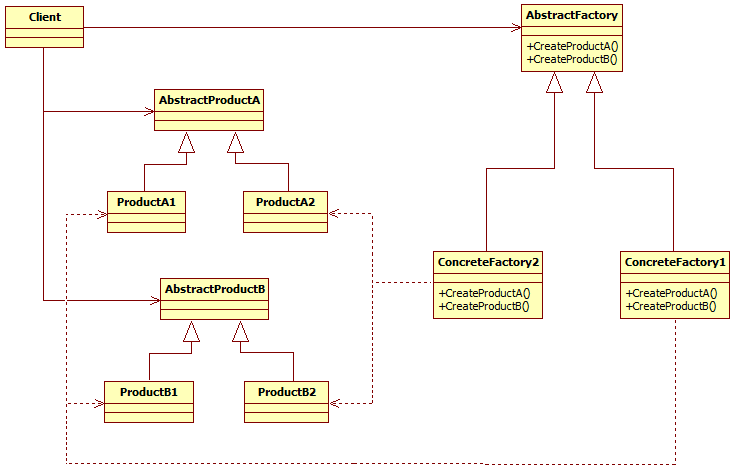

GOF 所著的《设计模式》中，与工厂相关的设计模式属于创建型模式的入门，也是最重要的模式。

<!-- more -->
工厂模式的意图，是通过定义一个创建对象的接口，让其子类自己决定实例化哪一个工厂类，工厂模式使其创建过程延迟到子类进行。

其核心是要**屏蔽掉所需对象的创建逻辑**：
* 创建对象时不会对客户端暴露创建逻辑，且通过使用共同的接口来指向新创建的对象
* **解耦**：降低程序耦合性，实现创建者和调用者的分离，维护便利
* 将实现类、创建对象纳入统一管理和控制

总的来说，各工厂模式离不开三个角色：
1) 工厂类角色：模式的核心，含有一定的商业逻辑和判断逻辑，用来创建产品
2) 抽象产品角色：一般是具体产品继承的父类，或者是要实现的接口
3) 具体产品角色：工厂类所创建的对象就是该角色的实例，由一个具体类实现

《设计模式》中，与工厂有关的包括了**工厂方法**和**抽象工厂**两个模式；但是近段时间看资料，发现有一个名为“**简单工厂**”的设计模式经常被提到，但是没有被包含在 GOF 总结的 23 种设计模式里面。  

为了总结一下业界的经验，本帖将讨论包括简单工厂、工厂方法、抽象工厂三者在内的所有工厂相关的模式。

 
 

# 简单工厂（Simple Factory）
该模式中，用于创建实例的方法通常为静态方法，因此又被称为**静态工厂方法**（Static Factory Method）模式。

* 提供一个创建对象实例的功能，而无需关心其具体实现。
* 被创建实例的类型可以是接口、抽象类，也可以是具体的类。

## 结构图

以上，可见简单工厂模式包括：

`Factory`
* 负责实现创建所有产品的内部逻辑
* 工厂内部一般通过路由逻辑（switch-case）去判断创建哪些产品
    * 或通过接收参数，作为不同的具体产品对象的构造函数的入参

`Product`
* 定义工厂方法所要创建的对象（产品）的接口

`ConcreteProduct`
* 要产生具体对象（产品）的类，实现 Product 接口

## 实例
代入一个简单的具体开发场景，结构图如下：

## 实现
* 定义一个工厂类，可根据参数的不同，返回不同的产品实例；被创建的产品实例通常都具有共同的产品父类（或实现同一个产品接口）；
* 实际调用的时候，我们需要一个客户类（Service 实例）调用工厂类的创建方法。

## 优缺点
优点：
* 简单工厂模式能够根据外界给定的信息，决定究竟应该创建哪个具体类的对象。
* 明确区分了各自的职责和权力，有利于整个软件体系结构的优化。

缺点：
* 很明显，工厂类集中了所有实例的创建逻辑，容易违反 GRASPR 的高内聚的责任分配原则

 

# 工厂方法（Factory Method）
<big>别名：虚构造器（Virtual Constructor），属于类创建型模式。</big>

《设计模式：可复用面向对象软件的基础》中的介绍：

    “定义一个用于创建对象的接口，让子类决定将哪一个类实例化”

又称**多态性工厂模式**。

**与简单工厂模式不同的是**，工厂模式将具体创建产品的工作交给了子类 —— 具体的产品工厂，不再是所有产品都交给一个工厂生产。 

 

## 结构图

以上，可见工厂方法模式包括：

`Product`
* 定义工厂方法所要创建的对象（产品）的接口

`ConcreteProduct`
* 要产生具体对象（产品）的类，实现 Product 接口

`Creator`
* 声明一个工厂方法，且可调用该工厂方法创建一个 Product 类型的对象
* 也可定义一个工厂方法的默认实现，返回默认 ConcreteProduct 对象

`ConcreteCreator`
* 重定义 Creator 声明的工厂方法，返回一个 ConcreteProduct 实例

## 协作
* Creator 依赖于它的子类来定义工厂方法；子类返回一个适当的 ConcreteProduct 实例

## 实现
* `Creator` 为**抽象类**，不提供它所声明的工厂方法的实现
    * 需要子类去定义并实现
    * 避免了不得不实例化那些不可预见类的问题
* `ConcreteCreator` 为具体的类，为工厂方法提供默认的实现
    * 子类在必要时可以重定义实现
* 该模式可采用一个标识，作为要被创建的对象种类的参数
    * 创建产品的方法可以设计为传参的方法，指定将要创建的产品种类
    * 可简单而有选择性地扩展或改变一个 Creator 生产的产品
* 可使用模版（泛型编程）以避免创建子类

## 适用性
* 当一个类不知道它所必须创建的具体对象的类时
* 当一个类希望由它的子类来指定它所创建的对象时
* 当类将创建对象的职责委托给多个帮助子类中的某一个，且希望将哪一个帮助子类是代理者这一信息局部化时

## 效果
工厂方法模式不会再将与特定应用有关的类绑定到代码中：
* 代码仅处理 Product 接口：因此可与用户定义的任何 ConcreteProduct 类一起使用
* 潜在缺点：有可能仅仅为了创建一个特定 ConcreteProduct 对象，就不得不创建一个具体工厂 Creator 子类
* 为子类提供一个挂钩（hook）
    * 使用本模式在一个类的内部创建对象，通常比直接创建对象更灵活
    * 给子类提供一个 hook 来扩展对象
* 连接平行的类层次：一个类将其职责委托给一个独立的类

## 相关模式
* Abstract Factory 经常使用本设计模式来实现
* 本设计模式通常还在 Template Methods 中被调用
* Prototype 不需要创建 Creator 的子类，但通常要求一个针对 Product 类的 initialize 操作
    * 即：Prototype 需要 Creator 使用 initialize 初始化对象
    * 本设计模式不需要该操作

## 优缺点
优点：
* 灵活：当要生产新的产品时，只需按照抽象产品和抽象工厂的要求扩充即可，无需修改原有代码
* 屏蔽产品类：产品类的实现如何变化，调用者都不需要关心，只需关心产品的接口，只要接口保持不变，系统中的上层模块就不会发生变化
* 解耦：高层模块只需要知道产品的抽象类，其他的实现类都不需要关心，符合迪米特法则，依赖倒置原则，里氏替换原则
* 多态性：客户代码可以做到与特定应用无关，适用于任何实体类

缺点：
* 需要 Creator 和相应的子类作为本模式的载体，类的层次相对会多一点

 

# 抽象工厂（Abstract Factory）
<big>别名：Kit，属于对象创建型模式。</big>

《设计模式：可复用面向对象软件的基础》中的介绍：

    “提供一个创建一系列相关或相互依赖的对象（产品族）的接口，而无需指定它们具体的类”

## 结构图

以上，可见抽象工厂模式包括：

`AbstractFactory`
* 抽象工厂，用来声明一组创建抽象产品对象的操作接口

`ConcreteFactory`
* 具体工厂，用来实现创建具体产品对象的操作
* 实现 AbstractFactory 接口

`AbstractProduct`
* 抽象产品，为一类产品对象声明一个接口

`ConcreteProduct`
* 具体产品，定义一个将被相应的具体工厂创建的产品对象
* 实现 AbstractProduct 接口

`Client`
* 仅能调用由 AbstractFactory 和 AbstractProduct 类声明的接口，不可直接触及实体类

## 协作
* 通常在运行时创建一个 `ConcreteFactory` 类实例
    * 该具体工厂创建具有特定实现的产品对象
    * 为创建不同的产品对象，客户应使用不同的具体工厂
* AbstractFactory 将产品对象的创建延迟到对应的 ConcreteFactory 子类中

## 实现
1. 定义可扩展的工厂
    * `AbstractFactory` 通常为每一种可生产的产品定义一个操作
        * 产品种类被编码在操作构型中
        * 每当增加一种新的产品，需要改变 AbstractFactory 的接口以及所有与其相关的类
    * 有一种灵活，但不安全的做法：定义 make() 并传参，指定要创建对象的种类
    * 存在的问题：所有产品将返回类型所给定的相同接口返回给客户
        * 因此不能通过接口获得特定子类并进行操作
2. 将具体工厂作为单例
    * 一个应用中，一般每个产品系列只需一个 `ConcreteFactory` 实例
3. 创建产品
    * `AbstractFactory` 仅声明创建产品的接口
    * 真正创建产品由 `ConcreteProduct` 子类实现
    * 最常用方法：为每一个产品定义一个工厂方法（Factory Method）
        * 一个具体的工厂将为每个产品重定义该工厂方法，以指定产品
        * 虽然实现简单，产品区别小，但要求每个产品系列都要有一个新的具体工厂子类
    * 如有多个可能的产品系列：也可用 Prototype 实现

## 适用性
* 一个系统要独立于它的产品的创建、组合和表示时
* 一个系统需要由多个产品系列中的一个来配置时
* 需要强调一系列相关产品对象的设计以便进行联合使用时
* 当提供一个产品类库，而只想显示它们的接口而不是实现时

## 相关模式
* AbstractFactory 类通常用工厂方法 Factory Method 实现，也可用 Prototype 实现
* 一个具体工厂通常为一个单例（Singleton）

## 优缺点
优点
* 分离具体的类
    * 工厂的职责：封装创建产品对象的责任和过程
        * 将客户与类的实现分离：客户只通过抽象接口操纵实例
    * 产品的类名也在具体工厂的实现中被分离
* 易于交换产品系列
    * 一个具体工厂类在一个应用中仅出现一次：初始化的时候
    * 一个抽象工厂创建了一个完整的产品系列
    * 只需要改变具体的工厂即可使用不同的产品配置，整个产品系列随之改变
* 有利于产品的一致性
    * 一个应用一次只能使用同一个系列中的对象

缺点：难以支持新种类的产品
* 对于新增行为的处理会比较麻烦，违反开闭原则
* AbstractFactory 接口已经确定了可被创建的产品集合
    * 如要支持新种类产品，就需要扩展该工厂接口，涉及 AbstractFactory 类及其所有子类的改变
    * 因为继承的关系，难以扩展抽象工厂来建立新的具体工厂，生产新种类的产品

 
 

# 几个工厂模式的讨论

简单地给它们分一下类：
* 简单工厂：用来生产同一等级结构中的任意产品（不支持拓展增加产品）
* 工厂方法：用来生产同一等级结构中的固定产品（支持拓展增加产品）
* 抽象工厂：用来生产不同产品族的全部产品（不支持拓展增加产品；支持增加产品族<即工厂>）
    * 即：抽象工厂是“工厂的工厂”

<big>简单工厂：</big>
* 专门定义一个类用来负责创建其他类的实例，被创建的实例通常都具有共同的父类

<big>工厂方法：“**一对一**”关系</big>
* 定义一个创建对象的接口（抽象工厂类），让其子类（具体工厂类）决定实例化哪一个类（具体产品类）
* 一个工厂接口（或抽象类），实现（派生）出多个具体工厂类
* 一个产品接口（或抽象类），实现（派生）出多个具体产品类
* 每个具体工厂类只能创建**一个**具体产品类的实例

<big>抽象工厂：“**一对多**”关系</big>
* 提供一个创建一系列相关或相互依赖对象的接口，而无需指定它们的具体的类
* 一个工厂接口（或抽象类），实现（派生）出多个具体工厂类
* 多个产品接口（或抽象类），分别实现（派生）出多个具体产品类
* 每个具体工厂类可创建**多个**具体产品类的实例

例：生产汽车动力总成

工厂方法模式
* 以更具体的方式定义工厂接口（或抽象类），如发动机工厂，变速箱工厂
    * 发动机工厂由丰田发动机工厂、本田发动机工厂、日产发动机工厂等具体工厂实现
    * 变速箱工厂由爱信工厂、本田变速箱工厂、捷特科工厂等具体工厂实现
* 定义发动机和变速箱的接口或抽象类，以及他们的派生类
    * 丰田发动机工厂生产丰田发动机（`toyotaEnginesFactory.build()`），爱信工厂生产爱信变速箱（`aisinFactory.build()`）
    * 本田发动机工厂生产本田发动机（`hondaEnginesFactory.build()`），本田变速箱工厂生产本田变速箱（`hondaTranmissionFactory.build()`）
    * 日产发动机工厂生产日产发动机（`nissanEnginesFactory.build()`），捷特科工厂生产捷特科变速箱（`jatcoFactory.build()`）
    * ……
    * 即：每个具体工厂类只对应一个具体产品类的实例

抽象工厂模式：
* 以更整体的方式定义工厂接口（或抽象类），如主机厂工厂
    * 主机厂工厂（接口）声明生产发动机和变速箱的方法
    * 如：丰田工厂定义了生产发动机和变速箱的具体方法，本田、日产的工厂也如此
* 定义发动机和变速箱的接口或抽象类，以及他们的派生类
    * 丰田工厂生产丰田发动机（`toyotaFactory.buildEngine()`），以及爱信变速箱（`toyotaFactory.buildTransmission()`）
    * 本田工厂生产本田发动机（`hondaFactory.buildEngine()`），以及本田变速箱（`hondaFactory.buildTransmission()`）
    * 日产工厂生产日产发动机（`nissanFactory.buildEngine()`），以及捷特科变速箱（`nissanFactory.buildTransmission()`）
    * ……
    * 即：每个具体工厂类对应多个具体产品类的实例

抽象工厂模式中：
* 如果需要增加一个工厂：增加具体工厂类和具体产品类，分别继承抽象工厂类（实现工厂接口）和抽象产品类（产品接口）即可；
* 如果需要增加一个产品：增加抽象产品类（接口）及其具体产品，抽象工厂类（接口）声明新产品的工厂方法，所有具体工厂都要实现新产品的工厂方法。

为什么不用简单工厂：
* 简单工厂新增产品时会修改公共代码，一旦修改就容易出问题，影响其它业务；
* 工厂方法新增产品不会修改公共代码，就算出问题，也不会影响其他业务。

 
 

# Spring Framework 中的工厂设计模式

在 Spring IOC 容器创建 bean 的过程使用了工厂设计模式
* 无论是通过 XML 配置，配置类还是注解，大部分均通过简单工厂模式创建
* IOC 容器拿到 beanName 和 Class 类型后，通过反射创建具体对象，并维护这些对象

使用工厂设计模式的原因：
* 类与类之间，方法与方法之间的依赖都是耦合。实际开发中，如 A 调用 B，B 调用 C，C 调用 D，程序耦合性会提高
* 旧三层架构中，控制层调用业务层，业务层调用数据访问层时，都是直接 new 创建对象，耦合性大大提升，代码重复量很高
* 使用工厂模式编程，通过创建出来的工厂去创建 bean，当需要使用某个 bean 实例的时候就直接从工厂方面索取（依赖倒置原则）
    * IOC 容器使用静态 Map 维护 bean 的单例，确保新建的 bean 实例不会重复影响程序效率
