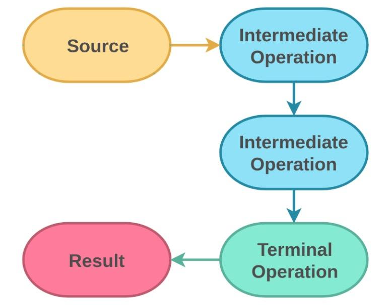

函数式编程（**F**unctional **P**rogramming）是自 JDK 1.8 以来引入的一个非常重要的特性，也是 Java 编程未来的发展方向。

<!-- more -->

# 概述

作为一种**编程范式**来说，函数式编程面世的时间已经很早了，而且其对使用者的建模和抽象的要求是特别高的。  
换句话来说，函数式编程具有自己的一套世界观和哲学观：

函数式编程以**函数**作为第一对象（函数作为一个变量，从而可以作为参数或返回值），注重**描述**（描述性的高级语言）而非具体的执行步骤，更关心代数结构之间的关系。

市面上常见的函数式编程语言有 JavaScript, Scala, Erlang, LISP, Clojure, Haskell 等。

# 函数式编程的编程特性

**不可变**  
将对象的变化拆解开，无需考虑并发问题，大大减少发生 bug 的可能性。

**惰性求值**  
需要结果的时候才进行求值。

**闭包**  
FP 必须有的特性。

**高阶函数**  
函数在经过一系列的转换之后生成新的函数，新函数的**阶**比原函数的更高。如：

```java
// 伪代码：
Function<?> callTwice(fn) {
    return () -> {
        fn();
        fn();
    }
}
```

**柯里化（Currying）**  
由数学家 Haskell Curry 提出，指的是将一个多参数函数转化为单参数函数的方法，如：

```js
function plus(x, y) {
    return x + y
}

// 调用：
plus(1, 2)  // 输出 3


// 柯里化：
function plus(y) {
    return function (x) {
        return x + y
    }
}

// 调用：
plus(1)(2)  // 输出 3
```

**部分应用**  
Partial Application，将多个参数的函数进行拆分，拆成多个只有一个参数或部分参数的函数，与柯里化较为相似。

**结合律**  
指函数功能的组合。

千万不要认为函数式编程（FP）和 OOP 是两个水火不相容的东西，因为现在的发展趋势是混合式的范式编程，即：你中有我，我中有你。

然而要注意的一点是：以上提到的特性中的大部分，包括柯里化、部分应用等，在 JDK 1.8 都是用不了的，这也是 JVM 为了向前兼容的结果。  
所以 JDK 1.8 所提供的所谓的“函数式”距离真正的函数式还很远，能应用到的只是**阉割版**的函数式编程。

# 基础应用

在 Java 8 之前的版本中，我们有很多适用函数式编程的场景：

* 创建一个新的线程（Runnable）
* UI 编程
* 异步回调
* 策略模式，如 Comparator
* ......

只是基于当时版本的语言特性，需要用比较“蛋疼”的**匿名内部类**来实现。

JDK 1.8 引入函数式编程之后，我们可以使用其支持的 **Lambda 表达式**来简化以上场景的实现。

## Lambda 表达式

一个 Lambda 表达式要表达的是一个方法（函数），经 Lambda 表达式转换过后的方法能够作为一个变量去被引用。

相比于普通方法，Lambda 表达式在保留**方法签名**（**入参**）、**返回值**和**函数体**这几个函数必需的部分之后，使用运算符 **`->`** 将方法签名和函数体连接起来：

```java
// 假设我们有这个方法：
public static void fn(T param1, R param2) {
    ...  // 函数体
}

// 转为用 Lambda 表达式表示：
XXFunction fn = (T param1, R param2) -> {
    ...  // 函数体
}
// 三要素：参数、函数体和箭头（->）
```

以上：Lambda 表达式是一个表达式，它是没有名字的；我们定义了一个 Function 变量 `fn` 保存了这个 Lambda 表达式的引用。

Lambda 表达式包含了很多语法糖。除了忽略访问权限和返回类型之外，还包括：

* 编译器可对参数类型进行推导
* 单行函数体可省略大括号
* 单入参可省略小括号

给大家看一个普通的 Java 方法 Lambda 转化前后的过程：

### 转写 Lambda 表达式步骤

```java
XXFunction aBlockOfCode = public void doSomeShit(String s) {
    System.out.println(s);
}
```

首先，`public` 是多余的，可以省略：

```java
XXFunction aBlockOfCode = void doSomeShit(String s) {
    System.out.println(s);
}
```

函数的名字也是多余的，因为 Lambda 表达式没有名字，且方法引用已经赋值给了 aBlockOfCode：

```java
XXFunction aBlockOfCode = void (String s) {
    System.out.println(s);
}
```

然后，编译器可以自行判断函数返回类型和入参的参数类型，因此这俩可以省略：

```java
XXFunction aBlockOfCode = (s) {
    System.out.println(s);
}
```

再使用运算符 **`->`** 将方法签名和函数体连接起来：

```java
XXFunction aBlockOfCode = (s) -> {
    System.out.println(s);
}
```

单行函数体可省略大括号，单入参可省略小括号，最终可得：

```java
XXFunction aBlockOfCode = s -> System.out.println(s);  // ELEGANT!
```

**注意**：没有入参的话，需要一个空括号 `()` 代替方法签名。

### 表示高阶函数

明白了 Java 的 Lambda 表达式连接规则之后，我们就能很容易写出来属于 Java Lambda 的高阶函数了：

```java
a -> b -> c -> d;

// 其实就是：
(a) -> {(b) -> {(c) -> d;}}
// 即：
methodA(a) {
    methodB(b) {
        methodC(c) {
            d;
        }
    }
}

// 从纯函数式层面，我们可以理解为 (a, b, c) -> d
// 但是 Java 不具备柯里化，所以还只能按照 a -> b -> c -> d 理解
```

从柯里化的角度来说，等于：

* fn = a -> b -> c -> d
* fn1 = fn(a)
* fn2 = fn1(b)
* fn3 = fn2(c) = d

说完这么多，有人就问了，Lambda 既然能够表示一个函数，那它在 Java 语言里面的类型是什么？

回到上面我们提到的 Java 函数式编程适用场景。  
Java 为了能够向前兼容，使用了接口（Interface）作为 Lambda 的类型；因为 Lambda 表达式表示的是函数，那么这种表示函数的接口，我们称之为“**函数式接口**”。

## 函数式接口 SAM

能够描述某个函数的接口，其接口里面相对应的方法签名应该**只有一个**。  
因此函数式接口中的 Single Abstract Method，由名字我们可以看出：给一个函数定义一个接口，接口内只能有**单个非默认/静态实现方法**。

所有 Lambda 类型都是一个接口，Lambda 表达式本身是这个接口的实现。  
所以，即使 Lambda 表达式没有名字，但是一对应上 SAM，大家都会懂它描述的是哪个方法。

在接口定义中可使用 `@FunctionalInterface` 注解进行修饰，但不是必须的。

反过来：如果某个接口类只有一个非默认/静态方法，我们可以认为它是一个函数式接口，Lambda 表达式可以赋值给该接口类的实现中。

书接上回的 Lambda 表达式。定义好接口之后，可以得到：

```java
@FunctionalInterface  // 如果加上了注释，编译器会进行校验
interface MyLambdaInterface {
    public void doSomeShit(String s);  // 只能有单个非默认/静态实现方法
}

...

MyLambdaInterface aBlockOfCode = s -> System.out.println(s);  // aBlockOfCode 的类型为 MyLambdaInterface
```

在不同版本的 Java 中，对接口的实现和使用是不一样的。

我们先有这么一个方法：

```java
public static void enact(MyLambdaInterface myLambda, String s) {
    myLambda.doSomeShit(s);
}
```

在 Java 7 及更早版本，我们先要有一个 MyLambdaInterface 的实现类，再将实现类传入 enact() 中：

```java
public class MyLambdaInterfaceImpl implements MyLambdaInterface {
    @Override
    public void doSomeShit(String s) {
        System.out.println(s);
    }
}

...

// 调用
MyLambdaInterface interfaceImpl = new MyLambdaInterfaceImpl();
enact(interfaceImpl, "hello");
```

从 Java 8 开始，定义好了函数式接口之后，可以直接将 Lambda 表达式传入 enact()：

```java
enact(s -> System.out.println(s), "hello");
```

使用比旧版本的方便得多了。

以下为 JDK 8 常用的内置函数式接口：

| Class    | Input   | Output |
| ------   | ------  | ------ |
| `Function<T,R>`    | T      | R         |
| `Supplier<T>`      | `void` | T         |
| `Consumer<T>`      | T      | `void`    |
| `Runnable`         | `void` | `void`    |
| `Predicate<T>`     | T      | `Boolean` |
| `UnaryOperator<T>` | T      | T         |

两个 input 用 `BiFunction`，三个 input 的没有，要自定义。

上述的 a -> b -> c -> d 可以理解为：

```java
Function<?,Consumer<?>> fn = a -> {b -> c -> d};
Function<?,Consumer<?>> fn1 = b -> {c -> d};
Function<?,?> fn2 = c -> {d};
```

区分了这么多类型的接口，是因为 Java 属于强类型的编程语言，需要对输入产出进行明确的类型划分。  
在此背景下，任意两个接口之间因为互相没有实现或扩展关系，所以互相不能强制转换；比如：`Predicate<?>` 不能赋值给 `Function<?,Boolean>`。  
虽然看上去像多态，但是不要将多态往函数式编程上靠。

## 方法引用

函数式接口不仅可以直接使用 Lambda 表达式赋值；对于已有的方法（函数）来说，要想在函数式编程中更优雅地使用，还可以通过**方法引用**去使用它们。

所谓“更优雅地使用”，指的是虽然我们可以通过给现有方法包装一层 Lambda 表达式去赋值给函数式接口：

```java
Runnable r = () -> Integer.parseInt("9527");
```

但是从 Java 8 开始，可以使用方法引用去引用一个已经定义好的 Java 方法。

方法引用使用 `::` 操作符来确定需要引用的方法的**唯一名称**：

**1**. 静态方法：类名`::`静态方法名

```java
Integer::parseInt;  // 告知属于哪个类
```

**2**. 构造函数引用：类名`::new`

```java
Person::new;  // 告知属于哪个类

// 无参构造函数的引用类型是 Supplier<Clazz>
// 有参构造函数的引用类型是 Function<T,Clazz>
```

**3**. 指定实例的方法引用：实例对象`::`实例方法

```java
str::subString;  // 告知属于哪个实例
```

**4**. **指定类型**中任意一个实例方法的引用：

```java
// 设有类 T：
public class T {
    ...

    method1(arg2..argN);  // 参数个数为 N - 1
    ...
}

// 现有以下函数式接口：
public interface Fn {
    apply(T arg1, arg2..argN)  // 参数个数为 N
}
```

那当某个方法对接口进行方法引用的时候：

```java
otherMethod(Fn fn);
```

我们可以引用指定 T 的一个形参数量比 SAM 少一个的方法：

```java
otherMethod(T::method1);  // 以此完成对指定类型中任意一个实例方法的引用
```

如此，当调用

```java
Fn.apply(TInstance arg1, arg2..argN);
```

的时候，`arg2..argN` 等参数会传入

```java
TInstance.method1(arg2..argN)
```

里面；`method1()` 会被调用，同时 `arg1` 会被作为调用 `method1()` 方法的实例。可以理解为：

```java
fn(arg1, arg2..argN) == arg1.method1(arg2..argN)
```

### 函数式接口转换

由于 Java 是强类型语言，Java 8 的函数式接口有的时候比较难用；然而在某些我们并不要求函数签名完全一致的场合中（也是其他函数式编程语言的特性），希望可以就不同的函数式接口进行转换。  
比如说：

* 某个方法引用要求传入 `Function`，但实际应用的时候不关心输入，希望传入 `Supplier`；
* 某个方法引用要求传入 `Consumer`，但目前手头上的是 `Function`；
* 某个方法引用仅要求 `Runnable`，但目前手头上的是 `Supplier`

以上的情况，手头上有的都不能直接传入对方法的引用中，需要另外编写 util 方法去转换，或者：

就编程经验来说，我们可以采取一个特殊的 **void-compatibility** 规则：  
如果 Lambda 是一个语句表达式，那么即使该 Lambda 表达式有返回值，也可以赋值给返回值签名为 void 的函数。

这样子的话，单句的 Lambda 表达式可以赋值给 `Consumer` 和 `Runnable`。

# 进阶应用：Stream

不仅是在 Java 8，`Stream` 在整个函数式编程中都占有着举足轻重的地位。

首先，Stream 是一个**哲学**上的概念；相对于 List 来说，Stream：

* 可以是无限的：《SICP》认为在函数式编程中，所有的东西都是不可变的；而在实际处理一些会变化的场景时，将场景看作是一个与时间有关的函数，函数本身（即场景变化的历史）不可变。
* 可以并行处理
* 可能延迟处理：在无限的流中执行操作，得到的中间结果不可能实时显示出来。

相对于 List 的 foreach 将每个点分开来处理，Stream 引用一些函数将其自身**变形**至其他的 Stream 来做另外的处理，但是不需要拆分至每一个元素。

创建 Stream 的方法：

* 静态数据构建有限流：`Stream.of(T)`
* 容器：`[collection|map].stream()`
* 动态生成有限/无限流：`Stream.iterate(T, UnaryOperator)` `Stream.generate(Supplier)`
* 其他 API：`Files.lines()` ...

一个很有名的 Stream 响应式编程应用就是点击事件的处理，根据 Stream 中规定时间段内的点击次数来判断单击/双击事件。

## 基本操作

Java 8 中的 Stream 有很多 API，主要分两种类别：

**Intermediate**：中间状态操作，应用在 Stream 的变化之中的 API；结果不能实时显示。

* filter
* distinct
* skip
* limit
* map / flatMap
* sorted
* peek
* ...

**Terminal**：这些 API 一旦被调用，Stream 就在操作调用前变为有限的流；随后 Stream 被终结，在往后的计算中不能再被使用。

* count / sum
* collect / reduce
* foreach
* anyMatch / allMatch / noneMatch
* ...



其中被誉为函数式编程“三板斧”的三个高阶函数：

* `filter(Predicate predicate)`：根据传入的条件过滤期望结果
* `map(Function mapper)`：根据传入的函数做映射
* `reduce(BinaryOperator acc)` / `reduce(T identity, BinaryOperator acc)` / `reduce(U Identity, BiFunction acc, BinaryOperator combiner)`：根据传入的函数将流折叠（计算 Stream 的值得到最终的累积结果）

注：reduce() 与递归不同；递归是在循环里面调用自己，而 reduce() 没有调用传入的函数本身。


reduce() 做累加的例子：


用到了 `reduce(T identity, BinaryOperator acc)`，也是**用得最多**的 reduce() 函数。

*Hadoop* 正是借鉴了函数式编程中 `map` 和 `reduce` 的概念，创建了属于自己的 MapReduce。

## reduce 可以用来实现什么

**求和**：

```java
int sum(Collection<Integer> list) {
    return list.stream().reduce(0, (acc, curr) -> acc + curr);
    // 或：return list.stream().reduce(0, Integer::sum);
}
```

**求最大值**：

```java
Integer max(Collection<Integer> list) {
    return list.stream().reduce(Math::max).orElse(null);  // reduce(BinaryOperator acc) 要求累计值和当前值类型相同
}
```

**拼接字符串**：

```java
String join(Collection<Integer> list, String delimiter) {
    return list.stream().map(String::valueOf)
        .reduce((acc, curr) -> String.join(delimiter, acc, curr)).orElse("");
}
```

**存放进 Collection**：

```java
<T> List<T> toList(Stream<T> stream) {
    List<T> ret = new ArrayList<>();
    return stream.reduce(ret,
                         (acc, curr) -> {  // BiFunction 规避了累计值和当前值类型必须相同的问题
                             acc.add(curr);
                             return acc;  // 讨巧的实现，每次都返回累加后的自己，不是一个新元素，严格来说这并不正确
                         },
                         (list1, list2) -> {  // 并行执行 stream 的时候所要引用的表达式
                             list1.addAll(list2);
                             return list1;
                         });  // 应该使用 collect 实现
}

// 正常来说，应该用 collect()
```

**实现 map**：

```java
<T,R> List<R> map(List<T> list, Function<T,R> mapFn) {
    List<R> ret = new ArrayList<>();
    return list.stream().reduce(ret,
                                (acc, curr) -> {
                                    acc.add(mapFn.apply(curr));  // 转换
                                    return acc;
                                },
                                (list1, list2) -> {
                                    list1.addAll(list2);
                                    return list1;
                                });
    // for 循环也能实现，但是 for 属于有限数量的遍历，不能应用到无限的 stream 中去
}
```

**实现 filter**：

```java
<T> List<T> filter(List<T> list, Predicate<T> p) {
    List<R> ret = new ArrayList<>();
    return list.stream().reduce(ret,
                                (acc, curr) -> {
                                    if (p.test(curr)) {
                                        acc.add(curr);  // 过滤
                                    }
                                    return acc;
                                },
                                (list1, list2) -> {
                                    list1.addAll(list2);
                                    return list1;
                                });
}
```

**Transducer**：多个 reduce 自由组合的一种模式，从而自定义 Stream。

```java
// 取上面例子的 BiFunction 做结合：
.reduce(
    (acc, curr) -> {
        if (p.test(curr)) {  // 最外层的 reduceFunction
            R newValue = mapFn.apply(curr);  // 里一层的 reduceFunction
            acc.add(newValue);  // 最里层的 reduceFunction
        }
        return acc;
    }
)
// 这样的组合为一个 transducer
```

每一个 reduceFunction 由 `Function` 和 `BiFunction` 组成，比如：

```java
return (acc,curr) -> {
    return biFunction.apply(acc, function.apply(curr));
};
```

最后通过函数组合 `f1.compose(f2)` 或 `f2.andThen(f1)`（这个语义上更直观）完成组合：

```text
f1 * f2 == f3(x), 相当于 f1(f2(x)).
```

组合过程中没有对任意一个函数做过任何一次调用。

## **collect()**

`Stream.collect()` 跟 reduce() 是兄弟函数，是增强版的 reduce()，所使用的频率高于 reduce()。

函数签名：

```java
collect(Supplier supplier, BiConsumer accumulator, BiConsumer combiner);  // supplier 是承载状态改变的容器
collect(Collector collector);  // Collector 类封装了 .collect() 所需要的全部要素
```

区别在于：

对于传入的 accumulator 函数 `(acc, curr)`，collect 会将 acc 变成一个**有状态**的量，每次 accumulate 的时候可以直接获取 acc 当前状态；而 reduce 设计上的本意是**不让修改** acc 的。

也就是说，collect 操作的 acc 是可变数据，语义示意如下：

```java
R container = supplier.get();
for (T data : datas) {
    accumulator.accept(container, data);  // 没有返回值，每一次循环更新累计值 container 的状态
}
return container;  // 返回内部更改过状态的累计值
```

而 reduce（`reduce(initValue, (acc, curr))`）操作的是不可变数据：

```java
R ret = initValue;
for (T data : datas) {
    ret = accumulator.apply(ret, data);  // 每一次根据累计值和当前元素返回一个新的累计值
}
return ret;
```

再多说一嘴 `Collector` 接口：

鉴于每一次传递参数的时候，对应特定的 collect() 结果，都会传递对应的一套 supplier, accumulator 和 combiner 的组合；所以 JDK 的开发者们干脆就设计了 Collector 的接口，将一系列的函数放在了一起。

因此 Collector 各个参数就很明显了：

* `Supplier`：累计数据构造函数
* `Accumulator`：累计函数，同 reduce() 参数
* `Combiner`：合并函数，在并行场合下做处理使用，同 reduce() 参数
* `Finisher`：对累计数据做最终转换
* *`Characteristics`：特征（并发 CONCURRENT / 无序 UNORDERED / 无 Finisher IDENTITY_FINISH）

<small>注：IDENTITY 函数在函数式编程的意思是：输入一个值，将其自身输出。</small>

比如 `Collectors.toList()` 的实现是这样的：

```java
...

public static <T> Collector<T, ?, List<T>> toList() {
    return new CollectorImpl<>((Supplier<List<T>>) ArrayList::new,  // supplier
                                List::add,  // accumulator
                                (left, right) -> { left.addAll(right); return left; },  // combiner
                                CH_ID);  // characteristics
}

...
```

Combiner 需满足同一律：

```java
Combiner.apply(acc, []) == acc;
```

Finisher 需满足结合律：

```java
acc.accept(t1);
acc.accept(t2);
finisher.apply(acc);

// 等同于：
acc1.accept(t1);
acc2.accept(t2);
finisher.apply(combiner.apply(t1, t2));
```

以上所有的条件，都是基于 Stream 能并发处理数据的特性，需要确保数据的一致性。

## Collectors 工具类

JDK 的静态工具类 `Collectors` 已经给我们提供了很多即用的 API 了，包括：

* 流转容器：toList() / to(Concurrent)Map() / toSet() / toCollection()
* counting() / averagingXX() / joining() / summingXX()
* 分组：groupingBy() / partitioningBy()
* mapping() / reducing()
* ...

下面挑一两个来简单说一下。

<br/>

### **.groupingBy()**

函数签名：

```java
// 根据 classifier 单纯将 stream 数据分到对应的 key 上，再存放成 Map<key, List>，默认使用 HashMap
Collector<T,?,Map<K,List<T>>> groupingBy(Function classfier);

// 分到 key 上之后，对每个 key 的元素进行后续的 collect() 操作
Collector<T,?,Map<K,D>> groupingBy(Function classfier, Collector downstream);

// 同上，允许自定义 Map 创建
Collector<T,?,M> groupingBy(Function classfier, Supplier mapFactory, Collector downstream);  
```


第一个函数签名是直接将分到不同的 key 上的数据流用 **List** 汇总并返回；  
剩余的函数签名，使用的是**传入的 Collector** 对不同的 key 上分到的数据流进行处理（数据分类完之后再做事情）。  
理论上来说，Collectors 工具类**所有的 API** 都可以作为传入的 Collector。

所以 `.groupingBy()` 能够很简单地解决多级分层的问题。

<br/>

# 进阶应用：Optional

Optional 在 JDK 8 中和 Stream 具有同等重要的地位，它最大的意义在于能够简化 null check，免除了编程时 NullPointerException 带来的痛苦：

我们可以用一个类似于“薛定谔的猫”的容器图来描述 Optional 的功能：


Optional 本身不会为 null。

Optional 的一些 API：

```java
ofNullable(T t);  // 允许传入值为空
of(T t);  // 空值会报错
orElse(T t);  // return x != null ? x : t
orElseGet(Function fn);  // return x != null ? x : fn()
ifPresent(Function fn);  // if x != null execute fn()
```

举个例子，假设有下面的 `Person` 对象：

```java
Person person = getSomeOne();
```

在 Java 7 及之前的版本中，如果要对 person 对象进行空值判断，我们需要一个甚至多个 `if-else` 代码块。

从 Java 8 开始，只需要声明一个 `Optional` 对象，如：

```java
Optional<Person> personOpt = Optional.ofNullable(person);  // “薛定谔的箱子”
```

存在就开干

```java
// Java 7
If (person != null) {
    System.out.println(person);
}

// Java 8
personOpt.ifPresent(System.out::println);
```

存在即返回

```java
// Java 7
return person == null ? UNKNOWN_PERSON : person;

// Java 8
return personOpt.orElse(UNKNOWN_PERSON);
```

```java
// Java 7
return person == null ? getPersonFromDb() : person;

// Java 8
return personOpt.orElseGet(() -> getPersonFromDb());
```

其实以上代码只是 Optional 边边角角的应用。  
Optional 对于空值的判断的判断其实还不如 if-else。Optional 自身最大的意义并不仅仅在于做非空判断，而是在于它在做完非空判断之后，还能接着**执行**其他的诸如 `.filter()` `.map()` `.flatMap()` 等**方法且不会出错**。

上面提到的三个方法，是 Optional 的价值所在，是 Optional 相对于 if-else 代码块的优势，否则要只是做非空判断的话，还真的不如直接写 if-else。

先说 Optional 最重要的 `.map()`：

<br/>

## **map()**

```java
map(Function<? super T,? extends U> mapper)
```

map() 的返回值是 Optional 类型。

再来一个容器图：


可知如果存在值 x，随后可以通过 `.map(fn)` 计算 `fn(x)` 的值；倘若值为 null，fn 不会被调用，即使调用了 `.map(fn)`，方法也不会抛出 NullPointerException，且可以**接着往下级联处理**，完全不用担心，也不用理会这条处理链当中的任何一个节点会出错（抛 NullPointerException 异常）。

如果接着 fn(x) 之后再有 `.map(gn)` 的话，那处理链下一个节点里面就是 `gn(fn(x))`，不难看出 Optional 的处理链就是**函数组合**。

应用于多层嵌套 null 检查非常管用：

```java
// Java 7
if (person != null) {
    String name = person.getLastName();
    return name == null ? null : name.toUpperCase();
} else {
    return null;
}

// Java 8
return personOpt.map(p -> p.getLastName())
                .map(name -> name.toUpperCase())
                .orElse(null);
```

如上，在抛弃一大堆嵌套的 if-else 代码块之后，处理链代码会变得非常简单明了，维护性也会大大提高。


## **flatMap()**

如果 `fn(x)` 的结果是一个 Optional，应该怎么处理？


这个时候可以使用另一个方法 `flatMap()`。

```java
flatMap(Function<? super T,Optional<U>> mapper)
```

根据函数式编程的语义，flatMap() 接收返回值为 Optional 的函数，将传入的 Optional 对象“外包装去掉”取出值 value，再将 value join 进 map() 生成的 Optional 中：


Optional 中的 map() 和 flatMap()，和 Stream 中的 map() 和 flatMap() 语义差不多，都是属于函数式编程里面**范畴**的概念。  
在这个概念里面，Optional 和 Stream 被称为 **Functor** **函子** / **Monad** **单子**，它们的 map() 以及 flatMap() 这些函数能够建立它们函子所在世界里面的映射关系。

<br/>

Optional 不太好的地方在于它与 Stream 的结合不太好，`ofNullable()` 的形参是单个元素，倘若有集合（如 List）需要处理的话，最好还是使用 Stream 的 .filter()，跟 Optional 的关系就不大了。


## Functor & Monad

实现了 map() 在内部世界映射的称之为 Functor；实现了 flatMap() 通过跨范畴映射并 join 到对应容器的称之为 Monad。

除了 Optional 和 Stream 之外，函数式编程还有非常多类似的概念：


## `CompletableFuture`

Future 的增强版，部分实现了函数式编程中 Promise 的功能。

有这么一个例子：


service4 依赖于 service2 和 service3 的结果，service2 依赖于 service1 的结果，service1 和 service3 之间无关联。

倘若使用 Future 实现，那么上面的一段话我们还要想一遍，用代码步骤去阐述依赖关系：

```java
Future<String> task1 = pool.submit(FutureExample::service1);
Future<String> task3 = pool.submit(FutureExample::service3);

String ret1 = task1.get();
Future<String> task2 = pool.submit(() -> service2(ret1));

String ret2 = task2.get();
String ret3 = task3.get();

return service4(ret2, ret3);
```

这种服务依赖关系一旦有所改变，修改代码的时候还要将这一大段逻辑从头到尾去看一遍；而且随着系统复杂度日渐提高，这段代码的维护成本会上涨得更快。

用 CompletableFuture 的实现：

```java
CompletableFuture<String> cf2 = CompletableFuture.supplyAsync(FutureExample::service1, pool).thenApply(FutureExample::service2);
CompletableFuture<String> cf3 = CompletableFuture.supplyAsync(FutureExample::service3, pool);  // Executor 专用方法签名
CompletableFuture<String> cf4 = cf2.thenCombine(cf3, FutureExample::service4);
return cf4.join();
```

描述性的语言让代码变得简洁、可维护。

CompletableFuture API 里面的关键字：

* `accept-`：接收参数为 Consumer
* `apply-`：接收参数为 Function
* `handle-`：接收参数为 BiFunction
* `runAfter-`：接收参数为 Runnable
* `-Either/Both-`：等待任意任务完成还是全部完成
* `-then-`：等待当前任务完成再执行另外一个
* `-Async-`：后续任务是否异步执行
