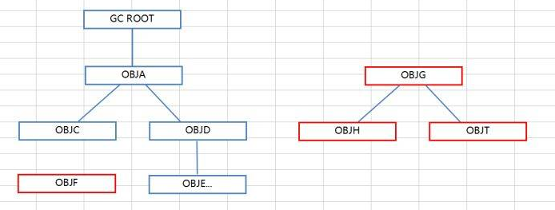

其实，很多 Java 初学者即使一点 GC 都不懂，也能写出一个能用甚至还不错的程序或系统，但并不代表 Java 的 GC 就不重要。

<!-- more -->

今天就来唠一唠这个 Java 的重要思想和 JVM 重要的组成部分 —— 垃圾回收。

# 背景

啥是内存垃圾？

当内存中的对象失去了所有的引用，变成了“孤魂野鬼”的时候，也就被称为“垃圾”。

这里展示一个垃圾对象的诞生过程：
```java
String str1 = new String("abc");  // "abc" 这个 String 对象有一个引用 str1 指向它
String str2 = str1;               // "abc" 现在有两个引用了：str1 和 str2 都指向它
str1 = null;  // 失去引用 str1
str2 = null;  // 失去引用 str2，失去全部引用，变成野对象

/* 由此，new String("abc"); 产生的对象失去了所有指向它的引用，将无法再被程序访问 */
```

有了垃圾，怎么清理呢？

就 C / C++ 语言来说，它们没有垃圾回收机制。  
除非程序结束，否则在堆中申请后还没被释放，且没有任何指向的内存会一直处于“三无”状态：
* 无法释放；
* 无法调用；
* 无法更改。

当这样无法再被访问的内存越积越多的时候，可利用的内存越来越少，就会导致内存泄漏（Memory Leak）。

如下为一次内存泄漏过程：
```c++
(int *) malloc (sizeof(int)*1024);
// 内存分配函数的参数没有问题，指针的转型也没有问题，但是并没有任何指针指向它……
```

JVM 所提供的垃圾回收机制（Garbage Collection, **GC**）会不定时地去回收垃圾对象所占用的内存，大大地降低内存泄漏的隐患。

<br/>

# 主要内容

首先我们要明白，垃圾回收机制所要回收的，是已经**没有任何引用的对象占据的内存空间**，而不是内存本身。  
JVM 通过自动检测对象是否超过作用域，从而达到自动回收内存的目的。  
主要包括两步：
* 在程序运行过程中**标记**垃圾对象
* 在 GC 过程中**回收**被标记的垃圾对象

所以我们说的 Java 语言有垃圾回收特性，其实是 JVM 提供的机制，Java 语言本身并没有提供释放已分配内存的显式操作方法。  
而 Java 的内存管理，实际上就是对象的管理，包括对象的分配和释放。


## 如何标记垃圾

主要有两种方法。

**1**. **计数法**（引用计数法，Reference Counting）：
* 所有算法的“祖宗”
* 当新建一个对象，或者有引用指向该对象时，该对象的引用计数器 + 1；
* 当一个对象引用超过了生存期限（失效）或指向新对象时，引用计数器 - 1；
* 当引用计数器对应的值变为 0 时，该对象不可能再被使用，虚拟机就会伺机回收该对象。

计数法的好处就是快、简单，但无法检测循环引用：
```java
class A {
    public B b;
}

class B {
    public A a;
}

public static void main(String[] args) {  // 孤岛效应
    A a = new A();
    B b = new B();
    a.b = b;
    b.a = a;
}
```

而且每一次的引用产生和消除，需要伴随着一个加减法操作，对系统的性能有一定的影响。

基于以上问题，JVM 并没有选择此方法作为垃圾回收算法。

**2**. 跟踪法 / **根搜索算法**：

该算法从图论引入，它将一个调用链中所有的对象引用关系看作是一张**图**，虚拟机会从根节点开始，寻找对应的引用节点。  
这样的一些根节点被称为 **GC roots**；以每个 GC root 为起点能够形成作用链，链中的每个对象都是有向图的顶点。  

GC roots 包括：

* 虚拟机栈中引用的对象：
    ```java
    User user = new User();
    ```

* 静态属性引用的对象：
    ```java
    private static User user = new User();
    ```

* 常量引用的对象：
    ```java
    private static final User user = new User();
    ```

* 本地方法栈中引用的对象。

从根结点开始去访问某些对象，如果能被访问到，就将这些对象是**可触及的**。从 GC roots 开始，不可触及（不可达）的对象将会被回收。

<br/>



如上：红色部分为某个 GC Root 不可达的节点，它们可被回收。

<br/>

为了丰富的描述对象与对象之间的关系，更为了实现系统缓存的原因，Java 从 JDK 1.2 开始，建立了四种引用级别。


## 引用级别

4 种引用级别由高到低：
1. 强引用
2. 软引用
3. 弱引用
4. 虚引用

**强引用**（strong reference）
* 最普遍的引用，GC 在普通情况下绝对不会回收
* 当内存空间不足时，JVM 宁可抛出 OutOfMemoryError 使程序异常终止，也不会随意回收具有强引用的对象来解决问题

例：
* 使用 `Object obj = new Object();` 将 obj 指向了 new Object() 在堆中创建的对象，则 obj 为强引用
* obj = null; 时，new Object() 代表的对象不被任何引用所指向，该对象没有强引用。

**软引用**（`SoftReference`）
* GC 过程中，如果内存空间足够，则不回收只有软引用的对象
* 若堆空间不足时才会被回收
* 这种类型的对象是指某个对象没有被强引用所指向，而被软引用所指向
    * 如上例中 obj = null 之后的 new Object()
* 可以和一个引用队列（`ReferenceQueue`）联合使用
    * 如软引用所引用的对象被垃圾回收器回收，JVM 会把该软引用加入到与之关联的引用队列中

```java
class User {
    Integer id;
    String name;
}

public class Test {

    public static void main(String[] args) {
        User user = new User();  // 对象创建, 且有强引用
        user.id = 1;
        user.name = "Ray";
        SoftReference<User> softRef = new SoftReference<>(user);  // 添加软引用

        user = null;  // 移除强引用，现在 user 就只有软引用了
        User sameUser;
        if (null != (sameUser = softRef.get())) {
            // 只有软引用的对象未被垃圾回收
            System.out.println("recovered " + sameUser.name + "(" + sameUser.id + ") from SoftReference!");
        } else {
            // 只有软引用的对象被垃圾回收，内存较为稀缺
            System.out.println("user object GCed!");
        }
    }
}
```

**弱引用**（`WeakReference`）
* 与软引用类似
* 与软引用区别：只具有弱引用的对象拥有更短暂的生命周期
    * 在垃圾回收器线程扫描它所管辖的内存区域的过程中，一旦发现只具有弱引用的对象，不管当前内存空间足够与否，都会回收它的内存
    * 即当 GC 发生时，无论内存是否充足，只有弱引用的对象都会被回收
* 也可以和引用队列联合使用

```java
public static void main(String[] args) {
    User user = new User();  // 对象创建, 且有强引用
    user.id = 2;
    user.name = "Ray";
    WeakReference<User> weakRef = new WeakReference<>(user);  // 添加软引用

    user = null;  // 移除强引用，现在 user 就只有弱引用了
    User sameUser;
    if(null != (sameUser = weakRef.get())) {
        // 只有弱引用的对象未被垃圾回收
        System.out.println("recovered " + sameUser.name + "(" + sameUser.id + ") from WeakReference!");
    } else {
        // 只有弱引用的对象被垃圾回收
        System.out.println("user object GCed!");
    }
}
```

**虚引用**（`PhantomReference`）
* “形同虚设”，不会决定对象的生命周期
    * 即：对象有没有虚引用与对象会不会被 GC 没有关系
* 如果一个对象仅持有虚引用，那么它就和没有任何引用一样，在任何时候都可能被垃圾回收器回收
* 主要是用来跟踪对象被垃圾回收器回收的活动
* 与软引用、弱引用区别：虚引用必须和引用队列联合使用


## 槽位复用对垃圾回收的影响

```java
public class Test {

    public void method1() {
        {
            byte[] a = new byte[5*1024*1024];
            System.out.println(a.length);
        }
        System.gc();
    }
    
    public void method2() {  // b 复用了 a 的槽位
        {
            byte[] a = new byte[5*1024*1024];
            System.out.println(a.length);
        }
        int b = 10;
        System.gc();
    }
}
```

对于 method1()，虽然 a 已经不在作用域中，但是 a 仍然占用一个槽位，并且存在引用，所以该数组还**不能被回收**。

对于 method2()，b 复用了 a 的槽位，此时数组已经不再占用栈帧的局部变量表中的槽位了，**可以被回收**。

<br/>

# 垃圾回收算法

JVM 的垃圾回收算法，基本上是基于跟踪法发展而来。具体来说，主要有**三种**：


**1. 标记-清除算法 Mark-Sweep**

标记清除算法是现代垃圾回收算法的思想基础。顾名思义，算法会分为“标记”和“清除”两个阶段：
* 从根集合扫描出存活的对象（遍历有向图），从存活（可达）的对象进行标记；
* 完了之后再扫描堆栈中未标记的对象，并进行回收。


该算法（M-S）最大的问题是效率低，回收完成后会产生大量的不连续空间（空间碎片），插入新对象的时候不好操作。


**2. 标记-压缩算法 Mark-Compact**

* 第一阶段的“标记”同标记-清除算法；
* 第二阶段：把被标记的对象移动到内存的一端，从而形成连续内存，并回收所有存活对象以外的内存。


该算法（M-C）不会产生内存碎片，因此提高了内存利用率，相当于“用时间换空间”。适用于触发次数不那么多的**老年代**的垃圾回收。


**3. 复制算法 Copying**

* 将原有的内存分为大小相等的两块，每次只使用其中一块；
* 从根集合扫描出存活的对象后，将这些对象复制到一块完全未使用的空间（另一块）去；
* 复制完成之后，将前面一块内存回收。

复制算法为了解决标记-清除算法效率低的问题而设计，简单高效；但是内存利用率较低（每次只能用一半内存）。


看完了介绍，联想一下 JVM 堆的结构，有没有想到什么？

<br/>

没错，堆里面新生代的 `From Survivor` 和 `To Survivor` 之间，就是这么样操作的（不然怎么叫 "from" 和 "to"），这也算是对“只能使用 1/2 内存”的优化。  
出于简单高效的优点，而且新生代大多数对象都“朝不保夕”，所以**新生代**的 GC 使用了复制算法。

<br/>

结合以上算法，还根据堆的各个功能区产生了两种**策略**，以提升回收效率：


**4. 分代收集算法**
* 复制算法用于新生代：以空间换时间
* 压缩或清除算法用于老年代：以时间换空间


**5. 分区算法**：将堆空间划分成连续不同的小区间，每个区间独立使用，独立回收。

当堆空间很大的时候，执行一次 GC 会非常耗时。


分区算法的好处是：可以**控制一次回收多少小空间，而不是整个堆**，避免 GC 时间过长，造成系统停顿。

如上：绿转白的是指定回收的内存块，可通过设置垃圾占比阈值来控制回收与否。

<br/>

# 回收策略

JVM 的 GC 算法为**分代收集**，具体的设计为：
1. 频繁收集新生代
2. 较少收集老年代
3. 更少收集永久区/元空间

<br/>

新生代的垃圾收集：<big>**Young GC**</big>（YG，也叫 Minor GC）

对象确定在新生代分配之后，如果 Eden 区没有足够的空间，便会触发 YG。  
步骤如下：
1. 将 `Eden` + `From Survivor` 区存活的对象复制到 `To Survivor`
2. 若 Survivor 区满，则将 Survivor 区内的存活对象转移到**老年代**
    * 若老年代也满了（……），则抛出 `OutOfMemoryException`
3. 清空 Eden 和 From Survivor
4. From Survivor 和 To Survivor **交换**，以备下次垃圾收集使用。


整个 JVM 堆的垃圾收集：<big>**Full GC**</big>（也叫 Major GC）

触发 Full GC 的条件有很多：
* 对象晋升时，对象大小大于老年代可用空间的大小
* 老年代的连续空间不足
* Metaspace 达到阈值
* 显式调用 GC：

```java
System.gc();  // 请求运行垃圾回收器触发 Full GC，不一定真的执行了垃圾回收，且不受代码控制

Runtime.getRuntime().gc();
```

<small>（注：真正的垃圾回收机制，具体在什么时间点开始发生动作，是不可预料的；这和抢占式的线程在发生作用时的原理一样，你不知道它什么时候开始，什么时候完成。所以**不能通过 Java 代码干预 Java 垃圾回收**。）</small>

Young GC 被触发的次数大大高于 Old GC 被触发的次数。

触发了 Full GC 之后，整个应用程序会暂停一小段时间，称作 **STOP THE WORLD**，是独占式的垃圾回收。  
如果执行 Full GC 之后老年代的空间仍不足：抛出 `OutOfMemoryException: Java heap space`  
如果执行 Full GC 之后元空间的空间仍不足：抛出 `OutOfMemoryException: Metaspace`


顺便借这里聊一聊老年代存储的对象和晋升机制：
* 大对象（由 JVM 参数决定）在分配内存的时候，会直接划归到老年代，如数组；
* 存储在新生代的对象，经过 N 次 GC 之后会**晋升**到老年代。默认 N = 15，且不能超过 15。
    * 为啥是 15？对象头的 Mark Word 里面，记录对象岁数的空间就 4 位，最大就是 1111 -> 15。
* Survivor 空间不足的时候。


# safe point

程序执行时并非在所有地方都能停顿下来开始执行 GC。因此。某些特定的时间点被称为 **safe-point**。

在使用 GC roots 分析可达性时，引用关系不会发生改变的点就是 safe-points，包括：
* 方法调用
* 循环跳转
* 异常跳转

<br/>

# 垃圾收集器（Garbage Collector）

JDK 1.7 update 14 版本中，针对 HotSpot 虚拟机设计的垃圾收集器在不同代内存的作用分布如下：


上图中，连着线的 GC 说明线的两头相连的收集器可以结合使用。

在介绍各种垃圾回收器之前，我们先给出一个定义：  
**吞吐量**：运行用户代码时间占用户代码时间和垃圾回收时间总和的百分比，越高说明垃圾回收对程序的影响越小，即程序吞吐量越大。

JVM 提供如下多种垃圾收集器：

## 串行 GC（Serial Garbage Collector）


单线程执行 GC 不存在线程切换，因此在单 CPU 环境下性能较好。

| JVM 参数                    | 作用                          |
| :--------------:           | :-------------:               |
| -XX:SurvivorRatio          | 设置 Eden 区与 Survivor 区的比例 |
| -XX:PretenureSizeThreshold | 设置大对象直接进入老年代的阈值     |
| -XX:MaxTenuringThreshold   | 设置对象进入老年代的年龄阈值       |

包括：

**Serial**
* JDK 1.3.1 之前，新生代唯一的 GC
* 也是 JVM Client 模式下默认的新生代收集器
* 使用单线程串行回收方式；使用复制算法，因此用于新生代

**Serial Old**
* Serial 的老年代版本
* 同为单线程操作，使用标记-压缩算法
* 作为 CMS 收集器的备案

启用<font color="#FF8C00">指定</font>的收集器：

| JVM 参数             | 新生代                               | 老年代                               |
| :--------------:    | :---------------------:             | :---------------------:             |
| -XX:+UseSerialGC    | <font color="#FF8C00">Serial</font> | <font color="#FF8C00">Serial Old</font> |
| -XX:+UseParNewGC    | ParNew                              | <font color="#FF8C00">Serial Old</font> |
| -XX:+UseParallelGC  | Parallel Scavenge                   | <font color="#FF8C00">Serial Old</font> |

<br/>

## 并行 GC（Parallel Garbage Collector）


将串行回收器多线程化，在多 CPU 环境下有更好的性能。  
与串行回收器有相同的回收策略、算法、参数。

还包括以下参数：

<table>
	<tr>
	    <th>垃圾收集器</th>
	    <th>JVM 参数</th>
	    <th>作用</th>
    </tr>
	<tr>
	    <th>ParNew</th>
	    <td>-XX:ParallelGCThreads</td>
        <td>指定 GC 时工作的线程数量</td>
	</tr>
	<tr>
	    <th rowspan="3">Parallel Scavenge</th>
        <td>-XX:MaxGCPauseMillis</td>
        <td>最大的垃圾收集暂停时间</td>
	</tr>
	<tr>
	    <td>-XX:GCTimeRatio</td>
        <td>设置垃圾收集吞吐量</td>
	</tr>
	<tr>
	    <td>-XX:+UseAdaptiveSizePolicy</td>
        <td>打开自适应垃圾收集策略</td>
	</tr>
    <tr>
	    <th>Parallel Old</th>
        <td>-XX:ParallelGCThreads</td>
        <td>指定 GC 时工作的线程数量</td>
	</tr>
</table>

包括：

**ParNew**
* Serial 的多线程版本：因此也是使用复制算法，应用于新生代
* 是 JVM Server 模式下默认的新生代收集器

**Parallel Scavenge**
* 与 ParNew 类似：使用复制算法，应用于新生代
* JDK 1.8 默认的收集器
* 追求高吞吐量，高效利用 CPU

**Parallel Old**
* Parallel Scavenge 的老年代版本
* 使用标记-压缩算法

启用<font color="#FF8C00">指定</font>的收集器：

| JVM 参数                  | 新生代                     | 老年代                    |
| :--------------:         | :----------------:        | :-----------------:      |
| -XX:+UseParNewGC         | <font color="#FF8C00">ParNew</font>            | Serial Old |
| -XX:+UseConcMarkSweepGC  | <font color="#FF8C00">ParNew</font>            | <font color="#FF8C00">CMS</font> |
| -XX:+UseParallelGC       | <font color="#FF8C00">Parallel Scavenge</font> | Serial Old |
| -XX:+UseParallelOldGC    | <font color="#FF8C00">Parallel Scavenge</font> | <font color="#FF8C00">Parallel Old</font> |


<br/>

## 并发标记-清除（Concurrent Mark-Sweep, **CMS** Garbage Collector）

顾名思义：CMS 使用了标记-清除算法，且属于**并行** GC。
* 以获取最短回收停顿时间为目标
* 使用于老年代的垃圾收集
* 因为配置参数太多，给 GC 代码库带来了很多复杂性，从 JDK 9 已经被 `@Deprecated` 了

| GC 算法  | JVM 参数（约数） |
| -------- | -------------- |
| Common   | 50 |
| Parallel | 6  |
| CMS      | 72 |
| G1       | 26 |
| ZGC      | 8  |

步骤：

1. **初始标记**（initial-mark）：标记作为 GC Roots 的对象（STOP THE WORLD）
2. **并发标记**（concurrent-mark）：从 GC Roots 开始对堆进行可达性分析，找出所有的活对象
    * **并发**：指的是标记对象的线程们**穿插**着应用线程执行，所以是不会 STOP THE WORLD 的
3. 预清理（concurrent-preclean）：修正并发期间，由于应用程序的操作导致的**标记变动**的一部分对象的标记记录
    * 非必须，可关闭
    * 存在的意义：节省下面的重新标记 STOP THE WORLD 的时间，让重新标记少处理一些
4. 重新标记（remark）：重新并发标记（STOP THE WORLD），标记垃圾最后的机会
5. **并发清理**（concurrent-sweep）
6. 并发重置（concurrent-reset）：将状态重置，等待下一次 CMS。


缺点：

1. 产生大量空间碎片，可能提前触发 Full GC
2. 无法清除浮动垃圾
3. 并发收集器对 CPU 资源敏感

注：

* CMS 收集器中，当老年代内存使用超过一定比例时，系统将会进行垃圾回收；
* 当剩余内存不能满足程序运行要求时，系统会出现 Concurrent Mode Failure，然后临时采用 Serial Old 算法进行清除；
* 此时性能会降低。

可用参数：

| JVM 参数                 | 作用                  |
| :--------------:        | :-------------:       |
| -XX:-CMSPrecleaningEnabled         | 禁用预清理操作          |
| -XX:ConcGCThreads                  | 设置并发运行的线程数量，如未设置，则使用 ParallelCMSThreads 计算  |
| -XX:ParallelCMSThreads             | （早期版本）设置并发运行的线程数量  |
| -XX:CMSInitiatingOccupancyFraction | 当老年代空间使用量达到某个百分比时，执行 CMS。默认 68             |
| -XX:+CMSCompactAtFullCollection    | GC 后进行一次碎片整理  |
| -XX:CMSFullGCsBeforeCompaction     | 指定执行多少次 GC 后，进行一次碎片整理   |

<br/>

## **G1**（Garbage-First）Garbage Collector

分区算法的应用：因此 G1 应用于堆的**全世代**，优先回收垃圾比例最高的区域。

* 从 JDK 1.7 开始投入使用，是 JDK 9 后的默认 GC
    * CMS 的取代者
* 将堆划分为多个区域，每次收集部分区域，减少 GC 停顿时间
* 兼顾吞吐量和停顿时间，可直观设定停顿时间

| JVM 参数                            | 作用               |
| :-------------------:              | :-------------:   |
| -XX:+UseG1GC                       | 打开 G1 收集器开关   |
| -XX:MaxGCPauseMillis               | 指定目标最大停顿时间  |
| -XX:ParallelGCThreads              | 设置并发线程数量     |
| -XX:InitiatingHeapOccupancyPercent | 指定堆的使用率为多少的时候，触发并发标记周期。默认 45  |

G1 对内存空间的划分与传统的内存空间划分有所不同：


G1 分四个阶段，而且按照顺序循环往复：
1. 新生代 GC
2. **并发标记周期**
3. 混合收集
4. Full GC（非必须）


### **新生代 GC**

G1 的新生代 GC 就是复制算法的那一套：
* Eden 区被占满的时候，新生代 GC 就会被启动
* 回收后，Eden + from survivor 区会被清空
    * 部分新生代对象会直接晋升到老年代
    * to survivor 会保留另一部分活的对象，然后 from 和 to 两块 survivor 区对调


### **并发标记周期**

G1 的并发标记周期如下：


由上图可知，G1 是参照了 CMS 而设计的，吸取了 CMS 的优点，包括**初始标记**、**并发标记**、**重新标记**和**并发清理**。  
另：
* 根区域扫描：扫描 survivor 区域，标记可以直接到达老年代的对象
* 独占清理：计算活跃度（存活对象与可清理对象的比例）并进行排序，统计出活跃度低的以及完全空闲的那些部分，便于之后进行清理
    * 紧接着的**并发清理**清理掉的是完全空闲的空间。

所以，G1 的并发标记周期针对的是**老年代**的堆空间。


### **混合收集**

在这里清除最主要的数据。
1. 由于已经触发了 Young GC，Eden 区域会被清空
2. 被标记的年轻代和老年代都会被回收
3. 活跃度低的会被清理，剩余的存活对象会被移动到其他区域，减少内存碎片。


