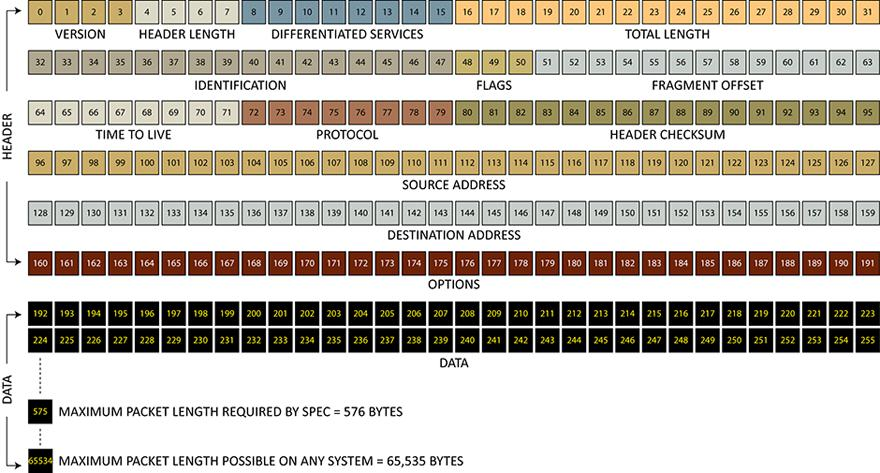
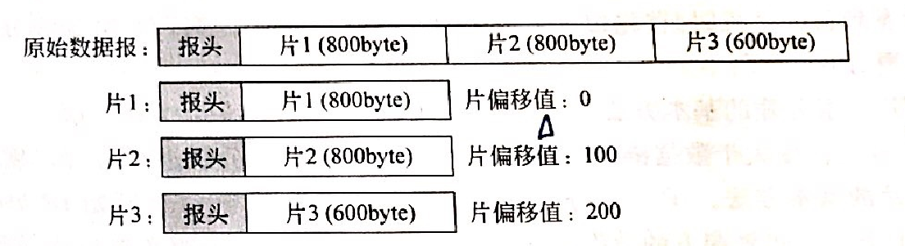
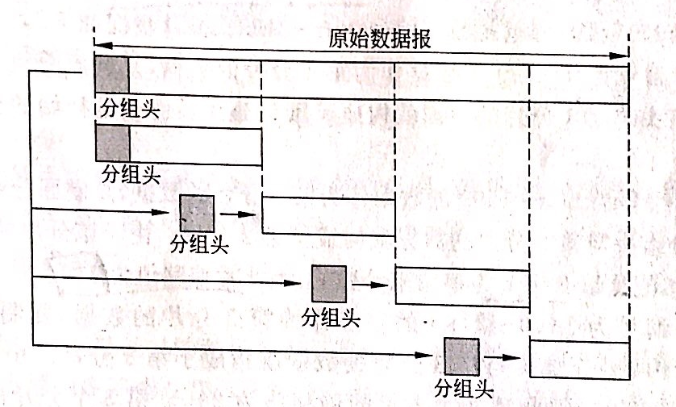
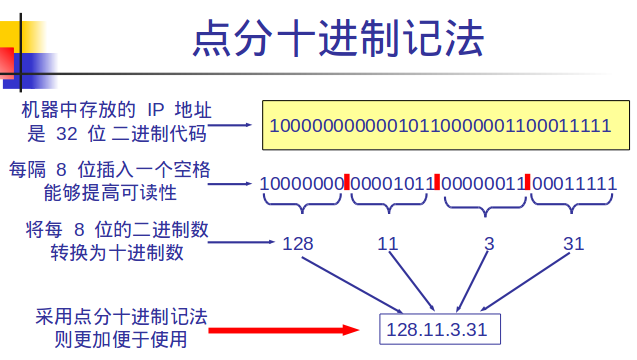
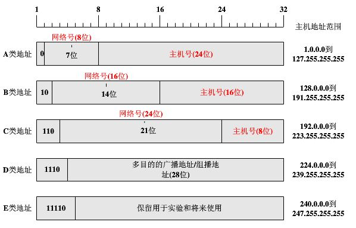
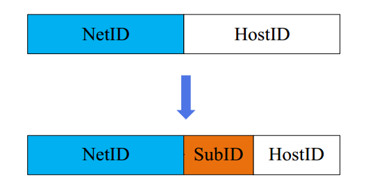

聊一聊 OSI 模型中的第三层：网络层。

<!-- more -->

网络层通过路由选择算法提供**路由**和**寻址**的功能，为 IP 分组从源主机到目的主机选择一条合适的传输路径，并为下一层 —— [传输层]提供端到端的数据传输服务；同时网络层具有一定的拥塞控制和流量控制的能力。

符合网络层功能，专门处理网络层路由与转发功能的计算机，我们称之为“**路由器**”。

由于 TCP/IP 协议体系里面的网络层功能由 IP 协议规定和实现，因此网络层又称为 **IP 层**。

那，什么是 IP 分组？

# IPv4

在网络层中，一个完整的网络地址包括：

* 网络名字（name）
* 网络地址（address）
* 路径（route）

IP 地址标识的是一台主机或路由器与网络的接口，最早由 1981 年的 RFC791 描述了 IPv4 协议。

IP 协议的主要特点如下：

**1**. IP 协议是**无连接**、**不可靠**的**分组**传送服务协议

* 不提供对分组传输过程的跟踪，意为“尽力而为（best-effort）”；
* 无连接：指的是 IP 协议并不维护 IP 分组发送后的任何状态信息，每个分组在各自的传输过程中相互独立；
* 不可靠：指的是 IP 协议不能保证每个 IP 分组都能正确地、不丢失和按顺序地到达目的主机；

IP 协议设计重点应放在系统适应性、可扩展性与可操作性上，在分组交付可靠性上只能做一定牺牲。

**2**. IP 协议是点-点（**Peer-to-Peer**）的网络层通信协议

* 网络层需要在 Internet 中为通信的两个主机之间寻找一条路径，该路径通常由多个路由器、点-点链路组成；
* IP 协议要保证数据分组从一个到另一个路由器，能通过多条路径从源主机到目的主机。

因此，IP 协议是针对源主机-路由器、路由器-路由器、路由器-目的主机之间的数据传输的点-点线路的网络层通信协议。

**3**. IP 协议屏蔽了互联的网络往下在数据链路层、物理层协议与实现技术上的差异

* 各种网络和协议，如广域网、城域网或局域网，都有可能是异构的；
* 即使都是局域网，其物理层、数据链路层协议也可能不同；
* 通过 IP 协议，网络层向传输层提供统一的 IP 分组，传输层不需要考虑互联网络在数据链路层、物理层协议与实现技术的差异。

# IPv4 分组（IPv4 数据报）格式

回答上面的问题：一份 IP 分组，就是一次 IP 报文的发送。

一份 IPv4 的报文由两个部分组成：

**1**. **分组头**：也称“首部”，长度可变。

* 分组头中前 5 行（共 20 字节，160 bits）为每个字节头中必须有的字段；第 6 行开始为选项字段  
* 因此 IPv4 分组头基本长度是 **20** 字节；
* 如加上最长 40 字节（10 行）的选项（`options`），则最大可达 **60** 字节

**2**. 数据。

根据 RFC791 规定：IP 分组最大长度为 **65535**（$2^{16} - 1$） 字节。

## 分组头格式

分组头总览如下：

以下为各字段的解释：

### 版本 `version`

IP 分组第一个字段，共 4 位，表示所使用的网络层 IP 的版本号。

* 字段值为 `0100 = 4`，表示 IPv4；`0110 = 6` 则表示 IPv6
* IP 软件在处理该分组之前必须检查版本号，以避免错误解释分组的内容

### 分组头长度 `header length`

也称报头长度，共 4 位，定义**以 4 字节为一个单位**的分组头的长度。

因为分组头除了 IP 选项（`options`）字段和填充字段（`padding`）外，其他各字段长度均为确定的值。

* 所以根据上文结论，分组头长度最小值为 `0101 = 5`（5 × 4 = 20 字节）；
* 如果加上 `options` 和 `padding`，分组头长度最大能达到 `1111 = 15`（15 × 4 = 60 字节）
* IP 分组头长度必须是 4 字节的**整数倍**，如不是 4 字节整数倍，则需要 `padding` “补 0”

### 服务类型 `differentiated services`

8 位，指示路由器如何处理该分组。字段内容包括：

**1**. 4 位服务类型（`Type of Service`, `TOS`），每一位分别表示：

* `D`（Delay，延迟）
* `T`（Throughput，吞吐量）
* `R`（Reliability，可靠性）
* `C`（Cost，成本）

每位的取值为 0 或 1；TOS 中最多只能有一位为 1，此时其他三位均为 0，代表基本配置：即只能有 `0000` `0001` `0010` `0100` `1000` 五种取值。

* 延迟位 D = 1 表示低延迟 low delay；D = 0 表示 normal
* 吞吐量位 T = 1 表示高吞吐量 high throughput；T = 0 表示 normal
* 可靠性为 R = 1 表示高可用 high reliability；R = 0 表示 normal
* 成本为 C = 1 表示低成本 low cost；C = 0 表示 normal

这个字段说明：每种服务类型都不可能同时在延迟、吞吐量、可靠性和成本 4 个方面达到最优，因此必须寻求折中方案，保证最基本性能。

**2**. 3 位优先级（`precedence`）

* IP 报文在网络间传输的时候，有的应用需要网络提供优先服务，导致一些重要服务信息的处理等级会比一般服务信息的处理等级高
* 当网络高负荷，路由器发生拥塞必须丢弃一些分组时，路由器会只接收某优先级以上的分组
* 路由器根据四个参数的组合来确定选择的标准

**3**. 1 位保留位

### 总长度 `total length`

16 位，定义以字节为单位的 IP 分组总长度，**包括分组头长度与数据长度之和**。

* 最大长度为 65535（$2^{16} - 1$）字节
* IP 分组中，高层协议的数据长度等于分组的总长度减去分组头长度

### 标识字段 `identification`

16 位，是 IP 分组的分片（fragment）识别标识，最多可分配 65535 个 ID。

应用场景：
* 属于同一分组的不同片到达时出现乱序，或与属于其他分组的片混在一起的情况；
* 目的主机会根据标识字段的 ID 值（如 1562），将所有**同样 ID 值的分片**挑出来，重新组装成一个分组

### 标志 `flags`

长度为 3 位，其中最高位是 0，该值必须复制到所有分组中。

另两位分别是：

* 不分片（Do not Fragment, `DF`）值：必须复制到所有分组中
    * DF = 1：接收主机不能对分组进行分片
        * 如分组长度超过 MTU 又不可分片：该分组只能被丢弃，并要用 ICMP 差错报文向源主机报告
    * DF = 0：接收主机可以对分组分片
* 分片（More Fragment, `MF`）值
    * MF = 1：接收到的分片不是最后一个分片
    * MF = 0：接收到的分片是最后一个分片

### 片偏移 `fragment offset`

13 位，表示分片在整个分组中的相对位置。

举个例子，如果系统以 8 字节为单位计数，则选择的分片长度应为 8 字节的整数倍。

例：

说明：

举例来说，该分组头长度 20 字节，分组数据长度为 820 字节，那么

* 第一个 IP 片：包括编号 0 - 799 的数据
    * 复制原分组头（除去标志和片偏移值），与第一分片数据构成第一分片
    * 初始分片，片偏移值为 0
* 第二个 IP 片：包括编号 800 - 1599 的数据
    * 复制原分组头（除去标志和片偏移值），与第二分片数据构成第二分片
    * 该分片第一个数据编码号为 800，800/8 = 100，因此偏移值为 100
* 第三个 IP 片：包括编号 1600 - 2199 的数据
    * 复制原分组头（除去标志和片偏移值），与第三分片数据构成第三分片
    * 该分片第一个数据编码号为 1600，1600/8 = 200，因此偏移值为 200

从原始分组到分片后，分组头总长度字段、标志和片偏移字段均发生变化：其中分片 1、分片 2 中的 MF = 1；分片 3 中 MF = 0。

因标识、标志与片偏移均发生变化，分组头的校验和需要重新计算。

### 生存时间 time-to-live, `TTL`

IP 分组从源主机到目的主机的传输延迟是不确定的。如果出现路由器的路由表错误，会造成分组在网络中循环、无休止的流动。

IPv4 通过该字段来设定分组在 Internet 中的“寿命”，长度为 8 位。

通常用转发分组最多的路由器跳数（hop）来度量
* 初始值由源主机设置，每经由一路由器转发，TTL 值就减一；
* 当 TTL 减至 0 时，该分组会被丢弃，并发送 ICMP 报文通知源主机

### 协议 `protocol`

8 位，指使用 IP 的更高一层（传输层）协议类型。

常见协议类型如下：

| 协议字段值 | 高层协议类型 |
| -------- | ---------- |
| 1        | ICMP       |
| 2        | IGMP       |
| 6        | TCP        |
| 8        | EGP        |
| 17       | UDP        |
| 41       | IPv6       |
| 89       | OSPF       |

### 头部校验和 `header checksum`

16 位，用以保证分组头部的数据完整性。

由于每经过一个路由器，IP 分组头都要改变一次，但数据部分不改变；且 IP 分组头之外的部分属于高层数据，高层数据都会有相应的校验字段。

因此 IP 分组可以不对高层数据进行校验，**只对分组头进行校验**，这样的校验方法是合理的，可以减少路由器对每个接收分组的处理时间，提高路由器运行效率。

计算方法：二进制反码求和

1. 将 IP 头看成 16 位字组成的二进制 bit 序列，计算前将校验和字段置 0
2. 对 16 位字进行求和运算：如最高位出现进位，则将进位加到结果的最低位
3. 将最终求和结果取反，得到校验和

这种检错能力不强，但算法简洁，运算速度快。

### 地址字段

包括**源地址**（`source address`）和**目的地址**（`destination address`），长度均为 32 位，是 IP 头最简单的部分，在分组整个传输过程中保持不变。

### 分组头选项 `options`

设置选项的主要目的是用于控制和测试。`options` 最大长度为 40 字节；如果用户使用的选项长度不是 4 字节的整数倍，则需要添加 `padding` 补足。

注意：
* 用户可以不使用 options，但作为 IP 分组头的组成部分，所有实现 IP 的硬件或软件都应能处理它

`options` 字段的组成如下：

1. **选项码**：用于确定该选项的具体功能，如源路由、记录路由、时间戳等；
2. **长度**：表示选项数据的大小；
3. 选项**数据**

这里说一下什么是**源路由**：

源路由指的是由发送分组的源主机**指定的传输路径**，用来区别由路由器通过路由选择算法确定的路径。  
主要用于测试某网络的吞吐量，绕开出错的网络；也用于保证分组传输安全的应用。

源路由分两种：

一是**严格源路由**（Strict Source Route, **`SSR`**），其规定了在分组要经过的路径上，相邻路由器间不能插入其他路由器，且经过的路由器顺序不能改变。

SSR 主要用于网络测试，例如：

* 将第一个测试点主机地址设定为分组头中的目的地址
* 将最后一个测试点主机地址设定为路径数据字段中的最后一个指定地址

二是**松散源路由**（Loose Source Route, **`LSR`**），其规定分组一定要经过的路由器，但不是一条完整的传输路径，中途可经过其他路由器。

再说一下**记录路由**（Record Route）：它将分组经过的每个路由器 IP 地址记录下来，常用于网络测试，如网管要了解发送到某个主机的分组经过哪些路由器才能到达目的主机；以及互联网中的路由器配置是否正确。

`options` 里的时间戳（Timestamp, TS）取的是格林尼治时间（毫秒）

* 记录分组经过每个路由器时的本地时间
* 可利用其追踪路由器运行状态，分析网络吞吐率、拥塞情况与负荷情况等

## IP 分组分片及组装

### 向下

往下结合**数据链路层协议**来看，IP 分组作为网络层数据，必须通过数据链路层，封装成**帧**后再通过物理层传输。

帧的数据字段最大长度称为最大传输单元（Maximum Transfer Unit, `MTU`），不同网络的 MTU 长度会不同。  

IP 分组最大长度（65535 Bytes）一般都**大于**实际使用网络的 MTU（Ethernet 为 1500 Bytes），所以 IP 分组通常需被分成若干较小的**片**（`fragment`）传输；  
在传输过程中，路由器根据下一跳 MTU 的大小，决定该分组在转发前是否需要分片。

### 向上

往上结合**传输层**协议来看，传输层数据包必须在网络层封装成 IP 分组，再传送到数据链路层组成帧。

在封装 IP 分组时，传输层数据包加上 IP 分组头的总长度必须小于 65535 字节；  
因此在设计时，应该从应用层和传输层开始就控制报文长度，避免被分成多个分组的问题。

分片的基本方法：

1. 首先确定片长度；
2. 随后，将原始 IP 分组包括分组头分成第一片；

如果剩下的数据仍然超过片长度，则需要进行下一次分片，直至剩下的数据小于 MTU 为止。

与分片相关的字段：标识（`identification`）、标志（`flags`）与片偏移（`fragment offset`）

# IPv4 地址及分段

IPv4 地址类型经过多年的发展，主要分成以下几个阶段：

## 第一阶段：标准分类的 IP 地址

* 地址有效利用率低

在这个阶段中，IP 地址有三种分配方法：

1. 为每一个网络接口分配一个 IP 地址：IP 地址与 MAC 地址一一对应，且在 Internet 中是唯一的；
2. 对于多归属主机（又称多穴主机）来说，一台主机或路由器可以通过多个 Ethernet 网卡，即多个接口分别连接到多个网络；因此也可以为多归属主机的每一个网络接口分配相应的 IP 地址；
3. 也可以为一个网络接口分配多个 IP 地址，进行多网化 / 二级地址管理。

也就是说：

1. 连接到 Internet 每一个主机（计算机或路由器）至少有一个 IP 地址；
2. IP 地址是分配给网络接口的；
3. 多归属主机可以有多个 IP 地址；
4. 一个网络接口也可以分配多个 IP 地址；
5. 网桥、Ethernet 交换机、集线器 Hub 等属于数据链路层设备，不属于网络层设备，因此它们的标识使用 MAC 地址，**不分配 IP 地址**。

分配好之后，怎么读这个 IP？

如上图所示，**点分十进制**（dotted decimal，即 x.x.x.x）是很好的表示方法：

* 每个 x 长为 8 位，取值范围 0 - 255
* 通过回顾[上文](#地址字段)可知：IPv4 地址总长度为 32 位，一般分两段：
    * 前半段的**网络号**为 `netID`
    * 后半段的**主机号**为 `hostID`

我们常说的 **IP 寻址**，就是先找到 IP 所属的网络（网络号），再从 IP 中找到主机在网络的位置（主机号）。

在这个阶段里面，IPv4 协议将标准 IP 地址分为 5 大类，每一类的网络号和主机号标识都有所不同：

 

### **A 类地址**

首位为 0，往后 7 位为网络号，一共可分为大小相同的 128（$2^7 = 128$）块，每块的 netID 不同：

* 第 1 块：0.0.0.0 - 0.255.255.255（netID = 0，保留做特殊用途）
* 第 2 块：1.0.0.0 - 1.255.255.255（netID = 1）
* ...
* 第 11 块：10.0.0.0 - 10.255.255.255（netID = 10，一般用于专用 IP 地址）
* ...
* 第 128 块（最后一块）：127.0.0.0 - 127.255.255.255（netID = 127，保留做特殊用途）

因此地址覆盖范围为 `0.0.0.0` 至 `127.255.255.255`。

除开特殊用途（0，127）和专用网络号（10）的三个，因此能得到 A 类地址的机构只有 125（$2^7-3$）个，每个 A 类网络可分配的 hostID 有 $2^{24} - 2 = 16,777,214$ 个。

### **B 类地址**

前两位为 `10`，往后 14 位为网络号，可分配的网络号有 $2^{14} = 16,384$ 个；

因此地址覆盖范围为 `128.0.0.0` 至 `191.255.255.255`。

每个网络号（IP 地址）有 $2^{16} - 2 = 65,534$ 个主机号（主机号为全 0 和 全 1 的两个地址保留）。

### **C 类地址**

前三位为 `110`，往后 21 位可分配网络号共 $2^{21} = 2,097,152$ 个；

因此地址覆盖范围为 `192.0.0.0` 至 `223.255.255.255`。

每个网络号有 $2^8 - 2 = 254$ 个主机号（主机号为全 0 和 全 1 的两个地址保留）。

### D 类地址

地址覆盖范围为 `224.0.0.0` 至 `239.255.255.255`。

不标识网络，仅用于特殊用途，如多播（multicasting）地址。

### E 类地址

暂时保留，地址覆盖范围为 `240.0.0.0` 至 `247.255.255.255`。

 

为什么“主机号为全 0 和 全 1 的两个地址保留”？因为这两种是**特殊的地址形式**，而且特殊的形式不止两种。

### 网络特定主机地址

这种地址的网络号为全 0 （如 0.0.0.25），分布在 A 类、B 类和 C 类地址中。

路由器接收到 IP 分组后，不会向外转发该分组，而是**直接交付**给本网络中指定主机；  
对应上例为交付至主机号为 25 的主机。

### 受限广播（limited broadcasting）地址

地址唯一，为网络号 + 主机号为全 1 的 IP 地址（255.255.255.255），用来将一个分组以广播形式发送给本网络中的所有主机。

路由器接收到该地址的分组时，不会向外转发该分组，而是在网络内部以广播方式发送给全部主机。

### 直接广播（direct broadcasting）地址

主机号全为 1，包括：

* A 类：`x.255.255.255`
* B 类：`x.x.255.255`
* C 类：`x.x.x.255`

如 191.1.255.255。

路由器将接收到的分组以广播形式发送给特定网络（对应上例为 191.1.0.0）内的所有主机。

### 回送地址（lookback address）

为 A 类地址中的 `127.0.0.0`（保留地址），用于网络软件测试和本地进程间通信。

TCP/IP 规定：网络号为 127 的分组不能出现在任何网络中，主机和路由器不能为该地址广播任何任何寻址信息。

应用：`Ping` 应用程序可发送一个分组至将回送地址，以测试本地进程之间的通信状况，能否接受或发送一个分组。

| NetID | HostID | 作为 IP 分组源地址 | 作为 IP 分组目的地址 | 用途 |
| :---: | ------ | ---------------- | ----------------- | --- |
| 全 0  | 全 0    | 可 | 否 | 在本网范围内表示主机；在路由表中用于表示默认路由（相当于表示整个 Internet 网络） |
| 全 0  | 特定值  | 否 | 可 | 表示本网内某个特定主机 |
| 全 1  | 全 1    | 否 | 可 | 本网广播地址（路由器不转发） |
| 特定值 | 全 0   | 否 | 否 | 网络地址，表示一个网络 |
| 特定值 | 全 1   | 否 | 可 | 直接广播地址，对特定网络上所有主机进行广播 |
| 127   | 非全 0 或非全 1 的任何数 | 可 | 可 | 用于本地软件回送测试，称为回送地址 |

### 按照用途分类

分两类：**公有 IP 地址**和**私有 IP 地址**。

公有 IP（全局 IP）地址，指在 Internet 全球唯一的地址。

对于私有 IP（专用 IP）地址，RFC1918 提出：A、B、C **各留一部分地址**作为专用 IP 地址，用于不接入 Internet 的内部网络；  
当内网主机向 Internet 发送分组时，需要将专用地址转换为全局 IP 地址。

专用 IP 地址段如下：

| 网络 | 网络号 | 网络总数 | IP 总数 |
| --- | ----- | ------- | ------ |
| A   | `10.*`  | 1       | 16,777,214 |
| B   | `172.16.*` - `172.31.*`          | 16  | 65,536 * 16 |
| C   | `192.168.0.*` - `192.168.255.*`  | 256 | 256 * 256  |

注意：

* 如 IP 分组使用了（例：）`10.1.0.1`、`172.16.1.12` 或 `192.168.0.2`：路由器会**认为这是一个内部网络**使用的 IP 地址，不向 Internet 转发该分组；
* 如组织组建专用内部网络，不准备连接到 Internet；或转发分组到 Internet 时希望使用网络地址转换（NAT）：该组织可使用专用 IP 地址；
* 上述三个范围内的地址不会在 Internet 上被分配，因此可不必向 ISP 或注册中心申请，就可以在公司或者企业内部自由使用。

## 第二阶段：划分子网的三级地址结构

1991 年提出子网（`subnet`）和掩码（`mask`）概念后，在标准分类的 IP 地址基础上，增加了“子网号”的第三级地址结构。

### 子网

子网（subnet）的基本思想是：**将大网络划分成若干较小网络**

* 借用主机号的一部分作为子网的子网号，划分出更多的子网 IP 地址
* 对外部路由器寻址没有影响

由此，网络结构从 “网络号 - 主机号” 演变成 “网络号 - 子网号 - 主机号”：

划分子网要点：

1. 三级层次：`netID` - `subnetID` - `hostID`；
2. 在同一个子网中，所有主机必须使用相同的网络号与子网号(`netID` - `subnetID`)；
3. 子网的概念可用于 A、B、C 类地址；
4. 子网间距离必须很近：
    * 为了提高路由器工作效率
    * 分配子网为组织内部事务：不需向 ICANN 申请，也不需改变任何外部路由器的数据库

### 子网掩码

子网掩码（subnet mask）又称掩码（mask）、子网屏蔽码，为了从 IP 地址中提取子网号而提出。

我们知道标准地址的掩码如下：

* 标准 A 类：255.0.0.0（8 位）
* 标准 B 类：255.255.0.0（16 位）
* 标准 C 类：255.255.255.0（24 位）

在包括子网号的三层结构的 IP 地址中，不能很直观地判断网络号和主机号，提取子网号比较困难。

比如，我们挑取一个 B 类地址，需要划分出 64 个子网
* $2^6=64$，即借用原主机号的前 6 位作为子网号
* 原有的 16 位网络号不变，则在原主机号中取 6 位加入网络号，主机号减作 10 位

那么，B 类地址 190.1.2.26 就有两种表示方法

1. `IP: 190.1.2.26 mask: 255.255.252.0`
2. `190.1.2.26/22`（22 即网络号总和 16 + 6）

子网规划与地址空间划分的注意点：

* 子网地址与主机号**不能使用全 0 或全 1**
* 划分字网通常以满足基本要求，并考虑留有一定余量为原则

### 可变长度子网掩码（VLSM）

Variable Length Subnet Masking，意为划分子网时考虑不同的子网号长度。

比如，给分别有 100、50、50 人的部门分别组建子网，某 C 类网络主机为 `202.60.31.0 `：

* 则 100 个人的部门，设定掩码为 /25（255.255.255.128），有 126 个可用地址
* 50 人的部门掩码为 /26 （255.255.255.192），有 61 个可用地址

划分的关键是要找到合适的可变长度子网掩码。

## 第三阶段：构成超网的无类别域间路由（`CIDR`）

Classless Inter-Domain Routing，于 1993 年提出的 Internet 的建议标准协议。其**不按照标准地址分类规则**，将剩余的 IP 地址按照可变大小的地址块来分配，同时涉及 IP 寻址与路由选择。

与传统标准的分类 IP 地址与子网地址划分的方式相比，CIDR 是以**任意二进制倍数**的大小（可变大小）来分配地址的。  
正因 CIDR 不采用传统的标准 IP 地址分类方法，因此无法从地址本身判定网络号的长度，故 CIDR 地址采用“斜线记法”：**<网络前缀>/<主机号>**：

例：从 CIDR 方法给出的一个地址块中一个 IP 地址是 200.16.23.1/20，表示在该 IP 地址中前 20 位是网络前缀（网络号）；  
则后 12 位是主机号，共 $2^{12} = 4096$ 个主机地址；这样网络前缀相同的连续 IP 地址组成一个 “CIDR 地址块”。  
即：`200.16.23.1/20` = **11001000 00010000 0001**0111 00000001

另：一个 CIDR **地址块**由块起始地址与前缀表示

* 起始地址：地址块中地址数值最小的一个（主机号全 0）
* 上述地址块中起始地址为 200.16.16.0，前缀为 20
* 最大地址：主机号为全 1 

⚠️ 与标准分类 IP 地址相同的是，主机号全 0 和主机号全 1 不分配主机。即上述地址块可分配的 IP 地址范围是：200.16.16.1/20 ~ 200.16.31.254/20。

## 第四阶段：网络地址转换（`NAT`）技术

NAT 全称 Network Address Translation，于 1996 年提出。

支持 IP 地址重用，能够短时期内快速缓解地址短缺的问题，但并没有深层次解决 IPv4 地址严重不足的问题。

# 演进：IPv6

早期设计的 IP 分组结构、IPv4 地址、网络层服务质量 QoS 都不能满足 Internet 大规模发展的要求，因为 IPv4 协议中对于分组结构与分组头结构的规定是不变的。

因此，提出变化的部分包括三个方面：
1. IP 地址处理方法
2. 分组交付的路由算法与路由选择协议
3. 如何提高协议的可靠性、服务质量与安全性

2011 年 2 月 3 日，最后 5 块 IPv4 地址被分配完毕，因此需要新的 IP 协议（IPv6）。
