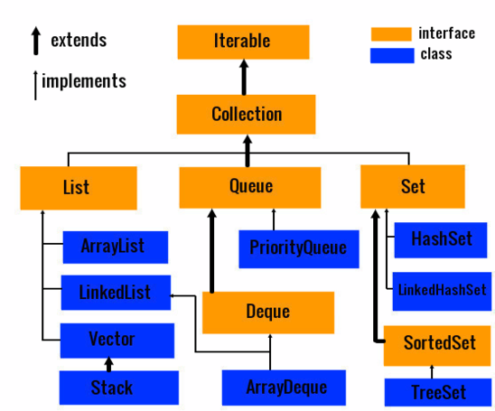

Collection 和 Map 接口并称 Java 集合类中的“二王”。

<!-- more -->

可将 Collection 理解为一个动态的对象数组；与数组不同的是，Collection 集合中的对象内容可以被任意扩充，方便于添加或删除。

特点是性能高，且容易扩展和修改。

<small>* 注意 Collection 和 Collections 的区别。</small>

Collection 不从 Cloneable 和 Serializable 接口继承：
* 如果在所有实现中都授予克隆和序列化，最终反而会导致更少的灵活性和更多的限制。


# 接口方法

基本集合操作：

```java
package java.util;

...  // imports

public interface Collection<E> extends Iterable<E> {

    // 获取集合元素的个数
    int size();

    // 判断集合是否为空
    boolean isEmpty();

    // 判断集合是否包含某元素
    boolean contains(Object o);

    // 获取迭代器，继承自 Iterable 接口
    Iterator<E> iterator();

    // 将集合转换成 Object 数组
    Object[] toArray();

    // 与 toArray() 类似，如果参数 a 数组的长度小于集合的大小，则不填充, 等同于 toArray()
    // 否则填充 a 数组，此时返回的数组与 a 相同
    <T> T[] toArray(T[] a);

    // 添加元素
    // 添加成功返回 true，无变化返回 false
    boolean add(E e);

    // 删除元素
    boolean remove(Object o);

    // 判断集合是否是指定集合的超集
    boolean containsAll(Collection<?> c);

    // 将指定集合添加进本集合
    boolean addAll(Collection<? extends E> c);

    // 将指定集合从本集合中移除
    boolean removeAll(Collection<?> c);

    // 保留指定集合的所有元素, 移除本集合中的其他所有元素
    boolean retainAll(Collection<?> c);

    // 清空集合
    void clear();
}
```

上述的大部分接口方法在抽象类 `AbstractCollection` 中实现，并将基础方法 `size()` 和 `iterator()` 抽象化。

集合比较：

```java
boolean equals(Object o);
int hashCode();
```

在实现的时候需要注意 equals() 和 hashCode() 俩方法的区别，以及关注实现 equals() 的原则。

由于从 Java 8 开始引入了函数式编程，因此 Collection 也实现了 [Stream](/2022/02/07/fp/#进阶应用：Stream) 相关的新接口：

```java
default boolean removeIf(Predicate<? super E> filter) {
    Objects.requireNonNull(filter);
    boolean removed = false;
    final Iterator<E> each = iterator();
    while (each.hasNext()) {
        if (filter.test(each.next())) {
            each.remove();
            removed = true;
        }
    }
    return removed;
}

default Spliterator<E> spliterator() {
    return Spliterators.spliterator(this, 0);
}

default Stream<E> stream() {
    return StreamSupport.stream(spliterator(), false);
}

// 并行计算的 stream
default Stream<E> parallelStream() {
    return StreamSupport.stream(spliterator(), true);
}
```

生成的 Stream 只能单向遍历数据源一次，最终产生一个结果。


# 子类及接口




## AbstractCollection

实现了 Collection 接口的部分核心接口方法，其直接子类：`AbstractList`, `AbstractQueue`, `AbstractSet`。


### 应用：不可修改集合

通过继承 AbstractCollection 来实现一个不可修改集合：实现 `iterator()` 及 `size()`。

Iterator() 接口默认不实现 remove()：

```java
default void remove() {
    throw new UnsupportedOperationException("remove");
}
```


### 应用：可修改集合

实现 iterator(), size(), add() 来满足条件。

AbstractCollection 默认不实现 add()：

```java
public boolean add(E e) {
    throw new UnsupportedOperationException();
}
```


## List 接口

List 描述的是有序集合，允许重复元素。

List 以线性方式存储元素，因此具有“索引”的概念，可使用整数索引随机访问，或者通过 `listIterator()` 获取对象。

List 的默认构造会产生 10 个元素大小的空 List。

基本接口：

```java
package java.util;

import java.util.function.UnaryOperator;

public interface List<E> extends Collection<E> {

    ListIterator<E> listIterator();

    ListIterator<E> listIterator(int index);

    boolean add(E element);

    void addAll(int index, Collection<? extends E> c);

    E remove(Object o);

    E get(int index);

    E set(int index, E element);

    int indexOf(Object o);

    default void sort(Comparator<? super E> c) {
        Object[] a = this.toArray();
        Arrays.sort(a, (Comparator) c);
        ListIterator<E> i = this.listIterator();
        for (Object e : a) {
            i.next();
            i.set((E) e);
        }
    }

    ...
}
```

直接实现类：
* [`ArrayList`](/2021/06/07/arraylist)：可动态增长和缩减的索引序列
* [`LinkedList`](/2021/06/12/linkedlist)：可在任意位置高效增减的有序序列
* `Vector`
* `Stack`


### List <-> Arrays

List 调用 `toArray()` 可转化为 Array。

Array 调用 `Arrays.asList(array)` 可转化为 List。  
但要注意的是，该方法返回的是 Arrays 工具类的一个内部类，相当于一个集合视图：
* 不能对其添加删除，否则抛出 UnsupportedOperationException
* 不能扩容


## Set 接口

Set 不能有重复元素，最多有一个为 null 值的元素。

基本接口：

```java
package java.util;

public interface Set<E> extends Collection<E> {

    boolean add(E e);  // 拒绝添加重复的元素

    boolean equals(Object o);  // 两个 set 包含相同的元素，但顺序不必相同

    int hashCode();  // 保证具有相同元素的 set 将会得到相同的散列码

    ...
}
```

Set 并没有声明 get()，具体如何访问 Set 中的元素，需要实现类去自定义。


### 抽象实现类 `AbstractSet`

为 AbstractCollection 的子类，其对 hashCode() 和 equals() 的实现如下：

```java
int hashCode();
// 遍历集合中所有元素，返回它们的 hashCode 之和
// 因此包含相同元素集的集合 hashCode 值应该相等

boolean equals();
// 先比较两个集合的 size
// 再调用 AbstractCollection 的 containsAll()，比较每个元素的相等性
```


### 子接口 `SortedSet`

* 暴露了用于排序的 Comparator 对象
* 要求实现类必须保证元素有序：或是自然顺序，或是 Comparator 实现的排序方法，且自定义 compare() 可以获得集合的子集视图
* 只为单个元素提供头部或尾部的访问：

```java
E first();
E last();
SortedSet<E> headSet(E toElement);  // 获得子集视图，下同
SortedSet<E> tailSet(E fromElement);
SortedSet<E> subSet(E fromElement, E toElement);
```


### 子接口 `NavigableSet`

顾名思义，“可以导航的” set，是 SortedSet 的子接口，定义了用于在有序集中查找和遍历的接口方法。

```java
E lower(E s);  // 返回 set 中小于给定元素的最大元素
E floor(E e);  // 返回 set 中不大于给定元素的最大元素
E ceiling(E e);  // 返回 set 中不小于给定元素的最小元素
E higher(E e);  // 返回 set 中大于给定元素的最小元素
E pollFirst();  // 获取并删除 set 中第一个（最小）元素
E pollLast();  // 获取并删除 set 中最后一个（最大）元素
```

针对元素排序而声明的方法：

```java
NavigableSet<E> descendingSet();    // 返回由原 NavigableSet 倒序排列的 NavigableSet
Iterator<E> descendingIterator();    // 根据 descendingSet() 的结果调用 iterator()
```


### 通用实现类 TreeSet

`TreeSet` 属于有序集合，使用**红黑树**完成排序，可将元素以任意顺序插入到集合中。  
顾名思义，TreeSet 建立了一棵树，每次添加元素，新元素会被放在正确的排序位置上；因此在遍历的时候，迭代器总以排好序的顺序访问元素，按照**排序后**的顺序输出。
因此 TreeSet 添加速度比散列表慢，但比添加到数组或链表快。

TreeSet 实现了 NavigableSet，在其基础上增加了几个便于定位元素以及反向遍历的方法。  

实现代码概要如下：

```java
private transient NavigableMap<E,Object> m;

public TreeSet() {
    this(new TreeMap<E,Object>());
}

private static final Object PRESENT = new Object();
public boolean add(E e) {  // 以此来实现元素的唯一性
    return m.put(e, PRESENT)==null;
}
```

可以看出，TreeSet 的底层其实是由 TreeMap 实现的；也就是说，TreeSet 的**核心**为使用了 TreeMap 的 Key 及 KeySet 的子类。

TreeSet 的元素保证有序，按照自然顺序或指定 Comparator 排序规则排序。  
TreeSet 的 Comparable 接口实现：如果 a 与 b 相等，调用 a.compareTo(b) 返回 0；如 a 大于 b ，返回值大于 0；否则返回值小于 0。  
还可通过 Comparator 对象传递给 TreeSet 构造器，告诉 TreeSet 使用不同的比较方法：

```java
public interface Comparator<T> {
    int compare(T a, T b);  // 返回值与 compareTo() 一样
}
```

需要比较的时候，可新建一个 Comparator 接口的类，将该类对象传入 TreeSet 构造器中；或使用匿名内部类方法传递。

如果要插入自定义的对象，就必须通过实现 Comparable 接口自定义排列顺序，因为 Object 类中不提供任何 compareTo 接口的默认实现；  
注意数字比较时候的溢出：大正整数减去小负整数；  
覆盖 Comparator<T> 中的 equals()，会使 TreeSet 添加元素的效率更高。

TreeSet 的 descendingSet()，headSet() 等方法与 TreeMap（NavigableMap）中类似名称的方法起着类似作用。


## 其他通用实现类

`HashSet`：没有重复元素的无序集合，继承自 AbstractSet，内部有一个 HashMap 成员变量：

```java
private transient HashMap<E,Object> map;
```

可以看出，HashSet 的底层其实是由 HashMap 实现的；也就是说，HashSet 的**核心**为使用了 HashMap 的 Key 及 KeySet 的子类：

```java
private static final Object PRESENT = new Object();
public boolean add(E e) {  // 以此来实现元素的唯一性（不允许重复值）
    return map.put(e, PRESENT)==null;
}
```

每次往 HashSet 添加元素时，都会将元素作为 key 添加进来，同时新建 Object 对象用于填充内部 HashMap 的 value

HashSet 与 HashMap 的关系，如同 TreeSet 与 TreeMap 的关系。

<br/>

`LinkedHashSet`：HashSet 的子类，可记住元素插入次序的集
* 使用双向链表记录插入顺序，遍历时依照该插入顺序
* 对于同一个元素，其插入顺序不会因多次插入而变化。只有当其被移除后再次插入时，顺序才会改变

`EnumSet`：枚举类型元素集的高效实现
* 底层是位向量（bit vector）
* 枚举类型序列有限：EnumSet 使用位序列实现；如对应值在 EnumSet 中，则相应的位被置为 1
* 使用静态工厂法构造该集

```java
enum WeekDay {MONDAY, TUESDAY, WEDNESDAY, THURSDAY, FRIDAY, SATURDAY, SUNDAY}
EnumSet<WeekDay> workday = EnumSet.range(WeekDay.MONDAY, WeekDay.FRIDAY);
EnumSet<WeekDay> never = EnumSet.noneOf(WeekDay.Class); 
```


## Queue 接口

从尾部添加元素，从头部删除元素（FILO / LIFO）。

```java
package java.util;

public interface Queue<E> extends Collection<E> {

    // 往队列尾添加元素, 成功返回 true，否则抛出异常
    boolean add(E e);

    // 往队列尾添加元素，成功返回 true，否则返回 false 或抛出异常
    boolean offer(E e);

    // 移除队列头元素，并返回该元素，如果为空则抛出异常
    E remove();

    // 移除队列头元素，并返回该元素，如果为空则返回 null
    E poll();

    // 返回队列头元素，如果为空则抛出异常
    E element();

    // 返回队列头元素，如果为空则返回 null
    E peek();
}
```

实现类：`PriorityQueue`，优先队列，允许高效删除最小/大元素。

* 使用堆（heap）实现，将最小元素移动到根节点；
* 因此无论何时调用 remove()，总会获得当前优先队列中的最小元素；
* 元素按照任意顺序插入，按照排好序的顺序检索

优先队列既可保存实现了 Comparable 接口的类对象，也可以保存在构造器中提供比较器的对象。  
典型的使用示例是任务调度：每启动一个新的任务，都将优先级最高的任务从队列中删除。


## Deque 接口

发音 `/‘dek/`, short for 'double end queue'.

继承自 Queue 接口；与 Queue 不同的是，Deque 可在**头部或尾部同时**添加或删除元素，即允许在队列两边入队（offer）及出队（poll）。
* 实现类是 FIFO 队列时，元素被插在 Deque 尾部，头部元素先被删除
* 不支持在队列中间添加元素
* 实现类既可以是栈，也可以是队列
* 与 List 接口不同，Deque 不提供对元素的索引访问

实现类主要有两个，它们都同时暴露 Deque 的 FIFO 和 LIFO 方法。

* [`LinkedList`](/2021/06/12/linkedlist)
* `ArrayDeque`：用循环数组实现的双端序列

实现：Deque 队列与 Deque 栈

```java
public class MyQueue <T>{
    private Deque<T> elements;

    public MyQueue(){
        elements = new ArrayDeque<>();
    }

    /**
     * 添加至队尾
     * @param e
     */
    public void enqueue(T e) {
        elements.addLast(e);;
    }

    /**
     * 队头元素先出队列
     * @return
     */
    public T dequeue() {
        try {
            return elements.removeFirst();
        } catch (NoSuchElementException e) {
            return null;
        }
    }

    public T peek() {
        return elements.peekFirst();
    }
}

public class MyStack <T>{
    private Deque<T> elements;

    public MyStack() {
        elements = new ArrayDeque<>();
    }

    /**
     * 添加至头部
     * @param e
     */
    public void push(T e) {
        elements.addFirst(e);
    }

    /**
     * 头部元素先出栈
     * @return
     */
    public T pop() {
        try {
            return elements.removeFirst();
        } catch (NoSuchElementException e) {
            return null;
        }
    }

    public void peek() {
        elements.peekFirst();
    }
}

public class Test {

    public static void main(String[] args) {
        MyQueue<Integer> myQueue = new MyQueue<>();
        myQueue.enqueue(1);
        myQueue.enqueue(2);
        myQueue.enqueue(3);

        Integer e;
        while((e = myQueue.dequeue()) != null) {
            System.out.println(e);
        }
        // output 1 2 3

        MyStack<Integer> myStack = new MyStack<>();
        myStack.push(1);
        myStack.push(2);
        myStack.push(3);
        while((e = myStack.pop()) != null) {
            System.out.println(e);
        }
        // output 3 2 1
    }
}
```

想要实现一个纯粹的队列或栈，还需亲自动手封装。

## 对比

Queue 接口中声明的方法在 Deque 作为队列时相应的方法：

| Queue     | Deque         |
| --------  | ------------  |
| add(e)    | addLast(e)    |
| offer(e)  | offerLast(e)  |
| remove()  | removeFirst() |
| poll()    | pollFirst()   |
| element() | getFirst()    |
| peek()    | peekFirst()   |

Deque 的实现类也可作为 LIFO 的栈使用，即元素被插在 Deque 头部，头部元素最先被删除：

| Stack   | Deque         |
| ------  | -----------   |
| push(e) | addFirst(e)   |
| pop()   | removeFirst() |
| peek()  | peekFirst()   |

无论 Deque 作为队列还是栈使用，peek() 都返回头部元素。

虽然 Deque 允许插入 null 元素，但其实现类不应该允许，因为有时 null 是某些方法的**特殊返回值**。
