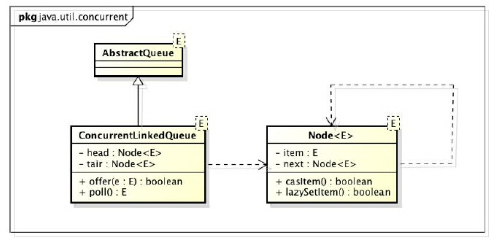
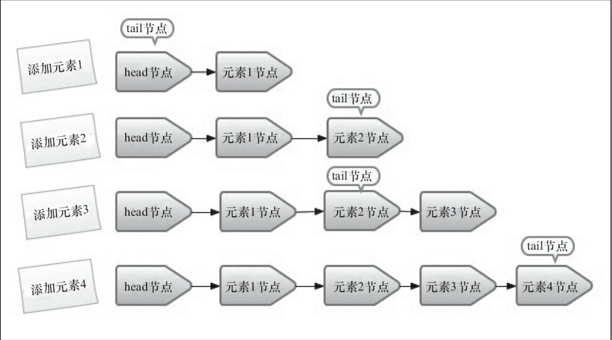
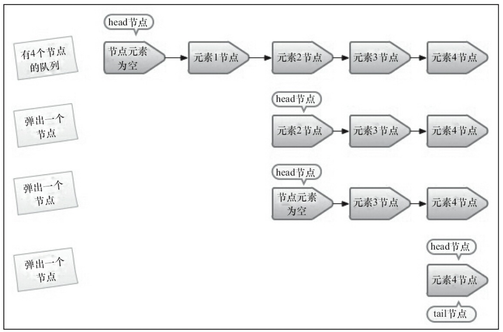
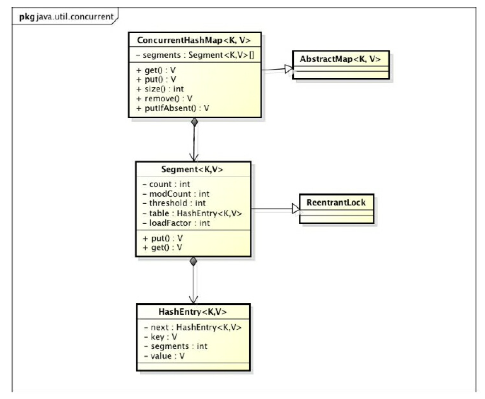
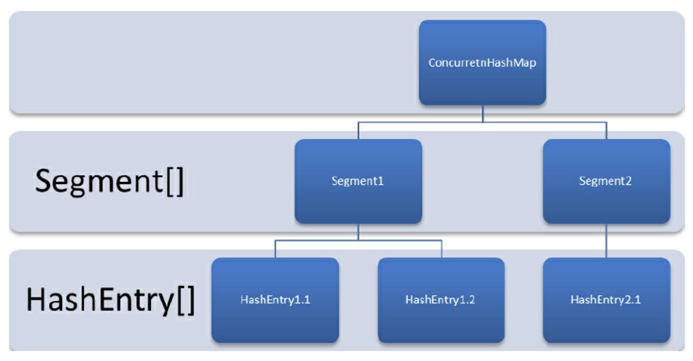

线程安全集合类是 Java 除了并发工具类和多线程执行器之外，另外一种成熟的并发编程解决方案。

<!-- more -->

在还没有推出线程安全集合的早期，开发任务使用 `Collections` 工具类中的**同步包装器**来实现线程安全的集合操作：

```java
static <E> Collection<E> synchronizedCollection(Collection<E> c)
static <E> List synchronizedList(List<E> l)    // 所有方法都带同步锁
static <E> Set synchronizedSet(Set<E> s)
static <E> SortedSet synchronizedSortedSet(SortedSet<E> s)
static <K, V> Map<K, V> synchronizedMap(Map<K, V> m)
static <K, V> SortedMap<K, V> synchronizedSortedMap(SortedMap<K, V> s)
```

Java 在后来的 JDK 中推出了两个线程安全的集合类：
```java
Hashtable
Vector
```

至今，在 JCF 中的同步接口包括：
```java
BlockingDeque
BlockingQueue
ConcurrentMap
ConcurrentNavigableMap
TransferQueue
```

以上都是能够避免 `ConcurrentModificationException` 的类和方法。

我们先从阻塞队列开始说起。

<br/>

# 阻塞队列

阻塞队列使用一个锁（入队和出队使用同一个锁）或两个锁（入队和出队分别使用不同的锁）实现数据的同步操作。

阻塞插入：当队列满的时候，队列会阻塞插入元素的线程，直到队列有空缺为止；  
阻塞移除：当队列为空的时候，获取元素的线程会等待至队列非空为止。

生产者 / 消费者模型中用得比较多。

| 方法 / 特殊情况处理方式  | 抛出异常    | 返回特殊值   | 超时退出               | 一直阻塞  |
| -------------------- | ---------- | ---------- | --------------        | -------- |
| 插入方法              | add(e)     | <font color="red">o</font>ffer(e)  | <font color="red">o</font>ffer(e, time, unit)  | pu<font color="blue">t</font>(e)   |
| 移除方法              | remove()   | p<font color="red">o</font>ll()    | p<font color="red">o</font>ll(time, unit)      | <font color="blue">t</font>ake()   |
| 检查方法              | element()  | peek()      | -         | -        |

<br/>

| 方法 | 正常动作 | 特殊情况动作 |
| --  | -----   | ---------- |
| add     | 添加元素（添加 null 值非法）  | 队列满时抛出 `IllegalStateException("Queue full")` |
| offer   | 添加元素并返回 true  | 队列满时返回 false      |
| put     | 添加元素            | 队列满时**阻塞**        |
| remove  | 移除并返回队列头元素  | 队列空时抛出 `NoSuchElementException`       |
| poll    | 移除并返回队列头元素  | 队列空时返回 null       |
| take    | 移除并返回队列头元素  | 队列空时**阻塞**        |
| element | 返回队列头元素       | 队列空时抛出 `NoSuchElementException`       |
| peek    | 返回队列头元素       | 队列空时返回 null       |

注意：使用无界队列时，put() 永远不会阻塞，offer() 永远返回 true。

<br/>

阻塞队列使用**通知模式**实现：
1. 生产者往满队列添加元素时，生产者会被阻塞；
2. 消费者将满队列中的一个元素消费掉之后，通知生产者当前队列可用。


在 JCF 中，阻塞队列对应着 `BlockingQueue`、`BlockingDeque` 和 `TransferQueue` 接口。

```java
import java.util.concurrent.BlockingQueue;


BlockingQueue<E>  // 阻塞队列


void put(E element)  // 添加元素，在必要时阻塞

boolean offer(E element, long time, TimeUnit unit)
// 添加给定元素，成功则返回 true，队列满时返回 false
// 必要时阻塞，直至元素已经被添加，或添加操作超时

E poll(long time, TimeUnit unit)
// 移除并返回队列头元素
// 必要时阻塞，直至元素可用，或移除操作超时
// 失败时返回 null

E take()  // 移除并返回头元素，必要时阻塞
```


```java
import java.util.concurrent.BlockingDeque;


BlockingDeque<E>  // 双向阻塞队列


void putFirst(E element)
void putLast(E element)
// 添加元素，必要时阻塞

boolean offerFirst(E element, long time, TimeUnit unit)
boolean offerLast(E element, long time, TimeUnit unit)
// 添加给定元素，成功时返回 true，队列满时返回 false
// 必要时阻塞，直至元素被添加，或添加操作超时

E pollFirst(long time, TimeUnit unit)
E pollLast(long time, TimeUnit unit)
// 移除并返回头元素或尾元素
// 必要时阻塞，直至元素可用，或移除操作超时
// 失败时返回 null

E takeFirst()  // 移除并返回头元素，必要时阻塞
E takeLast()  // 移除并返回尾元素，必要时阻塞
```

```java
import java.util.concurrent.TransferQueue;


TransferQueue<E>

/**
 * 传输一个值，或尝试在给定时间内传输这个值
 * 阻塞至另一线程将元素删除
 */
void transfer(E element)

/**
 * 尝试在给定时间内传输这个值
 * 阻塞至另一线程将元素删除
 * 调用成功时返回 true
 */
boolean tryTransfer(E element, long time, TimeUnit unit)
```


## 实现类

`ArrayBlockingQueue`：由数组结构组成的有界阻塞队列

```java
package java.util.concurrent;

class ArrayBlockingQueue {

    Condition notEmpty;
    Condition notFull;

    ArrayBlockingQueue<E>(int capacity)  {  // 默认情况下不保证线程的公平（先阻塞的线程不一定先获得机会访问队列）
        this(capacity, false);
    }

    // 构造一个带有指定的容量和公平性设置的阻塞队列
    // 使用循环数组实现
    ArrayBlockingQueue<E>(int capacity, boolean fair) {
        if (capacity <= 0)
            throw new IllegalArgumentException();
        this.items = new Object[capacity];
        lock = new ReentrantLock(fair);
        notEmpty = lock.newCondition();
        notFull = lock.newCondition();
    }

    ...

    // 以下以 ArrayBlockingQueue 为例，说明一下阻塞队列“通知模式”的实现：

    public void put(E e) throws InterruptedException {
        checkNotNull(e);
        final ReentrantLock lock = this.lock;
        lock.lockInterruptibly();
        try {
            while (count == items.length)
                notFull.await();
            insert(e);
        } finally {
            lock.unlock();
        }
    }
    // 不能通过此方法判断入队是否成功

    ...
}

```


`LinkedBlockingQueue`：由链表结构组成的有界阻塞队列

`LinkedBlockingDeque`：由链表结构组成的双向阻塞队列

```java
import java.util.concurrent.LinkedBlockingQueue;
import java.util.concurrent.LinkedBlockingDeque;


/**
 * 构造一个无上限的阻塞队列或双向队列
 * 采用锁来保持同步
 * 链表实现
 */
LinkedBlockingQueue<E>()
LinkedBlockingDeque<E>()

/**
 * 构造有限的阻塞队列或双向队列
 * 链表实现
 */
LinkedBlockingQueue<E>(int capacity)
LinkedBlockingDeque<E>(int capacity)

// 使用时最好设定初始容量，防止过度膨胀
```


`PriorityBlockingQueue`：⽀持优先级排序的⽆界阻塞队列

```java
import java.util.concurrent.PriorityBlockingQueue;


/**
 * 构造一个无边界阻塞优先队列，同优先级的元素不能保证顺序
 * 使用堆（priority heap）实现
 * 默认采用自然顺序的升序排列
 * 
 * initialCapacity 初始值为 11
 * comparator 为用来对元素进行比较的比较器，如未指定则元素应实现 Comparable 接口
 */
PriorityBlockingQueue<E>()
PriorityBlockingQueue<E>(int initialCapacity)
PriorityBlockingQueue<E>(int initialCapacity, Comparator<? super E> comparator)
```


`DelayQueue`：使⽤优先级队列实现的⽆界阻塞队列，支持延时获取元素

```java
import java.util.concurrent.DelayQueue;
import java.util.concurrent.Delayed;


DelayQueue<E extends Delayed>

/**
 * 构造一个包含 Delayed 元素的无界的、阻塞时间有限的阻塞队列
 * 使用堆（priority heap）实现
 * 基于时间调度的序列，只有延迟超过时间的元素才可从队列中移出
 */
DelayQueue()


interface Delayed {}  // 队列元素必须实现 Delayed 接口

// 得到该对象的延迟
// 用给定时间单位度量
long getDelay(TimeUnit unit)
```

应用场景：
* 缓存系统的设计：保存需要缓存的元素的有效期，使用线程循环地去查询队列；一旦获取到了元素，说明元素到期；
* 定时任务调度：保存需要执行的任务和执行时间点，一旦获取到了元素，说明当前时间点开始执行获取到的任务。


`LinkedTransferQueue`：由链表结构实现的 TransferQueue，⽆界阻塞队列

```java
package java.util.concurrent;

class LinkedTransferQueue {

    ...

    // 如果没有消费者在等待，返回 false
    public boolean tryTransfer(E e) {
        return xfer(e, true, NOW, 0) == null;
    }

    /**
     * Transfer the element to a consumer, waiting if necessary to do so.
     *
     * Transfers the specified element immediately if there exists a consumer already waiting to receive it (in take or timed poll), ...
     */
    // 如果没有消费者在等待，则将元素存放在队列尾节点，直到元素被消费后才返回
    public void transfer(E e) throws InterruptedException {
        if (xfer(e, true, SYNC, 0) != null) {
            Thread.interrupted();
            throw new InterruptedException();
        }
    }

    ...
}
```


`SynchronousQueue`：**不存储元素**的阻塞队列，简单实现了阻塞机制
* 每一个 `put()` 操作都要等一个 `take()` 操作，否则便不能继续添加元素；
* 生产者可通过其直接将资源传递给消费者，中间不做任何保存；
* 非常适合传递性的场景

```java
package java.util.concurrent;

class SynchronousQueue {
    ...

    private transient volatile Transferer transferer;

    public SynchronousQueue() {
        this(false);
    }

    public SynchronousQueue(boolean fair) {
        transferer = fair ? new TransferQueue() : new TransferStack();
    }

    ...
}
```


## 应用

生产者线程向队列插入元素，消费者线程从队列取出元素
* worker（工作者）线程周期性地将中间结果存储到阻塞队列
* 其他 worker 线程移除中间结果作进一步修改
* 阻塞队列会自动做负载均衡
    * 搜索或移除元素时，会等待队列变为非空
    * 添加元素时，会等待队列有可用空间
* 会创建专门的线程去访问各对象，而不是各种有可能的工作线程

<br/>

# 线程安全集合

JDK `concurrent` 包下还有许多线程安全的集合类，使用起来跟普通的名字对应的集合类几乎没有区别。

它们的使用特点是：size 操作不必在常量时间内操作
* 确定集合的当前大小需要遍历
* 集合返回弱一致性（weak consistent）的迭代器，因此不一定反映出构造后所有的修改
* 不会抛出 ConcurrentModificationException


## ConcurrentLinkedQueue

跟阻塞队列不同的是，`ConcurrentLinkedQueue` 采用**自旋 CAS** 的方式实现线程安全操作。




### 入队操作



上图为新创建的队列每添加一个节点时所留的快照。

新入队的元素永远都是被添加到队列的尾部，成为队列的尾节点；需要注意的是，**tail 节点不总是尾节点**。
* 如 tail 节点的 next 不为空，有新元素入队后，tail 节点会指向新元素（tail 成为尾节点）；
* 如 tail 节点的 next 为空，新元素入队后，tail 节点的 next 会指向新元素（tail 的 next 成为尾节点）；
* 因为队列刚刚创建的时候 head = tail，第一个元素添加进去后，head 和 tail 的 next 节点都会指向第一个元素。

以上为单线程操作时的基本情况；如果是多线程操作的话，情况会更加复杂，因为会存在多个线程插队的情况。


### 出队操作



上图为队列每移除一个元素时所留的快照。

与入队方法类似的是，并不是每次出队的时候都更新 head 节点：当 head 节点有元素值时，直接弹出元素，不更新 head 节点；head 节点没有元素时才更新 head 节点。

<br/>

下面基于 Java 7 的实现来看看 ConcurrentLinkedQueue 的关键代码：

```java
package java.util.concurrent;


/**
 * 构造一个可被多线程安全访问的无边界非阻塞的队列
 * 
 * 非阻塞的 FIFO 并发队列
 * 采用 CAS 操作保证同步
 * 底层采用链表实现
 */
public class ConcurrentLinkedQueue {

    private static class Node<E> {
        volatile E item;
        volatile Node<E> next;  // volatile 保证数据可见性

        Node(E item) {
            UNSAFE.putObject(this, itemOffset, item);
        }

        boolean casItem(E cmp, E val) {  // 更改 Node 中的数据域 item
            return UNSAFE.compareAndSwapObject(this, itemOffset, cmp, val);  // 期望值是 cmp，设置为 val
        }

        void lazySetNext(Node<E> val) {  // 惰性设置 next 的值，不一定会成功
            UNSAFE.putOrderedObject(this, nextOffset, val);
        }

        boolean casNext(Node<E> cmp, Node<E> val) {  // 更改 Node 中的指针域 next
            return UNSAFE.compareAndSwapObject(this, nextOffset, cmp, val);  // 期望值是 cmp，设置为 val
        }

        private static final sun.misc.Unsafe UNSAFE;
        ...
    }

    ...

    private transient volatile Node<E> head;
    private transient volatile Node<E> tail;

    public ConcurrentLinkedQueue() {
        head = tail = new Node<E>(null);  // head 和 tail 指向同一个节点，item 和 next 都为 null
    }

    ...

    final void updateHead(Node<E> h, Node<E> p) {
        if (h != p && casHead(h, p))
            h.lazySetNext(h);  // 将自己的 next 节点设置为 head 节点
    }

    final Node<E> succ(Node<E> p) {
        Node<E> next = p.next;
        // 如果 p 的 next 链接到自身，说明 p 已经被出队了
        // 出队了咋办？那就回到 head 重新开始遍历
        // 否则就直接返回 next
        return (p == next) ? head : next;
    }

    private static final int HOPS = 1;

    // 入队操作
    public boolean offer(E e) {
        if (e == null) throw new NullPointerException();
        final Node<E> n = new Node<E>(e);  // 创建入队的节点

        // 尝试获得尾节点，再入队
        retry:  // 入队不成功会重复尝试
        for(;;) {  // 死循环
            Node<E> t = tail;
            Node<E> p = t;  // 定义 p 表示队列尾节点，默认指向 tail 节点
            for (int hops = 0; ; hops++) {
                Node<E> next = succ(p);  // 获取 p 的下一个（next）节点
                if (next != null) {  // p 存在 next 节点：说明 p 不是尾节点，需要更新 p
                    /* 更新 p 之前：*/
                    if (hops > HOPS &&  // 循环到第二次了（tail 的 next 不为空，next 的 next 也不为空）
                        t != tail)  // 且：tail 被修改了（其他线程得逞了）
                        continue retry;  // tail 被修改了，就要重新开始迭代，更新 p 节点

                    p = next;  // 重新设置 p 节点为其 next 节点
                }
                // p 是尾节点
                else if (p.casNext(null, n)) {  // 尝试将 n 入队：CAS 设置尾节点 next 域从 null 到指向 n
                    if (hops >= HOPS)  // 第二次：tail 至少滞后尾节点两个了（tail 的 next 和 next 的 next 都不为空）
                        casTail(t, n);  // 设置已入队的 n 为 tail 节点，此时 tail 节点就是尾节点了
                        // 更新失败了也没关系：失败了意味着有别的节点更新了 tail
                    return true;  // 返回入队成功
                }
                // CAS 设置失败，说明 p 的 next 域不是 null 了（中途被某个线程设置得逞了）
                else {
                    p = succ(p);  // 重新设置 p 节点为其 next 节点
                }
            }
        }
    }

    // 出队操作
    public E poll() {
        Node<E> h = head;
        Node<E> p = h;  // 定义 p 表示队列头节点，默认指向 head 节点
        for (int hops = 0; ; hops++) {
            E item = p.item;  // 获取 p 节点（头节点）元素
            if (item != null && p.casItem(item, null)) {
            // 头节点元素不为空，且 CAS 清空 p 的元素成功：
                if (hops >= HOPS) {  // 第二次：从“next 不为空”而来
                // head 至少滞后头节点两个了
                    Node<E> q = p.next;
                    updateHead(h, (q != null) ? q:p);  // 更新头节点
                }
                return item;  // 返回元素值
            }
            // 头节点 p 的元素为空，或者 CAS 操作失败（头节点元素不是预期的值：头节点被改变了）
            Node<E> next = succ(p);  // 获取 p 的下一个节点 next
            // next 为空：队列已经空了
            if (next == null) {
                updateHead(h, p);  // 更新头节点
                break;  // 跳出循环，返回 null
            }
            // next 不为空：头节点指向 next，继续循环
            p = next;
        }
        return null;
    }

    ...
}
```

注：
* `offer()` 主要做了两件事，一是找到尾节点，二是 CAS 设置新的尾节点，失败了就不断重试；
* 尾节点可能是 tail 节点，也可能是 tail 的 next 节点；
* 与之相类似：头节点可能是 head 节点，也可能是 head 的 next 节点；
* `HOPS` 的阈值判断对应的是上文提到的“**tail 节点不总是尾节点 / head 节点不总是头节点**”的实现。

为啥非得要用 `HOPS` 去判断是否应该更新尾节点和设置 tail 节点？像下面这样写得简单点不好吗：
```java
public boolean offer(E e) {
    if (e == null) throw new NullPointerException();
    Node<E> n = new Node<E>(e);
    for(;;) {
        Node<E> t = tail;
        if (t.casNext(null, n) && casTail(t, n)) {
            return true;
        }
    }
}
```
像上面这样子写的话，循环里面的每一次操作无论成功与否，都需要执行 CAS 操作，会给系统带来极大的开销，没有太大必要，还影响了 ConcurrentLinkedQueue 的执行效率。  
所以 Doug Lea 使用 HOPS 变量来控制 tail 节点的更新频率，不需要在每一次的节点入队都需要更新 tail 节点。

tail 节点距离尾节点越长，每次 offer 入队 CAS 操作更新 tail 节点的次数越少，但定位尾节点所需的时间就越长。  
但是还是划得来的，因为可以通过增加 volatile 变量的读操作来减少写操作。

Java 8 的实现与 Java 7 的实现相差不是很大。

<br/>

## ConcurrentHashMap

`ConcurrentHashMap` 不仅是 `HashMap` 的线程安全实现，而且更高效。因为：

在多线程环境下使用 HashMap，因其不是线程安全的类，容易发生死循环：HashMap 扩容的时候会 rehash，内部类 Entry 列表会形成环形的数据结构，next 节点就一直不为空了。

如果线程安全的旧集合 Hashtable：Hashtable 的同步（`synchronized`）都是方法级别的，加锁的时候整个对象都被锁住了，竞争激烈的时候效率低下。

```java
package java.util.concurrent;


public class ConcurrentHashMap<K,V> extends AbstractMap<K,V> implements ConcurrentMap<K,V>, Serializable {

    ...

    public ConcurrentHashMap<K,V>(int initialCapacity, float loadFactor, int concurrencyLevel) { ... }

    public ConcurrentHashMap<K,V>(int initialCapacity, float loadFactor) { ... }

    public ConcurrentHashMap<K,V>(int initialCapacity) { ... }

    public ConcurrentHashMap<K,V>() { ... }

    ...

    // 除了跟 HashMap 同名的方法之外，还有：

    V putIfAbsent(K key, V value)
    // 如该键不在映射表中，则将给定键值对关联，并返回 null
    // 否则返回与该键关联的现有值


    boolean remove(K key, V value)
    // 如给定的键与给定值关联，删除给定键值对并返回 true
    // 否则返回 false


    boolean replace(K key, V oldValue, V newValue)
    // 如给定键当前与 oldValue 相关联，则将 newValue 与键相关联
    // 否则返回 false

    ...
}
```


### Java 7 & before 的实现

**分段锁**实现并发更新，提升访问效率。其底层采用了**数组** + **链表**的实现方式。

核心的静态类如下：



* `Segment`：继承 ReentrantLock 充当锁的角色，每个 Segment 对象通过数组维护一个键值对的链表；
    * 一个 Segment 的结构和一个 HashMap 是差不多的
* `HashEntry`：键值对，map 的基本存储单元。
    * 要对 HashEntry 进行修改的话，需要先获取管理它的 Segment 的同步状态

每个 ConcurrentHashMap 对象维护一个 Segment 数组，每个 Segment 对象扩展一个可重入锁，分别只锁对应散列值的数据，一定程度上提高了并发效率。  
基本层级如下：



相关代码：

```java
package java.util.concurrent;


public class ConcurrentHashMap<K,V> extends AbstractMap<K,V> implements ConcurrentMap<K,V>, Serializable {

    ...

    static final int DEFAULT_INITIAL_CAPACITY = 16;

    static final float DEFAULT_LOAD_FACTOR = 0.75f;

    static final int DEFAULT_CONCURRENCY_LEVEL = 16;

    ...

    static final class HashEntry<K,V> {
        ...
        volatile V value;
        volatile HashEntry<K,V> next;

        ...
    }

    ...

    static final class Segment<K,V> extends ReentrantLock implements Serializable {
        ...

        transient volatile HashEntry<K,V>[] table;

        ...
    }

    ...

    /**
     * 构造一个可被多线程安全访问的散列映射表
     * 基于 Hashtable 及 ConcurrentMap 的高性能同步实现，支持 Hashtable 所有旧方法
     *
     * initialCapacity 默认为 16
     * loadFactor：如每个桶平均负载超过该因子，表大小会被重新调整（默认为 0.75）
     * concurrencyLevel：并行度，并发写线程的估计数目，简单点理解就是有多少把锁；默认 16
     */
    public ConcurrentHashMap<K,V>(int initialCapacity, float loadFactor, int concurrencyLevel) {
        if (!(loadFactor > 0) || initialCapacity < 0 || concurrencyLevel <= 0)
            throw new IllegalArgumentException();
        if (concurrencyLevel > MAX_SEGMENTS)
            concurrentLevel = MAX_SEGMENTS;  // 修正，防止溢出

        // Find power-of-two sizes best matching arguments
        // 要保证 segments 数组长度是 2 的 N 次方：为了能通过按位与的散列算法来定位 segments 数组的索引（HashMap 基础）
        int sshift = 0;
        int ssize = 1;  // segments 数组长度
        while (ssize < concurrencyLevel) {  // segments 数组大小不小于并行度
            ++sshift;
            ssize <<= 1;  // 左移，即乘以 2
        }

        /* 以上两个参数用来定位某个键值对对应的 segment 的位置 */
        // 因为 concurrencyLevel 默认是 16:
        this.segmentShift = 32 - sshift; // sshift 默认是 4，因此段偏移量默认是 28
        this.segmentMask = ssize - 1;  // 段掩码，默认 16 - 1 = 15

        if (initialCapacity > MAXIMUM_CAPACITY)
            initialCapacity = MAXIMUM_CAPACITY;  // 修正，防止溢出
        int c = initialCapacity / ssize;  // 计算 segment 元素内数组的容量阈值
        if (c * ssize < initialCapacity)
            ++c;
        int cap = MIN_SEGMENT_TABLE_CAPACITY;  // segment 元素内部数组的初始化容量，默认为 2
        while (cap < c)
            cap <<= 1;  // 保证 segment 内部数组的长度也是 2 的 N 次方
        // 初始化 segments 首元素
        Segment<K,V>[] s0 =
            new Segment<K,V>(loadFactor, (int)(cap * loadFactor),  // 内部阈值
                             (HashEntry<K,V>[])new HashEntry[cap]);
        // 初始化 segments 数组
        Segment<K,V>[] ss = (Segment<K,V>[])new Segment[ssize];
        UNSAFE.putOrderedObject(ss, SBASE, s0);  // ordered write of segment[0] 将首元素 s0 设置到 ss 中
        this.segments = ss;
    }

    public ConcurrentHashMap<K,V>(int initialCapacity, float loadFactor) {
        this(initialCapacity, loadFactor, DEFAULT_CONCURRENCY_LEVEL);
    }

    public ConcurrentHashMap<K,V>(int initialCapacity) {
        this(initialCapacity, DEFAULT_LOAD_FACTOR, DEFAULT_CONCURRENCY_LEVEL);
    }

    public ConcurrentHashMap<K,V>() {
        this(DEFAULT_INITIAL_CAPACITY, DEFAULT_LOAD_FACTOR, DEFAULT_CONCURRENCY_LEVEL);
    }

    ...

    public int size() {
        ...
        // 先尝试两次不对 segment 加锁来统计 count，如果统计过程中修改次数发生变化，再加锁；如果没有改变，则返回 size。
        try {
            for (;;) {
                if (retries++ == RETRIES_BEFORE_LOCK) {
                    for (int j = 0; j < segments.length; ++j)
                        ensureSegment(j).lock();  // force creation 两次尝试失败了，加锁
                }
                sum = 0L;
                size = 0;
                overflow = false;
                for (int j = 0; j < segments.length; ++j) {
                    Segment<K,V> seg = segmentAt(segments, j);
                    if (seg != null) {
                        sum += seg.modCount;  // 记录修改次数
                        int c = seg.count;
                        if (c < 0 || (size += c) < 0)
                            overflow = true;
                    }
                }
                if (sum == last)  // 尝试成功（通过判断两次的总修改次数没有变化），或者：加锁之后肯定满足条件
                    break;
                last = sum;
            }
        } finally {
            if (retries > RETRIES_BEFORE_LOCK) {
                for (int j = 0; j < segments.length; ++j)
                    segmentAt(segments, j).unlock();
            }
        }
        return overflow ? Integer.MAX_VALUE : size;
    }

    // 读取 volatile 变量，不需要加锁
    // （使用 volatile 替换锁的经典场景）
    public V get(Object key) {
        Segment<K,V> s; // manually integrate access methods to reduce overhead
        HashEntry<K,V>[] tab;
        int h = hash(key);  // 再散列
        long u = (((h >>> segmentShift) & segmentMask) << SSHIFT) + SBASE;  // 定位到 segment：跟 segmentForHash() 是一样的
        if ((s = (Segment<K,V>)UNSAFE.getObjectVolatile(segments, u)) != null &&
            (tab = s.table) != null) {
            for (HashEntry<K,V> e = (HashEntry<K,V>) UNSAFE.getObjectVolatile
                     (tab, ((long)(((tab.length - 1) & h)) << TSHIFT) + TBASE);  // 根据散列值从 segment 中定位到元素
                 e != null; e = e.next) {
                K k;
                if ((k = e.key) == key || (e.hash == h && key.equals(k)))
                    return e.value;
            }
        }
        return null;
    }

    // put 方法需要加锁，发生扩容的时候，只对当前的 segment 扩容

    ...

    // 定位 segment 的方法：

    private int hash(Object k) {
        ...  // 计算哈希值，并且进行再散列（使用 Wang/Jenkins hash 变种算法）
        // 为的是减少散列冲突，让 HashEntry 元素尽可能均匀地分布于不同的 Segment 之间，从而提高存储效率。 
    }

    ...

    private Segment<K,V> segmentForHash(int h) {
        long u = (((h >>> segmentShift) & segmentMask) << SSHIFT) + SBASE;  // 根据高四位值确定 segment 的位置
        return (Segment<K,V>) UNSAFE.getObjectVolatile(segments, u);
    }

    ...
}
```


### Since Java 8 的实现

放弃了分段锁，改用 Node + CAS + synchronized 保证并发安全。
* 取消了 Segment，直接用原 Segment 类中的 table **数组**存储键值对。
* 同一个桶中的 Node（键值对）的组织形式会经历从**链表**到**红黑树**的转变：
    * 当 HashEntry 对象组成的链表长度超过 TREEIFY_THRESHOLD 时：链表转换为红黑树


<br/>

### 问题：短时间内插入大量数据至 ConcurrentHashMap

首先我们要明确，插入数据的性能损耗点，在于**扩容操作**和**锁的争夺**。

第一，通过配置合理的容量大小和扩容因子，尽可能减少扩容的发生；  
第二，通过 ConcurrentHashMap 的 spread() 进行预处理，将存在 hash 冲突的数据放到一个组中，每个组使用单线程进行 put 操作，从而保证锁停留在偏向锁级别，不会升级。

<br/>

## ConcurrentSkipListMap

```java
import java.util.concurrent.ConcurrentSkipListMap;


/**
 * 构造一个可被多线程安全访问的有序映射表
 * TreeMap 的同步实现，实现了 ConcurrentNavigableMap 接口
 * 第一个构造器要求键实现 Comparable 接口
 */
ConcurrentSkipListMap<K, V>()
ConcurrentSkipListMap<K, V>(Comparator<? super K> comp)


// 相关的集合操作方法和 ConcurrentHashMap 是一样的
```

<br/>

## 其它线程安全集合

`ConcurrentSkipListSet`
* 线程安全的有序集合
* 可以视为 `TreeSet` 的同步实现，实现了 NavigableSet 接口

```java
import java.util.concurrent.ConcurrentSkipListSet;


ConcurrentSkipListSet<E>()
ConcurrentSkipListSet<E>(Comparator<? super E> comp)
// 构造一个可被多线程安全访问的有序集
// 第一个构造器要求元素实现 Comparable 接口
```

`CopyOnWriteArrayList`

先说一下概念：**CopyOnWrite**, COW，复制再写入
* 在添加元素的时候，先将原集合列表复制一份，再添加新的元素
* 只适合**读多写少**的情况

该集合类参考了延时懒惰策略和读写分离的思想
* 在读取时，多线程正常读取内容
* 写内容时，将当前对象进行复制，往**新的对象进行修改**，完成后再将引用指向新的对象
* 将读写分离，属于读写锁的实现（读同步，写互斥）

```java
// 添加元素时，先加锁，再进行复制替换操作，最后释放锁
public boolean add(E e) {
    ReentrantLock lock = this.lock;
    lock.lock();

    boolean added;
    try {
        Object[] elements = this.getArray();
        int len = elements.length;
        Object[] newElements = Arrays.copyOf(elements, len + 1);
        newElements[len] = e;
        this.setArray(newElements);
        added = true;
    } finally {
       lock.unlock();
    }

    return added;
}


private E get(Object[] a, int index) {
    return a[index];
}

public E get(int index) {
    return this.get(this.getArray(), index);
}
```

类似的实现：`CopyOnWriteArraySet`
```java
// 添加元素：调用 CopyOnWriteArrayList 的 addIfAbsent()
public boolean addIfAbsent(E e) {
    Object[] snapshot = this.getArray();
    return indexOf(e,snapshot, 0, snapshot.length) >= 0 ? false : this.addIfAbsent(e,snapshot);
}
```
