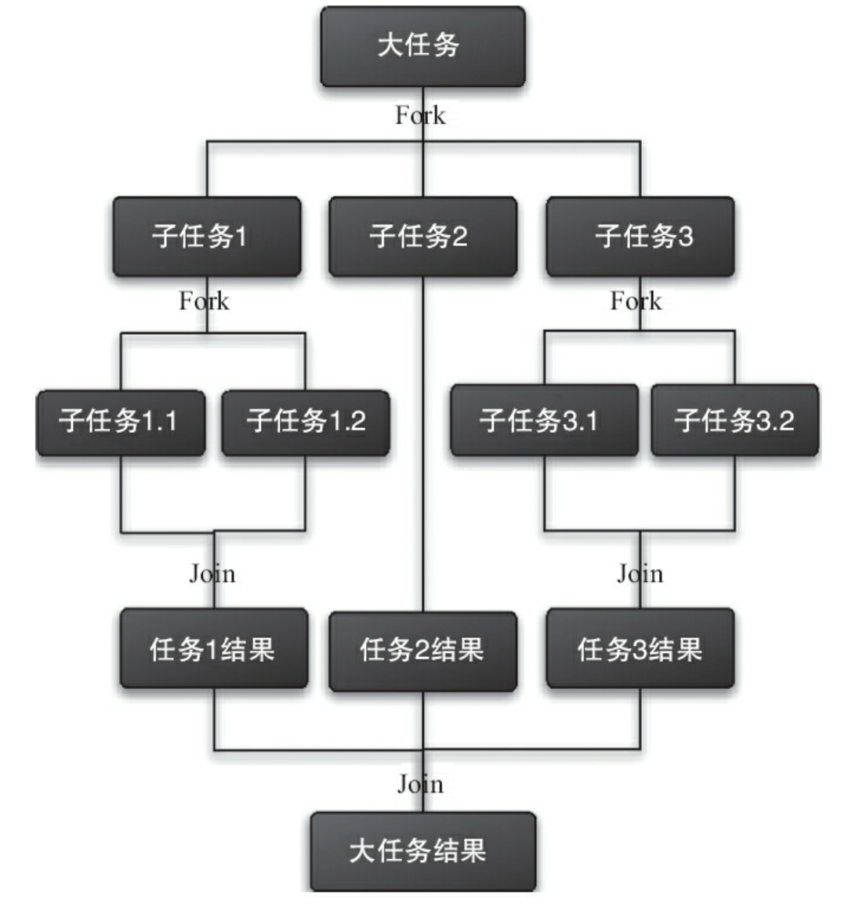
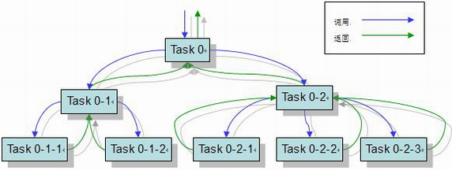
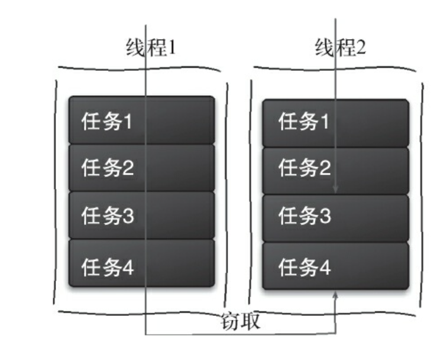

本帖再介绍多几个 Java 多线程编程（`java.util.concurrent` 包）的工具类。

<!-- more -->

# 原子类 Atomic*

Java 1.5 开始提供了很多 `Atomic*` 类，其操作保证了操作的原子性，执行过程中不会被其他线程中断。包括：

原子更新基本类型

```java
AtomicBoolean

AtomicInteger

AtomicLong

// 常用方法：
int addAndGet(int delta);  // 以原子方式将 delta 与实例中的值相加
boolean compareAndSet(int expect, int update);  // 如果实例中的值为预期 expect，则以原子方式将 update 更新到实例中
int getAndIncrement()  // 以原子方式加 1，返回自增前的值
int getAndSet(int newValue)  // 以原子方式设置新值，返回旧的值
```

原子更新数组

```java
AtomicIntegerArray

AtomicLongArray

AtomicReferenceArray

// 常用方法
int addAndGet(int i, int delta)
boolean compareAndSet(int i, int expect, int update)
```

原子更新引用：更新引用类型

```java
AtomicReference<T>

AtomicStampedReference<T>  // 带版本号的引用类型
// 将整数值和引用关联起来（Pair）
// 用此来解决 ABA 问题

AtomicMarkableReference<T>  // 带标识位的引用类型
```

原子更新属性

```java
AtomicIntegerFieldUpdater<T>

AtomicLongFieldUpdater<T>

AtomicReferenceFieldUpdater<T>
```

原子类基于 CAS 算法实现，使用方法简单，性能更高效，线程安全。


# CountDownLatch

允许**一个或多个**线程等待其他线程完成操作。

示例代码：

```java
CountDownLatch c = new CountDownLatch(2);  // 在这里相当于一个计数器：等待两个线程执行完成
// 一个线程调用 countDown() happens-before 于另一个线程调用同一个 CountDownLatch 的 await()

new Thread(() -> {
    System.out.println(1);
    c.countDown();  // 计数器减 1
    System.out.println(2);
    c.countDown();
}).start();

c.await();  // 当 countDown() 到 0 的时候，CountDownLatch 就会从 await() 返回
// c.await(10000, TimeUnit.SECONDS);

System.out.println(3);
```

使用 `join()` 方法也可以实现相同功能：

```java
Thread t1 = new Thread(() -> { System.out.println("t1 finished"); });
Thread t2 = new Thread(() -> { System.out.println("t2 finished"); });

t1.start();
t2.start();
t1.join();
t2.join();
System.out.println("all threads finished");
```

但除了上述例子，使用 CountDownLatch 能实现的功能比 join() 多：  
CountDownLatch 可以用在多个线程，也可以用在一个线程中的多个步骤，这是 join() 所不能比拟的。

应用：多线程解析同个 .xls 文件多个 sheet，或多个线程获取不同页面的信息。

<br/>

# CyclicBarrier

顾名思义，它是可以**循环使用**（cyclic）的屏障（barrier）。

让一组线程到达一个屏障（也可以称之为“同步点”）之后被阻塞，直到最后一个线程到达屏障，屏障才会被解除，所有被屏障拦截的线程才会继续运行。  
就像是到了一定条件才拉闸放水一样。

```java
CyclicBarrier b = new CyclicBarrier(3);  // 直到第 3 个线程到了才会解封
new Thread(() -> {
    try {
        c.await();  // 每一个线程调用一次 await()，屏障记一次到达的线程个数，随后该线程被阻塞
    } catch (Exception e) {
        // handle exceptions
    }
    System.out.println(1);
}).start();

try {
    c.await();
} catch (Exception e) {
    // handle exceptions
}
System.out.println(2);

// 上述例子中因 parties = 3，程序中的两个线程会被一直阻塞。
// parties 改为 2 的话，两个线程最终会运行结束，且输出的 “1” 和 “2” 顺序不保证。
```

另：
```java
CyclicBarrier b = new CyclicBarrier(2, new A());  // A 是屏障解除时优先执行的 barrierAction
// 这个方法用在需要有一个线程保证被优先执行的场景
...

class A implements Runnable {

    @Override
    public void run() {}
}
```

带 barrierAction 的构造函数可应用于多线程计算数据，随后合并计算结果的场景。barrierAction 是执行合并结果的线程。


## CyclicBarrier v.s. CountDownLatch

CountDownLatch 更像是一个**计数器**，线程完成一个就记录一个，计数是递减而不是递增；而 CyclicBarrier 更像是一个**阀门**，计数递增，所有线程到达之后阀门才被打开，然后所有线程继续执行。

CyclicBarrier 的计数器可以使用 `reset()` 重置；而 CountDownLatch 的计数器**只能使用一次**，初始化之后就不能被更改。  
因此 CyclicBarrier 能够处理更为复杂的业务场景：比如说计算结果出错了，可以通过重置计数器，再次创建线程重新计算；CountDownLatch 就做不到这样的功能。

CyclicBarrier 还提供了其他有用的方法，如 `getNumberWaiting()`（获取目前多少个线程被阻塞）`isBroken()`（阻塞线程是否被中断）等方法。 

<br/>

# Semaphore

通常译作“信号量”。

保持在 0 和指定最大值之间的一个计数值，用于控制同时访问特定资源的线程数量，通过协调各个线程来保证合理地使用公共资源。
* 当线程完成一次对该信号量对象的等待（wait）时，计数值减一
* 当线程完成一次对该信号量对象的释放（release）时，计数值加一
* 当计数值为 0：等待该对象的线程数达到最大值，别的线程等待该信号量对象就不再能成功了，直至该对象变成 signaled 状态

信号量对象状态：
* 对象计数值大于 0：signaled
* 计数值等于 0：nonsignaled


```java
import java.util.concurrent.Semaphore;


void acquire()  // 获取访问许可，获取时并不会加持任何锁
void release()  // 释放访问许可

availablePermits()  // 返回当前可用的许可数
getQueueLength()  // 正在等待获取许可的线程数
hasQueuedThreads()  // 是否有线程正在等待获得许可
```

应用举例：
```java
Semaphore s = new Semaphore(10);

new Runnable() {
    @Override
    public void run() {
        ...

        try {
            s.acquire();
        } catch (InterruptedException e) {
            // 处理异常
        }

        ...  // 获取许可之后执行的操作

        s.release();
    }
}
```

可应用于流量控制。


## Semaphore v.s. Mutex

信号量适用于控制一个仅支持有限个用户的共享资源；而互斥锁（**Mut**ual **Ex**clusion, mutex）则是防止两个以上线程同时对一个公共资源进行读写的机制。

互斥与信号量的区别：
1. 互斥仅允许一个线程在某段时间内进入受保护的控制块
2. 信号量则可允许有限个线程同时访问受保护的资源
3. 信号量有受线程控制的变量，互斥锁没有
4. `new Semaphore(1);` 即 binary semaphore，相当于互斥锁

binary semaphore 与 mutex 的区别：
1. 初始状态不同：binary semaphore 是 `0`，即 unsignaled 状态；mutex 是 `1`，即可获取的状态
1. 相当于上述区别的 3：mutex 所有权不能被抢夺，而 binary semaphore 必要时会被占用

<br/>

以上的类都提供了并发流程控制的手段。

<br/>

# Exchanger

用于进行线程之间的数据交换，相当于提供了一个同步点：在同步点里面，两个线程可以交换彼此的数据。  
如果第一个线程先执行了 Exchanger 的方法，它会一直等待第二个线程也执行相对应的方法（除非当前线程被中断）；当两个线程都到达同步点的时候，开始交换数据。

应用：遗传算法，校对工作。

```java
public class ExchangerTest {

    static final Exchanger<String> exchanger = new Exchanger<>();
    static ExecutorService service = Executors.newFixedThreadPool(2);

    public static void main(String[] args) {
        service.execute(() -> {
            String data = "data1";
            exchangeData(data);
        });
        service.execute(() -> {
            String data = "data2";
            exchangeData(data);
        });
        service.shutdown();
    }

    private static void exchangeData(String data) {
        try {
            System.out.printf("Thread %s exchanging %s.%n", Thread.currentThread().getName(), data);
            TimeUnit.SECONDS.sleep(2);
            String exchange = exchanger.exchange(data);
            System.out.printf("Thread %s got %s.%n", Thread.currentThread().getName(), exchange);
        } catch (InterruptedException e) {
            e.printStackTrace();
        }
    }
}

// 输出：
// Thread pool-1-thread-1 exchanging data1.
// Thread pool-1-thread-2 exchanging data2.
// Thread pool-1-thread-1 got data2.
// Thread pool-1-thread-2 got data1.
```


# Fork-Join 框架

From Java 7.

看名字就能猜出这个框架大概是干嘛的了：
* **Fork**：将一个大任务切分成若干个子任务，让它们并行执行
* **Join**：合并所有子任务的执行结果

Fork-Join 能满足应用在每个处理器内核分别使用一个线程，完成计算密集型任务的需求，实现并行执行任务的“分治”计算过程，就像是单机版的 MapReduce 一样。






## 工作窃取算法

每一个线程分别负责一个存储了任务的队列；某个线程执行速度快，将自己负责的队列中所有资源消费完（执行完所有任务）之后，会从其它线程负责的队列中“窃取”任务来执行。

工作窃取算法应用于**阻塞双端队列**（**LinkedBlockingDeque**）中：
* 被窃取的线程永远从其负责的队列的**头部**获取；
* 窃取任务的线程永远从别的队列的**尾部**获取



* 优点：充分利用线程进行并行计算，减少线程之间的竞争，从而加快进度
* 缺点：不能完全避免竞争；消耗系统资源


## 设计

执行的步骤比较清晰：
1. 按照一定粒度分割任务；如果粒度未达要求，就继续分割到满意为止；
2. 执行任务并合并结果

所有子任务会被分配到不同的双端队列中，此时启动多个线程分别从队列中获取任务并执行；执行完毕的子任务，结果（如果有返回值的话）会统一放到一个队列中，另外的线程会从队列中取得数据，合并并返回。

伪代码：
```java
if (problemSize < threshold)
    // solve problem directly
else {
    /**
     * break problem into subproblems
     * recursively solve each subproblem
     * combine the results
     */
}
```

Java 中与 Fork-Join 框架相关的类：
```java
package java.util.concurrent;


abstract ForkJoinTask<V>  // 抽象类


// 子类：

RecursiveAction  // 无返回值
RecursiveTask  // 有返回值
```

当 `ForkJoinTask` 的实例被提交至 `ForkJoinPool` 中时，task 开始执行：
```java
ForkJoinPool  // 实现了 ExecutorService 接口
// task 会被分发到当前工作线程所维护的双端队列头部中
// 倘若当前队列为空，它会随机窃取别的队列尾部的任务
```

实例：
```java
public class CountTask extends RecursiveTask<Integer> {

    private static final int THRESHOLD = 2;
    private int start;
    private int end;

    public CountTask(int start, int end) {
        this.start = start;
        this.end = end;
    }

    @Override
    protected Integer compute() {
        int sum = 0;
        boolean canCompute = (end - start) <= THRESHOLD;
        if (canCompute) {
            for (int i = start; i <= end; i++) {
                sum += i;
            }
        } else {
            int middle = (start + end) / 2;
            CountTask leftTask = new CountTask(start, middle);
            CountTask rightTask = new CountTask(middle + 1, end);
            leftTask.fork();
            rightTask.fork();
            // 等待执行结果
            int leftResult = leftTask.join();
            int rightResult = rightTask.join();
            sum = leftResult + rightResult;
        }
        return sum;
    }

    // 从 1 累加到 10
    public static void main(String[] args) {
        ForkJoinPool pool = new ForkJoinPool();
        CountTask task = new CountTask(1, 10);
        Future<Integer> result = pool.submit(task);

        if (task.isCompletedAbnormally())
            // 处理 task 执行过程中的异常
        try {
            System.out.println(result.get());
        } catch (InterruptedException | ExecutionException e) {
            // 处理异常
        }
    }
}
```
