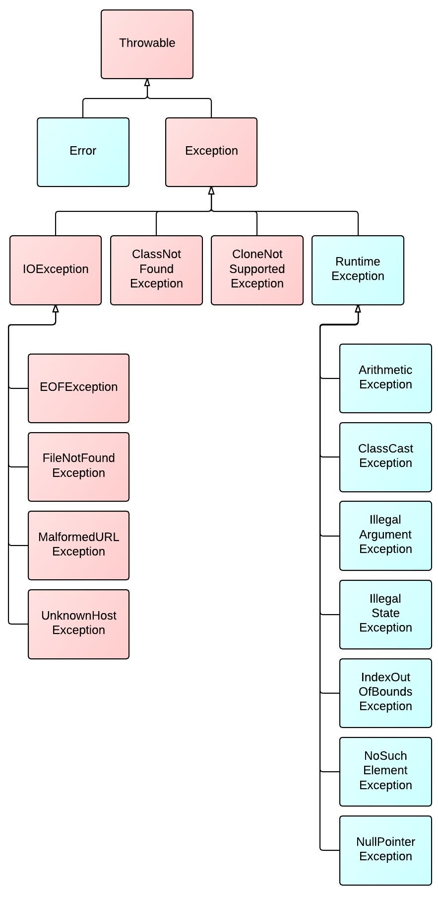

异常是导致程序中断运行的一种指令流，如果不对异常进行正确处理，则可能导致程序的中断运行，造成不必要的损失。

<!-- more -->

当程序的运行出现逻辑错误，或出现无效的情况时，即为发生了异常。
* Java 定义的异常全部基于 `Throwable`，基本继承于 Throwable 的两个子类 `Error` 和 `Exception`
* 其中 Error 仅发生在 JVM 级别的错误时才会抛出，一般程序不会处理。

类图如下：




# Unchecked Exception
**运行时异常**
* 表示错误，即程序的问题或逻辑错误，运行的时候无法恢复，不需要抛出异常
* 包括 `Error`，`RuntimeException` 及其子类，如：
```java
OutOfMemoryError
IllegalArgumentException
NullPointerException
IllegalStatementException
ClassCastException
ClassNotFoundException
IndexOutOfBoundException
NoSuchMethodException
ArithmeticException
```
* Error：系统级的错误和程序不必处理的异常


# Checked Exception
受检查异常（**非运行时异常**）
* 表示无效操作，即不是程序可以预测的异常，比如无效的用户输入、文件不存在等
    * 必须显式地捕获处理（try / catch）或向外抛出（throws）
* 上图红色类即为非运行时异常
* 包括 Exception 除 RuntimeException 之外的所有子类，如：
```java
FileNotFoundException
SocketException
SQLException
IOException
```
* extends Exception


# 处理异常
通常我们要处理 Checked Exception，可以使用 `throws` 关键字或 `try-catch` 块进行处理。

<big>`throws`</big>
* 如果要监控整个方法中的某一类异常，且将其往外抛出，可使用 `throws` 关键字
* 当方法 return 前，任何一句代码发生对应异常，或使用 `throw` 关键字手动抛出的时候，异常都会向外抛出，交由外层调用方法进行处理

```java
public void divide(int a, int b) throws Exception {
    int c;
    if(0 == b) {
        // 抛给 method 的调用者
        throw new Exception("divided by 0");
    }
    c = a/b;
}
public static void main(String[] args) throws Exception {
    int result = divide(1,0);
    System.out.println(result);
    // 如果不作处理，异常会层层外抛，最终交由 JVM 处理
}
```

`throw` 和 `throws` 比较
* throws 出现在方法函数头，throw 出现在函数体；
* throws 表示出现异常的一种可能性，声明可能会抛出一个异常，并不一定发生该种异常；
* throw 则是真实抛出了异常：执行 throw 则一定抛出了某种异常


`try-catch-finally`
* 如需要对某一块代码中的代码进行监控，且有意对异常在方法内进行处理：使用 try-catch 块
* 在 try-catch 块中仍可配合 throw/throws 将异常外抛

基本格式
```java
try {
    // 可能发生异常的语句
} catch (Exception) {
    // 异常处理
} finally {
    // 一定会执行的代码
}
```

例：
```java
public void divide(int a, int b) throws Exception {
    int c;
    if(0 == b) {
        // 抛给 method 的调用者
        throw new Exception("divided by 0");
    }
    c = a/b;
}

public static void main(String[] args) {
    try {
        int result = divide(1,0);
    } catch (Exception e) {
        System.out.println("error, cause: " + e.getMessage());
    }
    System.out.println(result);
}
```

在 `try - catch - finally` 语句块中：
* 有 try 子句必有 catch 子句或者 finally 子句；
* finally 子句中的内容一定会被执行，除非在 try 或者 catch 子句中含有 JVM 终止的语句（`System.exit(0);`）；
* 若 try 部分中有返回值（`return`），则将会先将该 return 语句挂起，先执行 finally 部分；
    * finally 子句在 try 或 catch 子句中的 return 语句执行之后（如 return 紧接一个运算或方法调用），return 返回之前（方法出栈）；
* 如果 finally 中没有 return，则：如在 finally 块中修改原来 try 要返回的变量值，则不会影响该变量值；
* 如果 finally 子句和 try 或 catch 语句中都有 return 语句，真正返回的是 finally 中的 return 语句。

另：可自定义异常 —— 继承 `Exception` / `RuntimeException` 类
