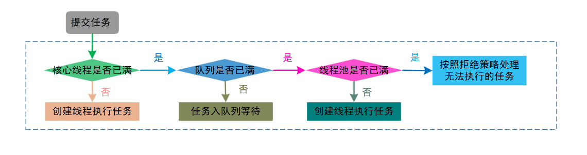

Java 绝不只是通过几个零散的基础类来实现多线程编程，就能给并发场景提供强大的保障的。

<!-- more -->

在并发编程的应用场景中，总不能每需要并发管理的时候就去 `new Thread()`，毕竟创建新线程有一定的代价。

如应用程序会有大量生命期很短的线程出现，我们应该使用**线程池**（thread pool）去管理线程：
* 线程池中包含很多准备运行的空闲线程
* 将 `Runnable` 对象交给线程池，就会有一个线程去调用它的 `run()` 方法
* run() 方法退出后，线程不会死亡，而是在池中准备为下一个请求提供服务

使用线程池能提高线程的可管理性以及响应的速度，而且能减少并发线程数目，降低资源消耗。

<br/>

Java 线程池相关的接口和类集中在 `java.util.concurrent`（JUC）包中。


# 基础：`Executor` & `ExecutorService`

接口概况：


```java
package java.util.concurrent;


// JDK 1.5 引入 Executor 接口的初衷是为了解耦任务本身和任务的执行
public interface Executor {
    void execute(@NotNull Runnable command);  // 根据实现不同，具体执行任务的方式也会不一样
}
```

```java
package java.util.concurrent;


// Executor 的增强
public interface ExecutorService extends Executor {

    // 提交 Callable 对象
    // 返回 Future 对象中包含 Callable 的执行结果
    Future<T> submit(Callable<T> task);

    // 提交 Runnable 对象
    // 通过 Future.get() 获取 Runnable 完成后指定的 result 对象
    Future<T> submit(Runnable task, T result);

    // Future.get() 完成时简单返回 null
    // 提交指定的任务并执行
    Future<?> submit(Runnable task);

    // 关闭服务，将线程池状态设置为 shutdown
    // 先完成已提交的任务，中断所有没在执行的任务，不再接受新任务
    // 当所有任务完成：线程死亡
    void shutdown();

    // 将线程池状态设置为 stop
    // 取消尚未开始的所有任务，并试图中断正在运行的线程
    // 返回等待执行任务的列表
    List<Runnable> shutdownNow();

    // shutdown() 和 shutdownNow() 都是逐个调用线程的 interrupted() 终止线程的，因此不响应中断的线程，线程池永远不会被 shutdown

    // 执行给定的任务列表，返回其中一个任务的结果
    // 无法确切知道返回的是哪个任务
    T invokeAny(Collection<Callable<T>> tasks);
    T invokeAny(Collection<Callable<T>> tasks, long timeout, TimeUnit unit);  // 超时则抛出 TimeoutException 异常

    // 执行给定的任务列表，以 List 方式返回所有任务的结果
    List<Future<T>> invokeAll(Collection<Callable<T>> tasks);
    List<Future<T>> invokeAll(Collection<Callable<T>> tasks, long timeout, TineUnit unit);  // 超时则抛出 TimeoutException 异常

    // 发起阻塞，直至所有 task 在请求 shutdown 后完成
    // 若在完成前超时，返回 false
    // 若线程被中断，抛出 InterruptedException
    // 调用 shutdown 之后应该调用此方法
    boolean awaitTermination(long timeout, TimeUnit unit);

    ...
}
```

总的来说，相对于 Executor，ExecutorService 增强了对任务的控制和生命周期管理：
* 关闭执行器，禁止任务的提交（`shutdown|Now()`）
* 监视执行器的状态（`isShutDown()`, `isTerminated()`）
* 提供对异步任务的支持（`submit()`）
* 提供对批处理任务的支持（`invoke|[All|Any]()`）

由上述可见线程池的执行方法：
* `execute()`：异步方法，不返回运行结果，用于提交不需要返回值的任务
* `submit()`：异步方法，返回运行结果，用于提交需要返回值的任务
* `invoke()`：同步方法，返回运行结果


## 使用方法小结
1. 调用 `submit()` / `execute()` 提交 Runnable 或 Callable 对象
2. 如想取消任务，或如果提交 Callable 对象，则需保存好返回的 Future 对象
3. 当不再提交任何任务时调用 `shutdown()`

使用例子：
```java
List<Callable<T>> tasks = ...;
List<Future<T>> results = executor.invokeAll(tasks);
for (Future<T> result : results)
    processFurther(result.get());
```

同步执行任务的例子：
```java
class DirectExecutor implements Executor {
    @Override
    public void execute(Runnable r) {
        r.run();
    }
}
```

异步执行任务的例子：
```java
class AsyncExecutor implements Executor {
    @Override
    public void execute(Runnable r) {
        new Thread(r).start();  // 线程池的雏形
    }
}
```


## 实现类概况：`ThreadPoolExecutor`

`ThreadPoolExecutor` 是 Java 并发编程中最常用的线程池执行器，是了解 Java 并发编程的重点。

```java
package java.util.concurrent;


// AbstractExecutorService 实现了 ExecutorService 接口
public class ThreadPoolExecutor extends AbstractExecutorService {

    ...

    int taskCount; // 任务数量
    int completedTaskCount;  // 已完成的任务数量
    int largestPoolSize;  // 曾经创建的最大线程数量

    ...

    public ThreadPoolExecutor(int corePoolSize, int maximumPoolSize, long keepAliveTime, TimeUnit unit, BlockingQueue<Runnable> workQueue) {}

    public ThreadPoolExecutor(int corePoolSize, int maximumPoolSize, long keepAliveTime, TimeUnit unit, BlockingQueue<Runnable> workQueue, RejectedExecutionHandler handler) {}

    public ThreadPoolExecutor(int corePoolSize, int maximumPoolSize, long keepAliveTime, TimeUnit unit, BlockingQueue<Runnable> workQueue, ThreadFactory threadFactory) {}

    public ThreadPoolExecutor(int corePoolSize, int maximumPoolSize, long keepAliveTime, TimeUnit unit, BlockingQueue<Runnable> workQueue, ThreadFactory threadFactory, RejectedExecutionHandler handler) {}

    ...

    void allowCoreThreadTimeOut(boolean value) {}
    // 设置 core 线程是否超时

    int getActiveCount() {}
    // 返回当前活跃的线程数

    int getLargestPoolSize() {}
    // 返回线程池当前最大的线程数


    // 扩展线程池：
    void beforeExecute(Thread t, Runnable r) {}
    void afterExecute(Thread t, Runnable r) {}

    ...
}
```


**构造参数**：


**1**. `corePoolSize`：保留在线程池内的最小线程数，确定线程池的基本大小
* 线程池内的线程可以全都是 idle 状态；
* 当前线程（无论是否在工作）数量若少于 corePoolSize，线程池会新建一个线程执行任务；
* 可通过 setter 方法改变；
* 可通过 `preStartCoreThread()` 或 `preStartAllCoreThreads()` 提前启动一个或多个线程，使其进入等待状态，成功则返回 true


**2**. `maximumPoolSize`：线程池所允许的最大线程数
* corePoolSize = maximumPoolSize 时，创建的是固定大小的线程池；
* 可通过 setter 方法改变，可以设为 `Integer.MAX_VALUE`
* 如果使用的阻塞队列是无界队列的话，这个参数就不会起到什么效果了


**3**. `keepAliveTime`：超过 corePoolSize 数量的其他 idle 线程所能存活的最长时间
* 超过这个时间的 idle 线程会被销毁
* 可以设置为最大长整型值 `Long.MAX_VALUE`（TimeUnit 为纳秒），可通过 setter 调整
* 一般应用在 corePoolSize 数目之外的线程，allowCoreThreadTimeOut() 也会采用此值
* 如果任务多，执行时间短，可以将这个值调大，以节省资源


**4**. `unit` idle 线程的存活时间单位


**5**. `workQueue`：存放等待执行的 task 的[阻塞队列](/2021/10/02/java-concurrent-collections/#阻塞队列)；只保存 runnable 对象
* 如果线程池中的核心线程数少于 corePoolSize：线程池会直接增加一个线程
* 若多于或等于 corePoolSize，多出来的部分会进入队列；若不能进入队列，则在 maximumPoolSize 规定的最大范围内新建

队列分发的方式：
1. 直接分发：使用 SynchronousQueue 将 task 立即分发给线程池中的线程
2. 无界队列：线程池最多只有 corePoolSize 个线程工作，最大值无效
3. 有界队列：比如 `ArrayBlockingQueue`, `LinkedBlockingQueue`


**6**. `handler`：饱和策略（拒绝策略）
* 设置线程池或者队列空间满载导致阻塞的时候，线程池所要采用的拒绝（reject）handler 对象
* 默认值是 `ThreadPoolExecutor.AbortPolicy`：丢弃任务，并抛出 `RejectedExecutionException` 异常

其他可以设置的 handler：
* `ThreadPoolExecutor.CallerRunsPolicy`：如线程池未关闭，则直接在调用者线程完成这个任务
* `ThreadPoolExecutor.DiscardOldestPolicy`：取消队列头（最老）的 task，放入新任务再执行
* `ThreadPoolExecutor.DiscardPolicy`：不处理新的任务，直接丢弃
* 可自定义其他的 handler


**7**. `threadFactory`：用来设置创建新线程的工厂对象
* 通过传入指定工厂对象来设置线程的名称、线程组、优先级等
* 如果传入的是 null，则采用默认的 `Executors.defaultThreadFactory()`


**工作流程**：

**使用者**提交任务



1. 如线程池中的线程数小于 corePoolSize：创建新线程（需要获取全局锁），直接执行任务
2. 如线程池中的线程数大于 corePoolSize：暂时将任务存储到 workQueue 中等待执行

到了 workQueue 也满了的时候：

3. 线程数小于最大线程池数 maximumPoolSize 时，会创建新线程（需要获取全局锁）执行任务
4. 线程数大于或等于最大线程池数 maximumPoolSize 时，会执行设置的饱和策略

再结合实现原理解释一下上面的步骤：


制定这一系列流程的原因是为了减少线程的创建，避免获取全局锁的操作。

以上为新任务提交到线程池时的步骤，而线程池执行任务的步骤如下：


1. 执行 execute() 的时候，线程池的线程会执行任务；
2. 与此同时，空闲线程也会不断去阻塞队列中取任务执行（take(), poll()）。

源码简析（基于 Java 8）：

```java
package java.util.concurrent;


public class ThreadPoolExecutor extends AbstractExecutorService {

    ...

    private final class Worker extends AbstractQueuedSynchronizer  // 扩展 AQS
        implements Runnable
    {
        ...

        public void run() {
            runWorker(this);
        }

        ...
    }

    ...

    final void runWorker(Worker w) {
        Thread wt = Thread.currentThread();
        Runnable task = w.firstTask;
        w.firstTask = null;
        w.unlock(); // allow interrupts
        boolean completedAbruptly = true;
        try {
            while (task != null || (task = getTask()) != null) { // 循环获取工作队列里的任务来执行
                w.lock();
                ...
            }
        } finally {
            processWorkerExit(w, completedAbruptly);
        }
    }

    ...

    boolean addWorker(Runnable firstTask, boolean core) {
        ...

        boolean workerStarted = false;
        boolean workerAdded = false;
        Worker w = null;
        try {
            final ReentrantLock mainLock = this.mainLock;
            w = new Worker(firstTask);
            final Thread t = w.thread;
            if (t != null) {
                mainLock.lock();  // 获取全局锁
                ...
            }
        } finally {
            if (!workerStarted)
                addWorkerFailed(w);
        }
        return workerStarted;
    }

    ...

    public void execute(Runnable command) {
        if (command == null)
            throw new NullPointerException();
        int c = ctl.get();
        if (workerCountOf(c) < corePoolSize) {  // 线程数 < 核心线程数
            // 创建一个线程
            if (addWorker(command, true))  // 线程池创建线程时，会将线程封装成工作线程 Worker
                return;
            c = ctl.get();  // 创建失败，获取当前线程池状态
        }

        // 线程创建失败，或当前工作线程数不小于 corePoolSize：
        if (isRunning(c) && workQueue.offer(command)) {  // 当前线程池运行正常且阻塞队列添加任务成功
            int recheck = ctl.get();
            if (!isRunning(recheck) && remove(command))  // 二次确认（有可能存在线程池状态发生了变化的情况）
                reject(command);
            else if (workerCountOf(recheck) == 0)  // 当前没有工作线程
                addWorker(null, false);  // 创建一个非核心线程
                // 保证有一个 worker 线程可以从 queue 中消费任务就行了，所以 command 可以设置为 null
        }
        // 线程池不处于运行中或任务无法放入队列，并且当前线程数量小于最大允许的线程数量
        else if (!addWorker(command, false))  // 创建一个非核心线程执行任务
            reject(command);  // 创建非核心线程失败，执行饱和策略
    }

    ...
}
```

<br/>

### 合理配置线程池

**1**. 根据任务的性质确定参数：
* CPU 密集型：配置比较小的线程池，如 N CPU + 1
* IO 密集型：线程不一定在执行任务，因此要尽可能多地配置线程，如 2 * N CPU
* 混合型：拆分

其中 N = `Runtime.getRuntime().availableProcessors()`

**2**. 如果任务存在优先级，则使用 PriorityBlockingQueue 作为线程池的阻塞队列。

**3**. 如果需要考虑任务的执行时间，可以创建不同规模的线程池来处理；或者使用 PriorityBlockingQueue 优先处理**执行时间短的任务**。

**4**. 如果执行的任务之间存在依赖性，应该按需增大线程池，以免在等待依赖的过程中 CPU 存在空闲时间过长的情况；同时应该采用有界的阻塞队列（特别是依赖外部系统的情况下），避免执行任务过多撑爆内存的风险。

<br/>

# 扩展：`ScheduledExecutorService`

接口概况：


```java
package java.util.concurrent;


public interface ScheduledExecutorService extends ExecutorService {

    // 预定在指定的等待时间之后执行任务
    ScheduledFuture<V> schedule(Callable<V> task, long time, TimeUnit unit);
    ScheduledFuture<?> schedule(Runnable task, long time, TineUnit unit);


    // 预定在初始延迟结束后，周期性运行给定的任务
    // 周期长度为 period，单位为 unit
    ScheduledFuture<?> scheduleAtFixedRate(Runnable task, long initialDelay, long period, TimeUnit unit);


    // 预定在初始延迟结束后，周期性运行给定的任务
    // 在前一次调用完成和下一次调用开始之间会有 delay 的延迟
    ScheduledFuture<?> scheduleWithFixedDelay(Runnable task, long initialDelay, long delay, TimeUnit unit);
}
```

实现类概况：扩展了 `ThreadPoolExecutor` 类
```java
package java.util.concurrent;

public class ScheduledThreadPoolExecutor
extends ThreadPoolExecutor implements ScheduledExecutorService {

    ...

    public ScheduledThreadPoolExecutor(int corePoolSize, ThreadFactory factory) {
        super(corePoolSize, Integer.MAX_VALUE, 0, TimeUnit.NANOSECONDS, new DelayedWorkQueue(), factory);
        // 这里的 Integer.MAX_VALUE 没多大意义，因为 DelayedWorkQueue 本身就是无界的队列
    }

    ...
}
```

## 基本运行机制


通过调用接口方法来定期/延时执行任务，将 Future 对象添加到 DelayQueue 中，核心线程池从阻塞队列中获取 Future 对象执行。

比 `java.util.Timer` 单个的线程更灵活，功能也更多。

## 执行周期性任务的过程

先说一下被执行的周期性任务 `ScheduledFutureTask`。主要有以下属性：
* long `time`: 下一次任务将要被执行的具体时间
* long `sequenceNumber`: 任务被提交到线程池时被编的序号
* long `period`: 任务重复被执行的周期

假设 ScheduledThreadPoolExecutor 实例中存在了线程 1，它要执行任务的顺序如下：


**1**. 首先从阻塞队列中获取一个已经到期（time <= 当前时间）的任务 ScheduledFutureTask（`DelayQueue.take()`）  
**2 & 3**. 线程池执行任务后，修改 time 变量的值为下次任务执行的时间（`time` + `period`）  
**4**. 将修改了 time 变量的任务实例重新放回阻塞队列（`DelayQueue.add()`），等待下一次被执行。

DelayQueue 封装了 PriorityQueue，以 time -> sequenceNumber 为标准将时间小，序号靠前的任务排到队列前面：因此时间点更靠近的会先被运行。


**获取任务的逻辑**：


获取任务：调用 `DelayQueue.take()`
1. 获取 lock
2. 在循环中获取周期任务
    * 如阻塞队列为空，则线程在 Condition 中等待
    * 如阻塞队列中任务 task 的时间点 time > 当前时间，则线程还是在 Condition 中等待
    * 否则唤醒 Condition 上等待的线程，从队列中获取任务
3. 释放 lock


**放回任务的逻辑**：


放回任务：调用 `DelayQueue.add()`
1. 获取 lock
2. 在循环中添加周期任务
    * 如阻塞队列头节点存在元素，则唤醒在 Condition 中等待的线程
3. 释放 lock

<br/>

# 补充：泛型类 `ExecutorCompletionService`

```java
package java.util.concurrent;


public class ExecutorCompletionService<V> implements CompletionService<V> {

    /**
     * 构建一个实例，来收集已提交任务的执行结果
     * 该服务管理 Future 对象的阻塞队列
     * 如果没有指定队列：默认为 LinkedBlockingQueue
     */
    ExecutorCompletionService(Executor e)
    ExecutorCompletionService(Executor e, BlockingQueue<Future<v>> completionQueue)

    // 提交一个任务给底层执行器
    Future<T> submit(Callable<T> task)
    Future<T> submit(Runnable task, T result)

    // 从 completionQueue 移除下一个已完成结果
    // 如无任何已完成结果，则阻塞
    Future<T> take()

    // 移除下一个已完成结果
    // 如无任何已完成结果，则返回 null
    Future<T> poll()
    Future<T> poll(long time, TimeUnit init)  // 等待给定的时间

    ...
}
```

使用例子：
```java
ExecutorCompletionService service = new ExecutorCompletionService(executor);
for (Callable<T> task : tasks)
    service.submit(task);
for (int i = 0; i < tasks.size(); i++)
    processFurther(service.take().get());
```

与 ExecutorService 相比，ExecutorCompletionService 对于 invokeAny() 和 invokeAll() 有具体的实现，其将结果按照可获得的顺序保存起来显得更有意义。

<br/>

# `Executors`

JUC 包还提供了 Executors 工厂类，包含了上面提到的 `Executor`, `ExecutorService`, `ScheduledExecutorService`, `ThreadFactory` 和 `Callable` 等接口类，及其实现类的工厂方法。
* `Executor`：提交普通的可执行任务
* `ExecutorService`：提供对线程池生命周期的管理、异步任务的支持
* `ScheduledExecutorService`：提供对任务的**周期性**执行支持

主要的工厂方法概述如下：

| 方法 | 描述 |
| --- | ---- |
| `newCachedThreadPool()`     | 必要时创建新线程：空闲线程会保留 60 秒<br/>如线程池大小超过处理任务所需要线程：回收部分空闲线程 |
| `newFixedThreadPool()`      | 该池包含固定数量的线程：空闲线程会一直保留<br/>如某线程因执行异常而结束：线程池补充一个新线程   |
| `newSingleThreadExecutor()` | 只有一个线程的“池”：该线程按照顺序执行每一个提交的任务 |
| `newScheduledThreadPool()`  | 用于定时或周期性执行而构建的固定线程池，替代 `java.util.Timer`  |
| `newSingleThreadScheduledThreadExecutor()` | 用于定时或周期性执行而构建的单线程执行器（“池”） |
| `newWorkStealingPool()` | 创建一个 ForkJoin 线程池 |

从上述方法命名可以看出：只有一个线程的“池”，叫 `-Executor`；否则都叫 `-Pool`。

`Executors` 工具类中的工厂方法概述：
```java
package java.util.concurrent;


public class Executors {

    ...

    /**
     * 返回带缓存（线程可重用）线程池，线程数不限
     * 必要时创建线程，在线程空闲 60 秒后终止线程
     * 
     * 场景比较少，一般用在任务数量大但执行时间短的场景
     */
    public static ExecutorService newCachedThreadPool() {
        return new ThreadPoolExecutor(0, Integer.MAX_VALUE, 60L, TimeUnit.SECONDS, new SynchronousQueue<Runnable>());
    }

    public static ExecutorService newCachedThreadPool(ThreadFactory factory) {
        return new ThreadPoolExecutor(0, Integer.MAX_VALUE, 60L, TimeUnit.SECONDS, new SynchronousQueue<Runnable>(), factory);
    }


    /**
     * 返回一个线程池，池中的线程数由参数指定
     * 如某一时刻提交的服务数多于空闲的线程数，那将暂时未能获取服务的任务放置到等待池中，其他任务完成后再执行它们
     * 
     * 一般用于需要限制线程数量的并发场景
     */
    public static ExecutorService newFixedThreadPool(int nThreads) {
        return new ThreadPoolExecutor(nThreads, nThreads, 0L, TimeUnit.MILLISECONDS, new LinkedBlockingQueue<Runnable>());
    }
    ExecutorService newFixedThreadPool(int nThreads, ThreadFactory factory)


    /**
     * 返回一个执行器，在单个线程中依次执行各个提交进来的任务
     * 保证顺序，避免多个任务同时执行
     */
    public static ExecutorService newSingleThreadExecutor() {
        return new FinalizableDelegatedExecutorService
            (new ThreadPoolExecutor(1, 1, 0L, TimeUnit.MILLISECONDS, new LinkedBlockingQueue<Runnable>()));
    }

    public static ExecutorService newSingleThreadExecutor(ThreadFactory factory) {
        return new FinalizableDelegatedExecutorService
            (new ThreadPoolExecutor(1, 1, 0L, TimeUnit.MILLISECONDS, new LinkedBlockingQueue<Runnable>(), factory));
    }


    // 以上构造函数调用的均为 ThreadPoolExecutor 的构造方法
    // 返回的是实现了 ExecutorService 接口的 ThreadPoolExecutor 类对象


    // 以下为 ScheduledExecutorService 相关工厂方法：

    /**
     * 返回一个线程池，使用给定线程数调度任务
     * 
     * 应用于多个线程运行周期性任务的场景（需要满足系统性能需求）
     */
    public static ScheduledExecutorService newScheduledThreadPool(int corePoolSize) {
        return new ScheduledThreadPoolExecutor(corePoolSize);
    }

    public static ScheduledExecutorService newScheduledThreadPool(int corePoolSize, ThreadFactory factory) {
        return new ScheduledThreadPoolExecutor(corePoolSize, factory);
    }


    /**
     * 返回一个执行器，在一个单独线程中调度任务
     * 
     * 单个线程依序执行周期性任务
     */
    public static ScheduledExecutorService newSingleThreadScheduledExecutor() {
        return new DelegatedScheduledExecutorService(new ScheduledThreadPoolExecutor(1));
    }

    public static ScheduledExecutorService newSingleThreadScheduledExecutor(ThreadFactory factory) {
        return new DelegatedScheduledExecutorService(new ScheduledThreadPoolExecutor(1, factory));
    }

    ...

    // 将 Runnable 包装成 Callable 对象
    public static Callable<Object> callable(Runnable task) {
        if (task == null)
            throw new NullPointerException();
        return new RunnableAdaptor<Object>(task, null);  // 没有结果
    }

    public static Callable<Object> callable(Runnable task, T result) {
        if (task == null)
            throw new NullPointerException();
        return new RunnableAdaptor<Object>(task, result);
    }
    ...
}
```


## 使用须知

阿里巴巴编程手册不提倡使用工厂方法创建线程池，而是通过 `new ThreadPoolExecutor()` 更灵活地配置。
* 特别是 `newCachedThreadPool()`：因其没有边界，使用起来比较危险

<br/>

# Executor 框架

上面所提到的接口类和实现类构成了 Executor 框架的主体：
* 被执行的任务所需接口：[`Runnable`](/2021/08/24/java-multi-threads-basic-classes/#Runnable-%E6%8E%A5%E5%8F%A3) [`Callable`](/2021/08/24/java-multi-threads-basic-classes/#Callable-amp-Future)
* 执行任务所需要的 `Executor` 和 `ExecutorService` 接口及实现类
* 异步计算结果：[`Future`](/2021/08/24/java-multi-threads-basic-classes/#Callable-amp-Future) 接口，[`FutureTask`](/2021/08/24/java-multi-threads-basic-classes/#Callable-amp-Future) 类


简单来说，主线程创建任务（`Runnable` 或 `Callable` 实例），提交（`submit()` / `execute()`）到线程池中执行，主线程可以获取（`get()`）返回的结果（`FutureTask`），或取消（`cancel()`）当前执行任务。

Executor 框架的两级调度模型和操作系统中线程的关系：


Java 线程一一对应于本地操作系统的线程，每创建/销毁一个 Java 线程，对应就会创建/回收一个本地操作系统的线程。

应用程序的任务经由 Executor 框架映射到线程池中的线程执行（上层调度），操作系统的内核也会将线程映射到对应的 CPU 中（下层调度）。
