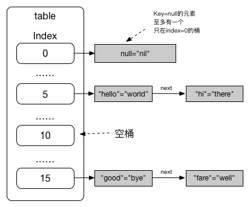
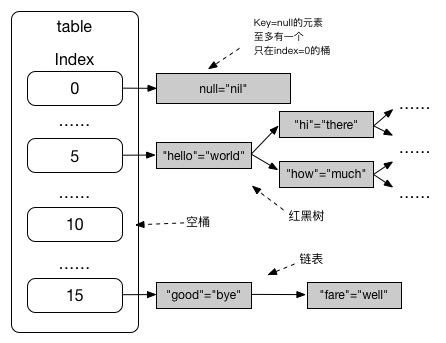

HashMap 在 Java 编程中的出镜率相当高，是 Map 接口最常见的实现类。

<!-- more -->

这里涉及到一个基本的概念：


# 什么是 Hash？

直译为“哈希”，意译为“散列”，是根据 Hash 算法对某个对象的实例域进行序列化，产生一个整数，得到的序列化结果被称为哈希值，或**散列码**（hash code）。

不同数据域的对象对应会产生不同的散列码。

给一个集合里面的所有对象计算散列码，我们称这个对象为散列表（hash table）。  
散列表若要存放自定义类的时候，需实现该类的 `hashCode()` 方法（该方法应与 `equals()` 兼容）。


## Java 中的实现

在 Java 中，散列表使用**链表数组**实现，数组中的每个链表被称为**桶**（bucket）。

要想查找表中对象的位置，需要先计算散列码，与桶的总数取余，得到保存该元素的桶的索引。根据索引就可以得到对应的值。

有的时候会遇到桶被占用的情况，我们称之为**散列冲突**（hash collision）；此时需要将新对象与桶中的所有对象进行比较，查看是否已经存在了这个对象。  
如果存在了相同的 key 的元素，就将其 value 更新；否则将该元素作为新的**头元素**加入桶中（头插法）。

若散列表太满，散列表需要再散列（rehash）：创建一个桶更多的表，并将所有元素插入到新表中，再丢弃原来的表。  
散列表的**负载因子**（**load factor**）决定何时对散列表进行再散列。比如将 load factor 设为 0.75（默认值），而表中超过 75% 位置已经填入了元素，那么在 rehash 的时候，会用双倍的桶数自动进行再散列。

如果散列码设计合理且随机分布，桶的数目足够大，比较次数就会减少。  
想更多地控制散列表的运行性能，则需要指定一个初始的桶数，用于收集具有相同散列值的桶的数目：
* 如大致知道最终会有多少个元素要插入到散列表中，便可设置桶数，通常为预计元素个数的 75% - 150%。


# HashMap 的实现

Map 接口继承自 AbstractMap，迭代时不保证元素顺序，线程不安全。

当散列冲突过于频繁的时候，HashMap 会退化为链表，或红黑树（Java 8+）。


## Java 7 的 HashMap 实现

桶的实现：桶中的元素以**链表**形式组织起来（数组+链表）。




### 元素类 `HashMap.Entry`

```java
static class Entry<K,V> implements Map.Entry<K,V> {
    // Entry 直接实现了 Map 接口的 Entry 内部接口，没有使用 AbstractMap 提供的 SimpleEntry

    final K key;  // key 设值后不可变
    V value;
    Entry<K,V> next;  // 各个 Entry 之间以单向链表组织
    int hash;

    // 其它方法
    ...

    // 关键方法：

    public final int hashCode() {
        // 如对象为 null：返回 0，否则调用 native 的 hashCode() 求值
        return Objects.hashCode(getKey()) ^ Objects.hashCode(getValue());  // key 散列码和 value 的散列码按位异或
    }

    public final boolean equals(Object o) {
        if (!(o instanceof Map.Entry)) {
            return false;
        }
        Map.Entry e = (Map.Entry) o;
        Object k1 = getKey();
        Object k2 = e.getKey();
        if (k1 == k2 || (k1 != null && k1.equals(k2))) {  // 比较当前对象和目标对象的 key
            Object v1 = getValue();
            Object v2 = e.getValue();
            if (v1 == v2 || (v1 != null && v1.equals(v2))) {
                // 比较当前对象和目标对象的 value
                return true;
            }
        }
        return false;
    }
}
```


### 常量及变量（数据结构）

```java
// 默认的初始容量
static final int DEFAULT_INITIAL_CAPACITY = 1 << 4;  // a.k.a. 16

// 默认的最大容量，2^30
static final int MAXIMUM_CAPACITY = 1 << 30;

// 默认的负载因子
static final float DEFAULT_LOAD_FACTOR = 0.75f;
// 0.75 在时间和空间成本之间提出了一个很好的折衷方案

static final Entry<?,?>[] EMPTY_TABLE = {};

// 存放元素
// 每一个索引存放一个桶（链表）的头元素，根据需要可以扩容，其长度只能为 0 或 2^n
transient Entry<K,V>[] table = (Entry<K,V>[]) EMPTY_TABLE;

// 以 Set 的方式对 Entry 进行缓存
private transient Set<Map.Entry<K,V>> entrySet = null;

// 指示 HashMap 中有实际多少个 Key-Value 对的元素
transient int size;

// 指示下次变容后的 size 大小，即实际容量 * loadFactor
// 初始 threshold 可在构造方法内指定（initialCapacity）
// 若没有指定则为 DEFAULT_INITIAL_CAPACITY
int threshold;

// 负载因子，可在构造方法中指定，如没有指定则为 DEFAULT_LOAD_FACTOR
final float loadFactor;
```


### 关键方法

**`hash()`**

其实我们无需纠结于如何 hash，只需知道根据不同的 key 会将 entry 分配到不同或者相同的数组索引下，且分配均匀。

但是循例还是看一看代码：

```java
final int hash(Object k) {
    int h = 0;
    h ^= k.hashCode();
    h ^= (h >>> 20) ^ (h >>> 12);
    return h ^ (h >>> 7) ^ (h >>> 4);
}
```


**`indexFor()`**

根据散列值和数组长度计算数组索引，从而确定 Entry 将要，或者已经被放在哪一个桶：

```java
static int indexFor(int h, int length) {
    return h & (length-1);  // 取模
}
```


扩容 **`resize()`**

```java
void resize(int newCapacity) {
     ...  // 其它代码
    threshold = (int) Math.min(newCapacity * loadFactor, MAXIMUM_CAPACITY + 1);
}
```

当新容量与负载因子的乘积（newCapacity * loadFactor）小于默认的最大容量时，新阈值 threshold 会变为这个乘积；否则变为默认的最大容量，并不再扩容。


**`addEntry()`**

```java
void addEntry(int hash, K key, V value, int bucketIndex) {
    if ((size >= threshold) && (null != table[bucketIndex])) {
    // 若当前容量达到了 threshold，且元素将要添加进去的桶不为空（出现了哈希冲突）：
        resize(2 * table.length);  // 先将容量扩为原来两倍
        hash = (null != key) ? hash(key) : 0;  // 计算散列值
        bucketIndex = indexFor(hash, table.length);  // 再确定 Entry 将要分配到哪个索引下的桶
    }
    createEntry(hash, key, value, bucketIndex);
}

void createEntry(int hash, K key, V value, int bucketIndex) {
    Entry<K,V> e = table[bucketIndex];  // 定位桶，取出目前桶的头元素 e
    table[bucketIndex] = new Entry<>(hash, key, value, e);  // 头插法，e 变为新头元素的 next
    size++;
}
```


### 存放 **`put()`**

```java
public V put(K key, V value) {
    ...  // 其他代码

    if (key == null)
        return putForNullKey(value);  // 将 key-value 放在索引为 0 的桶内
    int hash = hash(key);
    int i = indexFor(hash, table.length);  // 确定 Entry 的桶，也就是数组的索引
    for (Entry<K,V> e = table[i]; e != null; e = e.next) {  // 遍历桶内元素
        Object k;
        if (e.hash == hash && ((k = e.key) == key || key.equals(k))) {  // 找到了相同元素
            V oldValue = e.value;
            e.value = value;
            e.recordAccess(this);
            return oldValue;  // 返回旧元素的值
        }
    }
    // 没找到相同元素的话：
    ...  // 先执行其他代码
    addEntry(hash, key, value, i);  // 将新键值对插入头部
    return null;
}
```


### 获取 **`get()`**

```java
final Entry<K,V> getEntry(Object key) {
    if (size == 0) {
        return null;
    }
    // 获取 key 的 hash 值
    int hash = (key == null) ? 0 : hash(key);

    // 调用 indexFor() 确定 key 对应的元素所在的桶，如果桶不为空则遍历桶上的元素
    for (Entry<K,V> e = table[indexFor(hash, table.length)];
         e != null;
         e = e.next) {
        Object k;
        // 找到对应的元素，返回 Entry
        if (e.hash == hash &&
            ((k = e.key) == key || (key != null && key.equals(k)))
           )
            return e;
    }
    // 根据 Key 的 hash 值找不到桶：则不存在该 Key 对应的 Entry
    return null;
}

public V get(Object key) {
    if (key == null)
        return getForNullKey();
    // 获取 Entry 后返回其 Value
    Entry<K,V> entry = getEntry(key);
    return null == entry ? null : entry.getValue();
}
```


## Java 8 的 HashMap 实现

桶的实现：首先以链表形式组织；当元素数量超过阈值时，变成**红黑树**的形式组织（数组+链表/红黑树）。



在当前版本，`HashMap.Node` 替代了原来的 Entry：

```java
static class Node<K,V> implements Map.Entry<K,V> {
    final int hash;
    final K key;
    V value;
    Node<K,V> next;

    public final int hashCode() {
        return Objects.hashCode(key) ^ Objects.hashCode(value);  // 与 7- 区别不大
    }

    public final boolean equals(Object o) {
        if (o == this)
            return true;
        if (o instanceof Map.Entry) {
            Map.Entry<?,?> e = (Map.Entry<?,?>)o;
            if (Objects.equals(key, e.getKey()) &&
                Objects.equals(value, e.getValue()))  // 与 7- 区别不大
                return true;
        }
        return false;
    }
}
```

与 7- 相似的是：
* Node 直接实现了 Map.Entry，没有使用 AbstractMap 提供的对 Entry 的内部实现类；
* 一个 Node 的 key 值被设置之后不可变（final）；
* 每个 Node 之间以单向链表的形式组织起来，前一个 Node 持有下一个 Node 的引用
* hashCode() 计算方法 一致
* Node 的 equals() 同样调用了 Objects 类的 equals()，分别比对当前对象和目标对象的 Key 和 Value
    * Objects 的 equals() 中，只有当两个对象均为 null 或 “==” 成立时才返回 true


### 常量及变量（数据结构）

```java
// 以 Node 数组存放桶及元素，根据需要可以扩容，长度只能为 0 或者 2^n
transient Node<K,V>[] table;  // 与 7- 区别不大，只是类型变了

// 代表当一个桶中的元素数达到该值时，就将该桶从链表（若仍是链表）转换为红黑树
static final int TREEIFY_THRESHOLD = 8;

// 代表当一个桶中的元素被移除时，若其中的元素数达到该值时，将桶从红黑树（若已是红黑树）转化为链表
static final int UNTREEIFY_THRESHOLD = 6;

// 代表只有当数组的长度（桶的数量）达到该值时，链表转换为红黑树的情况才会发生
// 为避免扩容和树形化的冲突，至少为 TREEIFY_THRESHOLD 的 4 倍
static final int MIN_TREEIFY_CAPACITY = 64;

transient int modCount;

// 其他变量及常量与 Java 7 相同
...
```


### 关键方法

**`hash()`**

```java
static final int hash(Object key) {
    int h;
    return (key == null) ? 0 : (h = key.hashCode()) ^ (h >>> 16);
}
```

当 key 为 null 时返回 0；否则将 key 的 hashCode 与其 hashCode 无符号右移 16 位（忽略符号位，空位以 0 补齐）的结果进行按位异或运算。


### 存放 `put()`

与 Java 7 相比发生了很大变化：

```java
public V put(K key, V value) {
    return putVal(hash(key), key, value, false, true);
}
```

**`putVal()`**

```java
final V putVal(int hash, K key, V value, 
               boolean onlyIfAbsent, boolean evict) {  // 注：后两个参数在这次源码分析中没用到
    Node<K,V>[] tab;  // 定位桶的数量
    Node<K,V> p;  // 定位桶中的头元素
    int n, i;

    // 如果是空的 HashMap（table 为 null 或空）：
    if ((tab = table) == null || (n = tab.length) == 0)
        // 先 resize 为默认初始容量，并得到扩容后的数组长度
        n = (tab = resize()).length;

    // 数组最大索引（n-1）同 key 的 hash 值按位与运算，得到存放元素的索引（i）
    // 取头元素 p = tab[i]，如果该索引没有元素（tab[i] == null），则在该索引处新建元素
    if ((p = tab[i = (n - 1) & hash]) == null)  // 此处判断与 Java 7 的 indexFor() 一样
        tab[i] = newNode(hash, key, value, null);

    // 如果该索引已经存在元素（tab[i] != null），说明存在哈希冲突
    else {
        Node<K,V> e; K k;
        // 入参 key 与该索引头元素（p）的相同，即入参元素为新的头元素，将更新该元素的 value
        if (p.hash == hash &&
            ((k = p.key) == key || (key != null && key.equals(k))))
            // 注：由此可知 key 对象需重写 hash() 和 equals()
            e = p;

        // 否则，若与头元素不同：
        // 如果该索引的元素（头元素）已经是红黑树结构：
        else if (p instanceof TreeNode)
            // 调用红黑树的 putTreeVal()，获取元素（遍历找不到入参 key 对应的元素时，用于更新）
            // 或直接新建元素返回 null（遍历找不到入参 key 对应的元素时）
            e = ((TreeNode<K,V>) p).putTreeVal(this, tab, hash, key, value);
        // 如果该索引的元素是链表结构：
        else {
            // 从该索引的头元素开始，遍历链表
            for (int binCount = 0; ; ++binCount) {
                // 如果：当前元素的下一个元素为 null，即当前元素为该索引下链表的尾元素
                if ((e = p.next) == null) {
                    // 则新建入参 key 和 value 的元素，同时处理好链条关系（尾插法）
                    p.next = newNode(hash, key, value, null);
                    // 插入元素后的重整：
                    // 如果当前链表的节点数不小于阈值（8），则将该链表转为红黑树
                    if (binCount >= TREEIFY_THRESHOLD - 1)  // -1 for 1st
                        treeifyBin(tab, hash);
                    break;
                }

                // 如果：当前元素的下一个元素不为 null：
                // 成功获取到了需要更新的元素
                if (e.hash == hash &&
                    ((k = e.key) == key || (key != null && key.equals(k))))
                    break;
                // 没获取到元素，元素还不存在，继续找
                p = e;
            }
            // for 循环结束，此时 e 无论如何都已经被定位到，或者被添加到 map 中
        }
        // 找到了入参 key 对应的元素 e，更新其 value
        if (e != null) {  // existing mapping for key
            V oldValue = e.value;
            if (!onlyIfAbsent || oldValue == null)
              e.value = value;
            afterNodeAccess(e);
            return oldValue;
        }
    }
    ++modCount;
    // 如果 put 后的容量大于 threshold，则进行扩容
    if (++size > threshold)
        resize();
    ...  // 其他代码
    // 如果是新建元素，返回 null
    return null;
}
```

可知当桶内元素达到一定值（8）时，桶中元素的数据结构从链表变为**红黑树**。以下是树化的代码：

```java
final void treeifyBin(Node<K, V>[] tab, int hash)
{
    int n, index;
    Node<K, V> e;
    if (tab == null || (n = tab.length) < MIN_TREEIFY_CAPACITY)  // 桶容器为空，或者桶的数量不大于 64
        resize();  // 优先扩容
    // 通过 hash 求出桶的位置
    else if ((e = tab[index = (n - 1) & hash]) != null)  // 桶的数量大于或等于 64，且桶元素不为空
    {
        TreeNode<K, V> hd = null, tl = null;
        do
        {
            // 将每个节点包装成 TreeNode
            TreeNode<K, V> p = replacementTreeNode(e, null);
            if (tl == null)
                hd = p;
            else
            {
                // 将所有 TreeNode 连接在一起，此时只是链表结构
                p.prev = tl;
                tl.next = p;
            }
            tl = p;
        } while ((e = e.next) != null);
        if ((tab[index] = hd) != null)
            // 对 TreeNode 链表进行树化
            hd.treeify(tab);
    }
}
```

可知树化的条件有两个：
* 一个桶（链表形态）中的元素数量不小于 8
* HashMap 中不少于 64 个桶（数组长度不小于 64）

需要两个条件约束的原因在于：因为如果桶数量过少，又发生了严重的 hash 冲突，则根本原因是因为**桶的数量太少了**，此时进行树化的意义不大，需要优先扩容（resize()）。


### 获取 `get()` 

实现相比 Java 7 的会复杂一些：

```java
final Node<K,V> getNode(int hash, Object key) {
    // 合并了 Java 7- 的 indexFor()，直接传入 key 的散列值
    Node<K,V>[] tab; Node<K,V> first, e; int n; K k;

    // 如果数组不为空，且根据 key 的 hash 值获取的桶不为空（头元素非 null）
    if ((tab = table) != null && (n = tab.length) > 0 &&
        (first = tab[(n - 1) & hash]) != null) {
        // 如果 key 对应的元素是该桶的头元素
        if (first.hash == hash &&  // always check first node
            ((k = first.key) == key || (key != null && key.equals(k))))
            return first;

        // 如果不是头元素
        if ((e = first.next) != null) {
            // 如果该桶已经是红黑树结构
            if (first instanceof TreeNode)
                // 调用获取红黑树节点的方法 getTreeNode()
                return ((TreeNode<K,V>)first).getTreeNode(hash, key);
            // 如果该桶仍是链表结构，遍历该链表，如果找到则返回该 Node
            do {
                if (e.hash == hash &&
                    ((k = e.key) == key || (key != null && key.equals(k))))
                    return e;
            } while ((e = e.next) != null);
        }
    }
    return null;
}


public V get(Object key) {
    Node<K,V> e;
    // 去掉了 indexFor()，这里直接计算 key 的 hash 值，并传给 getNode()
    return (e = getNode(hash(key), key)) == null ? null : e.value;
}
```


## 小结

不同 JDK 下对于 HashMap 的实现有以下不同之处：

|                      | JDK 1.7    | JDK 1.8    |
| -------------------  | ---------- | ---------- |
| 存储结构              | 数组 + 链表  | 数组 + 链表 + <b>红黑树</b> |
| 初始化方式             | 单独函数：`inflateTable()` | 直接集成到扩容函数 `resize()` 中 |
| hash 值的计算方式      | 扰动处理 = 9 次扰动 = 4 次位运算 + 5 次异或运算 | 扰动处理 = 2 次扰动 = 1 次位运算 + 1 次异或运算 |
| 存放数据的规则          | 无冲突时，存放于数组；<br/>有冲突时，存放于链表 | 无冲突时，存放于数组；<br/>有冲突且链表长度 < 8，存放于单链表；<br/>有冲突且链表长度 > 8，树化并存放于红黑树 |
| 插入数据的规则          | 头插法（先将原位置数据后移一位，再将数据插入到该位置） | 尾插法（直接插入到链表尾部/红黑树） |
| 扩容后存储位置的计算方式 | 全部按照原来方法进行计算（hashChde ->> 扰动函数 ->> (h&length-1)） | 按照扩容后的规律计算（扩容后的位置 = 原位置 / (原位置 + 旧容量)） |


# HashMap / ConcurrentHashMap v.s. Hashtable


## HashMap v.s. Hashtable

**相近之处**

HashMap 和 Hashtable 均实现了 Map 接口，元素存放都是无序的。

**区别**

* Hashtable 继承自 `Dictionary` 类；而 HashMap 继承自 `AbstractMap` 抽象类
* Hashtable 是线程安全的类，所有元素操作都是 synchronized 修饰的；HashMap 非线程安全
    * 因此在执行单线程操作的时候 Hashtable 比 HashMap 慢
* Hashtable 不可接受键或值为 null 的项；HashMap 可以接受 null 的键值对（key 和 value 为 null）
* Hashtable 保留了 HashMap 已经去除的 contains() 方法
* Hashtable 除了 HashMap 同样拥有的 Iterator 实现方式之外，还保留了 Enumeration 方式
    * HashMap 提供 keySet 视图的 fail-fast 遍历：当其他线程往 HashMap 增加或删除元素时，会抛出 ConcurrentModificationException
    * Hashtable 提供对 key 的 Enumeration 遍历：不支持 fail-fast
* 求 hashCode 的方法不同

```java
// Hashtable 的 put：
public synchronized V put(K key, V value) {
    if (value == null) {
        throw ...
    }

    int hash = key.hashCode();
    ...
}
```


## ConcurrentHashMap v.s. Hashtable

**相同**：线程安全

**不同**

Hashtable 每次操作都会锁住整个表结构，导致每次只能有一个线程访问 Hashtable 对象；  
而 ConcurrentHashMap 只锁住某个节点，只有在涉及到 size 的操作才会锁住整个表结构。

ConcurrentHashMap 为 HashTable 的替代集合类。


# HashMap v.s. TreeMap

HashMap 在插入、删除和定位元素等操作占优；

而 TreeMap 在遍历有序的 key 集合时占优。
