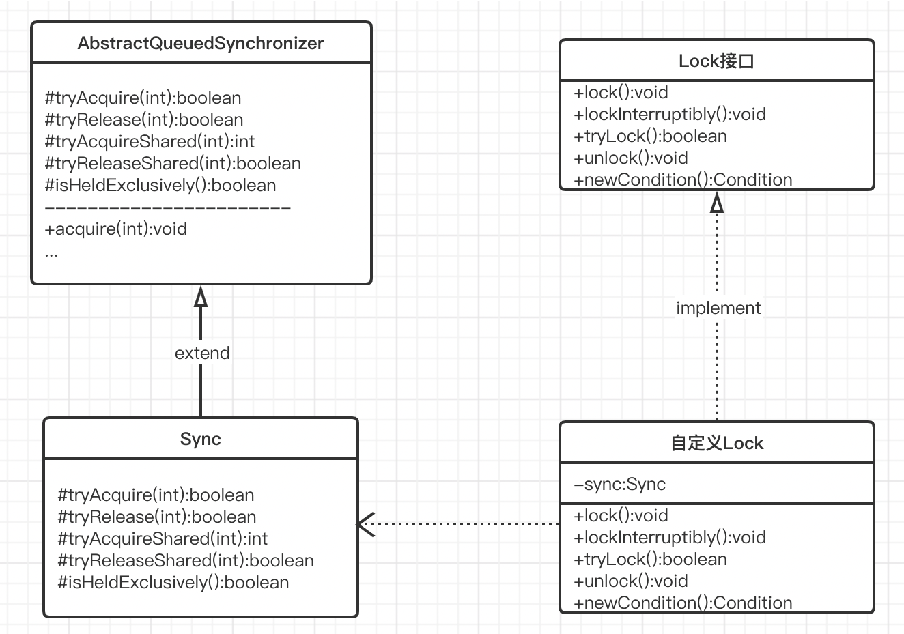
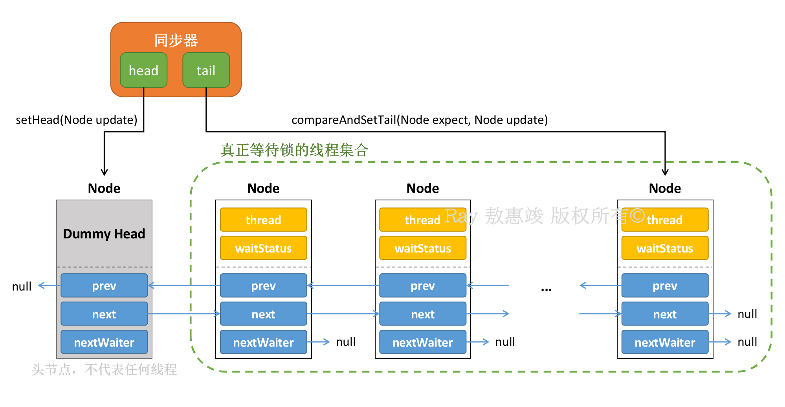
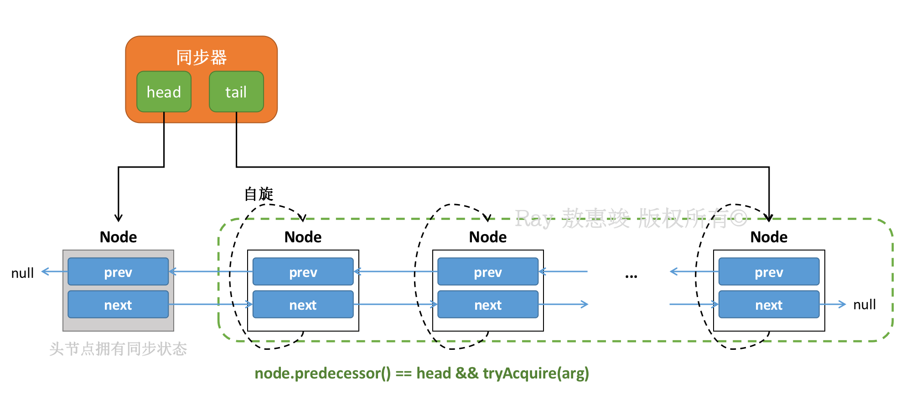
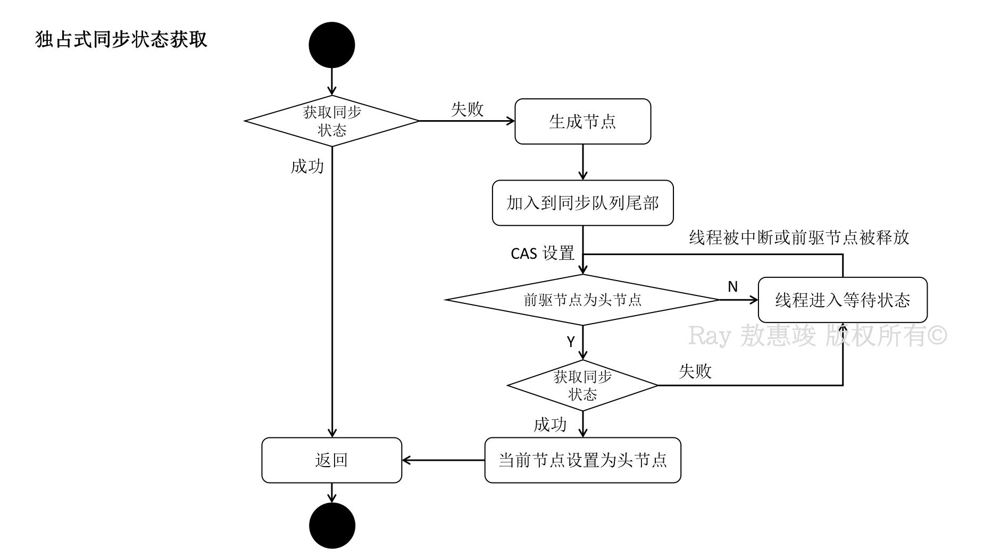
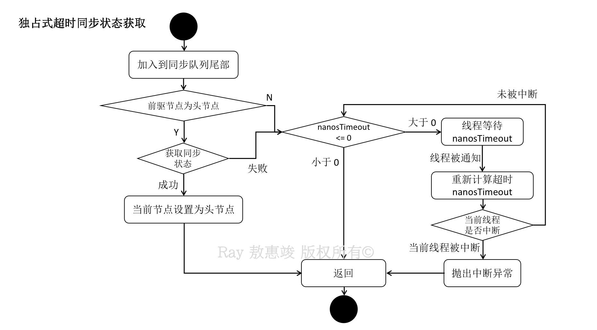
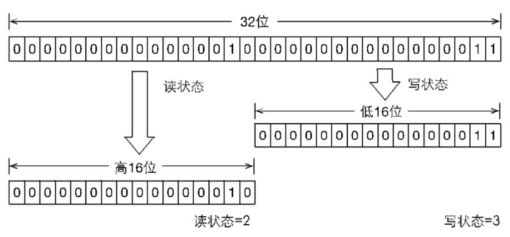
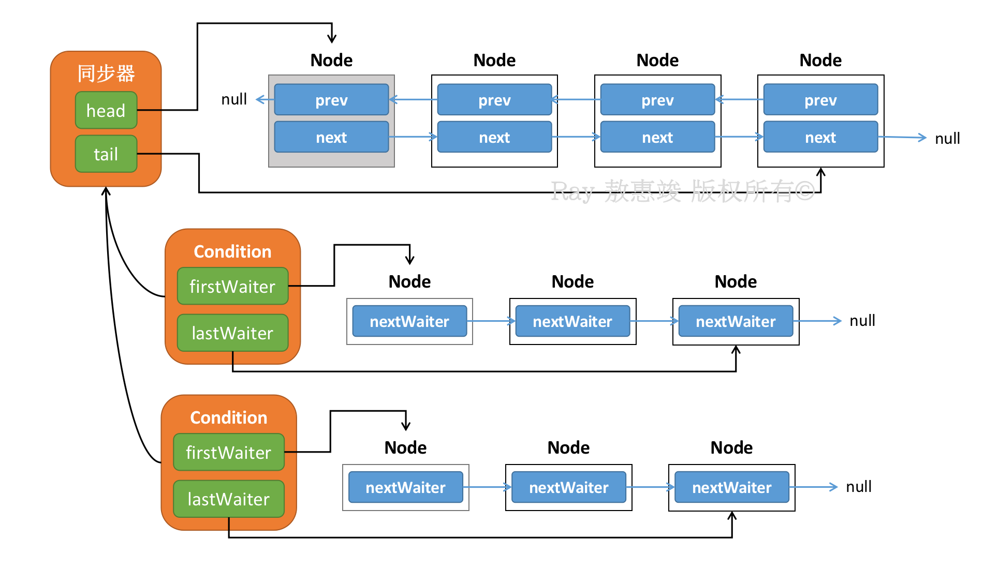
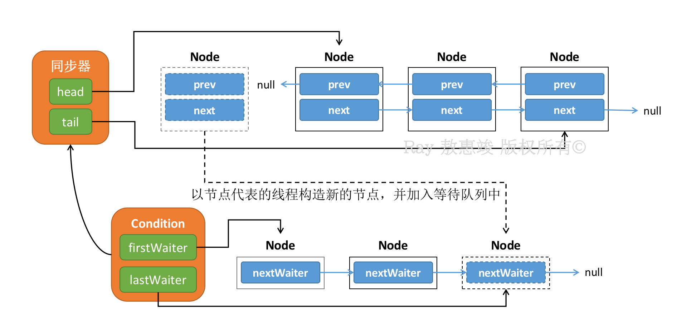
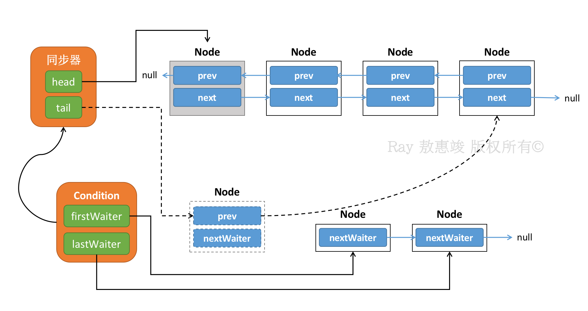

锁是控制多个线程访问共享资源的方式，是实现多线程同步的重要思想。在 `java.util.concurrent` 包中有很多相关的 API 和组件。

<!-- more -->

一般来说，锁能够防止多个线程同时访问一个共享资源；个别锁允许并发访问共享资源，如读写锁等。  
悲观锁（包括独占锁和共享锁）估计很多人都很熟悉。在开始之前，先简要说一下乐观锁的内容。

# 乐观锁与 CAS

乐观锁从严格的意义来看，并不是锁；它的每一次操作，是在假设数据没有冲突的情况下进行的，如果因为数据冲突导致失败，就开始重试，直至成功为止。  
因此乐观锁是**无锁编程**的范畴。

CAS 是一种实现乐观锁的方式，全称 Compare And Set，使用到三个操作数：**变量内存地址**，**预期值**，**新值**。  
这种算法让 CPU 去比较内存中某个值是否和预期的值相同，如果相同则将这个值更新为新的值，不相同则不做更新。  
CAS 是 CPU 指令，其读写都具有原子性，其实现方式是通过 C/C++ 调用 CPU 指令完成的：我们只能通过 JNI 与操作系统交互。

因此，CAS 可以保证并发安全，但**并不会保证线程同步**，而是“乐观”地认为数据在更新期间没有收到其它线程的影响。


## ABA 问题

正是因为 CAS 的这份“乐观”，会导致一个数据同步的**过程问题**。

比如此时有两个线程同时对同一个值进行 CAS 操作，从初始值 A 更新到 B：
* 线程 1 抢先获得时间片，线程 2 被阻塞；线程 A 发现期望值的确是 A，将其替换为 B；
* 在线程 2 恢复之前，线程 3（或者继续是线程 1）过来进行 CAS 操作：期望值为 B，更新到 A；线程 3 抢先获得了时间片，因为条件刚好符合，所以值被更新回 A；
* 线程 2 恢复后，发现初始值和期望值相同，又将值更新到 B。

由此：虽然线程 2 完成了更新的操作，但是它并不知道值从 A->B->A 的变化过程。

ABA 场景表面上不会造成问题，但是在对过程敏感的业务中，我们需要解决 ABA 问题。

<br/>

讲完了 CAS，我们就来简单来介绍一下这些 API 和组件的实现细节和使用方式。

# Lock 接口

在 Lock 接口之前，Java 使用 `synchronized` 关键字隐式地获取和释放对象同步锁。  
在随后的 Lock 接口中，虽然使用的时候需要显式地获取和释放锁，没有 synchronized 来得便捷；但是 Lock 增加了获取和释放锁的**可操作性**、**可中断**地获取锁、**超时获取锁**等功能，使用更灵活，扩展性更强：

| 特性       | 描述 |
| --------------- | ------- |
| 尝试非阻塞地获得锁 | 当前线程尝试获取锁，如果此刻锁没被其它线程获得，则成功获取并持有锁     |
| 能被中断地获取锁   | 与 synchronized 不同：获得锁的线程能够响应中断，当获取到锁的线程被中断时，中断异常会被抛出，同时锁会被释放  |
| 超时获取锁        | 在指定时间内获得锁，如果截止时间到了依旧无法获得锁，则返回          |

```java
package java.util.concurrent.locks;


public interface Lock {

    void lock()    // 获取锁
    // 如锁同时被另一线程拥有，则发生阻塞


    void lockInterruptibly() throws InterruptedException;  // 获得锁，但不确定地发生阻塞
    // 相当于一个超时设为无限的 tryLock()
    // 与 lock() 不同：lockInterruptibly() 会响应中断，即在锁的获取中可以中断当前线程
    // 如线程被中断：抛出 InterruptedException


    boolean tryLock()  // 尝试获得锁而不发生阻塞
    // 抢夺可用的锁，获得成功返回 true，否则返回 false


    /**
     * 尝试获得锁，阻塞时间不超过给定时间的值
     * 以下 3 种情况会返回：
     *  1. 当前线程在超时时间内获得了锁，返回 true
     *  2. 当前线程在超时时间内被中断
     *  3. 超时时间结束，返回 false
     * 
     * TimeUnit：枚举类型，可取 SECONDS、MILLISECONDS、MICROSECONDS、NANOSECONDS
     */
    boolean tryLock(long time, TimeUnit unit) throws InterruptedException;
    // 使用 tryLock 场景：如一个线程在等待锁时被中断，且占有锁的线程也被中断，这会产生死锁


    void unlock()    // 释放锁


    Condition newCondition()  // 返回一个与该锁相关的条件对象
    // 一个锁对象可有一个或多个相关的条件对象；一个条件对象与当前锁绑定
    // 当前线程获得了锁，才能调用条件对象的 wait() 方法；调用后锁会被释放
    // 命名习惯：给每个条件对象命名为可反映出所表达条件的名字
}
```

使用：
```java
Lock lock = new ReentrantLock();
lock.lock();
try {
    doSomething();
} finally {
    lock.unlock();
}
```

以上虽然也是 synchronized 的原理解释代码，但是 synchronized 是上述这一套加锁解锁的固化，而单纯使用 Lock 接口能更灵活地实现业务。

<br/>

## 基础：**AQS**

`AbstractQueuedSynchronizer`，抽象队列同步器，是用于构建锁或其它同步组件的基础框架。

AQS 使用一个整型（`int`）成员变量 `state` 来表示同步状态，通过**内置 FIFO 双向队列**完成资源获取线程的排队工作。



显然，AQS 采用了模版方法设计模式（抽象类），自身并没有实现任何同步接口，仅仅定义了若干个同步状态获取和释放的方法。  
AQS 既可以支持独占式地获取同步状态，也可以支持共享式获取状态，方便不同类型同步组件的实现。  
使用者必须要继承**同步器**（某个 `Sync`），重写指定的方法（如上图中的 `#` 方法），或者继承 AQS 的一些实体类来实现具体的锁。

自定义的 Lock 在使用时，一般被定义为静态内部类。  
自定义的 Lock 在调用 lock() 时，会调用 AQS 的 `acquire()` 方法。

大概的区别是：  
AQS 面向**锁的实现者**，简化了锁的实现方式，屏蔽了同步状态的管理，线程的排队、等待、唤醒等操作；锁面向**锁的使用者**，定义了使用者和锁的交互接口。

### **基本数据结构**

```java
abstract AbstractQueuedSynchronizer {

    static final class Node {  // 代表 FIFO 队列的数据结构
        ...

        // 节点代表的线程被取消等待状态（超时或者被中断）
        static final int CANCELLED = 1;

        // 中间状态，表示当前的节点已经有后继节点的线程在尝试获取状态。
        // 当前节点如果释放了同步状态，将会通知后继节点
        static final int SIGNAL = -1;

        // 节点在等待池中；节点线程等待在 Condition 中
        // 当其他线程调用 Condition 的 signal() 方法后，线程从等待池转移到同步队列，加入到对同步状态的获取。
        static final int CONDITION = -2;

        // 共享式状态，无条件地将行为传播下去
        static final int PROPAGATE = -3;

        volatile int waitStatus;  // 等待状态（默认为 0）

        // 同步队列中的前后节点
        // 双向链表，每个节点需要保存⾃⼰的前驱节点和后继节点的引⽤
        volatile Node prev;
        volatile Node next;

        volatile Thread thread;  // 节点所代表的线程

        // 等待池中的后续节点
        // 该属性⽤于 Condition 条件队列或者共享锁，独占锁模式下永远是 null
        Node nextWaiter;
        // 由此可以得知，等待池是 FIFO 单向队列，由 Condition 内部实现
    }

    ...

    // 同步队列头节点，不代表任何线程，是⼀个哑节点（dummy node）
    private transient volatile Node head;

    // 同步队列尾节点，每⼀个请求锁的线程会加到队尾
    private transient volatile Node tail;

    private volatile int state;  // 大于 0 为没被占用状态，小于 0 为已被占用状态：相当于计数器

    ...

    private transient Thread exclusiveOwnerThread;  // 记录当前持有锁的线程

    ...

    // 自定义的锁利用以下已实现的方法来实现各自需要的业务：

    protected final int getState() {
        return state;
    }

    protected final void setState(int newState) {
        state = newState;
    }

    protected final boolean compareAndSetState(int expect, int update) {  // CAS 方法
        return unsafe.compareAndSwapInt(this, stateOffset, expect, update);
    }

    /*
     * 注：CAS 操作基本都是由 Unsafe 工具类的 compareAndSetXxx() 实现的
     */

    ...

    // 以下为常用的可以重写的方法：

    protected boolean tryAcquire(int arg) {  // 独占式获取同步状态
        throw new UnsupportedOperationException();
    }
    // 实现时需要查询当前状态，且判断当前同步状态是否符合预期

    protected boolean tryRelease(int arg) {  // 独占式释放同步状态
        throw new UnsupportedOperationException();
    }

    protected int tryAcquireShared(int arg) {  // 共享式获取同步状态
        throw new UnsupportedOperationException();
    }

    protected boolean tryReleaseShared(int arg) {  // 共享式释放同步状态
        throw new UnsupportedOperationException();
    }

    protected boolean isHeldExclusively() {  // 判断当前同步器是否被当前线程所独占
        throw new UnsupportedOperationException();
    }

    /* 
     * 以下为模板方法，主要有三类：
     * 
     * 1. 独占式获取 / 释放同步状态
     * 2. 共享式获取 / 释放同步状态
     * 3. 查询并获取同步队列中的等待线程的情况
     */

    // 独占式获取，忽略中断。
    public final void acquire(int arg) {
        if (!tryAcquire(arg) &&   // 保证线程安全地去获取同步状态，需要自己实现
            acquireQueued(addWaiter(Node.EXCLUSIVE), arg))  // 以“死循环”的方式获取同步状态
            selfInterrupt();  // 设置中断标识位
    }

    // 独占式获取，响应中断。
    public final void acquireInterruptibly(int arg) throws InterruptedException {
        if (Thread.interrupted())
            throw new InterruptedException();
        if (!tryAcquire(arg))
            doAcquireInterruptibly(arg);
    }

    // 独占式获取，有超时时间控制
    public final boolean tryAcquireNanos(int arg, long nanosTimeout) throws InterruptedException {
        if (Thread.interrupted())
            throw new InterruptedException();
        return tryAcquire(arg) ||
            doAcquireNanos(arg, nanosTimeout);
    }

    // 独占式释放同步状态
    public final boolean release(int arg) {
        if (tryRelease(arg)) {  // 调用实现的方法释放锁，随后唤醒后继节点
            Node h = head;
            if (h != null && h.waitStatus != 0)
                unpackSuccessor(h);
            return true;
        }
        return false;
    }

    // 共享式获取同步状态
    public final void acquireShared(int arg) {
        if (tryAcquireShared(arg) < 0)
            doAcquireShared(arg);
    }

    // 共享式获取同步状态
    public final void acquireSharedInterruptibly(int arg) throws InterruptedException {
        if (Thread.interrupted())
            throw new InterruptedException();
        if (tryAcquireShared(arg) < 0)
            doAcquireSharedInterruptibly(arg);
    }

    ...

    // 共享式释放同步状态
    public final boolean releaseShared(int arg) {
        if (tryReleaseShared(arg)) {  // 调用实现的方法释放锁，随后唤醒后继节点
            doReleaseShared();
            return true;
        }
        return false;
    }

    ...

    // 获取同步队列中等待的所有线程
    public final Collection<Thread> getQueuedThreads() {
        ArrayList<Thread> list = new ArrayList<>();
        for (Node p = tail; p != null; p = p.prev) {
            Thread t = p.thread;
            if (t != null)
                list.add(t);
        }
        return list;
    }

    ...
}
```


### **同步队列**

AQS 通过同步队列完成对同步状态的管理。

同步队列里的每一个节点，都代表着一个获取同步状态失败的线程，用来保存该线程的引用、等待状态、前驱后驱节点等信息。

头节点永远是一个哑节点，不代表任何线程；但有的时候可以被看作代表当前持有锁的线程。  
因此 head 指向的 Node 对象中的 thread 属性永远是 `null`。



**a. 加入队列**

当前线程获取同步状态失败（AQS 的 `state` < `0`）时：同步器将当前线程的等待状态等信息构造成一个独占式节点，随后添加到同步队列里面；  
此时当前线程会被阻塞。

很多个线程进行操作的话，同步队列很有可能在一个时间点不只有一个线程的加入。  
因此代表线程的节点需要添加进同步队列的时候，需要**保证线程安全性**：所以才会使用 `compareAndSetTail()` 这样的 CAS 方法进行操作。

**b. 离开队列**

当同步状态被释放（`state` > `0`）的时候：唤醒头节点代表的线程，该线程会尝试再次获取同步状态。

头节点在获取同步状态成功，释放同步状态的时候，会唤醒后面的节点。  
后继节点被唤醒之后，意味着**它是持有该同步锁的线程**，它也就是同步队列中的**新的头节点**。

相对于加入队列（设置队列尾节点），离开队列的永远都是头节点，只有一个线程：头节点的后继节点才能够成为下一个头节点；因此头节点的设置会比尾节点简单。

<br/>

## 实现：独占式同步状态获取与释放

**<big>1. 获取同步状态</big>**：调用 `acquire()`

该方法对中断**不敏感**；也就是说，线程获取同步状态失败后被添加到同步队列中，后续对该线程进行**中断操作**的话，**线程不会被移出同步队列**。

**<big>2. 释放同步状态</big>**

调用 `tryRelease(arg)` 释放同步状态，然后唤醒头节点非 CANCELLED 状态的后继节点。

相关的实现方法：

```java
abstract AbstractQueuedSynchronizer {

    ...

    // 根据自定义的独占锁重写 tryAquire()：
    protected boolean tryAcquire(int arg) {  // 要保证线程能安全地去获取同步状态
        throw new UnsupportedOperationException();
        // 提示：实现时采用 CAS 相关的方法，如 compareAndSetState(expect, update)
    }

    // 根据自定义的独占锁重写 tryRelease()：
    protected boolean tryRelease(int arg) {  // 独占式释放同步状态
        throw new UnsupportedOperationException();
        // 提示：setState(0)
    }

    ...

    // 独占式获取，忽略中断。
    // This method can be used to implement method Lock.lock.
    public final void acquire(int arg) {
        if (!tryAcquire(arg) &&
            /* 
             * 对每一个请求过来的线程，无论它先前是否请求过该同步状态，先基于它构造独占式节点（EXCLUSIVE）；
             * 再将该节点添加至同步队列的尾节点；
             * 后以“死循环”的方式获取同步状态
             */
            acquireQueued(addWaiter(Node.EXCLUSIVE), arg))  // 线程在尝试获取同步状态的过程中如果被中断，该方法返回 true；否则返回 false
            // 设置中断标识位
            selfInterrupt();  // 由此可看出，线程如果被中断过，随后获得了同步状态，是不会马上响应中断的；而是在随后补上标识位
    }

    // 独占式获取，响应中断。
    public final void acquireInterruptibly(int arg) throws InterruptedException {
        if (Thread.interrupted())
            throw new InterruptedException();
        if (!tryAcquire(arg))
            doAcquireInterruptibly(arg);
    }

    ...

    // 独占式释放同步状态
    public final boolean release(int arg) {
        if (tryRelease(arg)) {  // 调用实现的方法释放锁，随后唤醒后继节点
            Node h = head;
            if (h != null && h.waitStatus != 0)  // head 状态不为 0（初始值）就可以唤醒后继节点
                unparkSuccessor(h);
            return true;
        }
        return false;
    }

    ...

    // 承上：将构造的独占式节点放入到同步队列中
    private Node addWaiter(Node mode) {
        Node node = new Node(Thread.currentThread(), mode);
        // 第一次先尝试快速加入（fast path）队列；第一遍失败后才进入 enq()（full enq）中
        Node pred = tail;
        if (pred != null) {  // 尾节点不为空：同步队列中已经有在等待的线程
            node.prev = pred;
            if (compareAndSetTail(pred, node)) {  // 确保节点能够被线程安全地添加
                // 通常这个 if block 在并发量不高的情况下会成功
                pred.next = node;  // 完成双向链表的构建
                return node;
            }
        }
        // 尾节点为空，或者 CAS 添加失败：
        enq(node);  // “死循环”将 node 非独占式地插入到同步队列的尾部
        return node;
    }

    ...

    // 在队列中的线程独占地、非中断式（不受中断影响）地获取同步状态
    final boolean aquireQueued(final Node node, int arg) {
        boolean failed = true;
        try {
            boolean interrupted = false;
            for (;;) {  // 自旋："死循环"中尝试获取同步状态
                final Node p = node.predecessor();
                // 只有其前驱节点是头节点的线程，才有资格尝试获取同步状态
                if (p == head && tryAcquire(arg)) {
                    setHead(node);  // 新的头节点
                    p.next = null;  // 让 GC 去回收线程代表的节点
                    failed = false;  // 双反，即获取同步状态成功 succeed
                    return interrupted;  // 返回当前线程在等待获取同步状态时是否被中断过
                }
                // 如果不是头节点，或是获取失败：
                // 先：跳过已经被 cancell 的节点
                // 设置前驱节点状态为 SIGNAL，以便当前线程阻塞后，前驱节点能根据 SIGNAL 状态唤醒自己
                // 前驱节点获取同步状态成功后，会唤醒后续的线程
                if (shouldParkAfterFailedAcquire(p, node) &&
                    // 后：阻塞（LockSupport.park()）节点代表的线程
                    // 使线程进入 waiting 状态，等待前驱节点唤醒
                    // 且检查当前线程是否可以被中断
                    parkAndCheckInterrupt())
                    interrupted = true;
            }
        } finally {
            if (failed)  // 获取失败
                cancelAcquire(node);
        }
        // 线程在等待过程中如果被中断了，该方法返回 true；否则返回 false
    }

    ...

    // 先看看快速加入行不行，行就不用进入下面这个死循环里面了
    private Node enq(final Node node) {
        for (;;) {  // “死循环”
            Node t = tail;
            if (t = null) {  // 尾节点为空：它是同步队列中的第一个线程
                if (compareAndSetHead(new Node()))
                    tail = head;  // 第一个线程：tail 和 head 是同一个节点
            } else {  // 尾节点不为空，快速加入失败：CAS 方法将节点添加至同步队列尾部
                node.prev = t;
                if (compareAndSetTail(t, node)) {
                    t.next = node;
                    return t;  // 只有添加成功才能从该方法返回
                }
            }
        }
    }

    ...

    // 唤醒后继节点
    private void unparkSuccessor(Node node) {
        int ws = node.waitStatus;
        if (ws < 0)
            // 将非 cancelled 状态的线程设为 0
            compareAndSetWaitStatus(node, ws, 0);
            // head 状态为 0（初始值），代表 head 为新入队的节点，其后继节点即将被唤醒，或已经被唤醒

        // 循环找到当前头节点的非空后继节点，或者从尾节点前溯找到的最接近头节点的后继节点
        Node s = node.next;
        if (s == null || s.waitStatus > 0) {
            s = null;
            for (Node t = tail; t != null && t != node; t = t.prev)
                if (t.waitStatus <= 0)
                    s = t;
        }
        if (s != null)
            LockSupport.unpark(s.thread);  // 唤醒操作
    }

    ...
}
```

分析源码可知：

**线程获取同步状态策略**：
1. 同步器维护一个同步队列，队列中每一个节点代表一个线程；
2. 每当节点的**前驱节点出队**，或者自身被中断、或从等待状态返回时：检查自己的前驱节点是否为头节点；如果是，则节点代表的线程会去尝试获取同步状态；
3. 前驱节点不是头节点的线程并不能去获取同步状态；它们会保持在同步队列中；
4. 所有获取同步状态失败了的线程都在队列中进行**自旋**。各自在自旋的时候不会相互通信；
5. 移出队列（停止自旋）的条件是前驱节点为头节点，且成功获取了同步状态。

如此符合 FIFO，并且便于对过早的通知进行处理，比如对一些前驱节点不是头节点的线程节点的通知。





**线程释放同步状态策略**：
* 调用 `tryRelease(arg)` 释放同步状态，然后唤醒头节点非 CANCELLED 状态的后继节点。

<br/>

## 实现：共享式同步状态获取和释放

共享式获取与独占式获取的区别在于：同一时刻能否允许多个线程同时获取到同步状态。  
资源在被共享状态时，共享的线程都可以访问资源，独占式的不能访问；资源在被独占式访问时，其他所有类型的线程都不能访问资源。

共享式释放与独占式释放的区别在于：共享式释放必须要保证同步状态 / 资源**被线程安全地释放**。

相关的实现方法：

```java
abstract AbstractQueuedSynchronizer {

    ...

    // 根据自定义的共享锁重写 tryAquireShared()：
    protected int tryAcquireShared(int arg) {  // 共享式获取同步状态
        throw new UnsupportedOperationException();
    }

    // 根据自定义的共享锁重写 tryReleaseShared()：
    protected boolean tryReleaseShared(int arg) {  // 共享式释放同步状态
        throw new UnsupportedOperationException();
    }

    ...

    // 共享式获取同步状态
    public final void acquireShared(int arg) {
        if (tryAcquireShared(arg) < 0)  // 尝试获取同步状态，>= 0 表示获取成功，< 0 表示获取失败，进入自旋
            doAcquireShared(arg);  // 进入自旋
    }

    // 共享式获取同步状态
    public final void acquireSharedInterruptibly(int arg) throws InterruptedException {
        if (Thread.interrupted())
            throw new InterruptedException();
        if (tryAcquireShared(arg) < 0)
            doAcquireSharedInterruptibly(arg);
    }

    ...

    // 共享式释放同步状态
    public final boolean releaseShared(int arg) {
        if (tryReleaseShared(arg)) {  // 调用实现的方法释放锁，随后唤醒后继节点
            doReleaseShared();
            return true;
        }
        return false;
    }

    ...

    // 共享式获取同步状态，代码结构类似于 acquireQueued()
    private void doAcquireShared(int arg) {
        final Node node = addWaiter(Node.SHARED);  // 此时添加的是共享式节点
        boolean failed = true;
        try {
            boolean interrupted = false;
            for (;;) {  // 自旋
                final Node p = node.predecessor();
                if (p == head) {  // 同样：还是只有头节点才有资格获取同步状态
                    int r = tryAcquireShared(arg);  // 尝试获取同步状态
                    if (r >= 0) {
                        setHeadAndPropagate(node, r);  // 将 head 指向自己，还有剩余资源可以再唤醒之后的线程
                        p.next = null;  // 让 GC 回收
                        if (interrupted)
                            selfInterrupted();  // 中断状态随后补上
                        failed = false;
                        return;  // 从自旋中退出
                    }
                }
                if (shouldParkAfterFailedAcquire(p, node) &&
                    parkAndCheckInterrupt())
                    interrupted = true;
            }
        } finally {
            if (failed)
                cancelAcquire(node);
        }
    }

    ...

    private void setHeadAndPropagate(Node node, int propagate) {
        Node h = head;
        setHead(node);  // head 指向自己
        // 如果条件符合，继续唤醒下一个后继节点的线程
        if (propagate > 0 || h == null || h.waitStatus < 0) {
            Node s = node.next;
            if (s == null || s.isShared())
                doReleaseShared();
        }
    }

    ...

    // 共享式释放同步状态，逻辑类似于 unparkSuccessor()，但代码逻辑不同
    private void doReleaseShared() {
        for (;;) {
            Node h = head;
            if (h != null && h != tail) {  // 头节点非空且非尾节点：同步队列中有共享节点在等待获取同步状态
                int ws = h.waitStatus;
                if (ws == Node.SIGNAL) {  // head 的状态为 SIGNAL
                    if (!compareAndSetWaitStatus(h, Node.SIGNAL, 0))  // 保证同步状态能被线程安全地释放
                        continue;  // 重试
                    unparkSuccessor(h);  // head 状态从 SIGNAL 成功被设置为 0：唤醒后继节点
                }
                else if (ws == 0 &&
                        !compareAndSetWaitStatus(h, 0, Node.PROPAGATE))
                    continue;  // 重试
            }
            if (h == head)  // 头节点非 SIGNAL 或初始状态
                break;  // 取消释放
        }
    }

    ...
}
```

通过比较模板方法可知，共享式获取同步状态会立刻相应中断，而独占式获取同步状态不会马上响应。

即使是共享式获取，AQS 也是严格按照同步队列的入队顺序唤醒自旋的线程。

<br/>

## 实现：超时获取同步状态

也属于独占式的同步状态更新。

```java
abstract AbstractQueuedSynchronizer {

    ...

    protected boolean tryAcquire(int arg) {  // 独占式获取同步状态
        throw new UnsupportedOperationException();
    }

    protected boolean tryRelease(int arg) {  // 独占式释放同步状态
        throw new UnsupportedOperationException();
    }

    ...

    // 独占式获取，有超时时间控制
    public final boolean tryAcquireNanos(int arg, long nanosTimeout) throws InterruptedException {
        if (Thread.interrupted())
            throw new InterruptedException();
        return tryAcquire(arg) ||
            doAcquireNanos(arg, nanosTimeout);
    }

    ...
}
```

`doAcquireNanos()` 实现与 `aquireQueued()` 相差无几，只是多了一些超时的处理；同时会相应中断，线程被中断的时候会抛出异常。  
因此 `doAcquireNanos(int, long)` 也是 `acquireInterruptibly(int)` 的升级版。



<br/>

## 应用：自定义

有一个设计：只允许最多两个线程同时访问，超过两个线程的访问将被阻塞。

**1. 确定访问模式**

应该采用共享式访问模式，实现 `tryAcquireShared()` 和 `tryReleaseShared()` 等共享式方法。

**2. 定义资源数**

资源数定为 `2`，即设置 `state` 为 2；每当一个线程获得资源时，`state` 减 1，直至减到 0 时，说明已经有两个线程访问到了资源，其他访问线程将会被阻塞。  
因此 `state` 的值范围是 [0, 1, 2]。

可以使用 `compareAndSetState()` 等 CAS 设置方法保证原子性。

**3. 组合自定义同步器**

```java
class TwinLock implements Lock {

    private final Sync sync = new Sync(2);  // 资源数

    // 组合自定义同步器
    private static final class Sync extends AbstractQueuedSynchronizer {

        Sync(int count) {
            if (count <= 0) {
                throw new IllegalArgumentException("Count should large than 0.");
            }
            setState(count);
        }

        public int tryAcquireShared(int reduceCount) {
            for (;;) {
                int current = getState();
                int newCount = current - reduceCount;
                if (newCount < 0 || compareAndSetState(current, newCount)) {
                    return newCount;
                }
            }
        }

        public boolean tryReleaseShared(int returnCount) {
            for (;;) {
                int current = getState();
                int newCount = current + returnCount;
                if (compareAndSetState(current, newCount)) {
                    return true;
                }
            }
        }
    }

    @Override
    public void lock() {
        sync.acquireShared(1);
    }

    @Override
    public void unlock() {
        sync.releaseShared(1);
    }

    @Override
    public void lockInterruptibly() {
    }

    @Override
    public boolean tryLock() {
        return false;
    }

    @Override
    public boolean tryLock(long time, TimeUnit unit) {
        return false;
    }

    @Override
    public Condition newCondition() {
        return null;
    }
}
```

<br/>

## 应用：ReentrantLock 可重入锁

顾名思义，这是能够重入的锁：即同一个线程可重复获得已经持有的锁（对资源重复加锁）。

可重入锁基于独占式的同步器进行设计。
* 加锁的时候，判断当前请求同步状态的线程和当前占有锁的线程是否为同一个；如果是的话就会再次获取；
* 另外维护了一个锁被持有的计数（hold count），用于跟踪对 `lock()` 的嵌套调用；因此被一个锁保护的代码块可调用另一个使用相同锁的方法。
    * 如：Block A 中代码调用 method B，B 与 A 持有相同的锁对象，则锁的持有计数累加至 2
    * 调用 B 执行完后，锁被释放一次，因此计数减为 1

可重入锁支持公平和非公平的选择。
* 公平性是针对于锁的获取顺序来说的，先进先出符合公平性

<br/>

我们现在回过头来看前面提到的独占式获取同步状态：

如果一个已经占有锁的线程尝试再次获得同一个锁，那么按照代码逻辑，它自己会被自己阻塞；因为上述的独占式基本结构没有考虑这个场景。

可重入锁相关代码：

```java
package java.util.concurrent.locks;

public class ReentrantLock implements Lock, java.io.Serializable {

    ...

    private final Sync sync;

    // 组合同步器
    abstract static class Sync extends AbstractQueuedSynchronizer {
        ...

        abstract void lock();

        // 非公平的 tryLock，默认实现
        final boolean nonfairTryAcquire(int acquires) {
            final Thread current = Thread.currentThread();
            int c = getState();
            if (c == 0) {  // 当前没有线程获得同步状态
                if (compareAndSetState(0, acquires)) {  // 只要 CAS 成功，线程就能获得锁，没有 FIFO 的概念
                    setExclusiveOwnerThread(current);  // 设置同步状态成功的话，设置独占线程
                    return true;
                }
            }
            // 再次获得同步状态的处理逻辑
            else if (current == getExclusiveOwnerThread()) {  // 判断当前的线程是否就是已经获得同步状态的线程：
                int nextc = c + acquires;  // 计算新的 state
                if (nextc < 0)  // overflow
                    throw new Error("Maximum lock count exceeded");
                setState(nextc);
                return true;
            }
            return false;
        }

        protected final boolean tryRelease(int releases) {
            int c = getState() - releases;
            if (Thread.currentThread() != getExclusiveOwnerThread())  // 必须是当前线程才能释放同步状态
                throw new IllegalMonitorStateException();
            boolean free = false;
            if (c == 0) {  // 持有线程数是 0，完全释放
                free = true;  // 返回 true
                setExclusiveOwnerThread(null);
            }
            setState(c);
            return free;
        }

        ...
    }

    ...

    // 公平性同步器
    static final class FairSync extends Sync {
        ...

        protected final boolean tryAcquire(int acquires) {
            final Thread current = Thread.currentThread();
            int c = getState();
            if (c == 0) {
                if (!hasQueuedPredecessors() &&  // 当前节点是否有前驱节点
                    compareAndSetState(0, acquires)) {  // 设置同步状态成功
                    setExclusiveOwnerThread(current);  // 设置独占线程
                    return true;
                }
            }
            // 同 nonfairTryAcquire()：再次获得同步状态的处理逻辑
            else if (current == getExclusiveOwnerThread()) {
                int nextc = c + acquires;
                if (nextc < 0)
                    throw new Error("Maximum lock count exceeded");
                setState(nextc);
                return true;
            }
            return false;
        }
    }

    ...

    /**
     * 构建可重入锁
     */
    public ReentrantLock() {
        sync = new NonFairSync();
    }

    /**
     * 构建带公平策略的锁
     * 默认为 false
     * 
     * 锁的公平性：先发起的对锁获取的请求一定会先被满足，这样才是公平的；反过来是不公平的
     * 公平锁说明锁的获取是顺序的，它偏爱等待时间最长的线程，但会大大降低性能
     * 非公平锁在对 TPS 要求高的场景中效率更高
     * 而公平锁能减少饥饿发生的概率
     */
    public ReentrantLock(boolean fair) {
        sync = fair ? new FairSync() : new NonFairSync();
    }

    ...
}
```

基本结构的使用：
```java
myLock.lock();
try {
    // critical section
}
finally {
    myLock.unlock();
}
```

小结：
* 确保任何时候只有一个线程进入 critical section
* 当其他线程调用 `lock()` 时将会被阻塞，直到第一个线程释放该锁对象

`synchronized` 也“隐式”地实现了可重入性，因为在每次的 `monitorenter` 和 `monitorexit` 之间维护了一个计数器。

注意：
* 锁不能使用在 `try-with-resource` 语句
    * 首先，“解锁”的方法名不是 close
    * try-with-resource 在使用时希望声明新变量；而锁是**多个线程共享的变量，不能随便新建**
* 如在临界区之前抛出异常，finally 将会释放锁，但数据可能会受损

<br/>

## 应用：读写锁

与独占锁和可重入锁不同，读写锁是共享式获取同步状态的实现：读操作可以并行执行，写操作将其它所有操作阻塞。  
写操作完成之后，新状态要立即对读操作可见。

因此读写锁维护的是**一对锁**。通过分离读锁和写锁，使得并发性相对于其他的排它锁有更大的提升；且简化了读写交互场景的编程方式。

在没有读写锁的实现的时候（before JDK 1.5），要实现读多写少的数据同步场景，我们需要：
* 当写操作开始时，所有晚于该写操作的操作都会进入等待状态；
* 写操作完成，释放同步状态并通知后续线程，等待的读操作才能继续执行；
* 写操作之间使用 `synchronized` 关键字进行同步。

这样读操作就不会发生脏读。

java.util.concurrent 包中的 `ReentrantReadWriteLock` 就是对读写锁的实现：

```java
package java.util.concurrent.locks;

public interface ReadWriteLock {

    Lock readLock()  // 得到一个可被多个读操作共用的读锁
    // 排斥所有写操作

    Lock writeLock()  // 获得写锁
    // 排斥所有其他读操作和写操作
}
```

基本数据结构：

```java
package java.util.concurrent.locks;

public class ReentrantReadWriteLock implements ReadWriteLock, java.io.Serializable {
    ...

    private final ReentrantReadWriteLock.ReadLock readerLock;

    private final ReentrantReadWriteLock.WriteLock writerLock;

    final Sync sync;

    public ReentrantReadWriteLock() {
        this(false);
    }

    public ReentrantLock(boolean fair) {
        sync = fair ? new FairSync() : new NonFairSync();
        readerLock = new ReadLock(this);
        writerLock = new WriterLock(this);
    }

    public ReentrantReadWriteLock.WriteLock writeLock() {
        return writerLock;
    }

    public ReentrantReadWriteLock.ReadLock readLock() {
        return readerLock;
    }

    ...

    // 当前读锁被获取的次数
    public int getReadLockCount() {
        return sync.getReadLockCount();
    }

    // 判断写锁是否被获取
    public boolean isWriteLocked() {
        return sync.isWriteLocked();
    }

    ...

    // 基于可重入锁的外部方法：

    // 当前线程持有写锁的次数
    public int getWriteHoldCount() {
        return sync.getWriteHoldCount();
    }

    // 当前线程持有读锁的次数
    public int getReadHoldCount() {
        return sync.getReadHoldCount();
    }

    ...
}
```

使用方法和可重入锁的使用结构是一样的，读操作时获取读锁，写操作时获取写锁就可以了。

| 特性      | 说明 |
| -------  | ---- |
| 公平性选择 | 支持非公平（默认）和公平的锁获取方式，吞吐量还是非公平优于公平 |
| 重进入    | 支持重进入，以读写线程为例：读线程获取锁后，能再次获得读锁；写线程获得写锁后能再次获得写锁，也能获取读锁 |
| 锁降级    | 遵循获取写锁、获取读锁再释放写锁的次序，写锁能降级为读锁  |

常应用于大多数时间为读，少数时间为写的场景。这样的场景比较多见，此时读写锁比其他一般的独占锁性能要高，提供更好的并发性和吞吐量。

<br/>

### **实现与设计（以 `ReentrantReadWriteLock` 为例）**

**1**. 读写状态的设计

万变不离其宗，还是以 `state` 来定义资源，记录同步器的状态：在 `ReentrantReadWriteLock` 中代表的是读写状态。  
往细了说，就是读锁和写锁**被获取的次数**，记录着多个读线程的状态和一个写线程的状态。

单单一个 `int` 类型的变量，怎么能记录这么多状态？  
只能说，`ReentrantReadWriteLock` 对于读写状态的设计的确是巧妙。



上图显然已经给出答案了：将 state **按位切割**，高 16 位表示读状态，低 16 位表示写状态。  
这样，读写状态的记录就变成了整型的**位运算**：
* 当前状态 state = S 时，写状态取 S 低位 S & `0x0000FFFF`，读状态取 S 高位 S >>> 16；
* 写锁重入时，计数直接累加 S + 1；读锁被获取时，计数累加 S + (1 << 16) = S + `0x00010000`。

上图的示例表示，当前线程获得了写锁，且重进入了两次；该线程又获取了读锁，且重入了一次。  
当写锁被获取时，如果读锁不为 0，那么读锁一定同时被获取了写锁的那个线程持有。

相关代码：

```java
package java.util.concurrent.locks;

public class ReentrantReadWriteLock implements ReadWriteLock, java.io.Serializable {
    ...

    final Sync sync;

    ...

    // 组合自定义同步器
    abstract static class Sync extends AbstractQueuedSynchronizer {
        ...

        static final int SHARED_SHIFT = 16;
        static final int SHARED_UNIT = (1 << SHARED_SHIFT);  // 读状态 + 1
        static final int MAX_COUNT = (1 << SHARED_SHIFT) - 1;  // 能记录的最多读/写锁分别是 65535 个
        static final int EXCLUSIVE_MASK = (1 << SHARED_SHIFT) - 1;  // 高位掩码

        // 从 state 高位中获取共享数（读锁被获取的次数）
        static int sharedCount(int c) {
            return c >>> SHARED_SHIFT;  // （无符号右移，高位补 0）
        }

        // 从 state 低位中获取独占数（写锁被获取的次数）
        static int exclusiveCount(int c) {
            return c & EXCLUSIVE_MASK;
        }

        // 记录每个线程持有的读锁数量
        static final class HoldCounter {
            int count = 0;
            final long tid = getThreadId(Thread.currentThread());
        }

        static final class ThreadLocalHoldCounter extends ThreadLocal<HoldCounter> {
            public HoldCounter initialValue() {
                return new HoldCounter();
            }
        }

        // 使用 ThreadLocal 记录当前线程持有的读锁数量
        // 每个线程都需要维护自己的 HoldCounter
        private transient ThreadLocalHoldCounter readHolds;

        // 缓存最后一个获取读锁的线程的读锁重入次数
        private transient HoldCounter cachedHoldCounter;

        // 第一个获取读锁的线程，以及持有的读锁数量
        private transient Thread firstReader = null;
        private transient int firstReaderHoldCount;

        ...  // 获取锁和释放锁的相关方法
    }

    ...

    public static class ReadLock implements Lock, java.io.Serializable {
        ...

        public void lock() {
            sync.acquireShared(1);
        }

        ...

        public void unlock() {
            sync.releaseShared(1);
        }

        ...
    }

    ...

    public static class WriteLock implements Lock, java.io.Serializable {
        ...

        public void lock() {
            sync.acquire(1);
        }

        ...

        public void unlock() {
            sync.release(1);
        }

        ...
    }

    ...
}
```

**2**. 写锁的获取与释放

写锁相关操作属于**独占式**同步状态的获取和释放：
1. 如果读锁数量不为 0；或写锁数量不为 0，并且不是可重入操作（当前持有读锁/写锁的线程不是请求写锁的线程），则获取失败；
2. 如果当前锁数量为 0，线程有资格获得写锁

读锁被获取的时候不能获取写锁的原因：需要保证写操作对所有读操作可见；  
如果在读锁被占用的时候写锁还能够被获取，那么该写操作就无法对这一次读操作可见了。

因此获取写锁需要实现 `tryAcquire(arg)`，写锁的释放需要实现 `tryRelease(arg)`。

```java
package java.util.concurrent.locks;

public class ReentrantReadWriteLock implements ReadWriteLock, java.io.Serializable {
    ...

    final Sync sync;

    ...

    // 组合自定义同步器
    abstract static class Sync extends AbstractQueuedSynchronizer {
        ...

        protected final boolean tryAcquire(int acquires) {
            Thread current = Thread.currentThread();
            int c = getState();
            int w = exclusiveCount(c);  // 获取独占锁（写锁）数量
            if (c != 0) {  // 不等于 0，存在读锁或者写锁
                if (w == 0 || current != getExclusiveOwnerThread())
                    // 1. 写锁为 0，说明存在读锁
                    // 或：2. 写锁不为 0，且当前线程不是占有着写锁的线程
                    return false;  // 获取写锁失败
                // 写锁不为 0，且满足可重入条件：
                if (w + exclusiveCount(acquires) > MAX_COUNT)
                    throw new Error("Maximum lock count exceeded");  // overflow
                setState(c + acquires);  // 因为没有竞争，直接设置状态，不需要 CAS 操作
                return true;
            }
            // 所有锁均没有被占用
            if (writerShouldBlock() ||
                // 非公平模式直接返回 false；
                // 公平模式则如果同步队列存在等待线程（hasQueuedPredecessors()），则返回 true，否则返回 false
                !compareAndSetState(c, c + acquires))  // 前面返回 false：竞争写锁，需要使用 CAS 方法
                return false;  // 抢不到就乖乖排队
            setExclusiveOwnerThread(current);
            return true;
        }

        protected final boolean tryRelease(int releases) {
            if (!isHeldExclusively())
                throw new IllegalMonitorStateException();  // 非独占：抛出异常
            int nextc = getState() - releases;
            boolean free = exclusiveCount(nextc) == 0;
            if (free)  // 写锁没有被占用
                setExclusiveOwnerThread(null);
            setState(nextc);
            return free;
        }

        ...
    }

    ...
}
```


**3**. 读锁的获取与释放

读锁相关操作则是属于**共享式**同步状态的获取和释放。

因此获取读锁需要实现 `tryAcquireShared(arg)`，读锁的释放需要实现 `tryReleaseShared(arg)`。

相对于写锁，读锁操作的实现会复杂一些：

```java
package java.util.concurrent.locks;

public class ReentrantReadWriteLock implements ReadWriteLock, java.io.Serializable {
    ...

    final Sync sync;

    ...

    // 组合自定义同步器
    abstract static class Sync extends AbstractQueuedSynchronizer {
        ...

        readHolds = new ThreadLocalHoldCounter();

        ...

        protected final int tryAcquireShared(int unused) {
            Thread current = Thread.currentThread();
            int c = getState();
            if (exclusiveCount(c) != 0 &&  // 有写锁被占用，且
                getExclusiveOwnerThread() != current)  // 占有着写锁的线程不是当前线程
                return -1;  // 失败

            // 写锁没被占用，或者当前线程占用了写锁：
            int r = sharedCount(c);  // 获取读状态
            if (!readerShouldBlock() &&  // 是否需要阻塞读线程
                r < MAX_COUNT &&
                compareAndSetState(c, c + SHARED_UNIT)) {  // CAS 设定读状态
                // ===========================
                // 从这儿开始，当前线程成功获取读锁
                // ===========================

                if (r == 0) {  // 读锁目前没被任何线程获取
                    firstReader = current;
                    firstReaderHoldCount = 1;
                } else if (firstReader == current) {  // 占有读锁的线程是请求读锁的线程自身
                    firstReaderHoldCount++;
                } else {
                    HoldCounter rh = cachedHoldCounter;
                    // 缓存为空（之前没有过任何线程获得过读锁），或最后一个获得读锁的线程不是当前线程
                    if (rh == null || rh.tid != getThreadId(current))
                        // 将当前线程的 HoldCounter 缓存到 cachedHoldCounter 中
                        cachedHoldCounter = rh = readHolds.get();
                    else if (rh.count == 0)  // 缓存中为当前线程，count 为 0：缓存刚初始化
                        readHolds.set(rh);  // 保存至 ThreadLocal 中
                    // count 加一
                    rh.count++;
                }
                return 1;  // 成功
            }

            // 跑到这里来，意味着需要阻塞读线程（当前线程占用写锁），或者 CAS 设定读状态失败（和写锁或读锁竞争失败）
            return fullTryAcquireShared(current);
        }

        ...

        // 算是补偿（redundant，冗余）方法：再给 !readerShouldBlock() 的线程一个 CAS 的机会
        final int fullTryAcquireShared(Thread current) {
            HoldCounter rh = null;
            // 进入自旋
            for (;;) {  /* 注意：进入自旋里面的逻辑，跟 tryAcquireShared() 大差不差 */
                int c = getState();
                if (exclusiveCount(c) != 0) {  // 同上，有写锁被占用，且
                    if (getExclusiveOwnerThread() != current)  // 占有着写锁的线程不是当前线程
                        return -1;  // 失败

                // 到这里：没有写锁被占用
                } else if (readerShouldBlock()) {  // 需要阻塞读线程
                    // 因此能进入这个 block 的：有其它线程在队列中等待

                    /* 
                     * 按理说，有其它线程在队列中等待，自身是需要阻塞的
                     * 但是我们需要处理重进入的情况
                     */
                    if (firstReader == current) {  // 当前线程为第一个获取读锁的线程
                        // assert firstReaderHoldCount > 0
                        // 可重入，直接跳到下面的 CAS 操作
                    } else {
                        if (rh == null) {
                            rh = cachedHoldCounter;  // 取最近一个获得读锁的线程
                            // 缓存为空（之前没有过任何线程获得过读锁），或最后一个获得读锁的线程不是当前线程
                            if (rh == null || rh.tid != getThreadId(current)) {
                                rh = readHold.get();  // 获取当前线程的 HoldCounter
                                if (rh.count == 0)  // 当前线程没有获得过读锁
                                    readHolds.remove();  // 将它从 ThreadLocal 中去掉
                            }
                        }
                        if (rh.count == 0)  // 当前线程没有获得过读锁
                            return -1;  // 获取读锁失败了，排队去吧
                        // 否则（rh.count != 0），重入读锁
                    }
                }

                if (sharedCount(c) == MAX_COUNT)
                    throw new Error("Maximum lock count exceeded");

                // 在自旋中成功获得读锁了：
                if (compareAndSetState(c, c + SHARED_UNIT)) {
                    // 以下逻辑和 线程直接获取读锁成功 那一块基本一样
                    if (sharedCount(c) == 0) {
                        firstReader = current;
                        firstReaderHoldCount = 1;
                    } else if (firstReader == current) {
                        firstReaderHoldCount++;
                    } else {
                        if (rh == null)
                            rh = cachedHoldCounter;
                        if (rh == null || rh.tid != getThreadId(current))
                            rh = readHolds.get();
                        else if (rh.count == 0)
                            readHolds.set(rh);
                        rh.count++;
                        cachedHoldCounter = rh;
                    }
                    return 1;  // 成功
                }
            }
        }

        ...

        protected final boolean tryReleaseShared(int releases) {
            Thread current = Thread.currentThread();

            // 先清理 ThreadLocal 中对应的信息
            if (firstReader == current) {
                if (firstReaderHoldCount == 1)
                    firstReader = null;
                else
                    firstReaderHoldCount--;
            } else {
                HoldCounter rh = cachedHoldCounter;
                if (rh == null || rh.tid != getThreadId(current))  // 缓存的不是当前线程
                    rh = readHolds.get();  // 从 ThreadLocal 中取
                int count = rh.count;
                if (count <= 1) {  // 该线程持有的读锁被释放完毕
                    readHolds.remove();  // 从 ThreadLocal 中移除
                    if (count <= 0)
                        throw unmatchedUnlockException();
                }
                --rh.count;  // 减少持有数量
            }

            // CAS 修改同步状态，确保线程安全
            for (;;) {
                int c = getState();
                int nextc = c - SHARED_UNIT;
                if (compareAndSetState(c, nextc))
                    return nextc == 0;  // nextc == 0 说明读锁写锁都空了；帮助唤醒同步队列后继节点中获取写锁的线程
            }
        }

        ...
    }

    ...
}
```

注 1：`readerShouldBlock()` 方法用来判定获取读锁的线程是否要被阻塞。
* 非公平状态下，写锁获取的优先级会更高，因此如果存在要读取写锁的线程，则读锁需要让步，`readerShouldBlock() = true`；
* 公平状态下则按照先进先出的顺序：有线程在排队，你新来的不能直接获得锁

注 2：`cachedHoldCounter` 有什么用？其实用处不大，主要是用来提升性能。  
将最后一次获取读锁的线程缓存到这里，比 ThreadLocal 的 map 结构性能好一些。

同理，设置 `firstReader` 和 `firstReaderHoldCount` 也一样，虽然用处不大，但是可以提升性能，使得在读锁不产生竞争的情况下，记录读锁的重入次数会非常方便快捷。  
如果一个线程使用了 `firstReader`，那么它就不需要占用 `cachedHoldCounter`。

<br/>

**4**. 锁降级

并没有任何一篇文档中写明写锁比读锁更高级，不过从上述源码浅析中可以看到，在同步状态操作的时候，的确会对写锁一些照顾。（参照**写锁的获取**）

读写锁中的“锁降级”，指的是线程持有锁的变化：持有写锁的线程，去获得读锁，随后再释放写锁。  
感兴趣可以读一下 `ReentrantReadWriteLock` 的 javadoc 给出的示例。

由此定义反推的“升级”是不可以的，试想一下，获取读锁之后，线程再次获得写锁就会将自己阻塞掉了，而且可能就没有其他线程唤醒它了，很容易造成死锁。

<br/>

# Condition 接口

有的时候根据业务，某些线程进入临界区 critical section 后，还需要满足一定条件才能执行。  
注：不能在多线程中简单使用判定后读写的方法 —— 有可能在 if 判断后被中断。

可以使用 Condition 的实现对象来管理已获得锁但还不能做有用工作的线程。

等待池是由 Condition 内部实现的。

```java
package java.util.concurrent.locks;

interface Condition {

    /**
     * 将线程放入该条件等待池里面
     * 调用后当前线程被阻塞，持有锁的话，放弃锁
     * 
     * 与当前在等待获得锁的线程不同：
     *  - 当锁可用时，该线程需等待另一线程调用同一条件的 signalAll() 才可解除阻塞
     *  - 如没有其他线程激活等待线程：死锁
     *  - 如没有任何线程解除其他线程的阻塞：程序挂起
     * 
     * 注：调用应在循环体中：
     *     while (!okToBeProceed()) { condition.await(); }
     */
    void await()
    
    
    /**
     * 进入该条件的等待池，直至线程从等待池里面移出，或到指定时间才解除阻塞
     * 超时期限到：返回 false，否则为 true
     */
    boolean await(long time, TimeUnit unit)
    
    
    /**
     * 进入该条件等待池，直到线程从等待池中被移出才解除阻塞
     * 不响应中断：如线程被中断，不会抛出 InterruptedException 异常
     */
    void awaitUninterruptibly()
    
    
    /**
     * 解除该条件的等待池里面所有线程的阻塞状态
     * 不会立即激活线程：解除阻塞的线程还需通过竞争访问数据
     */
    void signalAll()
    
    
    /**
     * 从该条件的等待池中随机选择一个线程，解除其阻塞状态
     * 如随机选择线程仍不能运行：再次被阻塞
     */
    void signal()
}
```

看着上面的方法名，是不是觉得很熟悉？

没错，Condition 方法的命名（`await()`、`signal()`、`signalAll()`）分别与 Object 同样功能的方法（`wait()`、`notify()`、`notifyAll()`）区分开。

Object 监视器（Monitor）方法和 `synchronized` 关键字配合使用；而 Condition 接口和 `Lock` 配合使用。

| 对比项  | Object Monitor Methods | Condition |
| -----  | ---------------------- | --------- |
| 前置条件 | 获取对象的锁            | 调用 Lock.lock() 获取锁<br/>调用 Lock.newCondition() 获取 Condition 对象 |
| 调用方式 | 直接调用<br>如 object.wait()        | 直接调用<br>如 condition.await() |
| 等待队列个数 | 一个（Object 只有一个 wait() / notify()） | 多个 |
| 当前线程释放锁并进入等待状态 | 支持   | 支持 |
| 当前线程释放锁并进入等待状态，在等待状态中不响应中断 | 不支持 | 支持 |
| 当前线程释放锁并进入超时等待状态 | 支持           | 支持 |
| 当前线程释放锁并进入等待状态到超时时间 | 不支持    | 支持 |
| 唤醒等待队列的一个线程 | 支持        | 支持 |
| 唤醒等待队列的全部线程 | 支持        | 支持 |

注：锁和条件都不是面向对象的设计

关键点：
* 锁用来保护代码片段，任何时刻只能有一个线程执行被保护的代码
* 锁可管理试图进入被保护代码段的线程
* 锁可拥有一个或多个相关的 Condition 条件对象
* 每个条件对象管理着已进入被保护代码段但未能运行的线程

<br/>

## 实现

等待池的实现（结合同步队列）



等待（`Condition.await()`）



通知（`Condition.signal()`）



AQS 对 Condition 相关方法的实现：

```java
...

public final void await() throws InterruptedException {
    if (Thread.interrupted())
        throw new InterruptedException();
    Node node = addConditionWaiter();
    int savedState = fullyRelease(node);
    int interruptMode = 0;
    while (!isOnSyncQueue(node)) {
        LockSupport.park(this);  // 保存线程后将其阻塞
        if ((interruptMode = checkInterruptWhileWaiting(node)) != 0)
            break;
    }
    if (acquireQueued(node, savedState) && interruptMode != THROW_IE)
        interruptMode = REINTERRUPT;
    if (node.nextWaiter != null)  // clear up if cancelled
        unlinkCancelledWaiters();
    if (interruptMode != 0)
        reportInterruptAfterWait(interruptMode);
}

...
```
