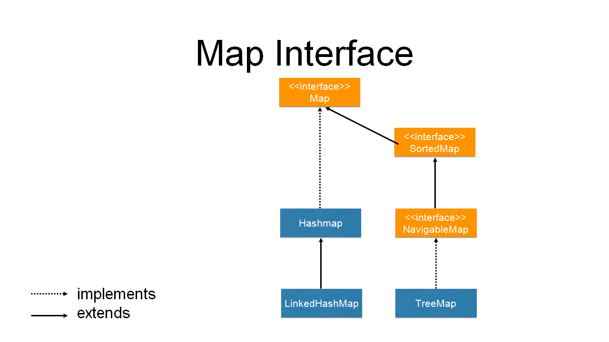

Java 集合类“二王”中的另一个，就是 Map 接口。

<!-- more -->

Map，意为映射表，表的元素是一个又一个的 `Entry` 对象。  
每个 Entry 对象为一键值对（Key-Value pair），key 与 value 可以是任意的 Object，Map 提供接口方法通过 key 去查找 value。

由于要根据 key 来区分不同的 Entry：key 不能重复，不能对同一个 key 存放两个值，而 value 可以重复（包括 `null`）。  
如对同一个 key 两次调用 put()，第二次的值会取代第一个值，put() 将返回用这个键参数存储的上一个值。

Map 不继承 Collection 接口：Map 不是集合，如继承自 Collection：键值对何去何从？作为一组对象存放于 collection？这样子会加大映射表的负担，增加操作的复杂度。


# 接口方法

JDK 为映射表的 Key 和 Value 规定了两个范型：<K, V>。

```java
package java.util;

...  // imports

public interface Map<K,V> {

    // 获取集合元素的个数
    int size();

    // 判断集合是否为空
    boolean isEmpty();

    // 检查是否包含指定的 Key
    boolean containsKey(Object key);

    // 检查是否包含指定的 Value
    boolean containsValue(Object value);

    // 根据 Key 获取 Value
    V get(Object key);

    // 添加 Entry
    V put(K key, V value);

    // 根据 Key 删除 Entry
    V remove(Object key);

    // 与 Collection 接口的 addAll 类似，将指定的 Map 对象添加进此 Map
    void putAll(Map<? extends K, ? extends V> m);

    // 清空 Map 中的所有元素
    void clear();

    ...
}
```

集合框架 JCF 并没有将映射表本身视为一个集合；而其他数据结构框架会将其视为对（pair）集合，或用键作为索引的值的集合。

可以通过一些已经实现的方法获得映射表的视图，这些视图实现了 Collection 接口或者它的子接口：

```java
public interface Map<K,V> {

    ...

    // 以下为 Map 接口提供的的集合视图：

    // 将所有的 Key 作为一个 Set 读取
    Set<K> keySet();
    // 如 map 被修改，keySet 会变为 undefined
    // 可通过 remove 等操作移除，对应地移除 map 的映射；不支持 add 类型操作

    // 将所有的 Value 作为一个集合读取
    Collection<V> values();
    // 如 map 被修改，values 会变为 undefined
    // 可通过 remove 等操作移除，对应地移除 map 的映射；不支持 add 类型操作

    // 将所有的 Entry 作为一个 Set 读取
    Set<Map.Entry<K, V>> entrySet();
    // 如 map 被修改，entrySet 会变为 undefined
    // 可通过 remove 等操作移除，对应地移除 map 的映射；不支持 add 类型操作
    // 注：只添加键不添加值是无意义的。

    ...
}
```

在这里，我们需要说一下 `hashCode()` 和 `equals()` 这两个重要的方法。

```java
{
    // 映射表比较接口，需要子类实现
    int hashCode();

    boolean equals(Object o);
}
```

<br/>

## hashCode() & equals()

如果两个对象相等（equals() 返回 `true`），则散列值 hash code 一定相同；如两个对象 hash code 值相等，对象则不一定相等。
* hash code 相等即键值对的 hash value 相等；
* hash value 相等并不一定能得出键值对相等，不同的键值对可能会得出一样的散列值，这就是**哈希冲突**，又称散列冲突。

equals()，表示某个类逻辑上的相等，不同于 `==` 判断内存地址是否相等。

有需要的话，类需要重写 equals() 实现该类对象的逻辑比较判断。

现在，假设有某一个类：

如果在**散列表数据结构**（HashSet, HashTable, HashMap 等）中用到该类，hashCode() 与 equals() 有关系，否则两者没关系。  
**该类作为散列表的 key 的话，必须重写 hashCode()。**

如果有必要重写 hashCode() 或 equals()，最好两个一起重写；如果重写了 equals()，也应重写 hashCode() 方法：
* 重写 hashCode() 之后，返回值可能相同，但 identityHashCode() 不会相同：因为 identityHashCode() 返回对象物理地址产生的 hash 值

重写 equals() 后应检查是否符合：
* 对称性
* 传递性
* 一致性
* 自反性
* 非空性

注：散列或比较函数只能作用于键，与键关联的值不能进行散列或比较。  
如不需要按照排序访问键，就最好选择散列。如果不能通过 get() 得到，返回的则是 null。


## New from JDK 1.8

```java
public interface Map<K,V> {

    ...

    // 与 get 方法类似, 但当获取不到对应的 Value 时, 返回指定的默认 Value
    default V getOrDefault(Object key, V defaultValue) {...}

    // 与 put 方法类似, 当不存在对应的 Entry 时 put 并返回 null, 若存在则返回 Value
    default V putIfAbsent(K key, V value) {...}

    // 只有当 Map 中存在 Entry 包含指定的 Key-Value 时, 才删除该 Entry
    default boolean remove(Object key, Object value) {...}

    // 只有当 Map 中存在 Entry 包含指定的 Key 以及 Value 时, 才用新的 Value 替换旧 Value
    default boolean replace(K key, V oldValue, V newValue) {...}

    // 只有当 Map 中存在 Entry 包含指定的 Key 以及任意 Value 时, 才用新的 Value 替换旧 Value
    // 返回旧 Value 或 null（如果没替换或原 Key 映射的 Value 为 null）
    default V replace(K key, V value) {...}

    ...
}
```

由于从 Java 8 开始引入了[函数式编程](/2022/02/07/fp)，因此 Map 也实现了与此相关的新接口：

```java
public interface Map<K,V> {

    ...

    // 用于构建本地缓存
    default V computeIfAbsent(K key, Function<? super K, ? extends V> mappingFunction) {...}
    default V computeIfPresent(K key, BiFunction<? super K, ? super V, ? extends V> remappingFunction) {...}
    default V compute(K key, BiFunction<? super K, ? super V, ? extends V> remappingFunction) {...}

    // 用于 Map 的合并
    default V merge(K key, V value, BiFunction<? super V, ? super V, ? extends V> remappingFunction) {...};

    // 遍历
    default void forEach(BiConsumer<? super K, ? super V> action) {...};

    // 全部替换
    default void replaceAll(BiFunction<? super K, ? super V, ? extends V> function) {...};
}
```


## 内部接口 Map.Entry

Entry 沿用了 Map 接口的范型 <K, V>，代表 Map 中每一个单独的元素。

```java
package java.util;

...  // imports

interface Entry<K,V> {
    // 获取此 Entry 的 Key
    K getKey();

    // 获取此 Entry 的 Value
    V getValue();

    // 设置此 Entry 的 Value
    V setValue(V value);

    // equals() 及 hashCode() 用于判断两个 Entry 对象是否相等
    boolean equals(Object o);
    int hashCode();

    // since 1.8, 返回一个根据 Key 来比对的比较器, 可用于排序
    public static <K extends Comparable<? super K>, V> Comparator<Map.Entry<K,V>> comparingByKey() {...}

    // since 1.8, 返回一个根据 Value 来比对的比较器, 可用于排序
    public static <K, V extends Comparable<? super V>> Comparator<Map.Entry<K,V>> comparingByValue() {...}

    // since 1.8, 返回一个根据 Key 来比对的比较器, 但比对方式来源于入参比较器
    public static <K, V> Comparator<Map.Entry<K, V>> comparingByKey(Comparator<? super K> cmp) {...}

    // since 1.8, 返回一个根据 Value 来比对的比较器, 但比对方式来源于入参比较器
    public static <K, V> Comparator<Map.Entry<K, V>> comparingByValue(Comparator<? super V> cmp) {...}
}
```

Map 中的 keySet，values，entrySet 与其息息相关。


# 子类及接口




## AbstractMap

映射表抽象类，为 Map 的实现类预先实现了许多 Map 接口声明的方法。

不过，AbstractMap 所实现的方法大多依赖于 entrySet()；而 AbstractMap 并未实现 entrySet()，它选择交给子类实现。

AbstractMap 提供了两个实现了 Map.Entry 接口的静态内部类：

```java
public static class SimpleEntry<K,V> implements Entry<K,V>, java.io.Serializable {
    // 声明 key 为 final：确保了 Entry 对象内 key 一旦被设置后就不可再修改
    private final K key;
    private V value;
    ...

    ... // 方法实现
}
```

```java
public static class SimpleImmutableEntry<K,V> implements Entry<K,V>, java.io.Serializable {
    // 声明 key 和 value 为 final：确保了 Entry 对象内 key 和v alue 一旦被设置后就不可再修改
    private final K key;
    private final V value;

    ...
}
```


## SortedMap 接口

继承自 Map
* 接口暴露了用于排序的比较器对象，且定义的方法可以获得集合的子集视图
* 要求其实现类必须保证内部元素可以按自然或 Comparator 的顺序排列


## NavigableMap 接口

扩展自 SortedMap，包含用于在映射表中查找和遍历的方法。

```java
public interface NavigableMap<K,V> extends SortedMap<K,V> {

    // 返回小于指定 key 的最大 entry
    Map.Entry<K,V> lowerEntry(K key);

    // 返回小于指定 key 的最大 key
    K lowerKey(K key);

    // 返回不大于指定 key 的最大 entry
    Map.Entry<K,V> floorEntry(K key);

    // 返回不大于指定 key 的最大 key
    K floorKey(K key);

    // 返回不小于指定 key 的最小 entry
    Map.Entry<K,V> ceilingEntry(K key);

    // 返回不小于指定 key 的最小 key
    K ceilingKey(K key);

    // 返回大于指定 key 的最小 entry
    Map.Entry<K,V> higherEntry(K key);

    // 返回大于指定 key 的最小 key
    K higherKey(K key);

    // 删除并返回第一个 entry
    Map.Entry<K,V> pollFirstEntry();

    // 删除并返回最后一个 entry
    Map.Entry<K,V> pollLastEntry();

    // 返回一个与当前 map 反序的 map
    NavigableMap<K,V> descendingMap();

    // 返回一个与当前 key set 反序的 key set
    NavigableSet<K> descendingKeySet();

    // 返回指定 key 范围之间的视图
    NavigableMap<K,V> subMap(K from, K to);

    // 返回一个小于指定 key 的视图
    NavigableMap<K,V> headMap(K toKey);

    // 返回一个大于指定 key 的视图
    NavigableMap<K,V> tailMap(K fromKey);

    ...
}
```


## 实现类

概括一下常用的非线程安全的 Map 实现类：

[**`HashMap`**](/2022/05/08/java-hashmap)：存储 k-v 关联的数据结构，对 key 进行散列

**`TreeMap`**

TreeMap 键值有序排列的映射表，元素整体以红黑树形式排序。  
TreeMap 实现了 NavigableMap 接口，内部 Entry 为静态类 TreeMap.Entry。

**`LinkedHashMap`**：可记住 k-v 项添加次序（有序）的映射表

LinkedHashMap 使用**访问顺序**对映射表条目进行迭代，而非插入顺序。

```java
LinkedHashMap<K, V>(initialCapacity,  // 给定的初始容量
                    loadFactor,       // 填充因子
                    true)             // 元素访问顺序，true 为按照访问顺序，false 为按照插入顺序
```

当 entry 插入到表中时，会被并入双向链表中。每次调用 get() 或 put() 的时候，受影响（被改动过的）的 entry 会从当前位置被删除，并放到 entry 链表尾部。

只有 entry 在链表中的位置受影响，散列表中**桶的位置不受影响**。

访问顺序对于实现高速缓存的“最近最少使用”（LRU）原则十分重要
* 在实际应用中，访问频繁的元素会被置于内存，不频繁的被放入数据库
* 在表中找不到元素项且表已满时，可将迭代器加入表中，并将枚举的前几个元素（近期最少使用的元素）删除

根据 LinkedHashMap 的属性，可以实现 LRU：
* 覆盖 LinkedHashMap 的 `protected boolean removeEldestEntry(Map.Entry<K, V> eldest)`
* 每当方法返回 true 时，添加一个新条目，从而删除 eldest 条目
* 另还可对 eldest 进行评估，以此决定是否应该将它删除

**`EnumMap`**：键值属于枚举类型的映射表，底层是数组，直接且高效。

**`WeakHashMap`**

对于弱引用对象来说，垃圾回收器将其回收，要先将引用这个对象的弱引用放入队列中。  
当弱引用进入队列，意味着该引用不再被他人使用。

WeakHashMap 使用弱引用保存键，并周期性检查队列，以便找出新添加的弱引用，保证垃圾回收时 key 能被回收，随即回收 value，从而使对应的 entry 消失，一定程度避免内存溢出。

**`IdentityHashMap`**

IdentityHashMap 的键的散列值是使用 `System.IdentityHashCode()` 计算的，根据**对象的内存地址**来计算散列码。

因此比较两个对象的时候，IdentityHashMap 使用 `==`，而不是 equals()。  
也就是说，不同的 key 即使内容相同，也被视为不同的对象。  
所以 IdentityHashMap 允许重复的 key。
