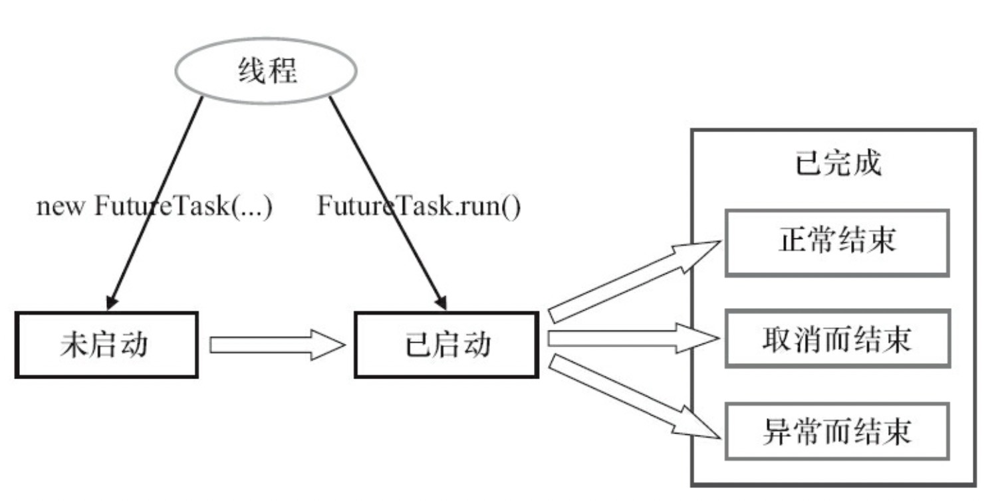
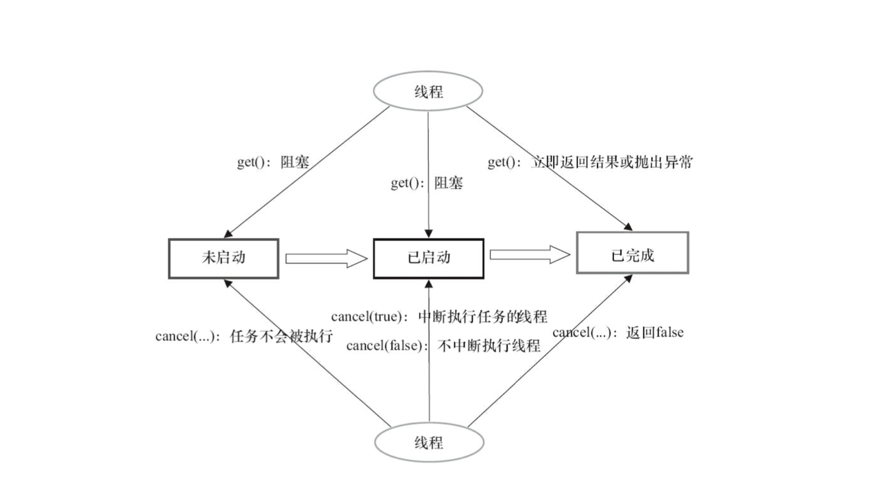
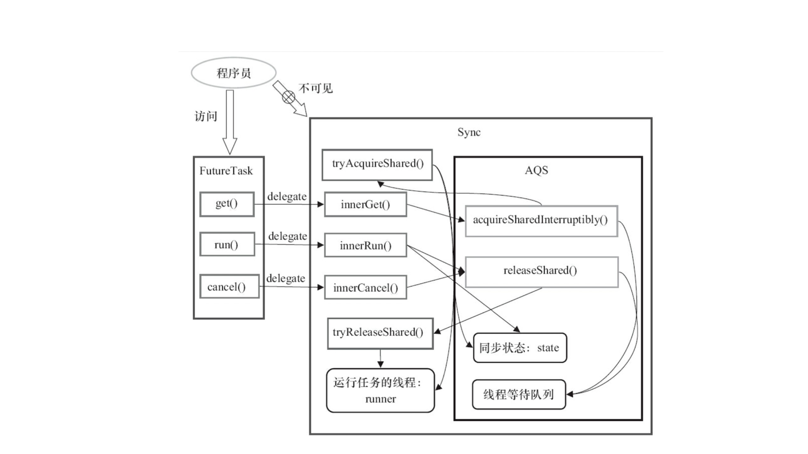

说到 Java 多线程的基础，你最先想到什么？是不是 `Thread` ？

<!-- more -->

其实具体来说，Java 实现多线程，主要有三种方法：
1. 实现 Runnable 接口
2. 继承 Thread 类
3. 使用 Callable、Future 等有返回值的类

前两种方法没有返回值，但是是最常用的方法。

从 JDK 1.5 开始，上述的基本工作单元就和 Executor 框架分开了。

<br/>

# Runnable 接口

Runnable 是开启一个新线程的基础。我们所常用的“开启一个新线程”，或创建 `Thread` 对象，实质上就是继承 Runnable 接口。

如果某个类需要实现一个 `Thread` 类，但是已经继承了另一个类的话，就无法再直接继承 Thread 类了。  
此时只能通过**实现 Runnable 接口**来满足需求，启动时将其实例作为参数传入 Thread 构造函数中：

```java
package java.lang;


public interface Runnable {

    void run();
    // 必须覆盖该方法：在方法内提供所要执行的指令
    // 可通过创建类，实现接口并在 run 方法内完成特定的计算
}
```

```java
// 实现
class MyRunnable implements Runnable {

    @Override
    public void run() {
        doSomethingAsync();  // 自定义方法
    }
}

// 调用
Runnable target = new MyRunnable();
new Thread(target).start();
```

<br/>

# Thread

本质上是实现 Runnable。通过继承 Thread 并调用 t.start() 方法来启动线程。  
t.start() 是 native 方法。

继承 Thread 类之后，我们需要覆写 `run` 方法来自定义操作：
```java
class MyThread extends Thread {

    @Override
    public void run() {
        doSomethingAsync();
    }
}
```

```java
import java.lang.Thread;

// Thread 方法

Thread(Runnable target)    // 构建一个新线程，用于调用给定 target 的 run 方法

void start()
// 启动线程，将触发 run 方法
// 该方法立即返回，且新线程将并行运行

void run()    // 调用关联 Runnable 的 run 方法

static Thread currentThread()    // 返回代表当前执行线程的 Thread 对象
```

Thread 初始化的时候，会将 daemon 和 priority 设置为父线程的对应属性，再将父线程的 inheritableThreadLocal 复制过来。

<br/>

如果直接调用 run 方法只会执行**同一个线程**的任务。

Thread 调用到最后一行，或者调用过程中出现了不可捕获的异常，线程会终止。

Thread 的 run 方法并不能抛出任何被检测到的异常，因此我们在设计的时候，需要在线程死亡之前，将异常传递到一个**用于未被捕获的异常的处理器**，该处理器实现 `Thread.UncaughtExceptionHandler` 类获取异常：

```java
import java.lang.Thread;

// 设置 / 获取未捕获异常的默认处理器
static void setDefaultUncaughtExceptionHandler(Thread.UncaughtExceptionHandler handler)
static Thread.UncaughtExceptionHandler getDefaultUncaughtExceptionHandler()

/**
 * 设置 / 获取未捕获异常的处理器
 * 如未安装处理器，则对于独立线程：处理器为空
 * 
 * 对于线程组：线程组对象作为处理器
 * 默认：创建的所有线程属于相同的线程组
 */
void setUncaughtExceptionHandler(Thread.UncaughtExceptionHandler handler)
Thread.UncaughtExceptionHandler getUncaughtExceptionHandler()

```

```java
// UncaughtExceptionHandler 接口：
import java.lang.Thread.UncaughtExceptionHandler;

/**
 * 当一个线程因未捕获异常而终止，按理将 report 记录至日志中
 * 
 * t：由于未捕获异常而终止的线程
 * e：未捕获的异常对象
 */
void uncaughtException(Thread t, Throwable e)


/**
 * 实现 Thread.UncaughtExceptionHandler 接口
 * 如有父线程组：调用父线程组该方法
 * 否则：
 *   如 Thread.getDefaultUncaughtExceptionHandler 非空：调用该处理器
 *   如 Throwable e 为 ThrowDeath 实例：什么都不做
 * 否则：System.err(Thread.name + e.printStackTrace())
 */

import java.lang.ThreadGroup;

void uncaughtException(Thread t, Throwable e)
```

通过扩展 Thread 类实现多线程的方法已不再被推荐：
* 首先，设计程序的时候应该从运行机制上去减少需要运行的任务数量
* 再者如有很多任务，为每个任务创建独立的线程，会造成很大的开销

我们应该引入“池”的概念，即使用线程池（thread pool）去解决问题。

<br/>

# Callable & Future

Callable 和 Future 都是接口类。

```java
package java.util.concurrent;


public interface Callable<V> {

    // 类型参数 V 是返回值的类型

    V call()
    // 运行一个将产生结果的任务
    // 相当于 Runnable 的 run
}
```

```java
package java.util.concurrent;


/**
 * 保存异步计算的结果
 * 启动一个线程并传入 Future 对象，计算完毕后线程会获得结果
 */
public interface Future<V> {

    /**
     * 获取结果；
     * 如无结果可用，则进入同步队列并阻塞，直至真正得到结果或超时为止
     * 如被中断：抛出 InterruptedException
     */
    V get();
    V get(long time, TimeUnit unit);  // 如不成功，抛出 TimeoutException
    
    // 尝试取消任务
    // 如任务已经开始，且 mayInterrupt 参数值为 true，则将正在运行的线程终端
    // 如被成功取消则返回 true
    boolean cancel(boolean mayInterrupt);
    
    // 如任务在完成前被取消，返回 true
    boolean isCancelled();
    
    // 如任务结束（正常结束、中途取消或异常终止），返回 true
    boolean isDone();
}
```


## FutureTask

`FutureTask` 是 Future 接口的实现类，既可以提交到线程池中执行，也可以通过 `run()` 直接执行。

三种状态：**未启动**、**已启动**和**已完成**，比线程的粒度大很多，层次更高（不要跟线程状态混淆了）。



```java
package java.util.concurrent;


public class FutureTask<V> implements RunnableFuture<V> {
    // extends Runnable, Future<V>

    FutureTask(Callable<V> task) {}
    FutureTask(Runnable task, V result) {}
    // 构造一个既是 Future<V> 又是 Runnable 的对象
}
```

调用 Future 接口方法时，FutureTask 对应不同状态时候的不同返回：



FutureTask 实现浅析：



可知 FutureTask 扩展了 Sync 继承了 AQS，其接口方法的实现是基于**共享式**获取资源而实现的。  
再结合不同状态时候调用 Future 接口方法的不同返回，可知：
* FutureTask 还没完成的时候，如果调用 get()，“阻塞”的意思是调用 get() 的线程会**进入同步队列**中等待
* 直到 FutureTask 完成之后，AQS 的等待通知机制会通知同步队列头节点，**唤醒**第一个线程 get()
* 而调用 run() / cancel() 也会唤醒同步队列的第一个线程进行操作
