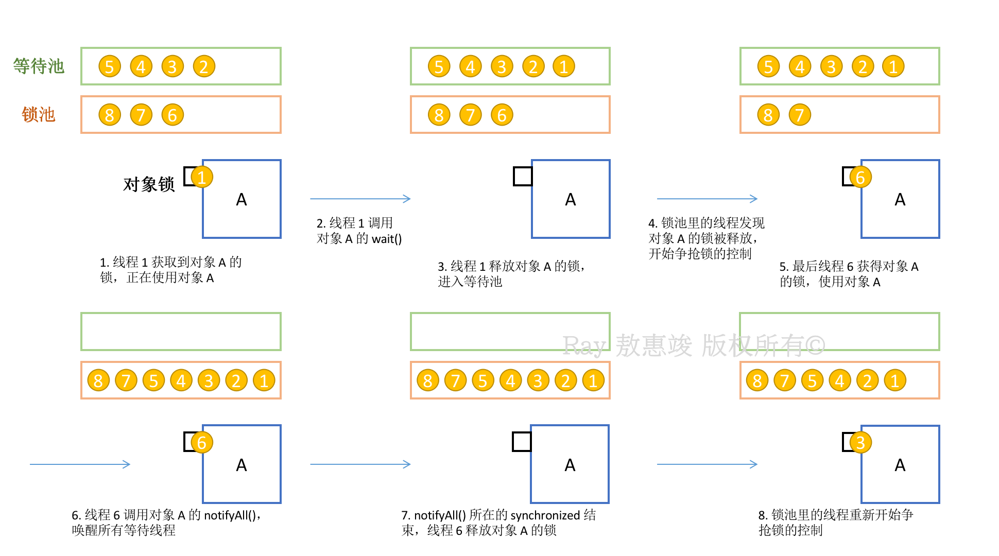
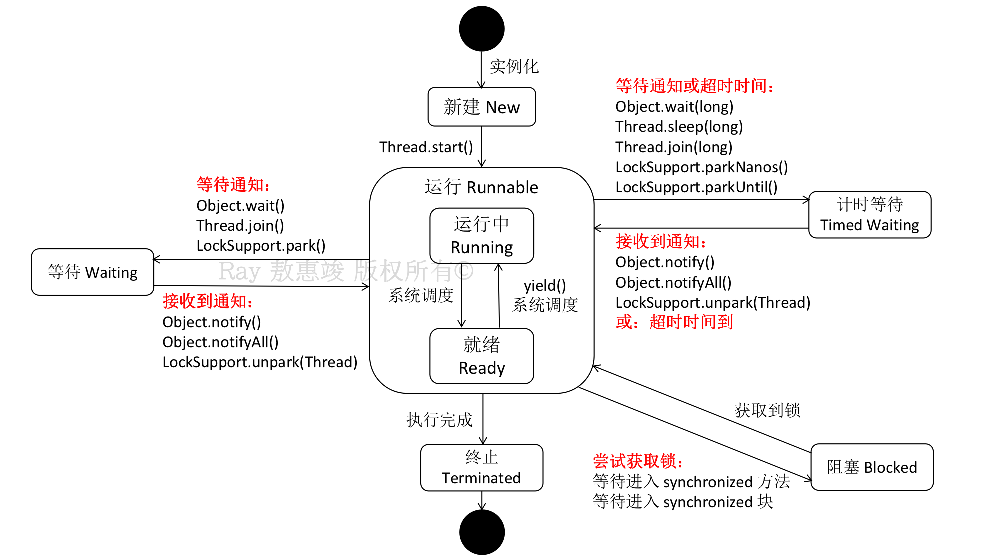

工欲善其事，必先利其器。在 Java 开发中，想要做好多线程开发和并发处理，了解 Java 中的线程至关重要。

<!-- more -->

# 线程状态

**1**. **新建**（**New**）

新创建了一个线程对象，但该线程尚未运行（因为还没被调用 start() 方法）


**2**. **运行**（**Runnable**）

当一个新创建的线程对象被调用了 start() 之后：线程便进入了可运行线程池中，进入可运行（runnable）状态，等待获取 CPU 的使用权；
* Java 线程将操作系统中的“就绪”和“运行”两种状态笼统地称作“运行中”
* 该线程可能正在运行（running），也可能没运行（ready），取决于操作系统提供的时间片。


**3**. **阻塞**（**Blocked**）

当线程试图去获取一个内部对象的**同步锁**（如进入 `synchronized` 块，非 `java.util.concurrent` 的锁），而该锁正被其他线程持有的时候，该线程就会暂时放弃 CPU 的使用权，从而**停止运行**，直到进入就绪状态。

JVM 会将该线程放入**锁池**；当所有其他线程释放了这个锁，且线程调度器允许本线程去持有它时，该线程脱离阻塞状态。


**4**. **等待**（**Waiting**）

又称等待阻塞（不知道是谁提出的这个说法）。

对于某个处于 Running 态的线程来说，如果它需要等待另一个线程去通知调度器一个条件（Condition 对象）的时候，该线程进入等待状态。JVM 将该线程放入**等待池**。

使线程进入该状态的方法：
```java
Object.wait()
Thread.join()
LockSupport.park()
```

举一个场景说明一下阻塞和等待：




**5**. **计时等待**（**Timed waiting**）

线程被调用一些超时计时方法后，会进入计时等待，JVM 将该线程放入等待池。

```java
Object.wait(millis)
Thread.sleep(millis)
Thread.join(millis)
Lock.tryLock(millis, unit)
Condition.await(millis, unit)

// 底层方法：
LockSupport.parkNanos(blocker, nanos)
LockSupport.parkUntil(blocker, deadline)
```

该状态一直保持到计时结束或接收到其他通知，随后线程会被被切换到 Runnable 状态。

```java
import java.lang.Thread;


void join()    // 等待某个指定的线程执行完毕
// 父线程等到调用该方法的子线程执行完毕才结束

void join(long millis)
void join(long millis, int nanos)
// 等待指定的线程被终止或经过指定的时间

static void sleep(long millis)    // 休眠给定的毫秒数
// sleep 方法可能抛出 InterruptedException
```

`join()` 阻塞的是调用者所在的线程。因为：

```java
public final synchronized void join() throws InterruptedException {

    ...
    while (isAlive()) {
        wait(0);  // 永远等待下去
    }

    ...
}
```

概述：
* 当前线程的 wait() 被调用后，当前线程的同步锁会被释放；调用当前线程 join() 的线程会被阻塞；
* 比如说 main() 方法调用 thread1.join()，阻塞的是 main() 方法所在的线程，即**主线程**，而不是 thread1。

既然 wait() 被调用了，那么 notify() / notifyAll() 是在哪里被调用的？  
答案在 JVM 里。底层代码在 `thread.cpp` 中，通过调用 native 方法 `notify()` 实现。

线程处于被阻塞或等待状态：暂时不活动，不执行任何代码，且消耗最少的资源。


**6**. **死亡**（Dead / **Terminated**）

以下情况线程进入死亡态：
* 线程执行完成（run() 正常退出）：自然死亡
* 未捕获到的异常事件终止了 run()：突然死亡
* 调用 stop() 杀死进程：`@Deprecated`

当一个线程被重新激活的时候，调度器会检查它的优先级是否比当前正在运行的线程更高；如有，则调度器从当前运行的线程中选择一个，剥夺它的运行权，转而执行新进程。

线程不可能长久处于被阻塞的状态中，必须从阻塞态中退出，且返回到就绪状态。
* 如线程处于计时等待态（timed waiting），必须经过规定的毫秒数；
* 如线程调用 `wait()`，另一线程必须调用 `notify()` 或 `notifyAll()`；
* 如线程正等待另一线程拥有的对象锁，另一线程执行完所要做的事情之后，必须放弃该锁的所有权；
* 如线程正在等待输入或输出操作完成（阻塞操作），必须等待该操作完成。



线程在阻塞态和运行态之间的切换：属于线程间通信

```java
import java.lang.Thread;


Thread.State getState()    // 获得线程状态
/**
 * NEW
 * RUNNABLE
 * BLOCKED
 * WAITING
 * TIMED_WAITING
 * TERMINATED
 */

boolean isAlive()    // 确定某个线程是否活着
/**
 * 如是就绪线程或阻塞线程：返回 true
 * 如仍是新建线程或死线程：返回 false
 * 
 * 注：
 *  无法确认 alive 线程是 runnable 状态还是 blocked 状态
 *  无法确认 runnable 线程是否已经是 running 状态
 *  无法区分 new 线程和 dead 线程
 */
```

<br/>

# 单个线程的操作

## 已弃用操作

```java
@Deprecated
void suspend()    // 暂停线程
/**
 * 弃用原因：
 * 如果调用该方法挂起一个持有锁的线程，那么这个锁在线程恢复之前不可用；
 * 由此，调用该方法的线程试图获得同一个锁：导致死锁
 *    被挂起的线程等着被恢复；
 *    将其挂起的线程等着获得锁。
 */

@Deprecated
void resume()    // 调用 suspend() 方法后用于恢复线程

@Deprecated
void stop()    // 终止线程（终止所有未结束的方法，包括 run()）
/**
 * 弃用原因：
 * 线程被终止时，会立即释放其持有的所有对象的锁：这样容易导致对象不一致
 * 
 * 由此可见当线程要终止另一个线程时，不知何时调用 stop() 才是安全的
 */
```

因此有一个错误的说法：stop() 会导致某些对象被已停止的线程永久锁定。  
**勘误**：被停止的线程通过抛出 ThreadDeath 异常退出所有同步方法，因此实际上，该线程会释放所有内部锁。


## 中断线程

可以理解为线程的一个标记位。

```java
/**
 * 向线程发送中断请求，请求成功后，该线程中断状态被设为 true
 * 中断状态是每个线程都具有的 boolean 标志，每个线程应随时检查该状态
 * 
 * 如目前该线程正被一个 sleep()/wait() 调用阻塞了，此时调用 interrupt() 会抛出 InterruptedException
 */
void interrupt()


/**
 * 检查当前（正在执行该命令）线程是否被中断（静态方法）
 * 先获取当前线程对象（Thread.currentThread()），再调用该方法
 *
 * 副作用：会清除当前线程的中断状态，将其重置为 false
 */
static boolean interrupted()


/**
 * 测试线程是否被中断
 * 先获取当前线程对象（Thread.currentThread()），再调用该方法
 * 该调用不改变线程的中断状态
 *
 * 注：如线程被阻塞，则此时无法检测中断状态，会抛出 InterruptedException
 * 因此如果循环调用 sleep() —— 需捕获 InterruptedException
 */
boolean isInterrupted()

```

例：
```java
public void run() {
    try {
        ...
        while (loop) {
            doSomething();
            Thread.sleep(millis);
        }
    } catch (InterruptedException e) {
        // 线程 sleep 的时候抛出异常

    } finally {
        // cleanup
    }
}
```

处理 `InterruptedException`：
```java
void subTask() {
    ...
    try {
        sleep(delay);
    } catch (InterruptedException e) {
        Thread.currentThread().interrupt();
    }
}

// 或者:
void subTask() throws InterruptedException {
    ...
    sleep(delay);
    ...
}
```

在抛出 `InterruptedException` 之前，Java API 会先将中断状态清除（interrupted() 置为 `false`）。此时如果线程有依赖于中断状态的任务的话，将会受到影响。

可以通过在 Runnable 中自定义 boolean 标记来设定线程的中断与否。

<br/>

# 线程优先级

Java 中的每一个线程均有一个优先级（`int` 类型），其高度依赖于系统：
* Java 的优先级会映射到宿主机平台的优先级上；
* 因此 Sun 提供的虚拟机，线程优先级会被忽略。

每当线程调度器有机会选择新线程时：首选优先级高的线程。  
如有高优先级线程未进入 Runnable 状态，低优先级线程永远不会被执行。

```java
import java.lang.Thread;


static int MIN_PRIORITY = 1;
static int NORM_PRIORITY = 5;
static int MAX_PRIORITY = 10;

void setPriority(int newPriority)    // 设置线程优先级
/**
 * 必须在 Thread.MIN_PRIORITY 和 Thread.MAX_PRIORITY 之间
 * 默认 Thread.NORM_PRIORITY
 * 默认：线程继承父线程的优先级
 */

static void yield()    // 使当前线程处于让步状态
/**
 * 如果其它与当前线程同样优先级的可运行线程存在，则那些线程接下来会被调度。

 * 当前线程依旧是可执行（runnable）状态，具体来说是 runnable 中的 running 状态
 * 其它线程会以竞争关系抢占资源
 */

void setDaemon(boolean isDaemon)    // 将线程转换为守护线程（daemon thread）或用户线程
/**
 * 为其他线程提供服务，如计时线程
 * 必须在线程启动（start()）前调用 setDaemon(true)
 * 虚拟机不存在非 daemon 线程的时候就可以退出了
 * 
 * 注：守护线程应永远不要去访问固有资源：会在任何时候甚至在一个操作的中间发生中断
 * 构建 daemon 线程时不能依靠 runnable 中的 finally 块来确保关闭或清理资源的逻辑，因为它不一定会被执行
 */
```

<br/>

# 线程间通信

我们知道，[`synchronized`](/2021/07/14/keywords/#synchronized) 和 [`volatile`](/2021/07/14/keywords/#volatile) 关键字是线程之间通过共享内存进行通信的方式。

另外，线程间通信还有基于等待 / 通知机制的相关方法：

```java
import java.lang.Object;  // 注：任何 Java 对象都带有这些方法


void notify()    // 随机通知一个在对象上等待的线程，使线程从 wait() 方法返回，解除其阻塞状态
/**
 * 只能在同步方法或同步块（synchronized）内部使用
 * 
 * 能返回的前提是调用线程获取到了对象的锁
 * 如当前线程不是对象锁持有者：抛出 IllegalMonitorStateException
 * 相当于调用 Condition.signal()
 */

void notifyAll()    // 通知所有在该对象上等待的线程，使它们从 wait() 方法返回，解除阻塞状态
/**
 * 只能在同步方法或同步块（synchronized）内部使用
 * 如当前线程不是对象锁持有者：抛出 IllegalMonitorStateException
 * 相当于调用 Condition.signalAll()
 */

void wait()    // 将线程置为等待（Waiting）状态，直到线程接到另外的线程的通知，或被中断
/**
 * 只能在同步方法中使用
 * 
 * 调用 wait() 后，会释放线程持有的该对象的同步锁
 * 如当前线程不是对象锁持有者：抛出 IllegalMonitorStateException
 * 相当于调用 Condition.await()
 */

void wait(long millis)
void wait(long millis, int nanos)
/** 
 * 将线程置为等待状态，直到接到通知或经过指定时间
 *
 * 只能在同步方法中使用
 * 如当前线程不是对象锁持有者：抛出 IllegalMonitorStateException
 * millis：毫秒数；nanos：纳秒数
 */
```

比下面一段伪代码好的地方：
```java
while (value != desired) {
    Thread.sleep(1000);
}
doSomething();
```
及时性（sleep 时间越长，及时性越差）比伪代码好，开销（sleep 时间越短，开销越大）比伪代码低。

注：在通过条件判断是否进行等待 / 唤醒时，要注意“**虚假唤醒**”的情况：即线程从 blocked 到 ready 再到 running 没有进行判断。

造成虚假唤醒一般是使用 if 做判断导致；改成 while 做判断就好。

等待方（消费者）
1. 获取对象的锁
2. 如条件不满足，则调用对象 wait()，被通知后仍然要检查条件
3. 条件满足则执行对应的逻辑

通知方（生产者）
1. 获取对象同步锁
2. 改变条件
3. 通知所有等待在对象上的线程

<br/>

# 方法比较

`wait()` v.s. `sleep()`：

首先，wait 会释放同步锁，而 sleep 不释放同步锁。

**wait 是 Object 的方法**
* 可对任意一个对象调用；调用时一定会释放调用线程持有的对象锁，让调用线程进入等待此对象的等待池
    * 因此其依赖于 `synchronized` 关键字（**必须在 `synchronized` 代码块中被调用**）
* 调用 wait() 时会将线程挂起，直到其他线程调用同一个竞争对象的 notify()（或 notifyAll()）去唤醒相关等待线程
* 被唤醒后，线程对象会进入对象锁池（lock pool），准备获得对象锁并进入 runnable 状态
* 适用范围：等待线程、数据库连接
* 另：wait(millis) —— 加上了超时时间，等待指定时间后会自动苏醒

**sleep 是 Thread 的静态方法**
* sleep(millis)：让线程休眠指定的时间，将执行机会转让给其他线程；但监控状态依然保持，线程会在休眠时间结束时恢复
* 即：sleep 的控制范围由当前线程决定，其并不依赖于 `synchronized` 关键字
* sleep 不是 Object 的方法，不能改变对象的内部锁状态，只是让线程进入阻塞态
* 给其他线程执行机会的最佳方式，通常用在不需要等待资源情况下的阻塞

wait 涉及到线程之间的通信问题；而 sleep 主要是线程的运行状态控制。

wait(millis) 和 sleep(millis)：
* 都是等待指定时间后自动苏醒
* 调用 wait(millis) 的当前线程释放该同步监视器的锁定（释放锁）之后，可以不用 notify() 或 notifyAll() 方法把它唤醒。

`wait()` / `sleep()` v.s. `yield()`：
* 调用 sleep() 或 wait() 后，线程被阻塞，进入 blocked 状态
* 调用 yield() 后，线程进入 runnable 中的 running 状态

`wait()`  v.s. `join()`：
* wait() 体现线程互斥，join() 体现线程同步
* wait() 作用在对象上，join() 作用在线程上
* wait() 必须由其他线程调用 notify() / notifyAll() 进行解锁
* join() 不需要其他线程唤醒：只要被等待线程执行完毕，当前线程自动变为 runnable 状态
* join() 用途：子线程完成业务逻辑之前，主线程一直等待直到所有子线程执行完毕。

<br/>

# ThreadLocal

我们使用 synchronized & volatile，本质上是线程之间数据的共享：
* 需要严格限制变量的访问：竞争、加锁、释放锁...
* 复杂度比较高

另外，JDK 还提供了另一种处理数据同步的方式：`ThreadLocal`。顾名思义，就是线程的局部变量。

ThreadLocal 关注的是线程之间数据的隔离；  
每个 ThreadLocal 实例存储着只能被该线程访问和修改的变量，其他线程无法访问，由此避免共享变量。

除了 ThreadLocal 之外，Java 还提供了[锁机制](/2021/08/22/java-lock)实现数据同步。

```java
import java.lang.ThreadLocal;


// 创建, 无默认值
ThreadLocal<String> strThreadLocal = new ThreadLocal<>();

// 带默认值创建
ThreadLocal<Long> longThreadLocal = new longThreadLocal<Long>() {

    @Override
    protected Long initialValue() {
        return new Long(101);
    }
};

protected initialValue()
// 提供初始值时应覆盖该方法
// 默认返回 null

T get()  // 得到线程当前值
// 如首次调用，会调用 initialValue 方法

void set(T t)  // 为该线程设置新值

void remove()  // 删除对应线程的值
```

示例代码如下：
```java
public static final ThreadLocal<SimpleDateFormat> df =
    new ThreadLocal<SimpleDateFormat>() {

        @override
        protected SimpleDateFormat initialValue() {
            return new SimpleDateFormat("yyyy-MM-dd");  // SimpleDateFormat 非线程安全，应用在并发场景中可以使用 ThreadLocal
        }
    }
};

// 获取数据：
String dateStamp = df.get().format(new Date());
```

## 数据结构

`Thread`：其实例持有一个成员变量 —— ThreadLocalMap 实例。
* ThreadLocalMap 是 ThreadLocal 类的内部类：
```java
package java.lang;

public class Thread implements Runnable {
    ThreadLocal.ThreadLocalMap threadLocals = null;
}
```

`ThreadLocal.ThreadLocalMap`：
* 定义了内部类 `Entry`：继承自 `WeakReference` 类，泛型为 ThreadLocal：
```java
package java.lang;

public class ThreadLocal<T> {

    static class ThreadLocalMap {
        static class Entry extends WeakReference<ThreadLocal<?>> {
            /** The value associated with this ThreadLocal. */
            Object value;
            Entry(ThreadLocal<?> k, Object v) {
                super(k);
                value = v;
            }
        }
    }       
}
```
由此我们可以得知，ThreadLocal 是以 ThreadLocal 对象为键，以任意对象为值的存储结构。


设值操作：
```java
/** 返回线程持有的 ThreadLocalMap 实例（为成员变量 threadLocals） **/
ThreadLocalMap getMap(Thread t) {
    return t.threadLocals;
}

/** 默认的初值为空 **/
protected T initialValue() {
    return null;
}

/** 创建 ThreadLocalMap, 设值为：<当前 ThreadLocal 实例, 值>, 并让线程持有该 ThreadLocalMap 实例 **/
void createMap(Thread t, T firstValue) {
    t.threadLocals = new ThreadLocalMap(this, firstValue);
}

/** 设值 **/
public void set(T value) {
    Thread t = Thread.currentThread();  // 获取当前线程
    ThreadLocalMap map = getMap(t);  // 获取线程所持有的 ThreadLocalMap 实例
    if (map != null)  // 如果 map 已创建（回顾上文的 Thread 代码：threadLocals 可能为空）
        map.set(this, value);  // 设值 <当前 ThreadLocal 实例, 变量值>
    else
        createMap(t, value);  // 创建 map <当前 ThreadLocal 实例, 变量值>，线程持有该 map
}
```

取值操作：
```java
/** 设默认值 **/
private T setInitialValue() {
    T value = initialValue();  // 除非子类重写，否则默认的初值为空
    Thread t = Thread.currentThread();
    ThreadLocalMap map = getMap(t);
    if (map != null)
        map.set(this, value);  // 重设 <ThreadLocal 实例自身, 变量>
    else
        createMap(t, value);  // 创建 map，并存入<当前线程, 变量>
    return value;
}

/** 取值 **/
public T get() {
    Thread t = Thread.currentThread();  // 当前线程
    ThreadLocalMap map = getMap(t);  // 当前线程所持 map
    if (map != null) {
        ThreadLocalMap.Entry e = map.getEntry(this);
        // map 不为空时，以当前 ThreadLocal 实例为 key 取 Entry，并返回值
        if (e != null) {
            @SuppressWarnings("unchecked")
            T result = (T) e.value;
            return result;
        }
    }
    return setInitialValue(); // 如果 map 或 entry 为空：返回默认的初值
}
```

清空操作：
```java
public void remove() {
    ThreadLocalMap m = getMap(Thread.currentThread());  // 获取当前线程所持 map
    if (m != null)
        m.remove(this);  // 如果 map 不为空, 清理以当前 ThreadLocal 实例为 key 的 Entry
}
```

小结：

往 ThreadLocal 设值：
1. 从当前线程获取其持有的 ThreadLocalMap 实例
2. 将 ThreadLocalMap 实例的 key 设为 ThreadLocal 实例自身，value 为要存储的变量
3. 如果没有则创建 ThreadLocalMap 实例，同样设置 key 和 value，并让当前线程持有该 ThreadLocalMap 实例

从 ThreadLocal 取值：
1. 读取当前线程所持 ThreadLocalMap 实例成员变量；
2. 再从该 ThreadLocalMap 实例中以当前 ThreadLocal 实例为 key 找到对应的 value

当使用 ThreadLocal 保存变量，其保存在 ThreadLocalMap 中的变量只有持有该 map 的变量可以访问。  
如果想要子线程也可以访问数据，我们可以使用 `InheritableThreadLocal`：其保存的变量不仅当前线程可以访问，还可以在子线程中被访问，从而实现变量传递。
```java
public static void main(String[] args) {

    InheritableThreadLocal<String> threadLocal = new InheritableThreadLocal<>();
    Thread root = new Thread(() -> {
        threadLocal.set("ray");
        Thread leaf = new Thread(() -> {
            System.out.println(threadLocal.get());
        });
        leaf.start();
    });
    root.start();
}
```

使用 ThreadLocal 会导致内存泄漏吗？

**表象**是这样的：
* 使用 ThreadLocal 保存变量时，线程持有 ThreadLocalMap 实例
* 线程由线程池管理时：线程存在复用，ThreadLocalMap 实例不会消失
    * ThreadLocalMap 中 Entry 的 key（ThreadLocal 实例）和 value 会被一直持有
    * 导致内存泄漏

实际
* key 并非强引用的 ThreadLocal 实例，而是指向该实例的**弱引用**
* 一个对象失去所有强引用，只有弱引用时：该对象会被 GC 标记为可回收
* ThreadLocal 实例 key 被回收后，ThreadLocalMap 中会存在 key 为 null 的 Entry
    * 同时 get / set / remove 方法均会清理 key 为 null 的 Entry
* 由此基本避免内存泄漏，但开发人员仍会在使用完 ThreadLocal 后手工调用 remove 进行清理


应用场景：
* 数据库连接
* Session 管理
* 事务管理

```java
import java.util.concurrent.ThreadLocalRandom;

static ThreadLocalRandom current()  // 返回特定于当前线程的 Random 类实例
```

<br/>

# Java 程序本身就是多线程的进程

只有一个 `main` 方法的 Java 类，通过 jmx 命令查看线程的时候，会有如下结果：

```bash
[4] Signal Dispatcher  # 分发处理发送 JVM 信号的线程
[3] Finalizer  # 调用对象 finalize() 的线程
[2] Reference Handler  # 清除 Reference 的线程
[1] main  # main 线程，用户程序入口
```
