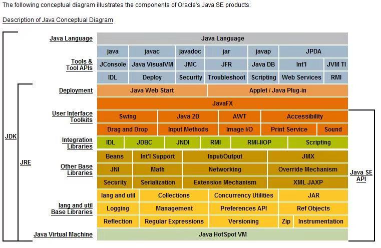

作为一名 Java 开发者，今天唠一唠 Java 开发平台的一点基本情况。

<!-- more -->

# 简介

根据创始公司 Sun Microsystems 的描述，Java 是一门：

    简单、完全面向对象、分布式、解释性、健壮、安全与系统无关、可移植、高性能、多线程和动态的编程语言。

    我们关心的是，减少开发健壮代码所需的时间以及困难。

Java 最初被称为 Oak，是 1991 年为消费类电子产品的嵌入型芯片而设计的开发平台。1995 年 5 月更名，并重新应用于开发 Internet 应用程序。

2010 年，Sun 被甲骨文（Oracle）收购，Java 随即归于 Oracle 旗下。

Java 除了我们熟知的 Java 程序设计语言之外，还有一块大头是 Java 平台。


## Java 开发平台

Java 平台（software platform）是由 Java 程序语言编写的软件赖以开发的平台，是 Java 软件和电脑系统的中介。  
最初被设计用在 Applet 等桌面端程序开发，不过后来逐渐转移到服务端的运用。  
主要分三类：

* Java SE（**J2SE**, Java 2 Platform Standard Edition）：Java 平台标准【基础】版，即 Java 桌面版
* Java EE（**J2EE**, Java 2 Platform Enterprise Edition）：Java 平台企业版，基于 J2SE 打造，用于构建大型网站；后来重命名为 Jakarta EE 
* Java ME（**J2ME**, Java 2 Platform Micro Edition）：Java 平台微型版，基于 J2SE 打造，用于构建手机移动终端。

当今最流行的 Java 开发环境：

* Eclipse
* IntelliJ IDEA
* Jbuilder
* JCreator
* Jdeveloper
* MyEclipse
* Netbeans

就拿 Eclipse 来说：Eclipse 是一款开放源代码的、基于 Java 的可扩展开发平台，其实是 Visual Age for Java

* Eclipse 本身只是一个框架和一组服务
* Eclipse 中每一样东西都是插件，用户通过不同的插件组件来构建开发环境；所以可以通过添加插件实现强大的功能
* 同时还附带了一个标准的插件集，包括 Java 开发工具

因此 Eclipse 可以支持多种语言的开发，如 C/C++，PHP 等；而许多软件开发商也以 Eclipse 为框架开发自己的 IDE。

IBM 提供了最初的 Eclipse 代码基础，包括 Platform、JDT 和 PDE。

Eclipse 分支（Eclipse 标准版 + 功能插件）如下：

| | |
| :--------------------------------- | :----------------- |
| Eclipse Standard                   | 标准版              |
| Eclipse IDE for Java EE Developers | 面向 J2EE           |
| Eclipse IDE for Java Developers    | 面向 J2SE           |
| Eclipse IDE for C/C++ Developers   | 面向 C/C++          |
| Eclipse for PHP Developers         | 面向 PHP            |
| Eclipse for RCP and RAP Developers | 面向 Eclipse 插件开发 |


# Java 特性

**Object Oriented**

以对象为基本粒度，对象的属性定义了这个对象，对象的方法可用来操作对象
* 使代码 human-being-like，利于代码扩展和复用

**Platform Independent**

Java 源代码编译后的字节码与平台无关，与底层应用打交道的事情都交给了 JVM，真正做到 write / compile once, run everywhere

**Safe**

包括：
* 语言级安全性（对象的封装）
* 编译时安全性（语法意义检查）
* 运行时安全性（类装载器装载及字节码校验器校验）
* 可执行代码安全性（网络访问类的时候进行了权限设置）
* 当然，总有安全漏洞躺在人们意想不到的地方

**Threading**

多线程提高了程序对硬件的利用率。

由此，Java 技术具有卓越的通用性、高效性、平台移植性和安全性。

Java 不同于一般的编译语言和直译语言：它首先将源代码编译成**字节码**，然后依赖各种不同平台上的虚拟机来解释执行字节码，从而实现 write / compile once, run everywhere。

至于语法糖更是数不胜数了：

* 泛型和类型擦除
* 自动装箱与拆箱
* 变长参数
* 增强 for 循环
* 内部类
* 枚举类
* ...


## Java v.s. C++

Java 很大程度上沿袭了 C++ 的一些实用结构，因此风格十分接近 C++，继承了 C++ 语言面向对象技术的核心。

Java 与 C++ 的区别在于：

1. Java 运行于 [JVM](/2021/07/07/jvm-basics) 上面，可移植性强，且 JVM 几乎可以安装到任何的系统；C++ 如果要在不同的系统中运行，需要不同的编码；
    * 也正因如此，Java 在桌面程序应用上面不如 C++ 实用，因为 C++ 可以直接编译成 .exe 文件；
2. 指针是 C++ 的优势，可直接对内存操作，因此 C++ 利用于**底层程序的编程**以及控制方面的编程**更灵活**；
    * 但指针编程同时具有危险性；Java 舍弃了 C++ 中容易引起错误的指针，改用**引用**取代；
3. 关于垃圾回收：C++ 利用析构函数，Java 是**自动启动垃圾回收**机制；因此相比起 C++，java 运行速度会**慢**一些；
4. Java 移除原 C++ 的操作符重载，也移除了多重继承特性，改用**接口**取代；
5. Java 在 web 前端的应用上具有 C++ 无法比拟的优势；
6. Java 具有异常处理机制


Java v.s. C#
--

1. Java 不允许操作符重载
2. Java 没有类似于 LINQ 的特性
3. Java 内部类可以直接访问外部类的实例成员，C# 不行
4. C# 能被重写的方法必须添加 `virtual` 关键字声明为虚方法；Java 对于方法的默认行为都可以被重写
5. C# 没有匿名内部类


# Java 程序生命周期

1. 编译：源文件（`.java`） -> 编译器（javac） -> 字节码 byte code（`.class`）
    * 注：**JVM 只能运行字节码文件**

2. 装载：字节码（`.class`） -> JVM [类加载器](/2021/07/08/class-loader/#类加载过程) -> JVM 中装载的类

3. 校验：JVM 中装载的类 -> JVM 字节码校验器 -> 进行校验

4. 解释：JVM 中装载的类 -> JVM 解释器（根据 OS 解释） -> 机器码

5. 运行：机器码 -> OS -> 运行的程序

6. 回收：内存垃圾 -> JVM [垃圾回收器](/2021/07/09/garbage-collection) -> 不定期垃圾回收

7. 终止：JVM 卸载程序

注意：编写好的 Java 程序不能够直接在操作系统中运行，而是运行在 **JVM** 中。

每一种 Java 平台的解释器可能有不同，但实现的 JVM 是一样的：这也是 Java 为何能跨平台的重要原因之一原因。


# 编码风格

Java 的注释风格有单行注释、多行注释、类和方法注释：

```java
// 单行注释

/*
 看看，
 这是多行注释
 */

/**
 * 文档/类/方法的注释
 *
 */
```

Java 的工程包 packages 命名一般遵循以下层次：`com.公司名.项目名.模块名`。

Java 变量和方法的命名有以下要求：

* 不与 Java 关键字冲突
* 不以数字开头
* 可包含 `$` 和 `_`，此外不能有其他符号
* 可以用 `$` 和 `_` 开头
* 一般遵循伪驼峰命名习惯：userName, myAccount

常量命名：建议全大写，final 修饰，常配以 static 修饰符：

```java
public static final double PI = 3.141593;
```

对于项目 / 类 / 接口的命名，除了使用驼峰命名（MyClass, MyInterface）之外，其它基本与变量 / 方法名相同。


# JRE

[JVM](/2021/07/07/jvm-basics) 是 Java 运行环境（Java Runtime Environment, **JRE**）的一部分。

JRE 是运行 Java 程序所**必需的环境集合**，包含 JVM 的标准实现及 Java 核心类库

* JRE 仅仅能够完成 Java 的运行，无法对 Java 进行编译、调试
* 它面向的是 Java 程序使用者，而非开发者
* JRE 有独立版本，如果只需要运行 Java 程序，安装 JRE 即可。

JRE 的组成：
* Java 的类库，包含了编译 Java 程序所需要的最核心文件
    * 核心库文件，其中有
        * 数据结构的库，包括列表、字典和树等
        * XML 分析库
        * 安全方面应用库
        * 国际化和本地化应用库
    * 综合库文件，包含了程序员和其他系统通信的功能文件
        * JDBC，即 Java 数据库连接的 API
        * JNDI，即 Java 命名和目录接口
        * RMI 和 CORBA，用于重新分发软件
    * 用户界面库文件，包含：
        * AWT，即抽象窗口开发包，提供了产生图形用户界面所需要的功能
        * Swing 库
        * 其他用于回访媒体文件、录音、截图的库
* 一个用于执行软件的 JVM 实现
* 插件，可以在浏览器里面使用
* JWS（Java Web Service），可以让终端用户连接到互联网
* 许可文件和文档

如果要进行 Java 开发，需要安装 JDK。


# JDK

**JDK**（Java Development Kit）是 Java 语言的开发包，包含了 JRE，可以将 `.java` 文件编译为可执行 Java 程序，通过加载到 JVM 然后运行。

完整的 JDK 包括以下基本组件：

* `/bin` 目录，包括
    * 编译器（javac）
    * 解释器（java）
    * jdb 调试器（java debugger）
    * 文档生成器（javadoc）
* `/demo` 目录，包括一些代码的演示
* `/include` 目录：用于编译本地方法的文件，如 JNI 调用时所需的 C 语言头文件
* `/JRE` 目录，包含JVM 运行环境，JDK 类库，与所在平台相关
* `/lib` 目录，包含除 `/JRE` 下之外 JDK 额外所需的类库
* `src.zip`，里面是 JDK 的源代码
* jar 打包工具
* 头文件生成器
* javap 反汇编器
* 监控工具
* ...




JDK 中常用的 package：

* `java.lang`：系统基础类，如 String；该 package 是唯一不需要 `import` 的 package
* `java.io`：所有与输入输出有关的类
* `java.net`：所有与网络连接有关的类
* `java.util`：系统辅助类，包括 [Collection](/2022/04/30/java-collection), [List](/2022/04/30/java-collection/#List-接口), [Map](/2022/05/06/java-map) 等
* `java.sql`：数据库操作类，Connection, Statement, ResultSet 等
* `java.servlet`：JSP、Servlet 等使用到的类

下面介绍几个长期支持（LTS）的 JDK 版本。


## JDK 1.5

Java 5 最重要的一个支持是泛型（generics），为了参数化类型，或者说可以将类型当作参数传递给一个类或者方法。

1. 与普通的 Object 代替一切类型这样简单粗暴而言，泛型使得数据的类别可以像参数一样由外部传递进来。它提供了一种扩展能力。它更符合面向抽象开发的软件编程宗旨。
2. 当具体的类型确定后，泛型又提供了一种类型检测的机制，只有相匹配的数据才能正常的赋值，否则编译器就不通过。所以说，它是一种类型安全检测机制，一定程度上提高了软件的安全性防止出现低级的失误。
3. 泛型提高了程序代码的可读性，不必要等到运行的时候才去强制转换，在定义或者实例化阶段，因为 `Cache<String>` 这个类型显化的效果，程序员能够一目了然猜测出代码要操作的数据类型。

泛型信息只存在于代码编译阶段，在进入 JVM 之前，与泛型相关的信息会被擦除掉，这叫做**类型擦除**。

类型擦除容易带来强制类型转换和引用传递的问题。


## JDK 1.7

Java 7（JDK 1.7）于 2011 年 7 月推出，是 Java 史上最大的一次更新。主要更新内容有：

1. 定义二进制（`byte`）为基本类型变量

```java
byte b = (byte)0b00000001;
int i = 0b00000001;
```

2. 下划线分隔数字

```java
long aLongDecimal = 1234_5678_9012L;
```

3. switch 语句判断 String 类型

```java
switch (dayName) {
    case "Monday": recover();
    case "Tuesday": work(hard);
    case "Wednesday": work(notThatHard);
    case "Thursday": work(lazily);
    case "Friday": work(withoutPatience);
    case "Saturday": party(hard);
    case "Sunday": party(hard);
}
// 本质上还是对 int 的支持：编译时候是对 string 的 hashcode 做 switch
```

4. 泛型实例化自动推断类型

```java
ArrayList<String> sList = new ArrayList<>();
```

5. 推出 `try-with-resource`：不需要手动关闭资源

```java
// java 6-
try {
    FileReader fr = new FileReader(path)
    BufferedReader br = new BufferedReader(fr);
    return br.readLine();
} catch (Exception e) {
    throw e;
} finally {
    if (br != null) {
        br.close();
    }
    if (fr != null) {
        fr.close();
    }
}

// java 7+
// try-with-resource can make sure the resources are closed before returning
try (FileReader fr = new FileReader(path)
    BufferedReader br = new BufferedReader(fr);) {
    return br.readLine();
} catch (Exception e) {
    throw e;
}
```

6. 单个 catch 子句可以捕获多个异常

```java
// java 6-
try {
    ... // block in which exceptions to be caught
} catch (NoSuchFileException e1) {
    logger.log(e1);
    throw new Exception(e1);
} catch (IOException e2) {
    logger.log(e2);
    throw new Exception(e2);
}

// java 7+
try {
    ... // block in which exceptions to be caught
} catch (NoSuchFileException | IOException ex) {
    logger.log(ex);
    throw new Exception(ex);
}
```


## JDK 1.8

Java 8 于 2014 年 3 月发布。主要更新内容：

**1**. 移除位于 JVM 内存中的 PermGen，新增位于本地内存中的 `Metaspace`；

**2**. 接口扩展：给接口方法添加**默认**（default 关键字）或**静态**实现；

```java
// 默认实现
interface Example {
    default int add(int a, int b) {
        return a + b;
    }
}

// 静态方法
interface Example {
    static int add(int a, int b) {
        return a + b;
    }
}
```

**3**. 函数式接口的定义：任何接口，如果**只含一个抽象方法**，就是一个函数式接口。其本质上来说，是[函数式编程](/2022/02/07/fp)的应用。

可以给接口添加 `@FunctionalInterface` 注解。

```java
// Function<T, R> - 输入 T, 输出 R
Function<String,String> function = (x) -> {
    System.out.print(x + ": ");
    return "Function";
};
System.out.println(function.apply("hello world"));

// Predicate<T> - 输入 T, 返回一个 boolean 值
Predicate<String> pre = (x) ->{
    System.out.print(x);
    return false;
};
System.out.println(": " + pre.test("hello World"));

// Consumer<T> - 输入 T, 执行动作无输出
Consumer<String> con = (x) -> {
    System.out.println(x);
};
con.accept("hello world");

// Supplier<T> - 无输入, 输出 T
Supplier<String> supp = () -> {
    return "Supplier";
};
System.out.println(supp.get());

// BinaryOperator<T> - 输入两个 T，输出 T，think about reduce of map-reduce
BinaryOperator<String> bin = (x, y) ->{
    System.out.print(x + " " + y);
    return "BinaryOperator";
};
System.out.println(" " + bin.apply("hello ", "world"));


// output:
// hello world: Function
// hello World: false
// hello world
// Supplier
// hello world BinaryOperator
```

另外就是 [Optional](/2022/02/07/fp/#进阶应用：Optional) 类（`java.util.Optional`）的应用
* 一个可以包含 null 值的容器对象，可用来代替 `xx != null` 的判断


**4**. 方法引用

* Reference to constructor, 构造方法引用
* Reference to static method, 类静态方法引用
* Reference to methods of an instance, 某个对象的方法引用
* Reference to methods of a specific class for any instance, 特定类的任意对象的方法引用

```java
// 首先定义一个基本的 entity 类 Person, nothing special
class Person {
    private String name;

    public Person() {}

    public String getName() {
        return name;
    }
    public void setName(String name) {
        this.name = name;
    }
    public int compare(Person a, Person b) {
        return a.getName().compareTo(b.getName());
    }
    public int compareTo(Person p) {
        return this.getName().compareTo(p.getName());
    }
}

// 再定义一个 PersonFactory，注意此处有一个 java.util.function.Supplier，无输入，单个输出。

```java
class PersonFactory {
    private Supplier<Person> supplier;

    public PersonFactory(Supplier<Person> supplier) {
        this.supplier = supplier;
    }

    public Person getPerson() {
        return supplier.get();
    }
}


// 最后是测试类

```java
public class MethodReference {

    public static void main(String[] args) {
        // 引用构造函数
        PersonFactory factory = new PersonFactory(Person::new);

        List<Person> personList = new ArrayList<>();
        Person p1 = factory.getPerson();
        p1.setName("Kobe");
        personList.add(p1);
        Person p2 = factory.getPerson();
        p2.setName("James");
        personList.add(p2);
        Person p3 = factory.getPerson();
        p3.setName("Paul");
        personList.add(p3);

        Person[] persons1 = personList.toArray(new Person[personList.size()]);
        System.out.print("before: ");
        printArray(persons1);

        // 引用静态方法
        Arrays.sort(persons1, MethodReference::myCompare);
        System.out.print("after: ");
        printArray(persons1);
        System.out.println();

        Person[] persons2 = personList.toArray(new Person[personList.size()]);
        System.out.print("before: ");
        printArray(persons2);

        // 引用特定对象的实例方法
        Arrays.sort(persons2, p1::compare);
        System.out.print("after: ");
        printArray(persons2);
        System.out.println();

        Person[] persons3 = personList.toArray(new Person[personList.size()]);
        System.out.print("before: ");
        printArray(persons3);

        // 引用特定类型的任意对象的实例方法
        Arrays.sort(persons3, Person::compareTo);
        System.out.print("after: ");
        printArray(persons3);
    }

    public static void printArray(Person[] persons) {
        for (Person p : persons) {
            System.out.print(p.getName() + " ");
        }
        System.out.println();
    }

    public static int myCompare(Person p1, Person p2) {
        return p1.getName().compareTo(p2.getName());
    }
}
```

**5**. Lambda Expression

* a.k.a. clousure, 闭包
* 把函数当成方法参数，可以替代匿名对象

应用于数组的 foreach：

```java
List<String> names = Arrays.asList("b", "c", "a", "d");
String sep = ",";

// 基本
names.forEach( e -> {
    System.out.println(e + sep);  // sep 变为 final
});

// 简化, 指定迭代类型,
names.forEach((String e) -> System.out.println(e));

// 再简化, 类型自动推断
names.forEach(e -> System.out.println(e));
```

应用于字符串数组排序：

```java
List<String> names = Arrays.asList("b", "c", "a", "d");

// 传统匿名对象
Collections.sort(names, new Comparator<String>() {
    @Override
    public int compare(String a, String b) {
        return a.compareTo(b);
    }
});

// 普通 lambda
Collections.sort(names, (String a, String b) -> {
    return a.compareTo(b);
});

// 简化只有一句的方法
Collections.sort(names, (String a, String b) -> a.compareTo(b));

// 进一步简化，类型自动推断
Collections.sort(names, (a, b) -> a.compareTo(b));
```


## JDK 1.11

Java 11 于 2018 年 9 月发布，主要的增强有：

1. 增加了一些字符串的处理方法；
2. 用于 Lambda 参数的局部变量语法；
3. Http Client 重写，支持 HTTP/1.1 和 HTTP/2 ，也支持 websockets
4. 可运行单一的 Java 源码文件，如：java Test.java
5. 新的垃圾回收器 ZGC：可伸缩低延迟垃圾收集器；ZGC 可看作是 G1 之上更细粒度的内存管理策略；
6. 支持 TLS 1.3 协议
7. Flight Recorder（飞行记录器），基于 OS、JVM 和 JDK 的事件产生的数据收集框架
8. 对 Stream、Optional、集合 API 进行增强。

挑重点：对于 JDK 1.9 和 JDK 1.10（局部变量类型 `var` 推断等）的完善，主要是对于 Stream、集合等 API 的增强、新增 ZGC 垃圾收集器。
