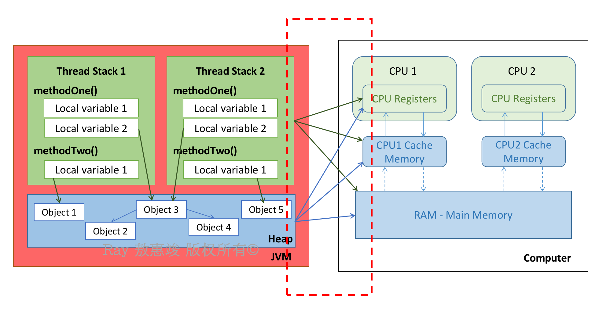
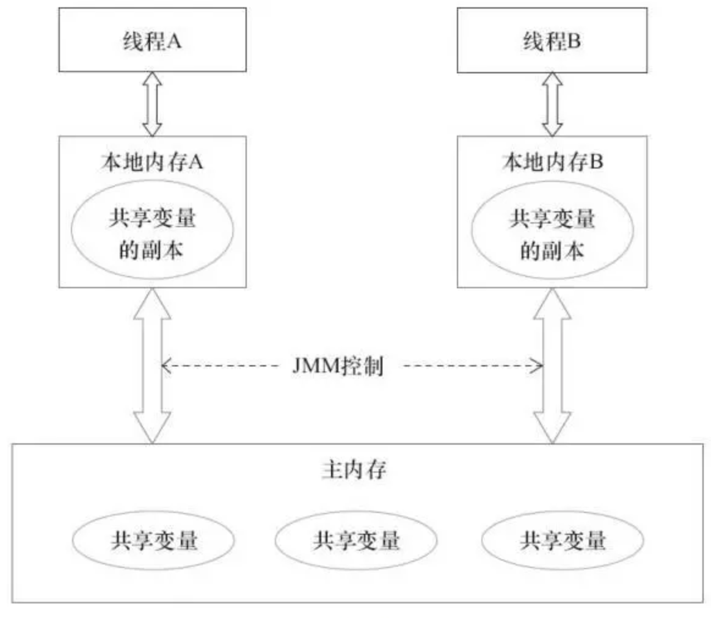
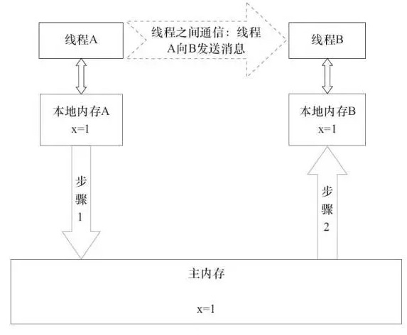
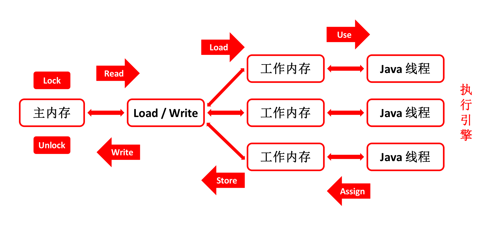
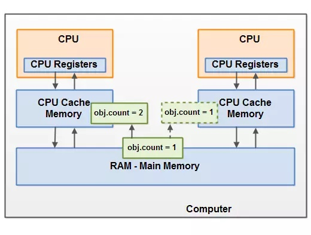
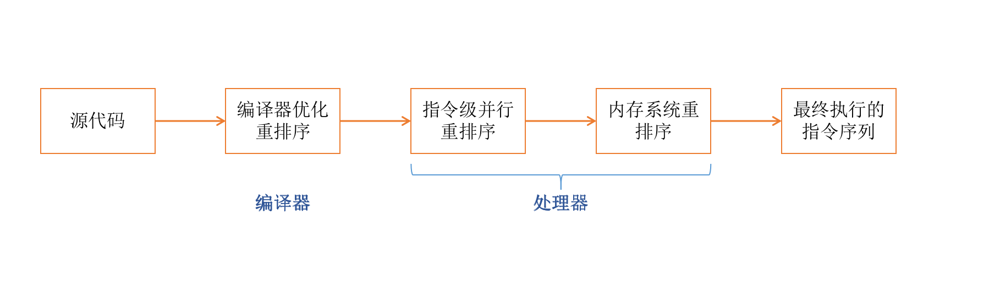
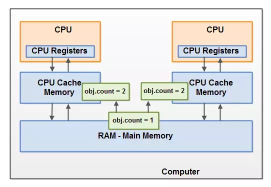

在 JSR-133 规范中提出的 Java 内存模型（Java Memory Model, **JMM**），是一个用来定义一个一致性、跨平台的内存模型，是**缓存一致性协议**，用来定义数据读写的规则。

<!-- more -->
  
JMM 定义了在虚拟机中如何将变量存储进内存，以及从内存取出来的细节，其目标就是去规范 JVM 与计算机内存如何协同工作：
* 规定了一个线程如何，以及何时能看到由其他线程修改过后的共享变量的值；
* 必须如何同步地访问共享变量。

另外，JMM 屏蔽各种硬件和操作系统的内存访问差异，以实现让 Java 程序在各种平台都能达到一致的并发效果。

JMM 的设计意图：
* **强内存模型**：内存模型要为程序员提供足够强的内存可见性保证（代码要执行正确），易于程序员理解和使用
* **弱内存模型**：内存模型对编译器和处理器的限制要尽可能放松，这样编译器和处理器就可以做尽可能多的优化来提高性能

因此，设计 JMM 的时候就需要找到一个平衡点。

<br/>

# 内存模型基础

包括**通信**和**同步**。

通信，指的是线程之间以何种方式交换信息，通常有两种：
* 隐式通信通过**共享内存**（线程之间共享程序的公共状态，通过读/写内存公共状态进行通信）
* 显式通信通过**消息传递**（线程之间没有公共状态）

而同步，指的是程序中用于控制不同线程间**操作发生的相对顺序**的机制。显式同步通过**共享内存**，隐式同步通过**消息传递**。

<br/>

# 基本结构

首先简单回顾一下不同 Java 对象的存储位置：
* 一个局部变量如果是原始类型：它总是存储在线程栈上
* 一个局部变量如果是指向一个对象的引用：引用存放在线程栈，对象本身在堆上
* 一个对象的成员变量（全局变量）不管是原始类型还是引用类型，都可能跟随该对象自身放在堆上
* 静态成员变量跟随类定义一起存放到堆上
* 堆上的对象可被所有持有对该对象引用的线程访问
    * 当一个线程可访问一个对象时，它也可以访问该对象的成员变量
    * 如两个线程同时调用同一对象的同一方法：都将会访问该对象的成员变量，但每个线程会各自拥有一份该成员变量的私有拷贝

大概的对应图如下图左所示：



再如图右及红色虚线框部分：对于硬件内存架构来说，是没有区分栈和堆的，所有线程的栈和堆都分布于主存，部分线程栈和堆有时出现在 CPU 缓存和内部寄存器中。  

<br/>

下图展示了 JMM 定义的线程和主存间的抽象关系：
* 线程之间的**共享变量**，也就是堆和方法区的数据，存储在**主存**中；
* 每个线程都各自保存一份**本地内存**（Local Memory，也叫**工作内存** Working Memory）
    * “内存”范围涵盖了缓存、写缓冲区、寄存器等硬件，以及编译器优化
    * 除了**局部变量**外，还存储了该线程已读/写共享变量的拷贝副本



主存是硬件的内存。为获取更好的运行速度，虚拟机及硬件系统可能会让工作内存优先存储于寄存器和高速缓存中。  
因此，JMM 中的“本地内存”是对 CPU 的寄存器和高速缓存的抽象描述，并不真实存在。

而整个 JMM 所定义的，是 JVM 与硬件内存架构之间的桥接。JMM 通过控制主内存和每个线程的本地内存之间的**交互**，提供**内存可见性**的保证。


## 线程通信

JMM 协议中的线程间通信：<big>**共享内存**</big>，即**隐式通信，显式同步**。



如上：
* 线程 A 将本地内存 A 中更新过的共享变量刷新回主内存
* 线程 B 到主内存读取线程 A 之前已更新过的共享变量

<br/>

# 同步操作及规则

至于桥接的具体交互协议，JMM 定义了 **8** 种操作完成主内存与工作内存之间的具体交互细节：



<big>主内存操作：</big>

**lock**（锁定）
* 作用于主内存的变量
* 将一个变量标识为被一条线程独占的状态

**unlock**（解锁）
* 作用于主内存的变量
* 将一个处于锁定状态的变量释放，变量要被释放后才可被其他线程锁定

<br/>
<big>取值操作：</big>

**read**（读取）
* 作用于主内存的变量
* 将一个变量值从主内存传输到线程的工作内存中，以便随后的 load 操作使用

**load**（载入）
* 作用于工作内存的变量
* 将 read 操作从主内存得到的变量值放入工作内存的变量副本中

**use**（使用）
* 作用于工作内存的变量
* 将工作内存的一个变量值按需传递给执行引擎
* 每当 JVM 遇到一个需要使用变量值的字节码指令时，Java 线程会执行该操作

<br/>
<big>写值操作：</big>

**assign**（赋值）
* 作用于工作内存的变量
* 将一个从执行引擎（Java Execution）接收到的值赋值给工作内存的变量
* 每当 JVM 遇到一个给变量赋值的字节码指令时，Java 线程会执行该操作

**store**（存储）
* 作用于工作内存的变量
* 将工作内存中一个变量值传送回主内存，以便随后的 write 操作

**write**（写入）
* 作用于主内存的变量
* 将 store 操作送回来的工作内存变量值写回主内存变量的值


## 同步规则

1. 如果要将变量从主内存复制到工作内存，需要**按序执行 read 和 load** 操作；
2. 如果要将变量从工作内存同步回主内存，需要**按序执行 store 和 write** 操作

注：JMM 只要求上述操作必须按顺序执行，没有保证必须连续执行

3. 不允许 read 和 load 二者、store 和 write 二者之一单独出现
4. 不允许一个线程丢弃它最近的一次 assign 操作；也就是说，变量在工作内存中被改变了之后，必须同步回主内存
5. 相应地，不允许一个线程无理由地（没发生任何 assign 操作）将数据从工作内存同步回主内存
6. 一个**新变量只能在主内存诞生**，不允许在工作内存直接使用一个未被初始化（load 或 assign）的变量
    * 对一个变量实施 use 操作之前，必须先执行过了 load 操作
    * 对一个变量实施 store 操作之前，必须先执行过了 assign 操作
7. 一个变量在同一个时刻，只允许一条线程对其进行 lock 操作：独占锁
    * lock 操作可被同一线程重复执行多次
    * 多次执行 lock 后，只有再执行相同次数的 unlock 操作才会解锁变量
    * 即：lock 和 unlock 需成对出现，否则就死锁了
8. 如果一个线程需要锁住（lock）一个变量，需要先清空该线程工作内存中这个变量的值
    * 执行引擎（Java Execution）在使用该变量前，需要重新执行 load 或 assign 操作来初始化变量的值
9. 如一个变量事先没被 lock 锁定，不允许执行 unlock 操作；而且绝对不允许 unlock 一个被其他线程锁定的变量
10. 对一个变量 unlock 前：需将此变量同步到主内存中（执行 store 和 write 操作）。

<br/>

# JMM 解决的问题

主要围绕着两点展开：<big>**指令重排**</big>，<big>**内存可见**</big>。


## 线程缓存导致的可见性问题

问题一：在没有正确使用 volatile 声明或同步的时候，多个线程共享一个对象。

问题二：一个线程更新一个共享变量的时候，该操作可能对其他线程不可见：
* 首先，共享对象在主内存被初始化
* 跑在 CPU 上的一个线程将该共享对象读到 CPU 缓存，然后修改
* 只要 CPU 缓存中被修改的值没被刷新回主内存，对象修改后的状态对于跑在其它 CPU 上的线程均不可见。

这会导致当每个线程拥有该共享对象的私有拷贝的时候，每份拷贝都停留在不同的 CPU 缓存中。  
如下图，左线程读取 count 之后加一到了 2，右线程读取 count 后无操作，它们都是 count 在主存中的副本，且相互不可见。




## 重排序导致的可见性问题

在讲这个问题之前，先展开介绍一下重排序以及相关规则。


### 啥是重排序？

从 Java 程序中的 有序性 这玩意儿入手：

在本地线程内观察，Java 程序（线程）内所有操作都是有序的，在线程内的表现为串行语义（Within-Thread **As-If-Serial** Semantics）：
* 编译器和处理器为了增强并行度，从而提高性能，有的时候会重新安排语句执行顺序
* 但是不管怎样重排序，在单线程环境下，程序执行结果是不能被改变的，从而既保护了单线程程序，也保证了内存可见性
* 编译器、runtime 和处理器必须要遵守 as-if-serial 语义。

这个语义所基于的，是**数据依赖**的概念：  
假设两个操作访问到了同一个变量，且两个操作中有一个是**写**操作，即两个操作之间存在着数据依赖。

| 名 称   | 代码示例             |
| :----:  | :------------:     |
| 写后读   | a = 1; <br/>b = a; |
| 写后写   | a = 1; <br/>a = 2; |
| 读后写   | a = b; <br/>b = 1; |

以上情况只要指令发生了重排序，程序的执行结果就会被改变；因此编译器和处理器在进行重排序的时候，会遵守数据依赖性，不会改变存在数据依赖关系的两个操作的执行顺序。

举两个例子：
```java
int i = 0;
int f = false;
i = 1;        // 1
f = true;     // 2
// 1 和 2 无依赖，执行顺序可能为：12 或 21

int a = 10;    // 1
int r = 2;     // 2
a = a + 3;     // 3
r = a * a;     // 4
// 由于 3 和 4 对 1 有依赖，所以编译期在进行指令重排序的时候，会确保 3 和 4 在 1 后面执行
// 可能的顺序 1234, 1324, 2134
```

然而，如果从一个线程出发去观察另一个线程，所有操作又都是无序的；其中有线程工作内存与主内存同步延迟的原因，也有上述提到的**指令重排序**的因素。

指令序列重排序包括以下步骤：

**1. 编译器优化的重排序**：编译器在不改变单线程程序语义的前提下，可重新安排语句执行顺序。

**2. 指令级并行的重排序**：
* 背景：现代处理器采用指令级并行技术（Instruction-Level Parallelism，ILP）来将多条指令重叠执行
* 如指令之间**不存在数据依赖性**，处理器可改变语句对应机器指令的执行顺序

**3. 内存系统的重排序**：
* 背景：由于处理器使用缓存和读/写缓冲区，使得程序在运行的时候，相关的加载和存储操作看上去可能是乱序执行的；
* 每个处理器上的写缓冲区仅对它所在的处理器可见
    * 所以：导致处理器执行内存操作的顺序可能会与内存实际操作执行顺序不一致
* 由于现代处理器都会使用写缓冲区，因此都会允许对写-读操作进行重排序



<br/>

另外：  
编译器和处理器在进行重排序的时候，除了在单线程内遵守 As-If-Serial 语义之外，还需接受 JMM **happens-before** 规则的约束：


### 什么是 **happens-before**？

happens-before 是从 Java 5 就引入的 JSR-133 规范中的规则，是 JMM **最核心的概念**。

        如果⼀个操作 happens-before 另⼀个操作，那么第⼀个操作的执⾏结果将对第⼆个操作可⻅，⽽且第⼀个操作的执⾏顺序排在第⼆个操作之前；（JMM 对程序员的承诺）
        两个操作之间存在 happens-before 关系，并不意味着 Java 平台的具体实现必须要按照 happens-before 关系指定的顺序来执⾏。（没有数据依赖的指令就不一定会完全按照顺序执行）

在 JMM 中，如果一个操作执行的结果需要对另一操作**可见**，那么这两个操作之间必须存在 happens-before 关系：
* **程序顺序规则**：一个线程中的每个操作，happens-before 于该线程中任意的后续操作（包含了 as-if-serial 语义）
* **监视器锁规则**：对一个锁的解锁，happens-before 于随后对该锁的加锁
* **volatile 变量规则**：对一个 volatile 域的写，happens-before 于任意后续对该 volatile 域的读
* **传递性**：如果 A happens-before B，且 B happens-before C，则 A happens-before C
* **start() 规则**：如果线程 A 执行操作 `ThreadB.start()`（启动线程 B），那么线程 A 中的 ThreadB.start() 操作 happens-before 于线程 B 中的任意操作
    * 因为线程 A 在启动线程 B 之前，它所做的所有对共享变量的修改结果必须要对线程 B 可见，要不启动新线程之后带来同步问题就麻烦了
* **join() 规则**：如果线程 A 执行操作 `ThreadB.join()` 并成功返回，那么线程 B 中任意操作 happens-before 于线程 A 从 ThreadB.join() 操作的那一次成功返回
    * 因为线程 B 的所有操作和对共享变量的修改必须要对线程 A 可见，线程 A 才能在执行 join() 的时候拿到正确的返回结果
* **线程中断规则**：对线程的 interrupt() 方法的调用，happens-before 于该被中断线程的代码检测到中断事件的发⽣
    * 发起中断一定要发生在响应中断之前
* **对象终结规则**：一个对象的初始化的完成（构造函数执行结束），一定 happens-before 于它的 finalize() 方法

以上规则中的两个操作可发生在同一线程内，也**可在不同线程**内。

<br/>

总的来说，JMM 允许不会改变程序执行结果的重排序，但禁止会改变程序执行结果的重排序。在不改变程序运行结果的前提下，允许部分指令重排序，最大程度地提升指令执行的效率。

原则就是，对于单线程程序以及正确同步的多线程程序，只要能保证执行结果正确，怎么优化都行。
* 比如：在编译器确定一个锁只会被单线程访问到的时候，JMM 会允许该锁被优化掉。
* 或：编译器确定一个 volatile 变量只会被单线程访问到的时候，JMM 允许其变成普通变量

**as-if-serial 语义保证单线程程序的执行结果不会被改变；happens-before 语义主要被用来保证正确同步的多线程程序的执行结果不会被改变。**

所以程序中所谓的“有序性”其实是**幻觉**。无论是单线程程序，还是正确同步了的多线程程序，它们的执行语句都会有一定的重排序，但是给我们的错觉是在按顺序执行（包括在调试的时候）。

<br/>

不同处理器的重排序规则如下：

| 处理器      | Load-Load 规则  | Load-Store 规则  | Store-Store 规则  | Store-Load 规则  | 数据依赖  |
| :------:   | :------------: | :------------:  | :---------------: | :------------:  | :-----:  |
| SPARC-TSO  | N              | N               | N                 | Y               | N        |
| x86        | N              | N               | N                 | Y               | N        |
| IA64       | Y              | Y               | Y                 | Y               | N        |
| PowerPC    | Y              | Y               | Y                 | Y               | N        |

`N` 表示处理器不允许两个操作重排序，`Y` 表示允许重排序。

因为 JMM 已经规范了 JVM 与计算机协同工作的细节，且屏蔽各种硬件和操作系统的内存访问差异，我们在编写 Java 程序的时候，并不需要去过于关注各个处理器的复杂的重排序规则，只需要了解 happens-before 语义即可。

因此 happens-before 就是**对不同处理器的重排序规则的抽象**，一个 happens-before 规则对应于一个或多个编译器和处理器的重排序规则。

<br/>

### 重排序导致了啥问题？

需要注意的是：
* 重排序所遵守的数据依赖性，仅限于**单个处理器**中的执行指令序列，和**单个线程**中执行的操作；
* 不同处理器之间和不同线程之间的数据依赖性，是不会被编译器和处理器所考虑的。

举个简单的例子：
```java
class ReorderExample {
    int a = 0;
    boolean flag = false;

    public void writer() {
        a = 1;  // 1
        flag = true;  // 2
    }

    public void reader() {
        if (flag) {  // 3
            int i = a * a;  // 4
            ... 
        }
    }
}
```

代码中 flag 用于标记变量 a 是否被写入。  
简单分析代码段后可知，在 `writer()` 中，操作 1 和操作 2 没有数据依赖关系，编译器和处理器可对这两个操作重排序；  
同理，在 `reader()` 中，操作 3 和操作 4 也没有数据依赖关系，编译器和处理器也可对这两个操作重排序。

假设有线程 A 首先去执行 `writer()`，紧接着线程 B 执行 `reader()` 方法。  
线程 B 在执行操作 4（`int i = a * a;`）的时候，能否看到线程 A 在操作 1 对共享变量 a 的写入（`writer()` 对 a 的操作是否对 `reader()` 可见）？

**不一定。**

因为刚刚说到，1 和 2 在 writer() 中可能会重排序，3 和 4 在 reader() 中可能会重排序，因此时间片可能出现以下组合：

| 时间片 Time  | 线程 A        | 线程 B          |
| :---------: | -----         | -----          |
| T1          | flag = true;  |                |
| T2          |               | if (flag)      |
| T3          |               | int i = a * a; |
| T4          | a = 1;        |                |

执行结果下来，就可能会有 a = 1，i = 0 的结果。

以上就是**没有正确同步的代码**出现的问题。在大规模运行的程序里面，这种问题非常难以排查。

<br/>

## 多线程竞争（Race Conditions）带来的同步问题

两个或更多个线程共享一个对象，多个线程在该共享对象上更新变量：



如上图：线程 A 和 B 均读取了共享变量的值 1，且均加了 1；这两个操作是被并发执行的，如果此时都写回去的话，最终只添加了 1，而不是 2。

<br/>

## 问题的解决

**1. 解决线程缓存导致的可见性问题**
* [final](/2021/07/14/keywords/#final)：初始化之后才可见
* [synchronized](/2021/07/14/keywords/#synchronized)：通过锁来保证线程之间的通信
* [volatile](/2021/07/14/keywords/#volatile)（重点）：保证新值能立即同步到主内存

**2. 保证线程之间操作有序性**
* synchronized：通过锁来保证有序性
* volatile：限制指令重排序

如：上述 `ReorderExample` 的解决方案：
```java
class ReorderExample {
    int a = 0;
    boolean flag = false;

    public synchronized void writer() {  // 获取对象锁
        a = 1;  // 1
        flag = true;  // 2
    }  // 释放对象锁

    public synchronized void reader() {  // 获取对象锁
        if (flag) {  // 3
            int i = a * a;  // 4
            ... 
        }
    }  // 释放对象锁
}
```

由 `synchronized` 原理可知，线程 A 和线程 B 获得的都是这个 ReorderExample 对象的对象锁（`this.intrinsicLock`）。

此时运行时间片如下：

<table>
	<tr>
	    <th>时间</th>
	    <th>在 JMM 中的执行</th>
        <th>备注</th>
	</tr>
	<tr>
	    <td></td>
	    <td>A 获取锁</td>
        <td></td>
	</tr>
	<tr>
	    <td>T1</td>
	    <td>flag = true;</td>
        <td rowspan="2">临界区内可以重排序</td>
	</tr>
	<tr>
	    <td>T2</td>
        <td>a = 1;</td>
	</tr>
	<tr>
	    <td></td>
        <td>A 释放锁</td>
        <td rowspan="2">（happens-before 监视器锁规则）</td>
	</tr>
	<tr>
        <td></td>
        <td>B 获取锁</td>
	</tr>
	<tr>
	    <td>T3</td>
        <td>int i = a * a;</td>
        <td rowspan="2">临界区内可以重排序</td>
	</tr>
	<tr>
	    <td>T4</td>
        <td>if (flag)</td>
	</tr>
    <tr>
	    <td></td>
        <td>B 释放锁</td>
        <td></td>
	</tr>
</table>

**3. 使用原子性保证多线程写同步问题**

首先，synchronized 加锁保证操作原子性；

再者，[`java.util.concurrent.atomic`](/2021/09/04/java-concurrent-utils/#原子类-Atomic*) 包中有很多类方法保证了操作的原子性，执行过程中不会被其他线程中断。

什么时候使用悲观锁效率更高，什么使用使用乐观锁效率更高，要根据实际情况来判断选择。
