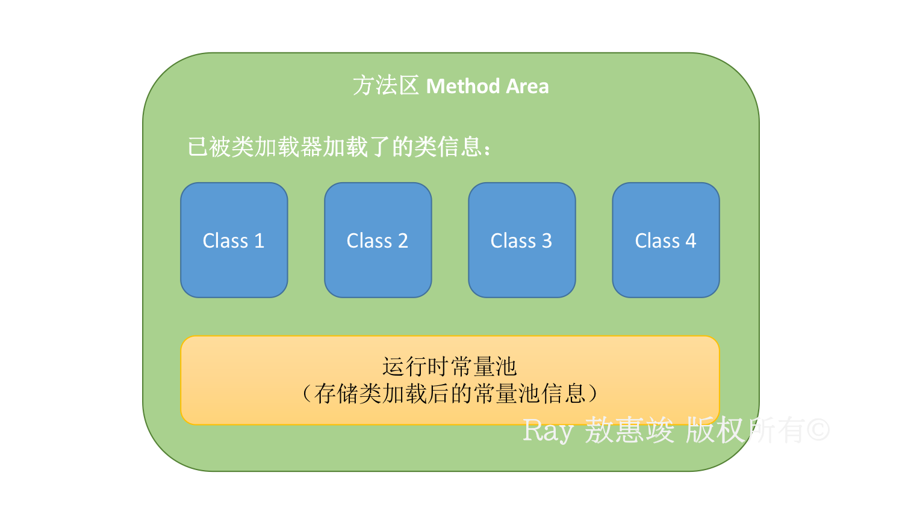
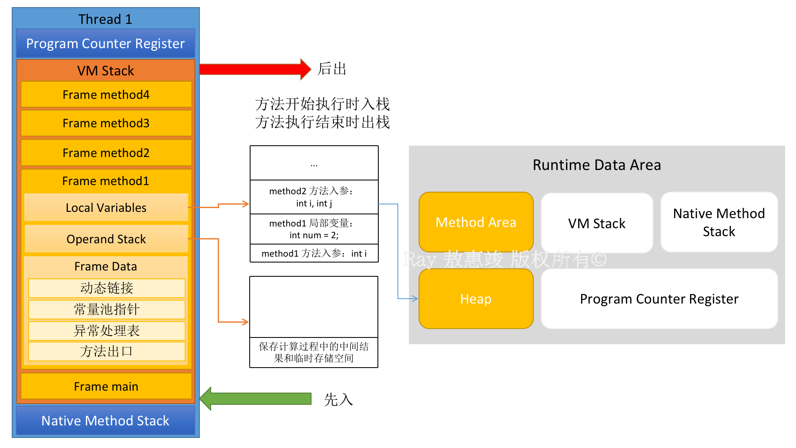

JVM 作为 Java 程序的容器，是所有 Java 程序依赖的平台。

<!-- more -->

JVM 执行 Java 程序的过程：
1. 通过类加载器加载各个 `.class` 文件
2. 为程序管理并分配内存
3. 在适当的时候执行垃圾回收

多一些阅读[官方文档（Java 13）](https://docs.oracle.com/javase/specs/jvms/se13/html/index.html)，涉猎 JVM 的原理，有助于 Java Developer 们避开开发过程中的许多陷阱。

<br/>

# 基本结构

顶层：[**类加载器**](/2021/07/08/class-loader) **Class Loader**
* 加载 JVM .class 文件

中间：Java 虚拟机内存（**Runtime Data Area**, **运行时数据区**，重点关注），即 JVM 在系统中能掌控到的内存部分，主要包括 5 部分：
* <font color="#548235">**方法区**</font> (Method Area)
* <font color="#548235">**堆**</font> (Heap, 存放 Java 对象和数组实例)
* <font color="#FFC000">**本地方法栈**</font> (Native Method Stack)
* <font color="#FFC000">**程序计数器**</font> (Program Counter Registers)
* <font color="#FFC000">**虚拟机栈**</font> (VM Stack，也有理解为 Java 方法栈的)

底层：运行引擎 (Execution Engine)
* 通过本地方法接口（Native Interfaces）与本地方法库（Native Libraries）交互


JVM 在初始运行的时候，会分配好 <font color="#548235">Method Area</font>（方法区）和 <font color="#548235">Heap</font>（堆）；在为程序管理并分配内存的时候，每遇到一个线程，就会为其分配一个 <font color="#FFC000">Program Counter Register</font>（程序计数器），一个 <font color="#FFC000">Native Method Stack</font>（本地方法栈） 和一个 <font color="#FFC000">VM Stack</font>（虚拟机栈）。
* 即：**线程私有**的三块（<font color="#FFC000">程序计数器</font>、<font color="#FFC000">本地方法栈</font>和<font color="#FFC000">虚拟机栈</font>）区域的生命周期与 Java 程序中的某个所属线程相同；**线程共享**的<font color="#548235">方法区</font>和<font color="#548235">堆</font>与 Java 程序运行的生命周期相同。
* 所以：这也是系统垃圾回收只发生在线程共享的区域（大部分只发生在**堆**中）的原因。

当线程终止时：线程私有的程序计数器、本地方法栈和虚拟机栈所占用的空间会被释放掉。

<br/>

我们知道，计算机存储数据主要利用三个空间：**寄存器**、**栈**和**堆**。
* Java 不能直接控制和处理寄存器，只能操作栈空间和堆空间。
* 对于每一个运行在内存中的 Java 程序，Java 虚拟机都为其分配好相应的栈空间和堆空间。

栈空间（Stack）：
* 存储空间较小，不能存放大量的数据
* JVM 将 Java 方法、基本类型的数据，以及对对象（包括数组和字符串）的引用存放在栈空间
* 存取数据效率高，仅次于寄存器
* 管理数据：先进后出（LIFO）

堆空间（Heap）：
* 存储数据的空间大，能存放大容量的数据（数组、字符串、对象等）
* 但存取数据的效率最低
* 在堆空间中，数据存放的位置随机分配

注：以上 JVM 的**静态内存储模型**（JVM 内存模型）只是一种对内存的划分，只局限在 JVM 内存。

<br/>

## <font color="#548235">线程共享区域</font>
包括**方法区**和**堆**。


### **<big>1. 堆 Heap</big>**

JVM 只有一个堆区，在 JVM 启动的时候被创建，被所有线程共享，更是垃圾回收的主要战场。

堆用于存储对象（包括数组，因为数组也是一种对象），是 JVM 的内存数据区。分为以下几个部分：
* **新生代**（`YoungGen`, Y）
    * = `Eden`(4/5) + `From Survivor`(S0, 1/10) + `To Survivor`(S1, 1/10)
    * Eden 空间不足时，存活的对象转移到 Survivor，两个 Survivor 区用于交换
    * JVM 每次只会使用 Eden 和其中一块 Survivor 来为对象服务，所以无论什么时候，总会有另一块 Survivor 是空闲着的
    * 因此，新生代实际可用的内存空间为 9/10（即 90%）的新生代空间。
* **老年代**（`OldGen`, O）
    * 存放生命周期长的对象

另：**永久区**（`PermGen`, P）
* 存在于 Java 8 之前的 HotSpot 虚拟机中，其他类型 JVM 没有这个概念
* 从 Java 8 开始，PermGen 被取消，以 **Metaspace 元空间**代替
* 内存的永久保存区域，存放 Class 和 Meta 信息等，GC 时不清理。

实际上，堆只保存对象实例的**属性类型**、**属性值**（多数在常量池中）、**运行时数据**和**对象本身类型标记**（在[对象头](/2021/07/16/object-header)中）等，并不保存对象的方法（方法等保存在栈里）。

要注意的是，在创建一个对象的时候：
```java
Class a = new Class();
```
此时 a 叫**实例**，不能说 a 是对象。在这里，**实例保存在栈中**，指的是指向对象的**指针**；而**对象则是保存在堆中**。操作实例实际上是通过实例指针间接操作对象，且多个实例可以指向同一个对象。  
因此 a 所指向的堆内存中的具体空间，才是对象。  
对象实例在堆中被分配好之后，保存到实例中的是一个 4 字节的**堆内存地址**。

堆处于**物理不连续**的内存空间中，只要逻辑上连续即可。

<br/>

### **<big>2. 方法区 Method Area</big>**

方法区是 JVM 的一个**概念**，不同的 JVM 会有不一样的具体实现，不同版本的 JDK 对应的 JVM 也会根据设计规范有不一样的实现。

对于每一个要加载的**类型**（类 Class、接口、枚举、注解），方法区存放的东西有很多，主要包括：

**1**. Object Class Data（类的类定义数据，即类型信息），包括：

* 类的类型（`class` / `interface`）
* 类的全限定名
* 类的直接父类的全限定名（接口和 `java.lang.Object` 除外：它们没有父类）
* 访问修饰符（`public` / `abstract` / `final`）
* 实现的接口的全限定名的有序列表
* 指向 ClassLoader 的引用：JVM 在动态链接的时候需要这个信息
* 指向 Class 实例的引用

**2**. 所有域（Field，又称字段、变量）信息，包括：
* 域的名称
* 域的类型
* 域的修饰符（`public`, `private`, `protected`, `static`, `final`, `volatile`, `transient`）
* 以及所有域的声明顺序

**3**. 所有方法（Method）信息，包括：
* 方法名称
* 方法返回类型，或 `void`
* 方法参数的数量和类型（按顺序）
* 方法修饰符（`public`, `private`, `protected`, `static`, `final`, `synchronized`, `native`, `abstract`）
* 方法的字节码、局部变量表及大小、操作数栈及大小（抽象方法和本地方法 native method 除外）
* 方法异常表（抽象方法和本地方法 native method 除外）：记录了每个异常处理的开始位置、结束位置、代码处理在程序计数器中的偏移地址、被捕获的异常类的常量池索引
* 以及所有方法的声明顺序

**4**. 即时编译器 JIT 编译后的代码缓存（CodeCache）

Java 6 及之前版本的 JVM 方法区还包括：
* [常量池](/2021/07/18/constant-pool)（Java 6 及之前版本）
* 除常量外的静态变量（Java 6 及之前版本）

从 Java 7 开始，它们就被放进堆里面了。

<br/>

和堆一样，方法区可以由不连续的区域组成，并且可以设置固定大小，也可设置为可扩展。

方法区的大小决定了系统**可以保存多少个类**，如果类太多导致方法区溢出，则会抛出异常：  
* Until Java 7：`java.lang.OutOfMemoryError: PermGen Space`
* Since Java 8：`java.lang.OutOfMemoryError: Metaspace`

正是因为方法区所存储的数据与堆有一种类比关系，而且方法区不属于堆的一部分，所以也被称为“非堆” No-Heap。  
正因为方法区不属于堆，所以它很少会触发垃圾回收，发生内存回收的目的主要是针对**常量池的回收**和**类的卸载**。




**<big>随 JDK 版本变迁的方法区实现（对于 HotSpot 虚拟机而言）</big>**

* Until Java 6：PermGen 被分配在 JVM 堆中，与堆相互隔离，大小在启动 JVM 时固定
* Java 7：将 PermGen 中的静态变量、字符串常量池等移到堆中，其他不变
    * 原因：开发中会有大量字符串创建，PermGen 永久区回收效率低，容易导致内存不足。
* Since Java 8：取消 PermGen，改为 Metaspace（元空间，顾名思义，即存储类相关的**元数据**）实现，与堆共同分配在本地内存（使用本地内存），大小可以动态调整。


元空间和永久区最大的区别是：元空间不存在虚拟机设置的内存中，而是直接使用**本地内存**。
* 好处：64 位的系统就能取很大的内存，基本上杜绝了方法区溢出；如果还报 `OutOfMemoryError`，那就是启动的时候设置得太小。

Java 8 使用元空间替换 Java 7 及以前的永久区的原因：
1. 设置的永久区空间大小，不太好确定，更容易遇到内存溢出的问题
2. 垃圾回收的时候会扫描永久区：耗时
3. 而且对永久区的调优是比较困难的
4. HotSpot 为了能与 Oracle JRockit（没有永久区）合并而做的改动

<br/>
<br/>

## <font color="#FFC000">线程私有区域</font>
包括**程序计数器**、**本地方法栈**和**虚拟机栈**。

**<big>1. 程序计数器 Program Counter Register</big>**

存储当前线程下一条需要执行的 JVM 字节码指令的地址
* 字节码的**行号位置指示器**，类似于操作系统的计数器
* 指示执行哪条指令、分支、循环、跳转、异常等情况，以及线程恢复等基础功能均依赖其指示来实现；
* 由于 Java 多线程由时间片轮转实现，因此每个线程私有程序计数器，以便切换后线程内的代码能恢复执行；
* 比较小，是唯一没有规定 OOM 的区域。

native 方法的字节码是空的，因此不会存储在程序计数器中。


**<big>2. 虚拟机栈 VM Stack</big>**

又叫**栈**内存。线程创建时被创建，线程结束后，内存就被释放。有的翻译会译作“Java 方法栈”的，大概是因为它描述的是 Java **方法执行**时的内存模型。

我们都知道，Java 指令是由**操作码**（方法本身）和**操作数**（方法内部变量）组成的。  
操作码保存在栈内存中；而操作数跟在操作码之后，具体有**两种**：基本类型变量保存在栈中；对象类型变量将地址保存在栈中，将值保存在堆中。

也就是说，Java 对象**方法本身**、**基本类型变量**和**对象地址**都存储在虚拟机栈里。
* 每个方法开始执行时创建栈帧（stack frame），压入虚拟机栈；执行结束时栈帧出栈
    * 返回至返回地址（Return Address，即指针）
    * 每个**方法使用时才会被压入栈**，方法不被使用时则不占用内存
    * 栈顶对应于**正在执行**的方法
* 每个栈帧对应于一个方法名，就是一个方法的内存模型
    * 包括 main() 方法：main 栈帧
    * 栈帧中只保存原生数据类型（primitive）和对对象的引用（reference）
* 考虑到可能的多线程环境，虚拟机栈是每个线程**私有**的
* 如果线程请求的栈深度大于虚拟机所允许的深度，则抛出 `StackOverflowError`。

注意区分：<font color="#548235">方法区</font>存储的是**常量和静态变量**，而<font color="#FFC000">栈</font>存储的是**方法内部（局部）变量**，即：类的方法是该类的所有对象共享的，而类的成员变量在不同对象中各不相同。

每个虚拟机栈的栈帧存储了：

**a. 局部变量表 Local Variables**
* 是一个以一个字节长度（8 bits）为单位、从 0 开始计数的**数组**
    * 数组可以通过 index 索引访问
    * 数组的每一行被称为**槽位**（Slot）
* 存放了编译期可知（作用域）的各种基本数据类型，以及对象的引用
* `short`、`byte`、`char` 和 `boolean` 等类型变量值在存入该数组前要被转换成 **`int`** 值
* 而 `long` 和 `double` 因为在数组中会占据连续的两项，即两个槽位：
    * 在访问局部变量中的 `long` 或 `double` 时，只需取出连续两项的第一项的索引值即可
    * 即：如某个 `long` 值在局部变量区中占据的索引为 3、4 项，取值时指令只需取索引为 3 的 `long` 值即可
* 其内存空间在编译期完成分配，运行时也不会被改变

局部变量表的每一个槽位是可以被复用的，称为**槽位复用**。

```java
public class Test {

    public void method1() {  // a 和 b 分别位列不同的槽位中
        int a = 0;
        System.out.println(a);
        int b = 0;
    }
    
    public void method2() {  // a 超过了作用域，失效了；b 复用了 a 的槽位，达到了节省资源的目的
        {
            int a = 0;
            System.out.println(a);
        }
        int b = 0;
    }
}
```

**b. 操作数栈 Operand Stack**
* 结构与局部变量表一致，但顾名思义，对它的访问是通过 push 和 pop 操作来进行的，而不是通过索引；
* 可以被看成是栈帧所对应的方法的计算过程中，**数据的临时存储区域**，可以保存中间结果

**c. 帧数据 Frame Data**，包括：
* 解析方法内引用的常量池中的数据
* 保存动态链接（指向下一条字节码指令的地址）
* 保存方法出口，用于方法执行完后返回，恢复调用方的现场
* 保存异常表，用于方法执行过程中抛出异常时的异常处理
    * 当出现异常时，虚拟机查找相对应的异常表看是否有对应的 catch 语句
    * 如没有就抛出异常终止该方法调用


**<big>3. 本地方法栈 Native Method Stack</big>**
* 与虚拟机栈作用类似
* 区别在于：虚拟机栈为 JVM 提供执行 Java 方法的服务，而本地方法栈则是为 JVM 提供执行 native 方法的服务

<br/>

例子：
```java
public class StackFrameTest {

    public static void main(String[] args) {
        StackFrameTest test = new StackFrameTest();
        test.method1(1);
    }

    public void method1(int i) {
        int num = 2;
        System.out.println("method1 i = " + i);
        method2(i, num);
    }

    public void method2(int i, int j) {
        int num = 3;
        System.out.println("method2 i = " + i + ", j = " + j);
        method3(i, j, num);
    }

    public void method3(int i, int j, int x) {
        int num = 4;
        System.out.println("method3 i = " + i + ", j = " + j + ", x = " + x);
        method4(i, j, x, num);
    }

    public void method4(int i, int j, int x, int y) {
        System.out.println("method3 i = " + i + ", j = " + j + ", x = " + x + ", y = " + y);
    }
}
```

* 执行 main() 方法时，对应栈帧的变量表、操作数栈、帧数据的变化，以及程序计数器、本地方法栈等如下图：



<br/>

# 内存分配流程


注：
* 指针碰撞（Bump the Pointer）：Java 堆的内存**绝对规整**，所有用过的内存放一边，空闲的放另一边，中间保留一个指针作为分界点的指示器。在这个策略下，**指示指针向靠近空闲内存方向挪动一段空间，该空间的距离与对象大小相等**，这就是给对象分配的内存。
* 空闲列表（Free List）：Java 堆中内存**不规整**，已使用内存与空闲内存犬牙交错。JVM 通过维护一个列表，记录可用的内存块；在分配内存的时候从列表中取一块足够大的空间划分给实例，并更新列表。
* 系统如果使用了基于<font color="red">压缩（Compact）</font>算法的垃圾收集器，与之相匹配的内存分配策略是<font color="red">指针碰撞</font>；如果是基于<font color="blue">清理（Sweep）</font>算法的话，则对应采用<font color="blue">空闲列表</font>策略。

<br/>

内存分配规则**并不是百分百固定的**，其细节取决于当前使用的是哪一种垃圾回收器组合，以及 JVM 的参数配置。  
大多数情况下，对象在 Eden 区分配，少数情况（如大对象）直接分配到老年代（视垃圾回收器的类型而定）。  
然而，并不是所有的对象都会直接被分配到堆上。上述对 Java 对象分配的过程分析中，可以知道有另外两个地方：**栈**（与逃逸分析相关）和 **TLAB** 也是可以保存对象的。


## 逃逸分析（Escape Analysis）浅析
逃逸分析是 Java HotSpot 虚拟机能够分析新创建对象的使用范围，并决定是否要在 Java 堆上分配内存的一项技术（结合连通图做可达性分析）。

当一个对象被定义了之后，通过分析它的动态作用域，可以知道它的逃逸状态：
1. 全局逃逸：对象作用范围逃出了当前方法或当前线程，包括以下情况：
    1. 对象是一个**静态变量**
    2. 对象是一个已经发生逃逸的对象
    3. 对象为当前方法的**返回值**
2. 参数逃逸：一个对象被作为方法参数传递或者被参数引用
    1. 但在调用过程中（方法里面）不会发生全局逃逸
    2. 对象的状态由被调方法的字节码确定
3. 没有逃逸

简单来说：不在作用域了，就会被视为逃逸。

```java
Student student = new Student();  // 逃逸了的对象
public void Gc5() {
    // Student student = new Student();  // 没有逃逸
    Gc1();
    System.gc();
}
```

当一个对象**没有逃逸**时，Java HotSpot 虚拟机可对其进行以下优化：
1. **锁消除**：编译器确定当前对象只有被当前线程使用，不会被外部访问的时候，会移除该对象的同步锁
    * 在这个对象上的操作可以不需要同步锁
    * 如：移除当前线程的 StringBuffer 的同步锁
2. **分离对象或标量替换**：将聚合量（对象）打散、分解成标量（基本数据类型），将其成员变量分解为分散的变量
    * 如一个对象没有发生逃逸，此时该对象的部分可以不存储在内存，而是存储在寄存器中，节省内存空间
3. **将对象分配在栈上**

最大的好处：通常的应用中，没有逃逸的局部对象占的比例很大。如果使用栈上分配，大量对象会随着方法的结束（栈帧出栈）自动销毁，不用走 GC 了，大大减小了垃圾回收的负荷。


## TLAB
全称为 **Thread Local Allocation Buffer**，线程本地分配缓存区，是线程专用的内存分配区域。

背景：多个线程在堆上申请空间，如果每次对象分配都必须进行同步（CAS + 失败重试保证操作原子性），当竞争激烈的时候，内存分配的效率会进一步下降。  
因此 JVM 为每个 Java 线程在 **Eden 区**划出一块内存（仅占 Eden 空间的 1%）作为 TLAB，每个线程使用自己的 TLAB，在避免线程同步，发生冲突的同时提升了对象分配的效率。

<br/>

# 工作模式

JVM 的运行模式主要有两种：**Client** 和 **Server**。

Client 模式启动快，但是进入稳定期后运行速度不如 Server 快。

Server 启动慢，进入稳定期后运行速度优于 Client。Server 模式采用的是重量级的虚拟机，对程序会进行更多的优化。

```bash
raymond-mbp:~ aohuijun$ java -version
java version "1.8.0_161"
Java(TM) SE Runtime Environment (build 1.8.0_161-b12)
Java HotSpot(TM) 64-Bit Server VM (build 25.161-b12, mixed mode)
```
