Kubernetes 是 Google 在 2014 年发布的 Omega 开源版本，是全球发展最快、市场占有率最高的容器编排引擎产品。

<!-- more -->

Kubernetes 源于 Google 开发的 Borg，最初用于调度公司内部近 20 亿个容器，属于云原生的一部分，相当于容器的“操作系统”。

云原生其它内容还包括 **ConfigMap**（配置中心）、**etcd**（发现中心，负责存储和通知）、**service mesh**（网格服务，别称 **sidecar**，为每个服务提供非业务的逻辑，如网关、鉴权等，是*去中心化*的象征）、CI/CD。

在介绍 Kubernetes 本身之前，先来了解一下它赖以生存的 CNCF。

# [CNCF](https://www.cncf.io/)

全称 Cloud Native Computing Foundation（云原生计算基金会），口号是“坚持和整合开源技术来编排容器作为微服务架构的一部分”。

CNCF 作为一个厂商中立的基金会，其致力于 Github 上的快速成长的云原生应用推广和普及，如Kubernetes、Prometheus、Envoy 等，帮助开发人员更快更好的构建出色的产品。

# CoreOS

CoreOS 是一个基于 Linux 内核的轻量级操作系统，为计算机集群的基础设施建设而生，专注于自动化，轻松部署，安全，可靠，规模化。作为一个操作系统，CoreOS 提供了在应用容器内部署应用所需要的基础功能环境以及一系列用于服务发现和配置共享的内建工具。

CoreOS 已被 Redhat 收购，并基于此推出了自己的 PaaS 方案：OpenShift

# 主要构成

既然是基于容器技术的分布式集群管理系统，Kubernetes 也应该有集群（Cluster），有主（Master）从（Node）的概念。  
除此之外还包括 Kubernetes 的指令系统（kubectl）和存储管理（etcd）等。

简图如下：

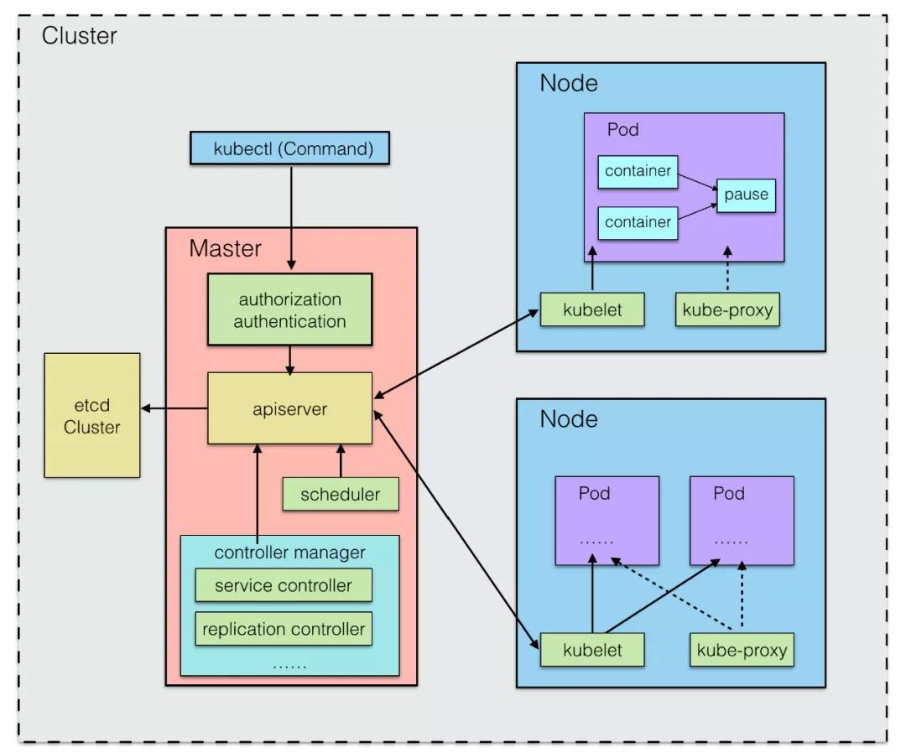

* Master 统一管理 Node 节点，在工作程序运行有效负载（应用程序）的地方控制和监视集群
* Node 在分布式系统中可以是物理主机，也可以是虚拟机
* Node 节点和 Master 节点共同组成分布式集群的 Cluster

一个 Kubernetes 集群最好能拥有 3 个 Master 节点，以实现高可用（HA Cluster）。

## Cluster

Kubernetes 集群是计算、存储和网络资源的集合。Kubernetes 利用这些资源运行各种基于容器的应用。

## Master

Cluster 的司令部，因此**调度**是它的主要任务。

Master 各组件如图：

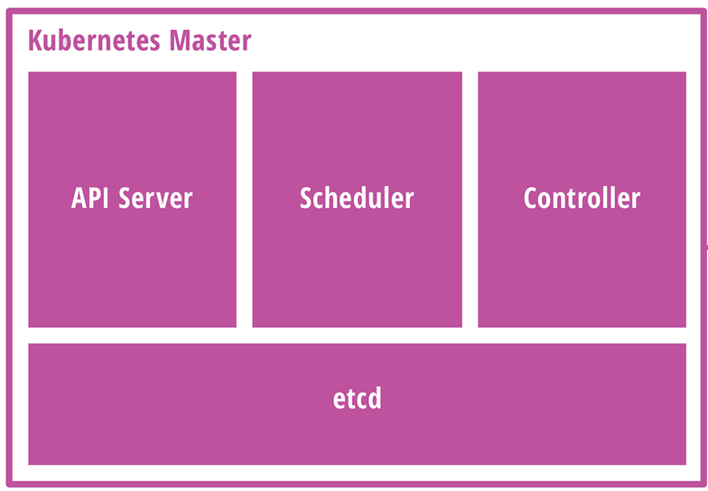

Master 各系统组件都被划分到 `kube-system` 的 namespace 中。

### **kube-apiserver 进程**

为一基于 HTTP/HTTPS 的 RESTful 服务器，是集群内各个功能模块之间数据交互和通信的中心枢纽

* 提供了集群管理各类资源对象（Pod、service 等）及 watch 等的 API 接口，也即 Kubernetes 的统一接口
* 所有模块之前并不会之间互相调用，而是通过和 kube-apiserver 打交道来完成自己那部分的工作
* 提供了完备的集群安全机制（验证，授权），同时也对集群外部暴露服务
* 用户可通过 REST 接口或 kubectl 命令行工具进行集群管理；因此 kubectl 本质上也是与 kube-apiserver 进行通信
* 每一个 Node 都有对应的一个 kube-apiserver 进程（[Pod](/2023/05/09/kubernetes-pod)）。

Master 和 Node 中几乎所有的组件都需要和 apiserver 通信，以执行所需要的职责。  
这样模块之间不会直接互相调用，而是统一通过 apiserver 打交道完成通信；并且屏蔽了与 etcd 的直接交互。

### **kube-scheduler 调度程序**

调度程序通过执行一系列复杂的算法（比如轮询调度 RR），为**每个 Pod 匹配到一个最佳的目标 node**，然后分发任务。
* 将 Pod 调度到指定的 node 上，这一过程也叫绑定（bind）：
    * 输入为需要调度的 Pod 和可以被调度的节点 node 的信息
    * 输出为调度算法选择的 node，并将该 pod bind 到这个 node
* 每一个 Node 都有对应的一个 kube-scheduler 进程（Pod）。

### **kube-controller-manager**

顾名思义，是 Kubernetes 管理各个 service controller 的控制中心。

Controller 管理着集群中的各种资源。  
每个 controller 本质上是一个控制循环，它通过 apiserver 监视集群的共享状态，对服务进行监控和恢复，尝试改变某个服务与期望不符的实际情况。  
当某个 Node 意外宕机时，Controller Manager 会及时发现并执行自动化修复流程，确保集群始终处于预期的工作状态。

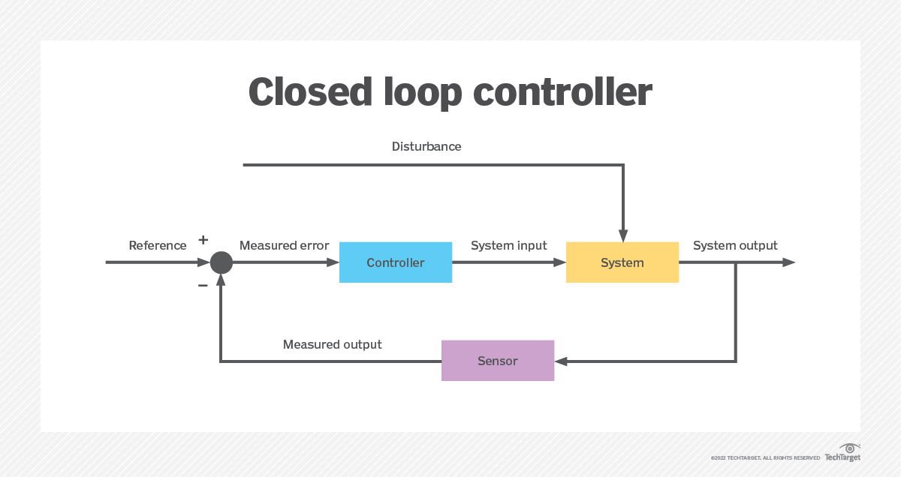

Kubernetes 内部的 service controller 包括：
* `Cronjob Controller`
* `DaemonSet Controller`
* `Deployment Controller`
* `Endpoints Controller`
* `HPA`(Horizontal Pod Autoscaling) `Controller`
* `Job Controller`
* `Namespace Controller`
* `NodeLifecycle Controller`
* `PV-binder Controller`
* `PV-expander Controller`
* `Replication Controller`
* `ResourceQuota Controller`
* `ServiceAccount Controller`
* `Service Controller`：管理 service
* `StatefulSet Controller`
* `Token Controller`：对 API server 访问进行认证

每一个 Node 都有对应的一个 kube-controller-manager 进程（Pod）。

### **etcd** 组件

作为高可用强一致性的存储仓库，[etcd](https://etcd.io) 存储集群上包括 Kubernetes 对象，node, pod, service, replicaset, namespace 等**集群所有的网络配置信息**和**对象的状态信息**。

简单说，etcd 集群是一个分布式系统，由多个节点相互通信构成整体对外服务，每个节点都存储了完整的数据，并且通过 Raft 协议保证每个节点维护的数据是一致的。

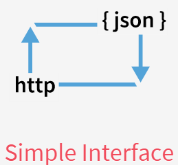 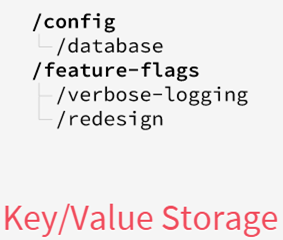 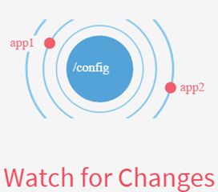

如果数据发生了变化，etcd 会快速通知相关的组件做出调整。

etcd 组件可内置于 Kubernetes，也可于集群外部搭建供 Kubernetes 使用。

etcd 的增删改查也是统一通过 kube-apiserver 进行调用的。

### Flannel

Flannel 是由 CoreOS 团队针对 Kubernetes 设计的一个网络规划服务。

由 Pod 的[内部结构](/2023/05/09/kubernetes-pod#网络通信)可知，Pod 内部的各个容器如应用程序在宿主机的通信一样，能够通过 `localhost:port` 的方式通信。

至于 Pod 和 Pod 之间的通信，有以下原则：

* 一个 Node 上的 Pod 和其它 Node 的 Pod 通信不需要通过网络地址转换（NAT）；
* 一个 Node 上所有的 agent 控制程序（如 deamon 和 kubelet）可以和该 Node 的 Pod 通信；
* Node 主机网络中的 Pod 可以与其它所有 Node 上的所有 Pod 通信，无需 NAT。

而 Flannel 通过覆盖网络（overlay network），将数据包封装在另外一个网络再转发，让集群中不同 Pod（包括其容器）**具有全集群唯一的 IP**。

### CoreDNS

CoreDNS 是“一个灵活可扩展的 DNS 服务器”，可以作为 Kubernetes 集群的 DNS，为集群提供**服务发现**的功能。

## Node

承载运行中的容器，负责监控和汇报容器状态。可以按照主从概念中的 slave / worker 来理解。

Node 包含以下状态信息：
* 地址：地址组合用法取决于云服务商或者 bare metal 的配置
* 状态：`OutOfDisk`, `Ready`, `MemoryPressure`, `DiskPressure`
* 容量：node 上的可用资源，包括 CPU、内存和可以调度到 node 上的 pods 的最大数量
* 通用信息：包括内核版本、Kubernetes 版本（kubelet, kube-proxy 版本），容器版本，操作系统名等

| Node 状态 | 描述 |
| -------- | ---- |
| OutOfDisk      | `True`：node 的空闲空间不足以添加新 pod |
| Ready          | `True`：node 是健康的，并已经准备好接收 pod `False`：node 不健康，且不能接收 pod `Unknown`：node 控制器在最近 40 秒内没有接收到 node 的消息 |
| MemoryPressure | `True`：node 不存在内存压力：内存用量低 |
| DiskPressure   | `True`：node 不存在磁盘压力：磁盘用量低 |

Node 各组件如图：

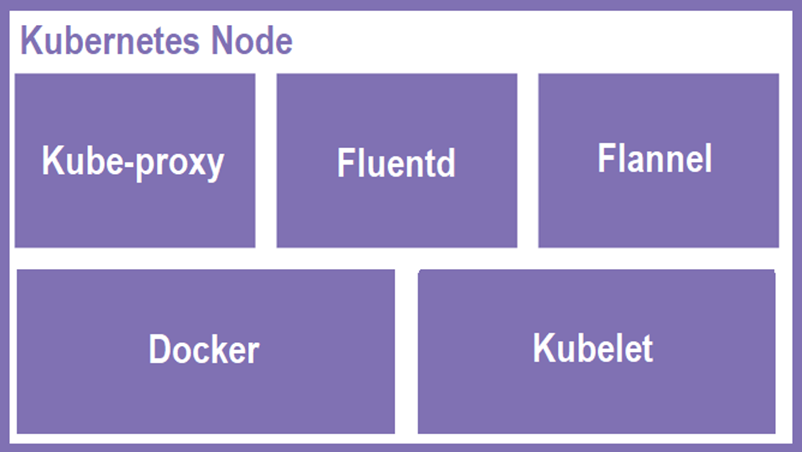

更动画化的示意图：

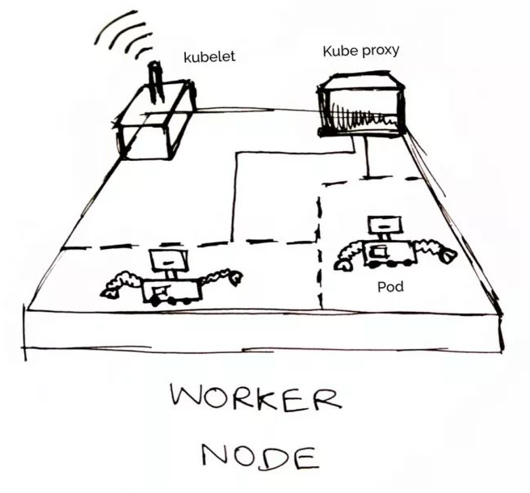

一个 Node 的生态如下：

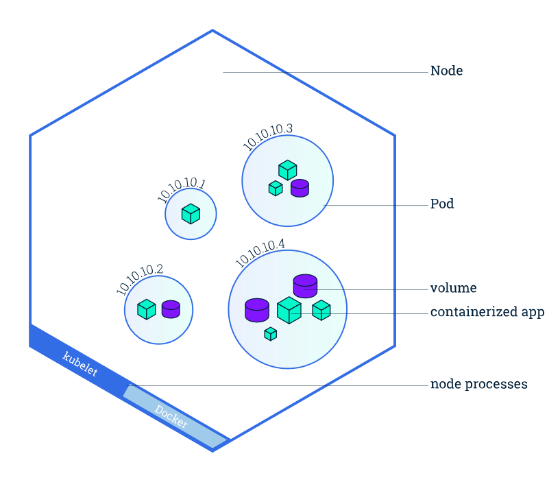

除 kubelet（**唯一没有以容器形式运行的组件**）外，Node 各系统组件都被划分到 `kube-system` 的 namespace 中。

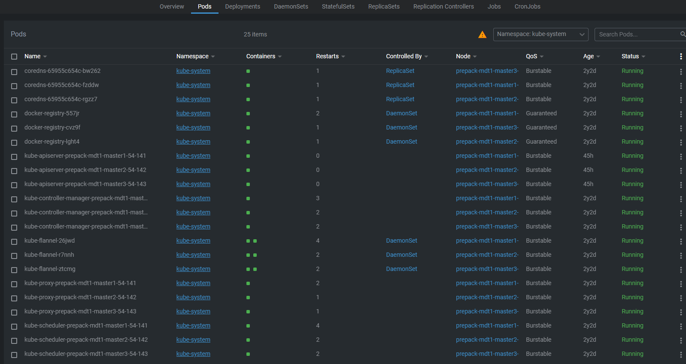

### **kubelet**

kubelet 组件是 Node 的心脏，用于管理容器生命周期（创建、修改、监控、删除等）。

* 每个 Node 节点会运行一个 kubelet 进程，与 apiserver 通信，并运行为该 Node 安排的容器
* 结合 cAdvisor 负责向 Master 汇报自身节点运行情况：Node 节点注册、终止、定时上报健康状况等
* 接收 Master 发出的命令，创建相应的 pod

### **kube-proxy**

负责请求的转发。

* 使用 IP 表（iptables）/ IPVS 将对 pod 的网络请求重定向到本地端口
* 为每个 service 建立服务代理对象（VIP），完成服务地址到 Pod 地址的代理
* 维护 node 上的防火墙规则和路由规则等信息，监听 apiserver 中 service / endpoints 的变化，并刷新对应规则，实现负载均衡
* 实现了集群内部从 Pod 到 Service，以及集群外部从 NodePort 到 Service 的访问

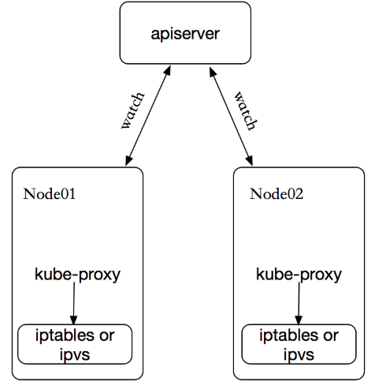

kube-proxy 的实现模式主要有三种：

`userspace`：最早的默认负载均衡方案（Kubernetes v1.0）

1. Client pod 发起访问服务 service 的请求
2. 请求到达 node 后，通过 service 的 IP 先进入**本地内核**的 iptables
3. 随后请求转到 userspace，被转发给用户空间监听的 kube-proxy 端口
4. kube-proxy 处理请求后，将请求封装，再根据内核空间 iptables 中的规则，将请求转发给后端的 service(backend) pod

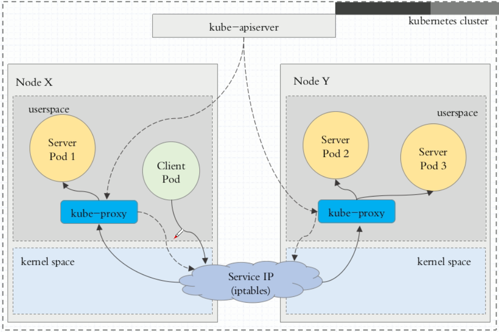

不过，流量从 userspace 进出内核带来的性能损耗是不可接受的。

`iptables`：happen since Kubernetes v1.1，基于 netfilter 实现，是目前默认的代理模式（Default since Kubernetes v1.2）。

当客户端请求 service IP 时，本地内核的 iptables 会根据规则，将请求直接路由到各个 service pod 上。

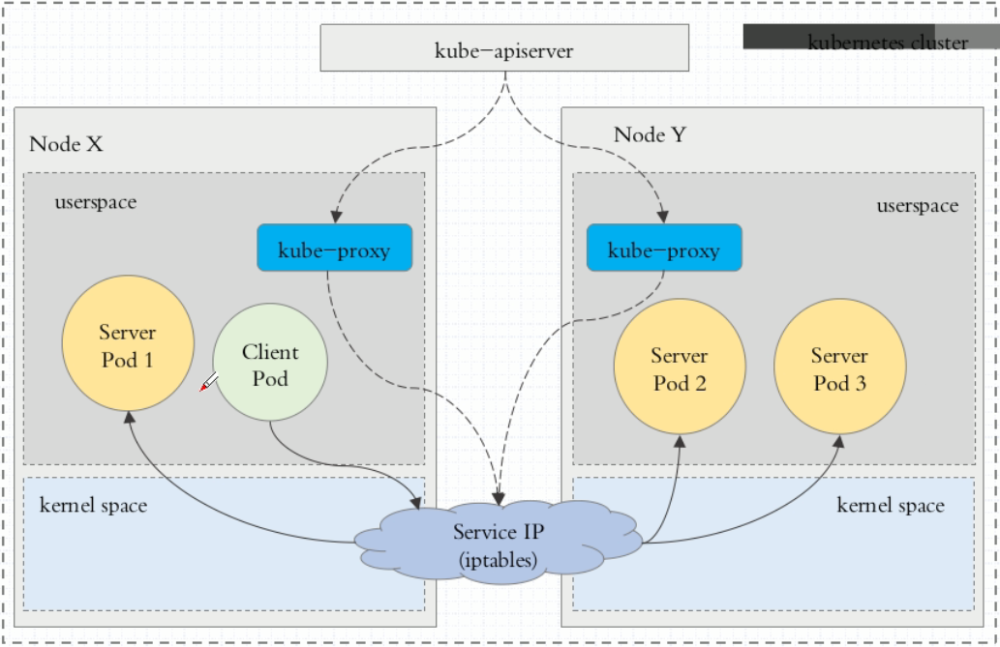

与 userspace 模式最大区别是：
* iptables 使用 NAT 模块实现 service 入口地址到 pod 实际地址的转换，采用随机数实现负载均衡，免去一次内核态到用户态的切换
* 如果 iptables 代理最初选择的那个 pod 没有响应，则**不会自动重试**其他 pod

iptables 的性能问题：
* 使用 NAT 转发，存在不可忽视的性能损耗
* 如集群中存在成千上万的 service / endpoints，则 node 上的 iptables rules 将非常庞大。

`ipvs`：since Kubernetes v1.9-alpha, default since v1.11

请求方式、路由建立与刷新与 iptables 相同，不一样的是，规则载体由 iptables 变成了 ipvs。

ipvs（基于哈希表）的性能优于 iptables（基于链表），其支持的轮询算法包括：
* DR: Direct Routing
* NAT
* Tunneling，也称 ipip 模式
* RR: round-robin / 轮询
* LC: least connection / 最少连接
* DH: destination hashing / 目标哈希
* SH: source hashing / 源哈希
* SED: shortest expected delay / 预计延迟时间最短
* NQ: never queue / 从不排队

### Fluentd

日志收集功能。

### Failover

多节点（node）的集群环境中，倘若某个 deployment 控制的 ReplicaSet 拥有 3 个副本（pod），分布在不同的节点上：

* 当 Node1 发生异常，原本在其上运行的 pod 状态无法被检测（status = UNKNOWN），这时 Kubernetes 会在其它正常运行的节点上**启动新的 pod** 来维护 deployment 的 replicas = 3
* 当 Node1 恢复正常，原本无法被检测状态的 pod **会被移除**；在其它 node 已创建的 replica（pod）也依然会在新的运行节点上，不会发生迁移。

# 存储管理

Kubernetes 一共使用三种资源管理存储：

Persistent Volume（持久化卷，**PV**）

* 属于对 Kubernetes 底层共享存储的抽象，由管理员进行创建和配置
* 通过**插件**机制完成与实际共享存储的对接
* 其生命周期与使用它的 pod 相互独立

Persistent Volume Claim（**PVC**）

* 属于 namespace 里的资源，描述一个用户对 PV 的请求 claim
* 请求信息包含存储大小、访问模式等
* PVC 直接与 pod 绑定

**StorageClass**

* PV 的创建模板，为管理员创建 PV 的时候提供一种描述存储“类型”的方法
* 不同的 StorageClass 可映射到服务质量级别、备份策略、或群管理员确定的任意策略的 PV 上
* 在其他存储系统上会被称为 profiles

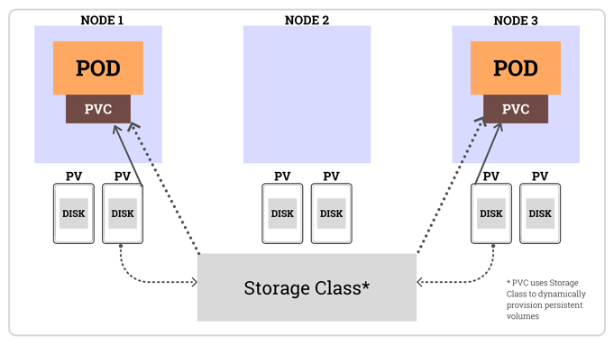

应用场景：用户提交 PVC，在 PVC 中指定存储类型（storageClassName），如果符合已经定义好的 StorageClass，则会为其自动创建 PV 并进行绑定。

