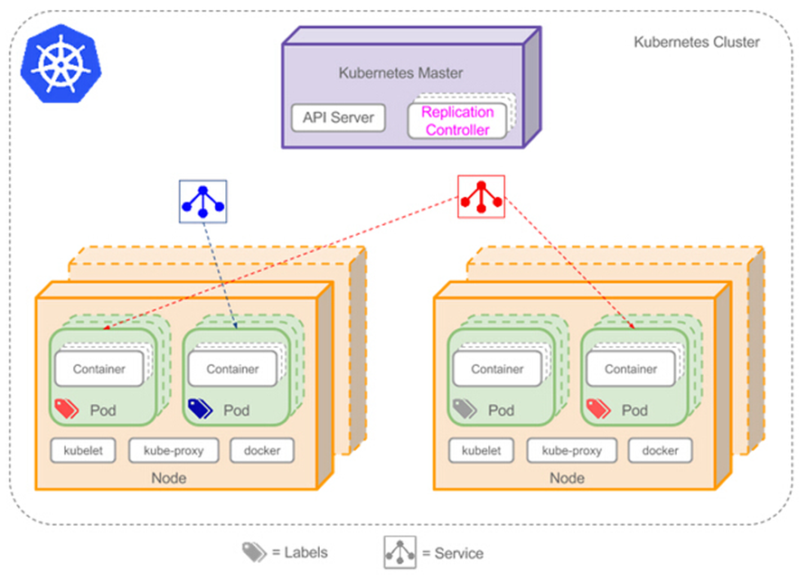

Kubernetes Node 通过 Pod 来管理自己所承载的容器。至于 Pod 怎么管理容器，涉及到 Kubernetes 容器编排的概念。

<!-- more -->

Kubernetes 结合的是 Google 数十年对大规模应用容器技术的经验的积累和升华。它对容器的编排管理包括且不仅限于：
* 上线下线
* 扩展集群
* 弹性伸缩
* 滚动升级 & 回滚
* 自动治愈 & 重启
* 服务发现
* ...

Kubernetes 不仅具有大规模运行容器编排所需的组件（Master & Node），还具有使用自定义组件交换内部和外部不同组件的灵活性。

在介绍容器编排的具体组件之前，我们先来了解一下容器编排的基本单元 —— Pod。


# Pod

Pod 是 Kubernetes 工作节点中最基本的操作单元，是集群中运行的一个进程，能够实现可管理性，通用和资源共享。

每个 Pod 会被分配到属于自己的 **IP 地址**，该 IP 仅在 cluster 中可见，kube-proxy 将使用该 IP 来路由流量。

一个 pod 可能包含一个或多个容器（可以是 docker 容器）：
* 运行单一容器（one-container-per-Pod）：最常见模型，Kubernetes 通过管理 pod 直接管理容器
* 运行多个容器：将应用程序的不同模块分离并分别部署到单独的容器中，加载时将所有容器视为一个容器加载，一起启动，一起停止；
  * 适合资源共享紧密的容器，但因为存在容器（服务）的职责粘连，并不多见（如数据拉取+清理存储+生成报表）

类似于一个 Servlet 容器完成部署 war 包、日志收集等功能。

每个 pod 启动时，内部会启动一个 **infra container**（由 Google 的一个镜像：`gcr.io/google_containers/pause` 启动而来，也叫 **pause 容器**）。  
pause 容器使用默认网络模式；  
pod 中的其它容器的网络模式为 container 模式，并会被指定为 pause 容器的 ID：`network_mode: "container:{pauseContainerID}"`。  
由此，pod 内部所有容器可**共享 pause 容器的网络**，通过 pause 容器统一识别外部网络空间，跟集群内其它 pod 进行通信。

由此完成了对 pod 中所有内部容器的共享设置：共享资源，共享配置；各个容器之间可通过 `localhost` 相互访问，对外则总是**被同时调度**。


Pod 有多种模式，包括 Sidebar，Proxy 等。

Pod 的状态（status）有五种：
* **Pending**：创建 pod 的请求被 Kubernetes 接受，但容器还没启动成功
  * 可能正处于写数据到 etcd、调度、pull 镜像、启动容器四个状态中的一个
  * 通常伴随这 ADDED, Modified 两个事件
* **Running**：pod 已经绑定到 node 节点，所有容器已经启动成功 / 至少一个容器在运行或重启
* **Succeed**：pod 中所有容器已正常自行退出，且 Kubernetes 永远不会重启这些容器，一般会在部署 job 时候出现
* **Failed**：pod 中所有容器已终止，且至少一个容器以失败告终（非零退出或被系统停止）
* **Unknown**：某种原因无法获取 pod 状态，通常由于与 pod 的主机通信错误


yaml 格式的 pod 定义文件完整内容：

```yml
apiVersion: v1        　　#必选，版本号，例如 v1
kind: Pod       　　　　　　#必选，Pod/Deployment/ReplicationController/Service/Job/...
metadata:       　　　　　　#必选，元数据
  name: string        　　#必选，Pod 名称
  namespace: string     　　#必选，Pod 所属的命名空间
  labels:       　　　　　　#自定义标签
    - key: value      　#自定义标签名字
  annotations:        　　#自定义注释列表
    - name: string
spec:         　　　　　　　#必选，Pod 中容器的详细定义（specification）
  containers:       　　　　#必选，Pod 中容器列表
  - name: string      　　#必选，容器名称
    image: string     　　#必选，容器的镜像名称
    imagePullPolicy: [Always | Never | IfNotPresent]  #获取镜像的策略 
        #Alawys 表示下载镜像 IfnotPresent 表示优先使用本地镜像，否则下载镜像，Never 表示仅使用本地镜像
    command: [string]     　　#容器的启动命令列表，如不指定，使用打包时使用的启动命令
    args: [string]      　　 #容器的启动命令参数列表
    workingDir: string      #容器的工作目录
    volumeMounts:     　　　　#挂载到容器内部的存储卷配置
    - name: string      　　　#引用 pod 定义的共享存储卷的名称，需用volumes[]部分定义的的卷名
      mountPath: string     #存储卷在容器内 mount 的绝对路径，应少于 512 字符
      readOnly: boolean     #是否为只读模式
    ports:        　　　　　　#需要暴露的端口库号列表
    - name: string      　　　#端口号名称
      containerPort: int    #容器需要监听的端口号
      hostPort: int     　　 #容器所在主机需要监听的端口号，默认与 Container 相同
      protocol: string      #端口协议，支持 TCP 和 UDP，默认 TCP
    env:        　　　　　　#容器运行前需设置的环境变量列表
    - name: string      　　#环境变量名称
      value: string     　　#环境变量的值
    resources:        　　#资源限制和请求的设置
      limits:       　　　　#资源限制的设置
        cpu: string     　　#Cpu 的限制，单位为core数，将用于 docker run --cpu-shares 参数
        memory: string      #内存限制，单位可以为 Mib/Gib，将用于 docker run --memory 参数
      requests:       　　#资源请求的设置
        cpu: string     　　#Cpu 请求，容器启动的初始可用数量
        memory: string      #内存清楚，容器启动的初始可用数量
    livenessProbe:      　　#对 Pod 内个容器健康检查的设置，当探测无响应几次后将自动重启该容器
            #检查方法有 exec、httpGet 和 tcpSocket，对一个容器只需设置其中一种方法即可
      exec:       　　　　　　#对 Pod 容器内检查方式设置为 exec 方式
        command: [string]   #exec 方式需要指定的命令或脚本
      httpGet:        　　　　#对 Pod 内各容器健康检查方法设置为 HttpGet，需要制定 Path、port
        path: string
        port: number
        host: string
        scheme: string
        HttpHeaders:
        - name: string
          value: string
      tcpSocket:      　　　　　　#对 Pod 内各容器健康检查方式设置为 tcpSocket 方式
         port: number
       initialDelaySeconds: 0   #容器启动完成后首次探测的时间，单位为秒
       timeoutSeconds: 0    　　#对容器健康检查探测等待响应的超时时间，单位秒，默认 1 秒
       periodSeconds: 0     　　#对容器监控检查的定期探测时间设置，单位秒，默认 10 秒一次
       successThreshold: 0
       failureThreshold: 0
       securityContext:
         privileged: false
  restartPolicy: [Always | Never | OnFailure] #Pod的重启策略，Always 表示一旦不管以何种方式终止运行，kubelet 都将重启，OnFailure 表示只有 Pod 以非 0 退出码退出才重启，Never 表示不再重启该 Pod
  nodeSelector: object   　　#设置 NodeSelector 表示将该Pod调度到包含这个 label 的 node 上，以 key：value 的格式指定
  imagePullSecrets:     　　　　#Pull 镜像时使用的 secret 名称，以 key：secretkey 格式指定
    - name: string
  hostNetwork: false      　　#是否使用主机网络模式，默认为 false，如果设置为 true，表示使用宿主机网络
  volumes:        　　　　　　#在该 pod 上定义共享存储卷列表
  - name: string     　　 　　#共享存储卷名称 （volumes类型有很多种，以下为其各类型的描述：）
    emptyDir: {}      　　　　#类型为 emptyDir 的存储卷，与 Pod 同生命周期的一个临时目录。为空值
    hostPath: string      　　#类型为 hostPath 的存储卷，表示挂载 Pod 所在宿主机的目录
      path: string      　　#Pod 所在宿主机的目录，将被用于同期中 mount 的目录
    secret:       　　　　　　#类型为 secret 的存储卷，挂载集群与定义的 secret 对象到容器内部
      secretname: string  
      items: 
      - key: string
        path: string
    configMap:      　　　　#类型为 configMap 的存储卷，挂载预定义的 configMap 对象到容器内部
      name: string
      items:
      - key: string
        path: string
```

在容器编排的时候，可根据 pod 的标签（**labels**）区分这个 pod 要运行在哪台主机（node）上。

每个 pod 就像一个受 node 管理的机器人一样，接收路由过来的请求，做着自己的事情。


## Pod 生命周期

初始化阶段：在 pod 主容器启动前，可以启动一些 init 容器来完成必要的初始化工作；这些 init 容器串行化执行，执行完后便会退出。

主容器启动后和结束前可分别指定操作 post start 和 pre stop，用来执行一些操作。

主容器启动后，可设置探针（probe）监测 pod 的状态：
* **liveness probe**：检查 pod 是否为 running 状态
* **readness probe**：判断容器是否可以接收 service 的请求：容器的 ready 是否为 True
* 每类探针支持三种探测方法：exec, httpGet, tcpSocket
* 探针的返回结果：success, failure, unknown


## **Namespace**

在 Kubernetes 集群内，可将资源对象（controller、pod 等）分配到不同的命名空间 namespace 中，以实现多租户的资源隔离。

集群默认的 namespace 是 `default`，`kube-*` 都是 Kubernetes 系统的命名空间。

在一个 pod 中，所有容器共享的资源包括：
* PID namespace（命名空间）：pod 中不同应用程序可看到其他应用程序的进程 ID
* 网络 namespace：pod 中多个容器能访问同一个 IP 和端口范围
* IPC namespace：pod 中多个容器能使用 SystemV IPC 或 POSIX 消息队列进行通信（属于进程间通信）
* UTS namespace：pod 中多个容器共享一个主机名（localhost）
* Volumes：共享存储卷，pod 中各个容器可访问在 pod 级别定义的 Volumes


# 容器编排组件

Kubernetes 针对不同的应用场景，定义了不同的容器编排方式，以满足不同需求。  
在之前介绍 [kube-controller-manager](/2022/05/18/kubernetes-overview#kube-controller-manager) 的时候提起过，针对于不同的方式，Kubernetes 有各种对应的 service controller 完成编排。

常用的编排方式有下面几种：


## ReplicaSet

创建，并管理给定的一个或多个 Pod 的副本。  
如 Pod 因某种原因死亡，replication controller 会立即介入，重新创建新的 Pod。

我们并不会直接去使用 ReplicaSet。

`Replication Controller`：通过 ReplicaSet 控制 Pod 的动态扩容和缩放
* 为每个 Pod 设置一个期望的副本数
* 需要时复制多份 Pod，不需要后缩减 Pod 至指定份数
* 期望值可通过手动更新，或自动扩容代理完成


水平扩容/缩容：


修改 replicaSet 控制的 pod 副本数量即可。比如从 2 改到 3 -> 水平扩容，反之则是水平收缩。


## Deployment

最常用的编排方式，由 `Deployment Controller` 控制，用于编排无状态应用。

Deployment 基于并使用 ReplicaSet 管理 pod 副本：通过放大新的 ReplicaSet 和缩小（最终删除）现有 ReplicaSet 提供滚动升级。

正因如此，Deployment Controller 包括了 Replication Controller 的**所有功能**。  
并且存在着这样的传递关系：**deployment 控制 replicaSet 的版本属性，replicaSet 控制 pod 的数量**。


由于 Kubernetes 中对象的命名方式是：子对象名 = 父对象名 + 随机字符串/数字，所以从 deployment pod 的名字就可以看出来：  
比如要创建的 deployment 是 `nginx-deployment`，那么创建出来的 ReplicaSet 是 `nginx-deployment-xxx`，最终创建出来的 pod 就是 `nginx-deployment-xxx-yyy`。


### 访问 Deployment
1. 通过 ServiceName 访问
2. CoreDNS 解析 ServiceName，返回 clusterIp
3. clusterIp 根据机器上 iptables / ipvs 的配置，转发到指定的 pod


### 创建 Deployment


1. `kubectl` 发起创建 deployment 的请求到 apiserver
2. apiserver 接收到请求后，将相关资源写入 etcd
3. apiserver 通知 kube-controller-manager 中对应的 controller 进行操作：
    1. `deployment controller` 会 list / watch 资源变化，并发起创建 replicaSet 请求
    2. 请求发送至 `replicaSet controller` 处理，list / watch 资源变化并发起创建 pod 请求
4. `scheduler` 检测到未绑定的（新建的或游离的）pod 资源
5. scheduler 通过一系列匹配以及过滤（通过 Node 的标签 Label 和 Pod 的 nodeSelector 属性进行匹配等），选择合适的 node 进行绑定
    * master 对 pod 的调度完成
5. 分发到具体的 node 后，`kubelet` 发现自己的 node 需创建新的 pod，便开始 pod 的创建及后续生命周期管理
6. `kube-proxy` 负责初始化 service 相关的资源：服务发现、负载均衡等网络规则

以上全过程的每一步，各组件**都通过 apiserver / etcd 进行交互和信息存储**（即步骤 2）。

其它编排方式的 pod 的创建过程与此类似。


## DaemonSet

顾名思义，用于编排守护进程。不同于 Deployment 的随机按需分布，每个 **node 最多运行 DaemonSet 的一个副本**。

`DaemonSet Controller`：能让特定或所有节点运行同一个 pod
* 节点被加入 Kubernetes 集群后：pod 会被 DaemonSet 调度到该节点执行
* 节点被移出 Kubernetes 集群后：被 DaemonSet 调度的 pod 会被移除
* 删除 DaemonSet：所有与其相关的 pod 都会被移除

典型应用场景：

* 在每个节点上运行**存储** Daemon（glusterd, ceph 等）
* 在每个节点上运行**日志收集** Daemon（fluentd, **logstash** 等）
* 在每个节点上运行**监控** Daemon（**Prometheus Node Exporter**, **collectd** 等）

kube-proxy 就是 Kubernetes 用于在每个 node 上运行系统组件的 DaemonSet。


## StatefulSet

用于编排有状态应用。保证副本按照固定的顺序启动/更新/删除。

由于 StatefulSet 没有 clusterIp，无法通过 iptables 指定转发规则和负载均衡（loadbalance），因此访问时只能返回所有待转发对象（pod）的请求方式。

访问 StatefulSet 通过 HeadlessServiceName 访问：
* 命名规则：`$(podName).$(headlessServiceName).$(namespace).$(clusterDomainName)`，一般指定到 headlessServiceName 即可。

<br/>

以上的 Deployment，ReplicaSet，DaemonSet 等管理**服务类容器**的编排方式，管理的是 HTTP 服务、Daemon 等**持续**的服务。


## Job/CronJob

不同于以上编排方式，Job 编排的是**一次性**的**工作类容器**，比如批处理任务，完成后容器就直接退出。

Job 重启策略：
* Never：永不重启，如果 Job 执行失败，则每次重新启动一个 pod 再次执行
* OnFailure：失败时重启容器

Job 可通过配置 parallelism 设置并行执行，通过设置 completions 设置运行个数。

CronJob：概念同 Linux 的 cronjob，意为**定时任务**。CronJob 比普通的 Job 多了一个 schedule:

```yaml
spec:
  schedule: "*/1 * * * *"
  jobTemplate:
    spec:
      ...
```

上述编排方式对应的 controller 会通过动态创建和销毁 pod 来保证应用整体的健壮性。换句话说，**pod 是脆弱的，但应用是健壮的**。

<br/>

每个 pod 的 IP 地址是不稳定的，会随着 pod 销毁和创建发生变化；然而服务调用需要对不同 pod 进行负载均衡，利用非固定的 IP 进行网络调用并不现实。

Kubernetes 专门**抽象**了一组 pod 的**逻辑定义**来解决这个问题。


# Service

Pod 是不稳定的，但是服务可以保证稳定。  
区别于 service controller 负责容器运行和编排，service 负责 Kubernetes 集群中**容器的访问**。

Service 的定义：

    An abstract way to expose an application running on a set of Pods as a network service.

Service 的职责：与每个 node 的 kube-proxy 进程相结合，**提供固定的 IP 和端口**，在将数据包分发到相应服务节点时充当代理，进行负载均衡。

工作原理：根据 service 的每个 pod 所设置的标签 label

* 比如某些 pod 被打上了 "app=xxx" 的标签
* Service controller 通过 `serviceSelector` 选择 label 同样为 "app=xxx" 的 pod
* 列举所有被选中的 pod 的 IP，构建出一个负载均衡列表 **endpoints**
  * 这些 endpoints 可被包装成一个完整的 service 对外提供服务
  * endpoints 所有 IP 和 pod 的端口通过 service controller 和 endpoint controller 共同选择并配置完成
  * 如果某个 pod 出现故障，脱离服务集群，它的 IP 会自动在 endpoints 中被移除
  * 如 serviceSelector 匹配到新的 pod，则 pod 的 IP 会自动加入各自对应的 endpoints 对象中
* kube-proxy 通过 iptables / ipvs 为每一个 service 对象实现固定的 IP，称之为 VIP 或者 `cluster IP`
* Service 的信息会通过 apiserver 存入 etcd 中

<small>注：iptables-save 指令可以查看 iptables。</small>

因此每一个 service 都有固定的 IP 和一些 endpoints。即使 pod 因为不稳定导致 ip 发生变化，但是面向客户端的是 service 的固定 IP 和端口。




值得注意的是，并不是所有的 service pod 都带有 selector，也不是只有带着 selector 的才能组建 service。

对于那些带 selector 的 service，endpoints controller 根据 selector 筛选出属于该 service 的所有 pod，依此创建出 endpoints 记录，并修改 DNS 配置，返回指向这些 pod 的记录（地址）；

对于那些不带 selector 的 service，它们无法直接创建出 endpoints，只能通过以下方式配置 DNS：
* 手动添加 endpoints
* 其他 service 的共享 endpoints
* ExternalName 类型的 service 提供的 CNAME


## 端口和 IP

Service 配置如下：

```yaml
apiVersion: v1
kind: Service
metadata:
  name: my-service
spec:
  selector:
    app: MyApp    # 会自动生成对应的 endpoint 对象，如不配置则不会自动生成，需要手动指定
  ports:
    - protocol: TCP
      port: 80
      targetPort: 9376
      nodePort: 30036
```

对应的 Endpoints 对象：

```yaml
apiVersion: v1
kind: Endpoints
metadata:
  name: my-service
subsets:
  - addresses:
      - ip: 192.0.2.42
    ports:
      - port: 9376    # 配置相对应的 port，使其能对应上相应的 service
```

可以看到，service 的配置 yaml 文件中定义了很多种端口：

**port**：service 暴露在 clusterIP 上的接口
* `clusterIP:port` 是提供给**集群内部**访问 Kubernetes 服务的入口。

**nodePort**
* `nodeIP:nodePort` 是提供给**集群外部**访问 Kubernetes 服务的入口
* 一般来说从 30000-32767 中选择一个端口赋给 nodePort。

**targetPort**：与 containerPort 一样是 pod 上的端口
* 从 port 和 nodePort 过来的数据，经过 kube-proxy 从后端 pod 的 targetPort 进入容器

也就是说，port 和 nodePort 都是 service 的端口，前者暴露给从集群内访问服务的方式，后者则暴露给集群外访问服务的方式；  
这两个端口的流入数据均需经过反向代理 kube-proxy 流入后端具体 pod 的 targetPort，从而进入到 pod 上的 container 内。  
一般来说，在同一个集群中的 port 和 targetPort 会配置相同的端口。

再来说说不同 IP 的概念：

**Pod IP**：顾名思义，是 Pod 的 IP，其实就是 pause 容器的 IP，通常是一个虚拟的二层网络。

**Cluster IP**：service 对象的 IP。

不同于 Pod IP 地址实际存在于某个网卡（或虚拟设备）上，Cluster IP 并没有一个网络设备去承载它：它其实是一个虚拟地址。

**Node IP**：节点的 IP，即物理网卡（虚拟网卡）的 IP。

结合直接指定的或者 Kubernetes 分配的 nodePort，外部可以通过 `nodeIP:nodePort` 直接访问该服务。


## 类型

Kubernetes 的 service 主要有四种不同类型：


**ClusterIP**

默认的 Service 类型，只用于集群内部通信。service 之间只需通过访问 VIP 即可负载均衡地访问到对方 service 中的 pod。

根据 service 是否生成 Cluster IP，又可细分为：
  * 普通 service：最常见的 service。通过 kube-proxy 实现的 Cluster IP 实现集群内的访问
  * Headless Service：为该 service 在集群内部的每个成员提供一个唯一的 **DNS 域名**作为每个成员的网络标识

普通的 service 必须要与 kube-proxy 相结合。

Headless Service 在集群内部各成员之间使用域名通信，其创建取决于 service 的 selector 配置。

可应用于直接访问某个 pod 提供的服务，比如 StatefulSet。具有以下特征：
* Kubernetes 不会为其分配 Cluster IP（`.spec.clusterIP: None`）
* 不通过 kube-proxy 做反向代理和负载均衡，而是通过 DNS 提供稳定的网络 ID 访问
* DNS 将 headless service 的后端直接解析为 pod IP 列表


**NodePort**

可由集群外部通过 `nodeIP:nodePort` 访问的服务。

指定 service 类型为 NodePort 后，Kubernetes 控制台默认会从 30000-32767 中分配一个端口来代理服务
* 或：在 yaml 配置文件的 `.spec.ports[*].nodePort` 配置指定的端口值
* 从 Kubernetes v1.10 开始，亦可调整 kube-proxy 中的 `--nodeport-addresses` 来配置指定的代理 IP


**LoadBalancer**

与 NodePort 类似，不过实现起来需要结合外部公有云（GCP / Azure / ...）。

除了使用一个 Cluster IP 和 nodePort 外，还通过所使用的公有云申请一个负载均衡器，实现从集群外通过 LoadBalancer 访问对应的服务。  
负载均衡器后端映射到各节点的 nodePort，流量会直接到后端的 pod 中。


**ExternalName**

Service 的特例，主要面向集群外部的服务。

ExternalName 可将外部独立服务映射进 Kubernetes 集群，且具备 Kubernetes 内服务的一些特征（如 namespace 等），为集群提供服务。

不像上述三种类型服务通过 kube-proxy 路由，该种映射依赖于 DNS 实现（kube-dns version >= 1.7）


小结：
* 前三种类型的 service 通过 selector 指定服务对应的 pod，根据所有 pod 地址创建出 endpoints 对象作为服务后端
  * Endpoint Controller 监测 service 和 pod 的状态，维护对应 endpoints 信息
  * kube-proxy 根据 service 和 endpoints 维护本地路由规则
  * pod 发生变化 `->` service 发生变化 `->` endpoints 发生变化 `->` kube-proxy 在每个 node 上更新 iptables / ipvs，实现一层负载均衡
* 而 ExternalName 不通过 kube-proxy 重定向，也不指定 selector，因此没有 port 和 endpoints 的概念

ExternalName 与 ClusterIP 的 Headless Service **同属 Headless Service**，Kubernetes 不给它们分配 service IP，且不通过 kube-proxy 给它们做反向代理和负载均衡。


## 服务发现

DNS：默认形式
* 可在集群中部署 CoreDNS 服务（旧版本 Kubernetes 使用的是 kubeDNS），让集群内部的 pod 通过 DNS 方式实现集群内部各个服务之间的通信

环境变量
* pod 创建完成后，kubelet 会在该 pod 中注册该集群已创建的所有 service 相关的环境变量
* 注意：service 创建之前的所有 pod 并不会注册该环境变量


# Rolling Update

应用更新的时候，Kubernetes 每次只更新一小部分，成功之后再去更新更多的副本，最终完成所有副本的更新。

比如某个拥有 3 个 replica 的 deployment 需要从 v1 更新至 v2：
* 先成功启动 v2 版本的 ReplicaSet 控制下的一个 pod，同时完全关闭 v1 版本控制下的一个 pod
* 上述操作完成后，逐渐增加 v2 版本控制的 pod 数量至 3；同时 v1 版本控制的 pod 数量减到 0


应用的回滚则与上述过程相反。而且在每一次新版本的安装需要 --record 做好记录，之后调用 `kubectl rollout undo` 的时候才能指定已记录的版本（`--to-revision`）进行回滚。

最大好处：**零停机**，更新过程中保证业务连续性。

实际应用：配置 `RollingUpdateStrategy` 控制滚动更新策略
* `maxSurge`: deployment 还可以创建多少个新 pod
* `maxUnavailable`: deployment 可删除多少个旧 pod

更新/回滚完成后，另一版本的 ReplicaSet **并不会被删除**，其 pod 数量减为 0。


# 运行时调度

默认配置下，scheduler 会将 pod 自动调度到所有可用的 node 上；但当集群中每个节点配置有所区别时，我们有多种方法将特定功能的 pod 调度到指定 node 上。

区别于全局调度 —— 设置 Kubernetes 启动调度器，我们可以通过打标签（**Label**）或设置亲和性（**Affinity**），在运行时进行调度。


## 设置 Label

给 node 添加标签：

```shell
kubectl label node k8s-node1 prod=sit
```

给 pod 设置 nodeSelector：

```yaml
# pod 文件：
...
spec:
  nodeSelector:
    prod=sit
...
# 如指定 node 标签不存在，pod 会一直 pending，不会被分配到任何的 node 上

# 或：
...
spec:
  nodeName: k8s-node1
...
```

给 node 删除标签：

```shell
kubectl label node k8s-node1 prod-
```


## 设置亲和度 Affinity

为 node 或 pod 设定亲和性，能够匹配更多的逻辑组合，而不只是字符串的完全相等。亲和度主要分为三类：


### `nodeAffinity`

主机亲和性，处理的是 **pod 和主机之间**的关系，让 pod 部署/不要部署在哪些主机上。

规则包括：

硬亲和性 `requiredDuringSchedulingIgnoredDuringException`
* 强制性规则，pod 调度时必须满足的规则，否则就不停重试，pod 一直 pending

```yaml
...
spec:
  containers:
  ...
  affinity:
    nodeAffinity:
      requiredDuringSchedulingIgnoredDuringExecution:
        nodeSelectorTerms:  # nodeSelector 组
        - matchExpressions:
          - key: key
            operator: In
            values:
            - "value1"
            - "value2"
...
```

软亲和性 `preferredDuringSchedulingIgnoredDuringException`
* 柔性调度规则，pod 调度时可满足其规则（“更倾向于”部署在指定 node 上）
* 若无法满足规则，可调度到一个不匹配规则的 node 上。

```yaml
...
spec:
  containers:
  ...
  affinity:
    nodeAffinity:
      preferredDuringSchedulingIgnoredDuringExecution:
      - weight: 60  # 权重
        preference:  # 偏好
          matchExpressions:
          - key: zone
            operator: In
            values:
            - "value1"
            - "value2"
      - weight: 30
        preference:
          matchExpressions:
          - key: zone2
            operator: Exists
...
```

解释一下上述两种亲和性的后缀 `-IgnoredDuringException`：
* 字面上的理解：“有异常的时候忽略”
* 表示 pod 资源在基于 nodeAffinity 被调度到某个 node 后，如果 node 的label 发生改变（“有异常”），调度器不会将 pod 从 node 上移除（“忽略”）
* 该规则仅对新创建的 pod 有效

与之相对的，是后缀为 `-RequiredDuringException` 的亲和性：
* 字面上的理解：“有异常的时候需要（改动）”
* 如 node label 发生改变（“有异常”），pod 会重新选择符合要求的节点（“需要”）。


### podAffinity

pod 亲和性，主要解决 **pod 与 pod 之间**的关系：哪些 pod 可以部署在同一拓扑域。规则与 nodeAffinity 相同。

```yaml
# 例子1：
...
spec:
  containers:
  ...
  affinity:
    podAffinity:
      requiredDuringSchedulingIgnoredDuringExecution:
        labelSelector:
        - matchExpressions:
          - key: key
            operator: In
            values:
            - "value1"
            - "value2"
          topologyKey: prod
...
```

```yaml
# 例子2:
...
spec:
  containers:
  ...
  affinity:
    podAffinity:
      preferredDuringSchedulingIgnoredDuringExecution:
      - weight: 60
        podAffinityTerm:
          labelSelector: 
            matchExpressions:
            - key: zone
              operator: In
              values:
              - "value1"
              - "value2"
          topologyKey: prod
      - weight: 30
        preference:
          matchExpressions:
          - key: zone2
            operator: Exists
...
```

拓扑域（topologyKey）：根据 node 上的标签划分范围，范围内的 pod 即在一个域里面。


### podAntiAffinity

顾名思义，pod 反亲和性，也是解决集群内部 **pod 与 pod 之间**的关系
* 主要解决 pod **不可以**和哪些 pod 部署在同一拓扑域的问题


| 策略   | 匹配目标  | 操作符   | 调度目标  |
| ----- | -------- | ------  | -------  |
| nodeAffinity     | 主机标签  | In, NotIn, Exists, DoesNotExist, Gt, Lt | 指定主机  |
| podAffinity      | pod 标签 | In, NotIn, Exists, DoesNotExist         | pod 和指定的 pod 在同一拓扑域  |
| podAntiAffinity  | pod 标签 | In, NotIn, Exists, DoesNotExist         | pod 和指定的 pod 不在同一拓扑域 |

亲和性的应用：应用 A 和 B 之间交互频繁，有必要利用亲和性将两个应用尽可能靠近，甚至分配在同一 node 上，减少网络通信带来的性能损耗

反亲和性的应用：应用采用**多副本**部署，使用反亲和性将应用实例打散分布在各个 node 上，提高 HA

各种匹配规则的叠加：
* 同时指定 nodeSelector 和 nodeAffinity，pod 必须都满足才能被分配到 node 上
* nodeAffinity 如果有多个 nodeSelectorTerms，那么 pod 只需满足一个就能分配到 node 上
* nodeSelectorTerms 如果有多个 matchExpressions，pod 必须都满足才能分配到 node 上


## Taint（污点） & Toleration（容忍度）

我们知道，具有节点亲和性的 node 和 pod 之间是相吸的；  
与亲和性作用相反的是，具有“污点”的 node 和 pod 之间是**互斥**的。

通过配置 Taint 和 Toleration，可以避免 pod 被分配到不合适的节点上
* 每个 node 可被应用一个或多个 taint，表示这个 node 不会接受那些不能容忍这些 taint 的 pod
* 每个 pod 可被应用一个或多个 toleration，表示这些 pod 可以（但不要求）被调度到具有相应 taint 的 node 上

设置污点 taint：
```bash
kubectl taint node [node] key=value:[effect]
# effect=[NoSchedule | PreferNoSchedule | NoExecute]
```

去除污点：
```bash
kubectl taint node [node] key:[effect]-
```

与之相对，pod 上的 toleration 里面声明的 key 和 effect 需要跟 taint 的设置保持一致。

举例：
```yaml
tolerations:
- key: "key"
  operator: "Exists"
  effect: "NoSchedule"

# 或：
tolerations:
- key: "key"
  operator: "Equal"
  value: "value"
  effect: "NoSchedule"
```

* operator 为 Exists：无需指定 value
* operator 为 Equal：value 需跟 taint 的值相等才生效
* 不指定 operator：默认为 Equal
* 空的 key 配合 Exists 能匹配所有键值对
* 空的 effect 匹配所有的 effect

toleration 中的 `effect` 值：

`NoSchedule`：一定不要被调度
* 如果一个 pod 没有声明容忍（toleration）该 taint，则系统不会将该 pod 调度到有这个 taint 的 node 上
* 应用：节点独占

`PreferNoSchedule`：尽量不要调度
* 如果一个 pod 没有声明容忍该 taint，则系统尽量避免将该 pod 调度到有这个 taint 的 node 上
* NoSchedule 的软限制版本

`NoExecute`：不仅不会调度，还会驱逐 node 上已有的 pod
* 没有声明该容忍的 pod 会被立刻驱逐
* 配置对应的 toleration 的 pod，如没有为 tolerationSeconds 赋值，则会一直留在该 node 中
* 配置对应的 toleration 且指定 tolerationSeconds 的 pod，则会在指定时间后被驱逐
* 应用：定义 pod 驱逐行为，应对节点故障


### 多污点与多容忍配置

Kubernetes 调度器处理**多个 taint 和 toleration 能匹配的部分**，剩下的没被忽略的 taint 就是对 pod 的效果
* 如果剩余 taint 存在 effort=NoSchedule：调度器不会将该 pod 调度到该节点上
* 如果剩余 taint 没有 NoSchedule，但有 PreferNoSchedule：调度器会尝试不将 pod 调度到该节点
* 如果剩余 taint 有 effort=NoSchedule，且 pod 已经在该 node 运行，则 pod 会被驱逐；如不在该 node 运行，则 pod 不会被调度到该节点

