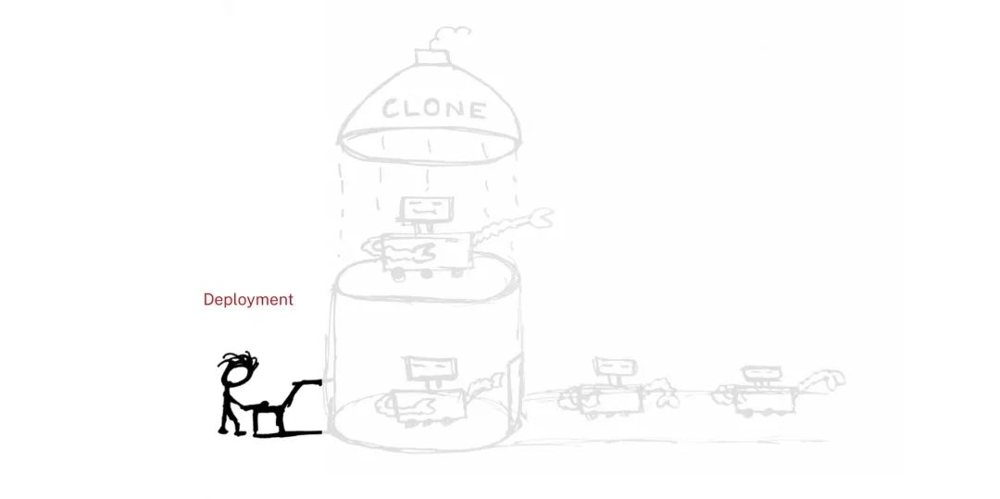

Kubernetes Node 通过 [Pod](/2023/05/09/kubernetes-pod) 来管理自己所承载的容器。至于 Pod 怎么管理容器，涉及到 Kubernetes 容器编排的概念。

<!-- more -->

Kubernetes 结合的是 Google 数十年对大规模应用容器技术的经验的积累和升华。它对容器的编排管理包括且不仅限于：
* 上线下线
* 扩展集群
* 弹性伸缩
* 滚动升级 & 回滚
* 自动治愈 & 重启
* 服务发现
* ...

Kubernetes 不仅具有大规模运行容器编排所需的组件（Master & Node），还具有使用自定义组件交换内部和外部不同组件的灵活性。


# 容器编排组件

Kubernetes 针对不同的应用场景，定义了不同的容器编排方式，以满足不同需求。  
在之前介绍 [kube-controller-manager](/2022/05/18/kubernetes-overview#kube-controller-manager) 的时候提起过，针对于不同的方式，Kubernetes 有各种对应的 service controller 完成编排。

常用的编排方式有下面几种：


## ReplicaSet

创建，并管理给定的一个或多个 Pod 的副本。  
如 Pod 因某种原因死亡，replication controller 会立即介入，重新创建新的 Pod。

我们并不会直接去使用 ReplicaSet。

`Replication Controller`：通过 ReplicaSet 控制 Pod 的动态扩容和缩放
* 为每个 Pod 设置一个期望的副本数
* 需要时复制多份 Pod，不需要后缩减 Pod 至指定份数
* 期望值可通过手动更新，或自动扩容代理完成


同时，Replication Controller 还可以：

* 确保 pod 健康：终止不健康、运行出错或者无法提供服务的 pod，再创建新的实例；
* 弹性伸缩：在业务波峰波谷的时候动态调整 pod 的数量，提高资源利用率；同时配置相应的 HPA 监控能定时自动从监控平台获取 replication controller 关联 pod 的整体资源使用，做到自动伸缩
* 滚动升级 Rolling Update

水平扩容/缩容：


修改 replicaSet 控制的 pod 副本数量即可。比如从 2 改到 3 -> 水平扩容，反之则是水平收缩。


### Rolling Update

应用更新的时候，Kubernetes 每次只更新一小部分，成功之后再去更新更多的副本，最终完成所有副本的更新。

比如某个拥有 3 个 replica 的 deployment 需要从 v1 更新至 v2：
* 先成功启动 v2 版本的 ReplicaSet 控制下的一个 pod，同时完全关闭 v1 版本控制下的一个 pod
* 上述操作完成后，逐渐增加 v2 版本控制的 pod 数量至 3；同时 v1 版本控制的 pod 数量减到 0


应用的回滚则与上述过程相反。而且在每一次新版本的安装需要 --record 做好记录，之后调用 `kubectl rollout undo` 的时候才能指定已记录的版本（`--to-revision`）进行回滚。

最大好处：**零停机**，更新过程中保证业务连续性。

实际应用：配置 `RollingUpdateStrategy` 控制滚动更新策略
* `maxSurge`: deployment 还可以创建多少个新 pod
* `maxUnavailable`: deployment 可删除多少个旧 pod

更新/回滚完成后，另一版本的 ReplicaSet **并不会被删除**，其 pod 数量减为 0。


## Deployment

最常用的编排方式，由 `Deployment Controller` 控制，用于编排无状态应用。

Deployment 基于并使用 ReplicaSet 管理 pod 副本：通过放大新的 ReplicaSet 和缩小（最终删除）现有 ReplicaSet 提供滚动升级。

正因如此，Deployment Controller 包括了 Replication Controller 的**所有功能**。  
并且存在着这样的传递关系：**deployment 控制 replicaSet 的版本属性，replicaSet 控制 pod 的数量**。



由于 Kubernetes 中对象的命名方式是：子对象名 = 父对象名 + 随机字符串/数字，所以从 deployment pod 的名字就可以看出来：  
比如要创建的 deployment 是 `nginx-deployment`，那么创建出来的 ReplicaSet 是 `nginx-deployment-xxx`，最终创建出来的 pod 就是 `nginx-deployment-xxx-yyy`。


### 访问 Deployment

1. 通过 ServiceName 访问
2. CoreDNS 解析 ServiceName，返回 clusterIp
3. clusterIp 根据机器上 iptables / ipvs 的配置，转发到指定的 pod


### 创建 Deployment


1. `kubectl` 发起创建 deployment 的请求到 apiserver
2. apiserver 接收到请求后，将相关资源写入 etcd
3. apiserver 通知 kube-controller-manager 中对应的 controller 进行操作：
    1. `deployment controller` 会 list / watch 资源变化，并发起创建 replicaSet 请求
    2. 请求发送至 `replicaSet controller` 处理，list / watch 资源变化并发起创建 pod 请求
4. `scheduler` 检测到未绑定的（新建的或游离的）pod 资源
5. scheduler 通过一系列匹配以及过滤（通过 Node 的标签 Label 和 Pod 的 nodeSelector 属性进行匹配等），选择合适的 node 进行绑定
    * master 对 pod 的调度完成
5. 分发到具体的 node 后，`kubelet` 发现自己的 node 需创建新的 pod，便开始 pod 的创建及后续生命周期管理
6. `kube-proxy` 负责初始化 service 相关的资源：服务发现、负载均衡等网络规则

以上全过程的每一步，各组件**都通过 apiserver / etcd 进行交互和信息存储**（即步骤 2）。

其它编排方式的 pod 的创建过程与此类似。


## StatefulSet

用于编排有状态（保存数据）的应用。保证副本按照固定的顺序启动/更新/删除。

由于 StatefulSet 没有 clusterIp，无法通过 iptables 指定转发规则和负载均衡（loadbalance），因此访问时只能返回所有待转发对象（pod）的请求方式。

访问 StatefulSet 通过 HeadlessServiceName 访问：
* 命名规则：`$(podName).$(headlessServiceName).$(namespace).$(clusterDomainName)`，一般指定到 headlessServiceName 即可。

<br/>

以上的 Deployment，ReplicaSet，DaemonSet 等管理**服务类容器**的编排方式，管理的是 HTTP 服务、Daemon 等**持续**的服务。


## DaemonSet

顾名思义，用于编排守护进程。不同于 Deployment 的随机按需分布，每个 **node 最多运行 DaemonSet 的一个副本**，所有（或者特定）的 node 运行同一个 DaemonSet 的 pod。

`DaemonSet Controller`：能让特定或所有节点运行同一个 pod
* 节点被加入 Kubernetes 集群后：pod 会被 DaemonSet 调度到该节点执行
* 节点被移出 Kubernetes 集群后：被 DaemonSet 调度的 pod 会被移除
* 删除 DaemonSet：所有与其相关的 pod 都会被移除

典型应用场景：

* 在每个节点上运行**存储** Daemon（glusterd, ceph 等）
* 在每个节点上运行**日志收集** Daemon（fluentd, **logstash** 等）
* 在每个节点上运行**监控** Daemon（**Prometheus Node Exporter**, **collectd** 等）

kube-proxy 就是 Kubernetes 用于在每个 node 上运行系统组件的 DaemonSet。


## Job/CronJob

不同于以上编排方式，Job 编排的是**一次性**的**工作类容器**，比如批处理任务，完成后容器就直接退出。

Job 重启策略：
* Never：永不重启，如果 Job 执行失败，则每次重新启动一个 pod 再次执行
* OnFailure：失败时重启容器

Job 可通过配置 parallelism 设置并行执行，通过设置 completions 设置运行个数。

CronJob：概念同 Linux 的 cronjob，意为**定时任务**。CronJob 比普通的 Job 多了一个 schedule:

```yaml
spec:
  schedule: "*/1 * * * *"
  jobTemplate:
    spec:
      ...
```

上述编排方式对应的 controller 会通过动态创建和销毁 pod 来保证应用整体的健壮性。换句话说，**pod 是脆弱的，但应用是健壮的**。

除了上述的编排方式，Kubernetes 还抽象出来了 [Service](/2023/05/10/kubernetes-service) 的概念。


# 运行时调度

默认配置下，scheduler 会将 pod 自动调度到所有可用的 node 上；但当集群中每个节点配置有所区别时，我们有多种方法将特定功能的 pod 调度到指定 node 上。

区别于全局调度 —— 设置 Kubernetes 启动调度器，我们可以通过打标签（**Label**）或设置亲和性（**Affinity**），在运行时进行调度。


## 设置 Label

给 node 添加标签：

```shell
kubectl label node k8s-node1 prod=sit
```

给 pod 设置 nodeSelector：

```yaml
# pod 文件：
...
spec:
  nodeSelector:
    prod=sit
...
# 如指定 node 标签不存在，pod 会一直 pending，不会被分配到任何的 node 上

# 或：
...
spec:
  nodeName: k8s-node1
...
```

给 node 删除标签：

```shell
kubectl label node k8s-node1 prod-
```


## 设置亲和度 Affinity

为 node 或 pod 设定亲和性，能够匹配更多的逻辑组合，而不只是字符串的完全相等。亲和度主要分为三类：


### `nodeAffinity`

主机亲和性，处理的是 **pod 和主机之间**的关系，让 pod 部署/不要部署在哪些主机上。

规则包括：

硬亲和性 `requiredDuringSchedulingIgnoredDuringException`
* 强制性规则，pod 调度时必须满足的规则，否则就不停重试，pod 一直 pending

```yaml
...
spec:
  containers:
  ...
  affinity:
    nodeAffinity:
      requiredDuringSchedulingIgnoredDuringExecution:
        nodeSelectorTerms:  # nodeSelector 组
        - matchExpressions:
          - key: key
            operator: In
            values:
            - "value1"
            - "value2"
...
```

软亲和性 `preferredDuringSchedulingIgnoredDuringException`
* 柔性调度规则，pod 调度时可满足其规则（“更倾向于”部署在指定 node 上）
* 若无法满足规则，可调度到一个不匹配规则的 node 上。

```yaml
...
spec:
  containers:
  ...
  affinity:
    nodeAffinity:
      preferredDuringSchedulingIgnoredDuringExecution:
      - weight: 60  # 权重
        preference:  # 偏好
          matchExpressions:
          - key: zone
            operator: In
            values:
            - "value1"
            - "value2"
      - weight: 30
        preference:
          matchExpressions:
          - key: zone2
            operator: Exists
...
```

解释一下上述两种亲和性的后缀 `-IgnoredDuringException`：
* 字面上的理解：“有异常的时候忽略”
* 表示 pod 资源在基于 nodeAffinity 被调度到某个 node 后，如果 node 的label 发生改变（“有异常”），调度器不会将 pod 从 node 上移除（“忽略”）
* 该规则仅对新创建的 pod 有效

与之相对的，是后缀为 `-RequiredDuringException` 的亲和性：
* 字面上的理解：“有异常的时候需要（改动）”
* 如 node label 发生改变（“有异常”），pod 会重新选择符合要求的节点（“需要”）。


### podAffinity

pod 亲和性，主要解决 **pod 与 pod 之间**的关系：哪些 pod 可以部署在同一拓扑域。规则与 nodeAffinity 相同。

```yaml
# 例子1：
...
spec:
  containers:
  ...
  affinity:
    podAffinity:
      requiredDuringSchedulingIgnoredDuringExecution:
        labelSelector:
        - matchExpressions:
          - key: key
            operator: In
            values:
            - "value1"
            - "value2"
          topologyKey: prod
...
```

```yaml
# 例子2:
...
spec:
  containers:
  ...
  affinity:
    podAffinity:
      preferredDuringSchedulingIgnoredDuringExecution:
      - weight: 60
        podAffinityTerm:
          labelSelector: 
            matchExpressions:
            - key: zone
              operator: In
              values:
              - "value1"
              - "value2"
          topologyKey: prod
      - weight: 30
        preference:
          matchExpressions:
          - key: zone2
            operator: Exists
...
```

拓扑域（topologyKey）：根据 node 上的标签划分范围，范围内的 pod 即在一个域里面。


### podAntiAffinity

顾名思义，pod 反亲和性，也是解决集群内部 **pod 与 pod 之间**的关系
* 主要解决 pod **不可以**和哪些 pod 部署在同一拓扑域的问题


| 策略   | 匹配目标  | 操作符   | 调度目标  |
| ----- | -------- | ------  | -------  |
| nodeAffinity     | 主机标签  | In, NotIn, Exists, DoesNotExist, Gt, Lt | 指定主机  |
| podAffinity      | pod 标签 | In, NotIn, Exists, DoesNotExist         | pod 和指定的 pod 在同一拓扑域  |
| podAntiAffinity  | pod 标签 | In, NotIn, Exists, DoesNotExist         | pod 和指定的 pod 不在同一拓扑域 |

亲和性的应用：应用 A 和 B 之间交互频繁，有必要利用亲和性将两个应用尽可能靠近，甚至分配在同一 node 上，减少网络通信带来的性能损耗

反亲和性的应用：应用采用**多副本**部署，使用反亲和性将应用实例打散分布在各个 node 上，提高 HA

各种匹配规则的叠加：
* 同时指定 nodeSelector 和 nodeAffinity，pod 必须都满足才能被分配到 node 上
* nodeAffinity 如果有多个 nodeSelectorTerms，那么 pod 只需满足一个就能分配到 node 上
* nodeSelectorTerms 如果有多个 matchExpressions，pod 必须都满足才能分配到 node 上


## Taint（污点） & Toleration（容忍度）

我们知道，具有节点亲和性的 node 和 pod 之间是相吸的；  
与亲和性作用相反的是，具有“污点”的 node 和 pod 之间是**互斥**的。

通过配置 Taint 和 Toleration，可以避免 pod 被分配到不合适的节点上
* 每个 node 可被应用一个或多个 taint，表示这个 node 不会接受那些不能容忍这些 taint 的 pod
* 每个 pod 可被应用一个或多个 toleration，表示这些 pod 可以（但不要求）被调度到具有相应 taint 的 node 上

设置污点 taint：
```bash
kubectl taint node [node] key=value:[effect]
# effect=[NoSchedule | PreferNoSchedule | NoExecute]
```

去除污点：
```bash
kubectl taint node [node] key:[effect]-
```

与之相对，pod 上的 toleration 里面声明的 key 和 effect 需要跟 taint 的设置保持一致。

举例：
```yaml
tolerations:
- key: "key"
  operator: "Exists"
  effect: "NoSchedule"

# 或：
tolerations:
- key: "key"
  operator: "Equal"
  value: "value"
  effect: "NoSchedule"
```

* operator 为 Exists：无需指定 value
* operator 为 Equal：value 需跟 taint 的值相等才生效
* 不指定 operator：默认为 Equal
* 空的 key 配合 Exists 能匹配所有键值对
* 空的 effect 匹配所有的 effect

toleration 中的 `effect` 值：

`NoSchedule`：一定不要被调度
* 如果一个 pod 没有声明容忍（toleration）该 taint，则系统不会将该 pod 调度到有这个 taint 的 node 上
* 应用：节点独占

`PreferNoSchedule`：尽量不要调度
* 如果一个 pod 没有声明容忍该 taint，则系统尽量避免将该 pod 调度到有这个 taint 的 node 上
* NoSchedule 的软限制版本

`NoExecute`：不仅不会调度，还会驱逐 node 上已有的 pod
* 没有声明该容忍的 pod 会被立刻驱逐
* 配置对应的 toleration 的 pod，如没有为 tolerationSeconds 赋值，则会一直留在该 node 中
* 配置对应的 toleration 且指定 tolerationSeconds 的 pod，则会在指定时间后被驱逐
* 应用：定义 pod 驱逐行为，应对节点故障


### 多污点与多容忍配置

Kubernetes 调度器处理**多个 taint 和 toleration 能匹配的部分**，剩下的没被忽略的 taint 就是对 pod 的效果
* 如果剩余 taint 存在 effort=NoSchedule：调度器不会将该 pod 调度到该节点上
* 如果剩余 taint 没有 NoSchedule，但有 PreferNoSchedule：调度器会尝试不将 pod 调度到该节点
* 如果剩余 taint 有 effort=NoSchedule，且 pod 已经在该 node 运行，则 pod 会被驱逐；如不在该 node 运行，则 pod 不会被调度到该节点

