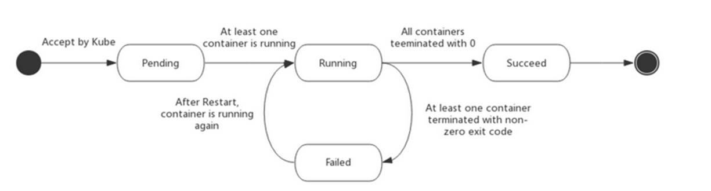
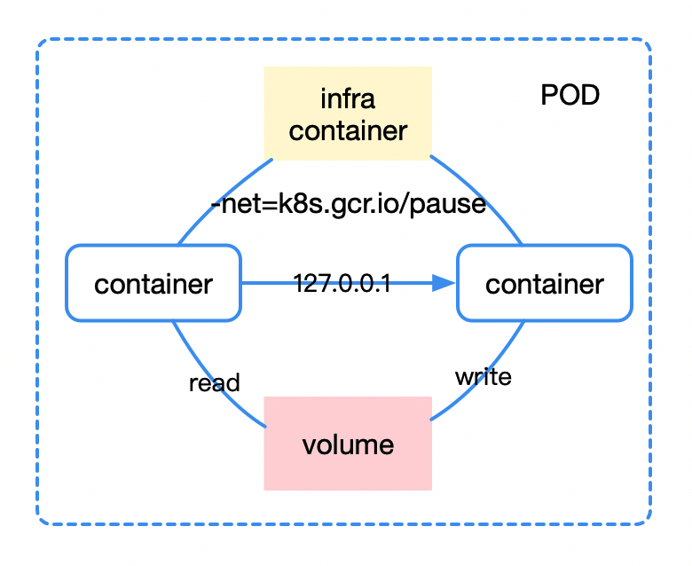
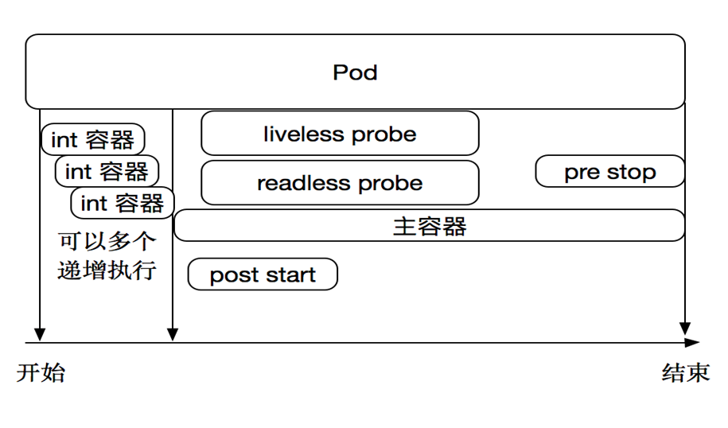
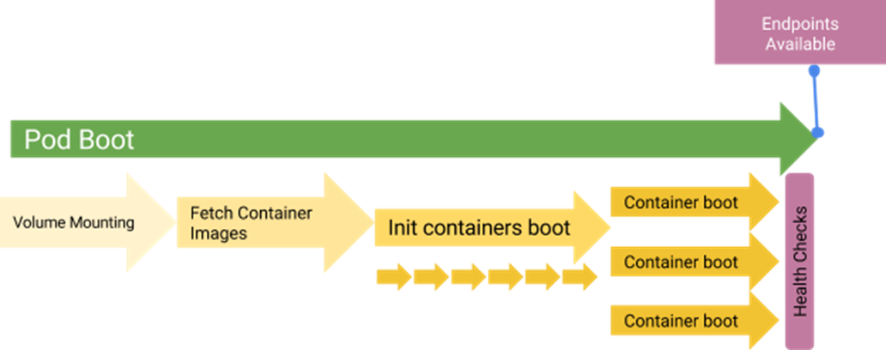

Pod 是 Kubernetes 工作节点中最基本的操作单元，是集群中运行的一个进程，能够实现可管理性，通用和资源共享。

<!-- more -->

# 概况

作为 Kubernetes 计算的最小可部署单元，一个 Pod 可能包含一个或多个容器（可以是 docker 容器）：
* 运行单一容器（one-container-per-Pod）：最常见模型，Kubernetes 通过管理 pod 直接管理容器
* 运行多个容器：将应用程序的不同模块分离并分别部署到单独的容器中，加载时将所有容器视为一个容器加载，一起启动，一起停止；
  * 适合资源共享紧密的容器，但因为存在容器（服务）的职责粘连，并不多见（如数据拉取+清理存储+生成报表）

类似于一个 Servlet 容器完成部署 war 包、日志收集等功能。

Pod 有多种模式，包括 Sidebar，Proxy 等。

Pod 的状态（status）有五种：
* **Pending**：创建 pod 的请求被 Kubernetes 接受，但容器还没启动成功
  * 可能正处于写数据到 etcd、调度、pull 镜像、启动容器四个状态中的一个
  * 通常伴随这 ADDED, Modified 两个事件
* **Running**：pod 已经绑定到 node 节点，所有容器已经启动成功 / 至少一个容器在运行或重启
* **Succeed**：pod 中所有容器已正常自行退出，且 Kubernetes 永远不会重启这些容器，一般会在部署 job 时候出现
* **Failed**：pod 中所有容器已终止，且至少一个容器以失败告终（非零退出或被系统停止）
* **Unknown**：某种原因无法获取 pod 状态，通常由于与 pod 的主机通信错误



yaml 格式的 pod 定义文件完整内容：

```yml
apiVersion: v1        　　#必选，版本号，例如 v1
kind: Pod       　　　　　　#必选，Pod/Deployment/ReplicationController/Service/Job/...
metadata:       　　　　　　#必选，元数据
  name: string        　　#必选，Pod 名称
  namespace: string     　　#必选，Pod 所属的命名空间
  labels:       　　　　　　#自定义标签
    - key: value      　#自定义标签名字
  annotations:        　　#自定义注释列表
    - name: string
spec:         　　　　　　　#必选，Pod 中容器的详细定义（specification）
  containers:       　　　　#必选，Pod 中容器列表
  - name: string      　　#必选，容器名称
    image: string     　　#必选，容器的镜像名称
    imagePullPolicy: [Always | Never | IfNotPresent]  #获取镜像的策略 
        #Alawys 表示下载镜像 IfnotPresent 表示优先使用本地镜像，否则下载镜像，Never 表示仅使用本地镜像
    command: [string]     　　#容器的启动命令列表，如不指定，使用打包时使用的启动命令
    args: [string]      　　 #容器的启动命令参数列表
    workingDir: string      #容器的工作目录
    volumeMounts:     　　　　#挂载到容器内部的存储卷配置
    - name: string      　　　#引用 pod 定义的共享存储卷的名称，需用volumes[]部分定义的的卷名
      mountPath: string     #存储卷在容器内 mount 的绝对路径，应少于 512 字符
      readOnly: boolean     #是否为只读模式
    ports:        　　　　　　#需要暴露的端口库号列表
    - name: string      　　　#端口号名称
      containerPort: int    #容器需要监听的端口号
      hostPort: int     　　 #容器所在主机需要监听的端口号，默认与 Container 相同
      protocol: string      #端口协议，支持 TCP 和 UDP，默认 TCP
    env:        　　　　　　#容器运行前需设置的环境变量列表
    - name: string      　　#环境变量名称
      value: string     　　#环境变量的值
    resources:        　　#资源限制和请求的设置
      limits:       　　　　#资源限制的设置
        cpu: string     　　#Cpu 的限制，单位为core数，将用于 docker run --cpu-shares 参数
        memory: string      #内存限制，单位可以为 Mib/Gib，将用于 docker run --memory 参数
      requests:       　　#资源请求的设置
        cpu: string     　　#Cpu 请求，容器启动的初始可用数量
        memory: string      #内存清楚，容器启动的初始可用数量
    livenessProbe:      　　#对 Pod 内个容器健康检查的设置，当探测无响应几次后将自动重启该容器
            #检查方法有 exec、httpGet 和 tcpSocket，对一个容器只需设置其中一种方法即可
      exec:       　　　　　　#对 Pod 容器内检查方式设置为 exec 方式
        command: [string]   #exec 方式需要指定的命令或脚本
      httpGet:        　　　　#对 Pod 内各容器健康检查方法设置为 HttpGet，需要制定 Path、port
        path: string
        port: number
        host: string
        scheme: string
        HttpHeaders:
        - name: string
          value: string
      tcpSocket:      　　　　　　#对 Pod 内各容器健康检查方式设置为 tcpSocket 方式
         port: number
       initialDelaySeconds: 0   #容器启动完成后首次探测的时间，单位为秒
       timeoutSeconds: 0    　　#对容器健康检查探测等待响应的超时时间，单位秒，默认 1 秒
       periodSeconds: 0     　　#对容器监控检查的定期探测时间设置，单位秒，默认 10 秒一次
       successThreshold: 0
       failureThreshold: 0
       securityContext:
         privileged: false
  restartPolicy: [Always | Never | OnFailure] #Pod的重启策略，Always 表示一旦不管以何种方式终止运行，kubelet 都将重启，OnFailure 表示只有 Pod 以非 0 退出码退出才重启，Never 表示不再重启该 Pod
  nodeSelector: object   　　#设置 NodeSelector 表示将该Pod调度到包含这个 label 的 node 上，以 key：value 的格式指定
  imagePullSecrets:     　　　　#Pull 镜像时使用的 secret 名称，以 key：secretkey 格式指定
    - name: string
  hostNetwork: false      　　#是否使用主机网络模式，默认为 false，如果设置为 true，表示使用宿主机网络
  volumes:        　　　　　　#在该 pod 上定义共享存储卷列表
  - name: string     　　 　　#共享存储卷名称 （volumes类型有很多种，以下为其各类型的描述：）
    emptyDir: {}      　　　　#类型为 emptyDir 的存储卷，与 Pod 同生命周期的一个临时目录。为空值
    hostPath: string      　　#类型为 hostPath 的存储卷，表示挂载 Pod 所在宿主机的目录
      path: string      　　#Pod 所在宿主机的目录，将被用于同期中 mount 的目录
    secret:       　　　　　　#类型为 secret 的存储卷，挂载集群与定义的 secret 对象到容器内部
      secretname: string  
      items: 
      - key: string
        path: string
    configMap:      　　　　#类型为 configMap 的存储卷，挂载预定义的 configMap 对象到容器内部
      name: string
      items:
      - key: string
        path: string
```

在容器编排的时候，可根据 pod 的标签（**labels**）区分这个 pod 要运行在哪台主机（node）上。

每个 pod 就像一个受 node 管理的机器人一样，接收路由过来的请求，做着自己的事情。


# 网络通信

每个 Pod 会被分配到属于自己的 **IP 地址**，该 IP 仅在 cluster 中可见，kube-proxy 将使用该 IP 来路由流量。

每个 pod 启动时，内部会启动一个 **infra container**（由 Google 的一个镜像：`gcr.io/google_containers/pause` 启动而来，也叫 **pause 容器**）。  
pause 容器使用默认网络模式；

pod 中的其它容器的网络模式为 container 模式，并会被指定为 pause 容器的 ID：`network_mode: "container:{pauseContainerID}"`。  
由此，pod 内部所有容器可**共享 pause 容器的网络**，通过 pause 容器统一识别外部网络空间，跟集群内其它 pod 进行通信。

由此完成了对 pod 中所有内部容器的共享设置：共享资源，共享配置；各个容器之间可通过 `localhost` 相互访问，对外则总是**被同时调度**。




# 生命周期

初始化阶段：在 pod 主容器启动前，可以启动一些 init 容器来完成必要的初始化工作；这些 init 容器串行化执行，执行完后便会退出。

主容器启动后和结束前可分别指定操作 post start 和 pre stop，用来执行一些操作。

主容器启动后，可设置探针（probe）监测 pod 的状态：
* **liveness probe**：检查 pod 是否为 running 状态
* **readness probe**：判断容器是否可以接收 service 的请求：容器的 ready 是否为 True
* 每类探针支持三种探测方法：exec, httpGet, tcpSocket
* 探针的返回结果：success, failure, unknown






# **Namespace**

在 Kubernetes 集群内，可将资源对象（controller、pod 等）分配到不同的命名空间 namespace 中，以实现多租户的资源隔离。

集群默认的 namespace 是 `default`，`kube-*` 都是 Kubernetes 系统的命名空间。

在一个 pod 中，所有容器共享的资源包括：
* PID namespace（命名空间）：pod 中不同应用程序可看到其他应用程序的进程 ID
* 网络 namespace：pod 中多个容器能访问同一个 IP 和端口范围
* IPC namespace：pod 中多个容器能使用 SystemV IPC 或 POSIX 消息队列进行通信（属于进程间通信）
* UTS namespace：pod 中多个容器共享一个主机名（localhost）
* Volumes：共享存储卷，pod 中各个容器可访问在 pod 级别定义的 Volumes
