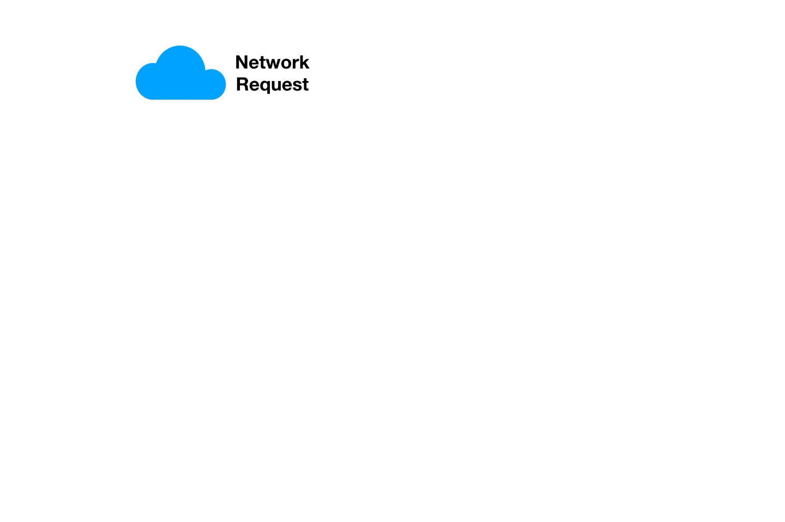
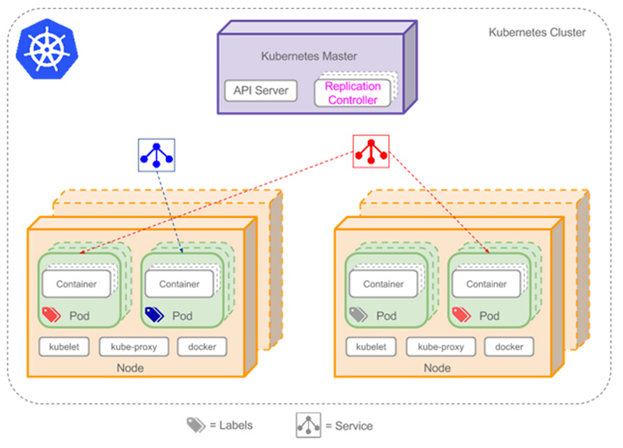
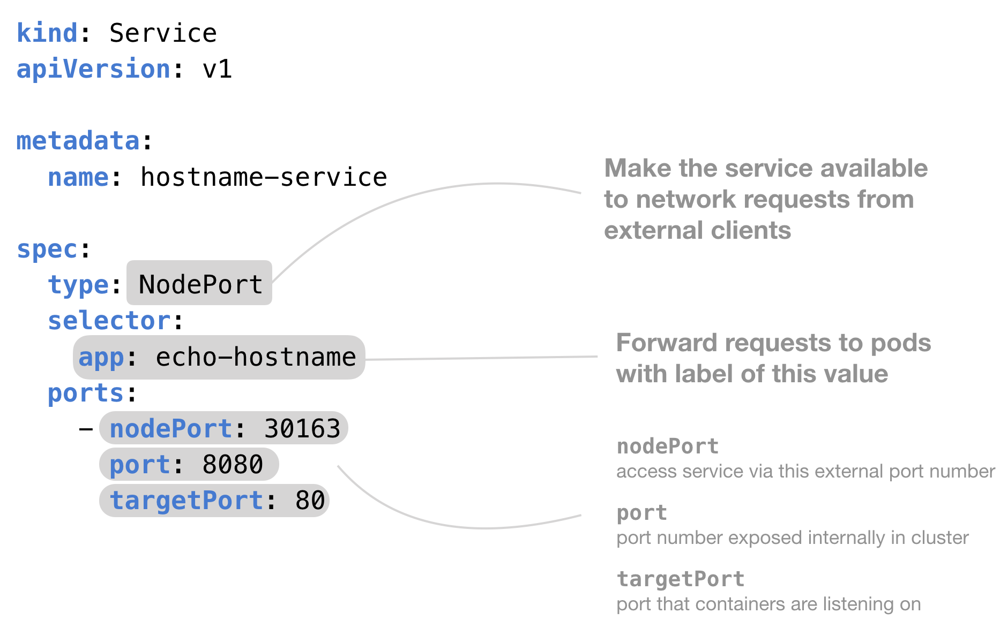

Service 是 Kubernetes 里面另一种非常常见的容器编排方式。

<!-- more -->

每个 pod 的 IP 地址是不稳定的，会随着 pod 销毁和创建发生变化；然而服务调用需要对不同 pod 进行负载均衡，利用非固定的 IP 进行网络调用并不现实。

Kubernetes 专门**抽象**了一组 pod 的**逻辑定义**来解决这个问题。


# Service 概况

Pod 是不稳定的，但是服务可以保证稳定。  
区别于 service controller / endpoints controller 负责容器运行和编排，service 负责 Kubernetes 集群中**容器的访问**。

Service 的定义：

    An abstract way to expose an application running on a set of Pods as a network service.

Service 的职责：与每个 node 的 kube-proxy 进程相结合，**提供固定的 IP 和端口**，在将数据包分发到相应服务节点时充当代理，进行负载均衡。

工作原理：根据 service 的每个 pod 所设置的标签 label

* 比如某些 pod 被打上了 "app=xxx" 的标签
* Service controller 通过 `serviceSelector` 选择 label 同样为 "app=xxx" 的 pod
* 列举所有被选中的 pod 的 IP，构建出一个负载均衡列表 **endpoints**
  * 这些 endpoints 可被包装成一个完整的 service 对外提供服务
  * endpoints 所有 IP 和 pod 的端口通过 service controller 和 endpoints controller 共同选择并配置完成
  * 如果某个 pod 出现故障，脱离服务集群，它的 IP 会自动在 endpoints 中被移除
  * 如 serviceSelector 匹配到新的 pod，则 pod 的 IP 会自动加入各自对应的 endpoints 对象中
* kube-proxy 通过 iptables / ipvs 为每一个 service 对象实现固定的 IP，称之为 VIP 或者 `cluster IP`
* Service 的信息会通过 apiserver 存入 etcd 中

<small>注：`iptables-save` 指令可以查看 iptables。</small>

因此每一个 service 都有固定的 IP 和一些 endpoints。即使 pod 因为不稳定导致 ip 发生变化，但是面向客户端的是 service 的**固定 IP 和端口**。





值得注意的是，并不是所有的 service pod 都带有 selector，也不是只有带着 selector 的才能组建 service。

对于那些带 selector 的 service，endpoints controller 根据 selector 筛选出属于该 service 的所有 pod，依此创建出 endpoints 记录，并修改 DNS 配置，返回指向这些 pod 的记录（地址）；

对于那些不带 selector 的 service，它们无法直接创建出 endpoints，只能通过以下方式配置 DNS：
* 手动添加 endpoints
* 其他 service 的共享 endpoints
* ExternalName 类型的 service 提供的 CNAME


# 端口和 IP

Service 配置如下：

```yaml
apiVersion: v1
kind: Service
metadata:
  name: my-service
spec:
  selector:
    app: MyApp    # 会自动生成对应的 endpoint 对象，如不配置则不会自动生成，需要手动指定
  ports:
    - protocol: TCP
      port: 80
      targetPort: 9376
      nodePort: 30036
```

对应的 Endpoints 对象：

```yaml
apiVersion: v1
kind: Endpoints
metadata:
  name: my-service
subsets:
  - addresses:
      - ip: 192.0.2.42
    ports:
      - port: 9376    # 配置相对应的 port，使其能对应上相应的 service
```

可以看到，service 的配置 yaml 文件中定义了很多种端口：

**port**：service 暴露在 clusterIP 上的接口
* `clusterIP:port` 是提供给**集群内部**访问 Kubernetes 服务的入口。

**nodePort**
* `nodeIP:nodePort` 是提供给**集群外部**访问 Kubernetes 服务的入口
* 一般来说从 30000-32767 中选择一个端口赋给 nodePort。

**targetPort**：与 containerPort 一样是 pod 上的端口
* 从 port 和 nodePort 过来的数据，经过 kube-proxy 从后端 pod 的 targetPort 进入容器

也就是说，port 和 nodePort 都是 service 的端口，前者暴露给从集群内访问服务的方式，后者则暴露给集群外访问服务的方式；  
这两个端口的流入数据均需经过反向代理 kube-proxy 流入后端具体 pod 的 targetPort，从而进入到 pod 上的 container 内。  
一般来说，在同一个集群中的 port 和 targetPort 会配置相同的端口。

再来说说不同 IP 的概念：

**Pod IP**：顾名思义，是 Pod 的 IP，其实就是 pause 容器的 IP，通常是一个虚拟的二层网络。

**Cluster IP**：service 对象的 IP。

不同于 Pod IP 地址实际存在于某个网卡（或虚拟设备）上，Cluster IP 并没有一个网络设备去承载它：它其实是一个虚拟地址。

**Node IP**：节点的 IP，即物理网卡（虚拟网卡）的 IP。

结合直接指定的或者 Kubernetes 分配的 nodePort，外部可以通过 `nodeIP:nodePort` 直接访问该服务。


# 类型

Kubernetes 的 service 主要有四种不同类型：


## **ClusterIP**

默认的 Service 类型，只用于集群内部通信。service 之间只需通过访问 VIP 即可负载均衡地访问到对方 service 中的 pod。

根据 service 是否生成 Cluster IP，又可细分为：
  * 普通 service：最常见的 service。通过 kube-proxy 实现的 Cluster IP 实现集群内的访问
  * Headless Service：为该 service 在集群内部的每个成员提供一个唯一的 **DNS 域名**作为每个成员的网络标识

普通的 service 必须要与 kube-proxy 相结合。

Headless Service 在集群内部各成员之间使用域名通信，其创建取决于 service 的 selector 配置。

可应用于直接访问某个 pod 提供的服务，比如 StatefulSet。具有以下特征：
* Kubernetes 不会为其分配 Cluster IP（`.spec.clusterIP: None`）
* 不通过 kube-proxy 做反向代理和负载均衡，而是通过 DNS 提供稳定的网络 ID 访问
* DNS 将 headless service 的后端直接解析为 pod IP 列表


## **NodePort**

可由集群外部通过 `nodeIP:nodePort` 访问的服务。

指定 service 类型为 NodePort 后，Kubernetes 控制台默认会从 30000-32767 中分配一个端口来代理服务
* 或：在 yaml 配置文件的 `.spec.ports[*].nodePort` 配置指定的端口值
* 从 Kubernetes v1.10 开始，亦可调整 kube-proxy 中的 `--nodeport-addresses` 来配置指定的代理 IP


## **LoadBalancer**

与 NodePort 类似，不过实现起来需要结合外部公有云（GCP / Azure / ...）。

除了使用一个 Cluster IP 和 nodePort 外，还通过所使用的公有云申请一个负载均衡器，实现从集群外通过 LoadBalancer 访问对应的服务。  
负载均衡器后端映射到各节点的 nodePort，流量会直接到后端的 pod 中。


## **ExternalName**

Service 的特例，主要面向集群外部的服务。

ExternalName 可将外部独立服务映射进 Kubernetes 集群，且具备 Kubernetes 内服务的一些特征（如 namespace 等），为集群提供服务。

不像上述三种类型服务通过 kube-proxy 路由，该种映射依赖于 DNS 实现（kube-dns version >= 1.7）




小结：
* 前三种类型的 service 通过 selector 指定服务对应的 pod，根据所有 pod 地址创建出 endpoints 对象作为服务后端
  * Endpoint Controller 监测 service 和 pod 的状态，维护对应 endpoints 信息
  * kube-proxy 根据 service 和 endpoints 维护本地路由规则
  * pod 发生变化 `->` service 发生变化 `->` endpoints 发生变化 `->` kube-proxy 在每个 node 上更新 iptables / ipvs，实现一层负载均衡
* 而 ExternalName 不通过 kube-proxy 重定向，也不指定 selector，因此没有 port 和 endpoints 的概念

ExternalName 与 ClusterIP 的 Headless Service **同属 Headless Service**，Kubernetes 不给它们分配 service IP，且不通过 kube-proxy 给它们做反向代理和负载均衡。


# 服务发现

DNS：默认形式
* 可在集群中部署 CoreDNS 服务（旧版本 Kubernetes 使用的是 kubeDNS），让集群内部的 pod 通过 DNS 方式实现集群内部各个服务之间的通信

环境变量
* pod 创建完成后，kubelet 会在该 pod 中注册该集群已创建的所有 service 相关的环境变量
* 注意：service 创建之前的所有 pod 并不会注册该环境变量

