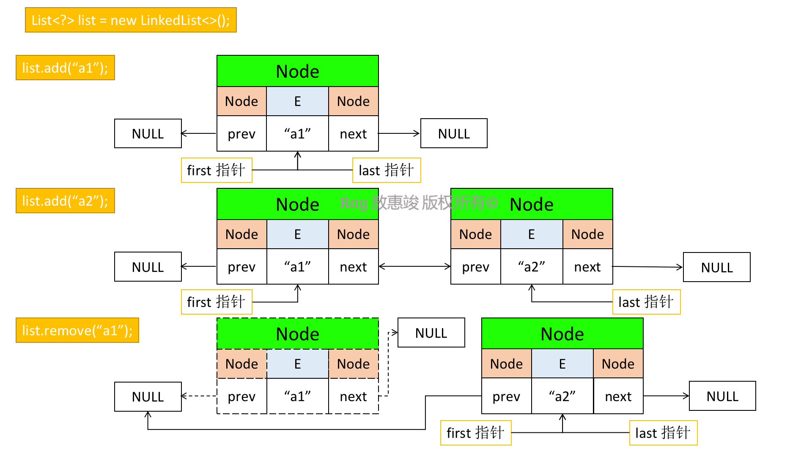

LinkedList 是 Collection 接口下对 List 的双向链表实现。
<!-- more -->
概述：
* 同时实现了 `List` 接口和 `Deque` 接口（双向链表）
* 每次插入时可选择链表头或链表尾插入
* 读取时需从链式结构逐个遍历，删除则为断链-重链过程
* 非线程安全

与 ArrayList 相比：
* 优势：不需要预估容量及动态扩容，每次新增只需要新增一个链上的节点。
* 代价：遍历时需从链上逐个遍历，不支持随机访问。

<br/>

# 构造函数

```java
public LinkedList() {  // 无参空构造函数
}

public LinkedList(Collection<? extends E> c) {
    this();
    addAll(c);  // 将集合所有元素添加进链表中
}
```

<br/>

# 链表节点的数据结构

```java
private static class Node<E> {
    E item; // 节点元素
    Node<E> next; // 后置节点指针
    Node<E> prev; // 前置节点指针

    Node(Node<E> prev, E element, Node<E> next) {
        this.item = element;
        this.next = next;
        this.prev = prev;
    }
}
```

<br/>

# 基本操作


## 添加元素

```java
/**
 * 新增元素（尾插）
 */
// eg1: e="a1"
public boolean add(E e) {
    linkLast(e);  // 链接至最后一个：链表尾插入
    return true;
}

/**
 * 添加元素 e 至链表尾部，作为其最后一个元素
 */
// eg1: e="a1"
void linkLast(E e) {
    final Node<E> l = last;

    // eg1: newNode    null<--"a1"-->null
    /* 创建一个值为 e 的 Node 节点，前置节点（prev）指向原 last 节点，后置节点（next）指向 null */
    final Node<E> newNode = new Node<>(l, e, null);

    /* 将 LinkedList 维护的 last 节点指针指向至 newNode 节点 */
    last = newNode;

    // eg1: l=null
    if (l == null) {
        /* 如果是第一个添加的元素，则 first 指针指向该节点 */
        first = newNode; // eg1: first 指向 newNode
    } else {
        /* 如果不是第一个添加进来的元素，则更新 l 的后置节点指向新添加的元素节点 newNode */
        l.next = newNode;
    }
    size++;
    modCount++;
}
```


## 删除元素

```java
/**
 * 删除元素
 */
// eg1：elementData 中保存了 {"a1","a2","a3","a4"}，删除第一个元素，即：index=0
public E remove(int index) {
    /* 校验传入的参数 index 是否超出数组最大下标，且下标不为负数，如超出则抛出 IndexOutOfBoundsException异常 */
    checkElementIndex(index);
    // eg1：node(index) 返回需要删除的节点，即："a1"
    return unlink(node(index)); /* 断开与待删除节点的链接 */
}


/**
 * Unlinks non-null node x.
 *
 * 从链表中删除 x 节点的链接，并返回被删除的节点的值。
 */
// eg1：x  null<--"a1"-->"a2"
E unlink(Node<E> x) {
    // assert x != null;
    final E element = x.item;
    final Node<E> next = x.next;
    final Node<E> prev = x.prev;

    /* x.prev 为 null，表示 x 节点为第一个元素 */
    if (prev == null) {
        first = next;  // 将 first 头指针改为指向 x 节点的后置节点
    } else {  /* 不是第一个 */
        prev.next = next;  // 将 x 的前置节点指向 x 的后置节点
        x.prev = null;  // 断开 x 的前置指针
    }

    /* x.next 为 null，表示 x 节点为最后一个元素 */
    if (next == null) {
        last = prev;  // 将 last 尾指针改为指向 x 节点的前置节点
    } else {  /* 不是最后一个 */
        next.prev = prev;  // 将 x 的后置节点指向 x 的前置节点
        x.next = null;  // 断开 x 的后置指针
    }

    x.item = null;
    size--;
    modCount++;
    return element;
}
```

总结如下：




## 获取元素

```java
/**
 * 查询指定下标 index 的节点
 */
public E get(int index) {
    checkElementIndex(index);
    return node(index).item;
}
```


### 注：

删除元素和获取元素中重要的算法：`node(int index)`

```java
/**
 * Returns the (non-null) Node at the specified element index.
 *
 * 根据传入的 index 值，返回对应节点 node
 */
// eg1：index=0
Node<E> node(int index) {
    // assert isElementIndex(index);

    /* 如 index 小于总长度 size 的一半，则从头部开始向后遍历查找 */
    if (index < (size >> 1)) {
        Node<E> x = first;
        for (int i = 0; i < index; i++) {
            x = x.next; // 从 first 节点向后（next）查找，直到 index，返回 node
        }
        return x;
    } else { /* 大于总长度一半：从尾部开始向前遍历查找 */
        Node<E> x = last;
        for (int i = size - 1; i > index; i--) {
            x = x.prev; // 从 last 节点向前（prev）查找，直到 index，返回 node
        }
        return x;
    }
}
```
由此可知 LinkedList 继承了链表获取元素方法的缺点：
* 链表**不支持快速随机访问**，查询需要从头查起；
* `get()` 可访问某个特定元素（如索引大于 n/2 从尾部开始搜索）:
    ```java
    for (int i = 0; i < list.size(); i++) {
        doSomething(list.get(i));
    }
    ```
    但底层调用的是 `node(int)` 方法，效率相对低下。

<br/>

## 迭代元素

```java
// 返回一个实现了 ListIterator 接口的迭代器对象
linkedList.listIterator(int index);

public ListIterator<E> listIterator(int index) {
    checkPositionIndex(index);
    return new ListItr(index);
}
```

* 多次调用 `listIterator.add(element)`：元素被依次添加到迭代器当前位置之前

    ```java
    /*
     注：初始化迭代器时，如果 index 是链表最后一位（index == size）：next = null；
     否则 next = (index 下标对应的节点)
     */
    public void add(E e) {
        checkForComodification();
        lastReturned = null;
        if (next == null) {
            linkLast(e);
        } else {
            linkBefore(e, next);  // 将 e 添加到 index 对应节点之前
        }
        nextIndex++;
        expectedModCount++;
    }
    ```

* n 个元素的链表有 n+1 个位置可以添加新元素


### 注：

1. 调用 next() 之后，再调用 remove() 会删除迭代器左侧元素，调用 previous() 会删除右侧元素

```java
public E next() {
    checkForComodification();
    if (!hasNext()) {
        throw new NoSuchElementException();
    }

    lastReturned = next;  // 记录迭代器左侧元素（最后一个被迭代的元素）
    next = next.next;  // next 指针指向下一个元素
    nextIndex++;
    return lastReturned.item;
}


public E previous() {
    checkForComodification();
    if (!hasPrevious()) {
        throw new NoSuchElementException();
    }

    // next 指针不会指向前一个元素
    lastReturned = next = (next == null) ? last : next.prev;
    nextIndex--;  // nextIndex 对应减1
    return lastReturned.item;
}


public void remove() {
    checkForComodification();
    if (lastReturned == null) {
        throw new IllegalStateException();
    }

    Node<E> lastNext = lastReturned.next;
    unlink(lastReturned);  // 将迭代器左侧元素从 linkedList 中移除
    if (next == lastReturned) {
        next = lastNext;
    } else {
        nextIndex--;
    }
    lastReturned = null;
    expectedModCount++;
}
```

2. `set()`：用新元素取代 next() 或 previous() 返回的上一个元素

```java
public void set(E e) {
    if (lastReturned == null) {
        throw new IllegalStateException();
    }
    checkForComodification();
    lastReturned.item = e;
}
```

1. 但：链表只负责跟踪对链表的结构性修改，如添加元素、删除元素；set() 不被视为结构性修改
2. 故：可将多个迭代器附加给一个链表，所有迭代器都调用 set() 对现有结点内容进行修改


不过，依据原理，列表迭代器可返回迭代器所在位置前后两元素的索引
* `nextIndex()` 返回下一次调用 next() 时返回的元素索引
* `previousIndex()` 返回下一次调用 previous() 时返回的元素索引（比 nextIndex 小 1）


多线程访问链表时，需处理好非线程安全的操作；否则会抛出 `ConcurrentModificationException` 异常。