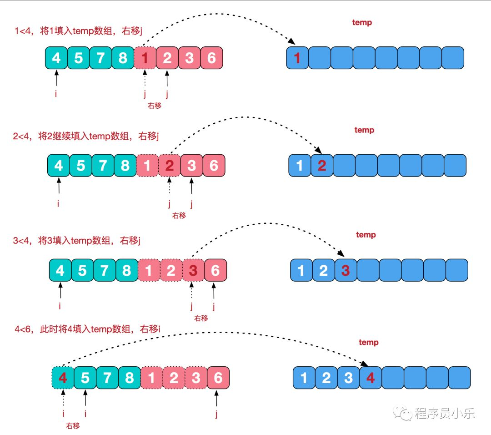
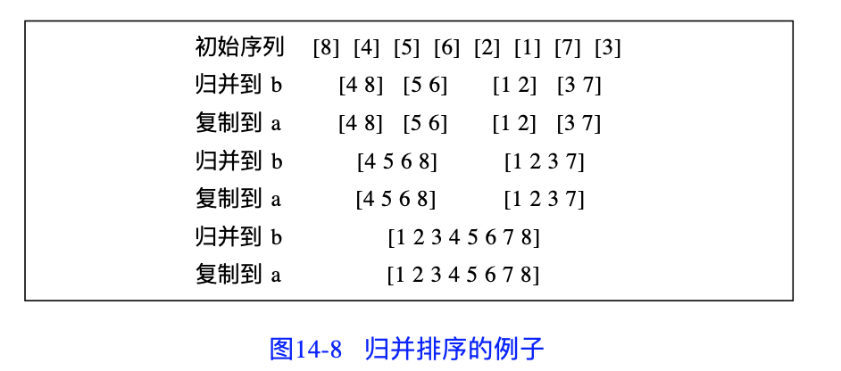

归并排序属于稳定的比较排序算法。

<!-- more -->

归并排序由冯诺依曼于 1945 年首次提出，是基于分治法的一个非常典型的应用。

在归并排序每一层的基本步骤如下：

1. **分解（Divide）**：将 n 个元素分成两个含 n/2 个元素的子序列
2. **解决（Conquer）**：用合并排序法对两个子序列递归地进行排序
3. **归并（Merge）**：合并两个已排序的子序列，得到排序结果


# 实现逻辑

实现逻辑分两种：“自上而下”的递归法和“自下而上”的迭代法。

**递归法（Top-down）**

1. 申请空间，大小为两个已经排好序的序列之和；该空间用来存放合并后的序列；
2. 设定两个指针，初始位置分别为两个已经排序的序列的起始位置；
3. 比较两个指针所指向的元素，选择相对较小（升序）/大（降序）的元素放入到上述的合并空间，并移动指针到下一位置；
4. 重复步骤 3，直至其中一个指针到达该序列尾；
5. 将另一序列剩下所有元素直接复制到合并空间尾。

**迭代法（Bottom-up）**

假设序列中有 n 个元素：

1. 将序列中每相邻的两个数字进行归并操作，形成 $ceil(n/2)$ 个序列，排序后每个序列包含一个或两个元素；
2. 如果此时序列数不为 1，则将上述的序列再次合并，形成 $ceil(n/4)$ 个序列，每个序列包含三个或四个元素；
3. 重复步骤 2，直到所有元素排序完毕，即序列数为 1。


# 伪代码

```java
void sort(T E, int n) {
    // 对 E 中的 n 个元素进行排序，k 为全局变量
    if (n >= k) {
        // 分成两个子序列
        i = n/k;
        j = n-i;
        // 令 A 包含 E 中的前 i（n/k）个元素
        // 令 B 包含 E 中余下 j 个元素
        sort(A, i);  // 传入下标，开始递归
        sort(B, j);  // 传入下标，开始递归
        merge(A, B, E, i, j);  // 将 A 和 B 合并到 E
    } else {
        // 使用插入排序算法对 E 进行排序
    }
}
```

`merge()` 的时间复杂度为 $O(n)$。

而整个算法所花费时间：

$$
Time(n) = 
\begin{cases}
d & \quad \text{$n < k$}\\
t(n/k)+t(n-n/k)+cn & \quad n \geq k
\end{cases}
$$

可知当 $n/k$ 约等于 $n-n/k$，即 $k=2$ 的时候，时间耗费最少。  
此时的分解方法为**对半分**，平均复杂度为 $Θ(nlogn)$。


当 $k=2$，归并排序又被称为**二路归并排序**。


# 二路归并代码实现

思路：

1. 首先将每两个相邻的大小为 1 的子序列归并
2. 然后对上一次归并所得到的大小为 2 的子序列进行相邻归并
3. 直至最后归并到一个序列



C++：

```c++
// 自上而下
template<class T>
MergeSort(T a[], int left, int right) {
    // 对 a[left:right] 中的元素进行排序
    if (left < right) {  // 至少两个元素
        int i = (left + right) / 2;  // 中心位置
        MergeSort(a, left, i);  // 左半部
        MergeSort(a, i+1, right);  // 右半部

        T *b = new T [n];
        Merge(a, b, left, i, right);  // 从 a 合并到 b
        Copy(b, a, left, right);  // 结果放回 a
    }
}
```

```c++
// 自下而上
template<class T>
void MergeSort(T a[], int n)
{// Sort a[0:n-1] using merge sort.

    T *b = new T [n];  // empty new array

    int s = 1;  // segment size
    while (s < n) {
        MergePass(a, b, s, n);  // merge from a to b
        s += s;
        MergePass(b, a, s, n);  // merge from b to a
        s += s;
    }
}

template<class T>
void MergePass(T x[], T y[], int s, int n)
{// Merge adjacent segments of size s from x to y.

    int i = 0;

    while (i <= n - 2 * s) {
        // merge two adjacent segments of size s
        Merge(x, y, i, i+s-1, i+2*s-1);
        i = i + 2 * s;
    }

    // fewer than 2s elements remain
    if (i + s < n) {
        Merge(x, y, i, i+s-1, n-1);
    } else {
        for (int j = i; j <= n-1; j++) {
            // copy last segment to y
            y[j] = x[j];
        }
    }
}
```

```c++
// 递归法，核心代码
template<class T>
void Merge(T c[], T d[], int l, int m, int r)
{// Merge c[l:m] and c[m:r] to d[l:r].

    int i = l,  // cursor for first segment
    j = m+1,  // cursor for second
    k = l;  // cursor for result

    // merge until i or j exits its segment
    while ((i <= m) && (j <= r)) {

        // 类似于选择排序
        if (c[i] <= c[j]) {
            d[k++] = c[i++];
        } else {
            d[k++] = c[j++];
        }
    }

    // take care of left overs
    if (i > m) {  // left boundary exceeds
        for (int q = j; q <= r; q++) {
            d[k++] = c[q];
        }
    } else {  // right boundary meets r
        for (int q = i; q <= m; q++) {
            d[k++] = c[q];
        }
    }
}
```

Java：

```java
import java.util.Arrays;

public class MergeSort {

    public static void sortTD(int[] a) {
        mergeSort(a, 0, a.length - 1);
    }

    /**
     * Top-down merge sort
     *
     * @param a
     * @param start
     * @param end
     */
    private static void mergeSort(int[] a, int start, int end) {
        if (start < end) {
            int mid = (start + end) / 2;
            mergeSort(a, start, mid);
            mergeSort(a, mid + 1, end);
            merge(a, start, mid, end);
        }
    }

    /**
     * Bottom-up merge sort
     *
     * @param a
     */
    public static void sortBU(int[] a) {
        for (int i = 1; i < a.length; i *= 2) {  // 类似于 步长
            for (int j = 0; j < a.length - i; j += 2 * i) {
                merge(a, j, j + i - 1, Math.min(j + 2 * i - 1, a.length - 1));
            }
        }
    }

    private static void merge(int[] a, int low, int middle, int high) {
        int[] tmp = Arrays.copyOf(a, a.length);
        int left = low;
        int right = middle + 1;
        int curr = low;

        while (left <= middle && right <= high) {
            a[curr++] = tmp[left] <= tmp[right] ? tmp[left++] : tmp[right++];
        }

        // take care of the left-overs
        while (left <= middle) {
            a[curr++] = tmp[left++];
        }
        while (right <= high) {
            a[curr++] = tmp[right++];
        }
    }
}
```

其中，自下而上的方法如下图所示：


