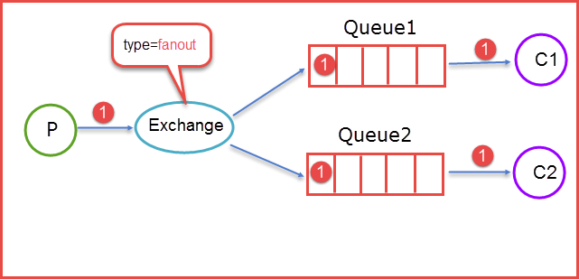

消息队列是中间件的一种，是分布式系统中非常重要的组件。

<!-- more -->

消息队列（Message Queue, **MQ**）的通用场景可简单描述为：

    当不需要立即获得结果，但是又需要对并发量进行控制的时候。

消息队列是生产者-消费者模型的典型代表；除了实现高性能、高可用、可伸缩和最终一致性架构之外，还除去了接收和发送应用程序同时执行的要求。

 

# 消息队列的消息传播模式

**推**（**push**）模式：服务器主动将信息送到客户端

优点：
* 对用户要求低，方便用户获取需要的信息
* 即时性好，服务器端及时向客户端推送更新的动态信息

缺点：
* 不能确保发送成功
    * push 采用广播方式，只有服务器端和客户端在同一频道上，推模式才有效，用户才能接收到信息
* 没有信息状态跟踪
    * push 采用开环控制技术，一个消息推送后的状态，如客户端是否接收等无从得知，针对性较差
    * 推送的消息可能并不满足客户端的个性化需求

**拉**（**pull**）模式：客户端主动发起获取信息
* 该模式下消息不是自动推送给消费者（客户端）的，而是由消费者主动从队列中请求获得
* 如没有消费者在监听队列，消息将保留在队列中，直至消费者连接到队列，取到信息为止

优点：
* 针对性强，满足客户端个性化需求
* 信息传输量相对较小：网络中传输的只是客户端的请求和服务器端对请求的响应
* 服务器端任务轻：只是被动接受查询，对客户端的查询请求作出响应

缺点：
* 实时性差，针对服务器端实时更新的信息，客户端难以获取实时信息
* 对于客户端用户的要求较高，需要对服务器端具有一定的了解

# 实现

消息队列的实现主要包括两种：**AMQP** 和 **JMS**

## AMQP

全称 Advanced Message Queuing Protocol，高级消息队列协议，是计网中应用层协议的一个开放标准。  
AMQP 是 [RabbitMQ](/2021/07/21/rabbitmq/) 的基础，也是其所实现的其他协议的鼻祖。

**主要组件**：
1. 交换器 Exchange
2. 队列 Queue：消息（message）的载体
3. 绑定 Binding：决定交换器将信息投递到队列的规则

**基本模型**：

1. 消息发布者（生产者，Publisher）利用接口，将消息发布（publish）到 Exchange 中
    * 消息一般包含消息体（payload）和标签（label）等信息
2. 消息订阅者（消费者，Consumer）利用接口创建 Queue，并绑定到 Exchange，接收所期望的消息
3. Exchange 会按照一定的路由规则（由 RoutingKey 定义）确定各种绑定（BindingKey 定义），将消息分发至对应的 Queue
4. Consumer 发现 Queue 中有消息，就会将消息消耗（consume）掉
    * 消耗时只消费消息体，丢弃标签

综上可知，发布-订阅模型 可以利用 AMQP 实现：

* Publisher 为发布者（生产者）
* Consumer 为订阅者（消费者）
* AMQP 协议扮演消息代理（Message Broker）的角色：维护生产-消费路线，保证数据按照指定的方式进行传输
    * Exchange, Bindings 和 Queues 合起来就是消息队列服务器实体，也就是 Broker

### Exchange 的类型

**1. Direct Exchange**
* 采用轮询方式发送至 `RoutingKey = BindingKey` 的 Queue，类似于**点对点**
* 其他配对不上的 RoutingKey 的消息会被丢弃

**2. Fanout Exchange**
* 发送（route）至与该 Exchange 绑定的所有 Queue，类似于**广播**
* 最快的转发

**3. Topic Exchange**
* 发送至 RoutingKey 与 BindingKey **模糊匹配**的 Queue
* 模糊匹配约定如下：
    * RoutingKey 为用**点号**（.）分隔的字符串，BindingKey 与其模式相同 
    * BindingKey 可使用 `*`（匹配一个单词）和 `#`（匹配多个或 0 个单词）用于模糊匹配

如上图的模糊匹配，比如有下面不同的 RoutingKey：

* `RoutingKey = F.C.E`：路由到 Queue1
* `RoutingKey = A.C.E`：路由到 Queue1 和 Queue2
* `RoutingKey = A.F.B`：路由到 Queue2

**4. Headers Exchange**
* 采用轮询方式
* 不依赖于 RoutingKey 和 BindingKey 的匹配规则，而是通过**消息头**订阅
    * 消息发布前为消息定义一个或多个键值对的消息头
    * 消费者在接收消息的同时，需要定义类似的键值对请求头
    * 请求头与消息头匹配才可接收消息
* 和 Direct 方式完全一致，但性能差很多，基本用不到

 

AMQP 的三层协议：

**Module Layer**：协议最高层
* 主要定义一些客户端调用的命令
* 客户端可用这些命令实现自己的业务逻辑

**Session Layer**：中间层
* 主要负责将客户端命令发送给服务器，再将服务端的 response 返回客户端
* 提供可靠性同步机制和错误处理

**Transport Layer**：最底层
* 主要传输二进制数据流
* 提供帧的处理、信道复用、错误检测和数据表示等

## JMS

全称 Java Message Service，Java 消息服务，是 Java 平台中关于“面向消息中间件（MOM）”的技术规范。
* 具体来说，JMS 是一个与具体平台无关的 API
* 绝大多数 MOM 提供商都对 JMS 提供支持
* 用于在两个应用程序之间，或分布式系统中发送消息，进行异步通信

JMS 规范目前支持两种消息模型：

**1**. **点对点**（point to point, **queue**）：不可重复消费
* 消息生产者生产消息发送到 queue 中，然后消息消费者从 queue 中取出并且消费消息
* 消息被消费以后，queue 中不再有存储，所以消息消费者不可能消费到已经被消费的消息
* Queue 支持存在多个消费者，但是对一个消息而言，只会有一个消费者可以消费

**2**. **发布/订阅**（publish/subscribe, **topic**）：可重复消费
* 消息生产者将信息**发布**到 topic 中，同时有多个消息消费者消费（**订阅**）该消息
* 和点对点方式不同，发布到 topic 的消息会被**所有**订阅者消费

另：**订阅组发布/订阅模式**：
* 发布/订阅模式下，当发布者消息量很大时，显然**单个订阅者的处理能力是不足的**
* 更加现实的场景是：多个订阅者节点组成一个订阅组，负载均衡地消费 topic 消息，即分组订阅
* 可看成是一个 topic 下有多个 Queue，每个 Queue 是点对点的方式，Queue之间是发布/订阅方式。
* 这样订阅者很容易实现消费能力线性扩展

JMS 编程接口：

## 比较

|            | JMS            | AMQP         |
| :--------  | :----------    | :---------   |
| 定义        | Java API       | 协议          |
| 跨语言      | 否              | 是           |
| 跨平台      | 否              | 是           |
| 模型        | 2 + 1 种消息模型 | 5 种消息模型   |
| 支持消息类型 | 多种            | byte[]       |

JMS 提供的最主流的开源技术是 Apache ActiveMQ。

 

# 选型依据

生产环境使用较多的消息队列：ActiveMQ, [RabbitMQ](/2021/07/21/rabbitmq/), Kafka, RocketMQ, MetalMQ, ZeroMQ 等。

| 特性 | ActiveMQ | RabbitMQ | RocketMQ | Kafka |
| :--:| :-------:| :-------: | :-----: | :----: |
| 单机吞吐量 | 万级，比 RocketMQ, Kafka 低一个数量级 | 同 ActiveMQ | 10 万级，支撑高吞吐 | 10 万级，高吞吐，一般配合大数据类的系统进行实时数据运算、日志采集等场景 |
| topic 数量对吞吐量的影响 | | | topic 可达到几百/几千级别，吞吐量会有较小幅度下降 RocketMQ 优势：同等机器下可支撑大量 topic | topic 从几十到几百时，吞吐量大幅下降，同等机器下 Kafka 尽量保证 topic 数量不要过多，如要支撑大规模 topic，需要增加更多机器资源 |
| 时效性 | 毫秒级 | 微秒级，延迟最低（特点之一） | 毫秒级 | 毫秒级 |
| 可用性 | 高，基于主从架构实现高可用 | 同 ActiveMQ | 非常高，分布式架构 | 非常高，分布式架构，一个数据多个副本，少数机器宕机，不会丢失数据，不会导致不可用 |
| 消息可靠性 | 有较低的概率丢失数据 | 基本不丢 | 经过参数优化配置可做到 0 丢失  | 同 RocketMQ |
| 功能支持 | MQ 领域的功能极其完备 | 基于 erlang 开发，并发能力极强，性能极好，延迟很低 | MQ 功能较为完善，还是分布式的，扩展性好 | 功能较为简单，主要支持简单的 MQ 功能，在大数据领域实时计算以及日志采集被大规模采用 |
| 优点 | | 轻量，迅捷，容易部署和使用，拥有灵活的路由配置 | 性能好，稳定可靠，有活跃的中文社区，特点响应快 | 拥有强大的性能及吞吐量，兼容性很好 |
| 缺点 | | 性能和吞吐量较差，不易进行二次开发 | 兼容性较差；但随意影响力的扩大，该问题会有改善 | 延迟较高 |

 

# 优缺点

消息队列的**优点**在于能够实现**异步**、**解耦**、流量**削峰填谷**，能解决相关特殊业务场景的问题。

而**缺点**在于其系统**可用性**较为敏感，万一 MQ 崩溃了，系统依靠它的相当一部分的功能会无法响应。  
而且，消息队列提高了系统**复杂性**，需要考虑一些消息队列的常见问题和解决方案。  
此外，消息队列还会带来一些**一致性**问题：
* 多个消费者中，如果其中一个消费失败，会导致数据不一致的情况
* 带来消息重复消费、消息积压、消息顺序和消息事务的问题

## 消息丢失问题

根据队列结构来看，无非就是三种情况：
1. 生产者弄丢数据
    * 主流 MQ 都有确认机制或事务机制，可保证生产者将消息送达 MQ。如：[RabbitMQ](/2021/07/21/rabbitmq/#消息确认机制) 就有事务模式和 confirm 模式；
2. 消息队列弄丢数据
    * 开启 MQ 的持久化磁盘配置；
3. 消费者弄丢数据
    * 一般是因为采用了自动确认消息模式，此时 MQ 收到消费者的确认消息后会删除消息；
    * 如果发送确认信息之后消费者发生异常，导致消息操作没执行完，想再次消费消息就没了。
    * 改用**手动确认**就能解决

## 重复消费问题

通常由网络原因造成。

正常情况：
1. 消息被成功消费后，消费者发送成功标志给 MQ
2. MQ 收到标志后，表示消息被成功消费，不会再将消息发送给其他消费者

出问题的情况：
1. 因网络出现问题，成功标志在传输过程中丢失
2. MQ 没接收到该标志，认为该消息没有被成功消费
3. 因此 MQ 会再次发送该消息给其他消费者，造成重复消费

**解决方法**：根据去重的原理，保证消费端幂等性

方法 1：
* 每个消息生成一个 id
* 在第三方介质（如 Redis set）中准备类似于键值对的组合 `<消息 id, 消息>`
* 开始消费前，在介质中查询有无该记录；如果存在该记录，说明已经发送过该消息，发送端就不再发送了

方法 2 是方法 1 的升级，也是更常用的方法:
* 生产消息时生成**描述消息的 id**
* 组建消息体时针对业务，生成唯一的**业务标识 buzId**
* 传输的时候判定两者是否均是唯一

方法 3：针对数据库的插入操作
* 以消息 id 等标识作为**唯一主键**或其它的**唯一性约束**，如果发生了重复消费，插入数据的时候会主键冲突

### 如何处理消费过程中的重复消息

MQTT 协议给出了三种传递消息时能够提供的服务质量标准，从低到高依次是：

* **At most once**: 消息在传递时，最多会被送达一次。也就是说没什么消息可靠性保证，允许丢消息。一般都是一些对消息可靠性要求不太高的监控场景使用，比如每分钟上报一次机房温度数据，可以接受数据少量丢失。
* **At least once**: 消息在传递时，至少会被送达一次。也就是说，不允许丢消息，但是允许有少量重复消息出现。
* **Exactly once**：消息在传递时，只会被送达一次，不允许丢失也不允许重复，这个是最高的等级。

## 消息积压问题

有的时候，消息在 Broker 上大量堆积，无法被消费者及时消费，产生堆积的情况。

常见于以下几种情况：

1. 消费者功能存在 bug，消息无法被消费；
2. 消费者实例宕机或因网络问题暂时无法与 Broker 建立连接；
3. 生产者短时间内推送大量消息到 Broker，消费能力不足；
4. 生产者未感知 Broker 消费堆积，而持续向 Broker 推送消息

避免和解决问题的思路：

1. **灰度发布**。选取一定比例的消费实例做灰度，若出现问题，及时回滚；若消费者消费正常，平稳运行一段时间后，再升级其它实例。
2. **多活**。
3. **增强消费能力**。增加消费者线程数或者增加消费者实例个数。
4. 一旦积压情况发生，要做好**熔断与隔离**，将新消息发送到其它队列。

### 检测消息丢失的方法

可以利用消息队列的**有序性**来验证是否有消息丢失：  
在 Producer 端给每个发出的消息附加一个**连续递增的序号**，然后在 Consumer 端来检查这个序号的连续性。

## 消息顺序问题

常见的场景：电商平台的下单操作，下单后先减库存，然后生成订单
* 首先生产者需要保证入队的顺序，比如**一个 queue 只对应一个消费者**；
* 另外，发送消息时对消息通过 hash 取模，确保同一操作的消息发送到同一个队列中
    * 一般的 MQ 中同一个队列都能保证 FIFO，由此确保出队时是顺序的

不过，如果多个消费者同时消费一个队列，一样可能出现顺序错乱的情况；  
这时需要使用重试机制，根据期望的顺序，如果所期望的消息还未被消费，就重试等待。

# 应用场景

消息队列广泛应用于应用程序之间的通信方法，其应用场景包括：解耦、异步消息、流量削锋等问题。

消息延迟推送应用：

**1**. 淘宝七天自动确认收货
* 签收后，物流系统在七天后延时发送一个消息给支付系统，通知支付系统七天后将款项打给商家。

**2**. 12306 购票支付确认界面
* 选好票点击确定跳转的页面往往会有倒计时
* 如 30 分钟内订单不确认将自动取消订单
* 如 30 分钟内完成订单，则根据逻辑代码确定忽略接收到的延时信息。

 

---

# References

[八股文之MQ](https://juejin.cn/post/7100506153137897480)