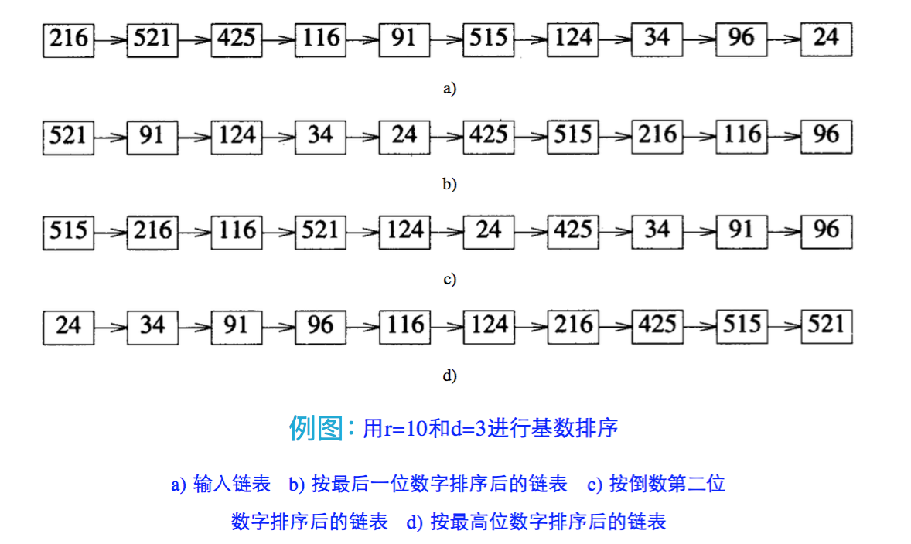

聊了那么多基于比较的排序算法，咱们今天来聊聊非比较排序。

<!-- more -->

计数排序、桶排序和基数排序都是常见的**非比较**排序算法。

首先来说说计数排序。


# 计数排序

Counting sort，意为使用一个**额外的数组**，记录（counting）待排序集合的元素的数量（count），将待排序元素的值作为额外数组的索引（index），某一个值相同的元素的数量作为数组的值。通过遍历额外数组完成排序。


## 步骤

1. 找出待排序数组中最大和最小的元素（非必需）；
2. 准备一个额外数组 C，大小为待排序集合的最大值 / 最大元素和最小元素的差值；
3. 统计数组中每个值为 i 的元素的出现的次数，存入数组 C 的第 i 项；
4. 遍历 C，找出元素值大于 0 的元素，将其对应的索引 i 作为元素值**反向**填充回待排序集合中，每放一个元素就从 C[i] 减去 1，直到减完为止；
5. 返回结果数组。


## 代码

```java
public class CountingSort {

    public static void main(String[] argv) {
        int[] A = CountingSort.countingSort(new int[]{16, 4, 10, 14, 7, 9, 3, 2, 8, 1});
        Utils.print(A);
    }

    public static int[] countingSort(int[] A) {
        int[] B = new int[A.length];
        // 假设 A 中的数据 a'，有：0 <= a' < k，且 k = 100
        int k = 100;
        countingSort(A, B, k);
        return B;
    }

    // 返回新的数组
    private static void countingSort(int[] A, int[] B, int k) {
        int[] C = new int[k];

        // 计数
        for (int j = O; j < A.length; j++) {
            int a = A[j];
            C[a] += 1;
            // 可简写为 C[A[j]] += 1;
        }
        Utils.print(C);

        // 求计数和
        for (int i = l; i < k; i++) {
            C[i] = C[i] + C[i - 1];  // 统计出数组 C 中小于或等于 i 的元素出现的次数
        }
        Utils.print(C);

        // 整理
        for (int j = A.length - 1; j >= ; j--) {
            int a = A[j];  // 从原数组中倒序取元素
            B[C[a]-1] = a;
            // Order[C[a]-1] = j+1;
            C[a] -= 1;  // 去掉数值相同的元素中已排好序的元素(确保稳定性)
        }
    }
}
```


## 复杂度分析

当输入元素是 n 个从 0 到 k 之间的整数时：
* 时间复杂度为 $Θ(n+k)$；
* 空间复杂度为 $Θ(n+k)$

计数排序属于非比较排序，速度快于任何比较排序算法，但是是通过牺牲空间换来的。

局限性：
* 排序数组必须要是**整数**；
* 从**额外数组**这个特性可以看出，计数排序需要待排序数组在一定范围内，而且要比较集中；对于数据范围很大的数组（如：1, 2, 3, ..., 5000），需要大量时间和内存。

优化：
1. 根据待排序集合的最大值和最小值的差值，而不是从 0 开始到最大值确定计数数组，能够减少额外的空间浪费；
2. 对计数数组变形，**新元素的值是前面元素累加之和的值**。


# 桶排序

桶排序（Bucket Sort, Bin Sort）将待排序节点中具有相同值，或者处于同一值域的元素放入同一个桶中，把桶链接起来就可以创建一个有序的链表。

* 即：根据元素值特性将集合拆分成多个区域（桶）
* 拆分之后的多个桶，从值域上看是有序的
* 每个桶再使用别的算法或者递归调用桶排序再进行排序

桶排序属于非比较排序，不受 $Ο(nlogn)$ 下限的影响。

以**值域**代替具体的值，是桶排序相对于计数排序的优化点。


## 实现

* 每次排序所用到的**所有桶**，可使用线性表来描述；
* 每个桶可以用**链表**描述；在进行节点分配之前，所有的桶都是空的。

实现的关键点在于：

1. 元素值域的划分，即元素到桶的**映射规则**。如果过于宽松，则有可能所有元素全部映射到同一个桶中，向比较排序演进；如果过于严苛，则有可能每个桶只有一个元素，向计数排序演进；
2. 排序算法的选择。桶排序算法的复杂度和稳定性，都会根据所选的排序算法不同而不同。

过程：

1. 根据待排序集合中最大元素和最小元素的差值范围和映射规则，确定申请的**桶的个数**；
2. **遍历**待排序集合，将每一个元素移动到对应的桶中；
3. 对每一个桶的元素进行**排序**，并移动到已排序集合中。

步骤 3 中的“已排序集合”即为步骤 1、2 中的待排序集合：与计数排序不同，桶排序的步骤 2 完成后，所有元素都在桶中，且桶排序时**不再依赖原始集合**。因此排序完毕之后将桶的元素移动回原始集合即可。


## v.s. 快速排序

[快速排序](/2023/02/26/quick-sort)根据支点元素将集合分成两部分分别递归排序，可以将这两个部分视作两个“桶”。

不同之处在于：

* 快排是在集合自身进行排序，属于**原地排序**方式，且对每个“桶”的排序也是快排（递归）；
* 而桶排序则是提供了额外的操作空间，在**额外空间**对桶进行排序，避免构成桶的过程中的元素比较和交换操作，同时可以**自主选择恰当的排序算法**对桶中的元素进行排序。


## 代码

伪代码：

```js
function bucketsort(array, n) is
    buckets <- new array of n empty lists // 创建桶队列
    for i = 0 to (length(array) - 1) do
        insert array[i] into buckets[msbits(array[i], k)]  // 按照映射规则将元素放到相对应桶中
    for i = 0 to n - 1 do
        nextsort(buckets[i])  // 对桶内元素进行排列
    return the concatenation of buckets[0], ..., buckets[n-1]  // 依序输出有序队列
```


## 复杂度分析

设需要排序的集合有 $n$ 个数据，给提供的桶的数量是 $m$。那么均匀分配的情况下，平均每个桶里就会有 $n/m$ 个元素。

则将元素分配到桶的时间复杂度是确定的，为 $O(n)$。

我们设 $k=n/m$，则 $m$ 个桶均进行排序的**总时间复杂度**为（假设桶内使用归并排序）：

$$
O(n+m*k*logk)\\
=O(n+m*\frac{n}{m}*log\frac{n}{m})\\
=O(n+n*(logn-logm))
$$

总的**空间复杂度**为 $O(n+m)$。

当 $n=m$ 时，时间复杂度达到最优 $O(n)$，而空间复杂度为最差的 $O(2n)$，不过同样为 $O(n)$ 级别；  
当 $m=1$ 时，时间复杂度为 $O(n+nlogn)$，空间复杂度为 $O(n)$。

因此可以说，桶排序的效率是通过牺牲空间换来的。

当待排序集合的元素值相差过大的时候，对于桶映射规则的选择是一大挑战，可能会导致元素集中分布到某一个桶，或者绝大多数桶是空桶的情况。  
因此同计数排序一样，桶排序适合**元素值较为集中**的集合。


# 桶排序的改进：基数排序

Radix sort，顾名思义，是把待排序的数按照某个基数（radix）分解成一串数字，然后对数字进行排序。

* 一般以**位数**作为基数，即排序的时候是**逐位排序**；
* 如有数位较短的：前面补 0 再开始依次排序。
    * 可采用 LSD（Least Significant Digital，低位优先）或 MSD（Most Significant Digital，高位优先）
    * 一般采用 LSD

基数排序是对桶排序的扩充：不仅适用于整数，还可以用于字符串和特定格式的浮点数。



<small>注：
* r 为排序基数，在这里也就是数字位数的间隔：10；
* d 为待排序数字的最高位数，也是排序次数。</small>


## 复杂度分析

由上面的例图可以知道：
* 时间复杂度为 $Ο(n×d)$，$n$ 为排序元素个数，$d$ 为数字位数;
* 空间复杂度为 $Ο(n+d)$。

问题：

**为何要从低位开始向高位排序？**
* 如果要从高位排序（MSD），那么次高位的排序会影响已经排好的大小关系。在数学中，**数位越高，数位值对数的大小的影响就越大**。从低位开始排序，就是对这种影响最小的排序。数位按照影响力从低到高的顺序排序，数位影响力相同则比较数位值。

**为何同一数位的排序子排序要使用稳定排序？**
* 稳定排序能够保证上一次的排序成果被保留，十位数的排序过程能保留个位数的排序结果，百位数的排序过程能保留十位数的排序结果，以此类推。


## 代码

```java
public class RadixSort {

    public static void sort(int[] a) {
        final int length = a.length;
        int[][] buckets = new int[10][length];
        int[] bucket = new int[10];  // store how many elements are there in the bucket

        for (int i = 0, factor = 1; i < maxBit(a); i++, factor *= 10) {  // start from LSD
            for (int j = 0; j < length; j++) {
                int digit = (a[j] / factor) % 10;
                buckets[digit][bucket[digit]] = a[j];
                bucket[digit]++;
            }
            for (int m = 0, k = 0; m < 10; m++) {
                if (0 == bucket[m]) {
                    continue;
                }
                for (int n = 0; n < bucket[m]; n++) {
                    a[k] = buckets[m][n];
                    k++;
                }
                bucket[m] = 0;
            }
        }
    }

    private static int maxBit(int[] a) {  // get the max bit from the array
        int maxLength = 0;
        for (int i : a) {
            int size = Integer.toString(i).length();
            maxLength = maxLength >= size ? maxLength : size;
        }
        return maxLength;
    }
}
```


# 小结

因为三种非比较算法的平均时间复杂度均为 $Θ(n)$ 级别的线性函数，因此它们又有一个称谓叫**线性排序**。
