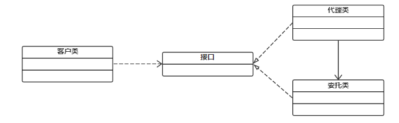

顾名思义，代理模式就是给一个对象提供一个代理，由代理对象去控制对原对象的引用。

<!-- more -->

代理模式属于结构型模式，在《设计模式：可复用面向对象软件的基础》中的介绍：

    “为其他对象提供一个代理，以控制对这个对象的访问”

在代理模式中，一个类代表另一个类的功能，代理对象是目标对象的代表。

<br/>

# 意图

使得客户不能直接与真正的目标对象通信

<br/>

# 结构





以上，可见代理模式包括以下角色：

`Subject`
* 抽象角色
* 声明真实对象和代理对象的**共同接口**

`Proxy`
* 代理
* 因为代理对象与真实对象实现了**共同的接口**（Subject），因此能在任何时刻代理真实对象
* 代理内部包含有对真实对象的引用：可操作真实对象，也可附加其它操作，相对于真实对象进行封装

`RealSubject`
* 真实角色
* 代表真实对象，为目标对象

<br/>

# 效果
* 通过代理对象控制真实对象的访问，可以在这个真实对象调用方法之前，或者调用方法之后去处理 / 添加新的功能
* 代理对象也可以在原有代码乃至原业务流程都不修改的情况下，直接在业务流程中切入新代码，增加新功能

以上均跟 Spring 的面向切面编程（AOP）有很大的关系。

<br/>

# 代码示例

抽象角色：
```java
public abstract class Subject {
    public abstract void request();
}
```

真实角色：
```java
public class RealSubject extends Subject {

    @Override
    public void request() { 
        ...
    }
}
```

静态代理：
```java
public class ProxySubject extends Subject {

    private RealSubject realSubject = null;  // 真实对象的引用

    /**
     * 除了代理真实角色做该做的事情，代理角色也可以提供附加操作
     * 如：preRequest() 和 postRequest()
     * 
     * 类似于 AOP
     */
    @Override
    public void request() {
        preRequest();  // 真实角色操作前的附加操作

        if (realSubject == null) {
            realSubject = new RealSubject();
        }
        realSubject.request();

        postRequest();  // 真实角色操作后的附加操作 
    }

    /**
     * 真实角色操作前的附加操作 
     */
    private void postRequest() {
        ...
    }

    /**
     * 真实角色操作后的附加操作
     */
    private void preRequest() { 
        ...
    }
}
```

调用：
```java
Subject subject = new ProxySubject();
subject.request();  // 代理者代替真实者做事情
```

<br/>

# 优缺点
优点
* 可以做到在不修改目标对象的功能前提下，对目标功能扩展

缺点
* 每一个代理类都必须实现一遍目标类的接口；如果接口增加方法，则代理类也必须跟着修改。
* 其次，代理类每一个接口对象对应一个目标对象，如果目标对象非常多，则静态代理类就非常臃肿，难以胜任。

<br/>

# 已知应用

Spring 的 AOP、日志打印、异常处理、事务控制、权限控制等

<br/>

# Spring 中的变种应用

## [JDK 动态代理](/2022/03/18/spring-aop#Spring%20AOP)

步骤：
1. 编写一个真实角色类的接口，即静态代理的 `Subject` 接口
2. 实现真实角色类，即静态代理的 `RealSubject` 类

（以上同静态代理的实现）

3. 代理的实现不同：创建动态代理类（**核心**）
```java
import java.lang.reflect.InvocationHandler;
import java.lang.reflect.Method;

// 核心：实现 InvocationHandler
public class DynamicProxy implements InvocationHandler {

    private Object object;  // 真实对象的引用

    public DynamicProxy(Object object) {
        this.object = object;
    }

    @Override
    public Object invoke(Object proxy, Method method, Object[] args) throws Throwable {
        ...  // 前增强等代码

        Object result = method.invoke(object, args);

        ...  // 后增强等代码

        return result;
    }
}
```

4. 生成动态代理对象
```java
Subject realSubject = new RealSubject();
DynamicProxy proxy = new DynamicProxy(realSubject);  // 生成代理对象
ClassLoader classLoader = realSubject.getClass().getClassLoader();

/**
 * 关键代码 Proxy.newProxyInstance()
 * 
 * 根据指定的参数动态创建代理对象，参数分别为：
 *   loader：指定代理对象的类加载器
 *   interfaces：获取代理类需要实现的所有接口
 *   invocationHandler：代理类（核心），代理类每一个方法执行时，将会调用一次 invoke()
 */
Subject subject = (Subject) Proxy.newProxyInstance(classLoader, new Class[] {Subject.class}, proxy);
// interfaces 参数避免了接口过多带来的静态代理类臃肿的问题

subject.request();
```

<br/>

## [CGLib 动态代理](/2022/03/18/spring-aop#Spring%20AOP)

创建代理对象的几个步骤：
1. 生成代理类的二进制字节码文件
2. 加载二进制字节码（可修改字节码），生成 Class 对象（例如使用 `Class.forName()`）
3. 通过反射机制获得实例构造，并创建代理类对象

假定当前我们只有一个没有实现任何接口的实现类：

```java
public class RealHello {

    public String sayHello(String str) {
        return "RealHello: " + str;
    }
}
```

CGLib 动态代理实现：

```java
// 实现一个 MethodInterceptor，方法调用会被转发到该类实现的 intercept() 中：
class MyMethodInterceptor implements MethodInterceptor {  // 等效于 JDK 中的 InvocationHandler

    ...

    // intercept() 等效于 JDK 中的 invoke()
    @Override
    public Object intercept(Object proxy, Method method, Object[] args, MethodProxy methodProxy) throws Throwable {
        logger.info("You said: " + Arrays.toString(args));
        ...  // 前增强

        /**
         * 注：此处执行的是 setSuperclass() 所确定的父类
         * 即：该代理类的父类，即真实角色类
         * 
         * 真实角色与代理类为：父子关系
         */
        Object object = methodProxy.invokeSuper(proxy, args);   // 将调用转发到原始对象

        ...  // 后增强

        return object;
    }
}
```

调用：

```java
import org.springframework.cglib.proxy.Enhancer;

...

// 代理类，以此创建目标类（真实角色）的子类，无需接口
Enhancer enhancer = new Enhancer();
enhancer.setSuperclass(RealHello.class);  // 确定父类
enhancer.setCallback(new MyMethodInterceptor());

// create() 创建代理
RealHello hello = (RealHello) enhancer.create();
System.out.println(hello.sayHello("I love you!"));
```

**两者优点**：稳定，应用时间久，使用过程中不会出问题。
