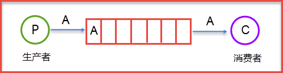

RabbitMQ 是由 Erlang 语言开发的 [AMQP](/2021/07/20/mq/#AMQP) 的开源实现。

<!-- more -->

RabbitMQ 最初起源于金融系统，用于在分布式系统中存储转发消息，在易用性、扩展性、高可用性等方面表现不俗。具体特点包括：

**1**. 可靠性（Reliability）：RabbitMQ 使用一些机制实现持久化、传输确认及发布确认等

**2**. 灵活的路由（Flexible Routing）
* 在 AMQP 协议中，消息进入路由之前，是通过交换器（Exchange）来路由信息的
* RabbitMQ 针对典型的路由功能提供一些内置的交换器实现
* 针对更复杂的功能，可以将多个交换器绑定在一起，也可以通过插件机制实现自己的交换器。

**3**. 扩展性（Clustering）
* 多个 RabbitMQ 节点可组成一个集群，形成一个逻辑 Broker
* 也可根据实际业务情况动态扩展集群中节点，且集群部署相对简单

**4**. 高可用性（Highly Available Queues）
* Erlang 为电话交换机开发而生，自带高并发和高可用属性，因此 RabbitMQ 在高可用性方面有保障
* 队列可在集群中的机器上设置镜像，使得部分节点出现问题时，队列仍然可用

**5**. 多协议（Multi-protocol）：支持原生 AMQP，还支持 STOMP、MQTT 等多种消息中间件协议

**6**. 多语言客户端：对于所有主流编程语言（Java, Python, Ruby, Go, PHP, C#, JavaScript 等）均有与代理接口通讯的客户端库

**7**. 管理界面（Management UI）：易用，可监控和管理消息以及 Broker 集群节点

**8**. 跟踪机制（Tracing）：如果消息异常，使用者可以找出发生了什么

**9**. 插件机制（Plugin System）：可从多方面进行扩展，如网页控制台消息管理插件、消息延迟插件等

**10**. 社区活跃度高，解决问题成本低。

<br/>

# 基本概念

RabbitMQ 相关的重要角色如下：
* 生产者
* 消费者
* 代理：RabbitMQ 本身，自身不产生消息

细化到内部与 AMQP 的相关概念相差不大：


**Message**：包括消息体和 RoutingKey、properties（消息优先级、延迟等特性）等消息头信息。

**Publisher**：消息生产者。在 RabbitMQ 中是一个向 Exchange 发布消息的客户端应用程序 Client。

**Exchange**：交换器。用于接收生产者发送的消息，并且分发消息给队列 Queue。


RabbitMQ 默认采用 Direct Exchange。

**RoutingKey**：路由键。将 Publisher 的数据按照某种规则分配到特定 Exchange 上。

**Binding**：绑定。基于 Binding Key 将 Exchange 和 Queue 之间连接起来，组成一个路由规则。Exchange 可以被理解为是由多个 Binding 组成的路由表。

**BindingKey**：绑定键。指定了 Exchange 和相应 Queue 之间的 binding key 之后，Exchange 根据对应的关系，将消息推送到相应的 Queue 中。
* 多个 Queue 可以和同一个 Exchange 绑定，此时多个 Binding 允许使用相同的 BindingKey。

**Queue**：队列。存储消息，先进先出。



队列结构通常分为两部分：

`rabbit_amqqueue_process`：负责协议（AMQP）相关的消息处理，包括：
* 接收生产者发布的消息
* 向消费者交付消息
* 处理消息的确认（生产端的 confirm，消费端的 ack 等）

`backing_queue`：消息存储的具体形式和引擎
* 向 `rabbit_amqqueue_process` 提供相关接口以供调用

**Connection**：网络连接，比如一个 **TCP** 连接
* 另：**ConnectionFactory**：连接管理器。应用程序与 RabbitMQ 之间建立连接的管理器，在程序代码中使用。

**Channel**：信道。消息推送使用的通道，是多路复用连接中的一条独立的双向数据流通道。
* AMQP 无论是发布消息、订阅队列还是接收消息，都是通过信道完成
* 一个 Connection 中有一个或多个 Channel。

**Consumer**：消息消费者。在 RabbitMQ 中表示一个从 Queue 中获取消息客户端应用程序 Client。

**Virtual Host**（vhost）：虚拟主机，AMQP 概念的基础，必须在连接时指定。本质上就是一个 mini 版的 RabbitMQ 服务器。
* 每一个 vhost 拥有自己的 Exchange、Queue、Binding 和权限机制
* 同一个 vhost 里可以有多个 Exchange 和 Queue，但不能有同名的 Exchange 或 Queue
* 每个 RabbitMQ 服务器均可创建 vhost，默认为 "`/`"。

**Broker**：表示消息队列服务器实体。

注：消费者和生产者都可以创建队列。如果提交了一个已经存在的队列的创建请求，系统不会返回错误，不会有任何的影响。


<br/>

# 运行机制

当消费者端需要进行大量的计算时，RabbitMQ 服务器需要一定的分发机制来平衡每个消费者的 workload。在 RabbitMQ 中定义了两种任务的分发机制：

**1. Round-robin Dispatching**：循环分发，轮询

循环分发的场景是：多个消费者订阅同一个 Queue，Queue 中的消息**平分**给其他消费者。

此时 RabbitMQ 会将消息**逐个发送**到消费者序列中的**下一个**消费者：
* 不考虑每个任务的时长等因素，而且是提前一次性分配，并非一个个分配
* 平均每个消费者会获得相同数量的消息

在默认情况下，RabbitMQ 并不会考虑消费者处理消息的能力，即便是其中有的消费者闲置过久，有的却高负荷工作。  
这就会造成资源分配不均的问题：有的消费者持续工作，其他的持续空闲。

**2. Fair Dispatch**：公平分发，根据消费者的消费能力进行分发处理
* 使用 `channel.basicQos(prefetchCount)` 限制每次发送给消费者消息的个数
* 可以让每个消费者在同一时间点最多去处理规定数量级个数的 message
* 在接收该消费者的 ack 前，队列不会将新的 message 分发给该消费者。

注：使用公平分发必须关闭自动应答，改为手动应答。


可将队列中的消息数量视为无限制，因为限制只是取决于机器的内存。  
但消息过多会导致处理效率的下降。


## 生产者消息运转
1. 生产者先连接到 Broker，建立连接（Connection），再开启一个或多个信道（Channel）
2. 生产者声明一个 Exchange 并设置好相关属性
3. 生产者声明一个 Queue 并设置好相关属性
4. 生产者通过 RoutingKey 建立与 Exchange 的路由；通过 BindingKey 将 Exchange 和 Queue 绑定
5. 生产者发送消息到 Broker，消息包含 RoutingKey、Exchange 等信息
6. 相应的 Exchange 根据接收到的 RoutingKey 查找匹配的 Queue
    1. 如匹配：将消息存入对应的队列
    2. 如不匹配：根据生产者先前的配置，丢弃消息（`mandatory=false`）或退回至生产者（`mandatory=true`）
7. 关闭信道
8. 管理连接


## 消费者接收消息流程
1. 生产者先连接到 Broker，确保连接已建立，随后开启一个或多个信道
2. 消费者向 Broker 请求，并消费响应了的 Queue 中的信息（可能会设置相应的回调函数）
3. 等待 Broker 回应并投递相应 Queue 中的消息给消费者，消费者接收消息
4. 消费者确认收到的信息，返回 ack
5. RabbitMQ 从 Queue 中删除已经返回 ack 的消息
6. 关闭信道
7. 关闭连接

<br/>

# 消息稳定性

要想提高消息的稳定性，避免消息丢失，通常有以下方法：
* 消息持久化
* ACK 确认机制
* 设置集群镜像模式
* 消息补偿机制


## 消息持久化

RabbitMQ 消息有以下状态：
1. `alpha`：消息内容（包括消息体、属性和 headers）和消息索引都存储在内存
2. `beta`：消息内容保存在磁盘，消息索引保存在内存
3. `gamma`：消息内容保存在磁盘，消息索引分别保存在磁盘和内存
4. `delta`：消息内容和索引都在磁盘中

消息持久化的条件：
* 投递消息时 `durable` 设置为 `true`
    ```java
    channel.queueDeclare(x, durable=true, false, false, null);
    ```
* 设置投递模式 `deliveryMode` 为 `2`：持久化
    ```java
    channel.basicPublish(x, x, MessageProperties.PERSISTENT_TEXT_PLAIN, x);  // 存储纯文本到磁盘
    ```
* 消息已经到达持久化 Exchange 上
* 消息已经到达持久化的队列中

Exchange 和 Queue 在创建时，指定 `durable=true` 可完成持久化
* 具有该标识的 Exchange 和 Queue 在重启之后会重新建立
    * 如 Exchange 和 Queue 都是持久化的，则它们之间的 binding 也是持久化的
    * 如两者中只有一个持久化，则不允许建立 binding


## 消息确认机制

**1. Confirm 模式**（也叫生产者重试模式，发布/确认模式）
* 根据实际业务，通过 `channel.basicAck()` 手动确认消息被消费
* 生产者将 channel 设置为 confirm 确认模式；确认后，所有在该 channel 发布的消息都会被指定一个唯一的 ID 号
* 如一个队列没有消费者：消息会被缓存，不会被丢弃
* 消费者处理完数据后，需要向 MQ Server 发送确认信息（acknowledge, ack），MQ 随后会将这个 ack 发送给生产者（包含 ID）
    * 如消息被某个消费者正确接收：消息会被从队列中移除
    * 如有数据没有被 ack，MQ Server 不会删除消息，而是将其发送给下一个消费者

**2. AMQP 事务机制**：主要是对信道 channel 的设置

```java
// 与事务机制相关的方法：
channel.txSelect();  // 用于将当前的信道设置成事务模式
channel.txCommit();  // 用于提交事务
channel.txRoolback();  // 用于事务回滚
```

如事务提交执行前 RabbitMQ 异常崩溃或其他原因抛出异常：通过 `txRollback()` 回滚，当 `autoAck=true` 时，事务无效
* 此时消息时自动消费确认，RabbitMQ 直接将消息从队列中擦除，即使后面事务回滚也不能起到任何作用


## 集群化

要将 RabbitMQ 集群化，集群中应有以下的节点类型：
* 内存节点：ram，将变更写入内存
* 磁盘节点：disc，磁盘写入操作

RabbitMQ 集群要求最少有一个磁盘节点。

<br/>

## 为啥不直接基于 TCP

RabbitMQ 是基于信道 Channel 传输消息的。Channel 通过建立真实 TCP 连接建立虚拟连接。

因为对于 OS 来说，建立和关闭 TCP 连接是有代价的，频繁建立和关闭 TCP 连接对于系统的性能有很大影响，且 TCP 的连接数也有限制，从而限制了系统处理高并发的能力；  
但是在一个 TCP 连接中建立一个或多个 channel 的成本就低很多了。

<br/>

# 死信队列

先说说什么叫死信。

当一个消息遇到以下之一的情况：
* 被拒（Basic.Reject / Basic.Nack），而且达到了 retry 上限，或者 requeue = false，不能重新进入队列；
* 消息 TTL（time to live）过期；
* 队列已满（x-max-length），无法再添加。

这样的消息被称为**死信**（**D**ead **L**etter）。

当一个消息在队列中变为死信之后，它将被重新投递到另一个 Exchange 中，这个 Exchange 叫做死信交换器（**D**ead-**L**etter e**X**change, **DLX**）。

DLX 根据 RoutingKey 所绑定的 Queue 就是**死信队列**。

设置：
```yaml
Exchange: dlx.exchange
Queue: dlx.queue
RoutingKey: #
# 表示只要有消息到达了 Exchange，那么都会路由到这个 queue 上
```

死信队列接收消息后并**不消费该消息**，所以可以监听死信队列中的消息做相应的处理。

<br/>

# 应用

举一个简单的代码示例：

```java
// 网络信道，消息读写的通道，与 RabbitMQ 打交道的主要接口
import com.rabbitmq.client.Channel;
/*
 * 几乎所有操作都在 channel 对象中进行，包括：
 *    定义 Exchange 和 Queue
 *    绑定 Exchange 和 Queue
 *    发布消息
 * 客户端基于一个 Connection 可建立多个 channel 实例，
 * 即一个 TCP 连接上建立多个 RabbitMQ 会话，大大节省资源
 * 每个 channel 表示一个会话任务
 */

// RabbitMQ 的 socket（TCP）连接，封装了 socket 协议相关逻辑
import com.rabbitmq.client.Connection;
// Connection 的制造工厂
import com.rabbitmq.client.ConnectionFactory;
import com.rabbitmq.client.DeliverCallback;

import java.nio.charset.StandardCharsets;


class MqDemo {

    private static final String QUEUE_NAME = "hello";
    private static final String HOST = "localhost";

    private ConnectionFactory factory = new ConnectionFactory();

    void Send() {

        factory.setHost(HOST);
        try (Connection connection = factory.newConnection();
            Channel channel = connection.createChannel()) {

            int prefetchCount = 1;
            channel.basicQos(prefetchCount);  // 每次只接收 1 个数据
            channel.queueDeclare(QUEUE_NAME, false, false, false, null);  // 第二个参数：消息持久化为 false
            String message = "Hello World!";
            channel.basicPublish("", QUEUE_NAME, null, message.getBytes(StandardCharsets.UTF_8));
            System.out.println(" [x] Sent '" + message + "'");
        }
    }

    void Recv() {

        factory.setHost(HOST);
        Connection connection = factory.newConnection();
        Channel channel = connection.createChannel();

        channel.queueDeclare(QUEUE_NAME, false, false, false, null);
        System.out.println(" [*] Waiting for messages. To exit press CTRL+C");

        DeliverCallback deliverCallback = (consumerTag, delivery) -> {  // 消息的异步处理
            String message = new String(delivery.getBody(), StandardCharsets.UTF_8);
            System.out.println(" [x] Received '" + message + "'");
        };
        channel.basicConsume(QUEUE_NAME, true, deliverCallback, consumerTag -> { });
    }
}
```

设置消费者不消费消息：

```java
channel.basicNack();
channel.basicReject(messageId, true);  // 消息被拒绝，会被分配到其他订阅者
```

<br/>

## 应用场景

### **延迟队列**

存储对应的延迟消息
* 当消息被发送以后，并不想让消费者立即拿到消息
* 等待特定的时间后，消费者才能拿到这个消息进行消费
* 应用于超时未支付订单自动取消

实现：
* 3.6.x -：采用死信队列 + queue 设置 TTL 实现延迟队列
* 3.6.x +：官方提供延迟队列插件，下载放置 RabbitMQ 根目录的 `plugin/` 下


### **优先级队列**

优先级高的队列会先被消费
* 可通过 `x-max-priority` 参数实现
* 当消费速度大于生产速度，且 Broker 没有堆积时：优先级显得没有意义


### **异步处理**

场景：用户注册后需要发送注册邮件和注册短信

传统设计：
* 串行化：将注册信息写入数据库后，先发送注册邮件再发送注册短信
    * 以上三个任务全部完成后才返回给客户端


* 并行化：将注册信息写入数据库后，发送邮件的同时发送短信
    * 以上三个任务全部完成后才返回给客户端


新设计：消息队列
* 前提：邮件和短信对用户正常使用网站没有任何影响
    * 客户没必要等着邮件短信发送完成才显示注册成功
* 将不是必须的业务逻辑（发送邮件、短信）异步处理
* 响应时间大大缩短


### **应用解耦**

场景：在电商应用中，用户下单后，订单系统通知库存系统

传统设计：订单系统直接调用库存系统接口


缺点：
* 库存系统出现故障时，订单就会失败
* 订单系统和库存系统高度耦合

新设计：消息队列
* 用户下单后，订单系统完成持久化处理，将消息写入消息队列，返回“下单成功”通知
* 库存系统订阅下单的消息，当有订单进入对应队列后，获取下单消息，进行相应操作
* 即使库存系统奔溃，消息队列也能保证消息可靠传递，不会导致消息丢失
* 即使用 MQ 进行 RPC 通信的分布式系统


### **流量削峰**

场景：秒杀活动，一般会因为瞬时流量过大导致应用宕机

设计：一般在应用前端引入消息队列
1. 服务器收到用户请求后，首先写入消息队列
2. 加入消息队列长度超过最大值：直接抛弃用户请求，或跳转到错误页面
3. 秒杀业务根据消息队列中的请求，再作后续的处理


作用：
* 控制活动人数，超过一定阀值的订单直接丢弃
* 可避免短时间的高流量压垮应用，应用按照自身最大处理能力获取订单
