红黑树同样是自平衡二叉查找树，是较于 [AVL 树](/2023/05/26/avl)对性能、功能、空间开销的折中结果。

<!-- more -->

# 定义

红黑树（Red-Black tree），属于自平衡二叉查找树，树中每一个节点的颜色是**黑色**或者**红色**。

如例图所示，红黑树需满足：

1. 节点是**红色**或者**黑色**
2. 根节点是**黑色**
3. 所有的叶子都是**黑色**（外部节点，即 NIL 节点）
4. 每个**红色**节点必须有两个**黑色**的子节点
    * 即：从每个叶子到根的所有路径上**不能有两个连续的红色节点**
5. 从任一节点到其每个叶子的所有简单路径都包含数量相同的**黑色**节点
    * 即：所有根至外部节点路径上有相同数目的**黑色**节点

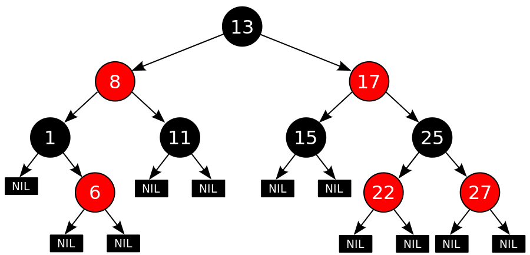

另一种要求：源于节点及其子女间指针的颜色

1. 从父节点到**黑色**孩子的指针是**黑色**
2. 从父节点到**红色**孩子的指针是**红色**
3. 内部节点指向外部节点的指针是**黑色**
4. 从根到外部节点途中没有两个连续的**红色**指针
5. 所有根至外部节点路径上有相同数目的**黑色**指针

以上的约束条件确保了从根到叶子的最长可能路径不大于最短的可能路径的**两倍**（证明见[定理 1](#定理-1)），得到的结果是：这个树大致上是平衡的。

如果知道了指针的颜色，就能知道节点的颜色；反之亦然。

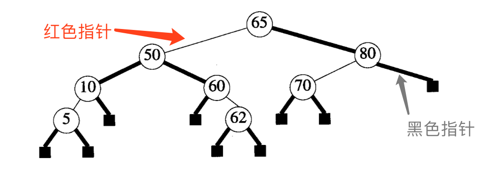

跟二叉搜索树一样，红黑树可以在 $O(logn)$ 时间内查找、插入和删除。

# 描述

1. 在实际应用中使用零指针或空指针描述外部节点；
2. 对于每个节点，需要储存的只是该节点的颜色 / 指向它的两个孩子的指针颜色

# 相关定义

**阶**（Rank）：指从某节点到其子树中任意外部节点的任一条路径上**黑色指针**的数量。

可知：

* 外部节点的阶为 0
* 上图根节点的阶为 2
* 上图左孩子的阶为 2，右孩子的阶为 1

## 定理 1

设从根节点到外部节点的路径长度（length）为该路径中指针的数量。如 P 和 Q 分别是红黑树中两条从根至外部节点的路径，则

$length(P) ≦ 2length(Q)$

即：从根到叶子的最长可能路径**不大于最短可能路径的两倍**。

**证明**：

对任意一棵红黑树，设根节点的阶为 r，已知：

* 每条从根节点至外部节点的路径中，最后一个指针必为**黑色**
* 不存在包含连续两个**红色**指针的路径。

因此：每个**红色**指针后必定跟着一个黑色指针。

也就是说，每一条从根节点至外部节点路径都有 r ~ 2r 个指针，可得 $length(P) ≦ 2length(Q)$。

## 定理 2

设 h 是一棵红黑树的高度（不包括外部节点），n 为树中内部节点的数量，r 是根节点的阶，则

1. $h ≦ 2r$
2. $n ≧ 2^r - 1$
3. $h ≦ 2log_2(n+1)$

**证明**：

第 1 点：已知每一条从根节点至外部节点路径都有不多于 2r 个指针；  
因此 $h ≦ 2r$。

第 2 点（使用数学归纳法证明）：设根节点的阶是 r

1. 树高度为 0 时，即只有一个叶节点，r = 0，内部节点数量为 0，满足 $0 ≧ 2^0 - 1$；
2. 设树高度 $h ≦ t$ 时，有 $n ≧ 2^r - 1$ 成立，则：
    * 记树高为 t + 1 的红黑树根节点的左子树内部节点数量为 $nl$，右子树内部节点数量为 $nr$
    * 可知俩子树的阶为 $r'$（俩子树阶一定相同），树高 ≦ t
        * 即：$nl ≧ 2^{r'} - 1$，$nr ≧ 2^{r'} - 1$
        * 两式相加：$nl + nr ≧ 2^{r'+1} - 2$
        * 左右各加 1：$nl + nr + 1 = n ≧ 2^{r'+1} - 1 ≧ 2^r - 1$
        * 整理后可得 $n ≧ 2^r - 1$

第 3 点：第 2 点 $n ≧ 2^r - 1$ -> $r ≦ log_2(n+1)$，再结合第 1 点可完成证明。

由此可知红黑树最大高度为为 $2log_2(n+1)$，因此搜索、插入、删除操作复杂度为 $O(logn)$，符合二叉查找树的定义。

# 搜索

可以参照[二叉搜索树](/2022/07/19/binary-search-tree/#搜索节点)的搜索算法，时间为 $O(logn)$。

# 插入

可使用[二叉搜索树](/2022/07/19/binary-search-tree/#添加节点)的插入算法，并给新元素上色，再矫正树的颜色。

* 如果插入前是空树：新节点是根节点，**黑色**；
* 如果插入前树非空：
    * 上**黑色**的话：从根到外部节点的路径中，将有一个特殊的黑色节点作为新节点的孩子，肯定违反要求 5，而且调整困难
    * 上**红色**的话：可能出现连续的红色节点，可能违反要求 4

因此在权衡之下，应先给新插入节点上**红色**，当出现不平衡的情况，再作调整。

通过检查**新节点 `u`**、其**父节点 `pu`** 及**祖父节点 `gu`** 可确定不平衡类型。

设 `u` 和 `pu` 为连续的**红色**节点，`gu` 为**黑色**节点（`gu` 与 `pu` 不可能同色），以此定义以下不平衡情况：

1. **LLb**：`pu` 是 `gu` 左孩子，`u` 是 `pu` 左孩子，且 `gu` 另一个孩子是**黑**的（叔叔节点，可以为外部节点）
2. **LLr**：`pu` 是 `gu` 左孩子，`u` 是 `pu` 左孩子，且 `gu` 另一个孩子是**红**的（同上）
3. **LRb**：`pu` 是 `gu` 左孩子，`u` 是 `pu` 右孩子，且 `gu` 另一个孩子是**黑**的（同上）
4. **LRr**：`pu` 是 `gu` 左孩子，`u` 是 `pu` 右孩子，且 `gu` 另一个孩子是**红**的（同上）
5. **RRb**：`pu` 是 `gu` 右孩子，`u` 是 `pu` 右孩子，且 `gu` 另一个孩子是**黑**的（同上）
6. **RRr**：`pu` 是 `gu` 右孩子，`u` 是 `pu` 右孩子，且 `gu` 另一个孩子是**红**的（同上）
7. **RLb**：`pu` 是 `gu` 右孩子，`u` 是 `pu` 左孩子，且 `gu` 另一个孩子是**黑**的（同上）
8. **RLr**：`pu` 是 `gu` 右孩子，`u` 是 `pu` 左孩子，且 `gu` 另一个孩子是**红**的（同上）

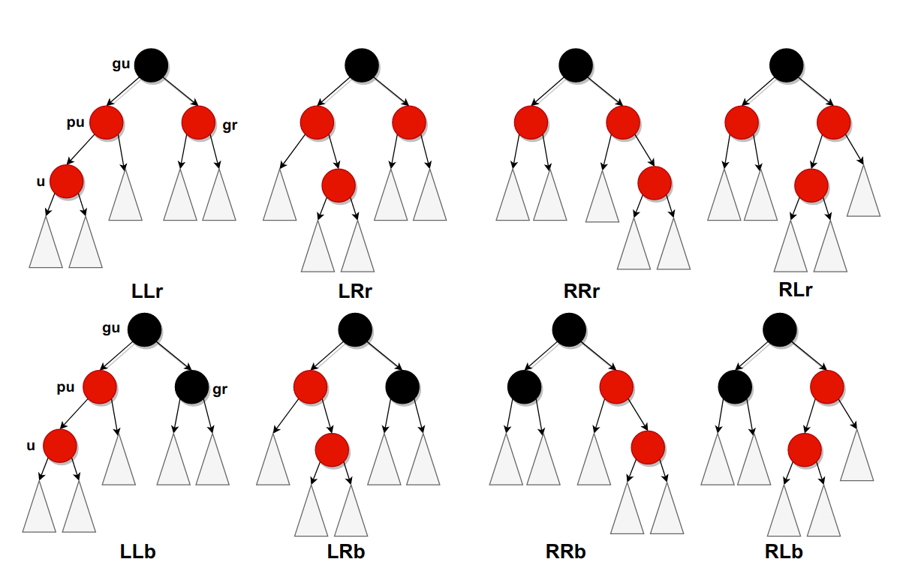

## LLr 与 LRr

1. 将 `pu` 与 `gu` 的右孩子（`gr`）由**红色**改为**黑色**
    * 如果 `gu` 不是根，则还应将 `gu` 改成**红色**；
    * 如果 `gu` 是根，则将 `gu` 改成**黑色**，该红黑树的阶**增加了 1**
3. 如果 `gu` 改为**红色**之后引起新的不平衡：
    * `gu` 变成新的 `u` 节点，依据它的 `pu`，`gu` 节点继续调整

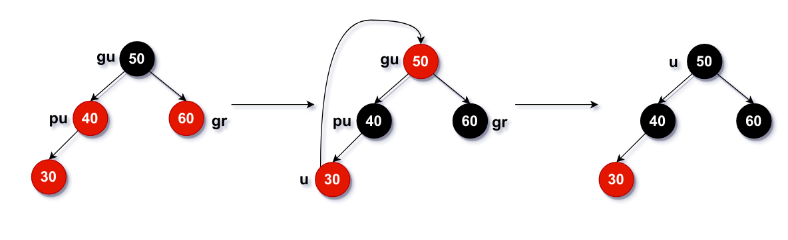

图例为 LLr，LRr 是类似的操作，目的是要将**红色**往根部移动：

* **红色**节点往上移，并不会打破红黑树的特性
* 不断将**红色**节点往上移动，直至根时直接将根设为**黑色**。

## LLb 与 LRb

LLb：

1. 将 `pu` 由红色改为**黑色**，将 `gu` 由黑色改为**红色**
2. 做 [LL 旋转](/2023/05/26/avl/#调整-LL-型不平衡：LL-旋转)
3. 此时 `gu` 子树已经平衡；又因为 `gu` 往上的层原本就平衡，所以整棵树平衡。

LRb：

1. 将 `u` 由红色改为**黑色**，将 `gu` 由黑色改为**红色**
2. 做 [LR 旋转](/2023/05/26/avl/#调整-LR-型不平衡：LR-旋转)
    * 或：如果先做单旋转，可以先转换成 LLb（如下图）
3. 此时 `gu` 子树已经平衡；又因为 `gu` 往上的层原本就平衡，所以整棵树平衡。

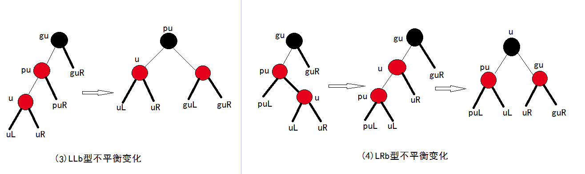

## RRr 与 RLr

与 LLr 与 LRr 类似。

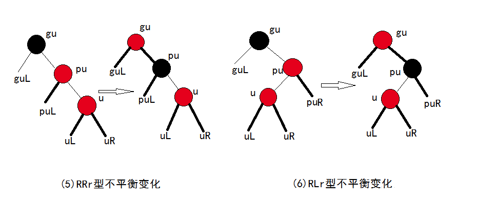

## RRB 与 RLb

与 LLb 与 LRb 类似。

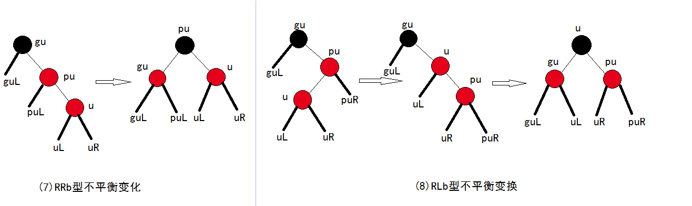

## 处理方法小结

* XYr （X 和 Y 可以是 L 或 R）类型不平衡可通过改变颜色处理；
* XYb 类型则需要旋转

 

# 删除

使用[二叉搜索树](/2022/07/19/binary-search-tree/#删除节点)的删除算法，再进行矫正；  
如需要还要做一次单旋转。

设 $y$ 是替代被删除节点的节点
* 当且仅当被删除节点是**黑色**，且 $y$ 不是所得树的根的时候，执行二叉搜索树的删除算法会违反要求 5；
* 不会出现违反其他特征的情况

此时以 $y$ 为根的子树缺少一个黑色节点（指针）；也就是说，从根到 $y$ 子树外部节点路径上的黑色节点数，比从根到其他外部节点路径上的黑色节点数少一个，这就导致树**不平衡**。

定义 $y$ 的**同胞（兄弟）节点 $v$**，如果 $y$ 缺少一个黑色节点，则 $v$ 肯定不是一个外部节点：
* 因为如果 $v$ 是外部节点的话，它那一分支的黑色节点数为 1（$v$ 自己），$y$ 缺少一个黑色节点，则 $y$ 为红色叶子，不会不平衡。

通过识别 **$y$ 的父节点 $py$** 和 $v$ 来区分不平衡类型：

1. $y$ 为 $py$ 右孩子：R 型不平衡
2. $y$ 为 $py$ 左孩子：L 型不平衡
3. 如 $v$ 是黑色：不平衡为 **Rb** 或 **Lb**
4. 如 $v$ 是红色：不平衡为 **Rr** 或 **Lr**

## Rb 型不平衡

Lb 型不平衡与 Rb 型互为镜像，因此在这里我们介绍 Rb 型不平衡的解决方法。

Rb 型根据 $v$ 的红色子节点数量分为三种不平衡类型。

### Rb0

即：

* $y$ 是右孩子；
* 它的兄弟节点（左孩子）$v$ 是**黑色**；
* $y$ 的侄子节点（$v$ 的子节点）没有红色节点（0 个红色节点），都是**黑色**。

回顾：此时删除的节点是 $y$ 路径上的**黑**节点，通过改变颜色可以改变不平衡。

当 $py$ 为**黑**节点：将兄弟 $v$ 改为**红**节点，$py$ 不变
* 此时无论 $py$ 通过 $v$ 到达外部节点的路径，还是通过 $y$ 的路径，都缺少了一个黑色节点
* 如 $py$ 为整棵树的根：无需调整，已经平衡
* 否则：$py$ 为新的 $y$，如有必要，再次调整以达到平衡。

当 $py$ 为**红**节点：$py$ 改为**黑色**，$v$ 改为**红**节点
* 此时从 $v$ 到外部节点路径上的黑色节点数减一，子树达到平衡
* $py$ 为新的 $y$，如有必要，再次调整以达到平衡。

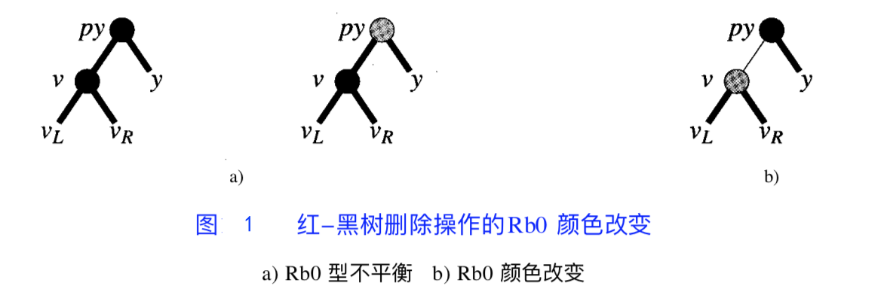

### Rb1 或 Rb2

当侄子节点存在**红色**节点的时候，子树需要旋转。

注：下列例图中，白色的节点表明旋转前后颜色不变。

**Rb1**

即：

* $y$ 是右孩子；
* 它的兄弟节点（左孩子）$v$ 是**黑色**；
* $y$ 的侄子节点（$v$ 的子节点）有一个**红色**节点。

如果 $v$ 的左孩子为**红色**节点，右孩子为**黑色**节点（如下图 `a)` `b)`）：

1. 做 [LL 旋转](/2023/05/26/avl/#调整-LL-型不平衡：LL-旋转)
2. $v$ 变成 $py$ 原来的颜色，$v$ 左孩子变成**黑色**
3. $py$ 变成**黑色**

如果 $v$ 的左孩子为**黑色**节点，右孩子（$w$）为**红色**节点（如下图 `c)` `d)`）：
1. 做 [LR 旋转](/2023/05/26/avl/#调整-LR-型不平衡：LR-旋转)
2. $w$ 变成 $py$ 原来的颜色
3. $py$ 变成**黑色**

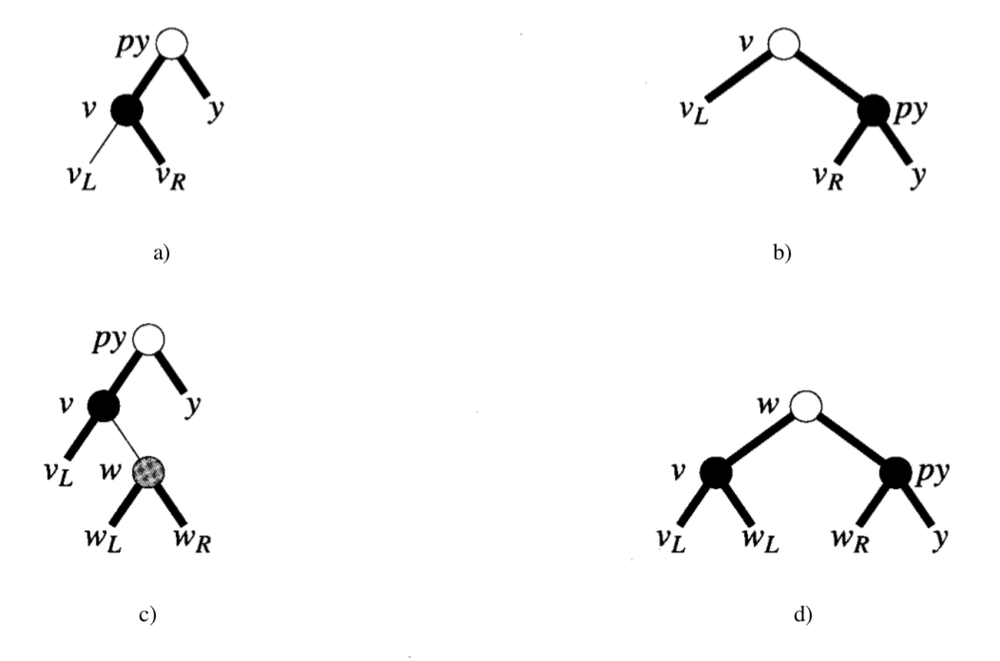

**Rb2**

即：

* $y$ 是右孩子；
* 它的兄弟节点（左孩子）$v$ 是**黑色**；
* $y$ 的侄子节点（$v$ 的子节点）都是**红色**节点。

平衡方案：

1. 做 [LR 旋转](/2023/05/26/avl/#调整-LR-型不平衡：LR-旋转)
2. $w$ 变成 $py$ 原来的颜色
3. $py$ 变成**黑色**

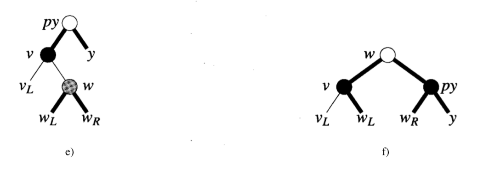

旋转后，$y$ 从根节点至外部节点路径上的黑色节点数加一，子树恢复平衡。

## Rr 型不平衡

与 Rb 型类似，Rr 型根据 $v$ 右孩子的**红色**子节点数量分为三种不平衡类型。

此时 $v_L$ 和 $v_R$ 中至少有一个黑色节点不是外部节点；  
因为要判断 $v$ 的右孩子情况，可知 $v$ 的孩子节点**都是内部节点**。

### Rr0

即：

* $y$ 是右孩子；
* 它的兄弟节点（左孩子）$v$ 是**红色**；
* $v$ 的右孩子没有红色节点（0 个红色节点），都是**黑色**。

平衡方案：

1. 做 [LL 旋转](/2023/05/26/avl/#调整-LL-型不平衡：LL-旋转)
2. $v$ 变成**红色**
3. $v_R$ 变成**红色**，并成为 $py$ 的左孩子

此时 $v_R$ 的阶减 1，$py$ 子树达到平衡；$v$ 到 $y$ 路径的阶加 1，原 $py$ 子树达到平衡。

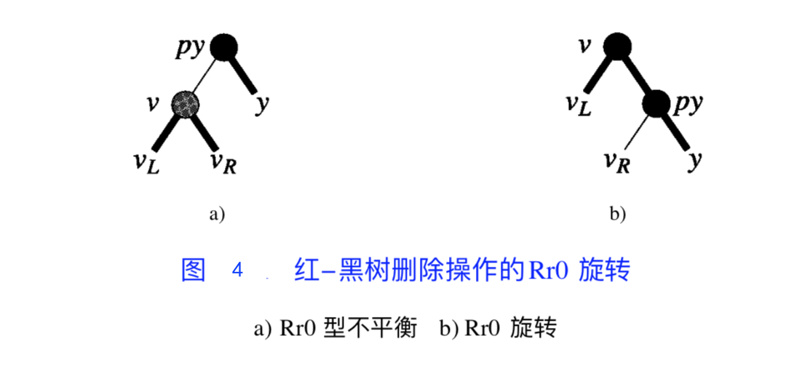

### Rr1

即：

* $y$ 是右孩子；
* 它的兄弟节点（左孩子）$v$ 是**红色**；
* $v$ 的右孩子有一个**红色**节点。

如果 $v$ 的右孩子（$w$）的左孩子为**红色**节点，右孩子为**黑色**节点（如下图 `a)` `b)`）：
1. 做 [LR 旋转](/2023/05/26/avl/#调整-LR-型不平衡：LR-旋转)
2. $w$ 的左孩子变成**黑色**，成为 $v$ 的右孩子

如果 $w$ 的左孩子为**黑色**节点，右孩子为**红色**节点（如下图 `c)` `d)`）：
1. 通过旋转，$w$ 的右孩子成为根节点，并变成**黑色**
2. $py$ 成为新根节点的右孩子

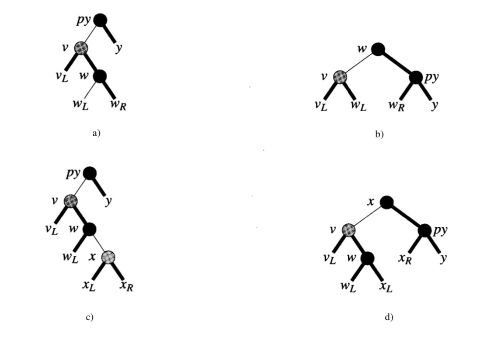

### Rr2

即：

* $y$ 是右孩子；
* 它的兄弟节点（左孩子）$v$ 是**红色**；
* $v$ 的右孩子都是**红色**节点。

平衡方案类似于 Rr1 左黑右红的情况：

1. 通过旋转，$w$ 的右孩子成为根节点，并变成**黑色**
2. $py$ 成为新根节点的右孩子

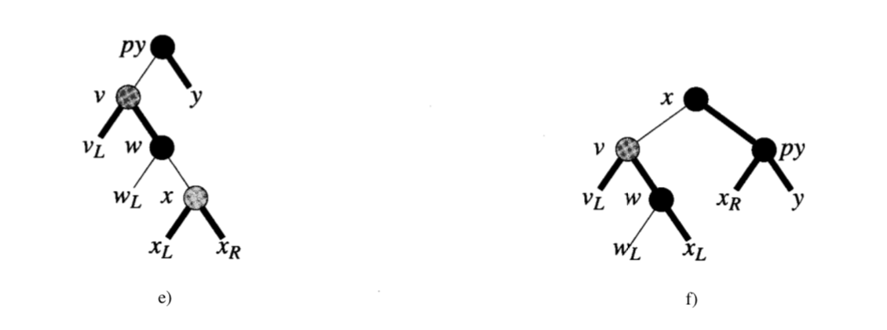

## 小结

1. 如需调整的节点的兄弟节点为红：想办法通过旋转和改色，换成一个黑色的兄弟；
2. 如需调整的节点的兄弟节点为黑：分析俩侄子节点的颜色
    1. 如侄子均为黑：将兄弟染红，递归分析父节点
    2. 如左红右黑：左改黑，兄弟右旋改红（即原兄弟->新的右侄子是红的）
    3. 如右红：父节点旋转，改掉某些节点的颜色，右变黑

# 红黑树 v.s. AVL 树

树的结构：
* AVL 树严格要求节点平衡因子不大于 1
* 红黑树不追求“完全平衡”，但提出为节点增加颜色

就插入节点导致的失衡：
* AVL 树和红黑树都是最多两次旋转实现复衡，旋转量级是 $O(n)$

删除：
* AVL 树需要维护从被删除节点到根节点路径所有节点的平衡，量级为 $O(logn)$
* 红黑树最多需要实现 3 次实现复衡，量级为 $O(n)$

红黑树是性能、功能、空间开销的折中结果。

| 平衡二叉树类型 | 平衡度 | 调整频率 |    适用场景   |
| ----------- | ------ | ------ | ------------ |
| AVL 树       | 高     | 高     | 查询多，增删少 |
| 红黑树       | 低     | 低      | 增删频繁      |

---

# References

[我所理解的红黑树(RBT)](https://www.joxrays.com/rb-tree-cpp/#%E7%BA%A2%E9%BB%91%E6%A0%91)