在非关系型数据库（NoSQL）中，Redis 绝对是 C 位的存在。今天就开一个帖来专门唠唠 Redis。

<!-- more -->

# 简介

Redis，全称 **RE**mote **DI**ctionary **S**erver。官方解释是“BSD 开源许可的，使用 ANSI C 语言开发的，部署于内存的数据结构（in-memory data structure store）”。  
Redis 不仅可以用来做内存数据库，还可以做缓存和消息代理。

Redis 支持多种数据结构：
* 字符串 string
* 列表 list
* hash
* 集合 set
* 带范围查询的有序集合 sorted set(zset)
* 位图 bitmap
* hyperloglog

前五种为基本数据类型，后两种为高级对象。

Redis 具有内置的复制，Lua 脚本，LRU 淘汰策略，事务和不同级别的磁盘持久性，并通过 Redis Sentinel 和 Redis Cluster 的自动分区提供高可用性。

Redis 所有的单个操作都是原子性的（Lua 脚本保证），多个操作支持事务。

<br/>

# 基本对象

先来说说 Redis 里面基本对象的源码：

## **redisObject**
* Redis 的对象类型、内部编码、内存回收、共享对象等功能均需其支持

```c
// redis.h
typedef struct redisObject {
    // 对象的类型，占 4 bit
    unsigned type:4;

    // 对象的内部编码，占 4 bit
    unsigned encoding:4;

    // 指向底层实现数据结构（即 val 对应的 SDS）的指针
    void *ptr;

    unsigned notused:2;  /* Not used */

    // 记录对象最后一次被命令程序访问的时间
    // REDIS_LRU_BITS 在不同版本中的 Redis 的长度也有所不同
    unsigned lru:REDIS_LRU_BITS;  /* lru time (relative to server.lruclock) */

    // 记录该对象被引用的次数
    int refcount; 
} robj;
```

一个 redisObject 占用 **16** 字节的空间。


<big>**1. type**</big>

redisObject 一共有 5 种数据类型：
```c
#define REDIS_STRING 0
#define REDIS_LIST 1
#define REDIS_SET 2
#define REDIS_ZSET 3
#define REDIS_HASH 4
```

4 位 type 字段最多能排出 15 种组合，记录 5 种数据类型足够。


<big>**2. encoding**</big>

redisObject 一共有 10 种编码类型：
```c
#define REDIS_ENCODING_RAW 0      /* Raw representation */
#define REDIS_ENCODING_INT 1      /* Encoded as integer */
#define REDIS_ENCODING_HT 2       /* Encoded as hash table */
#define REDIS_ENCODING_ZIPMAP 3   /* Encoded as zipmap, deprecated after v 3.2.5 */
#define REDIS_ENCODING_LINKEDLIST 4  /* Encoded as regular linked list */
#define REDIS_ENCODING_ZIPLIST 5  /* Encoded as ziplist */
#define REDIS_ENCODING_INTSET 6   /* Encoded as intset */
#define REDIS_ENCODING_SKIPLIST 7  /* Encoded as skiplist */
#define REDIS_ENCODING_EMBSTR 8    /* Embedded sds string encoding */
#define REDIS_ENCODING_QUICKLIST 9  /* Encoded as linked list of ziplists */
```

| encoding 常量   | 编码所对应的底层数据结构        |
| -------------   | --------------------        |
| REDIS_ENCODING_RAW        | SDS               | 
| REDIS_ENCODING_INT        | long 类型（8 字节长，64 位）的整数  | 
| REDIS_ENCODING_HT         | 字典                     |
| REDIS_ENCODING_ZIPMAP     | zipmap，3.2.5 后弃用      |
| REDIS_ENCODING_LINKEDLIST | 双向链表，非循环           |
| REDIS_ENCODING_ZIPLIST    | 压缩列表，访问速度较快      |
| REDIS_ENCODING_INTSET     | 整数集合           |
| REDIS_ENCODING_SKIPLIST   | 跳表 + 字典        |
| REDIS_ENCODING_EMBSTR     | embstr 编码的 SDS  |
| REDIS_ENCODING_QUICKLIST  | 以压缩列表为元素的双向链表   |

4 位 encoding 字段最多能排出 15 种组合，记录 10 种编码类型足够。

<br/>

**注**：这里比较一下 `REDIS_ENCODING_EMBSTR` 和 `REDIS_ENCODING_RAW`（下面简称 embstr 和 raw）：
* embstr 与 raw 都使用 redisObject 和 SDS 保存数据
* 从 Redis 3.0 开始引进 embstr，意为 "embedded string"，使用时只分配一次内存空间（因为 redisObject 和 SDS 空间上连续）
    * 专门用于存储**短**（不大于 44 字节的）字符串（Redis 3.2 之前是 39）
    * 好处是：创建时少分配一次空间，删除时少释放一次空间；对象所有数据连在一起，创建快速，寻找方便
    * 坏处是：字符串长度增加需要重新分配内存时，整个 redisObject 和 SDS 都需要重新分配空间
    * 因此 embstr 实现是只读，并且没有提供修改值的函数

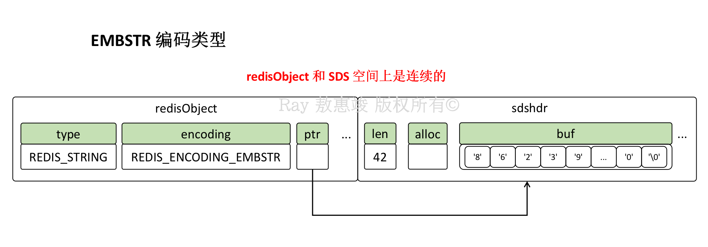

* raw 需要分别为 redisObject 和 SDS 分配内存空间（调用两次内存分配函数）
    * 存储大于 44 字节的字符串（Redis 3.2 之前是 39）

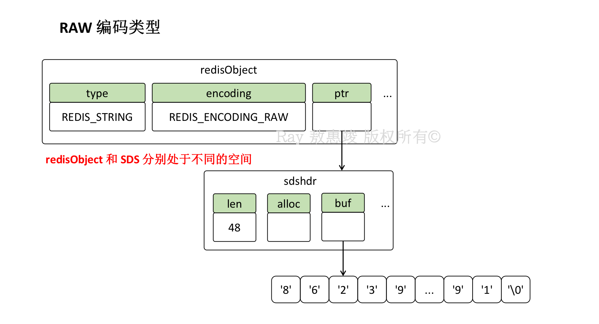


<big>**3. lru**</big>

通过对比 lru 的值与当前时间，可计算某个对象的空转时间（object idletime）并打印出来。

lru 与 Redis 内存回收关系颇为密切。  
如果 Redis 打开了 `maxmemory` 选项，且内存回收算法选择 `volatile-lru` 或 `allkeys-lru` 作为淘汰策略的话，当内存占用超过 maxmemory 阈值时，Redis 会优先选择 object idletime 最长的对象释放。


<big>**4. refcount**</big>：主要用于对象引用计数和内存回收（计数法）
* 创建新对象：refcount = 1
* 有新程序使用该对象：refcount + 1
* 对象不再被一个新程序使用：refcount - 1
* refcount = 0：对象占用内存会被释放

refcount > 1，意味着该对象被多次使用，其被称为共享对象。  
这就意味着当某些对象重复出现时，新程序不会创建新对象，而是仍然使用原来的对象；这样可以节省内存。

Redis 五种类型都可以使用共享对象，但仅支持整数值的字符串对象，因为这考虑到对内存和 CPU（时间）的平衡：
* 共享对象虽然降低了内存消耗，但判断两个对象是否相等需消耗额外时间
* 整数值判断操作复杂度为 **O**(1)；普通字符串为 **O**(n)；列表等为 **O**(n<sup>2</sup>)

Redis 服务器初始化时会创建 10000 个字符串对象：0 - 9999
* Redis 需要使用值为该范围其中的字符串对象时可直接使用。

再说说刚刚提到的 SDS：


## **SDS**

全称 Simple Dynamic String，简单动态字符串，是 Redis 自己开发的字符串抽象类型。

所谓“动态”，意思是 Redis 能根据 redisObject 不同的值去对应上不同的编码，且进行自动扩展。

```c
// sds.h（Redis 3.2 之前）
struct sdshdr {
    unsigned int len;  // buf 已使用的长度
    unsigned int free;  // buf 未使用长度
    char buf[];  // 字节数组，len(buf)=len+free+1
};
```

```c
// sds.h（Redis 3.2 之后，关于 SDS 有了多种结构：sdshdr5，sdshdr8，sdshdr16，sdshdr32，sdshdr64）
// sdshdr8：
struct __attribute__ ((__packed__)) sdshdr8 {
    uint8_t len;  // 字符数组长度
    uint8_t alloc;  // 字符数组总共分配内存大小
    unsigned char flags;  // 标记字符数组属性
    char buf[];  // 字符数组，字符串真正的值
};
// 相比于 Redis 3.2 之前的 sdshdr 优化了 5 个字节的空间，使 embstr 数据空间多了 5 字节
```

SDS 在 C 字符串基础上加入了 `len` 和 `free`（`alloc`） 字段，是为了杜绝缓冲区溢出（C 字符串在没有进行足够的内存分配时，会存在缓冲区溢出的情况），并且能存储二进制数据；

同时 `len` 字段降低了原本 C 字符串读取字符长度的复杂度（从 **O**(n) 降为 **O**(1)）；

另外，SDS 通过**空间预分配**和**惰性空间释放**来解决内存重新分配带来的性能问题：
* 对 SDS 的值进行修改之后，如 SDS 的长度小于 1 M，此时分配的 len = free
* 如 >= 1 M，就按照 1 M 分配
* 修改删除部分元素时，不及时释放，还保留空间（len 减少掉的数量加到 free 里）

针对 C 字符串只能通过 '\0' 判断字符串结束，且不能存储空字符串的特性，SDS 通过 len 字段判定结尾，且能够存储任意数据。

这也是 Redis 使用自己开发的字符串的原因。

<br/>

# 数据类型

Redis 作为 NoSQL 类型的内存数据库，在内存中主要以键值对（key-value）的方式存储内容：

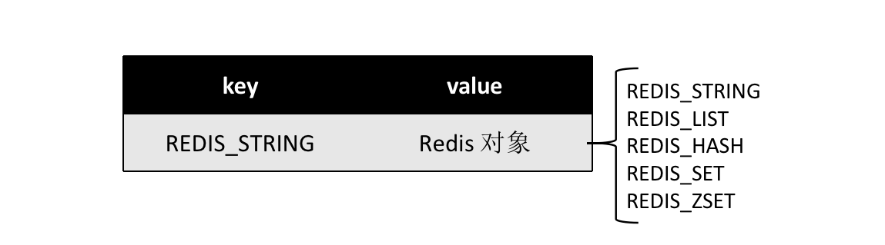

其中“值”（value）的类型有：

<big>**String**</big>
* Redis 最基本的数据类型，扩展性非常高
* 上面已经提到过了：底层为字符数组，长度不超过 512 MB
* Redis K-V 中的 key 只能为 String 类型
* 该类型二进制安全，可以包含任何数据，如 jpg 图像或者序列化的对象

String 最简单的编码：

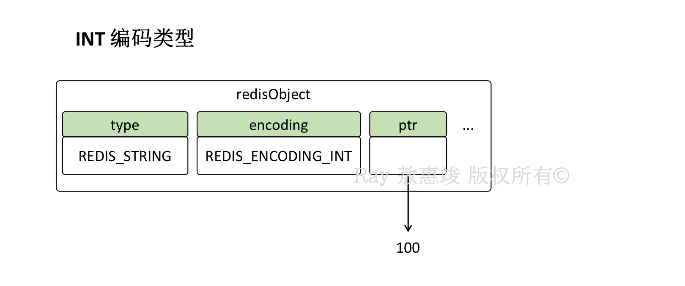

String 编码转换：
* 当 int 数据不再是整数，或大小超过 long 范围时，String 自动转为 raw 编码方式
* 因 embstr 的实现是只读：修改 String 的值时，要先将 embstr 转化为 raw，再进行修改

String 类型相关指令：

| 命令      | 解释     |
| ---------          | ------------ |
| set key value                     | 将对应 key 赋值为 value   |
| get key                           | 获取 key 对应的 value 值  |
| del key                           | 删除 key                 |
| expire key seconds                | 设置 key 在 seconds 秒后过期         |
| expireat key timestamp            | 设置 key 的超时时间至某个时间戳        |
| setex key timeout value           | 如果 key 存在，则将值更新为 value，过期时间为 timeout 秒     |
| ttl key                           | 查看 key 还有多久过期                |
| setnx key value                   | 如果 key 不存在，就新增 key 和 value  |
| strlen key                        | 计算 key 对应 value 的长度           |
| incr key                          | 如果 key 对应的 value 值为 int 类型，则自增 1；否则报错      |
| incrby key numbers                | 如果 key 对应的 value 值为 int 类型，则增加对应的值；否则报错 |
| mset key1 value1 key2 value2 ...  | 批量添加                |
| mget key1 key2 key3 ...           | 批量获取                |

<br/>

<big>**Hash**</big>
* 键值对（key-value）集合
* 本质为 String 类型的 field 和 value 的映射表
* 指令以 h 开头

Hash 类型相关指令：

| 命令        | 解释     |
| ------------          | ------------ |
| hset key name value                  | 添加键值对 name、value 到 key 中   |
| hget key name                        | 查看键为 name 的 value 值         |
| hmset key name1 value1 name2 value2  | 往 key 批量添加键值对              |
| hmget key name1 name2                | 从 key 中批量获取值               |
| hlen key                             | 获取 key 的键值对数目              |
| hgetall key                          | 获取 key 中所有元素，包括键和值     |

Hash 的编码：

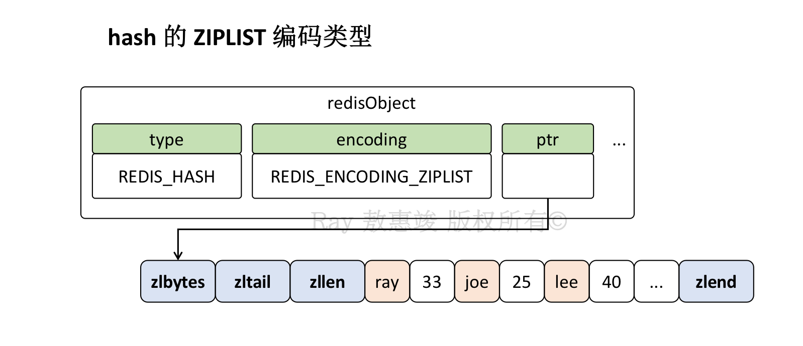

ziplist 编码特点：如上，所有数据内存上连续，以实现快速访问。

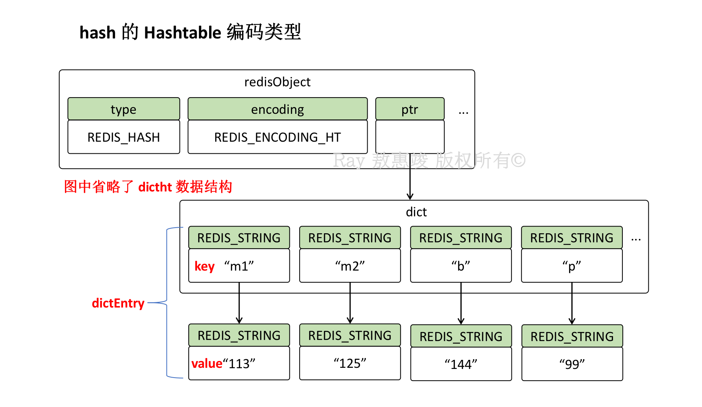

当 hash 中键值对数量少于 512 个，且 key 和 value 的长度都小于某个字节长度阈值时，hash 采用 ziplist 编码，否则采用 hashtable 编码。

<br/>

<big>**List**</big>
* 简单的 String 列表，按照插入顺序排序
* 可添加至列表头（左）或尾（右）
* 相关操作指令以 l 开头

List 类型相关指令：

| 命令      | 解释     |
| ---------          | ------------ |
| lpush key value1 value2         | 往 key 的左侧插入 value1、value2 ...     |
| rpush key value1 value2         | 往 key 的右侧插入 value1、value2 ...     |
| lpop key                        | 从 key 的左侧弹出元素                    |
| rpop key                        | 从 key 的右侧弹出元素                    |
| llen key                        | 查看 key 的长度（元素个数）               |
| lindex key index                | 查看列表 key 中某个 index 对应的值        |
| lrange key startIndex endIndex  | 查看指定范围内元素，下标从 0 开始           |
| ltrim key startIndex endIndex   | 保留指定范围内元素，删除其他元素；下标从 0 开始  |

List 的编码：

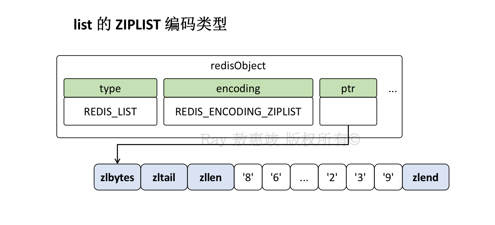

在 Redis 3.2 之后，List 使用 quicklist 替换了原来的 ziplist；quicklist 的底层使用的还是 ziplist 的实现。

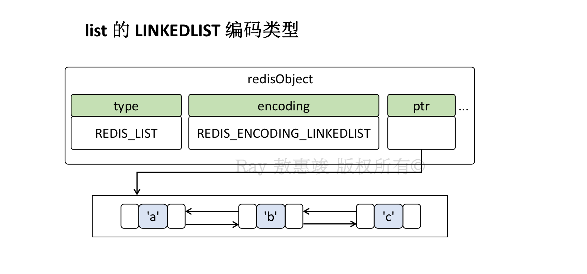

<br/>

<big>**Set**</big>
* 元素为 String 的无序不重复集合，通过哈希表实现
* 保存数字的时候是有序的
* 相关操作指令以 s 开头

Set 类型相关指令：

| 命令      | 解释     |
| ---------          | ------------ |
| sadd key value1 value2   | 往集合 key 中添加元素 value1、value2 ...   |
| smembers key             | 查看集合 key 中的所有元素                  |
| sismember key value      | 查看 value 是否在集合 key 中              |
| scard key                | 查询集合 key 的长度                       |
| spop key                 | 取出集合 key 的一个元素                    |
| del key                  | 删除集合 key                             |

Set 的编码：

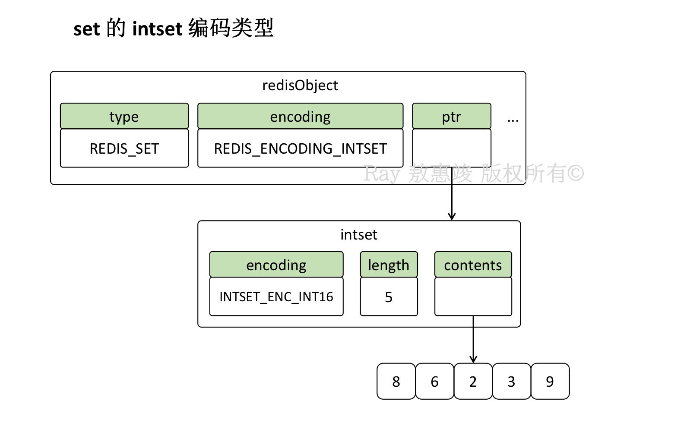

存入不多于 512 个纯整数时，Set 采用 intset 编码；否则均采用 hashtable 编码。

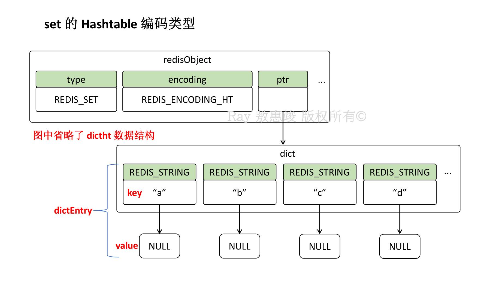

Set 中的每个元素为 dictEntry 的 key，value 值为空。

<br/>

<big>**zset**</big>（Sorted Set）
* String 有序不重复集合，与 Set 类似
* 每个元素关联一个 double 类型的权重（score），Redis 根据权重从小到大排序
* 相关操作指令以 z 开头

zset 类型相关指令：

| 命令      | 解释     |
| ---------           | ------------ |
| zadd key score1 value1 score2 value2     | 添加元素至集合 key 中；如果 value 相同，后输入的 score 会覆盖前面的 score   |
| zscore key value                         | 查看 value 的 score 值，输出 -∞ < score < +∞ 的所有元素 |
| zrange key 0 -1                          | 正序输出                   |
| zrangebyscore key -inf +inf              | 正序输出                   |
| zrevrange key 0 -1                       | 倒序输出                   |
| zcard key                                | 查看集合 key 的元素个数      |
| zrangebyscore key indexStart indexEnd    | 输出集合 key 中 indexStart <= score <= indexEnd 的元素，正序排列  |
| zrevrangebyscore key indexStart indexEnd | 输出集合 key 中 indexStart <= score <= indexEnd 的元素，倒序排列  |
| zrem key value                           | 删除集合 key 中的 value     |

zset 的编码：

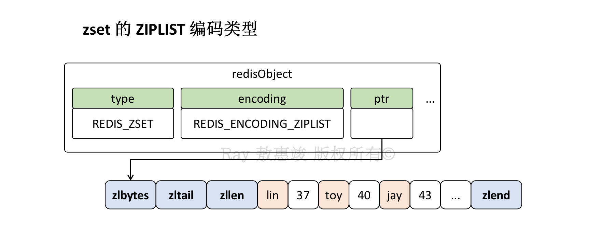

ZIPLIST 会按照 score 的大小排序。

当数据量增大时，zset 会调整到跳表（skiplist）的编码模式：

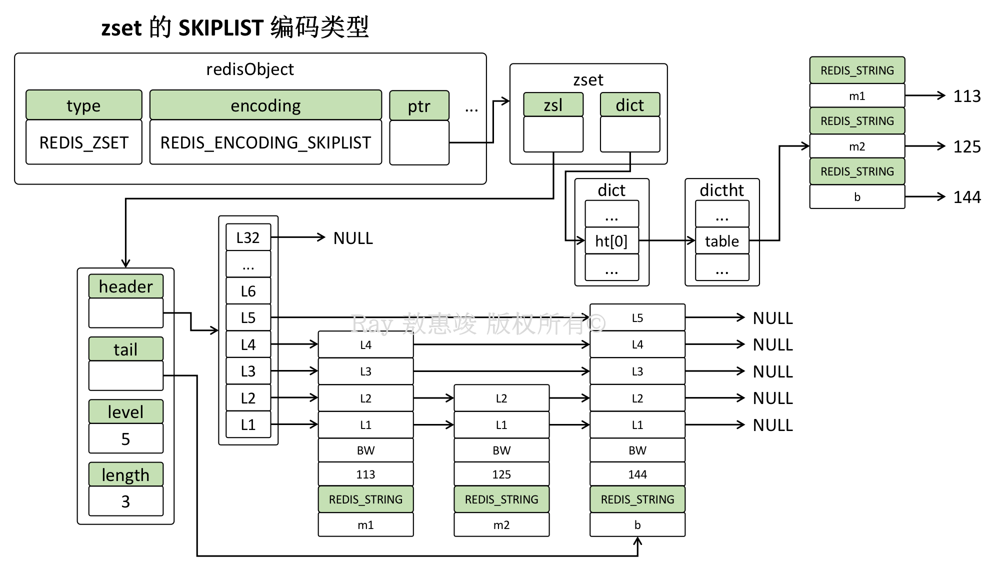


为啥每种对象类型都有至少两种编码？
1. 接口与实现分离，当需要增加或改变内部编码时，用户使用不受影响
2. 可根据不同应用场景切换内部编码，提高效率

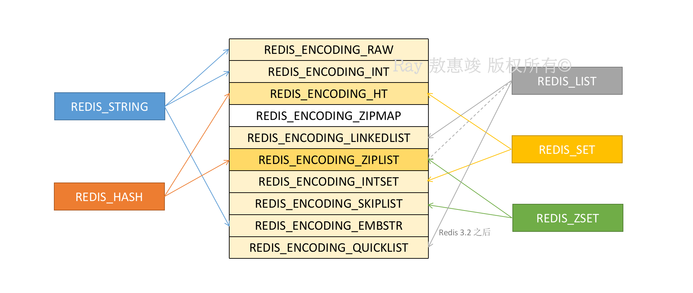

<table>
	<tr>
	    <th>类型</th>
	    <th>编码（Redis 3.0）</th>
	    <th>简介</th>
	    <th>应用场景</th>
    </tr>
	<tr>
	    <th rowspan="3">String (REDIS_STRING)</th>
	    <td>REDIS_ENCODING_INT</td>
        <td>使用整数值实现的字符串对象</td>
        <td rowspan="3"></td>
	</tr>
	<tr>
	    <td>REDIS_ENCODING_EMBSTR</td>
        <td>使用 embstr 编码的 SDS 实现的字符串对象</td>
	</tr>
	<tr>
	    <td>REDIS_ENCODING_RAW</td>
        <td>使用 SDS 实现的字符串对象</td>
	</tr>
	<tr>
	    <th rowspan="2">Hash (REDIS_HASH)</th>
	    <td>REDIS_ENCODING_ZIPLIST</td>
        <td>使用压缩列表实现的 hash 对象</td>
        <td rowspan="2">存储、读取、修改用户属性</td>
	</tr>
	<tr>
	    <td>REDIS_ENCODING_HT</td>
        <td>使用字典实现的 hash 对象</td>
	</tr>
	<tr>
	    <th rowspan="2">List (REDIS_LIST)</th>
	    <td>REDIS_ENCODING_ZIPLIST</td>
        <td>使用压缩列表实现的列表对象</td>
        <td rowspan="2">最新消息排行；消息队列等功能</td>
	</tr>
	<tr>
	    <td>REDIS_ENCODING_LINKEDLIST</td>
        <td>使用双向链表实现的列表对象</td>
	</tr>
	<tr>
	    <th rowspan="2">Set (REDIS_SET)</th>
	    <td>REDIS_ENCODING_INTSET</td>
        <td>使用整数集合实现的集合对象</td>
        <td rowspan="2">共同好友<br/>点赞系统（不能重复点赞）<br/>利用唯一性统计访问网站的所有独立 IP<br/>好友推荐：根据 tag 求交集</td>
	</tr>
	<tr>
	    <td>REDIS_ENCODING_HT</td>
        <td>使用字典实现的集合对象</td>
	</tr>
	<tr>
	    <th rowspan="2">Sorted Set (REDIS_ZSET)</th>
	    <td>REDIS_ENCODING_ZIPLIST</td>
        <td>使用压缩列表实现的有序集合对象</td>
        <td rowspan="2">排行榜<br/>带权重的消息队列</td>
	</tr>
	<tr>
	    <td>REDIS_ENCODING_SKIPLIST</td>
        <td>使用跳表和字典实现的有序集合对象</td>
	</tr>
</table>

编码转换在 Redis 写入数据时完成，而且转换过程是不可逆的，只能从小内存编码向大内存编码转换。

<br/>

# 内存模型

通过 `info memory` 来看 Redis 的内存统计：

```sh
> info memory

# Memory
used_memory:199960008
used_memory_human:190.70M
used_memory_rss:213798912
used_memory_peak:201290832
used_memory_peak_human:191.97M
used_memory_lua:37888
mem_fragmentation_ratio:1.07
mem_allocator:jemalloc-5.1.0
```

内存统计中各字段的含义：

`used_memory`：Redis 内存分配器分配的内存总量（Byte），包括使用的虚拟内存（swap）。

`used_memory_human`：used_memory 更友好的显示方式。

`used_memory_rss`：Redis 进程占据操作系统的内存（Byte），与 top 和 ps 命令看到的值是一样的，包括：
* Redis 内存分配器分配的内存
* Redis 进程运行本身需要的内存
* 内存碎片
* ...

但并不包括虚拟内存。

注：`used_memory` 是从 Redis 得到的数量，而 `used_memory_rss` 则是从操作系统角度得到的量。两者的值不一样，是因为：
1. Redis 进程运行需要占用内存，且存在着内存碎片的时候：前者会比后者小
2. 当存在虚拟内存：前者会比后者大

`mem_fragmentation_ratio`：内存碎片比率，等于 used_memory_rss / used_memory。
* 数值一般大于 1，1.03 为比较健康的状态；比率越大，内存碎片的占比就越大
* 数值小于 1，说明 Redis 使用了虚拟内存：要及时排查
* 在实际应用中，当 Redis 的数据量比较大时，进程运行所占用的内存与 Redis 数据量和内存碎片相比会小很多。

`mem_allocator`：定义 Redis 使用的内存分配器，在编译时指定
* 可以是 libc, jemalloc 或 tcmalloc，默认使用 jemalloc

以 jemalloc 为例：将内存空间划分为小、大、巨大三个范围，每个范围内划分许多小的内存块单位：

<table>
	<tr>
	    <th>Category</th>
	    <th>Spacing</th>
	    <th>Size</th>
    </tr>
	<tr>
	    <th rowspan="7">Small</th>
	    <td>8</td>
        <td>[8]</td>
	</tr>
	<tr>
	    <td>16</td>
        <td>[16, 32, 48, ..., 128]</td>
	</tr>
	<tr>
	    <td>32</td>
        <td>[160, 192, 224, 256]</td>
	</tr>
	<tr>
	    <td>64</td>
        <td>[320, 384, 448, 512]</td>
	</tr>
	<tr>
	    <td>128</td>
        <td>[640, 768, 896, 1024]</td>
	</tr>
	<tr>
	    <td>256</td>
        <td>[1280, 1536, 1792, 2048]</td>
	</tr>
	<tr>
	    <td>512</td>
        <td>[2560, 3072, 3584]</td>
	</tr>
	<tr>
	    <th>Large</th>
	    <td>4 KiB</td>
        <td>[4 KiB, 8 KiB, 12 KiB, ..., 4072 KiB]</td>
	</tr>
	<tr>
	    <th>Huge</th>
	    <td>4 MiB</td>
        <td>[4 MiB, 8 MiB, 12 MiB, ...]</td>
	</tr>
</table>

<br/>

综上，Redis 的内存占用主要有以下部分：

**1. 数据**
* 最主要的部分，其占用的内存被统计在 used_memory 中
* 每种数据类型可能有两种或更多的内部编码实现
* 存储数据对象时，并不是直接将数据扔进内存，而是对对象进行各种包装：如 redisObject、SDS 等

**2. 进程本身运行需要的内存**
* 包括代码、常量池等内容，不由 jemalloc 去分配，因此不会统计在 used_memory 中
* 在大多数场景中，这部分的内存占用可忽略
* 除主进程外，Redis 创建的子进程（如执行 AOF、RDB 重写时创建的子进程）也会占用内存：
    * 这部分内存并不属于 Redis 进程，因此不会统计在 used_memory 和 used_memory_rss 中

**3. 缓冲内存**，包括：
* 客户端缓冲区：存储客户端连接的输入输出缓冲
* 复制积压缓冲区：用于部分复制功能
* AOF 缓冲区：在进行 AOF 重写时，保存最近的写入命令
* ...

**4. 内存碎片**：Redis 分配、回收物理内存过程中产生的。

产生的原因：  
比如：对内存中的数据更改频繁，且数据之间的大小相差很大，会导致 Redis 释放的空间在物理内存中并没有释放，但 Redis 又无法有效利用这些物理内存。由此便会产生内存碎片。

内存碎片的产生，和对数据进行的操作、数据的特点等有关；也和使用的内存分配器有关。
* 如内存分配器设计合理，可以尽可能减少内存碎片产生
* 如内存碎片很大，可以通过安全重启减小内存碎片：重启后 Redis 重新从备份文件中读取数据，在内存中进行重排

内存碎片不会被统计在 used_memory 中。


## 数据存储的细节

`dictEntry` 对应的是 Redis 的每个键值对，存储着指向 key 和 val 的指针；  
其中 val 的数据结构是一个联合体（union）。  
另外，每一个 dictEntry 都有一个 next 指针指向下一个 dictEntry。

例：
```sh
set hello world
```
* key 为 "hello"：存储于 SDS 中
* val 为 "world"：存储于 redisObject 中
    * 字符串对象 "world" 存储于 SDS
    * `type`：指明 val 对象的类型；因为指令是 set，所以对应类型为 REDIS_STRING
    * `ptr`：指向字符串对象所在地址
* Redis 的内存分配器分配内存：dictEntry 有三个指针，占用 24 字节，分配器就会分配 32 字节。

<br/>

# 优点

最大的优点：<big>**快**</big>

Redis 是单进程单线程的模型，对于数据的操作完全基于内存，因此 CPU 不是瓶颈；而且单线程容易实现。

为何 Redis 是单线程模型，处理起来还仍然这么快？
* 数据结构简单，对数据的操作也简单
* 数据存储类似于 HashMap：查找和操作的时间复杂度是 **O**(1)
* 采用单线程，避免不必要的上下文切换和竞争条件
* 使用非阻塞 IO

<br/>

# 应用


## 消息队列

可以使用 list 实现消息队列。基本操作与模型的对应如下：

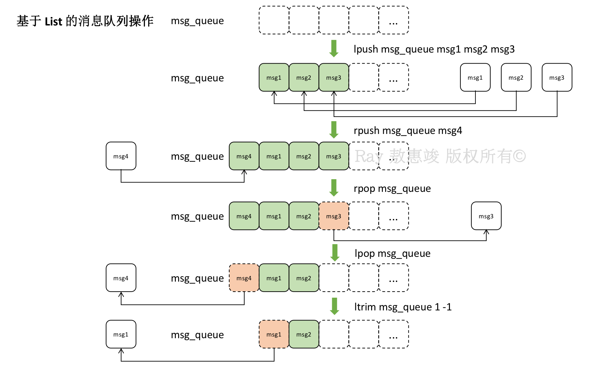

基于主流配置，结合生产者与消费者的模型如下：

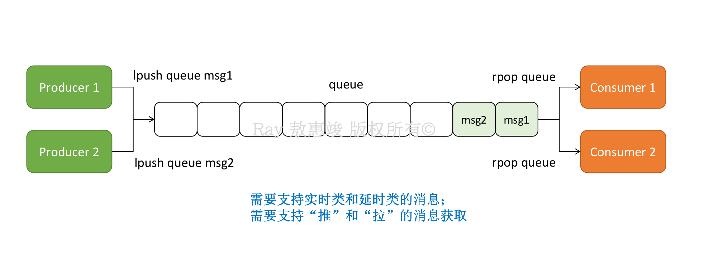

可以使用 `blpop` 或 `brpop` （`b` 表示阻塞 blocking）实现“拉”的消息获取。
* 不过，因为操作会一直阻塞 list，Redis 监测到一段时间 list 没有消息，会抛出异常，令 MQ 终止。
* 因此实现消息队列时需要捕获这种异常并加以处理（重建队列，...）

如果要实现延时队列的话，需要将模型改为 `zset`，给某一个时段进入的消息赋予一定的 score，然后通过对应操作（如 `zrangebyscore`）获取消息。

因为市面上成熟的 AMQP 产品很多，同时 MySQL 也有消息队列功能提供，一般不会使用 Redis 来做消息队列。

<br/>

## 分布式锁

应用中如有多个服务对同一数据进行操作，JVM 的锁机制并不能满足，只能通过分布式锁解决。  
如下图中的场景，服务 A 和服务 B 中的 JVM 锁就不能相互对对方起约束作用：

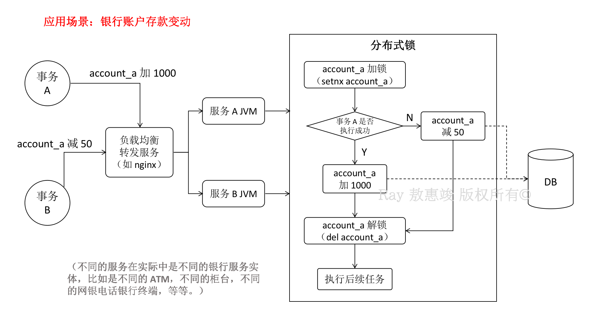

概述：
* 加锁操作：`setnx` + 过期时间 -> `set key value ex timeout nx`
* 解锁：`del key`，原子性操作

实现要点：
1. 加锁和解锁的 key 一定要一致，要不然无法解锁，再多的 `setnx` 指令都是白费。
2. 不能永久加锁，一定要加上过期时间；越来越多永久的锁存在于内存中，系统会受不了的。
3. 一定要保证加锁和设置过期时间的**原子性**。
4. 要支持过期**续租** / **可重入**分布式锁。


### 雷区

**1. 锁过期**：获得锁的线程因为各种原因还没操作完，锁就过期释放了。

解决方法：根据业务设定合适的加锁时间。

**2. 重叠解锁**：基于锁过期引发的另一个严重问题
* 甲线程在获得锁之后，在未执行完任务的情况下锁就过期了；
* 此时乙线程拿到锁并执行任务，在其未执行完毕的时候，甲执行完毕，并进行解锁操作；
* 因为甲线程所加的锁早已过期，此时甲线程的解锁操作解掉的是**乙线程获得的锁**，此时锁又被释放；
* 以此类推，当丙线程进来了，获得锁但未执行完任务，乙线程执行完毕并解锁的时候，解掉的是丙线程加的锁；以此反复，就会出现很大的问题。

解决方法：加锁（set 操作）的时候，value 带上**唯一标识**（如线程 ID），就会避免解错锁的情况。

**3. 单点问题**

在 Redis **集群环境**中，甲线程获得锁之后，将信息保存到主节点；  
在信息同步至从节点的过程中，主节点挂掉了（……）；从节点会升级为主节点，但是它并没有保存到甲线程获取到锁的信息，导致锁会被其它线程获取到。

解决方法：**Redlock** 算法

<br/>

# 持久化

Redis 最大的弊端在于其是内存数据库，万一宕机，数据就没有了。因此 Redis 需要持久化，以便服务重新启动时能恢复数据。


## RDB

全称 **R**edis **D**ata**B**ase，将当前进程数据生成快照保存到硬盘。支持手工执行和服务器定时执行。

分两种命令：

SAVE：阻塞当前 Redis 服务器，直到 RDB 过程完成。
* 对于内存比较大的实例会造成长时间的阻塞
* 已被逐渐废弃，线上环境不建议使用

BGSAVE (**B**ack**G**round **SAVE**)
* Redis 进程执行 fork 操作创建子进程，由该子进程负责 RDB 的持久化，完成后自动结束
* 由此可知，定时执行初始化使用的就是 BGSAVE
* 阻塞只发生在 fork 阶段，只占很短的一段时间
* 系统的条件检测器 Server Cron 每 **100ms** 进行一次条件检测，满足备份条件才会创建子进程执行持久化

```
Background saving started
```

相关的数据结构如下：

```c
// redis.h
struct redisServer {
	...

	// save point 数组，下面会介绍
	struct saveparam *saveparams;  /* Save points array for RDB */

	// 计数器。记录上一次成功执行 SAVE 或 BGSAVE 后，数据进行了多少次修改（写入、删除、更新等）
	long long dirty;  /* Changes to DB from the last save */

	// 例：
	// set key "value": dirty 计数器加 1
	// sadd key "value1" "value2" "value3": dirty 计数器加 3

	// 记录上一次成功执行 SAVE 或 BGSAVE 的时间
	time_t lastsave;  /* Unix time of last successful save */

	...
}

struct saveparam {  // 能否执行定时操作的标准
	// 执行时长
	time_t seconds;
	// 修改次数
	int changes;
}
```

`saveparam` 相当于 redisServer 的配置项。意思是：在 seconds 时间内执行了 changes 次修改之后，服务器会定时执行 BGSAVE 操作进行持久化。

以当前时间戳减去 lastsave，结果如果大于 seconds，即满足持久化条件；以 dirty 值与 changes 比较，如果比 changes 大即满足持久化条件。

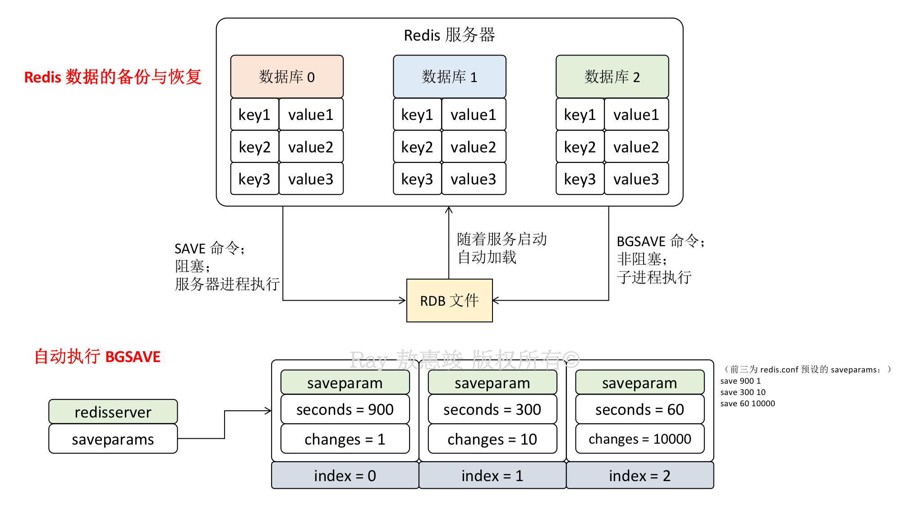

当 RDB 文件比较大时，Redis 服务启动的时候需要耗费较多的时间。

<br/>

## AOF

全称 **A**ppend **O**nly **F**ile。通过记录**所有执行过的 redis 命令**来记录数据库的变更。  
命令被执行之后并没有马上结束，而是继续由 Redis 服务器将命令保存至 AOF 文件中。

AOF 频率比 RDB 高；如果开启了 AOF 开关，服务器启动时会先执行 AOF 加载 AOF 文件，否则会执行 RDB。

相关的数据结构如下：

```c
// redis.h
struct redisServer {
	...

	// 缓冲区，以请求协议格式保存每一个被执行完的写命令的地方
	sds aof_buf  /* AOF buffer, written before entering the event loop */

	...
}
```

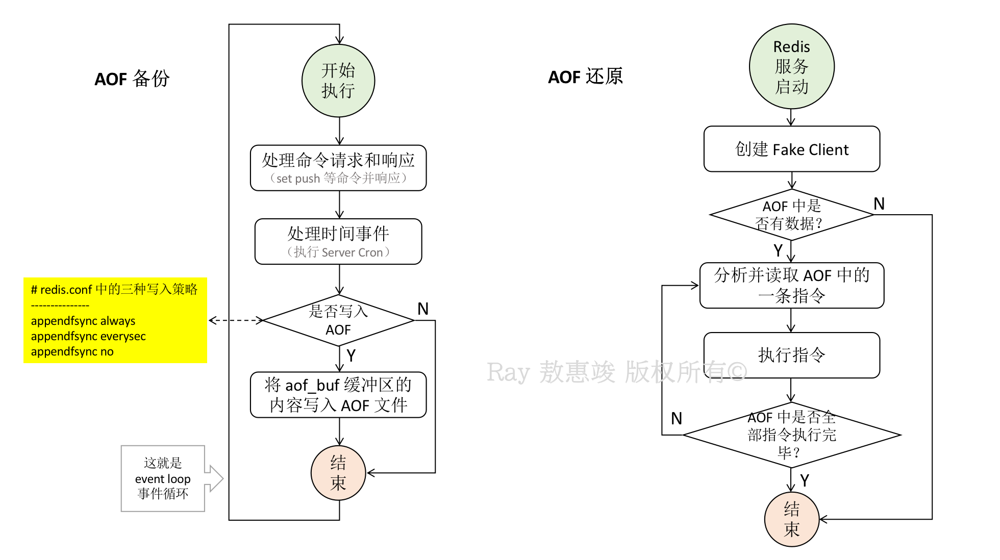

多提一嘴：其实真正的写入文件，是包括写入和同步的：

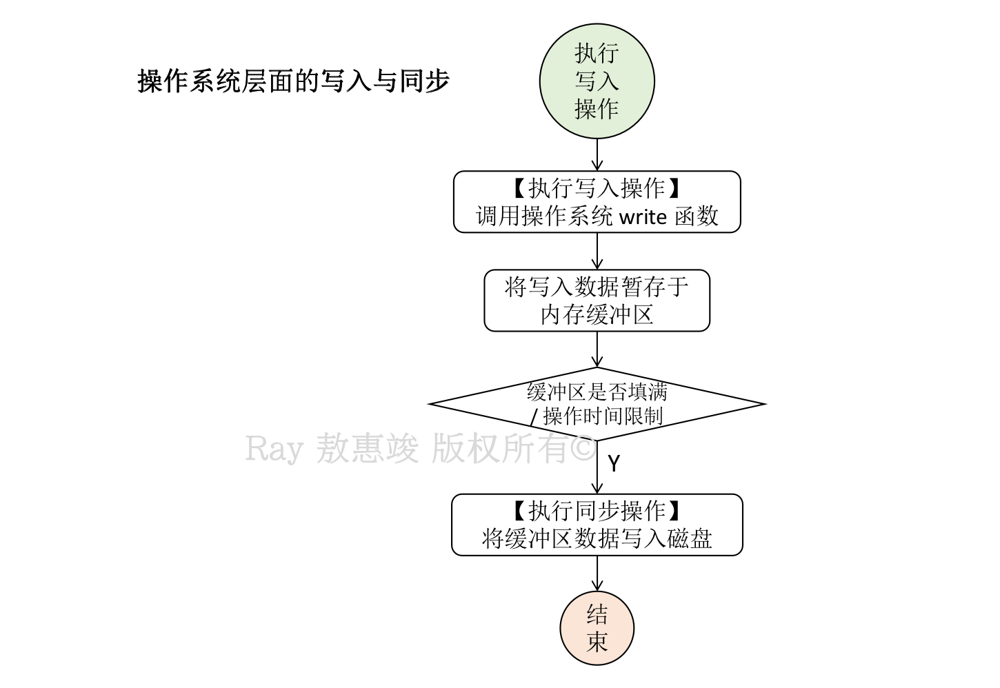

```bash
appendonly yes  # 开关

appendfilename "appendonly.aof"  # 文件名
```

比较一下这三种写入策略：


`appendfsync always`：将 aof_buf 的内容写入并同步到 AOF 文件中，真正地将指令写入了磁盘
* 优点：能够保证基本数据不丢失
* 缺点：效率低，给磁盘带来的压力很大

`appendfsync everysec`：将 aof_buf 的内容先行写入 AOF 文件中；若上次同步时间距今超过 1 秒，则进行 AOF 同步
* 默认设置

`appendfsync no`：将 aof_buf 的内容先行写入 AOF 文件中，但不同步 AOF 文件；何时同步由操作系统决定。

由此显而易见，AOF 的**缺陷**是：文件会增长。  
不仅会占用大量的空间，还会拖慢 Redis 服务启动时数据的加载速度。

打个比方，一顿操作之后，最后的数据结构里只有两个元素，AOF 却可能记录了上百条执行过的命令，当中有大部分大概率是浪费的。


### 改进：AOF 重写

```bash
auto-aof-rewrite-percentage 100  # 比上一次 AOF 重写后体量超过了 100%
auto-aof-rewrite-min-size 64mb  # AOF 文件超过 64 MB
# 两个指令是 且 的关系，同时满足才触发 AOF
```

每执行一次重写，会有大量的写入操作，如果让主线程去干这个事的话，主线程会被长时间阻塞；  
因此解决的办法是：Redis fork 一个子进程去做这个事情。

但是这又会带来另一个问题：主进程一直在接收新指令，子进程发起重写时，重写数据会与数据库数据不一致。  
针对数据不一致的情况，Redis 服务器设置了一个 AOF 缓冲区：
* Redis 接收一个指令的时候，除了执行处理之外，还会将它放在 AOF 缓冲区和 AOF **重写缓冲区**；
* 子进程重写完毕后，会通知回主进程，随后主进程阻塞，将 AOF 重写缓冲区的内容 append 到 AOF 文件中。

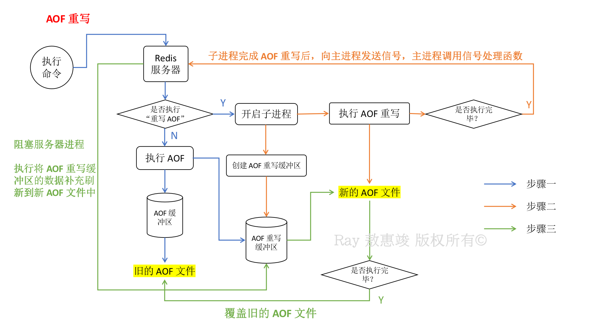

由上图可知，基于重写的 AOF，每次重写的**不是旧的 AOF 文件**，而是基于 DB 数据创建新的文件。

<br/>

# 数据分区

我们可以将数据分隔到多个 Redis 实例，每个实例只保存所有 key 的一个子集。

优势：
* 通过利用多台计算机内存构造更大数据库，扩展计算能力

不足：
* 涉及多个 key 的操作通常不被支持
* 处理多个持久化文件

分区策略：
* 按照范围分区
* 按照 hash 分区

<br/>

# 集群搭建

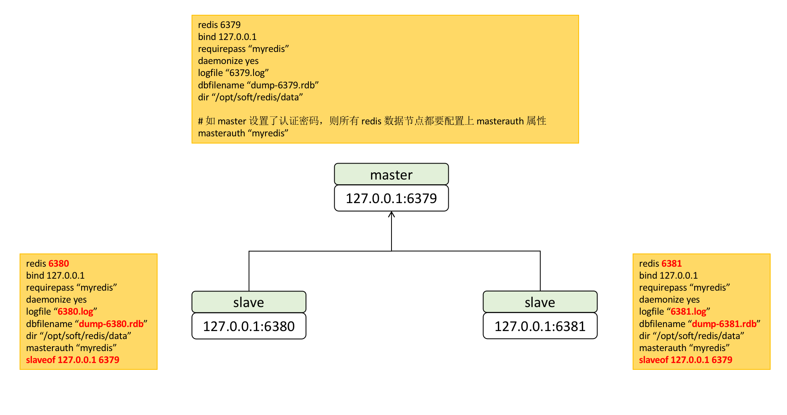

master 支持数据的更新和修改，slave 只支持数据的查看。

同时，Redis 的主从切换，需要 Sentinel 的支持。