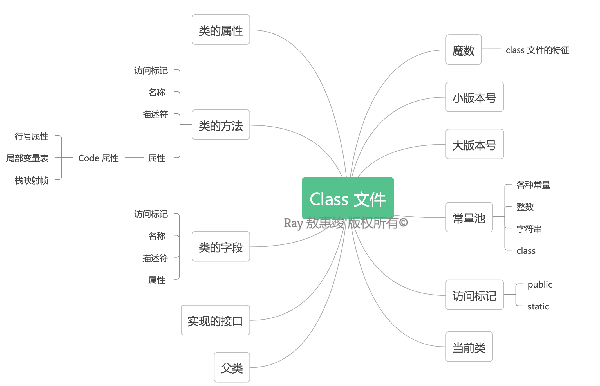

首先，我们这里讨论的并不是物理上的反射（哈哈），而是基于计算机科学的反射式编程概念，讨论一下它的原理以及在 Java 语言当中的实现。

<!-- more -->
# 概述

在计算机科学中，[反射式编程](https://zh.wikipedia.org/wiki/反射式编程)（reflective programming），或反射（reflection），指的是计算机程序运行时“访问、检测和修改它本身状态或行为的能力”：
* 它可以把一个类，类的成员变量（函数、属性等）当成一个对象来操作；
* 在程序运行的时候，开发者还可以动态地进行以下操作：
    * 构造任意一个类的对象；
    * 了解任意一个对象所属的类；
    * 了解任意一个类的成员变量和方法；
    * 调用任意一个对象的属性和方法。

最早的计算机在它们的原生汇编语言里编程：本质为反射
* 由定义编程指令作为数据
* 在面向对象的编程语言中，反射允许在编译期无法确认接口的名称、字段、方法的情况下，在运行时检查类、接口、字段和方法。

为什么有反射？因为它“**灵活**”。  
在运行期根据某种条件才能确定使用哪个类的对象时，就可使用反射。

例子：**策略模式**
```java
/**
 * 可在运行时根据不同条件创建不同的类，实现不同的 Strategy 实例
 * 例：构造时传进不同的 String 代表某个子类以初始化不同的实例
 * 能避免很多的 if-else
 */
abstract class BaseStrategy {

    public void execute() {
        // 执行某种策略
    }
}
```

# Java 的反射机制

Java 中的反射机制，指的是直接操作编译后的 `.class` 文件，动态获取程序信息及动态调用对象的功能。

优点：
* 可动态执行
* 在运行期间根据业务功能动态执行方法、访问属性
* 最大限度发挥 Java 灵活性

缺点：
* 对性能有影响，总是慢于直接执行 Java 代码

## Java 的反射与所谓“传统 RTTI”的区别


## 普通的生成对象 v.s. 反射生成对象


## .class 文件包括了什么？



注：左边为编译前源码的内容，右边为类的信息

## Class 对象相关

### 基本类图


重要的实体类：
* `Class`：类相关
* `Constructor`：构造函数相关
* `Field`：属性相关
* `Method`：其他方法相关

```java
java.lang.Class
java.lang.reflect.Constructor
java.lang.reflect.Field
java.lang.reflect.Method
```

相同的 class 全路径下只会有一个相对应的 .class 文件
* 因此通过该全路径获得的所有 Class 对象都是相等的（`.equals() = true`）


### 获得 Class 对象的方式
1. 类名.class
```java
Class personClazz = Person.class;
```
2. 类实例.getClass()
```java
Person person = new Person();
Class personClazz1 = person.getClass();
```
3. Class.forName(“类的全路径”)
```java
Class personClazz2 = Class.forName("com.example.Person");
```


### Class 类常用方法
```java
// 静态方法
Class.forName("com.example.Person")     // 根据全路径动态加载类

/*
 非静态方法
 */
newInstance()       // 根据对象的 class 新建一个对象

getSuperclass()         // 获取继承的父类
getInterfaces()         // 获取继承的接口
getDeclaredFields()     // 获取所有声明的域，但不能获得继承过来的域
getDeclaredMethods()    // 获取当前类的所有方法
getConstructors()       // 获取所有构造函数
getModifiers()          // 获取修饰符
getPackages()           // 获得 package
getField(String name)   // 获得某个 public 域，包括从父类继承过来的域
getFields()             // 获得所有 public 域
getMethods()            // 获得所有 public 方法


isAnnotation()      // 判断是否为注解类型
isPrimitive()       // 判断是否为基本类型
isArray()           // 判断是否为数组类型
isEnum()            // 判断是否为枚举类型

getClassLoader()    // 获得类的类加载器
```

`Class.forName()` 和 `ClassLoader.loadClass()` 的区别：
* `Class.forName()` 除了将类的 .class 文件加载到 JVM 中之外，还可将类进行初始化
* `ClassLoader.loadClass()` 只是将 .class 文件加载到 JVM 中，不会进行初始化


## Constructor 构造函数相关

通过 Class 对象创建构造方法对象
```java
// .getConstructor() 方法支持无参及多个参数传入
Constructor c = personClazz.getConstructor(String.class, Integer.class, Byte.class);
Constructor c1 = personClazz.getConstroctor();
```
随后通过 constructor 实例创建对象的时候，要根据 constructor 初始化时传入对应的参数来创建对象
```java
Person p = (Person) c.newInstance("test", 10, (byte) 1);
Person p2 = (Person) c1.newInstance();
```


## Field 属性相关

先获取到 Class 对象
```java
Class personClazz = Person.class;
```
通过 Class 对象获取 Field 对象
```java
Field nameField = personClazz.getField("name");  // 获得类的属性
// 或：Field nameField = personClazz.getDeclaredField("name");
```
根据实际的对象，获取属性值
```java
Constructor c = personClazz.getConstructor();
Person person = (Person) c.newInstance();  // 创建实际对象

// 根据实际对象获取实际的属性值
String name = (String) nameField.get(person);
```

可通过反射调用私有变量
```java
// 步骤同上，但在获得 Field 对象时的方法有些许不同
Field nameField = personClazz.getDeclaredField("name");
// 多个 Field：Class.getDeclaredFields()
```
然后调用
```java
nameField.setAccessible(true);
```
随后便可通过 `.get()` 方法获取值。


## Method 方法相关：与属性类似

可通过反射调用私有方法
```java
clazz.getDeclaredMethod(String name, Class[] parameterTypes)
clazz.getDeclaredMethods()
```
然后调用
```java
method.setAccessible(true);
```

# 应用

服务的水平分割

如 MVC 框架：每一层都存在着能承载结果的实体类
* 视图层：VO (V-view) / UO
* 应用层：DTO / Entity
* 领域层 Domain：Entity / VO (V-value)
* 基础设施层：PO (Persistent)

视图层依赖于应用层，应用层依赖于领域层，基础设施层依赖于领域层

例：持久对象 PersonPO 转为 值对象 PersonVO，如果属性繁多，一个一个转会很麻烦。  
解决方法：利用反射实现工具类（如：`BeanUtils`）
```java
// 调用：
BeanUtils.convert(objectFrom, objectTo);

// 示例代码：
public static void convert(Object srcObj, Object targetObj) throws Throwable {
    // 第一步，获得class对象
    Class srcClazz = srcObj.getClass();
    Class targetClazz = targetObj.getClass();

    // 第二步，获得Field
    Field[] srcFields =  srcClazz.getDeclaredFields();
    Field[] targetFields =  targetClazz.getDeclaredFields();

    // 第三步：赋值
    for (Field srcField : srcFields) {
        for (Field targetField : targetFields) {
            if (srcField.getName().equals(targetField.getName())) {
                srcField.setAccessible(true);
                targetField.setAccessible(true);
                targetField.set(targetObj, srcField.get(srcObj));
            }
        }
    }
}

```

会有一部分的性能损耗，但并不大：因为服务器并没有那么脆弱。  
如果“反模式”：所有层次从上到下都用同一个实体类，只要有一点变化的话，从上到下都会有影响。
