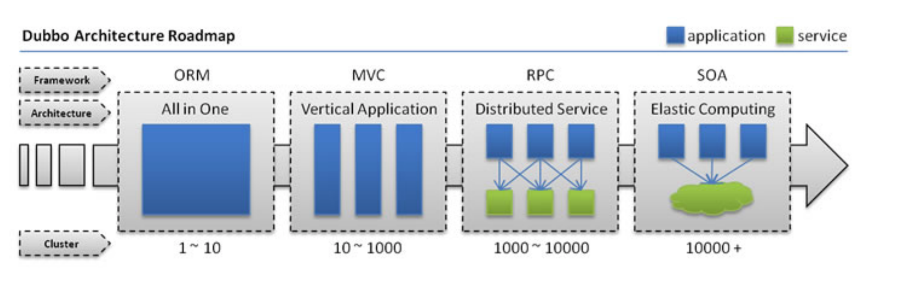
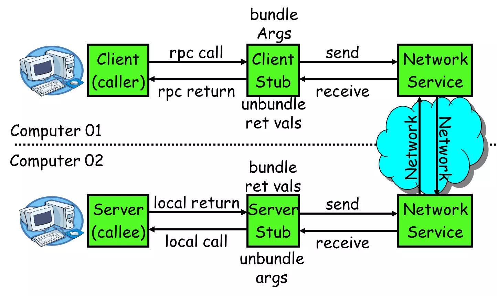
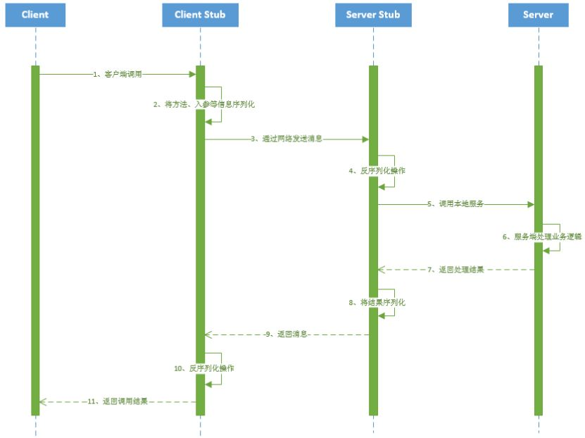
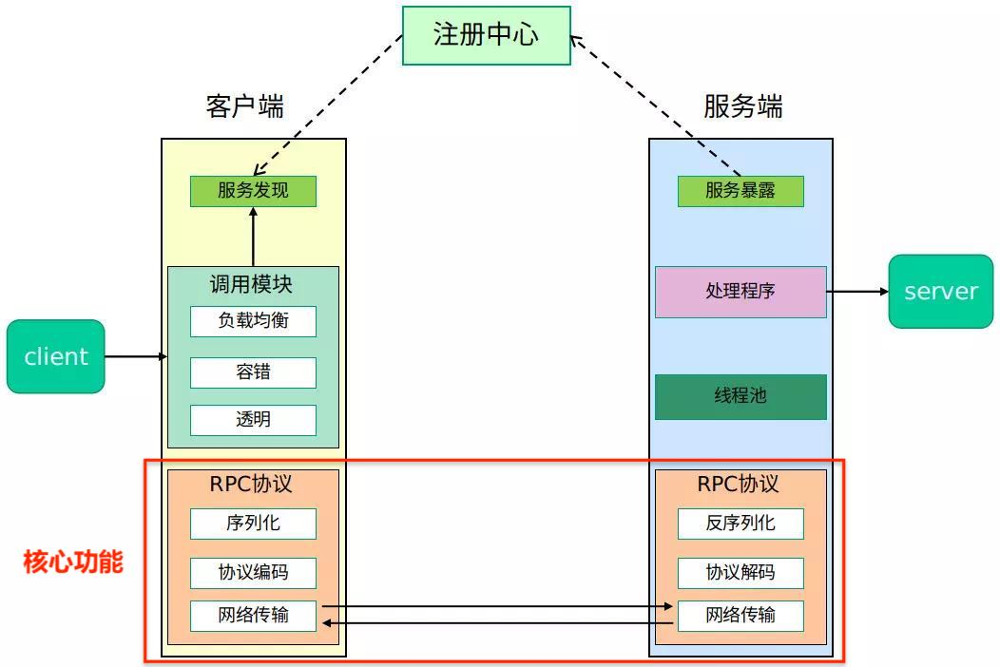
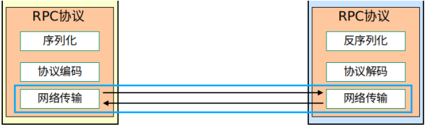
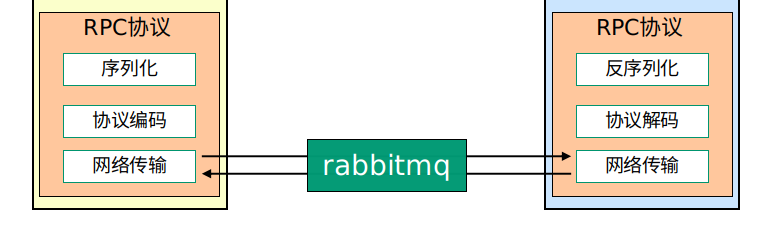

RPC 全称 Remote Procedure Call Protocol，远程过程调用协议。

<!-- more -->

# 背景

单体服务的时代：
* 以前用户量和数据量都比较小，项目所有功能模块都在一个工程中编码、编译、打包，随后部署在一个服务器中，部署好了便可提供服务；
* 特点就是：各部分服务，包括数据库都是使用**单节点**（all-in-one）进行部署的
* 初期：这种单体应用的优点就是简单实用，迭代快，维护也简单，成本低
* 随着业务增加，项目会变得臃肿，**耦合变得严重**，**维护周期变长，变得困难**了；而且一个模块出现了问题，会影响另一个模块的功能以及维护。

垂直架构的时代：
* 按照业务对应用作垂直划分，相当于将一个单体架构拆分成一堆单体应用，组成一个集群
* 这样就能针对不同的模块进行优化，且**模块之间影响减小**，避免上面单体应用出现的问题；而且**方便水平扩展**，**负载均衡**，**迭代高效**，容错率也提高了
* 有一个明显的缺点是：服务之间的调用方式变了，需要通过网络调用，采用的协议根据不同的业务场景很难统一起来（Webservice、HTTP ...）
    * 而且多个垂直应用一共要维护大量的接口地址。如果某个服务端口或 IP 地址发生改变，调用的系统得手动改变
    * 随着系统的发展，调用关系会越来越复杂
* 而且随着流量增大，应用间调用的网络成本逐渐增加；集群化的负载均衡实现也比较复杂
* 服务监控也不到位

面向服务的架构：Service-Oriented Architecture, **SOA**
* 根据实际业务，把系统拆分成合适的、独⽴部署的模块，模块之间相互独⽴（通过 Webservice / Dubbo 等技术进⾏通信），不仅仅是按照业务划分。
    * 越是核心的业务，越要拆出来
* 因此衍⽣出了⼀系列相应的技术，如对服务提供、服务调⽤、连接处理、通信协议、序列化⽅式、服务发现、服务路由、⽇志输出等⾏为进⾏封装的服务框架。

由此可见，我们总结了服务由单体 -> 负载均衡（水平） -> 分布式（垂直） -> 垂直+水平的优化与升级（以 Dubbo 的发展为例）：

因此业界常说的**分布式服务**的概念，与 RPC 紧密相关。

既然是比垂直 MVC 架构的负载更均衡，RPC 要做到的，就是能通过网络请求远程计算机程序的服务时，要能像本地调用一样方便，让调用者感知不到远程调用的逻辑。

总的来说，它属于**跨网络跨进程通信**的范畴，是一种通过网络从远程计算机程序请求服务，而不需要了解底层网络技术的**思想**，并不是一种具体的规范或者协议，使用 TCP、UDP 都可以。

RPC 的使用代表：
* 应用及服务框架：Dubbo, Spring Boot
* 远程通信协议：RMI, Socket, SOAP(HTTP with XML), REST(HTTP with JSON)
* 通信框架：MINA, Netty

 

# 完整框架

先说说在 RPC 思想中主要的功能组成模块：

**客户端**（**client**）：服务调用方。

**客户端存根**（**client stub**）
* 存放服务端服务的地址信息
* 将客户端的请求参数数据信息打包（marshalling，或序列化）成网络消息，再通过网络传输发送到服务端
* 通过网络传输接收服务端返回的处理结果，并将其解包（unmarshalling，或反序列化）成具体的返回值，返回给客户端
* 除了上述工作之外，stub 为一辅助对象，不执行任何实际功能

**服务端存根**（**server stub**）
* 通过网络传输接收到客户端发送过来的请求信息，并进行解包，随后发送至（调用）服务端
* 接收服务端的处理结果，并将其打包成网络信息，通过网络传输发送到客户端
* 和客户端的存根一样，除了上述工作之外，stub 为一辅助对象，不执行任何实际功能

**服务端**（**server**）：服务真正提供者。

**网络服务**：底层传输，可为 TCP 或 HTTP。

在一次网络调用中，RPC 的**核心调用**如下：

时序图：

1. 客户端通过本地调用，执行需要调用的语句，并传递参数
2. 客户端 stub 接收到调用请求后，将方法、入参等信息序列化成能够进行网络传输的消息体
3. 客户端 stub 找到远程服务地址，发送网络消息到服务端
4. 服务端 stub 接收到信息后，解析取得方法名和参数
5. 服务端 stub 根据解析的结果，调用本地服务执行服务（即“远程过程”）
6. 服务端执行过程完毕，将结果返回服务端 stub
7. 服务端 stub 将处理结果序列化
8. 服务端 stub 通过网络服务发送结果至客户端
9. 客户端 stub 接收到结果，对结果进行解码
10. 客户端接收到调用语句返回的结果数据

整个调用为一同步过程。

上图在原来的核心调用之外，多了一个“**RPC Runtime**”的概念：发送和接收请求，其中客户端的 RPC Runtime 多了等待远端执行结果的功能。

完整的 RPC 架构图如下：

在一个典型的 RPC 使用场景中，包含了服务发现、服务暴露、负载、容错、网络传输、序列化等组件，其中 RPC 的思想就指明了程序应该怎么样来进行序列化和网络传输。

 

# 核心功能的技术点

## 服务寻址

我们要调用某个方法的函数体是由函数指针指定的；但放在远程调用中，因为两个进程的地址空间完全不同，函数指针无效。

因此在 RPC 中，所有函数必须有自己的 ID，该 ID 在所有进程中唯一确定；客户端作远程调用时必须附上 ID。  
所以服务寻址可以使用 Call ID 映射。

客户端和服务端分别维护 “函数 <—> **Call ID**” 的**映射表**：
* 客户端启动时，通过服务发现将所需的服务接口信息缓存到本地；执行远程调用的时候：查表，找出对应 ID，传给服务端
* 服务端接收到 ID 后，通过查表，确定客户端需要调用的函数，执行

可以引入服务注册中心（Service Registry），通过管理 IP 端口 / 接口信息来实现寻址；RMI 就是这么实现的。Dubbo 官方推荐使用 Zookeeper。

## 数据流的序列化和反序列化

说多一嘴：什么是序列化和反序列化？

序列化和反序列化属于通信协议的一部分
* 序列化：将数据结构或对象转换成二进制串的过程
* 反序列化：将在序列化过程中所产生的二进制串转换成数据结构或者对象的过程（序列化的逆过程）

再说回 RPC：方法在本地调用的时候，JVM 将参数压入栈，函数自己去栈里读就好；而远程调用的客户端和服务端不能通过内存传递参数，只能通过网络，因此需要有序列化和反序列化的存在。

在 OSI 协议模型中，表示层（Presentation Layer）的主要功能就是序列化和反序列化。

## 网络传输

要讨论的就是上图“核心功能”的那一块：

客户端和服务端通过网络连接，所有数据需要通过网络传输。  
在网络传输中，我们需要一个网络传输层传递 Call ID + 序列化的参数字节流，以及序列化的调用结果（一来一去）。

网络传输的实现协议不限：
* 大部分 RPC 框架使用 TCP 协议（最常见）
* gRPC 使用 HTTP2
* UDP 也可以

### **基于 TCP**
1. 由服务调用方（客户端）与服务提供方（服务端）建立 Socket 连接
2. 服务调用方通过 Socket 将需要调用的接口名称、方法名称和参数序列化后传递给服务提供方
3. 服务提供方反序列化后，再利用反射调用相关方法
4. 执行方法后，将结果序列化，返回服务调用方

在实际应用中会进行一系列封装，如 RMI。

### **基于 HTTP**

服务调用方向服务提供方发送请求，请求为 GET, POST, PUT, DELETE 等其中的一种；  
服务提供方根据不同请求作不同处理，或某个方法只允许某种请求方式。

流程概述：
* 根据请求中的 URL 调用具体方法
* 方法所需要的参数，可以是对服务调用方传输过去的 XML 或 JSON 数据解析出来的部分或全部结果
* 最后返回 XML 或 JSON 数据结果

实现起来更加容易，请求也更像访问网页一般，返回结果更加简单、单一。

两者的**对比**如下：

基于 TCP 实现的 RPC 调用
* TCP 协议处于协议栈靠下的层次中
* 能够更灵活地对协议字段进行定制
* 减少网络开销，提高性能，实现更大吞吐量和并发数
* 需更多关注底层复杂的细节，实现代价更高

基于 HTTP 实现的 RPC 调用
* 能够使用 JSON 和 XML 格式请求或响应数据：格式标准相当通用，解析工具成熟，二次开发便捷且简单
* HTTP 为靠上层的协议
    * 发送包含同等内容的信息，使用 HTTP 传输所占用字节数比 TCP 的更高
    * 在同样的网络状态下：HTTP 传输相同内容的效率比 TCP 低传输占用时间更长，不过通过压缩数据能缩小这一差距

### **基于消息队列**

总的来说，使用消息队列实现能够保证 RPC 在消息传递过程中的安全性和稳定性。

更具体一点：
* 消息队列能让请求从同步变异步，实现更加轻松
    * 使用线程池的话：缺点是要自己实现，且强耦合
* 低内聚高耦合：解耦，减少强依赖
* 流量削峰：通过消息队列设置请求最大值，超过阈值的会被抛弃或转到错误界面
* 网络通信性能提高
    * 每次连接都要建立一次 TCP 连接，高峰期成千上万的连接会造成巨大的性能瓶颈和资源浪费
    * 消息队列采用信道通信，不采用 TCP 直接通信
    * 一个线程一条信道，多个线程多条信道，共用一个 TCP 连接

## 具体的 RPC 实现
* Call ID：可直接使用函数字符串，也可使用整数 ID；映射表一般为哈希表
* 序列化与反序列化：可以自己实现，也可使用 `Hessian`, `Protobuf`（Google 内部混合语言数据标准）, `Thrift`（Facebook 开源框架）或 `FlatBuffers` 等
* 网络传输库：可以自己写 Socket，不过不多，更多的是应用 `Asio`, `ZeroMQ`, `Netty` 等现成的框架。

 

# 使用场景

RPC 多应用在大型网站，内部子系统较多、接口非常多的系统中。
* 长链接：不必每次通信都像 HTTP 一样三次握手，减少网络开销
* 注册发布机制：监控管理、发布、下线接口、动态扩展
* 安全性：没有暴露资源操作
* 微服务支持

 

# 与其它技术栈的比较

## RPC v.s. RESTful
**1**. 面向的对象不同
* REST 的主体是资源，而 RPC 更侧重于动作
* REST 是面向资源的设计架构，但系统中很多对象不能被抽象成资源，如登录，修改密码等
* RPC 可通过动作去操作资源
    * 操作全面性：RPC > REST

**2**. 传输效率不同
* RPC 使用自定义 TCP 协议，请求报文体积更小，效率更高
* HTTP2 协议也可很好地减少报文体积

**3**. 复杂度不同
* RPC 实现复杂，流程繁琐
* REST 调用和测试都很方便

**4**. 灵活性
* HTTP 相对更规范，更标准，更通用，不限制于语言
* RPC 可实现跨语言调用，但整体灵活性不如 REST

## RPC or HTTP?

HTTP 接口在接口不多、系统与系统交互较少时，是解决信息孤岛初期常使用的通信手段。  
因此 HTTP 具有简单、直接、开发方便的优点。

如果系统内部子系统较多，接口多时，RPC 优势更大。因为：
* 长连接，不必每一次通信都像 HTTP 一样进行三次握手，减少网络开销
* RPC 的注册中心的监控管理功能丰富，可发布、动态扩展等
* 安全。
