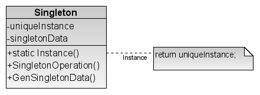
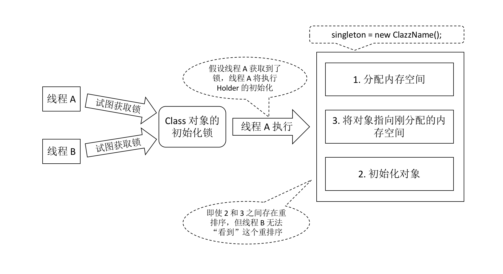

单例模式应该是众多设计模式中最容易被引用，最容易理解的了，但是也最容易出问题。今天写个帖记录一下。

<!-- more -->

单例模式（Singleton）属于对象创建型模式。在《设计模式：可复用面向对象软件的基础》中的介绍：

    “保证一个类仅有一个实例，并提供一个对该实例的全局访问点。”

<br/>

# 动机
* 在很多开发场景中，整个系统只需要拥有一个该类的全局对象：有利于协调系统整体的行为
* 让类保证没有其他实例可以被创建

<br/>

# 适用性
* 适合在公用场合使用，如多个模块使用同一个数据源连接对象等场景
* 这类实例可以为：
    * 需要频繁实例化然后销毁的对象
    * 创建对象时耗时过多或耗资源过多，但又经常用到的对象
    * **有状态**的工具类对象
    * 频繁访问数据库或文件的对象

此时：
* 类只能有一个实例，客户可从一个众所周知的访问点访问它
* 或：这个唯一实例可以通过子类化扩展，且客户应该无需代码改动就能使用一个扩展的实例


## 工具类的选型：使用单例模式还是静态方法
* 如果没有配置信息的工具类：使用静态类，随处调用，不需引用；
* 如果有配置信息的工具类：单例模式优先，比如有多个数据源的情况就可以用单例模式。

<br/>

# 结构



以上，可见单例模式就包括一个角色：

`Singleton`
* 定义一个 Instance 操作（类操作），允许客户访问它的唯一实例
* 可能也会负责创建它自己的唯一实例

<br/>

# 协作
* 客户只能通过 Singleton 的 `instance()` 操作访问一个 Singleton 实例

<br/>

# 效果
* 对唯一实例的受控访问
    * Singleton 类封装它的唯一实例
    * 严格控制客户怎样以及何时访问它
    * 能够节省内存，加快对象的访问速度
* 缩小 namespace
    * 属于对全局变量的改进
    * 避免存储唯一实例的全局变量污染 namespace
* 允许对操作和表示的精细化
    * Singleton 类可以有子类：使用一个扩展类的实例去配置一个应用，是很容易的
    * 可以在运行时刻配置应用
* 允许可变数目的实例
    * 控制应用所使用的实例数目
    * 只有允许访问 Singleton 实例的操作需要改变
* 比类操作更灵活

<br/>

# 实现


## 1. 保证一个唯一的实例
* 该唯一实例是类的一般实例，但应用里只有一个实例能被创建
    * 创建实例的操作隐藏在类操作（静态成员函数或者类方法）后面
    * 使用全局/静态对象的缺点：所有单例无论用到与否都要被创建
* 一个类能够返回对象的一个引用（永远是同一个）和一个获得该实例的方法（必须是静态方法）
* 客户仅通过 `getInstance()` 访问该单例
* 由此，其他代码就无法通过调用该类的构造函数来实例化该类的对象，只有通过该类提供的静态方法（`getInstance()`）来得到该类的唯一实例。


### 饿汉式单例
```java
public class Singleton {

    /**
     * 优点：没有线程安全问题，简单
     * 缺点：提前初始化会延长类加载器加载类的时间；如果不使用会浪费内存空间；不能传递参数
     */
    private static final Singleton instance = new Singleton();

    private Singleton() {}

    public static Singleton getInstance() {
        return instance;
    }
}
```


### 懒汉式（Lazy）单例
```java
private ClazzName clazz;

private ClazzName() {}


/** 
 * 单例实例 1
 * 当调用该方法时，如果类持有的引用不为空，就返回这个引用
 * 如果类保持的引用为空，就创建该类的实例，并将实例的引用赋予该类保持的引用
 * 同时，将该类的构造函数定义为私有的方法
 */
public static ClazzName getInstance1() {
    if (clazz == null) {
        clazz = new ClazzName();
    }
    return clazz;
}


/**
 * 单例实例 2：静态内部类
 * Java 中的静态变量和静态代码块是在类加载的时候就执行的
 * 成员变量随着对象的创建而存在，随着对象的被回收而释放；
 * 静态变量随着类的加载而存在，随着类的消失而消失；
 *
 * 优点：解决线程安全，延迟初始化（Effective Java 推荐写法）
 */
public static ClazzName getInstance2() {
    // 不会新建对象，而是从静态内部类中取
    return Holder.SINGLE_TON;
}

// 静态内部类的加载不需要依附外部类，其在使用时才会被加载
private static class Holder {
    // 初次：在运行时常量池将符号引用替换为直接引用，此时静态变量被创建
    // JVM 执行类的加载并随后初始化的时候，在多线程环境中有自动加锁和同步机制
    // 多个创建静态内部类的请求最终只会创建一个实例，由此解决线程安全问题
    private static final ClazzName SINGLE_TON = new ClazzName();
}
```




虽然简单，但是缺点：并发高的情况下会阻塞；仅能实现静态变量的延迟初始化；不能传递参数


### 双重检查锁（Double-checked Locking）

常见于多线程环境下。

```java
public class Singleton {
    private volatile static Singleton uniqueSingleton;  // 禁止重排序

    private Singleton() {}
    
    public Singleton getInstance() {
        if (nuniqueSingleton == null) {  // 空值判断 1
            synchronized (Singleton.class) {  // 加锁
                if (null == uniqueSingleton) {  // 空值判断 2
                    uniqueSingleton = new Singleton();
                }
            }
        }
        return uniqueSingleton;
    }
}
```

解析：

**1. 使用 `volatile` 限制指令重排序：**  
背景：执行程序时为了提高性能，处理器和编译器常会对指令重排序  
重排序的准则：
1. 单线程环境下不能改变程序运行的结果（不影响数据的结果）
2. 存在数据依赖关系的指令集不允许重排序

如双重检查锁中的 uniqueSingleton：
```java
uniqueSingleton = new Singleton();
```
包含以下三步：
```java
memory = allocate();  // 1. 分配内存空间
ctorInstance(memory);  // 2. 初始化对象
uniqueSingleton = memory;  // 3. 将对象指向刚分配的内存空间
```

有些编译器为了性能原因，可能会将第二步和第三步重排序，结果变成了：
```java
memory = allocate();  // 1. 分配内存空间
uniqueSingleton = memory;  // 3. 将对象指向刚分配的内存空间（对象还没被初始化）
ctorInstance(memory);  // 2. 初始化对象
```

如果不禁止重排序的话，考虑两个线程访问单例，在时间片中如下：

| 时间片 Time      | 线程 A                        | 线程 B                                     |
| :---------:     | -----                        | -----                                      |
| T1              | 检查到 uniqueSingleton 为空    |                                           |
| T2              | 获取锁                        |                                            |
| T3              | 再次检查到 uniqueSingleton 为空 |                                           |
| **T4**          | 为 uniqueSingleton 分配内存空间 |                                           |
| **T5**          | 将 uniqueSingleton 指向内存空间 |                                           |
| T6              |                              | 检查到 uniqueSingleton 不为空                |
| T7              |                              | 访问 uniqueSingleton（此时该对象还未完成初始化） |
| **T8**          | 初始化 uniqueSingleton        |                                            |

由上，可以发现 A 线程从时间片 T4 开始的步骤是经过重排序的，结果会导致 B 线程访问到的是一个还没初始化的对象。  
因此使用 volatile 禁止重排序，所有对变量的读操作（将对象指向刚分配的内存空间）必须发生在写操作（分配内存空间，及初始化对象）之后。

<br/>

**2. 双重检查 null**  
情景：两个线程同时在初始化 context 中调用 getInstance()  
此时 singleton == null，两个线程均可通过第一层空值判断。

* 随后，两个线程中的一个获取锁。如果没有第二层空值判断的话，先获得锁的线程创建完单例，释放锁之后，**另一个线程随即获得锁，仍然会去创建单例**，停不下来了。
* 此时单例变多例，违反了设计模式。

因此加上第二层空值判断，这样的话前面的线程获得锁，创建完单例后释放锁，随后的线程经过空值判断之后，就不会重新创建单例了。

如果没有第一层空值判断：看似是可以实现了单例模式，但是**每一个进程访问都需要进入一次锁**，非常消耗性能。  
在 Java 6 及之前会带来很大的性能消耗，Java 7 开始引入了锁的升级机制，大大优化性能。

<br/>

## 2. 创建 Singleton 的子类
* 在 Singleton 的 getInstance() 操作中决定想使用哪一个单例
* 或：将 getInstance() 的实现放入子类中
    * 直接链接：难以在运行时选择单例
    * 条件语句：硬性规定了可能的单例组合
    * 使用注册表

```c++
Singleton* Singleton::Instance() {
    if(!_instance) {
        const char* singletonName = getenv("SINGLETON");
        // user or environment supplies this at startup

        _instance = Lookup(singletonName);
        // Lookup returns 0 if there’s no such singleton
    }
    return _instance;
}
```

<br/>

# 相关模式
* 很多的设计模式都可用 Singleton 实现，如 Abstract Factory，Builder，Prototype 等

<br/>

# Spring Framework 中单例的应用

多个客户端请求同一个服务时：容器给每一个请求分配一个线程  
此时：多个线程会并发执行该请求所对应的业务逻辑（对应成员方法）

如该业务逻辑有对单例状态的修改（改变单例的成员属性）：必须考虑**线程同步**问题。

1. **有状态**单例（**Stateful Bean**）：有数据存储功能
    * 有实例变量的对象，可以保存数据，非线程安全
    * 在不同方法调用间不保留任何状态
2. **无状态**单例（**Stateless Bean**）：一次性操作，不存储数据，是不变类
    * 没有实例变量的对象，不能保存数据，线程安全


## Bean 的单例实现

```java
public abstract class AbstractBeanFactory implements ConfigurableBeanFactory {
    /**
     * 充当了 Bean 实例的缓存，实现方式和单例注册表相同
     */
    private final Map singletonCache=new HashMap<>();

    public Object getBean(String name) throws BeansException {
        return getBean(name, null, null);
    }

    ...

    public Object getBean(String name, Class requiredType, Object[] args) throws BeansException {

        // 对传入的 Bean name 稍做处理，防止传入的 Bean name 名有非法字符(有则做转码)
        String beanName = transformedBeanName(name);
        Object bean = null;
        // 手工检测单例注册表
        Object sharedInstance = null;
        // 使用了代码锁定同步块，原理和同步方法相似，但是这种写法效率更高
        synchronized (this.singletonCache) {
            sharedInstance = this.singletonCache.get(beanName); 
        }
        if (sharedInstance != null) {  // 非空判断 1
            ...
            // 返回合适的缓存 Bean 实例
            bean = getObjectForSharedInstance(name, sharedInstance);
        } else {
            ...
            // 取得 Bean 的定义
            RootBeanDefinition mergedBeanDefinition = getMergedBeanDefinition(beanName, false);
            ... 

            // 根据 Bean 定义判断，此判断依据通常来自于组件配置文件的单例属性开关 
            // <bean id="date" class="java.util.Date" scope="singleton"/>
            // 如果是单例，做如下处理
            if (mergedBeanDefinition.isSingleton()) {
                synchronized (this.singletonCache) {  // 同步锁
                    // 再次检测单例注册表
                    sharedInstance = this.singletonCache.get(beanName);
                    if (sharedInstance == null) {  // 非空判断 2
                        ...
                        try {
                            // 真正创建 Bean 实例
                            sharedInstance = createBean(beanName, mergedBeanDefinition, args);
                            // 向单例注册表注册 Bean 实例
                            addSingleton(beanName, sharedInstance);
                        } catch (Exception ex) { 
                            ...
                        } finally {
                            ...
                        }
                    }
                }
                bean = getObjectForSharedInstance(name, sharedInstance);
            }
            // 如果是非单例，即 prototpye，每次都要新创建一个 Bean 实例 
            // <bean id="date" class="java.util.Date" scope="prototype"/> 
            else {
                bean = createBean(beanName, mergedBeanDefinition, args);
            }
        }
        ...
        return bean;
    }
}
```


## Controller 默认是单例的

因此不要在 Controller 中使用非静态的成员变量，否则会发生数据逻辑混乱。

```java
@Controller
public class ScopeTestController {

    private int num = 0;

    @RequestMapping("/testScope")
    public void testScope() {
        System.out.println(++num);
    }

    @RequestMapping("/testScope2")
    public void testScope2() {
        System.out.println(++num);
    }
}

// 首先访问 http://localhost:8080/testScope，得到 1；
// 然后访问 http://localhost:8080/testScope2，得到 2。
```


## 单例对象的生命周期

单例对象与容器共存亡：
* 出生：容器创建其时，对象出生。(立即创建或者延迟创建)
* 活着：只要容器在，对象就一直活着。
* 死亡：容器被销毁之后，对象消亡。


## 多例对象的生命周期

* 出生：当我们使用对象时，Spring 框架为我们创建对象。(延迟创建)
* 活着：对象只要在使用过程中就一直活着。
* 死亡：当对象长时间不用且没有别的对象引用时，由 Java 垃圾回收器回收。
