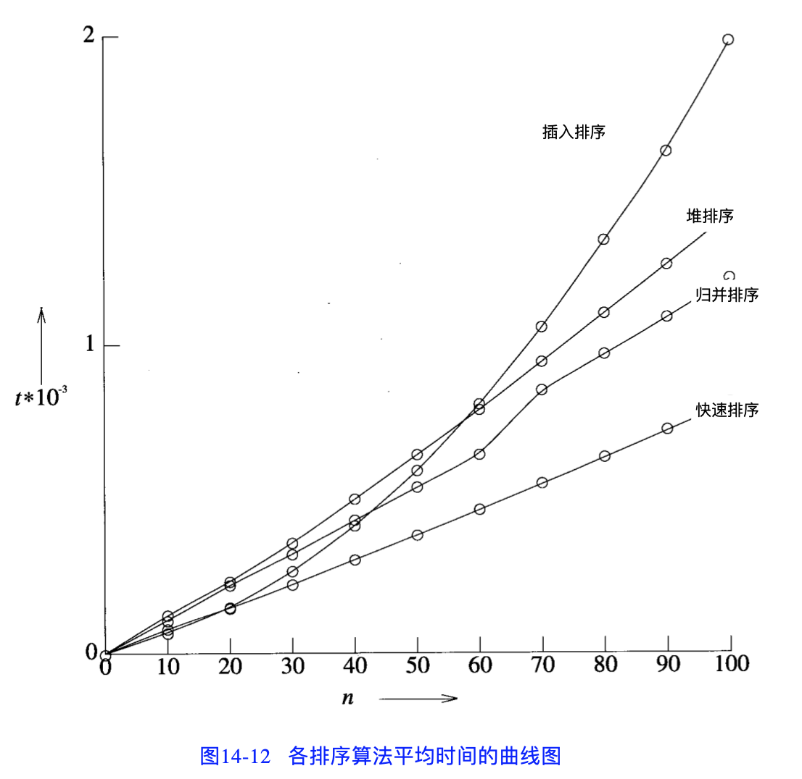

今天将多年前整理的一些排序算法捋一捋。先说个大概。

<!-- more -->

排序算法通常按照以下标准分类：

**1**. 依据待排序数列的大小 $n$ 计算时间复杂度（最差、平均及最好性能）。

* 一般而言，好的性能是 $O(nlogn)$，坏的性能是 $O(n^2)$。
* 对于一次排序，理想的性能是 $O(n)$；然而在平均上总是需要 $O(nlogn)$。

**2**. 存储器使用量（以及其他计算机资源的使用）

**3**. 稳定性：指的是某个排序算法会让原本有相同键值的记录维持相对次序。

* 如果一个排序算法是稳定的，当有两个相同键值的记录 R 和 S，且在原本数列中 R 出现在 S 之前，那么在排序过的数列之中，R 也将会在 S 之前。

 

# 稳定排序算法

* [冒泡排序](/2022/11/08/bubble-sort)
* [插入排序](/2022/11/12/insertion-sort)
* [基数排序](/2023/03/11/non-compare-sort#桶排序的改进：基数排序)
* [计数排序](/2023/03/11/non-compare-sort#计数排序)
* [桶排序](/2023/03/11/non-compare-sort#桶排序)
* [归并排序](/2023/02/25/merge-sort)
* 二叉排序树排序
* 图书馆排序

# 不稳定排序算法

* [直接选择排序](/2022/11/11/selection-sort)
* [快速排序](/2023/02/26/quick-sort)
* 希尔（shell）排序
* 堆排序

怎么记忆哪些是稳定算法？

* 时间复杂度复杂一些的（高级，包括快排、shell 排序、堆排序 —— 归并排序除外）都不稳定（选择排序也不稳定）；
* 时间复杂度简单一些的（低级，包括冒泡、插入、计数、基数）都稳定（归并排序也是稳定的）；
* 复杂算法中，归并排序是稳定排序；简单算法中，选择排序不稳定；
* 8 种稳定，4 种不稳定。

# 比较 v.s. 不比较

基于比较的排序（Comparison Sort）：通过对序列中的数据进行比较，确定数据的先后顺序。

包括：
* [直接选择排序](/2022/11/11/selection-sort)
* [冒泡排序](/2022/11/08/bubble-sort)
* [插入排序](/2022/11/12/insertion-sort)
* 堆排序
* [归并排序](/2023/02/25/merge-sort)
* [快速排序](/2023/02/26/quick-sort)

比较排序有着局限性：不能突破 $Ο(nlogn)$ 的复杂性下限。
* 简单证明：$N$ 个数有 $N!$ 个可能的全排列，即基于比较的排序算法的判定树有 $N!$ 个叶节点，比较次数最少为 $log(N!) = Ο(NlogN)$（斯特林公式）

相对应的，非比较排序有：
* [基数排序](/2023/03/11/non-compare-sort#桶排序的改进：基数排序)
* [计数排序](/2023/03/11/non-compare-sort#计数排序)
* [桶排序](/2023/03/11/non-compare-sort#桶排序)

非比较排序的局限性是：对排序元素之间差值的大小有限制。

# 算法性能

总结了个表格（n 为数据量大小）：

<table>
    <tr>
        <th rowspan="2">类别</th>
        <th rowspan="2">排序方法</th>
        <th rowspan="2">数据对象</th>
        <th rowspan="2">稳定性</th>
        <th colspan="3">时间复杂度</th>
        <th rowspan="2">空间复杂度</th>
    </tr>
    <tr>
        <th>平均情况</th>
        <th>最好情况</th>
        <th>最坏情况</th>
    </tr>
    <tr>
        <th rowspan="2">插入排序</th>
        <th>直接插入排序</th>
        <td>数组、链表</td>
        <td>☑️</td>
        <td>O(n2)</td>
        <td>O(n)</td>
        <td>O(n2)</td>
        <td>O(1)</td>
    </tr>
    <tr>
        <th>shell 排序</th>
        <td>数组</td>
        <td>✖️</td>
        <td>O(nlogn)</td>
        <td>O(n)</td>
        <td>O(nlogn)</td>
        <td>O(1)</td>
    </tr>
    <tr>
        <th rowspan="3">选择排序</th>
        <th rowspan="2">直接选择排序</th>
        <td>数组</td>
        <td>✖️</td>
        <td rowspan="2">O(n2)</td>
        <td rowspan="2">O(n2)</td>
        <td rowspan="2">O(n2)</td>
        <td rowspan="2">O(1)</td>
    </tr>
    <tr>
        <td>链表</td>
        <td>☑️</td>
    </tr>
    <tr>
        <th>堆排序</th>
        <td>数组</td>
        <td>✖️</td>
        <td>O(nlogn)</td>
        <td>O(nlogn)</td>
        <td>O(nlogn)</td>
        <td>O(1)</td>
    </tr>
    <tr>
        <th rowspan="2">交换排序</th>
        <th>冒泡排序</th>
        <td>数组</td>
        <td>☑️</td>
        <td>O(n2)</td>
        <td>O(n)</td>
        <td>O(n2)</td>
        <td>O(1)</td>
    </tr>
    <tr>
        <th>快速排序</th>
        <td>数组</td>
        <td>✖️</td>
        <td>O(nlogn)</td>
        <td>O(nlogn)</td>
        <td>O(n2)</td>
        <td>O(logn)</td>
    </tr>
    <tr>
        <th colspan="2">归并排序</th>
        <td>数组、链表</td>
        <td>☑️</td>
        <td>O(nlogn)</td>
        <td>O(nlogn)</td>
        <td>O(nlogn)</td>
        <td>O(n)</td>
    </tr>
    <tr>
        <td colspan="8"/>
    </tr>
    <tr>
        <th colspan="2">桶排序</th>
        <td>数组、链表</td>
        <td>☑️</td>
        <td>O(n+k)</td>
        <td>O(n+k)</td>
        <td>O(n2)</td>
        <td>O(n+k)</td>
    </tr>
    <tr>
        <th colspan="2">基数排序</th>
        <td>数组</td>
        <td>☑️</td>
        <td>O(nk)</td>
        <td>O(nk)</td>
        <td>O(nk)</td>
        <td>O(n+k)</td>
    </tr>
    <tr>
        <th colspan="2">计数排序</th>
        <td>数组、链表</td>
        <td>☑️</td>
        <td>O(n+k)</td>
        <td>O(n+k)</td>
        <td>O(n+k)</td>
        <td>O(n+k)</td>
    </tr>
</table>

<small>注：对于非比较排序来说，k 为“桶”的个数。</small>

再上个教材的图：

