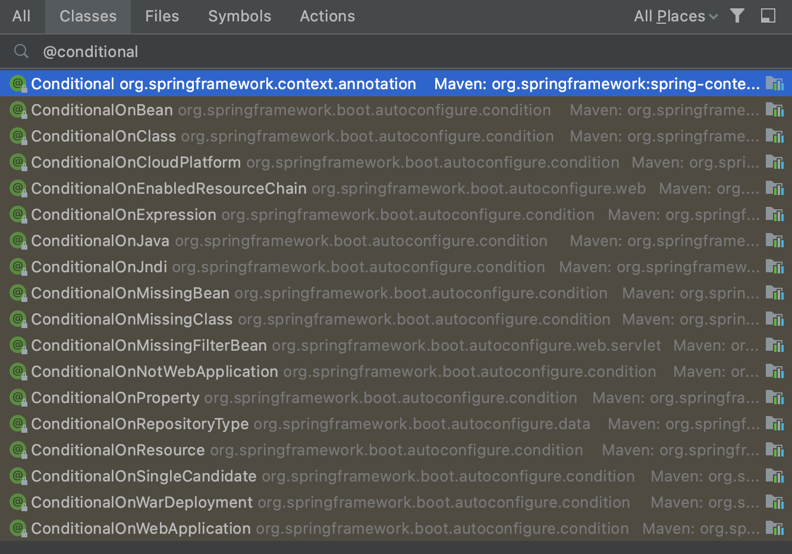

在 [Spring IoC 概览](/2021/12/05/spring-ioc/)中我们提到过，除了配置文件，Spring 还能通过注解进行 Bean 的依赖管理。

<!-- more -->

传统的 XML 注入 bean 存在以下缺点：
1. 如果所有内容都配置在 XML 文件中，长久以往配置文件将会十分庞大；如果按照需求拆分配置文件，那么 XML 文件又会变得很多，可维护性会降低；
2. 开发中 Java 和 XML 之间不断切换，是一件麻烦的事。

由此引入注解与 Bean 紧密结合，既大大减少了配置文件的体积，又增加了 Bean 的可读性和内聚性。

关于注解的配置也是在 Bean 的定义 XML 文件上，使用 `<context:annotation-config/>` 标记：

```xml
<?xml version="1.0" encoding="UTF-8"?>

<beans xmlns="http://www.springframework.org/schema/beans" 
    xmlns:xsi="http://www.w3.org/2001/XMLSchema-instance" 
    xmlns:context="http://www.springframework.org/schema/context" 
    xsi:schemaLocation="http://www.springframework.org/schema/beans 
            http://www.springframework.org/schema/beans/spring-beans-3.0.xsd 
            http://www.springframework.org/schema/context 
            http://www.springframework.org/schema/context/spring-context-3.0.xsd">

    <context:annotation-config/>
    <!-- bean definitions go here -->

</beans>
```

或者使用 `<context:component-scan base-package="xxx" />` 开启扫描功能：

```xml
<?xml version="1.0" encoding="UTF-8"?>

<beans ...>

    <context:component-scan base-package="xxx" />
    <!-- Spring 会自动扫描包 xxx 路径下的注解 -->

</beans>
```

以下篇幅介绍几个常见的 Spring 注解。

<br/>

# 非类级别的注解

包括修饰字段、构造函数和方法的注解们。


## @Required

应用于 bean 某个属性的 setter 中，标明该属性必须在配置文件 xml 中配置，且值不能为 null；否则容器会抛出 `BeanInitializationException`。

示例代码：

```java
public class Student {

    private Integer age;
    private String name;


    @Required
    public void setAge(Integer age) {  // age 不能为空
        this.age = age;
    }
    public Integer getAge() {
        return age;
    }

    @Required
    public void setName(String name) {  // name 不能为空
        this.name = name;
    }
    public String getName() {
        return name;
    }
}
```

示例配置：

```xml
<!-- encoding... -->
<beans ...>

    <context:annotation-config/>

    <!-- Definition for student bean -->
    <bean id="student" class="com.example.Student">
        <property name="name" value="Zara" />

        <!-- try without passing age and check the result -->
        <!-- <property name="age" value="11" /> -->
        <!-- result: 抛出 Property 'age' is required for bean 'student' 的异常 -->
    </bean>

</beans>
```

```sh
# 正常配置与输出：
Name : Zara
Age : 11
```

<br/>

## @Autowired

顾名思义，就是**自动装配**。能应用于 bean 中某个属性的 setter 方法、非 setter 方法、构造函数和属性上；这样就可以更精确地控制在何处和如何进行自动装配。

@Autowired 默认按 byType 的方式，在容器里查找匹配的 bean；当 Spring 容器中**有且只有一个匹配**的 bean 时，完成自动装配。

```xml
<!-- 配置 -->
<!-- encoding... -->
<beans ...>

    <context:annotation-config/>

    <!-- Definition for textEditor bean without constructor-arg or property --> 
    <bean id="textEditor" class="com.example.TextEditor">
    </bean>

    <!-- Definition for spellChecker bean -->
    <bean id="spellChecker" class="com.example.SpellChecker">
    </bean>

</beans>
```

我们可以看到，上面的配置文件中没有配置任何的 `constructor-arg` 或者 `property`，这就属于非 xml 配置的 IoC。

示例代码：

```java
// 1. setter 的 @Autowired
public class TextEditor {

    private SpellChecker spellChecker;


    @Autowired  // 默认执行 byType 自动装配
    public void setSpellChecker(SpellChecker spellChecker) {
        this.spellChecker = spellChecker;
    }

    // getter 可以不需要了

    public void spellCheck() {
        spellChecker.checkSpelling();
    }
}
```

```java
// 2. 属性上的 @Autowired
public class TextEditor {

    @Autowired  // 省去了 setter，不会为了实现依赖注入导致暴露不该暴露的接口
    private SpellChecker spellChecker;


    public TextEditor() {
        System.out.println("Inside TextEditor constructor.");
    }

    // getter 可以不需要了

    public void spellCheck(){
        spellChecker.checkSpelling();
    }
}
```

```java
// 3. 构造函数上的 @Autowired
public class TextEditor {

    private SpellChecker spellChecker;


    @Autowired
    public TextEditor(SpellChecker spellChecker){
        System.out.println("Inside TextEditor constructor.");
        this.spellChecker = spellChecker;
    }

    public void spellCheck(){
        spellChecker.checkSpelling();
    }
}
```

```java
// 4. 任意方法中使用 @Autowired 注解，和多参数注入
@Autowired
public void prepare(SpellChecker spellChecker, WordCounter counter) {
    this.spellChecker = spellChecker;
    this.wordCounter = counter;
}

// 另外，也可使用 @Autowired 注入 Set、Map 等类型
```

要注意的是，如果需要被注入的 Bean 里面保留着依赖的 `<property>`，Spring 会按照**配置文件（XML）优先**的原则进行依赖注入，容器会寻找对应依赖中的 getter / setter。  
这个时候，如果依赖的 .java 文件标记了 @Autowired 而没有了 getter / setter，bean 的初始化就会报错。

`@Autowired` 默认表明依赖是必须的，相当于标记了 `@Required`。如果 bean 找不到而允许空值，不抛出异常，可使用 `@Autowired(required=false)` 关闭默认行为。

```java
public class Student {

    @Autowired(required=false)
    private Integer age;

    @Autowired  // 还是需要值的，不然就抛 BeanCreationException 了
    private String name;

    ...
}
```

<br/>

## @Qualifier

指定注入 Bean 的具体名称（name），能够从多个匹配的相同类型（type）的 bean 中找出想要装配的某个 bean。

与 `@Autowired` 结合使用。

示例配置：

```xml
<!-- encoding... -->
<beans ...>

    <context:annotation-config/>

    <!-- Definition for profile bean -->
    <bean id="profile" class="com.example.Profile">
    </bean>

    <!-- Definition for student1 bean -->
    <bean id="student1" class="com.example.Student">
        <property name="name" value="Zara" />
        <property name="age" value="11"/>
    </bean>

    <!-- Definition for student2 bean -->
    <bean id="student2" class="com.example.Student">
        <property name="name" value="Nuha" />
        <property name="age" value="2"/>
    </bean>

</beans>
```

使用代码示例：

```java
public class Profile {

    @Autowired
    @Qualifier("student1")  // 指定了想要的 bean 是 student1
    private Student student;

    ...
}
```

不仅如此，同一个接口类的两个实现类 bean 也是通过这样的方法匹配想要的 bean：

定义一个 ICar 接口：

```java
public interface ICar {

    public String getCarModel();
}
```

两个实现类：

```java
public class Q5 implements ICar {

    public String getCarModel() {
        return "Q5";
    }
}
```

```java
public class A3 implements ICar {

    public String getCarModel() {
        return "A3";
    }
}
```

工厂类：


```java
public class AudiFactory {

    @Autowired
    private ICar car;

    ...
}
```

配置：

```xml
<!-- encoding... -->
<beans ...>

    <context:annotation-config/>

    <bean id="audiFactory" class="com.example.AudiFactory">
    </bean>

    <bean id="q5" class="com.example.Q5">
    </bean>
    <bean id="a3" class="com.example.A3">
    </bean>

</beans>
```

调用 audiFactory 的时候会抛出 `NoSuchBeanDefinitionException`：说 No unique bean of type ICar is defined。

因此需要删除其中一个 bean 的定义，或者通过 @Qualifier 指明是哪一个 bean。

<br/>

## @Resource

和 @Autowired 非常相似，作用于 setter 上，使用 name 属性，默认遵循 byName 语义自动装配。
* @Resource 没有指定任何内容，默认 byName 匹配，找不到再 byType；
* 如果指定了 name 或者 type，则 byType 匹配；
* 如果同时指定了 name 和 type，则根据指定的 name 和 type 去匹配，任何一个不匹配都会报错。

```java
public class TextEditor {

    private SpellChecker spellChecker;


    @Resource(name= "spellChecker")
    public void setSpellChecker(SpellChecker spellChecker) {
        this.spellChecker = spellChecker;
    }

    public SpellChecker getSpellChecker() {
        return spellChecker;
    }

    public void spellCheck() {
        spellChecker.checkSpelling();
    }
}
```

注：
* @Resource 和 @Autowired 功能是一样的，都需要配置 DI 注解解析器
* @Resource 是 JavaEE 的注解，默认按名称（name）注入；@Autowired 是 Spring 的注解，默认按类型（type）注入

因此建议使用 @Resource 来减少与 Spring 之间的耦合。

<br/>

## @PostConstruct & @PreDestroy

`@PostConstruct`：相当于 xml 配置中的 init-method；  
`@PreDestroy`：相当于 xml 配置中的 destroy-method。

```java
public class HelloWorld {

    private String message;

    ... // getters & setters

    @PostConstruct
    public void init() {
        System.out.println("Bean is going through init.");
    }

    @PreDestroy
    public void destroy() {
        System.out.println("Bean will destroy now.");
    }
}


// 调用 HelloWorld bean 前仍需给 context 注册一个 shutdown hook
ctx.registerShutdownHook();
```

配置：

```xml
<!-- encoding... -->
<beans ...>

    <context:annotation-config/>

    <bean id="helloWorld" class="com.example.HelloWorld">
        <property name="message" value="Hello World!"/>
    </bean>

</beans>
```

使用注解可以指定多个初始化 / 销毁方法，而配置文件只能分别指定一个。

添加注解后，在配置文件中，该 bean 的 init-method 和 destroy-method 属性可无需配置。

如配置文件添加了 init-method 和 destroy-method：
* 如配置的方法相同，则两者行为相同，两者互相覆盖；
* 如配置方法不同，则**先执行注解**的方法，再执行配置的方法。

@Resource、@PostConstruct 和 @PreDestroy 都属于 JavaEE 的 JSR-250（Java Specification Request）注释。

<br/>

# 构造 IoC 容器的注解

添加了这些注解，XML 配置文件可以得到真正的简化，做到“无配置”地依赖注入。

## @Configuration

表明该类可作为 Spring IoC 容器用来管理 bean 的配置类。  
标记了之后就不需要额外的 XML 进行配置了。

## @Bean

@Bean 是属于标记在方法上面的注解。  
以此手动创建一个 Spring Bean 注册到 Spring context。

结合两个注解来看一段示例代码：

```java
@Configuration
public class HelloWorldConfig {

    @Bean
    public HelloWorld helloWorld() {  // 方法名作为 bean 的 id
        return new HelloWorld();  // 作为单例注册进 Spring context
    }
}


// 调用：
ApplicationContext ctx1 = new AnnotationConfigApplicationContext(HelloWorldConfig.class);
HelloWorld helloWorld1 = ctx1.getBean(HelloWorld.class);

// 或：
ApplicationContext ctx2 = new AnnotationConfigApplicationContext();
ctx2.register(AppConfig.class, OtherConfig.class, HelloWorldConfig.class, ...);
HelloWorldConfig config = ctx2.getBean(HelloWorldConfig.class);
HelloWorld helloWorld2 = config.helloWorld();

Assert.assertEquals(helloWorld1, helloWorld2);  // true
```

以上代码等同于以下配置：

```xml
<beans>
    <bean id="helloWorld" class="com.example.HelloWorld" />
</beans>
```

@Configuration 源码：

```java
@Target({ElementType.TYPE})
@Retention(RetentionPolicy.RUNTIME)
@Documented
@Component
public @interface Configuration {
    @AliasFor(
        annotation = Component.class
    )
    String value() default "";

    boolean proxyBeanMethods() default true;
}
```

以上代码说明 Spring Configuration 配置类也是 Spring 的一个组件。


bean 的依赖性可以通过构造函数注入接收：

```java
@Configuration
public class AppConfig {

    @Bean
    public Foo foo() {
        return new Foo(bar());
    }

    @Bean
    public Bar bar() {
        return new Bar();
    }
}
```

@Bean 注解可指定任意初始化和销毁的回调，也可指定 bean 的作用域：

```java
@Configuration
public class AppConfig {

    @Bean(initMethod = "init", destroyMethod = "cleanup")
    @Scope("prototype")
    public Foo foo() {
        return new Foo();
    }
}
```

其中 `@Scope` 用来配置 Spring bean 的作用域：

* `singleton` 为单例；
* `prototype` 为原型，每次都会 new 一个新的对象出来。


## @Import

根据传入的 class 确定类的全路径名，将其加载进容器中。

```java
// 一个配置类：
@Configuration
public class ConfigA {

    @Bean
    public A a() {
        return new A();
    }
}
```

```java
// 另一个配置类：
@Configuration
@Import(ConfigA.class)  // 从 ConfigA 加载关于 @Bean 的定义
public class ConfigB {

    @Bean
    public B a() {
        return new A();
    }
}
```

通过 context 初始化的时候，指定 ConfigB.class 即可获得 bean A 和 B。

以下代码会得到两个不同的 Bean：

```java
@Import(A.class)
@Configuration
public class ConfigA {

    @Bean
    public A a() {
        return new A();
    }
}
```

Import 进容器的是 com.xxx.A 全路径名，而 @Bean 引入容器的是 a；虽然它们是同一个类，但是是**两个 bean**。


## @ConditionalXX

顾名思义，条件注解。被标记了的类或方法要满足了一定的条件之后，相应的 bean 才会被注册进容器中。

Spring 中定义了很多条件注解：



在以下的实例代码中，调用 getBean() 获取 car 的时候会报错：

```java
@Bean
@ConditionalOnBean(name = "engine")
public Car car() {
    Car car = new Car();
    car.setBrand("Honda");
    car.setEngine(engine());
    car.setModel("Civic");
    car.setIteration(11);
    return car;
}


public Engine engine() {
    Engine engine = new Engine();
    engine.setModel("earth dream");
    engine.setModel("L15C8");
    return engine;
}
```

因为 car 不能被 Spring 注册进容器中，即使通过了 engine() 传入了所需变量，但是所依赖的 bean（`@ConditionalOnBean(name = "engine")`）没被初始化，所以 car 初始化失败。

在实际应用中可利用 @ConditionalXX **选择性地注册 bean**（比如不同系统用到的不同数据库 driver），减轻 Spring 应用负担。

<br/>

## 其它创建对象的注解

这些注解都是标记在类上的，用于表示 Spring 中的组件。

**`@Component`**

将某个 Java 类标记为 bean，是所有受 Spring 管理组件的通用形式。

Spring 组件扫描机制能将标记了 @Component 的类拉入应用程序中。

**`@Controller`**

将 Java 类标记为 Spring Web MVC 控制器（控制层 Controller 组件）。

同样，被标记的 bean 会被自动导入到 IoC 容器中。

**`@Service`**

是 @Component 注解的特化，用于标记业务层的组件。

可在服务层类中使用 @Service 而不是 @Component，它不会对 @Component 注解提供任何其他行为。

**`@Repository`**

也是 @Component 注解的特化，用于标记持久层的组件（DAO 类）。

被标记之后，IoC 容器会将该 DAO 导入，并使未经检查的异常有资格转换为 Spring DataAccessException。


## 其它

`@ComponentScan`：扫描指定包下的所有 Spring 组件。

`@Primary`：手动创建 Spring Bean 时，指定当前为默认注入的 bean。

`@Lazy`：表示延迟注入 bean。
