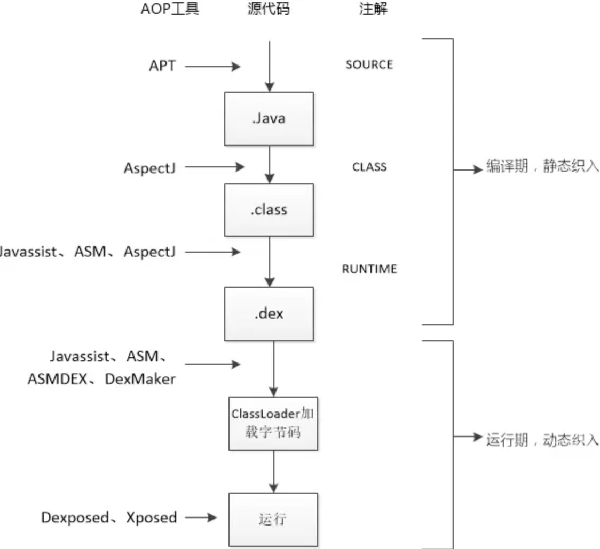
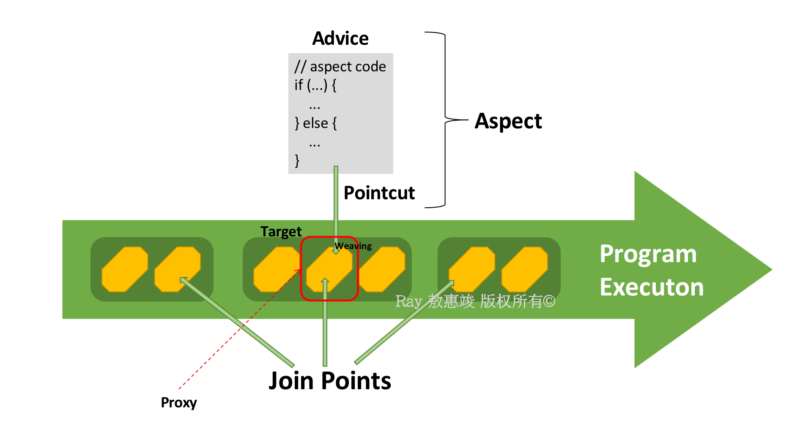
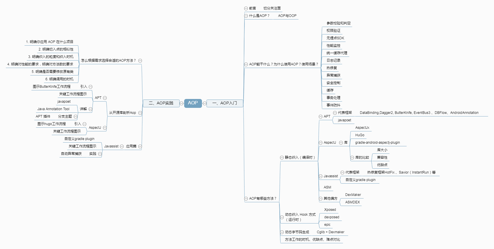
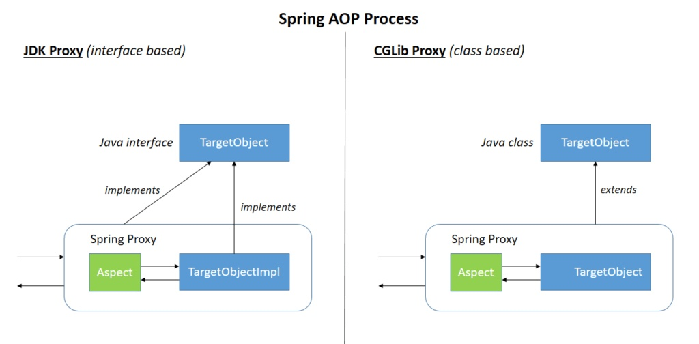

同样，AOP 不仅仅是针对 Spring 才能应用的逻辑。

<!-- more -->

# AOP 概述

我们知道，OOP 可以提供复杂而纵深的继承体系，但是对于一些非继承关系的横向加强功能并不容易实现。

比如，当很多其它的类的方法都调用某一个类的成员方法时，需要这些类都持有该类的对象，且这些类的所有对象都需要显式地依赖该对象。

举个例子：

```java
public class A {
    TheOne theOne;
    public void setTheOne(TheOne theOne) {this.theOne = theOne;}
    public void aDoSth() {
        theOne.doSth();
        ...  // business
    }
}

public class B {
    TheOne theOne;
    public void setTheOne(TheOne theOne) {this.theOne = theOne;}
    public void bDoSth() {
        theOne.doSth();
        ...  // business
    }
}

public class TheOne {
    public void doSth();
}
```

A 和 B 两个类中的 doSth() 部分代码几乎是完全重复的，而且与其业务并不相关联。  
有的时候虽然这种代码并不多，但是业务类膨胀了之后，万一都需要用到这一段逻辑，反复添加这种与业务不相关的代码也是一件比较烦的事。

能否用某种方式实现同样功能，而不需要开发者写重复的代码逻辑？

<br/>

由此，我们提出了 **A**spect-**O**riented **P**rogramming，**面向切面编程**的概念，是一种对 OOP 纵向结构丰富而横向结构缺失的补充。

在 AOP 思想中，应用的功能分为两类：
1. 核心业务（核心关注点），如登陆、增加数据、删除数据
2. 周边功能（横切关注点），如性能统计、日志、事务管理等

周边功能，或者说非核心功能在 AOP 中被定义为切面；核心业务功能与切面功能分别独立开发，然后“编织”到一起，就是 AOP。

## AOP 实现基础

AOP 的实现主要有两个方向：

1. 使用特殊的编译器，将这些功能代码在编译阶段“织入”源代码，运行时代码会被切入到类的指定方法、指定位置。
2. 利用**动态代理**在运行时将这些功能代码切入。

Java 提供了两种动态代理的方法：

**JDK 代理**
* 通过**反射**接收被代理的类
* 被代理的目标类需要实现一个接口（业务相关的接口），没有在该接口定义的方法不能被代理
* Spring AOP 默认采用此方式进行代理
* 只有被代理的类没有实现接口时：才会被切换到 CGLib 代理

**CGLib**（**C**ode **G**eneration **Lib**rary）代理
* 需要 CGLib 支持
* 相当于运行时动态创建一个被代理的类的非继承子类（组合）
* 也称为子类代理
* final 类无法使用 CGLib 作为动态代理

不同的 AOP 工具以及它们对应的织入时机如下：




## AOP 相关概念

既然是“面向切面编程”，我们先来聊聊“切面”。

<big>**切面**</big>（**Aspect**）是一个总的概念，阐述的是在什么时候（When），什么地方（Where）执行什么样的代码（What）。

切面由以下几个概念点组成：

**1**. <big>**增强 Advice**</big>

Advice 定义了切面当中的方法，以及声明了 Advice 方法在目标（Target）业务层的执行位置。  
也就是说，Advice 定义好了 What（切入后进行的行为）和 When（切面切入时机）。

比如上例中的 `TheOne.doSth()` 就可以看作是一个可增强的点（Advice），它在类 A 和 B 里面执行的时机就是 “When”。 

针对一个 Advice 方法（What），合理的切入时机（When）包括：
* `@Before`: 前置通知，方法调用前
* `@After`: 后置通知，方法执行后，不考虑返回
* `@AfterReturning`: 返回通知，方法返回后
* `@AfterThrowing`: 异常通知，方法抛出异常后
* `@Around`: 环绕通知，方法前以及方法后

上述的切入时机叫做**连接点** **Join Point**，属于程序（业务流）中的概念，说明在业务流中**可以**对哪些方法进行拦截，拦截后怎么处理。

具体到代码中的话，可以将 Join Point 理解为目标对象中的具体方法。

**2**. <big>**切入点 Pointcut**</big>

切入点定义了 Where，即选择在某一个**确定的连接点 Join Point** —— 确定在哪些类、哪些方法上进行切入。

在确定切入点的时候，允许定义具体的方法名、类名，或者使用正则匹配等方法。

因此连接点 Join Points 指的是程序执行流中**所有**可以被选择做增强的点；而切入点 Pointcut 指的是从所有可以的 Join Points 中确定**具体**要拦截的某个业务点。

在 Advice 与 Pointcut 配合下，切面就成型了。程序就知道切入的 When、Where 和 What，即什么时机，什么地方做什么样的增强。



除了切面的概念之外，其它概念包括：

<big>**织入 Weaving**</big>

织入指的是根据切面的定义，将相应的 advice 加入到切面 pointcut 指定的 join points，并创造出代理对象的过程。

织入由代理完成。

<big>**目标对象 Target**</big>

被一个或多个切面增强的对象，因此也被称为“被增强对象”。它永远是一个被代理对象。

<big>**引入 Introduction**</big>

相对于切面只是针对指定方向的增强，引入可以针对类进行增强，为其动态添加**新的方法或域**。


## 常见应用

* 权限控制（鉴权）
* 日志
* 参数校验
* 缓存、调试、性能检测
* 一定程度的事务处理
* ...


应用 AOP 的目的：
* 将与业务无关，却为业务所共同调用的逻辑或责任（事务处理、日志管理、鉴权、...）封装起来
* 可以集中处理某一关注点/横切逻辑，并且很方便地添加/删除关注点
* 便于减少系统重复代码，降低模块间耦合度，利于可拓展性和可维护性

在别处找了一个 AOP 的思维导图参考一下：




# Spring AOP

Spring AOP 使用纯 Java 实现，不需要专门的编译过程和类加载器。

实现原理：运行时通过**代理**方式向目标类织入增强代码。

主要的实现方向有两个：
* 接口 + 实现类：采用 JDK 动态代理 Proxy
* 仅实现类：使用 CGLib 字节码增强



Spring AOP 和 AspectJ 两种 AOP 方向的比较：

| Spring AOP | AspectJ  |
| ---------- | -------- |
| 纯 Java 实现            | 使用 Java 语言的扩展实现 |
| 不需要单独的编译过程      | 除非设置 LTW，否则需要 AspectJ 编译器（ajc）       |
| 只能使用运行时织入        | 运行时织入不可用。<br/>支持编译时、编译后和加载时织入 |
| 功能不强：只支持方法级织入 | 更强大：可编织字段、方法、构造函数、静态初始值设定项、final 类/方法等    |
| 只能在由 Spring 容器管理的 bean 上实现 | 可在所有域对象上实现 |
| 仅支持方法执行切入点      | 支持所有织入点 |
| 代理是由目标对象创建的，并且切面应用在这些代理上 | 执行应用程序（运行时）前，各方面直接在代码中进行织入 |
| 比 AspectJ 慢多了       | 更好的性能    |
| 易于学习和应用           | 相对于 Spring AOP 更复杂 |

Spring 2.0+ 之后引入了对 AspectJ 的支持。

下面说一下几种不同的 AOP 实现方式：

<br/>

## 手动方式（原理代码）

下面基于 Spring AOP 实现原理手动实现**JDK 动态代理**和 **CGLib** 两种方式的 AOP，这是没有 Spring 侵入的实现方式。

有目标类 Target：

```java
public interface UserService {
    // 这些都是 join points
    public void addUser();
    public void updateUser();
    public void deleteUser();
}
```

和切面类 Aspect：

```java
public class MyAspect {  // 该切面类属于环绕通知

    public void before() {
        System.out.println("BEFORE");
    }

    public void after() {
        System.out.println("AFTER");
    }
}
```

<br/>

**1**. JDK 动态代理。要求目标类为接口 + 实现类

```java
import java.lang.reflect.Proxy;  // 实现方式的核心
...

public class MyBeanFactory {

    public static UserService createService() {

        // 目标类
        final UserService userService = new UserServiceImpl();
        // 切面类
        final MyAspect myAspect = new MyAspect();

        // 代理类（核心）
        UserService proxyService = (UserService) Proxy.newProxyInstance(
                MyBeanFactory.class.getClassLoader(),  // 提供类加载器将类加载到内存
                userService.getClass().getInterfaces(),  // 获取代理类需要实现的所有接口
                new InvocationHandler() {  // 处理类（核心）。代理类每一个方法执行时将调用一次 invoke()

                    @Override
                    public Object invoke(Object proxy,  // 代理对象
                                         Method method,  // 目标类对象当前执行的方法对象（反射）
                                         Object[] args  // 方法实参
                                        ) throws Throwable {
                        // 前执行
                        myAspect.before();

                        // 执行目标类的方法
                        Object obj = method.invoke(userService, args);

                        // 后执行
                        myAspect.after();

                        return obj;
            }
        });
        return proxyService;
    }
}
```

**2**. CGLib 字节码增强：只有实现类

```java
import org.springframework.cglib.proxy.Enhancer;  // CGLib 实现核心
...

public class MyBeanFactory {

    public static UserService createService() {

        // 目标类
        final UserService userService = new UserServiceImpl();
        // 切面类
        final MyAspect myAspect = new MyAspect();

        // 代理类，以此创建目标类的子类，无需接口
        Enhancer enhancer = new Enhancer();
        enhancer.setSuperclass(userService.getClass());  // 确定父类
        // 设置回调函数
        enhancer.setCallback(new MethodInterceptor() { // 等效于 JDK 中的 InvocationHandler 接口

            // intercept 等效于 JDK 中的 invoke
            @Override
            public Object intercept(Object proxy, Method method, Object[] args,  // 参数和 JDK 动态代理实现时差不多
                        MethodProxy methodProxy  // 代理对象当前执行的方法对象
                        ) throws Throwable {

                // 前
                myAspect.before();

                // 执行目标类的方法
                Object obj = method.invoke(userService, args);

                // 或：执行代理类的父类，即目标类（目标类和代理类是父子关系）
                // Object obj = methodProxy.invokeSuper(proxy, args);

                // 后
                myAspect.after();

                return obj;
            }
        });
        // 创建代理
        UserServiceImpl proxyService = (UserServiceImpl) enhancer.create();

        return proxyService;
    }
}
```


## 半自动

利用切面实现介入器 MethodInterceptor，并从 Spring 容器手动获取代理对象。

```java
import org.springframework.cglib.proxy.MethodInterceptor;
...

// 切面实现 MethodInterceptor
public class MyAspect implements MethodInterceptor {

    @Override
    public Object invoke(MethodInvocation mi) throws Throwable {
        System.out.println("before");

        // 手动执行目标方法
        Object obj = mi.proceed();

        System.out.println("after");

        return obj;
    }
}
```

配置文件如下：
```xml
<!-- encoding... -->
<beans ...>

    <!-- 目标类 -->
    <bean id="userService" class="com.example.UserServiceImpl"/>
    <!-- 切面类 -->
    <bean id="myAspect" class="com.example.MyAspect"/>

    <!-- 创建代理类
        * 通过工厂 bean ProxyFactoryBean 创建，底层调用 getObject() 返回特殊代理对象
            - interfaces：确定接口
                通过<array>可以设置多个值
                只有一个值：value=""
            - target：确定目标类
            - interceptorNames：增强切面类的名称
            - optimize：强制使用 CGLib
                <property name="optimize" value="true"/>
        * ProxyFactoryBean 的底层机制
            - 如目标有接口：采用 JDK 动态代理
            - 如没有接口：采用 CGLib 字节码增强
            - 如声明 optimize=true：强制使用 CGLib
    -->
    <bean id="proxyService" class="org.springframework.aop.framework.ProxyFactoryBean">
        <property name="interfaces" value="com.example.UserService"/>
        <property name="target" ref="userService"/>
        <property name="interceptorNames" value="myAspect"/>  <!-- 定义切面 -->
    </bean>

</beans>
```

MyAspect 的 AOP 在以下的调用中就能实现：

```java
// 调用：
UserService userService = (UserService) applicationContext.getBean("proxyService");
userService.addUser();
```


## 全自动

大体的步骤如下：
1. 从 Spring 容器获得目标类（target）
2. 通过配置文件配置 AOP
3. Spring 自动生成代理

配置文件：

```xml
<!-- encoding... -->
<beans ...
    xsi:schemaLocation= "http://www.springframework.org/schema/aop
    http://www.springframework.org/schema/aop/spring-aop-3.0.xsd">

    <!-- Definition for beans -->
    <bean name="target" class="service.target" />

    <bean id="someAspect" class="aspect.someAspect"/>

    <!-- 配置 AOP -->
    <aop:config>
    <!-- 如配置 proxy-target-class=“true”：使用 CGLib 代理 -->

        <!-- where: 在哪些地方（包.类.方法）做增强 -->
        <aop:pointcut id="someCutpoint"
                    expression="execution(* target.doSomething.*(..))"/>  <!--  声明切入点 -->
        <!-- 第一个 *：返回值任意
             接下来：包.类名.方法名.(参数) -->

        <!-- what: 做什么增强 -->
        <aop:aspect id="aspectDemo" ref="someAspect">  <!-- 声明切面 -->

            <!-- when: 在什么时机（方法前/后/前后） -->
            <aop:around pointcut-ref="someCutpoint" 
                    method="someMethod"/>  <!-- 这里的时机是：方法前后（around）-->
        </aop:aspect>

        <!-- 特殊的切面，只有一个通知和一个切入点 -->
        <aop:advisor advice-ref="someAspect" pointcut-ref="someCutpoint"/> 
    </aop:config>

</beans>
```

另外还需要在 CLASSPATH 使用相关 AspectJ 库文件。

AOP 切面声明参考：

```xml
<beans ...>

    <aop:config>

        <aop:aspect id="myAspect" ref="aBean">
            <aop:pointcut id="someBusinessServiceMethod" expression="execution(* com.xyz.myapp.service.*.*(..))"/>

            <!-- a before advice definition -->
            <aop:before pointcut-ref="someBusinessServiceMethod" method="doRequiredTask"/>

            <!-- an after advice definition -->
            <aop:after pointcut-ref="someBusinessServiceMethod" method="doRequiredTask"/>

            <!-- an after-returning advice definition -->
            <!--The doRequiredTask method must have parameter named retVal -->
            <aop:after-returning pointcut-ref="someBusinessServiceMethod" returning="retVal" method="doRequiredTask"/>

            <!-- an after-throwing advice definition -->
            <!--The doRequiredTask method must have parameter named ex -->
            <aop:after-throwing pointcut-ref="someBusinessServiceMethod" throwing="ex" method="doRequiredTask"/>

            <!-- an around advice definition -->
            <aop:around pointcut-ref="someBusinessServiceMethod" method="doRequiredTask"/>

            ...
        </aop:aspect>
    </aop:config>

    ...
</beans>
```

使用的时候就可以：

```xml
<beans ...>
    ...
    <bean id="aBean" class="..."> ... </bean>

</beans>
```

这样就免掉了 AOP 的 Java 代码。


## 基于 AOP 的 AspectJ：注解配置 AOP

需要在配置文件中添加这么一行：

```xml
<!-- 新增如下配置： -->
<aop:aspectj-autoproxy/>
```

工程中再声明一个增强：

```java
import org.aspectj.lang.annotation.Aspect; 
import org.aspectj.lang.annotation.Pointcut; 
import org.aspectj.lang.annotation.Before; 
import org.aspectj.lang.annotation.After; 
import org.aspectj.lang.annotation.AfterThrowing; 
import org.aspectj.lang.annotation.AfterReturning; 
import org.aspectj.lang.annotation.Around; 


@Aspect
public class Logging {

    /** 
     * Following is the definition for a pointcut to select 
     * all the methods available. So advice will be called 
     * for all the methods. 
     */ 
    @Pointcut("execution(* com.tutorialspoint.*.*(..))") 
    private void selectAll() {}  // 此处为 pointcut signature

    /** 
     * This is the method which I would like to execute 
     * before a selected method execution. 
     */ 
    @Before("selectAll()") 
    public void beforeAdvice() { 
        System.out.println("Going to setup student profile."); 
    }
    /**
     * 注：注解的值可以为 pointcut 表达式
     * @Before("execution(* com.tutorialspoint.*.*(..))")
     */ 

    /**
     * This is the method which I would like to execute
     * after a selected method execution.
     */ 
    @After("selectAll()") 
    public void afterAdvice() { 
        System.out.println("Student profile has been setup."); 
    } 

    /**
     * This is the method which I would like to execute
     * when any method returns.
     */ 
    @AfterReturning(pointcut = "selectAll()", returning="retVal")
    public void afterReturningAdvice(Object retVal) { 
        System.out.println("Returning:" + retVal.toString() );
    } 

    /**
     * This is the method which I would like to execute
     * if there is an exception raised by any method.
     */ 
    @AfterThrowing(pointcut = "selectAll()", throwing = "ex") 
    public void AfterThrowingAdvice(IllegalArgumentException ex) { 
        System.out.println("There has been an exception: " + ex.toString()); 
    } 
}
```
标记好注解之后，在配置文件只需要添加 aspect bean 的定义即可。

声明参考：

```java
@Before("someBusinessServiceMethod()")
public void doBeforeTask() {
    ...
}

@After("someBusinessServiceMethod()")
public void doAfterTask() {
    ...
}

@AfterReturning(pointcut = "someBusinessServiceMethod()", returning="retVal")
public void doAfterReturnningTask(Object retVal) {
    // you can intercept retVal here. 
    ...
}

@AfterThrowing(pointcut = "someBusinessServiceMethod()", throwing="ex")
public void doAfterThrowingTask(Exception ex) {
    // you can intercept thrown exception here. 
    ... 
}

@Around("someBusinessServiceMethod()")
public void doAroundTask() {
    ...
}
```

Spring AspectJ 是通过 `AnnotationAwareAspectJAutoProxyCreator` 实现的。

其本质上是一个 BeanPostProcessor，父类为 AbstractAutoProxyCreator。  
给一个类中的某个方法设置了切面之后，这个类最终需要生成一个代理对象，再放进 bean 缓存池中。
