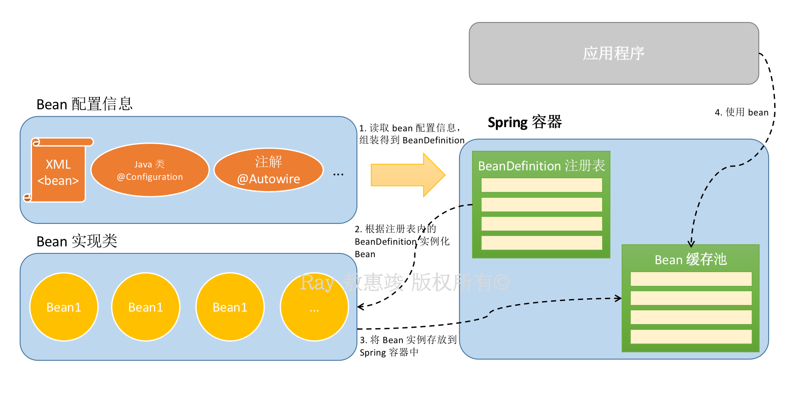
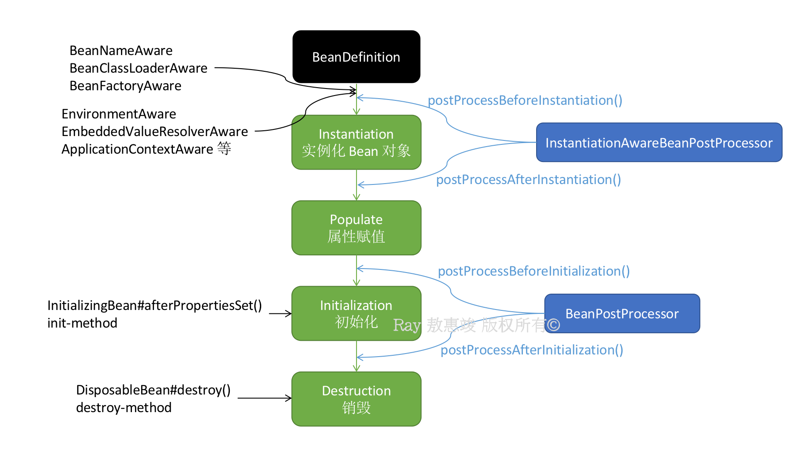
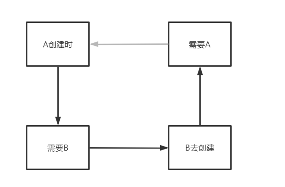
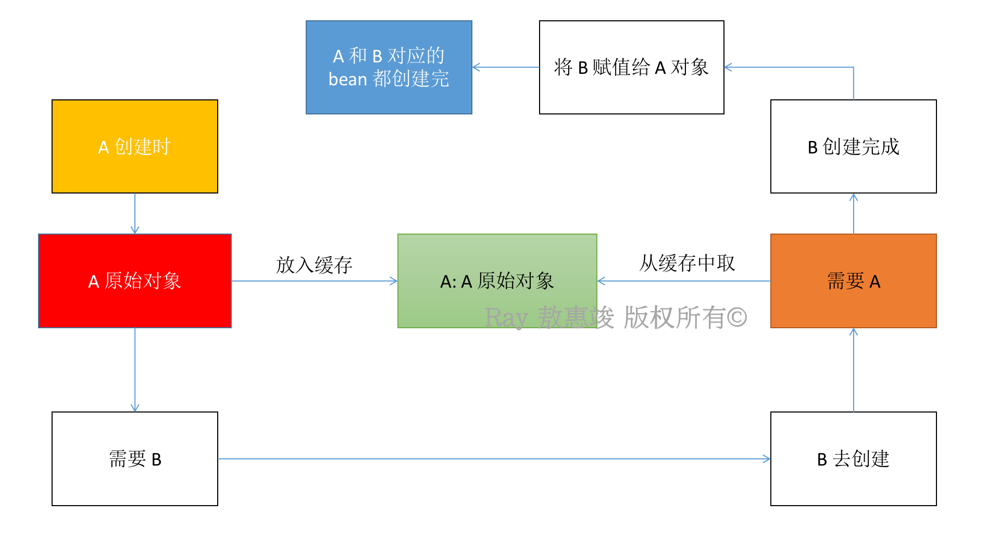
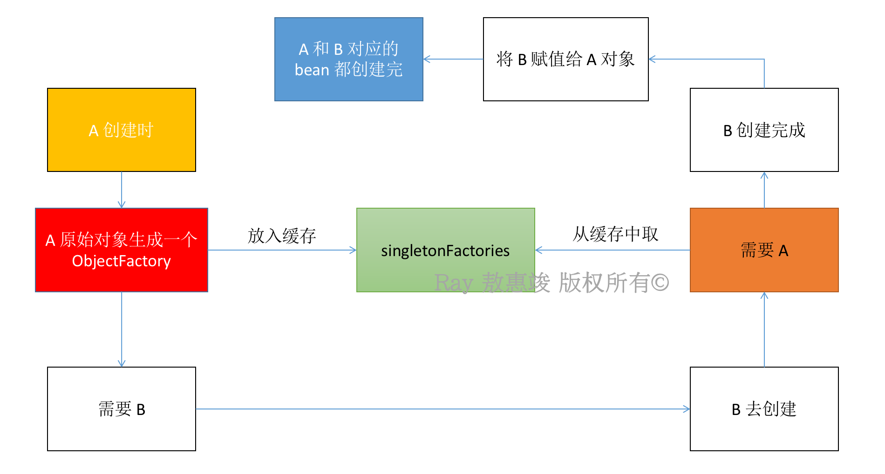

Bean 是 Spring 应用中的核心组成部分，通过 Spring IoC（多数是依赖注入）容器被实例化、组装和管理。

<!-- more -->

# Spring Bean 的属性

| 属性               | 描述   |
| -------------     | ----- |
| `class`           | 指定创建 bean 的类，使用全限定名 |
| `id`              | bean 唯一的标识符。Spring 通过 id 对 bean 进行配置和管理 |
| `name`            | 可与 id 一起参与 Spring 对 bean 的管理。bean 可被指定多个名称 |
| `scope`           | 设定 bean 实例的作用域，共有 5 种类型：<br/><li/>singleton（默认值）<br/><li/>prototype<br/><li/>request<br/><li/>session<br/><li/>global session |
| `constructor-arg` | `<bean>` 的子标签（子元素），使用该元素传入构造参数进行实例化。<br/>该元素中，`index` 属性指定构造参数的序号，`type` 属性指定构造参数的类型，ref 表示对其他 bean 的引用。 |
| `property`        | `<bean>` 的子标签（子元素），调用 bean 实例中的 setter 完成赋值，完成依赖注入；可用属性跟 `constructor-arg` 相同。 |
| `autowire`        | 确定 bean 的自动装配模式 |
| `lazy-init`       | 将 bean 的初始化延迟到它第一次被请求时，而不是启动 IoC 容器的时候 |
| `init-method`     | 定义了容器设置好 bean 的属性值后，开始初始化 bean 时执行的 callback |
| `destroy-method`  | 定义了 bean 被容器移除之后的 callback |
| `parent`          | 指定要继承的 bean |

配置文件参照：

```xml
<?xml version="1.0" encoding="UTF-8"?>
<beans xmlns="http://www.springframework.org/schema/beans" 
      xmlns:xsi="http://www.w3.org/2001/XMLSchema-instance" 
      xsi:schemaLocation="http://www.springframework.org/schema/beans http://www.springframework.org/schema/beans/spring-beans-3.0.xsd">

    <!-- A simple bean definition -->
    <bean id="..." class="...">
        <constructor-arg ref="..."/>
        <!-- other collaborators and configuration for this bean go here -->
    </bean>

    <!-- A bean definition with lazy init set on -->
    <bean id="..." class="..." lazy-init="true">
        <!-- collaborators and configuration for this bean go here -->
    </bean>

    <!-- A bean definition with initialization method -->
    <bean id="..." class="..." init-method="...">
        <!-- collaborators and configuration for this bean go here -->
    </bean>

    <!-- A bean definition with destruction method -->
    <bean id="..." class="..." destroy-method="...">
        <!-- collaborators and configuration for this bean go here -->
    </bean>

    <!-- more bean definitions go here -->

</beans>
```


## 作用域 scope 的取值

scope 的取值和[注解](/2022/01/01/spring-annotation) @Scope 是一样的：
1. **singleton**（默认值）：bean 以**单例**存在，容器中仅存在一个该 bean 的实例；
2. **prototype**：每次从容器调用 bean 都会返回**新的实例**，调用 `getBean()` 相当于 `new XxxBean()`。

其它三种类型仅适用于 WebApplicationContext：

3. **request**：每次 HTTP 请求都会创建一个新的 bean
4. **session**：同一个 HTTP session 共享一个 bean，不同 session 使用不同 bean
5. **global session**：一般用于 portlet 应用环境；在一个全局的 HTTP session 中，一个 bean 对应一个实例

之所以默认值是单例，是因为在 Spring 的设计中，少创建实例能使得垃圾回收高效，同时缓存能快速获取。

编程的时候，在业务中遇到有状态 bean，我们使用 prototype；无状态 bean 使用 singleton。

要注意的是，单例 bean 不是线程安全的，Spring 容器不保证 singleton 的线程安全。

<br/>

# 与容器的关系

关系如下图：



图中的 `BeanDefinition` 注册表，指的是 `AliasRegistry` 接口以及其多个子类。它们通过内部维护的 ConcurrentHashMap 存储注册了的 BeanDefinition，以便后续的注册、移除等相关操作。

<br/>

# 生命周期

先上结论：Spring Bean 的生命周期<big>**只有以下四个阶段**</big>：

1. 实例化 Instantiation
2. 属性赋值 Populate
3. 初始化 Initialization
4. 销毁 Destruction

具体到 Spring Framework 代码，主要的逻辑都在 `doCreateBean()` 里，依序是以下三个方法调用：

1. `createBeanInstance()` -> 实例化
2. `populateBean()` -> 属性赋值
3. `initializeBean()` -> 初始化

Bean 的销毁是在容器关闭（`ConfigurableApplicationContext#close()`）的时候被触发的。

下面咱们来详细唠一唠：

<br/>

## 实例化

Spring Bean 实例化的主要步骤如下：
1. Spring 容器扫描 class（xml 配置文件或 @Configuration 配置类）并解析，通过组装得到 BeanDefinition
2. 根据得到的 BeanDefinition 生成 Bean
3. 根据 class 推断构造方法
4. 根据推断出来的构造方法，利用[反射](/2021/05/25/reflection-java)得到一个对象

该对象我们暂时称它为**原始对象**。原始对象是不完整的，它的属性还没有完成填充，是**不可用**的对象。


## 属性赋值

通过 setter 或注解 @Autowired 填充原始对象的属性（基于[依赖注入](/2021/12/24/spring-di)）。


## 初始化

如果 Bean 实现了 InitializingBean 接口，Spring 会调用接口的 `afterPropertiesSet()`；  
如果 Bean 使用了 `init-method` 配置声明了初始化方法，Spring 会以此调用初始化的 callback。

如果原始对象中某个方法被 AOP 了，则还需要根据原始对象生成一个**代理对象**。

完成初始化之后，不管得到的是本体还是代理对象，最终的生成对象已经是**可用**的了；它会被放入单例池（singletonObjects）中，下次 getBean() 时就可从单例池直接获取。


## 销毁

如果 Bean 实现了 DisposableBean 接口，Spring 会调用接口的 `destroy()`；  
如果 Bean 使用 `destroy-method` 配置声明了销毁方法，Spring 会以此调用销毁的 callback。

<br/>

除了以上四个必经之路，Spring Bean 整个生命周期之中的**扩展点**非常之多，主要分为两种：作用于 Bean 多个生命周期阶段的接口，和只调用一次的接口。

先说说切入到多个生命周期中的接口，主要提两个：`InstantiationAwareBeanPostProcessor` 和 `BeanPostProcessor`。


## -Processor 接口

`BeanPostProcessor` 是 Spring Framework 里面所有的 -Processor 类都实现了的接口类。

```java
package org.springframework.beans.factory.config;

import org.springframework.beans.BeansException;
import org.springframework.lang.Nullable;

public interface BeanPostProcessor {

    @Nullable
    default Object postProcessBeforeInitialization(Object bean, String beanName) throws BeansException {
        return bean;
    }

    @Nullable
    default Object postProcessAfterInitialization(Object bean, String beanName) throws BeansException {
        return bean;
    }
}
```

从方法名可以看出，实现了 BeanPostProcessor 接口的 -Processor 们可以通过丰富接口方法，在 Bean **初始化**阶段的前（`postProcessBeforeInitialization()`）后（`postProcessAfterInitialization()`）对 Bean 对象进行额外的处理。

Spring 应用（ApplicationContext）会自动检测实现了 BeanPostProcessor 接口的所有 Bean，将它们注册为 Post Processor，在适当的时候（也就是 Bean 初始化阶段前后）调用。

我们来实现一个 BeanPostProcessor：

```java
import org.springframework.beans.factory.config.BeanPostProcessor;
import org.springframework.beans.BeansException;


public class InitHelloWorld implements BeanPostProcessor {

    public Object postProcessBeforeInitialization(Object bean, String beanName) throws BeansException {
        System.out.println("Before bean initialization: " + beanName);
        return bean;  // you can return any other object as well
    }

    public Object postProcessAfterInitialization(Object bean, String beanName) throws BeansException {
        System.out.println("After bean initialization: " + beanName);
        return bean;  // you can return any other object as well
    }
}
```

在 `beans.xml` 添加 bean 信息：

```xml
<beans ...>

    <bean class="com.example.InitHelloWorld" />

</beans>
```

众多 BeanPostProcessor 的执行需要**确保顺序**，因此它们还实现了排序相关的接口 `PriorityOrdered` `Ordered`。Spring 根据不同排序接口进行分组，优先级高的比低的先加入。

`InstantiationAwareBeanPostProcessor` 扩展了 BeanPostProcessor，也就是说，实现了 InstantiationAwareBeanPostProcessor 的类也需要实现初始化阶段前后的 callback 接口。

除此之外，InstantiationAwareBeanPostProcessor 还有另外两个接口：

```java
@Nullable
default Object postProcessBeforeInstantiation(Class<?> beanClass, String beanName) throws BeansException {
    return null;
}

default boolean postProcessAfterInstantiation(Object bean, String beanName) throws BeansException {
    return true;
}
```

同样地，我们由方法名字可以看出，实现了 InstantiationAwareBeanPostProcessor 接口的 -Processor 们可以通过丰富接口方法，在 Bean **实例化**阶段的前后对 Bean 对象进行额外的处理。

<br/>

说完多个生命周期阶段的接口，我们来看看只调用一次的接口。主要是 -Aware 类型的接口。


## -Aware 接口的调用

Aware，意识到，觉察到的意思。因此从接口的名字就能看出来，-Aware 类型的接口的作用在于获取到 Spring 容器中的一些资源。

所有的 -Aware 接口实现都是在**属性赋值之后，初始化之前**调用的（initializeBean()），按照执行顺序分以下两组：

第一组：通过 invokeAwareMethods(beanName, bean) 在代码中**直接调用**

1. BeanNameAware：调用 `setBeanName()`
2. BeanClassLoaderAware：调用 `setBeanClassLoader()`
3. BeanFactoryAware：调用 `setBeanFactory(BeanFactory fac)`

第二组：

1. EnvironmentAware：调用 `setEnvironment()`
2. EmbeddedValueResolverAware：调用 `setEmbeddedValueResolver()` 获取 Spring EL 解析器，用户自定义注解需要支持 spel 表达式的时候可以使用
3. ApplicationContextAware（ResourceLoaderAware / ApplicationEventPublisherAware / MessageSourceAware）：分别调用各自接口方法，返回 bean 所在应用的上下文 ApplicationContext

之所以 ApplicationContextAware 那么多接口一起说，是因为 ApplicationContext 本身是**复合型接口**：

```java
public interface ApplicationContext extends EnvironmentCapable, ListableBeanFactory, HierarchicalBeanFactory, MessageSource, ApplicationEventPublisher, ResourcePatternResolver {
    ...
}
```

BeanXxxAware 都是在 initializeBean() 直接调用，而 ApplicationContext 相关的 Aware 通过 BeanPostProcessor#postProcessBeforeInitialization() 实现。

<br/>

除了 -Aware 接口之外，其它只调用一次的生命周期扩展点就是刚刚提及的 InitializingBean 和 DisposableBean 相关接口了。

总结一下：




## 扩展点相关类的初始化

既然 Spring 有诸如 -Processor 和 -Aware 等接口去扩展 Bean 生命周期的各个阶段，那么执行这些接口类的 Bean 总是需要被初始化的。

它们会比 Bean 先实例化：

* 实例化 BeanFactoryPostProcessor
* 实例化 BeanPostProcessor
* 实例化 BeanPostProcessor 的实现类
* 实例化 InstantiationAwareBeanPostProcessor 的实现类

<br/>

# 使用

Bean 使用起来并不难，配置简单明了，能让开发者专注于业务开发，不用花太多时间在配置中。


## 初始化与销毁

如上面所说，Bean 可以实现 InitializingBean 和 DisposableBean 接口：

```java
package org.springframework.beans.factory;


public interface InitializingBean {
    void afterPropertiesSet() throws Exception;
}

public interface DisposableBean {
    void destroy() throws Exception;
}
```

但 Spring 官方并不建议使用者这么去干，因为这会令业务与 Spring Framework 高度耦合。

Spring 建议通过两个途径去实现 Bean 的创建和销毁：

**1**. 在[**配置文件**](/2021/12/24/spring-di)的 bean 标签添加 `init-method` / `destroy-method` 属性。

Bean 的类定义文件：

```java
public class ExampleBean {

    public void init() {
        // do some initialization work
    }

    public void destroy() {
        // do some destruction work
    }
}
```

配置文件：

```xml
<beans ...>

    <bean id="exampleBean" class="com.examples.ExampleBean" init-method="init" destroy-method="destroy"/>

    ...
</beans>
```

如果想给所有的 bean 都定义一个默认的初始化和销毁方法：

```xml
<beans xmlns="http://www.springframework.org/schema/beans"
       xmlns:xsi="http://www.w3.org/2001/XMLSchema-instance"
       xsi:schemaLocation="http://www.springframework.org/schema/beans http://www.springframework.org/schema/beans/spring-beans-3.0.xsd"
       default-init-method="init"
       default-destroy-method="destroy">

    <bean id="..." class="...">
        <!-- collaborators and configuration for this bean go here -->
    </bean>

</beans>
```

**2**. 在 `@Configuration` [注解](/2022/01/01/spring-annotation)标记的 Bean `@Bean` 中添加 `initMethod` 和 `destroyMethod` 变量。

```java
@Configuration
public class AppConfig {

    @Bean(initMethod = "init")
    public BeanOne beanOne() {
        return new BeanOne(); 
    }

    @Bean(destroyMethod = "cleanup")
    public BeanTwo beanTwo() {
        return new BeanTwo();
    }
}
```

在非 WebApplicationContext 应用中，如需关闭 Spring IoC 容器，需要在 JVM 里面为 Spring Context 注册一个 shutdown hook，以确保容器正常关闭，释放所有资源：

```java
ConfigurableApplicationContext ctx = new ClassPathXmlApplicationContext("beans.xml");

// add a shutdown hook for the above context...
ctx.registerShutdownHook();
```


## 继承

继承通过配置文件实现：在 bean 中标明 `parent` 属性的值，使其指定某个要继承的 bean id。
* 可以继承父 bean 中所有属性的值，也可自己单独声明某些属性的值
* 父 bean 还可以使用 `abstract` 属性声明为抽象类（`abstract="true"`），此时父 bean 自身不能被实例化

```xml
<?xml version="1.0" encoding="UTF-8"?>

<beans xmlns="http://www.springframework.org/schema/beans"
      xmlns:xsi="http://www.w3.org/2001/XMLSchema-instance"
      xsi:schemaLocation="http://www.springframework.org/schema/beans http://www.springframework.org/schema/beans/spring-beans-3.0.xsd">

    <bean id="abstractCarFactory" abstract="true">
        <property name="engine" value="Engine"/>
        <property name="transmission" value="Transmission"/>
        <property name="battery" value="Battery"/>
    </bean>

    <bean id="hondaFactory" class="jp.factory.car.HondaFactory" parent="abstractCarFactory">
        <property name="engine" value="Earth Dream"/>
        <property name="battery" value="Honda B"/>
    </bean>

</beans>
```

# Bean 的循环依赖问题

假设我们有如下场景：

```java
A a = new A();
B b = new B();

a.b = b;
b.a = a;
```

如此便是**循环依赖**，在注入 / 设置属性的时候会有问题：
* A 被创建 `—>` 被发现依赖了 B 属性 `—>` 触发 B 创建 `—>` 发现 B 依赖了 A 属性 `—>` 需要 A `->` 但 A 还在创建过程中

导致 A 和 B 都创建不出来。



## 解决方案

有些循环依赖场景可以通过 Spring 解决。

先说一下 Spring 的三级缓存：

一级缓存：`singletonObjects`
* 缓存某个 beanName 对应的已经经历了**完整生命周期**的 bean 对象

二级缓存：`earlySingletonObjects`
* 缓存提前对原始对象进行了 AOP 得到的代理对象
* 此时原始对象还没进行属性注入和后续的 BeanPostProcessor 等生命周期

三级缓存：`singletonFactories`

缓存某个 beanName 对应的 objectFactory，该工厂类主要用来生成原始对象进行 AOP 得到的代理对象。
* 在 bean 的生成过程中会提前暴露该工厂类
* 如没有出现循环依赖：工厂类无作用，该 bean 按照自己生命周期执行，完后将 bean 放入 singletonObjects
* 如有循环依赖该 bean：依赖该 bean 的另一个 bean（bean2）从缓存中取出 bean 对应的工厂类并调用，获得原始对象（bean 无需 AOP）或代理对象（bean 需要 AOP）

另：`earlyProxyReferences`：记录某个原始对象是否被 AOP 了

如何打破死循环？  
可以通过**加入中间人**来解决。

场景1：上述场景，我们将其视为普通场景

1. A 在进行依赖注入前，先将 A 的原始 bean 对象放入缓存
    * 提早暴露，只要放到缓存了，其它 bean 需要时就可从缓存中拿
2. 放入缓存后再进行依赖注入
    * 示例中 A 依赖于 B
    * 如 B 的 bean 不存在，则需要创建 B 的 bean
3. B 的创建过程跟 A 相似
    * B 从缓存中拿到 A 的原始对象（不是最终的 bean），完成注入，创建完成
    * 由此 A 创建完成



场景2：基于场景1

* A 的原始对象注入给 B 的属性后，A 的原始对象进行了 AOP，产生了一个代理对象
    * 对于 A：其 bean 对象是 AOP 后的代理对象
    * 对于 B 的 a 属性：对应的不是 AOP 后的代理对象
    * 即：B 依赖的 A 和最终的 A 不是同一个对象
* 过程：A 生成普通对象 -> 属性注入 -> 基于切面生成代理对象 -> 将代理对象放入 singletonObjects 单例池
* 总结（常出现的情况）：经常出现某个 bean name 对应的最终对象和原始对象**不是同一个对象**的情况。

解决：利用第三级缓存 `singletonFactories`
* 在 bean 生命周期中，生成原始对象之后，就构建一个 ObjectFactory 存入 singletonFactories 中；
* ObjectFactory 为函数式接口，支持执行 SmartInstantiationAwareBeanPostProcessor（接口）中的 `() -> getEarlyBeanReference(beanName, rootBeanDefinition, bean)`

AbstractAutoProxyCreator 对该接口的实现：

```java
// AbstractAutoProxyCreator
@Override
public Object getEarlyBeanReference(Object bean, String beanName) {
    Object cacheKey = getCacheKey(bean.getClass(), beanName);  // 首先得到 cache key，也就是 beanName
    this.earlyProxyReferences.put(cacheKey, bean);  // 将 beanName 和 bean（原始对象）存入 earlyProxyReferences 中
    return wrapIfNecessary(bean, beanName, cacheKey);  // 调用该方法进行 AOP，得到代理对象
}
// 只有这个类真正意义上实现了该方法，而这个类就是用来 AOP 的
```

InstantiationAwareBeanPostProcessorAdapter 对该接口的实现：

```java
// InstantiationAwareBeanPostProcessorAdapter
@Override
public Object getEarlyBeanReference(Object bean, String beanName) throws BeansException {
    return bean;
}
```



ObjectFactory 存入 singletonFactories 时不会马上执行 lambda 表达式 getEarlyBeanReference()。

需要从缓存中取对象时：
* 从 singletonFactories 根据 beanName 得到一个 ObjectFactory
* **执行 ObjectFactory 的 `getEarlyBeanReference()`**，得到 A 代理对象
* A 代理对象被放入 earlySingletonObjects 中

此时 A 代理对象并未被放入 singletonObjects 中
* 该代理对象由 A 的原始对象得来，还没进行属性填充，并不完整
* 其他依赖 A 的对象可从 earlySingletonObjects 得到 A 原始对象的代理对象

A 完成属性注入后，会按照它本身的逻辑进行 AOP
* 若 A 原始对象已经经历过 AOP，则此时不会再做 AOP
* 如何判断一个对象是否经历过 AOP？利用 AbstractAutoProxyCreator 实例的 earlyProxyReferences：
    * AbstractAutoProxyCreator 的 postProcessAfterInitialization() 会判断当前 beanName 是否已在 earlyProxyReferences 中
    * 如果存在则说明已经进行过 AOP
* 判断 AOP 以及执行 BeanPostProcessor 后：
    * 从 earlySingletonObjects 获取 A 的代理对象，将其放入 singletonObjects 中

依此，循环依赖解决完毕。

从场景 2 延申：

BeanPostProcessor 可以对 bean 进行加工，不仅可修改 bean 的属性值，也可替换掉当前的 bean
* 在 postProcessAfterInitialization 中可以返回新的 bean 对象
* BeanPostProcessor 在 bean 属性注入后执行，而循环依赖在属性注入中进行
* 可能导致：注入 B 的 A，并不是那个经历过完整生命周期后的 A
问题无法解决：
* 属性注入时，Spring 并不知道 A 对象后续会经过哪些 BeanPostProcessor，以及会对 A 对象做什么处理

如果发生另外的循环依赖，就需要程序员自己解决了。
